# Skills-Based Volunteering Program Guide
## Professional Expertise Application Framework for Child Welfare Enhancement

> **Purpose**: Provide comprehensive guidance for leveraging professional skills and expertise in child welfare work, creating high-impact volunteer opportunities that maximize professional contribution while delivering specialized support for vulnerable children and orphanage organizations across Indonesia.

---

## 🎯 Skills-Based Volunteering Philosophy and Strategic Framework

### Professional Excellence and Social Impact Integration
Skills-based volunteering that maximizes professional expertise for authentic child welfare transformation:

```yaml
Skills-Based Volunteering Principles:
  Expertise Optimization: Strategic application of professional skills for maximum impact
  Mutual Benefit Creation: Professional development through meaningful social contribution
  
Professional Impact Framework:
  Strategic Application: Targeted use of specialized skills where most needed
  Capacity Building: Long-term organizational development through knowledge transfer
```

### Comprehensive Professional Expertise Ecosystem
Strategic framework connecting professional competencies with child welfare system enhancement:

```mermaid
graph TD
    A[🎓 Professional Expertise] --> B[🎯 Needs Assessment]
    B --> C[🤝 Strategic Matching]
    C --> D[💼 Project Implementation]
    D --> E[📈 Capacity Building]
    E --> F[🏢 System Enhancement]
    F --> G[📊 Professional Growth]
    G --> H[👶 Child Welfare Transformation]
    
    style A fill:#3498DB
    style D fill:#E74C3C
    style F fill:#F39C12
    style H fill:#27AE60
```



---

## 📋 Professional Skills Portfolio and Application Framework

### Technology and Digital Innovation Skills

#### Information Technology and Digital Development
```markdown
## Technology and Digital Excellence in Child Welfare

### Software Development and Digital Platform Enhancement
**Strategic Technology Application for Child Welfare Enhancement**:
Professional software development expertise creating digital solutions that transform orphanage operations and child welfare delivery across Indonesia.

### Enterprise Software Development and System Integration
**Comprehensive Technology Solutions**:
- Child welfare management system development for comprehensive case tracking and outcome monitoring
- Educational platform and learning management system creation for enhanced educational delivery
- Healthcare tracking and medical management system development for comprehensive child health monitoring
- Financial management and accounting system development for transparent resource management
- Communication and stakeholder engagement platform creation for improved coordination and relationship building

**Technology Innovation and Advanced Development**:
- Artificial intelligence and machine learning application for predictive child welfare analytics
- Mobile application development for field worker and caregiver communication and coordination
- Data analytics and business intelligence platform creation for evidence-based decision making
- Cybersecurity and data protection system implementation for sensitive information safeguarding
- Cloud infrastructure and system scalability development for network-wide technology advancement

### Digital Marketing and Communication Excellence
**Professional Digital Strategy Implementation**:
- Website development and user experience optimization for enhanced stakeholder engagement
- Social media strategy and content management for effective communication and outreach
- Digital marketing campaign development for fundraising and awareness enhancement
- Search engine optimization and online visibility improvement for expanded reach
- Email marketing automation and donor relationship management system development

**Content Creation and Multimedia Development**:
- Video production and storytelling content creation for impact communication
- Graphic design and visual communication development for effective messaging
- Photography and documentation service for impact demonstration and storytelling
- Podcast and audio content creation for alternative communication channel development
- Interactive media and engagement platform development for stakeholder connection
```

#### Data Science and Analytics Application
```yaml
Data Science and Analytics Portfolio:
  Data Analytics and Business Intelligence:
    - Child welfare outcome tracking and impact measurement system development
    - Predictive analytics for child development and intervention need identification
    - Financial analytics and resource optimization modeling for efficiency improvement
    - Donor behavior analysis and fundraising strategy optimization
    - Staff performance analytics and professional development need identification
    
  Research and Evidence Development:
    - Statistical analysis and research methodology application for evidence creation
    - Survey design and data collection system development for feedback and assessment
    - Impact evaluation and outcome measurement framework creation
    - Best practice identification and replication strategy development
    - Policy research and advocacy support through data analysis and evidence creation
    
  Artificial Intelligence and Machine Learning:
    - Child development prediction modeling and early intervention system creation
    - Resource allocation optimization through AI-powered decision support
    - Educational personalization and adaptive learning system development
    - Healthcare prediction and preventive care system enhancement
    - Risk assessment and child protection system improvement through predictive modeling
```

### Business and Management Expertise Application

#### Strategic Planning and Organizational Development
```markdown
## Business Excellence and Organizational Development

### Strategic Planning and Management Consultation
**Executive Leadership and Strategic Development**:
Professional business expertise creating organizational excellence and sustainable impact:
- Strategic planning and long-term vision development for orphanage network expansion
- Organizational structure and governance improvement for enhanced effectiveness
- Performance management system development for accountability and continuous improvement
- Change management and transformation leadership for operational enhancement
- Board development and governance training for strategic oversight and fiduciary responsibility

### Financial Management and Accounting Excellence
**Professional Financial Leadership and Development**:
- Financial system development and accounting procedure establishment for transparency
- Budget planning and financial forecasting for sustainable resource management
- Grant writing and proposal development for funding diversification and expansion
- Financial audit and compliance system development for regulatory adherence
- Investment strategy and endowment development for long-term financial sustainability

**Cost-Effectiveness and Efficiency Optimization**:
- Operations research and process improvement for resource optimization
- Cost-benefit analysis and return on investment calculation for decision support
- Supply chain management and vendor relationship optimization
- Technology investment and digital transformation planning for efficiency enhancement
- Performance measurement and outcome tracking system development for accountability

### Human Resource Development and Professional Training
**HR Excellence and Staff Development**:
- Human resource management system development for staff support and retention
- Professional development program creation for career advancement and skill building
- Performance evaluation and feedback system implementation for continuous improvement
- Compensation and benefit analysis for competitive staff attraction and retention
- Succession planning and leadership development for organizational sustainability

**Training and Capacity Building Excellence**:
- Training curriculum development and adult learning program creation
- Leadership development and management training for local staff empowerment
- Professional certification and continuing education program development
- Mentorship program design and peer learning facilitation
- Knowledge management and institutional memory preservation system development
```

#### Marketing and Communication Strategy Development
```yaml
Marketing and Communication Expertise:
  Brand Development and Positioning:
    - Brand strategy and identity development for organizational recognition
    - Marketing strategy and communication plan creation for stakeholder engagement
    - Public relations and media strategy development for visibility enhancement
    - Crisis communication and reputation management planning for risk mitigation
    - Stakeholder engagement and relationship building strategy development
    
  Fundraising and Development Excellence:
    - Fundraising strategy and campaign development for resource diversification
    - Donor relationship management and stewardship program creation
    - Corporate partnership and sponsorship development for business engagement
    - Grant writing and foundation relationship building for funding expansion
    - Event planning and community engagement for relationship building and awareness
    
  Communication and Content Strategy:
    - Content strategy and editorial calendar development for consistent messaging
    - Storytelling and impact communication for effective donor and stakeholder engagement
    - Newsletter and publication development for regular communication and relationship building
    - Social media strategy and community building for digital engagement and outreach
    - Crisis communication and emergency response communication planning
```

### Healthcare and Medical Professional Contribution

#### Medical and Healthcare Service Excellence
```markdown
## Healthcare Excellence and Medical Professional Contribution

### Direct Medical Service and Healthcare Delivery
**Professional Medical Care and Health System Development**:
Healthcare professionals providing specialized medical expertise and care:
- Medical examination and health assessment for comprehensive child healthcare
- Mental health and psychological support service for trauma-informed care
- Dental care and oral health programming for preventive healthcare
- Vision and hearing screening and treatment for early intervention
- Specialized medical consultation and treatment for complex health needs

### Healthcare System Development and Training
**Medical Professional Development and System Enhancement**:
- Healthcare worker training and medical education for local capacity building
- Health system development and medical protocol creation for quality improvement
- Public health programming and community health education for prevention
- Medical record system and health information management for care coordination
- Healthcare quality improvement and patient safety system development

**Community Health and Wellness Programming**:
- Nutrition education and meal planning for child health optimization
- Exercise and physical activity programming for healthy development
- Health education and wellness awareness for prevention and early intervention
- First aid and emergency response training for staff capability enhancement
- Health promotion and disease prevention programming for community wellness

### Mental Health and Psychological Support Services
**Professional Mental Health and Emotional Support**:
- Individual counseling and therapy for trauma recovery and emotional healing
- Group therapy and peer support facilitation for relationship building and healing
- Family therapy and relationship counseling for family preservation and reunification
- Crisis intervention and emergency mental health response for acute care needs
- Professional mental health training for staff development and capability enhancement
```

---

## 🤝 Skills-Based Volunteer Project Management and Implementation

### Project Development and Implementation Framework

#### Professional Project Design and Management Excellence
```markdown
## Skills-Based Project Excellence and Implementation

### Project Planning and Development Methodology
**Strategic Project Design and Planning Framework**:
Comprehensive project management ensuring maximum professional impact and sustainable outcomes:
- Needs assessment and organizational capacity evaluation for strategic project identification
- Project scope definition and outcome specification for clear goal establishment
- Resource requirement and timeline development for realistic implementation planning
- Stakeholder engagement and communication planning for collaborative success
- Risk assessment and mitigation strategy development for project protection

**Professional Project Management and Implementation**:
- Project team formation and role clarification for effective collaboration
- Milestone tracking and progress monitoring for accountability and course correction
- Quality assurance and outcome measurement for excellence and impact verification
- Change management and adaptation for responsive and flexible implementation
- Project closure and knowledge transfer for sustainable impact and organizational learning

### Expertise Matching and Volunteer Coordination
**Strategic Skill Matching and Professional Coordination**:
- Professional expertise assessment and skill inventory for optimal matching
- Volunteer interest and availability coordination for sustainable engagement
- Cultural preparation and cross-cultural competency development for effective collaboration
- Project orientation and role training for professional preparation and success
- Ongoing support and mentorship for volunteer satisfaction and project effectiveness

**Multi-Professional Collaboration and Team Development**:
- Cross-professional team formation and collaborative project development
- Professional network leveraging and expert consultation for comprehensive solutions
- Knowledge sharing and best practice transfer for organizational learning
- Innovation development and creative problem-solving for breakthrough solutions
- Long-term professional relationship building for sustained expertise access
```

#### Technology Integration and Digital Collaboration
```yaml
Skills-Based Project Technology Framework:
  Virtual Collaboration and Remote Expertise:
    - Video conferencing and virtual consultation for professional expertise access
    - Cloud-based project management and collaborative workspace development
    - Remote training and capacity building delivery for flexible professional development
    - Digital documentation and knowledge management for institutional memory
    - Online mentorship and professional development for continuing relationship
    
  Project Management Technology:
    - Project tracking and milestone management system for accountability
    - Communication platform and stakeholder coordination for effective collaboration
    - Resource sharing and document management for efficient project implementation
    - Time tracking and volunteer contribution measurement for recognition
    - Impact documentation and outcome measurement for evaluation and improvement
    
  Professional Development Platform:
    - Skills assessment and professional growth tracking for volunteer development
    - Training module delivery and certification for professional competency enhancement
    - Peer learning and expert consultation platform for knowledge sharing
    - Professional network and relationship building for career development
    - Innovation and idea sharing platform for creative solution development
```

### Quality Assurance and Professional Standards

#### Professional Excellence and Ethical Standards
```markdown
## Professional Standards Excellence and Quality Assurance

### Professional Competency and Ethical Guidelines
**Professional Standards and Code of Conduct**:
Maintaining highest professional standards while serving vulnerable populations:
- Professional license and certification verification for competency assurance
- Ethical guideline compliance and professional boundary maintenance
- Cultural sensitivity and appropriate professional behavior in cross-cultural contexts
- Confidentiality and privacy protection for sensitive information and vulnerable populations
- Professional accountability and quality standard maintenance for excellence and trust

**Continuing Professional Development and Competency Enhancement**:
- Professional development and skill enhancement through volunteer service experience
- Cross-cultural competency development and global professional perspective
- Social impact expertise and nonprofit sector knowledge development
- Innovation and creative problem-solving skill enhancement through resource-constrained environments
- Leadership and management capability development through volunteer project leadership

### Quality Control and Impact Measurement
**Professional Work Quality and Outcome Excellence**:
- Work quality assessment and professional standard verification for excellence assurance
- Impact measurement and outcome evaluation for effectiveness verification
- Stakeholder feedback and satisfaction assessment for relationship and trust building
- Continuous improvement and adaptation for enhanced effectiveness and impact
- Best practice documentation and knowledge sharing for organizational learning and replication

**Professional Development and Career Enhancement Tracking**:
- Professional skill development and competency enhancement measurement
- Career advancement and opportunity creation through volunteer service correlation
- Professional network expansion and relationship building through cross-sector engagement
- Thought leadership development and industry recognition through social impact expertise
- Long-term professional legacy and impact creation through sustained volunteer commitment
```

---

## 📊 Professional Impact Measurement and Career Development Outcomes

### Comprehensive Professional Development and Social Impact Assessment

#### Professional Growth and Career Enhancement Measurement
```markdown
## Professional Excellence and Career Development Through Skills-Based Volunteering

### Professional Competency Development and Skill Enhancement
**Quantifiable Professional Growth Through Social Impact Service**:
Measuring professional development and career advancement through skills-based volunteer engagement:
- Technical skill enhancement and professional competency development through challenging project implementation
- Leadership and management capability improvement through volunteer project coordination and team leadership
- Cross-cultural competency and global perspective development through international service experience
- Innovation and creative problem-solving skill enhancement through resource-constrained environment navigation
- Communication and relationship building improvement through diverse stakeholder engagement and collaboration

**Career Advancement and Opportunity Creation**:
- Professional recognition and industry acknowledgment through social impact expertise and thought leadership
- Career advancement and promotion correlation with skills-based volunteer service participation
- New professional opportunity and assignment access through volunteer network and experience development
- Board service and governance opportunity through nonprofit sector engagement and expertise development
- International assignment and global responsibility access through volunteer service and cross-cultural competency

### Professional Network Development and Industry Leadership
**Cross-Sector Professional Relationship Building**:
- Professional network expansion and relationship development through cross-sector volunteer engagement
- Industry leadership and thought partnership development through social impact expertise and innovation
- Global professional community and international relationship building through volunteer service
- Mentorship and professional development opportunity through volunteer expertise sharing and guidance
- Professional legacy and impact creation through long-term volunteer commitment and expertise contribution

**Thought Leadership and Professional Recognition**:
- Speaking engagement and conference presentation opportunity through volunteer expertise and experience
- Publication and research opportunity through volunteer project documentation and evidence development
- Professional award and recognition achievement through social impact leadership and innovation
- Industry consultation and expert advisory opportunity through volunteer expertise and network development
- Professional board service and governance opportunity through nonprofit sector engagement and competency
```

#### Social Impact and Child Welfare Outcome Measurement
```yaml
Skills-Based Volunteer Impact Assessment:
  Direct Child and Family Benefit:
    - Educational outcome improvement through professional expertise application
    - Health and wellness enhancement through medical and healthcare professional contribution
    - Social and emotional development improvement through mental health and counseling expertise
    - Life skill and independence development through professional mentorship and guidance
    - Future opportunity and career pathway development through professional role modeling and support
    
  Organizational Capacity and System Enhancement:
    - Staff professional development and competency enhancement through skills-based volunteer training
    - Technology system and infrastructure improvement through IT and digital expertise
    - Financial management and organizational sustainability enhancement through business expertise
    - Strategic planning and governance improvement through management and leadership consultation
    - Quality improvement and best practice development through professional expertise and innovation
    
  Knowledge Development and Evidence Creation:
    - Research and evidence development through professional expertise and academic collaboration
    - Best practice documentation and replication through systematic knowledge capture
    - Innovation and creative solution development through professional problem-solving and creativity
    - Policy development and advocacy support through professional expertise and evidence creation
    - Professional development curriculum and training program creation through expertise sharing
    
  Long-term Professional Legacy and Impact:
    - Sustainable system improvement and organizational development through professional expertise transfer
    - Professional development pathway creation for local staff through mentorship and training
    - Innovation scaling and replication across orphanage network through professional expertise
    - International partnership and collaboration development through professional network and expertise
    - Professional volunteer program model development and replication for sector advancement
```

### Innovation and Professional Excellence Recognition

#### Professional Innovation and Creative Solution Development
```markdown
## Professional Innovation Excellence and Creative Impact

### Cross-Sector Innovation and Solution Development
**Professional Innovation and Creative Problem-Solving**:
Professional expertise driving innovation and creative solutions for child welfare challenges:
- Technology innovation and digital solution development for social impact efficiency and effectiveness
- Business model innovation and sustainable financing solution creation for long-term organizational viability
- Service delivery innovation and best practice development for enhanced child welfare outcomes
- Partnership model innovation and collaboration framework development for stakeholder engagement
- Policy innovation and advocacy strategy development for systemic change and improvement

**Professional Excellence Recognition and Industry Leadership**:
- Innovation award and professional recognition for social impact creativity and excellence
- Industry best practice development and thought leadership through volunteer expertise and innovation
- Professional case study and publication development for knowledge sharing and sector advancement
- Conference presentation and speaking engagement opportunity through professional expertise and experience
- Professional consultation and advisory opportunity through volunteer expertise and industry recognition

### Sustainable Professional Development and Long-term Impact
**Professional Legacy and Perpetual Impact Creation**:
- Long-term professional mentorship and ongoing expertise sharing for sustained organizational development
- Professional development program creation and institutionalization for perpetual capacity building
- Innovation and best practice scaling for network-wide improvement and impact multiplication
- Professional volunteer program development and replication for sector-wide professional engagement
- International professional collaboration and global partnership development for expanded impact and influence

**Career Integration and Life Purpose Alignment**:
- Professional purpose and meaning development through social impact service and child welfare contribution
- Work-life integration and values alignment through volunteer service and professional development
- Career pathway diversification and social impact professional development through volunteer expertise
- Professional fulfillment and satisfaction enhancement through meaningful volunteer contribution and impact
- Legacy planning and perpetual impact creation through long-term professional commitment and expertise sharing
```

---

*Skills-based volunteering maximizes professional expertise while creating transformational impact for vulnerable children. Through strategic application of professional skills, comprehensive project management, and meaningful engagement, skills-based volunteer programs create mutual benefit for professional development and child welfare enhancement across Indonesia.*

**Ready to leverage professional expertise for maximum child welfare impact while advancing career development?** Contact our Skills-Based Volunteer Coordination Team at skillsvolunteers@merajutasa.id to design a comprehensive skills-based volunteer program that optimizes professional contribution while creating meaningful change for children. Together, we can build volunteer programs that advance professional excellence and child welfare transformation.
