# Corporate Sponsorship Opportunities Guide
## Strategic Sponsorship Framework for Child Welfare Impact

> **Purpose**: Provide comprehensive guidance for corporate sponsorship opportunities with MerajutASA platform and orphanage network, creating meaningful brand engagement while delivering authentic social impact for vulnerable children across Indonesia.

---

## 🎯 Strategic Sponsorship Philosophy and Framework

### Sponsorship Excellence and Child Welfare Alignment
Corporate sponsorship that creates authentic value for brand objectives and social outcomes:

```yaml
Sponsorship Integration Principles:
  Child-Centered Impact: All sponsorship activities prioritize children's welfare and development
  Authentic Brand Alignment: Genuine value creation beyond transactional marketing
  
Brand Value Creation:
  Meaningful Engagement: Deep stakeholder connection through shared social values
  Sustainable Differentiation: Long-term brand positioning through social leadership
```

### Comprehensive Sponsorship Ecosystem Model
Strategic framework connecting brand objectives with child welfare transformation:

```mermaid
graph TD
    A[🏢 Brand Strategy] --> B[🎯 Sponsorship Objectives]
    B --> C[🤝 Program Partnership]
    C --> D[👥 Stakeholder Engagement]
    D --> E[📱 Brand Integration]
    E --> F[📊 Impact Demonstration]
    F --> G[📈 Brand Benefits]
    G --> H[👶 Child Welfare Transformation]
    
    style A fill:#3498DB
    style C fill:#E74C3C
    style F fill:#F39C12
    style H fill:#27AE60
```



---

## 📋 Sponsorship Portfolio and Opportunity Structure

### Signature Program Sponsorship Opportunities

#### National Education Excellence Sponsorship
```markdown
## MerajutASA Education Excellence Program

### "Pendidikan Cemerlang" National Education Initiative
**Program Overview**:
Transform educational outcomes for children in orphanage care through comprehensive learning support, digital literacy development, and career pathway preparation that ensures every child has access to quality education and future opportunities.

**Sponsorship Investment Levels**:

### Platinum Education Partner (Rp 2B annually)
**Exclusive national education leadership partnership**:
- National program naming rights and co-branded educational initiative
- 50 orphanage education system transformation and technology integration
- 2,000 children direct education support and scholarship provision
- Teacher training academy and professional development center establishment
- National education policy advocacy and reform initiative leadership

**Platinum Partner Benefits**:
- Exclusive education sector partnership and national recognition
- Government and ministry partnership and policy collaboration opportunity
- International education conference and thought leadership platform
- Executive education advisory role and strategic decision-making participation
- Legacy program creation and perpetual education impact development

### Gold Education Partner (Rp 1B annually)
**Regional education excellence and innovation partnership**:
- Regional program co-sponsorship and implementation collaboration
- 25 orphanage education enhancement and learning outcome improvement
- 1,000 children education support and academic achievement assistance
- Digital learning platform development and technology innovation
- Education research and evidence-based practice development

**Gold Partner Benefits**:
- Regional education leadership recognition and brand visibility
- Education innovation and technology development collaboration
- Professional development and employee education engagement opportunities
- Education sector networking and partnership development access
- Research publication and thought leadership content collaboration

### Silver Education Partner (Rp 500M annually)
**Local education support and community engagement partnership**:
- Local education program sponsorship and community collaboration
- 10 orphanage learning environment enhancement and resource provision
- 500 children education assistance and academic support
- Teacher professional development and capacity building support
- Community education awareness and parent engagement programming

**Silver Partner Benefits**:
- Local education partnership and community recognition
- Employee volunteer and professional development opportunities
- Education sector relationship building and network development
- Local media recognition and community appreciation
- Education impact storytelling and communication content development
```

#### Child Health and Wellness Sponsorship
```yaml
Health and Wellness Sponsorship Tiers:
  Platinum Health Champion (Rp 1.5B annually):
    - National healthcare system development and medical care excellence
    - 40 orphanage health clinic establishment and medical professional staffing
    - 1,500 children comprehensive healthcare and wellness programming
    - Healthcare professional training and medical education advancement
    - National child health policy development and advocacy leadership
    
  Gold Health Partner (Rp 750M annually):
    - Regional healthcare improvement and medical service enhancement
    - 20 orphanage health system strengthening and medical equipment provision
    - 750 children healthcare support and wellness programming
    - Healthcare worker training and professional development support
    - Health education and community wellness programming implementation
    
  Silver Health Supporter (Rp 375M annually):
    - Local healthcare enhancement and community health programming
    - 8 orphanage basic health service and medical care improvement
    - 300 children health support and preventive care programming
    - Community health education and wellness awareness programming
    - Local healthcare provider relationship and referral system development
    
  Bronze Health Friend (Rp 150M annually):
    - Specific health program support and targeted intervention
    - 3 orphanage health improvement and basic medical care enhancement
    - 100 children health assistance and wellness support
    - Health education and community awareness programming
    - Local health partnership and relationship building
```

### Event and Program Sponsorship Opportunities

#### Annual Signature Event Sponsorship
```markdown
## MerajutASA Annual Impact Summit and Recognition Gala

### "Temu Dampak Nasional" National Impact Summit
**Premier child welfare leadership conference and recognition event**:

### Title Sponsor (Rp 500M)
**Exclusive event ownership and national visibility platform**:
- Event naming rights and comprehensive brand integration throughout program
- Opening and closing ceremony speaking opportunity and thought leadership platform
- VIP reception hosting and executive networking facilitation
- Premium booth space and product demonstration opportunity
- Media interview and press conference participation and visibility

**Title Sponsor Benefits**:
- National media coverage and brand visibility across multiple channels
- Government official and ministry leader relationship building opportunity
- International delegate networking and global partnership development
- Thought leadership content and speaking engagement opportunity
- Year-round recognition and continuing partnership visibility

### Presenting Sponsor (Rp 250M)
**Major event partnership and significant brand presence**:
- Major session sponsorship and content collaboration opportunity
- Executive panel participation and thought leadership demonstration
- Premium brand visibility and marketing material integration
- Networking reception sponsorship and relationship building facilitation
- Media kit inclusion and press engagement opportunity

### Supporting Sponsor (Rp 100M)
**Event collaboration and brand participation**:
- Session sponsorship and specific programming support
- Booth space and attendee engagement opportunity
- Marketing material and communication inclusion
- Networking access and relationship building opportunity
- Recognition and appreciation throughout event programming

### Community Sponsor (Rp 25M)
**Local participation and community engagement**:
- Community session support and local programming participation
- Recognition and appreciation at event and in communications
- Networking opportunity and relationship building access
- Local media inclusion and community visibility
- Continuing relationship and partnership development opportunity
```

#### Innovation and Technology Sponsorship
```yaml
Innovation Sponsorship Portfolio:
  Technology Innovation Lab (Rp 1B annually):
    - Digital platform development and technology advancement leadership
    - Innovation center establishment and research facility creation
    - Technology training and digital literacy programming for children
    - Innovation competition and startup incubation programming
    - International technology partnership and global collaboration
    
  Digital Learning Platform (Rp 500M annually):
    - Educational technology development and learning platform creation
    - Digital content development and curriculum enhancement
    - Teacher technology training and digital competency development
    - Student technology access and digital device provision
    - Learning outcome tracking and educational impact measurement
    
  Child Protection Technology (Rp 300M annually):
    - Safety technology development and protection system enhancement
    - Monitoring system development and child welfare tracking
    - Emergency response technology and crisis intervention system
    - Data protection and privacy technology implementation
    - Professional training and technology competency development
    
  Communication and Outreach Technology (Rp 150M annually):
    - Website and digital platform development and maintenance
    - Social media and communication technology enhancement
    - Community engagement platform and stakeholder connection system
    - Impact communication and storytelling technology development
    - Donor and supporter relationship management system
```

---

## 🤝 Sponsorship Partnership Development and Management

### Strategic Partnership Framework and Structure

#### Partnership Development Process and Timeline
```markdown
## Sponsorship Partnership Excellence Framework

### Partnership Development Methodology
**Initial Engagement and Discovery (Month 1-2)**:
- Corporate objectives and brand strategy alignment assessment
- Sponsorship goal clarification and impact expectation discussion
- Budget parameter and investment level determination
- Timeline development and implementation planning
- Stakeholder identification and decision-maker engagement

**Partnership Design and Customization (Month 2-3)**:
- Customized sponsorship package development and value proposition creation
- Brand integration opportunity identification and creative collaboration
- Impact measurement framework and success criteria establishment
- Legal agreement development and contract negotiation
- Communication strategy and marketing collaboration planning

**Implementation and Launch (Month 3-4)**:
- Program launch and public announcement coordination
- Brand integration and marketing material development
- Stakeholder engagement and relationship building initiation
- Employee engagement and volunteer opportunity development
- Community introduction and relationship establishment

**Ongoing Management and Optimization (Month 4+)**:
- Regular communication and relationship management
- Performance monitoring and impact measurement tracking
- Adaptation and improvement based on feedback and results
- Renewal planning and long-term relationship development
- Expansion opportunity identification and strategic growth planning

### Partnership Governance and Relationship Management
**Strategic Partnership Committee**:
- Corporate Marketing Director or Brand Manager leadership
- MerajutASA Partnership Director and Communications Manager participation
- Joint committee meeting and strategic decision-making coordination
- Quarterly business review and performance assessment
- Annual strategic planning and renewal consideration

**Operational Management Team**:
- Account Manager for day-to-day relationship and coordination
- Communications Specialist for brand integration and marketing collaboration
- Impact Measurement Coordinator for outcome tracking and reporting
- Event Manager for activation and engagement coordination
- Community Relations Manager for local relationship and cultural sensitivity
```

#### Legal Framework and Agreement Structure
```yaml
Sponsorship Agreement Framework:
  Core Agreement Components:
    - Investment amount and payment schedule with clear terms
    - Partnership duration and renewal option with extension criteria
    - Benefit delivery and brand integration specification
    - Performance measurement and accountability framework
    - Termination clause and exit strategy provision
    
  Brand Protection and Usage:
    - Logo usage and brand guideline compliance requirements
    - Co-branding opportunity and joint marketing approval process
    - Content creation and approval workflow for marketing materials
    - Social media integration and digital marketing collaboration
    - Media relations and public relations coordination protocol
    
  Performance and Accountability:
    - Impact measurement and reporting requirement specification
    - Financial transparency and fund utilization reporting
    - Regular communication and relationship management protocol
    - Performance review and improvement process establishment
    - Dispute resolution and conflict management procedure
    
  Legal Compliance and Risk Management:
    - Indonesian corporate law and regulation compliance
    - International brand standard and ethical guideline adherence
    - Child protection and safeguarding requirement integration
    - Data protection and privacy regulation compliance
    - Insurance coverage and liability protection consideration
```

### Brand Integration and Marketing Collaboration

#### Comprehensive Brand Integration Strategy
```markdown
## Brand Integration Excellence and Marketing Collaboration

### Authentic Brand Integration Framework
**Values-Based Brand Alignment**:
- Corporate values and mission integration with child welfare commitment
- Brand personality and character alignment with social impact objectives
- Target audience engagement through shared social responsibility values
- Stakeholder communication that demonstrates authentic commitment and genuine care
- Long-term brand positioning through consistent social leadership and community impact

**Creative Brand Integration Opportunities**:
- Co-branded program naming and visual identity development
- Joint marketing campaign and communication content creation
- Employee brand ambassador and internal communication programming
- Customer engagement and stakeholder education through impact storytelling
- Product integration and cause marketing collaboration development

### Marketing and Communication Collaboration
**Integrated Marketing Strategy**:
- Joint communication plan and message development for consistent storytelling
- Cross-platform marketing and multi-channel communication coordination
- Content creation and storytelling collaboration for authentic impact narrative
- Social media integration and digital marketing partnership for audience engagement
- Event marketing and experiential engagement opportunity development

**Stakeholder Engagement and Activation**:
- Customer education and engagement through impact demonstration and story sharing
- Employee activation and internal communication for brand culture alignment
- Investor and stakeholder communication for brand value and reputation enhancement
- Community engagement and local relationship building through authentic partnership
- Media relations and thought leadership development for industry recognition
```

---

## 📈 Sponsorship Impact and Brand Benefits

### Comprehensive Impact Measurement and Brand ROI

#### Brand Performance and Market Impact Assessment
```markdown
## Sponsorship Impact Excellence and Brand Benefit Measurement

### Brand Awareness and Perception Enhancement
**Brand Metrics and Market Research**:
- Brand awareness and recognition improvement measurement through market research
- Brand perception and reputation enhancement tracking through stakeholder surveys
- Brand differentiation and competitive advantage assessment through market analysis
- Customer loyalty and engagement improvement measurement through behavioral tracking
- Purchase intention and brand preference enhancement through consumer research

**Media Coverage and Public Relations Value**:
- Media mention and coverage value calculation through comprehensive monitoring
- Social media engagement and digital amplification measurement
- Thought leadership opportunity and industry recognition achievement
- Public relations value and earned media calculation
- Crisis resilience and reputation protection value assessment

### Customer and Market Relationship Development
**Customer Engagement and Loyalty Enhancement**:
- Customer satisfaction and brand affinity improvement measurement
- Customer lifetime value and retention enhancement assessment
- New customer acquisition through social impact attraction and values alignment
- Customer advocacy and word-of-mouth marketing amplification
- Market share improvement and competitive advantage development

**Stakeholder Value Creation and Relationship Building**:
- Investor satisfaction and stakeholder confidence improvement
- Employee engagement and retention enhancement through values alignment
- Supplier and partner relationship strengthening through shared social commitment
- Community relationship and social license to operate enhancement
- Government and regulatory relationship improvement through social leadership
```

#### Social Impact and Value Creation Measurement
```yaml
Social Impact ROI Framework:
  Direct Child Impact Measurement:
    - Child welfare outcome improvement and life transformation tracking
    - Educational achievement and academic progress measurement
    - Health and nutrition improvement and wellness enhancement
    - Social and emotional development and relationship quality assessment
    - Future opportunity and life pathway improvement measurement
    
  Systemic Impact and Community Development:
    - Orphanage capacity and organizational effectiveness enhancement
    - Community development and local economic empowerment
    - System strengthening and policy influence impact
    - Knowledge development and evidence base contribution
    - Innovation and best practice development and replication
    
  Sponsor Business Impact:
    - Employee engagement and retention improvement correlation
    - Brand value enhancement and market positioning advancement
    - Customer loyalty and market share improvement measurement
    - Innovation and competitive advantage development
    - Risk mitigation and reputation protection value calculation
    
  Total Value Creation Assessment:
    - Social Return on Investment (SROI) comprehensive calculation
    - Shared value creation and stakeholder benefit assessment
    - Long-term impact projection and sustainability analysis
    - Third-party verification and independent evaluation
    - Comparative analysis with alternative marketing and CSR investments
```

### Competitive Advantage and Market Differentiation

#### Market Leadership and Industry Recognition
```markdown
## Sponsorship Strategic Advantage and Market Positioning

### Industry Leadership and Thought Partnership
**Sector Leadership and Innovation**:
- Industry best practice development and thought leadership establishment
- Innovation and creative solution development for competitive advantage
- Policy influence and regulatory relationship building for market positioning
- International partnership and global collaboration for expansion opportunity
- Research and evidence development for industry knowledge leadership

**Awards and Recognition Achievement**:
- Corporate social responsibility award and industry recognition achievement
- Brand excellence and marketing award recognition through innovative partnership
- Employee engagement and workplace culture award achievement
- Community impact and social leadership recognition and appreciation
- International recognition and global best practice acknowledgment

### Long-term Strategic Value and Sustainability
**Sustainable Competitive Advantage Development**:
- Brand equity and intangible asset value enhancement through authentic social impact
- Customer relationship and loyalty development through shared values alignment
- Employee attraction and retention advantage through meaningful work opportunity
- Innovation and creative capability development through cross-sector collaboration
- Risk management and crisis resilience enhancement through community relationship

**Future Opportunity and Strategic Development**:
- Market expansion and new geography opportunity through social impact credibility
- Product and service innovation through social impact integration and customer insight
- Partnership and collaboration opportunity through relationship and network development
- Investment and financial opportunity through ESG performance and sustainability commitment
- Legacy and perpetual value creation through long-term social impact commitment
```

---

## 🎨 Creative Sponsorship Activation and Engagement

### Innovative Activation Strategy and Implementation

#### Creative Engagement and Experience Development
```markdown
## Creative Sponsorship Excellence and Stakeholder Engagement

### Experiential Marketing and Engagement Strategy
**Immersive Experience Development**:
- Orphanage visit and volunteer experience for customer and employee engagement
- Cultural immersion and Indonesian tradition learning for authentic understanding
- Child interaction and mentorship opportunity for meaningful relationship building
- Community festival and celebration participation for cultural appreciation
- Professional development and skill sharing for mutual benefit and learning

**Digital and Virtual Engagement Innovation**:
- Virtual reality orphanage tour and immersive experience development
- Live streaming and real-time communication for connection and relationship
- Social media integration and user-generated content development
- Mobile app development and interactive engagement platform
- Online volunteer and professional development opportunity creation

### Product and Service Integration Opportunity
**Cause Marketing and Product Integration**:
- Product purchase donation and customer engagement through direct impact
- Service integration and social impact through business operation
- Employee purchase program and internal engagement through convenient giving
- Customer loyalty program and social impact integration for retention
- Limited edition product and cause marketing for revenue and awareness

**Innovation and Solution Development Collaboration**:
- Joint product development and social impact integration for market differentiation
- Service innovation and community benefit creation for competitive advantage
- Technology solution development and child welfare enhancement
- Research collaboration and evidence development for industry leadership
- Best practice development and knowledge sharing for sector advancement
```

#### Community and Cultural Integration Strategy
```yaml
Cultural Integration Framework:
  Indonesian Cultural Celebration:
    - Independence Day and national celebration participation and support
    - Religious holiday and cultural tradition celebration and respect
    - Local festival and community event sponsorship and engagement
    - Traditional art and culture preservation and promotion support
    - Language and cultural education for employee and stakeholder development
    
  Community Relationship Building:
    - Local business partnership and economic development support
    - Community leader engagement and relationship building
    - Traditional authority respect and cultural protocol adherence
    - Local supplier and vendor development and relationship building
    - Community facility and infrastructure development support
    
  Cultural Competency Development:
    - Employee cultural training and Indonesian culture education
    - Language learning and communication skill development
    - Cultural sensitivity and appropriate behavior guidance
    - Traditional value respect and integration in business practice
    - Long-term cultural relationship and community membership development
```

---

*Strategic sponsorship creates authentic brand value while transforming the lives of vulnerable children. Through meaningful engagement, creative activation, and comprehensive measurement, sponsorship partnerships build lasting relationships that achieve both brand objectives and child welfare outcomes across Indonesia.*

**Ready to explore sponsorship opportunities that align brand objectives with child welfare impact?** Contact our Sponsorship Development Team at partnerships@merajutasa.id to design a comprehensive sponsorship program that enhances brand value while creating meaningful change for children. Together, we can build sponsorship partnerships that drive brand success and child welfare transformation.
