# Supply Chain Partnership Development Guide
## Strategic Procurement Framework for Child Welfare Enhancement

> **Purpose**: Provide comprehensive guidance for developing supply chain partnerships that integrate child welfare impact into business procurement processes, creating sustainable economic development while delivering essential resources for vulnerable children across Indonesia's orphanage network.

---

## 🎯 Supply Chain Partnership Philosophy and Impact Framework

### Sustainable Procurement and Social Impact Integration
Supply chain partnerships that create authentic value for business efficiency and child welfare outcomes:

```yaml
Supply Chain Partnership Principles:
  Shared Value Creation: Mutual benefit through strategic procurement and social impact integration
  Sustainable Development: Long-term economic empowerment and community development
  
Business Impact Framework:
  Strategic Sourcing: Efficient procurement aligned with social impact objectives
  Local Development: Community economic empowerment through inclusive supply chain development
```

### Comprehensive Supply Chain Impact Ecosystem
Strategic framework connecting procurement excellence with child welfare transformation:

```mermaid
graph TD
    A[🏢 Corporate Procurement] --> B[🎯 Social Impact Integration]
    B --> C[🤝 Local Supplier Development]
    C --> D[💼 Community Economic Growth]
    D --> E[👥 Employment Creation]
    E --> F[🏠 Family Strengthening]
    F --> G[📈 Sustainable Impact]
    G --> H[👶 Child Welfare Enhancement]
    
    style A fill:#3498DB
    style C fill:#E74C3C
    style F fill:#F39C12
    style H fill:#27AE60
```



---

## 📋 Supply Chain Partnership Portfolio and Strategic Framework

### Local Supplier Development and Economic Empowerment

#### Community-Based Supplier Development Program
```markdown
## Local Supplier Excellence and Community Economic Development

### Orphanage-Based Social Enterprise Development
**Strategic Social Enterprise Creation and Development**:
Developing orphanage-based social enterprises that provide sustainable income while creating procurement opportunities:
- Agricultural production and organic farming enterprise development for fresh food supply and educational programming
- Textile and clothing production workshop for uniform supply and vocational training integration
- Handicraft and traditional art production for cultural preservation and gift/promotional item supply
- Food processing and catering service development for event services and meal program supply
- Technology service and digital support enterprise for IT services and digital capacity building

**Supplier Capacity Building and Professional Development**:
- Business development training and entrepreneurship education for sustainable enterprise management
- Quality control and production standard training for consistent product delivery and excellence
- Financial management and accounting training for transparent business operation and growth
- Marketing and customer service training for relationship building and business expansion
- Technology integration and digital literacy for modern business operation and efficiency

### Local Community Economic Development Partnership
**Community Supplier Network Development**:
- Local business identification and capacity assessment for procurement opportunity evaluation
- Supplier diversity and inclusion program for equitable economic development and opportunity creation
- Women-owned business development and empowerment for gender equality and economic inclusion
- Youth entrepreneur development and employment creation for next-generation economic opportunity
- Traditional craft and cultural product preservation through procurement integration and market development

**Supply Chain Innovation and Collaborative Development**:
- Cooperative development and collective bargaining for small supplier empowerment and efficiency
- Technology integration and digital platform development for supply chain efficiency and transparency
- Logistics optimization and distribution system development for cost-effective delivery and accessibility
- Quality assurance and certification program for consistent product standard and market access
- Innovation and product development collaboration for unique product creation and competitive advantage
```

#### Sustainable Procurement and Environmental Integration
```yaml
Sustainable Supply Chain Framework:
  Environmental Sustainability Integration:
    - Sustainable product sourcing and environmental impact reduction through responsible procurement
    - Renewable energy and green technology integration for environmental protection and cost efficiency
    - Waste reduction and recycling program implementation for environmental responsibility and resource optimization
    - Organic and locally-sourced food procurement for health improvement and environmental sustainability
    - Eco-friendly packaging and material selection for environmental protection and sustainability education
    
  Social Impact Procurement Strategy:
    - Fair trade and ethical sourcing for global responsibility and ethical business practice
    - Local employment creation and economic development through strategic procurement decision
    - Skills development and training integration through supplier relationship and capacity building
    - Community development and infrastructure improvement through strategic investment and partnership
    - Cultural preservation and traditional craft support through procurement and market development
    
  Economic Development and Market Creation:
    - Local market development and economic circulation through community-based procurement
    - Value chain development and market access facilitation for local supplier growth and sustainability
    - Financial inclusion and access to capital for supplier development and business expansion
    - Export development and international market access for local product and service expansion
    - Innovation and technology transfer for local capacity building and competitive advantage development
```

### Corporate Supply Chain Integration and Procurement Excellence

#### Strategic Procurement Framework and Business Integration
```markdown
## Corporate Procurement Excellence and Social Impact Integration

### Corporate Sourcing Strategy and Impact Integration
**Strategic Procurement Planning and Social Impact Alignment**:
Corporate procurement strategies that integrate child welfare impact while maintaining business efficiency:
- Procurement policy development and social impact criteria integration for values-aligned purchasing decision
- Supplier evaluation and selection process that includes social impact assessment and community benefit
- Contract negotiation and agreement structure that incentivizes social impact and community development
- Performance measurement and outcome tracking for both procurement efficiency and social impact achievement
- Long-term relationship building and partnership development for sustained impact and business benefit

**Corporate Social Responsibility Procurement Integration**:
- CSR budget allocation and social impact procurement for direct community benefit and relationship building
- Employee engagement and volunteer integration through supply chain partnership and community connection
- Brand enhancement and marketing opportunity through authentic social impact procurement and storytelling
- Risk mitigation and reputation protection through ethical sourcing and responsible business practice
- Innovation and competitive advantage through unique social impact integration and market differentiation

### Business Process Optimization and Efficiency Enhancement
**Procurement Efficiency and Cost Optimization**:
- Supply chain efficiency and cost reduction through local sourcing and relationship optimization
- Inventory management and logistics optimization for reduced cost and improved service delivery
- Quality assurance and vendor management for consistent product delivery and relationship maintenance
- Technology integration and digital procurement for efficiency improvement and transparency enhancement
- Performance analytics and continuous improvement for ongoing optimization and relationship enhancement

**Risk Management and Business Continuity**:
- Supplier diversification and risk mitigation for business continuity and supply security
- Quality control and compliance monitoring for regulatory adherence and brand protection
- Emergency response and crisis management for supply chain resilience and business continuity
- Financial stability and supplier assessment for long-term partnership viability and security
- Insurance and liability management for risk protection and responsible business operation
```

#### Corporate Employee Engagement and Professional Development
```yaml
Employee Engagement Through Supply Chain Partnership:
  Employee Volunteer and Engagement Opportunity:
    - Supplier mentorship and business development support through employee expertise and guidance
    - Quality assurance and product development collaboration through employee skill and knowledge
    - Training delivery and capacity building through employee professional development and service
    - Cultural exchange and relationship building through employee community engagement and connection
    - Innovation and creative development through employee expertise and collaborative problem-solving
    
  Professional Development and Career Enhancement:
    - Cross-sector experience and social impact expertise for career advancement and competency development
    - Supplier relationship management and vendor coordination for professional skill enhancement
    - Project management and implementation experience through partnership coordination and development
    - Cultural competency and international business experience through community engagement and collaboration
    - Innovation and entrepreneurship experience through social enterprise development and support
    
  Corporate Culture and Values Integration:
    - Values alignment and mission integration through supply chain partnership and social impact
    - Team building and collaboration through shared service experience and community engagement
    - Leadership development and responsibility through partnership management and relationship building
    - Communication and relationship skill enhancement through diverse stakeholder engagement and coordination
    - Social responsibility and ethical business practice through direct community impact and relationship
```

---

## 🤝 Supply Chain Partnership Development and Management

### Partnership Development Framework and Implementation Strategy

#### Comprehensive Partnership Development Methodology
```markdown
## Supply Chain Partnership Excellence and Implementation Framework

### Partnership Planning and Strategic Development
**Supply Chain Partnership Development Process**:
Systematic approach ensuring successful partnership development and sustainable business relationship:
- Community needs assessment and supplier capacity evaluation for strategic partnership identification and opportunity
- Corporate procurement assessment and social impact integration opportunity for alignment and mutual benefit
- Partnership scope definition and collaboration framework development for clear expectation and accountability
- Legal agreement and contract development for mutual protection and performance accountability
- Implementation timeline and milestone tracking for progress monitoring and success measurement

**Stakeholder Engagement and Community Integration**:
- Community leader engagement and local authority coordination for cultural appropriateness and community acceptance
- Orphanage leadership and staff engagement for program integration and operational coordination
- Local government coordination and regulatory compliance for legal adherence and official support
- Community member consultation and feedback integration for authentic development and local ownership
- Cultural sensitivity and traditional value respect in all partnership development and implementation activity

### Supplier Development and Capacity Building Excellence
**Comprehensive Supplier Development Program**:
- Business skill training and entrepreneurship education for sustainable business development and management
- Financial literacy and accounting training for transparent financial management and business growth
- Product development and quality control for consistent delivery and market competitiveness
- Marketing and customer service training for relationship building and business expansion capability
- Technology integration and digital literacy for modern business operation and competitive advantage

**Ongoing Support and Mentorship Framework**:
- Regular mentorship and business consultation for continuous improvement and problem-solving support
- Peer learning and supplier network development for collaborative growth and knowledge sharing
- Access to capital and financial support for business expansion and development opportunity
- Market development and customer introduction for business growth and revenue enhancement
- Innovation and product development support for competitive advantage and market differentiation
```

#### Quality Assurance and Performance Management
```yaml
Supply Chain Quality Framework:
  Product Quality and Standard Management:
    - Quality control system development and implementation for consistent product delivery
    - Production standard and specification development for clear expectation and accountability
    - Regular inspection and quality assessment for ongoing improvement and standard maintenance
    - Feedback integration and continuous improvement for enhanced quality and customer satisfaction
    - Certification and recognition program for supplier achievement and market credibility
    
  Performance Monitoring and Evaluation:
    - Delivery performance and timeline compliance for reliable service and relationship trust
    - Customer satisfaction and service quality assessment for relationship maintenance and improvement
    - Financial performance and business sustainability tracking for long-term viability and partnership security
    - Innovation and improvement initiative assessment for competitive advantage and market position
    - Social impact and community benefit measurement for authentic development and impact verification
    
  Relationship Management and Communication:
    - Regular communication and relationship building for trust development and partnership maintenance
    - Conflict resolution and problem-solving for challenge management and relationship preservation
    - Contract management and agreement compliance for legal adherence and mutual protection
    - Performance review and improvement planning for continuous enhancement and goal achievement
    - Long-term partnership development and strategic planning for sustained collaboration and mutual benefit
```

### Technology Integration and Digital Transformation

#### Digital Supply Chain Development and Innovation
```markdown
## Technology Integration and Digital Supply Chain Excellence

### Digital Platform Development and Technology Integration
**Supply Chain Technology and Digital Transformation**:
Technology solutions enhancing supply chain efficiency while supporting supplier development:
- Digital procurement platform and online ordering system for efficient transaction and relationship management
- Inventory management and logistics coordination system for supply optimization and delivery efficiency
- Quality tracking and performance monitoring dashboard for transparency and accountability enhancement
- Payment system and financial management platform for secure transaction and financial tracking
- Communication platform and relationship management system for ongoing coordination and support

**Supplier Technology Support and Digital Literacy**:
- Technology training and digital literacy development for supplier capability enhancement and competitiveness
- Equipment provision and technology access for production efficiency and quality improvement
- Digital marketing and online presence development for market expansion and customer access
- Financial technology and digital payment integration for business efficiency and transparency
- Innovation and product development technology for competitive advantage and market differentiation

### Data Analytics and Performance Optimization
**Supply Chain Analytics and Intelligence System**:
- Performance analytics and outcome measurement for evidence-based decision making and improvement
- Cost analysis and efficiency optimization for mutual benefit and competitive advantage
- Market analysis and opportunity identification for business development and expansion planning
- Risk assessment and mitigation strategy for business continuity and partnership security
- Impact measurement and social benefit tracking for authentic development verification and improvement

**Innovation and Continuous Improvement Framework**:
- Best practice documentation and knowledge sharing for sector advancement and replication
- Innovation development and creative solution creation for competitive advantage and market leadership
- Technology advancement and digital transformation for efficiency improvement and modern operation
- Process optimization and workflow improvement for enhanced productivity and quality delivery
- Strategic planning and future development for long-term growth and sustainable partnership
```

---

## 📊 Supply Chain Impact Measurement and Economic Development Assessment

### Comprehensive Impact Assessment and Economic Development Tracking

#### Economic Development and Community Impact Measurement
```markdown
## Supply Chain Impact Excellence and Economic Development Assessment

### Community Economic Development and Empowerment Measurement
**Local Economic Impact and Development Tracking**:
Quantifying supply chain partnership impact on community economic development and empowerment:
- Employment creation and job quality improvement through supplier development and business expansion
- Income generation and poverty reduction through economic opportunity creation and skills development
- Business development and entrepreneurship growth through training, support, and market access
- Local economic circulation and community wealth building through strategic procurement and local sourcing
- Women's economic empowerment and gender equality advancement through inclusive business development

**Child and Family Welfare Enhancement Through Economic Development**:
- Family income improvement and financial stability enhancement through employment and business opportunity
- Child education support and academic achievement through family economic empowerment and stability
- Child health and nutrition improvement through family economic advancement and resource access
- Family preservation and reunification support through economic stability and capacity building
- Community resilience and safety enhancement through economic development and social cohesion

### Corporate Business Impact and Procurement Excellence
**Corporate Procurement Efficiency and Business Benefit**:
- Cost optimization and procurement efficiency through local sourcing and relationship development
- Supply chain reliability and vendor relationship quality through partnership development and support
- Brand enhancement and reputation improvement through authentic social impact and community engagement
- Employee engagement and retention improvement through meaningful work and social impact participation
- Innovation and competitive advantage through unique partnership model and social impact integration

**Risk Mitigation and Business Sustainability**:
- Supply chain resilience and risk reduction through diversified local sourcing and relationship building
- Regulatory compliance and legal adherence through ethical sourcing and responsible business practice
- Market access and business expansion through community relationship and local partnership development
- Crisis resilience and business continuity through strong community relationship and local support
- Long-term sustainability and competitive advantage through authentic social impact and community investment
```

#### Financial Performance and Investment Return Analysis
```yaml
Supply Chain Financial Impact Assessment:
  Direct Financial Benefits and Cost Optimization:
    - Procurement cost reduction and efficiency improvement through local sourcing and relationship optimization
    - Transportation and logistics cost reduction through local supplier development and proximity advantage
    - Quality improvement and waste reduction through supplier development and relationship management
    - Administrative efficiency and process improvement through technology integration and digital transformation
    - Risk mitigation and insurance cost reduction through relationship building and community investment
    
  Revenue Enhancement and Business Development:
    - New market access and customer development through community relationship and social impact reputation
    - Product innovation and differentiation through supplier collaboration and community insight
    - Brand value enhancement and premium pricing through authentic social impact and community partnership
    - Employee productivity and engagement improvement through meaningful work and social impact participation
    - Investment attraction and stakeholder confidence through responsible business practice and social impact
    
  Social Return on Investment (SROI) Calculation:
    - Economic development value and community benefit quantification through comprehensive impact assessment
    - Child welfare improvement and family empowerment value through economic development and opportunity creation
    - Community development and social cohesion enhancement through economic activity and relationship building
    - Long-term sustainability and perpetual benefit creation through capacity building and empowerment
    - Comparative analysis and best practice development for sector advancement and replication opportunity
    
  Long-term Strategic Value and Competitive Advantage:
    - Market position and competitive differentiation through authentic social impact and community partnership
    - Supply chain innovation and efficiency improvement through collaborative development and relationship building
    - Brand equity and intangible asset value enhancement through social impact reputation and community investment
    - Risk mitigation and business resilience through community relationship and local partnership development
    - Future opportunity and strategic advantage through social impact leadership and community investment
```

### Innovation and Best Practice Development

#### Supply Chain Innovation and Sector Leadership
```markdown
## Supply Chain Innovation Excellence and Industry Leadership

### Innovation Development and Creative Solution Creation
**Supply Chain Innovation and Breakthrough Development**:
Supply chain partnerships driving innovation and creative solutions for business and social challenges:
- Procurement innovation and sustainable sourcing model development for industry leadership and competitive advantage
- Social enterprise development and business model innovation for economic empowerment and social impact
- Technology integration and digital transformation for efficiency improvement and modern operation
- Quality improvement and production innovation for competitive advantage and market leadership
- Partnership model innovation and collaborative framework development for sector advancement and replication

**Industry Leadership and Best Practice Development**:
- Best practice documentation and knowledge sharing for sector advancement and peer learning
- Industry standard development and procurement excellence for sector improvement and quality enhancement
- Research and evidence development for academic contribution and professional recognition
- Policy development and advocacy support for regulatory improvement and sector advancement
- International recognition and global leadership for industry influence and competitive advantage

### Sustainable Development and Long-term Impact Creation
**Sustainable Impact and Perpetual Benefit Creation**:
- Long-term economic development and community empowerment through sustainable partnership and capacity building
- Intergenerational impact and future opportunity creation through education integration and skills development
- Environmental sustainability and responsible business practice through procurement policy and supplier development
- Cultural preservation and traditional craft support through market development and economic opportunity
- Innovation scaling and replication for widespread impact and sector transformation

**Global Partnership and International Collaboration**:
- International supply chain partnership and global procurement collaboration for knowledge sharing and advancement
- Cross-border supplier development and international market access for local business expansion and growth
- Global best practice sharing and innovation development for sector advancement and competitive advantage
- International recognition and award achievement for industry leadership and professional acknowledgment
- Legacy planning and perpetual impact creation through sustainable partnership and long-term investment
```

---

*Supply chain partnerships create sustainable economic development while transforming the lives of vulnerable children. Through strategic procurement, community empowerment, and comprehensive measurement, supply chain partnerships build local capacity and business efficiency while achieving significant child welfare outcomes across Indonesia.*

**Ready to develop supply chain partnerships that drive business efficiency while creating meaningful economic development for children and families?** Contact our Supply Chain Partnership Team at procurement@merajutasa.id to design comprehensive supply chain collaborations that optimize business procurement while creating authentic economic empowerment for children and communities. Together, we can build supply chain partnerships that drive business excellence and child welfare transformation.
