# Technology Partnership Development Guide
## Digital Innovation Framework for Child Welfare Advancement

> **Purpose**: Provide comprehensive guidance for developing technology partnerships that leverage digital innovation for child welfare enhancement, creating strategic collaborations between technology companies and orphanage networks to deliver cutting-edge solutions for vulnerable children across Indonesia.

---

## 🎯 Technology Partnership Philosophy and Innovation Framework

### Digital Excellence and Social Impact Integration
Technology partnerships that create breakthrough innovation for child welfare transformation:

```yaml
Technology Partnership Principles:
  Innovation for Impact: Cutting-edge technology application for authentic child welfare improvement
  Sustainable Solutions: Long-term digital infrastructure development for lasting transformation
  
Digital Transformation Framework:
  Strategic Innovation: Technology solutions addressing critical child welfare challenges
  Capacity Building: Digital literacy and technological competency development for sustainable impact
```

### Comprehensive Technology Innovation Ecosystem
Strategic framework connecting technology advancement with child welfare system enhancement:

```mermaid
graph TD
    A[💻 Technology Innovation] --> B[🎯 Child Welfare Needs]
    B --> C[🤝 Partnership Development]
    C --> D[🔧 Solution Implementation]
    D --> E[📈 Digital Capacity Building]
    E --> F[🌐 System Integration]
    F --> G[📊 Innovation Scaling]
    G --> H[👶 Child Welfare Transformation]
    
    style A fill:#3498DB
    style D fill:#E74C3C
    style F fill:#F39C12
    style H fill:#27AE60
```



---

## 📋 Technology Partnership Portfolio and Strategic Framework

### Enterprise Technology Solutions and Infrastructure Development

#### Comprehensive Digital Infrastructure Partnership
```markdown
## Enterprise Technology Excellence for Child Welfare

### Child Welfare Management System Development
**Integrated Technology Platform for Comprehensive Child Care**:
Enterprise-level technology solutions transforming child welfare delivery and organizational effectiveness:
- Comprehensive child welfare management system with case tracking, outcome monitoring, and care coordination
- Educational management platform with personalized learning, progress tracking, and academic development support
- Healthcare management system with medical records, treatment tracking, and wellness programming coordination
- Family reunification system with relationship tracking, visit coordination, and placement preparation
- Emergency response and crisis intervention system with rapid assessment, resource mobilization, and care coordination

**Cloud Infrastructure and System Integration**:
- Secure cloud infrastructure with data protection, privacy compliance, and disaster recovery capabilities
- System integration and interoperability across multiple platforms and stakeholder organizations
- Mobile accessibility and field worker support for real-time information access and update capability
- Analytics and reporting dashboard for evidence-based decision making and outcome improvement
- API development and third-party integration for comprehensive ecosystem connectivity and collaboration

### Artificial Intelligence and Machine Learning Application
**AI-Powered Solutions for Child Welfare Enhancement**:
- Predictive analytics for child development assessment and early intervention identification
- Machine learning algorithms for educational personalization and adaptive learning pathway development
- Natural language processing for communication analysis and relationship quality assessment
- Computer vision for safety monitoring and environmental assessment in orphanage facilities
- Automated reporting and documentation generation for efficiency improvement and compliance facilitation

**Data Science and Advanced Analytics Platform**:
- Child outcome prediction modeling for intervention planning and resource allocation optimization
- Risk assessment algorithms for child protection and safety enhancement
- Resource optimization modeling for efficient program delivery and financial management
- Impact measurement and evaluation system for evidence-based practice development
- Performance analytics and organizational improvement recommendations for continuous enhancement
```

#### Digital Communication and Engagement Technology
```yaml
Digital Platform Development Portfolio:
  Communication and Collaboration Technology:
    - Video conferencing and virtual connection platform for family relationship maintenance
    - Mobile messaging and communication app for caregiver coordination and support
    - Community engagement platform for local relationship building and cultural connection
    - Stakeholder coordination system for multi-agency collaboration and service integration
    - Emergency communication and crisis response system for rapid coordination and support
    
  Educational Technology and Digital Learning:
    - Learning management system with curriculum delivery and progress tracking
    - Educational content creation and multimedia learning resource development
    - Virtual reality and immersive learning experience for career exploration and skill development
    - Language learning platform for Indonesian and international language competency
    - STEM education technology and coding platform for future career preparation
    
  Digital Literacy and Technology Skills Development:
    - Computer literacy training and digital competency development programming
    - Internet safety and cybersecurity education for safe digital engagement
    - Professional technology skills training for career preparation and employment readiness
    - Creative technology and multimedia production skills for self-expression and communication
    - Innovation and entrepreneurship technology for future opportunity development
```

### Software Development and Custom Solution Creation

#### Custom Software Development Partnership
```markdown
## Software Development Excellence and Innovation Partnership

### Bespoke Solution Development and Implementation
**Custom Software Solutions for Unique Child Welfare Challenges**:
Technology companies providing specialized software development expertise for orphanage-specific needs:
- Custom child welfare software tailored to Indonesian cultural context and regulatory requirements
- Integration with government systems and national child protection databases for comprehensive coordination
- Multilingual platform development supporting Indonesian language and local dialects for accessibility
- Mobile-first design optimized for Indonesian internet infrastructure and device accessibility
- Offline capability and data synchronization for remote area orphanage connectivity and reliability

**Software Development Methodology and Best Practices**:
- Agile development methodology with user-centered design for responsive and effective solution creation
- Security-first development with child protection and privacy compliance built into system architecture
- Scalable architecture design for network-wide implementation and future growth capacity
- User experience optimization for diverse user groups including children, caregivers, and administrators
- Continuous integration and deployment for reliable software updates and feature enhancement

### Open Source Development and Community Collaboration
**Open Source Technology and Collaborative Development**:
- Open source platform development for child welfare sector knowledge sharing and collaboration
- Developer community engagement and contribution facilitation for continuous improvement
- Documentation and training resource development for widespread adoption and implementation
- Code contribution and volunteer developer coordination for sustained development and enhancement
- International collaboration and global child welfare technology network development

**Innovation Lab and Research Development Partnership**:
- Technology research and development collaboration for breakthrough innovation creation
- Pilot program implementation and experimental technology testing for evidence-based adoption
- University partnership and academic research collaboration for evidence development and validation
- Innovation competition and hackathon organization for creative solution development
- Emerging technology exploration including blockchain, IoT, and advanced AI for future application
```

#### Cybersecurity and Data Protection Excellence
```yaml
Cybersecurity Partnership Framework:
  Data Protection and Privacy Security:
    - Comprehensive cybersecurity assessment and vulnerability management for child data protection
    - Privacy compliance system development for Indonesian and international data protection regulation
    - Secure communication platform with end-to-end encryption for sensitive information protection
    - Access control and user authentication system for appropriate information access and security
    - Incident response and recovery system for cybersecurity threat management and data protection
    
  Professional Cybersecurity Training and Capacity Building:
    - Staff cybersecurity training and digital safety education for organizational protection
    - Child internet safety and digital citizenship education for safe online engagement
    - Professional certification and cybersecurity competency development for local staff
    - Emergency response and incident management training for cybersecurity crisis preparation
    - Ongoing security monitoring and threat assessment for proactive protection and risk management
    
  Technology Infrastructure Security:
    - Network security and firewall implementation for comprehensive system protection
    - Backup and disaster recovery system for data preservation and business continuity
    - Device management and mobile security for field worker and remote access protection
    - Third-party integration security assessment for partnership and collaboration protection
    - Compliance monitoring and audit system for regulatory adherence and accountability
```

---

## 🤝 Technology Partnership Development and Implementation

### Strategic Partnership Framework and Collaboration Model

#### Partnership Development Methodology and Structure
```markdown
## Technology Partnership Excellence and Strategic Collaboration

### Partnership Formation and Strategic Alignment
**Technology Partnership Development Process**:
Comprehensive methodology ensuring successful technology partnership development and sustainable collaboration:
- Technology needs assessment and organizational capacity evaluation for strategic partnership identification
- Partner evaluation and technology company assessment for compatibility and capability verification
- Partnership scope definition and collaboration framework development for clear expectation establishment
- Legal agreement and intellectual property protection for mutual benefit and security assurance
- Implementation timeline and milestone development for accountable progress tracking and success measurement

**Collaborative Governance and Management Structure**:
- Joint steering committee with technology and child welfare expertise for strategic oversight and direction
- Technical working group with developer and user representation for implementation coordination and problem-solving
- User advisory committee with caregiver and administrative input for user experience optimization and feedback integration
- Innovation council with forward-thinking leadership for future development and strategic planning
- Community advisory group with local stakeholder representation for cultural appropriateness and community acceptance

### Technology Transfer and Capacity Building Framework
**Knowledge Transfer and Local Capacity Development**:
- Technology training and digital literacy development for sustainable local management and maintenance
- Technical documentation and user manual development for ongoing reference and training resource
- Local developer training and capacity building for continued development and customization capability
- System administration and maintenance training for long-term sustainability and organizational independence
- Innovation and creative development training for local solution development and adaptation capability

**Sustainable Technology Management and Ownership**:
- Gradual technology ownership transfer and local management development for organizational independence
- Local partnership and vendor development for ongoing support and maintenance capability
- Financial sustainability planning and technology budget development for long-term viability
- Technology refresh and upgrade planning for continued relevance and effectiveness
- Innovation and adaptation capability development for responsive organizational growth and improvement
```

#### Technology Implementation and Change Management
```yaml
Technology Implementation Framework:
  Implementation Planning and Project Management:
    - Comprehensive implementation planning with timeline, resource, and milestone development
    - Change management and organizational preparation for technology adoption and culture integration
    - User training and competency development for effective technology utilization and adoption
    - Pilot testing and gradual rollout for risk management and user adaptation facilitation
    - Quality assurance and testing protocol for reliability and effectiveness verification
    
  User Adoption and Training Excellence:
    - User experience optimization and interface design for accessibility and ease of use
    - Comprehensive training program development for all user groups and competency levels
    - Ongoing support and helpdesk service for user assistance and problem resolution
    - User feedback integration and continuous improvement for enhanced effectiveness and satisfaction
    - Champion user development and peer support network for sustained adoption and advocacy
    
  Integration and Interoperability Management:
    - Existing system integration and data migration for seamless transition and continuity
    - Third-party platform coordination and API development for comprehensive connectivity
    - Government system integration and compliance coordination for regulatory adherence
    - International platform compatibility for global collaboration and partnership opportunity
    - Future expansion and scalability planning for organizational growth and network development
```

### Innovation Development and Collaborative Research

#### Research and Development Partnership Excellence
```markdown
## Technology Innovation and Research Collaboration Excellence

### Collaborative Research and Evidence Development
**Technology Research and Evidence-Based Development**:
Joint research and development initiatives creating evidence-based technology solutions for child welfare:
- Child welfare outcome research and technology impact measurement for evidence-based development
- User experience research and design optimization for effective and accessible solution creation
- Cross-cultural technology adaptation and cultural competency integration for appropriate solution development
- Longitudinal impact study and effectiveness evaluation for evidence creation and best practice development
- International comparison and global best practice integration for advanced solution development

**Innovation and Creative Development Collaboration**:
- Hackathon and innovation competition organization for creative solution development and community engagement
- Design thinking workshop and collaborative problem-solving for breakthrough innovation creation
- Emerging technology exploration and experimental implementation for future opportunity development
- Cross-sector collaboration and interdisciplinary innovation for comprehensive solution creation
- International partnership and global innovation network development for knowledge sharing and advancement

### Technology Scaling and Replication Framework
**Solution Scaling and Network Implementation**:
- Technology scaling methodology and replication framework for network-wide implementation
- Best practice documentation and knowledge sharing for effective adoption and implementation
- Training curriculum and capacity building program for widespread competency development
- Financial model and sustainability planning for scalable technology implementation
- Quality assurance and standardization for consistent effectiveness across multiple implementation sites

**Global Technology Network and International Collaboration**:
- International child welfare technology network development for global knowledge sharing and collaboration
- Cross-border partnership and technology exchange for innovation advancement and capacity building
- Global standard development and best practice creation for international technology excellence
- Research collaboration and evidence sharing for global child welfare technology advancement
- Innovation funding and investment facilitation for sustainable technology development and scaling
```

---

## 📊 Technology Impact Measurement and Innovation Assessment

### Comprehensive Technology Assessment and Performance Measurement

#### Technology Effectiveness and Child Welfare Impact
```markdown
## Technology Impact Excellence and Outcome Measurement

### Child Welfare Outcome Enhancement Through Technology
**Direct Child Benefit Measurement Through Technology Application**:
Quantifying technology impact on child welfare outcomes and organizational effectiveness:
- Educational achievement improvement through digital learning platform utilization and personalized education delivery
- Health and wellness enhancement through healthcare technology and medical management system implementation
- Social and emotional development improvement through communication technology and relationship building platform
- Safety and protection enhancement through monitoring technology and emergency response system capability
- Future opportunity development through technology skills training and digital literacy programming

**Organizational Effectiveness and Efficiency Enhancement**:
- Administrative efficiency improvement through management system implementation and process automation
- Communication and coordination enhancement through digital platform adoption and stakeholder connectivity
- Data quality and decision-making improvement through analytics platform and evidence-based management
- Resource optimization and cost-effectiveness through technology-enabled efficiency and automation
- Quality improvement and best practice development through technology-enabled monitoring and evaluation

### Technology Partnership Business Impact and Innovation Value
**Technology Company Benefit and Strategic Advantage**:
- Market expansion and social impact sector entry through child welfare technology partnership
- Innovation development and product advancement through real-world application and user feedback
- Corporate social responsibility achievement and brand enhancement through authentic social impact contribution
- Employee engagement and retention improvement through meaningful technology work and social contribution
- Professional development and social impact expertise for competitive advantage and market differentiation

**Research and Development Value Creation**:
- User research and product development insight through direct application and feedback collection
- Innovation testing and validation through real-world implementation and outcome measurement
- Evidence development and case study creation for marketing and business development advantage
- Academic partnership and research collaboration for thought leadership and industry recognition
- International expansion and global market development through proven social impact technology solution
```

#### Technology Innovation and Industry Leadership Assessment
```yaml
Technology Innovation Impact Measurement:
  Innovation Development and Breakthrough Creation:
    - Technology innovation and creative solution development for industry advancement
    - Best practice creation and methodology development for sector knowledge contribution
    - Research publication and evidence development for academic and professional recognition
    - Industry standard development and technology excellence for sector leadership
    - International recognition and global innovation acknowledgment for competitive advantage
    
  Professional Development and Technical Competency:
    - Technical skill enhancement and professional development through challenging social impact project
    - Cross-sector experience and social impact expertise for career advancement and opportunity
    - Innovation and creative problem-solving capability development through resource-constrained environment
    - Leadership and management skill enhancement through partnership coordination and collaboration
    - Global perspective and international competency through cross-cultural technology development
    
  Business Development and Market Advantage:
    - New market opportunity and business development through social impact sector engagement
    - Partnership network and relationship development through cross-sector collaboration
    - Brand enhancement and reputation improvement through authentic social impact contribution
    - Innovation culture and creative capability development through purpose-driven technology work
    - Long-term competitive advantage and market positioning through social impact technology leadership
    
  Long-term Strategic Value and Legacy Creation:
    - Sustainable social impact and perpetual benefit creation through technology solution implementation
    - Knowledge transfer and local capacity building for lasting organizational development
    - Innovation scaling and replication for widespread impact and influence
    - Industry transformation and sector advancement through technology innovation leadership
    - Global recognition and international influence through breakthrough social impact technology development
```

### Technology Sustainability and Future Development Planning

#### Long-term Technology Partnership and Innovation Evolution
```markdown
## Technology Partnership Sustainability and Future Innovation

### Sustainable Technology Development and Continued Innovation
**Long-term Partnership Evolution and Strategic Development**:
Technology partnerships evolving over time to create sustained impact and continued innovation:
- Multi-year partnership development and long-term strategic planning for sustained collaboration and impact
- Technology evolution and continuous improvement for ongoing relevance and effectiveness
- Partnership expansion and new opportunity development for deepened collaboration and enhanced impact
- Innovation pipeline and future development planning for continued advancement and breakthrough creation
- Legacy planning and perpetual impact creation for lasting transformation and continued benefit

**Financial Sustainability and Investment Planning**:
- Technology investment and funding strategy for sustainable development and ongoing enhancement
- Revenue model development and financial sustainability for long-term viability and independence
- Endowment and permanent funding development for perpetual technology advancement and innovation
- International funding and global investment facilitation for scaling and replication opportunity
- Financial risk management and sustainability planning for resilient technology development and implementation

### Emerging Technology Integration and Future Innovation
**Next-Generation Technology and Advanced Innovation**:
- Artificial intelligence advancement and machine learning enhancement for sophisticated child welfare solution
- Internet of Things (IoT) integration and smart technology implementation for comprehensive monitoring and support
- Blockchain technology and distributed ledger application for transparency and accountability enhancement
- Virtual and augmented reality application for immersive learning and therapeutic intervention
- Quantum computing and advanced analytics for complex problem-solving and optimization

**Global Technology Network and International Collaboration**:
- International technology partnership and global innovation network development for knowledge sharing
- Cross-border collaboration and technology exchange for advancement and capacity building
- Global standard development and international best practice creation for worldwide technology excellence
- Research collaboration and evidence sharing for global child welfare technology advancement
- Innovation funding and investment facilitation for international technology development and scaling
```

---

*Technology partnerships create breakthrough innovation while transforming the lives of vulnerable children. Through strategic collaboration, comprehensive implementation, and rigorous measurement, technology partnerships build digital capacity and sustainable solutions that achieve both innovation objectives and child welfare transformation across Indonesia.*

**Ready to develop technology partnerships that drive innovation while creating meaningful impact for children?** Contact our Technology Partnership Team at technology@merajutasa.id to design comprehensive technology collaborations that advance digital innovation while creating authentic change for children. Together, we can build technology partnerships that drive innovation excellence and child welfare transformation.
