# Legal Agreement Templates Collection
## Comprehensive Contract Framework for Secure Partnership Development

> **Purpose**: Provide professionally crafted legal agreement templates that ensure secure, compliant, and mutually beneficial partnerships between corporate organizations and MerajutASA. These templates protect all parties' interests while prioritizing child welfare, establishing clear governance structures, and enabling sustainable collaboration frameworks that comply with Indonesian law and international best practices.

---

## ⚖️ Legal Framework Philosophy and Principles

### Child Protection Legal Framework
All legal agreements prioritize child welfare and protection compliance:

```yaml
Legal Principles:
  Child Welfare Supremacy: Child protection overrides all other contractual considerations
  Regulatory Compliance: Full compliance with Indonesian and international child protection laws
  
Contract Values:
  Transparency: Clear, unambiguous terms and conditions
  Accountability: Measurable commitments and performance standards
```

### Comprehensive Legal Architecture
Multi-dimensional contract framework supporting diverse partnership models:

```mermaid
graph TD
    A[⚖️ Legal Partnership Framework] --> B[📋 Master Partnership Agreements]
    B --> C[💰 Financial Service Agreements]
    C --> D[🔧 Technology Collaboration Contracts]
    D --> E[👥 Employee Engagement Agreements]
    E --> F[🔒 Data Protection and Privacy Agreements]
    F --> G[📊 Performance and Compliance Framework]
    G --> H[🔄 Dispute Resolution and Governance]
    H --> I[👶 Child Welfare Protection Assurance]
    
    style I fill:#27AE60
    style B fill:#3498DB
```



---

## 📋 Master Partnership Agreement Template

### Comprehensive Strategic Partnership Contract Framework

#### Master Partnership Agreement Structure
```markdown
# MASTER PARTNERSHIP AGREEMENT
## Between [Corporate Partner Name] and PT. MerajutASA Indonesia

**PREAMBLE**

This Master Partnership Agreement ("Agreement") is entered into on [Date] between:

**FIRST PARTY**: [Corporate Partner Legal Name], a company incorporated under the laws of [Country/State], with its principal place of business at [Corporate Address] ("Corporate Partner")

**SECOND PARTY**: PT. MerajutASA Indonesia, a limited liability company incorporated under Indonesian law, with its principal place of business at [MerajutASA Address] ("MerajutASA")

**RECITALS**

WHEREAS, Corporate Partner is committed to creating positive social impact through strategic partnerships and corporate social responsibility initiatives that align with its values and business objectives;

WHEREAS, MerajutASA operates a comprehensive digital platform designed to improve child welfare outcomes through stakeholder collaboration and evidence-based interventions;

WHEREAS, both parties recognize the critical importance of child protection, welfare, and development, and seek to collaborate in ways that create meaningful, measurable improvements in the lives of vulnerable children;

WHEREAS, this partnership will leverage the unique capabilities, resources, and expertise of both organizations to achieve sustainable social impact while creating mutual value;

NOW, THEREFORE, in consideration of the mutual covenants and agreements contained herein, the parties agree as follows:

**ARTICLE 1: PARTNERSHIP PURPOSE AND OBJECTIVES**

1.1 **Primary Purpose**: The purpose of this Agreement is to establish a strategic partnership focused on improving child welfare outcomes through collaborative initiatives that leverage Corporate Partner's resources and expertise with MerajutASA's platform and social impact capabilities.

1.2 **Strategic Objectives**: The parties agree to work collaboratively toward the following objectives:
   a) Improve educational, health, and developmental outcomes for children in orphanage care
   b) Strengthen the operational capacity and sustainability of orphanage institutions
   c) Advance innovative solutions for persistent child welfare challenges
   d) Create measurable social impact that demonstrates the effectiveness of corporate-social sector partnerships
   e) Contribute to systemic improvements in child welfare systems and practices

1.3 **Shared Values**: Both parties commit to upholding shared values including:
   a) Child protection and welfare as the paramount consideration in all activities
   b) Transparency, accountability, and ethical conduct in all partnership activities
   c) Cultural sensitivity and respect for Indonesian values and traditions
   d) Innovation and continuous improvement in social impact approaches
   e) Sustainability and long-term commitment to transformative change
```

#### Legal Terms and Conditions Framework
```javascript
// Master partnership agreement legal framework
class MasterPartnershipAgreementFramework {
  constructor(corporatePartner, partnershipTerms) {
    this.partner = corporatePartner;
    this.terms = partnershipTerms;
    this.legalCompliance = new LegalComplianceEngine();
    this.contractGovernance = new ContractGovernanceFramework();
    this.disputeResolution = new DisputeResolutionEngine();
  }
  
  async establishMasterPartnershipAgreement() {
    try {
      // Establish comprehensive partnership terms
      const comprehensivePartnershipTerms = await this.establishComprehensivePartnershipTerms();
      
      // Configure legal compliance framework
      const legalComplianceFramework = await this.configureLegalComplianceFramework();
      
      // Implement governance and oversight structure
      const governanceOversightStructure = await this.implementGovernanceOversightStructure();
      
      // Establish dispute resolution and termination procedures
      const disputeResolutionTerminationProcedures = await this.establishDisputeResolutionTerminationProcedures();
      
      return {
        comprehensive_partnership_terms: comprehensivePartnershipTerms,
        legal_compliance_framework: legalComplianceFramework,
        governance_oversight_structure: governanceOversightStructure,
        dispute_resolution_termination_procedures: disputeResolutionTerminationProcedures,
        contract_enforceability_assessment: await this.assessContractEnforceability()
      };
      
    } catch (error) {
      await this.legalLogger.logLegalAgreementError({
        partner: this.partner.partner_id,
        error: error.message,
        legal_component: 'master_partnership_agreement',
        legal_impact: 'immediate_legal_agreement_review_required'
      });
      throw error;
    }
  }
  
  async establishComprehensivePartnershipTerms() {
    // Comprehensive partnership terms with legal precision
    return {
      partnership_scope_definition: {
        authorized_activities: {
          program_development_implementation: "Corporate Partner is authorized to participate in the development and implementation of child welfare programs as specified in approved Program Schedules, subject to MerajutASA oversight and child protection protocols.",
          
          technology_collaboration: "Corporate Partner may contribute to technology development and enhancement activities for the MerajutASA platform, subject to technical governance requirements and intellectual property agreements.",
          
          employee_volunteer_coordination: "Corporate Partner is authorized to coordinate employee volunteer activities through MerajutASA's volunteer management system, subject to volunteer screening and child protection requirements.",
          
          marketing_communication_activities: "Corporate Partner may engage in co-marketing and communication activities related to the partnership, subject to brand guidelines and message approval procedures."
        },
        
        prohibited_activities: {
          direct_child_contact_restrictions: "Corporate Partner personnel may not have direct, unsupervised contact with children without completing required background checks, training, and certification procedures as specified in the Child Protection Protocol.",
          
          data_access_limitations: "Corporate Partner access to beneficiary data is strictly limited to aggregate, anonymized information necessary for partnership activities and impact measurement, with no access to personally identifiable information without explicit written consent.",
          
          independent_fundraising_restrictions: "Corporate Partner may not conduct independent fundraising activities using MerajutASA's name, likeness, or beneficiary information without prior written approval and compliance with fundraising protocols.",
          
          political_religious_activity_prohibitions: "Partnership activities may not include political advocacy, religious proselytizing, or activities that could compromise the secular, non-partisan nature of child welfare services."
        }
      },
      
      performance_obligations_framework: {
        corporate_partner_obligations: {
          financial_commitments: "Corporate Partner shall fulfill financial obligations as specified in approved Program Schedules, with payments made according to agreed schedules and subject to performance milestones and compliance requirements.",
          
          resource_provision: "Corporate Partner shall provide committed resources including personnel, technology, expertise, and materials as specified in Program Schedules, with appropriate quality standards and timely delivery.",
          
          compliance_and_reporting: "Corporate Partner shall maintain compliance with all applicable laws, regulations, and partnership policies, providing required reports and documentation as specified in governance procedures.",
          
          child_protection_adherence: "Corporate Partner shall strictly adhere to child protection policies and procedures, ensuring all personnel complete required training and certification before engaging in partnership activities."
        },
        
        merajutasa_obligations: {
          platform_access_provision: "MerajutASA shall provide Corporate Partner with appropriate access to platform features and capabilities necessary for partnership activities, subject to security and privacy requirements.",
          
          partnership_management_support: "MerajutASA shall provide dedicated partnership management support including coordination, communication, training, and technical assistance as specified in service level agreements.",
          
          impact_measurement_reporting: "MerajutASA shall provide regular impact measurement and reporting on partnership activities and outcomes, using agreed metrics and reporting formats.",
          
          compliance_facilitation: "MerajutASA shall facilitate Corporate Partner compliance with child protection requirements, legal obligations, and partnership policies through training, guidance, and support."
        }
      }
    };
  }
}
```

### Partnership Governance and Compliance Framework
```yaml
Master Partnership Agreement Terms:
  Term and Renewal Provisions:
    Initial Agreement Term:
      Duration: [Duration] years from the Effective Date
      Automatic Renewal: Agreement automatically renews for successive [period] periods unless either party provides [notice period] written notice of non-renewal
      Early Termination Rights: Either party may terminate with [notice period] written notice for convenience, or immediately for material breach or child protection concerns
      
    Performance Review Cycle:
      Annual Partnership Review: Comprehensive annual review of partnership performance, outcomes, and compliance
      Quarterly Performance Assessments: Quarterly assessments of progress toward agreed objectives and milestones
      Continuous Improvement Integration: Regular identification and implementation of partnership improvements and optimizations
  
  Financial Framework and Obligations:
    Corporate Partner Financial Commitments:
      Minimum Annual Contribution: IDR [amount] annually, paid in [frequency] installments
      Additional Voluntary Contributions: Corporate Partner may make additional voluntary contributions beyond minimum commitments
      In-Kind Contribution Valuation: In-kind contributions valued according to fair market value assessment procedures
      Payment Terms and Conditions: All payments due within [days] of invoice receipt, with late payment penalties of [rate]% per month
      
    Financial Management and Accountability:
      Restricted Fund Management: All Corporate Partner contributions designated as restricted funds for child welfare purposes
      Financial Reporting Requirements: Quarterly financial reports detailing fund utilization and impact outcomes
      Audit Rights and Procedures: Corporate Partner retains audit rights with [notice period] advance notice and MerajutASA cooperation
      Expense Allocation Transparency: Clear allocation of administrative expenses with detailed expense reporting
  
  Intellectual Property and Technology:
    Intellectual Property Ownership:
      Pre-Existing IP: Each party retains ownership of pre-existing intellectual property brought to the partnership
      Joint Development IP: Intellectual property jointly developed during partnership shared according to contribution and agreement
      Platform Enhancement IP: Enhancements to MerajutASA platform remain MerajutASA property with Corporate Partner usage rights
      Corporate Partner IP Usage: MerajutASA granted necessary usage rights to Corporate Partner IP for partnership activities
      
    Technology Development and Usage:
      Open Source Contribution: Parties encouraged to contribute appropriate technology developments to open source community
      Technology Transfer Rights: Technology transfer rights include training and documentation for sustainable implementation
      Data Ownership and Access: Data ownership retained by originating party with specific access rights for partnership purposes
      Confidentiality and Security: Comprehensive confidentiality and security requirements for all technology and data sharing
  
  Child Protection and Compliance:
    Child Protection Requirements:
      Background Check Requirements: All Corporate Partner personnel working with children must complete background checks and certification
      Training and Certification: Mandatory child protection training and annual certification renewal for all relevant personnel
      Supervision and Oversight: All child-related activities subject to MerajutASA supervision and approved protocols
      Incident Reporting Obligations: Immediate reporting of any child protection concerns or incidents to MerajutASA and authorities
      
    Legal and Regulatory Compliance:
      Indonesian Law Compliance: Full compliance with Indonesian laws including child protection, data privacy, and non-profit regulations
      International Standards Adherence: Adherence to international child protection standards including UN Convention on Rights of Child
      Industry-Specific Regulations: Compliance with Corporate Partner industry-specific regulations affecting partnership activities
      Regulatory Change Adaptation: Procedures for adapting partnership activities to regulatory changes and new requirements
```

---

## 💰 Financial Service Agreement Template

### Comprehensive Financial Partnership Contract Framework

#### Financial Services Agreement Structure
```markdown
# FINANCIAL SERVICES AGREEMENT
## Corporate Social Impact Investment Contract

**FINANCIAL PARTNERSHIP FRAMEWORK**

This Financial Services Agreement ("Agreement") supplements the Master Partnership Agreement between [Corporate Partner Name] and PT. MerajutASA Indonesia, establishing specific terms for financial contributions, investment management, and impact measurement related to child welfare programs.

**ARTICLE 1: FINANCIAL CONTRIBUTION FRAMEWORK**

1.1 **Total Investment Commitment**: Corporate Partner commits to a total financial investment of IDR [amount] over [period], allocated as follows:
   - Direct Program Funding: IDR [amount] ([percentage]%)
   - Capacity Building Investment: IDR [amount] ([percentage]%)
   - Technology Enhancement: IDR [amount] ([percentage]%)
   - Partnership Operations: IDR [amount] ([percentage]%)

1.2 **Payment Schedule and Conditions**:
   - Initial Payment: IDR [amount] upon contract execution
   - Quarterly Payments: IDR [amount] quarterly, subject to performance milestones
   - Performance-Based Releases: [percentage]% of funds released upon achievement of agreed milestones
   - Final Payment: IDR [amount] upon successful completion of partnership objectives

1.3 **Fund Management and Accountability**:
   - Restricted Fund Designation: All funds designated for exclusive child welfare purposes
   - Separate Account Management: Funds maintained in separate, auditable accounts
   - Quarterly Financial Reporting: Detailed quarterly reports on fund utilization and impact
   - Independent Audit Rights: Corporate Partner retains independent audit rights with appropriate notice

**ARTICLE 2: IMPACT INVESTMENT AND MEASUREMENT**

2.1 **Social Return on Investment (SROI) Framework**:
   - Target SROI Ratio: Minimum [ratio]:1 social return on Corporate Partner investment
   - Impact Measurement Methodology: Standardized impact measurement using internationally recognized frameworks
   - Outcome Tracking: Comprehensive tracking of child welfare outcomes and institutional improvements
   - Financial Return Calculation: Transparent calculation of social, economic, and environmental returns

2.2 **Performance Milestones and Indicators**:
   - Child Welfare Outcomes: [specific measurable outcomes for children served]
   - Institutional Capacity: [specific organizational improvement metrics]
   - Innovation Development: [specific innovation and solution development targets]
   - Sustainability Achievement: [specific sustainability and self-sufficiency indicators]
```

#### Financial Risk Management and Protection Framework
```javascript
// Financial agreement risk management framework
class FinancialAgreementRiskManagementFramework {
  constructor(financialTerms, riskProfile) {
    this.terms = financialTerms;
    this.riskProfile = riskProfile;
    this.riskAssessment = new FinancialRiskAssessmentEngine();
    this.protectionMeasures = new FinancialProtectionMeasuresEngine();
    this.complianceMonitoring = new FinancialComplianceMonitoringEngine();
  }
  
  async implementFinancialRiskManagement() {
    try {
      // Establish comprehensive risk assessment framework
      const comprehensiveRiskAssessmentFramework = await this.establishComprehensiveRiskAssessmentFramework();
      
      // Configure financial protection measures
      const financialProtectionMeasures = await this.configureFinancialProtectionMeasures();
      
      // Implement compliance monitoring system
      const complianceMonitoringSystem = await this.implementComplianceMonitoringSystem();
      
      // Establish financial governance oversight
      const financialGovernanceOversight = await this.establishFinancialGovernanceOversight();
      
      return {
        comprehensive_risk_assessment_framework: comprehensiveRiskAssessmentFramework,
        financial_protection_measures: financialProtectionMeasures,
        compliance_monitoring_system: complianceMonitoringSystem,
        financial_governance_oversight: financialGovernanceOversight,
        financial_security_rating: await this.calculateFinancialSecurityRating()
      };
      
    } catch (error) {
      await this.financialLogger.logFinancialRiskError({
        terms: this.terms.agreement_id,
        error: error.message,
        risk_component: 'financial_risk_management',
        financial_impact: 'immediate_financial_risk_assessment_required'
      });
      throw error;
    }
  }
  
  async establishComprehensiveRiskAssessmentFramework() {
    // Comprehensive financial risk assessment with mitigation strategies
    return {
      financial_risk_categories: {
        investment_performance_risks: {
          impact_underperformance_risk: "Risk of not achieving projected social impact outcomes, mitigated through milestone-based payment releases and performance measurement frameworks.",
          financial_mismanagement_risk: "Risk of inappropriate fund utilization, mitigated through segregated accounts, quarterly reporting, and audit rights.",
          inflation_currency_fluctuation_risk: "Risk of value erosion due to economic factors, mitigated through inflation adjustment clauses and local currency hedging.",
          partnership_dissolution_risk: "Risk of partnership termination before completion, mitigated through structured termination procedures and fund return mechanisms."
        },
        
        operational_compliance_risks: {
          regulatory_compliance_risk: "Risk of non-compliance with financial regulations, mitigated through legal counsel oversight and compliance monitoring systems.",
          child_protection_compliance_risk: "Risk of child protection violations affecting fund eligibility, mitigated through comprehensive training and monitoring protocols.",
          tax_liability_risk: "Risk of unexpected tax liabilities, mitigated through pre-agreement tax analysis and appropriate legal structuring.",
          audit_finding_risk: "Risk of audit findings affecting partnership standing, mitigated through proactive financial management and transparent reporting."
        }
      },
      
      risk_mitigation_strategies: {
        performance_based_payment_structure: {
          milestone_payment_releases: await this.structureMilestonePaymentReleases(),
          performance_bonus_penalties: await this.structurePerformanceBonusPenalties(),
          outcome_verification_requirements: await this.establishOutcomeVerificationRequirements(),
          independent_evaluation_protocols: await this.establishIndependentEvaluationProtocols()
        },
        
        financial_oversight_mechanisms: {
          joint_financial_oversight_committee: await this.establishJointFinancialOversightCommittee(),
          monthly_financial_review_meetings: await this.establishMonthlyFinancialReviewMeetings(),
          quarterly_external_audit_procedures: await this.establishQuarterlyExternalAuditProcedures(),
          annual_comprehensive_evaluation: await this.establishAnnualComprehensiveEvaluation()
        }
      }
    };
  }
}
```

### Financial Accountability and Transparency Framework
```yaml
Financial Services Agreement Specifications:
  Fund Management and Stewardship:
    Account Structure and Management:
      Dedicated Partnership Account: Separate bank account exclusively for Corporate Partner contributions
      Account Signatory Requirements: Dual signatory requirements with Corporate Partner and MerajutASA representatives
      Monthly Account Reconciliation: Monthly reconciliation reports provided to Corporate Partner
      Electronic Fund Transfer Protocols: Secure electronic transfer protocols with confirmation and tracking
      
    Expense Allocation and Documentation:
      Direct Program Expenses: [percentage]% allocated to direct child welfare program costs
      Administrative Overhead: Maximum [percentage]% allocated to administrative and operational costs
      Technology and Innovation: [percentage]% allocated to technology enhancement and innovation development
      Evaluation and Reporting: [percentage]% allocated to impact measurement and evaluation activities
      
    Financial Reporting and Transparency:
      Monthly Financial Statements: Detailed monthly financial statements with expense categorization
      Quarterly Impact Investment Reports: Quarterly reports linking financial expenditures to impact outcomes
      Annual Audited Financial Statements: Independent annual audit of all partnership financial activities
      Real-Time Financial Dashboard: Online dashboard providing real-time visibility into fund utilization
  
  Impact Investment and Return Framework:
    Social Return on Investment Calculation:
      Direct Child Welfare Value: Quantified value of direct improvements in child education, health, and development
      Institutional Capacity Value: Value created through enhanced orphanage operational capacity and sustainability
      Community Development Value: Broader community value created through partnership activities and engagement
      Innovation and Knowledge Value: Value of innovations and knowledge created that benefit broader child welfare sector
      
    Financial Return and Sustainability:
      Cost Avoidance Calculations: Calculated value of social problems prevented through effective interventions
      Economic Productivity Improvements: Long-term economic value created through improved child outcomes and life trajectories
      System Efficiency Gains: Value created through improved efficiency and effectiveness of child welfare systems
      Leverage and Multiplication Effects: Additional resources and investments attracted through Corporate Partner participation
  
  Risk Management and Protection:
    Financial Risk Mitigation:
      Performance Bond Requirements: [amount or percentage] performance bond to guarantee milestone achievement
      Insurance Coverage Requirements: Comprehensive insurance coverage for partnership activities and potential liabilities
      Escrow Account Protections: Escrow account arrangements for large payments pending milestone completion
      Force Majeure Provisions: Clear force majeure provisions protecting both parties from uncontrollable events
      
    Dispute Resolution and Recovery:
      Financial Dispute Resolution Procedures: Structured procedures for resolving financial disagreements and disputes
      Fund Recovery Mechanisms: Clear mechanisms for fund recovery in case of non-performance or contract violation
      Alternative Dispute Resolution: Mediation and arbitration procedures for financial disputes
      Legal Remedy Preservation: Preservation of legal remedies while encouraging collaborative dispute resolution
```

---

## 🔧 Technology Collaboration Contract Template

### Comprehensive Technology Partnership Legal Framework

#### Technology Collaboration Agreement Structure
```markdown
# TECHNOLOGY COLLABORATION AGREEMENT
## Innovation Partnership for Social Impact Technology Development

**TECHNOLOGY PARTNERSHIP FRAMEWORK**

This Technology Collaboration Agreement ("Agreement") establishes the legal framework for technology development, intellectual property management, and innovation collaboration between [Corporate Partner Name] and PT. MerajutASA Indonesia for advancing child welfare through technology solutions.

**ARTICLE 1: TECHNOLOGY COLLABORATION SCOPE**

1.1 **Technology Development Objectives**:
   - Platform Enhancement: Collaborative development of MerajutASA platform features and capabilities
   - Innovation Creation: Joint development of innovative technology solutions for child welfare challenges
   - Integration Development: Creation of seamless integration between Corporate Partner and MerajutASA systems
   - Knowledge Transfer: Bilateral technology knowledge sharing and capacity building

1.2 **Development Methodology and Standards**:
   - Agile Development Process: Implementation of agile development methodology with regular sprints and reviews
   - Quality Assurance Standards: Adherence to industry-standard quality assurance and testing procedures
   - Security and Privacy Compliance: Compliance with security and privacy standards for child-related data
   - Accessibility Requirements: Development of accessible technology solutions following WCAG 2.1 AA standards

1.3 **Technology Resource Commitments**:
   - Corporate Partner Contributions: [Specific technology resources, personnel, and expertise commitments]
   - MerajutASA Contributions: [Platform access, data, and technical team collaboration]
   - Shared Development Resources: [Joint development tools, infrastructure, and collaboration platforms]
   - Third-Party Technology Integration: [Procedures for integrating third-party technologies and services]

**ARTICLE 2: INTELLECTUAL PROPERTY FRAMEWORK**

2.1 **Pre-Existing Intellectual Property**:
   - Corporate Partner IP: Corporate Partner retains full ownership of pre-existing intellectual property
   - MerajutASA IP: MerajutASA retains full ownership of pre-existing platform and technology intellectual property
   - Third-Party IP: Clear identification and licensing of any third-party intellectual property used
   - Open Source Components: Identification and compliance with open source software licenses and requirements

2.2 **Joint Development Intellectual Property**:
   - Collaborative Innovation Ownership: Intellectual property jointly developed owned according to contribution percentage
   - Patent and Copyright Allocation: Clear allocation of patent and copyright ownership for joint developments
   - Licensing and Usage Rights: Mutual licensing rights for using joint intellectual property in partnership activities
   - Commercialization Rights: Rights and procedures for commercializing joint intellectual property developments
```

#### Technology Security and Data Protection Framework
```javascript
// Technology collaboration security framework
class TechnologyCollaborationSecurityFramework {
  constructor(technologyPartnership, securityRequirements) {
    this.partnership = technologyPartnership;
    this.securityRequirements = securityRequirements;
    this.securityCompliance = new TechnologySecurityComplianceEngine();
    this.dataProtection = new DataProtectionFrameworkEngine();
    this.accessControl = new AccessControlManagementEngine();
  }
  
  async implementTechnologyCollaborationSecurity() {
    try {
      // Establish comprehensive security compliance framework
      const comprehensiveSecurityComplianceFramework = await this.establishComprehensiveSecurityComplianceFramework();
      
      // Configure data protection and privacy measures
      const dataProtectionPrivacyMeasures = await this.configureDataProtectionPrivacyMeasures();
      
      // Implement access control and authentication systems
      const accessControlAuthenticationSystems = await this.implementAccessControlAuthenticationSystems();
      
      // Establish security monitoring and incident response
      const securityMonitoringIncidentResponse = await this.establishSecurityMonitoringIncidentResponse();
      
      return {
        comprehensive_security_compliance_framework: comprehensiveSecurityComplianceFramework,
        data_protection_privacy_measures: dataProtectionPrivacyMeasures,
        access_control_authentication_systems: accessControlAuthenticationSystems,
        security_monitoring_incident_response: securityMonitoringIncidentResponse,
        technology_security_assurance_level: await this.calculateTechnologySecurityAssuranceLevel()
      };
      
    } catch (error) {
      await this.securityLogger.logTechnologySecurityError({
        partnership: this.partnership.partnership_id,
        error: error.message,
        security_component: 'technology_collaboration_security',
        security_impact: 'immediate_technology_security_review_required'
      });
      throw error;
    }
  }
  
  async establishComprehensiveSecurityComplianceFramework() {
    // Comprehensive technology security compliance with child protection focus
    return {
      security_standards_compliance: {
        international_security_standards: {
          iso_27001_compliance: "Full compliance with ISO 27001 information security management standards for protecting sensitive child and organizational data.",
          nist_cybersecurity_framework: "Implementation of NIST Cybersecurity Framework for identifying, protecting, detecting, responding, and recovering from cybersecurity threats.",
          gdpr_compliance: "Compliance with General Data Protection Regulation for European data protection standards and child privacy protection.",
          indonesian_data_protection_compliance: "Full compliance with Indonesian data protection laws and regulations governing personal data processing and child information."
        },
        
        child_specific_security_requirements: {
          coppa_compliance: "Compliance with Children's Online Privacy Protection Act standards for collecting and processing children's personal information.",
          unicef_digital_protection_standards: "Implementation of UNICEF digital protection standards for children's online safety and security.",
          enhanced_encryption_requirements: "Implementation of enhanced encryption standards for all child-related data including AES-256 encryption and secure key management.",
          access_logging_monitoring: "Comprehensive access logging and monitoring for all systems containing child-related information with automated anomaly detection."
        }
      },
      
      development_security_practices: {
        secure_software_development_lifecycle: {
          security_by_design_implementation: await this.implementSecurityByDesign(),
          code_security_review_processes: await this.implementCodeSecurityReviewProcesses(),
          vulnerability_assessment_testing: await this.implementVulnerabilityAssessmentTesting(),
          penetration_testing_procedures: await this.implementPenetrationTestingProcedures()
        },
        
        deployment_security_measures: {
          secure_deployment_pipelines: await this.implementSecureDeploymentPipelines(),
          infrastructure_security_hardening: await this.implementInfrastructureSecurityHardening(),
          network_security_controls: await this.implementNetworkSecurityControls(),
          endpoint_security_management: await this.implementEndpointSecurityManagement()
        }
      }
    };
  }
}
```

### Technology Innovation and Development Framework
```yaml
Technology Collaboration Agreement Terms:
  Development Process and Methodology:
    Agile Development Implementation:
      Sprint Planning and Execution: Two-week sprint cycles with defined deliverables and acceptance criteria
      Cross-Team Collaboration: Joint development teams with representatives from both organizations
      Continuous Integration and Deployment: Automated CI/CD pipelines with comprehensive testing and quality gates
      User-Centered Design Process: Design thinking methodology with stakeholder feedback integration throughout development
      
    Quality Assurance and Testing:
      Automated Testing Requirements: Minimum 90% code coverage with unit, integration, and end-to-end testing
      Performance Testing Standards: Load testing, stress testing, and performance optimization requirements
      Security Testing Protocols: Regular security testing including static analysis, dynamic analysis, and penetration testing
      Accessibility Testing Compliance: Comprehensive accessibility testing ensuring WCAG 2.1 AA compliance
  
  Intellectual Property and Innovation Management:
    Joint Development IP Framework:
      Contribution-Based Ownership: IP ownership allocated based on documented development contributions and resource investment
      Patent Application Procedures: Joint patent application procedures for significant innovations with shared costs and ownership
      Open Source Contribution Strategy: Strategy for contributing appropriate innovations to open source community
      Technology Transfer Rights: Rights and procedures for transferring technology between organizations
      
    Commercialization and Licensing:
      Commercial Use Rights: Rights for using joint technology developments in commercial applications
      Licensing Revenue Sharing: Revenue sharing framework for licensing joint IP to third parties
      Non-Compete Provisions: Limited non-compete provisions protecting joint innovation investments
      Technology Evolution Rights: Rights for evolving and enhancing joint technology developments
  
  Data Management and Privacy Protection:
    Data Ownership and Access Rights:
      Data Classification Framework: Clear classification of data types with appropriate access and handling requirements
      Personal Data Protection: Enhanced protection measures for personal data, especially child-related information
      Cross-Border Data Transfer: Procedures and protections for international data transfer and processing
      Data Retention and Deletion: Clear data retention periods and secure deletion procedures
      
    Privacy and Security Compliance:
      Privacy Impact Assessment: Comprehensive privacy impact assessments for all technology developments
      Data Processing Agreement: Detailed data processing agreements defining roles, responsibilities, and compliance requirements
      Breach Notification Procedures: Immediate breach notification procedures with timeline and communication requirements
      Regular Privacy Audits: Quarterly privacy audits and compliance assessments with corrective action procedures
```

---

## 👥 Employee Engagement Agreement Template

### Comprehensive Volunteer Program Legal Framework

#### Employee Engagement Agreement Structure
```markdown
# EMPLOYEE ENGAGEMENT AGREEMENT
## Corporate Volunteer Program Legal Framework

**EMPLOYEE VOLUNTEER PROGRAM FRAMEWORK**

This Employee Engagement Agreement ("Agreement") establishes the legal framework for Corporate Partner employee volunteer activities, skills-based volunteering, and professional development opportunities through MerajutASA partnership programs.

**ARTICLE 1: VOLUNTEER PROGRAM SCOPE AND STRUCTURE**

1.1 **Volunteer Program Objectives**:
   - Employee Skills Application: Utilization of Corporate Partner employee professional skills for child welfare improvement
   - Professional Development: Employee professional development through meaningful volunteer service and skill application
   - Cultural Exchange: Cross-cultural learning and competency development through community engagement
   - Social Impact Creation: Measurable social impact through coordinated employee volunteer activities

1.2 **Volunteer Activity Categories**:
   - Skills-Based Volunteering: Professional skills application in technology, business, education, and specialized services
   - Direct Service Volunteering: Hands-on volunteer activities supporting orphanage operations and child development
   - Training and Capacity Building: Employee-led training and capacity building for orphanage staff and community members
   - Innovation and Problem-Solving: Collaborative innovation projects addressing persistent child welfare challenges

1.3 **Employee Participation Framework**:
   - Voluntary Participation: All employee participation is voluntary with no employment consequences for non-participation
   - Paid Volunteer Time: Corporate Partner provides [hours] annual paid volunteer time for approved partnership activities
   - Performance Recognition: Volunteer participation recognized in employee performance evaluation and career development
   - Skills Development Credit: Volunteer activities counted toward professional development and continuing education requirements

**ARTICLE 2: CHILD PROTECTION AND SAFETY REQUIREMENTS**

2.1 **Mandatory Child Protection Compliance**:
   - Background Check Requirements: All volunteers working with children must complete comprehensive background checks
   - Child Protection Training: Mandatory child protection training and annual certification renewal for all relevant volunteers
   - Supervision Requirements: All volunteer activities involving children subject to appropriate supervision and oversight
   - Code of Conduct Adherence: Strict adherence to child protection code of conduct with zero tolerance for violations

2.2 **Volunteer Screening and Certification Process**:
   - Application and Interview: Comprehensive volunteer application and interview process assessing suitability and motivation
   - Reference Verification: Professional and personal reference verification for volunteers working directly with children
   - Skills Assessment: Assessment of professional skills and competencies relevant to volunteer assignment
   - Cultural Competency Training: Cultural competency training for effective cross-cultural engagement and service delivery
```

#### Volunteer Risk Management and Protection Framework
```javascript
// Employee engagement risk management framework
class EmployeeEngagementRiskManagementFramework {
  constructor(volunteerProgram, riskAssessment) {
    this.program = volunteerProgram;
    this.riskAssessment = riskAssessment;
    this.volunteerSafety = new VolunteerSafetyEngine();
    this.childProtection = new ChildProtectionComplianceEngine();
    this.liabilityManagement = new LiabilityManagementEngine();
  }
  
  async implementVolunteerRiskManagement() {
    try {
      // Establish comprehensive volunteer safety framework
      const comprehensiveVolunteerSafetyFramework = await this.establishComprehensiveVolunteerSafetyFramework();
      
      // Configure child protection compliance measures
      const childProtectionComplianceMeasures = await this.configureChildProtectionComplianceMeasures();
      
      // Implement liability management and insurance
      const liabilityManagementInsurance = await this.implementLiabilityManagementInsurance();
      
      // Establish incident response and emergency procedures
      const incidentResponseEmergencyProcedures = await this.establishIncidentResponseEmergencyProcedures();
      
      return {
        comprehensive_volunteer_safety_framework: comprehensiveVolunteerSafetyFramework,
        child_protection_compliance_measures: childProtectionComplianceMeasures,
        liability_management_insurance: liabilityManagementInsurance,
        incident_response_emergency_procedures: incidentResponseEmergencyProcedures,
        volunteer_program_safety_rating: await this.calculateVolunteerProgramSafetyRating()
      };
      
    } catch (error) {
      await this.volunteerLogger.logVolunteerRiskError({
        program: this.program.program_id,
        error: error.message,
        risk_component: 'volunteer_risk_management',
        safety_impact: 'immediate_volunteer_safety_review_required'
      });
      throw error;
    }
  }
  
  async establishComprehensiveVolunteerSafetyFramework() {
    // Comprehensive volunteer safety with child protection integration
    return {
      volunteer_safety_protocols: {
        pre_deployment_safety_preparation: {
          safety_orientation_training: "Comprehensive safety orientation covering local conditions, cultural considerations, emergency procedures, and risk mitigation strategies.",
          health_medical_clearance: "Health and medical clearance including vaccinations, health insurance verification, and emergency medical information.",
          emergency_contact_systems: "24/7 emergency contact systems with local emergency services, MerajutASA staff, and Corporate Partner emergency coordinators.",
          communication_check_in_procedures: "Regular communication check-in procedures with designated safety coordinators and family emergency contacts."
        },
        
        on_site_safety_measures: {
          supervised_activity_requirements: "All volunteer activities conducted under appropriate supervision with trained local staff present and responsible.",
          safe_transportation_arrangements: "Safe, reliable transportation arrangements for volunteers with vetted drivers and appropriate vehicles.",
          secure_accommodation_facilities: "Safe, secure accommodation facilities meeting international safety standards with appropriate security measures.",
          emergency_response_capability: "Local emergency response capability including medical facilities, evacuation procedures, and crisis communication systems."
        }
      },
      
      child_protection_integration: {
        zero_tolerance_policy_enforcement: {
          mandatory_reporting_obligations: await this.establishMandatoryReportingObligations(),
          immediate_suspension_procedures: await this.establishImmediateSuspensionProcedures(),
          law_enforcement_cooperation: await this.establishLawEnforcementCooperation(),
          victim_support_services: await this.establishVictimSupportServices()
        },
        
        prevention_detection_systems: {
          behavioral_monitoring_systems: await this.implementBehavioralMonitoringSystems(),
          peer_reporting_mechanisms: await this.implementPeerReportingMechanisms(),
          random_supervision_audits: await this.implementRandomSupervisionAudits(),
          exit_interview_feedback: await this.implementExitInterviewFeedback()
        }
      }
    };
  }
}
```

### Employee Development and Impact Framework
```yaml
Employee Engagement Agreement Terms:
  Professional Development and Recognition:
    Skills Development Opportunities:
      Cross-Cultural Competency Development: Structured cross-cultural competency development through community engagement
      Leadership Skill Enhancement: Leadership development through volunteer coordination and community project management
      Problem-Solving and Innovation: Real-world problem-solving experience addressing complex social challenges
      Communication and Collaboration: Enhanced communication skills through diverse stakeholder engagement
      
    Career Advancement Integration:
      Performance Review Integration: Volunteer experience considered in performance reviews and career advancement decisions
      Professional Portfolio Enhancement: Volunteer experience documentation for professional portfolio and career development
      Network Expansion Opportunities: Professional network expansion through social impact community engagement
      Industry Recognition: Recognition for corporate social responsibility leadership and community engagement
  
  Volunteer Program Administration:
    Program Coordination and Management:
      Dedicated Program Coordinator: Dedicated Corporate Partner coordinator for volunteer program management and support
      Volunteer Matching and Placement: Skills-based volunteer matching with appropriate placements and orientation
      Training and Preparation Programs: Comprehensive training programs preparing volunteers for effective service
      Ongoing Support and Supervision: Continuous support and supervision throughout volunteer experience
      
    Impact Measurement and Recognition:
      Volunteer Hour Tracking: Comprehensive tracking of volunteer hours and contribution measurement
      Impact Assessment and Reporting: Regular assessment and reporting of volunteer impact and outcomes
      Recognition and Appreciation Programs: Regular recognition and appreciation for outstanding volunteer contributions
      Success Story Documentation: Documentation and sharing of volunteer success stories and impact examples
  
  Legal Protection and Liability Management:
    Insurance Coverage and Protection:
      Comprehensive Liability Insurance: Corporate Partner maintains comprehensive liability insurance covering volunteer activities
      Professional Indemnity Coverage: Professional indemnity insurance for skills-based volunteering activities
      Travel and Medical Insurance: Comprehensive travel and medical insurance for all volunteer participants
      Emergency Evacuation Coverage: Emergency evacuation insurance and procedures for volunteer safety protection
      
    Legal Compliance and Risk Management:
      Labor Law Compliance: Full compliance with labor laws regarding volunteer work and employment protection
      International Volunteer Regulations: Compliance with international volunteer regulations and visa requirements
      Health and Safety Compliance: Adherence to health and safety regulations and workplace safety standards
      Data Protection and Privacy: Protection of volunteer personal data and privacy in accordance with applicable laws
```

---

*Legal agreement templates provide comprehensive contract frameworks that protect all parties while prioritizing child welfare and enabling sustainable partnership development. These templates ensure compliance with Indonesian and international law while establishing clear governance structures for successful collaboration.*

**Ready to establish legally sound partnership agreements that protect your organization while advancing child welfare?** Contact our Legal and Partnership Team at legal@merajutasa.id to access personalized contract development support and legal guidance. Together, we can create partnership agreements that provide security, clarity, and confidence for transformative social impact collaboration.
