# Co-Marketing Materials and Brand Guidelines
## Professional Resources for Authentic Partnership Marketing Excellence

> **Purpose**: Provide comprehensive, brand-compliant marketing materials and guidelines that enable corporate partners to effectively communicate their social impact partnership with MerajutASA across all marketing channels and touchpoints. These resources ensure consistent, authentic, and impactful marketing communication while protecting brand integrity and maximizing partnership visibility.

---

## 🎨 Marketing Philosophy and Brand Framework

### Child-Centered Marketing Excellence
All marketing materials prioritize authentic child welfare impact and ethical communication:

```yaml
Marketing Principles:
  Child Welfare Priority: Every marketing message reinforces genuine commitment to child protection
  Authentic Impact Communication: Marketing based on verified outcomes and real stories
  
Brand Values:
  Professional Integrity: High-quality marketing reflecting partnership excellence standards
  Respectful Storytelling: Dignified representation of children and vulnerable communities
```

### Comprehensive Marketing Architecture
Multi-channel marketing framework supporting diverse communication needs:

```mermaid
graph TD
    A[🎯 Integrated Marketing Strategy] --> B[📱 Digital Marketing Assets]
    B --> C[🎨 Brand Guidelines and Standards]
    C --> D[📄 Print and Collateral Materials]
    D --> E[🌐 Website and Online Content]
    E --> F[📺 Video and Multimedia Content]
    F --> G[📊 Marketing Analytics and Measurement]
    G --> H[🤝 Co-Marketing Campaign Framework]
    H --> I[👶 Enhanced Partnership Visibility]
    
    style I fill:#27AE60
    style B fill:#3498DB
```



---

## 📱 Digital Marketing Asset Collection

### Comprehensive Digital Marketing Framework

#### Social Media Content Templates and Guidelines
```markdown
# Social Media Marketing Asset Collection
## Professional Content for Authentic Impact Communication

**FACEBOOK CONTENT FRAMEWORK**
```yaml
Post Template: Partnership Announcement:
  Visual Requirements:
    Image Size: "1200x630 pixels for optimal display"
    Brand Elements: "Corporate logo + MerajutASA logo with partnership connector"
    Color Scheme: "Corporate brand colors with MerajutASA accent colors"
    Typography: "Professional fonts maintaining brand consistency"
  
  Content Structure:
    Headline: "Proud to announce our strategic partnership with @MerajutASA"
    Body Text: "Together, we're transforming the lives of vulnerable children across Indonesia through technology-enabled care and support. Our partnership brings together [Corporate Expertise] and innovative child welfare solutions to create measurable, lasting impact."
    
    Key Metrics: "[Number] children served | [Number] orphanages supported | [Ratio]:1 social return on investment"
    
    Call to Action: "Learn more about how we're creating positive change: [Partnership Landing Page URL]"
    
    Hashtags: "#ChildWelfare #SocialImpact #CorporateResponsibility #Indonesia #Partnership #MerajutASA #[CorporateBrandHashtag]"

Post Template: Impact Story Feature:
  Visual Requirements:
    Format: "1080x1080 square format for Instagram compatibility"
    Content: "Success story photo (with proper consent and child protection protocols)"
    Overlay: "Impact statistic or quote overlay with transparent background"
    Branding: "Subtle corporate and MerajutASA logo placement"
  
  Content Framework:
    Story Opening: "Meet [Child Name], whose life has been transformed through our partnership"
    Impact Description: "[Specific achievement or improvement in education, health, or development]"
    Partnership Connection: "Through [Corporate Partner Name] x MerajutASA collaboration"
    Future Vision: "[Child's current goals or future aspirations]"
    
    Engagement Question: "What inspires you most about partnerships that create real change?"
    
    Hashtags: "#TransformingLives #ChildDevelopment #EducationMatters #HealthcareAccess #DigitalLiteracy #CommunitySupport"
```

**LINKEDIN CONTENT FRAMEWORK**
```yaml
Post Template: Professional Partnership Announcement:
  Content Structure:
    Professional Opening: "We're excited to share an important partnership announcement that reflects our commitment to creating positive social impact through business excellence."
    
    Partnership Description: "[Corporate Partner Name] has entered into a strategic partnership with MerajutASA, Indonesia's leading child welfare technology platform, to leverage our core business capabilities for transformative social impact."
    
    Business Value Connection: "This partnership demonstrates how corporate expertise in [Industry/Technology] can be applied to address complex social challenges, creating shared value for business stakeholders and Indonesian communities."
    
    Impact Metrics: "Our collaboration aims to serve [number] children across [number] orphanages, with projected [ratio]:1 social return on investment through evidence-based interventions and technology innovation."
    
    Professional Call to Action: "We invite our professional network to learn more about innovative approaches to corporate social responsibility and social impact partnership."
    
    Hashtags: "#CorporateSocialResponsibility #SocialImpact #BusinessForGood #ESG #Partnership #Innovation #Indonesia"

Post Template: Employee Spotlight and Engagement:
  Content Framework:
    Employee Introduction: "Spotlight on [Employee Name], [Title], who is leading our volunteer engagement with MerajutASA"
    
    Professional Development Connection: "[Employee Name] shares: 'Volunteering with MerajutASA has enhanced my [specific skills] while creating meaningful impact for Indonesian children. The leadership opportunities and cross-cultural experience have contributed significantly to my professional development.'"
    
    Business Impact: "Employee engagement in social impact initiatives has contributed to [percentage]% improvement in employee satisfaction and [percentage]% improvement in talent retention."
    
    Team Culture: "Our partnership demonstrates our commitment to creating a workplace culture where employees can apply their professional skills for positive social change."
    
    Engagement Invitation: "We encourage our professional network to explore how employee volunteer programs can enhance both social impact and professional development."
```

#### Digital Marketing Campaign Framework
```javascript
// Comprehensive digital marketing campaign management framework
class DigitalMarketingCampaignFramework {
  constructor(partnershipBrand, campaignObjectives, targetAudiences) {
    this.partnershipBrand = partnershipBrand;
    this.objectives = campaignObjectives;
    this.audiences = targetAudiences;
    this.contentEngine = new MarketingContentEngine();
    this.brandCompliance = new BrandComplianceEngine();
    this.performanceAnalytics = new MarketingPerformanceAnalytics();
  }
  
  async generateDigitalMarketingCampaign() {
    try {
      // Generate multi-channel content calendar
      const multiChannelContentCalendar = await this.generateMultiChannelContentCalendar();
      
      // Create brand-compliant visual assets
      const brandCompliantVisualAssets = await this.createBrandCompliantVisualAssets();
      
      // Develop audience-targeted messaging
      const audienceTargetedMessaging = await this.developAudienceTargetedMessaging();
      
      // Implement campaign tracking and analytics
      const campaignTrackingAnalytics = await this.implementCampaignTrackingAnalytics();
      
      return {
        multi_channel_content_calendar: multiChannelContentCalendar,
        brand_compliant_visual_assets: brandCompliantVisualAssets,
        audience_targeted_messaging: audienceTargetedMessaging,
        campaign_tracking_analytics: campaignTrackingAnalytics,
        campaign_effectiveness_projection: await this.calculateCampaignEffectivenessProjection()
      };
      
    } catch (error) {
      await this.marketingLogger.logMarketingCampaignError({
        partnership: this.partnershipBrand.partnership_id,
        error: error.message,
        campaign_component: 'digital_marketing_campaign',
        marketing_impact: 'immediate_campaign_review_required'
      });
      throw error;
    }
  }
  
  async generateMultiChannelContentCalendar() {
    // Multi-channel content calendar with strategic timing and messaging coordination
    return {
      monthly_content_schedule: {
        week_1_partnership_introduction: {
          monday_linkedin_announcement: {
            content_type: "Professional partnership announcement",
            target_audience: "Business professionals, industry leaders, potential partners",
            key_message: "Strategic partnership announcement emphasizing business value and social impact alignment",
            content_format: "Professional post with partnership infographic",
            engagement_strategy: "Encourage sharing and professional discussion",
            
            performance_targets: {
              reach_goal: "Minimum 10,000 impressions within 48 hours",
              engagement_rate: "Target 5% engagement rate (likes, comments, shares)",
              click_through_rate: "Target 2% CTR to partnership landing page",
              lead_generation: "Generate minimum 50 partnership inquiry leads"
            }
          },
          
          wednesday_facebook_community_focus: {
            content_type: "Community impact story highlighting children served",
            target_audience: "Local community, customers, general public interested in social impact",
            key_message: "Real impact stories demonstrating partnership effectiveness",
            content_format: "Photo story with child success narrative (privacy compliant)",
            engagement_strategy: "Emotional connection and community support building",
            
            performance_targets: {
              reach_goal: await this.calculateCommunityReachGoal(),
              engagement_rate: await this.calculateCommunityEngagementTarget(),
              social_sharing: await this.calculateSocialSharingTarget(),
              brand_awareness: await this.calculateBrandAwarenessImprovement()
            }
          },
          
          friday_instagram_visual_impact: {
            content_type: "Visual impact showcase with before/after education improvements",
            target_audience: "Younger demographics, social impact enthusiasts, potential volunteers",
            key_message: "Visual demonstration of educational and developmental impact",
            content_format: "Instagram carousel with impact statistics and success visuals",
            engagement_strategy: "Visual storytelling and volunteer recruitment",
            
            performance_targets: {
              visual_engagement: await this.calculateVisualEngagementMetrics(),
              volunteer_interest: await this.calculateVolunteerInterestGeneration(),
              brand_association: await this.calculateBrandAssociationImprovement(),
              content_virality: await this.calculateContentViralityPotential()
            }
          }
        },
        
        week_2_employee_engagement_showcase: {
          content_themes: await this.generateEmployeeEngagementContentThemes(),
          cross_platform_coordination: await this.generateCrossPlatformCoordination(),
          stakeholder_targeting: await this.generateStakeholderTargeting(),
          performance_optimization: await this.generatePerformanceOptimization()
        }
      },
      
      seasonal_campaign_integration: {
        corporate_social_responsibility_month: await this.generateCSRMonthCampaign(),
        international_childrens_day: await this.generateChildrensDayCampaign(),
        giving_tuesday_partnership: await this.generateGivingTuesdayCampaign(),
        year_end_impact_review: await this.generateYearEndImpactCampaign()
      }
    };
  }
}
```

### Email Marketing and Newsletter Templates
```yaml
Digital Marketing Assets Collection:
  Email Marketing Templates:
    Partnership Announcement Email:
      Subject Line Options:
        Professional: "Announcing Our Strategic Partnership with MerajutASA"
        Impact-Focused: "Together, We're Transforming Children's Lives in Indonesia"
        Innovation-Focused: "Innovation Meets Social Impact: Our MerajutASA Partnership"
        Employee-Focused: "New Volunteer Opportunities Through MerajutASA Partnership"
      
      Email Structure:
        Header: Corporate branding with partnership visual
        Opening: "We're excited to share an important announcement about our commitment to social impact"
        
        Partnership Introduction:
          "Today, [Corporate Partner Name] announces our strategic partnership with MerajutASA, Indonesia's leading child welfare technology platform."
        
        Impact Focus:
          "Through this partnership, we will:
          • Support [number] children across [number] orphanages
          • Provide [specific services/technology/resources]
          • Create [ratio]:1 social return on investment
          • Engage [number] employee volunteers in meaningful service"
        
        Value Connection:
          "This partnership reflects our core values of [value 1], [value 2], and [value 3], demonstrating how business excellence extends to social impact excellence."
        
        Call to Action:
          "Learn more about our partnership impact: [Landing Page URL]"
          "Interested in volunteer opportunities? Contact: [Volunteer Coordinator Email]"
        
        Footer: Corporate contact information and social media links
  
  Website Landing Page Content:
    Partnership Landing Page Framework:
      Hero Section:
        Headline: "Creating Lasting Impact Through Strategic Partnership"
        Subheadline: "[Corporate Partner Name] and MerajutASA: Transforming Child Welfare Together"
        Hero Image: Professional partnership photo with impact statistics overlay
        Primary CTA: "Learn About Our Impact"
        Secondary CTA: "Volunteer Opportunities"
      
      Partnership Overview Section:
        Section Title: "About Our Partnership"
        Content: "Our strategic partnership with MerajutASA leverages [Corporate Partner Name]'s expertise in [industry/technology] to create measurable improvements in the lives of vulnerable children across Indonesia."
        
        Key Statistics:
          Children Served: "[number] children receiving enhanced care and education"
          Employee Engagement: "[number] employees actively volunteering"
          Technology Innovation: "[number] solutions developed for child welfare"
          Social Return: "[ratio]:1 verified social return on investment"
      
      Impact Stories Section:
        Section Title: "Real Impact, Real Stories"
        Story Format: Success stories with photos, impact metrics, and future goals
        Story Categories: Education improvement, health enhancement, technology access, life skills development
        Privacy Compliance: All stories with proper consent and child protection protocols
      
      Volunteer Opportunities Section:
        Section Title: "Get Involved: Volunteer Opportunities"
        Opportunity Categories: Skills-based volunteering, regular support, project-based, team events
        Application Process: Online volunteer interest form with skill matching
        Time Commitments: Flexible options from 2 hours monthly to weekly engagement
        Support Provided: Training, coordination, recognition, professional development integration
```

---

## 🎨 Brand Guidelines and Visual Identity Standards

### Comprehensive Brand Integration Framework

#### Corporate Partnership Brand Guidelines
```markdown
# Partnership Brand Guidelines
## Maintaining Professional Excellence and Brand Integrity

**LOGO USAGE AND PARTNERSHIP BRANDING**
```yaml
Logo Standards:
  Corporate Logo Usage:
    Primary Placement: "Corporate logo maintains primary position in partnership materials"
    Size Requirements: "Corporate logo minimum 1 inch width for print, 100px width for digital"
    Clear Space: "Minimum clear space equal to logo height on all sides"
    Color Variations: "Full color, single color, reversed/white versions available"
  
  MerajutASA Logo Integration:
    Partnership Configuration: "MerajutASA logo placed secondary to corporate logo"
    Size Relationship: "MerajutASA logo 75% size of corporate logo maximum"
    Connector Element: "Partnership connector graphic linking both logos"
    Alignment: "Logos aligned horizontally or vertically based on layout requirements"
  
  Partnership Identity Elements:
    Partnership Mark: "Combined visual mark available for specific applications"
    Color Palette Integration: "Corporate colors enhanced with MerajutASA accent colors"
    Typography Consistency: "Corporate typography standards maintained across all materials"
    Visual Style: "Professional visual style reflecting both brands' values and standards"

Brand Protection Standards:
  Child Protection Compliance:
    Image Usage: "All child images require proper consent and protection protocols"
    Story Sharing: "Child stories shared with dignity, respect, and privacy protection"
    Dignity Standards: "All content maintains child dignity and avoids exploitation"
    Consent Requirements: "Written consent required for all child-related content"
  
  Professional Standards:
    Quality Requirements: "All materials meet professional design and content standards"
    Accuracy Standards: "All claims and statistics verified and evidence-based"
    Legal Compliance: "All content compliant with marketing and advertising regulations"
    Cultural Sensitivity: "All content culturally appropriate and respectful"
```

**COLOR PALETTE AND VISUAL ELEMENTS**
```yaml
Primary Color Palette:
  Corporate Brand Colors:
    Primary Corporate Color: "[Corporate Primary] for main branding elements"
    Secondary Corporate Colors: "[Corporate Secondary] for supporting elements"
    Accent Colors: "[Corporate Accents] for highlights and call-to-action elements"
    Neutral Colors: "[Corporate Neutrals] for backgrounds and text"
  
  MerajutASA Integration Colors:
    Partnership Accent: "#27AE60 (MerajutASA green) for partnership elements"
    Child Welfare Focus: "#3498DB (trust blue) for child welfare messaging"
    Innovation Highlight: "#E74C3C (innovation red) for technology and innovation"
    Community Connection: "#F39C12 (community orange) for community engagement"

Typography Standards:
  Primary Typography:
    Headlines: "[Corporate Primary Font] for main headlines and titles"
    Body Text: "[Corporate Secondary Font] for body text and descriptions"
    Accent Text: "[Corporate Accent Font] for quotes and special emphasis"
    Technical Text: "[Corporate Technical Font] for data and statistics"
  
  Typography Hierarchy:
    H1 Headers: "32-36pt for main headlines, corporate primary font, brand primary color"
    H2 Headers: "24-28pt for section headers, corporate primary font, brand secondary color"
    H3 Headers: "18-22pt for subsection headers, corporate secondary font, brand primary color"
    Body Text: "12-14pt for main content, corporate secondary font, neutral color"
    
Visual Element Standards:
  Photography Style:
    Professional Quality: "High-resolution, professionally shot photography"
    Authentic Moments: "Authentic scenes showing real partnership impact"
    Diverse Representation: "Diverse representation of children, staff, and volunteers"
    Consistent Processing: "Consistent photo editing style across all materials"
  
  Graphic Elements:
    Icon Style: "Clean, professional icons consistent with corporate brand"
    Infographic Design: "Data visualization following corporate design standards"
    Layout Consistency: "Consistent layout grids and spacing across all materials"
    Brand Integration: "Seamless integration of corporate and partnership elements"
```

#### Visual Asset Creation Framework
```javascript
// Comprehensive visual asset creation and brand compliance framework
class VisualAssetCreationFramework {
  constructor(corporateBrand, partnershipGuidelines, contentRequirements) {
    this.corporateBrand = corporateBrand;
    this.guidelines = partnershipGuidelines;
    this.requirements = contentRequirements;
    this.designEngine = new ProfessionalDesignEngine();
    this.brandCompliance = new BrandComplianceValidator();
    this.childProtection = new ChildProtectionComplianceEngine();
  }
  
  async generateVisualAssetCollection() {
    try {
      // Create brand-compliant visual templates
      const brandCompliantVisualTemplates = await this.createBrandCompliantVisualTemplates();
      
      // Generate professional photography guidelines
      const professionalPhotographyGuidelines = await this.generateProfessionalPhotographyGuidelines();
      
      // Develop graphic design asset library
      const graphicDesignAssetLibrary = await this.developGraphicDesignAssetLibrary();
      
      // Implement child protection visual compliance
      const childProtectionVisualCompliance = await this.implementChildProtectionVisualCompliance();
      
      return {
        brand_compliant_visual_templates: brandCompliantVisualTemplates,
        professional_photography_guidelines: professionalPhotographyGuidelines,
        graphic_design_asset_library: graphicDesignAssetLibrary,
        child_protection_visual_compliance: childProtectionVisualCompliance,
        visual_asset_effectiveness: await this.calculateVisualAssetEffectiveness()
      };
      
    } catch (error) {
      await this.visualAssetLogger.logVisualAssetCreationError({
        corporate_brand: this.corporateBrand.brand_id,
        error: error.message,
        asset_component: 'visual_asset_creation',
        brand_impact: 'immediate_visual_asset_review_required'
      });
      throw error;
    }
  }
  
  async createBrandCompliantVisualTemplates() {
    // Brand-compliant visual templates with professional design standards
    return {
      social_media_template_collection: {
        facebook_post_templates: {
          partnership_announcement_template: {
            dimensions: "1200x630 pixels for optimal Facebook display",
            layout_structure: {
              header_section: "Corporate logo placement with 20px margin from top-left",
              content_area: "Central content area with 40px margins for text and imagery",
              partnership_branding: "MerajutASA logo placement bottom-right with partnership connector",
              footer_section: "Call-to-action and website URL with brand color background"
            },
            
            color_implementation: {
              background_gradient: `Linear gradient from ${this.corporateBrand.primary_color} to ${this.corporateBrand.secondary_color}`,
              text_overlay: "White text with 80% opacity black shadow for readability",
              accent_elements: "MerajutASA green (#27AE60) for partnership elements and highlights",
              brand_consistency: "Corporate brand colors maintained as primary color scheme"
            },
            
            typography_application: {
              headline_text: `${this.corporateBrand.primary_font} at 36pt for main partnership announcement`,
              supporting_text: `${this.corporateBrand.secondary_font} at 18pt for partnership details`,
              call_to_action: `${this.corporateBrand.accent_font} at 14pt bold for engagement prompts`,
              url_text: `${this.corporateBrand.technical_font} at 12pt for website and contact information`
            }
          },
          
          impact_story_template: {
            layout_framework: await this.generateImpactStoryLayoutFramework(),
            visual_storytelling: await this.generateVisualStorytellingFramework(),
            child_protection_integration: await this.generateChildProtectionIntegration(),
            engagement_optimization: await this.generateEngagementOptimization()
          }
        },
        
        instagram_content_templates: {
          square_format_templates: await this.generateInstagramSquareTemplates(),
          story_format_templates: await this.generateInstagramStoryTemplates(),
          carousel_post_templates: await this.generateInstagramCarouselTemplates(),
          reels_video_templates: await this.generateInstagramReelsTemplates()
        }
      },
      
      professional_presentation_templates: {
        powerpoint_slide_templates: await this.generatePowerPointSlideTemplates(),
        keynote_presentation_templates: await this.generateKeynoteTemplates(),
        google_slides_templates: await this.generateGoogleSlidesTemplates(),
        pdf_presentation_templates: await this.generatePDFPresentationTemplates()
      }
    };
  }
}
```

### Print and Collateral Material Standards
```yaml
Brand Guidelines and Standards Framework:
  Print Material Design Standards:
    Business Card Integration:
      Standard Business Card: Corporate business card with partnership mention
      Dual-Role Card: "Business Development & Social Impact Partnership"
      Contact Information: Include partnership website and volunteer opportunities
      QR Code Integration: QR code linking to partnership impact page
      
      Design Specifications:
        Size: "Standard 3.5" x 2" business card dimensions"
        Paper Stock: "Premium card stock reflecting corporate quality standards"
        Printing: "Professional 4-color printing with corporate brand colors"
        Finish: "Matte or gloss finish consistent with corporate brand standards"
    
    Brochure and Flyer Templates:
      Partnership Overview Brochure:
        Format: "Tri-fold brochure highlighting partnership impact and opportunities"
        Front Panel: "Partnership announcement with key impact statistics"
        Inside Panels: "Detailed partnership description, volunteer opportunities, success stories"
        Back Panel: "Contact information, website links, social media, call-to-action"
        
        Content Framework:
          Panel 1: "Partnership Introduction and Mission Alignment"
          Panel 2: "Impact Statistics and Success Stories"
          Panel 3: "Volunteer Opportunities and Employee Engagement"
          Panel 4: "Technology Innovation and Business Value"
          Panel 5: "Future Goals and Expansion Plans"
          Panel 6: "Contact Information and Next Steps"
      
      Volunteer Recruitment Flyer:
        Design: "Single-page flyer for employee recruitment and engagement"
        Header: "Make a Difference: Volunteer with MerajutASA"
        Content: "Volunteer opportunities, time commitments, training provided, recognition programs"
        Call to Action: "Sign up at [volunteer portal URL] or contact [coordinator email]"
        Footer: "Corporate and MerajutASA logos with partnership branding"
  
  Digital Display Standards:
    Website Banner Integration:
      Homepage Banner: "Partnership announcement banner for corporate website homepage"
      Dedicated Partnership Page: "Comprehensive partnership page with impact dashboard"
      Employee Portal Integration: "Volunteer opportunity posting in employee portal"
      Newsletter Integration: "Partnership content integrated into corporate newsletters"
      
      Banner Specifications:
        Homepage Banner: "1920x400 pixels responsive banner with partnership announcement"
        Sidebar Banner: "300x250 pixels for sidebar partnership promotion"
        Footer Banner: "Full-width footer banner with partnership logos and links"
        Mobile Banner: "320x100 pixels optimized for mobile device display"
    
    Email Signature Integration:
      Standard Email Signature: "Partnership mention in corporate email signatures"
      Dedicated Partnership Signature: "Special signature for partnership-related communications"
      Executive Signature: "Executive email signature highlighting partnership leadership"
      Volunteer Signature: "Employee volunteer signature mentioning MerajutASA involvement"
      
      Signature Elements:
        Text Addition: "Proud partner of MerajutASA - Transforming Child Welfare Together"
        Logo Integration: "Small MerajutASA logo with partnership connector"
        Link Integration: "Partnership landing page link in email signature"
        Social Media: "Partnership social media accounts linked in signature"
```

---

## 📄 Content Marketing and Storytelling Resources

### Comprehensive Content Marketing Framework

#### Content Strategy and Editorial Calendar
```markdown
# Content Marketing Strategy Framework
## Authentic Storytelling for Maximum Partnership Impact

**CONTENT PILLARS AND THEMES**
```yaml
Primary Content Pillars:
  Child Welfare Impact:
    Educational Achievements: "Stories highlighting educational improvements and academic success"
    Health and Development: "Content focusing on health outcomes and developmental milestones"
    Technology Access: "Impact of technology access on learning and skill development"
    Life Skills Preparation: "Content about life skills training and independence preparation"
  
  Partnership Innovation:
    Technology Innovation: "Highlighting technology solutions developed through partnership"
    Collaborative Approach: "Content showcasing effective collaboration and teamwork"
    Scalable Solutions: "Stories about solutions that can be replicated and scaled"
    Evidence-Based Practice: "Content highlighting research and evidence-based approaches"
  
  Employee Engagement:
    Volunteer Stories: "Employee volunteer experiences and personal growth stories"
    Professional Development: "How volunteer experience enhances professional skills"
    Team Building: "Team volunteer activities and collaborative engagement"
    Leadership Development: "Employee leadership opportunities through volunteer work"
  
  Corporate Values:
    Shared Value Creation: "Content demonstrating business and social value alignment"
    Innovation Leadership: "Positioning as leader in corporate social responsibility innovation"
    Cultural Impact: "Stories highlighting cultural exchange and learning"
    Community Building: "Content about building stronger communities through partnership"

Content Calendar Framework:
  Monthly Themes:
    January: "New Year, New Impact - Partnership Goals and Resolutions"
    February: "Love in Action - Stories of Care and Compassion"
    March: "Women's History Month - Highlighting Female Leaders and Impact"
    April: "Innovation Month - Technology Solutions and Creative Problem-Solving"
    May: "Employee Appreciation - Volunteer Recognition and Engagement"
    June: "Children's Month - Focusing on Child Welfare and Protection"
    July: "Summer Learning - Educational Programs and Academic Achievement"
    August: "Indonesian Independence - Cultural Celebration and National Pride"
    September: "Back to School - Educational Support and Learning Opportunities"
    October: "Global Impact - International Recognition and Collaboration"
    November: "Gratitude and Giving - Thanksgiving and Appreciation"
    December: "Year in Review - Annual Impact Report and Future Goals"
```

**STORYTELLING GUIDELINES AND BEST PRACTICES**
```yaml
Story Development Framework:
  Authentic Impact Stories:
    Story Selection Criteria:
      Genuine Impact: "Stories must represent real, measurable impact"
      Child Consent: "All stories require proper consent and child protection compliance"
      Diverse Representation: "Stories represent diverse backgrounds and experiences"
      Future-Focused: "Stories include future goals and aspirations"
    
    Story Structure:
      Background Context: "Child's situation before partnership intervention"
      Partnership Intervention: "Specific support or program provided through partnership"
      Measurable Impact: "Quantifiable improvements and achievements"
      Future Vision: "Child's current goals and future aspirations"
      Partnership Value: "How corporate partnership made the impact possible"
    
    Ethical Guidelines:
      Dignity and Respect: "All stories maintain child dignity and respect"
      Privacy Protection: "Personal information protected and consent obtained"
      Non-Exploitation: "Stories avoid exploitation or manipulation for marketing purposes"
      Cultural Sensitivity: "Stories respect cultural context and values"

Visual Storytelling Standards:
  Photography Guidelines:
    Professional Quality: "High-resolution, professionally composed photography"
    Natural Moments: "Authentic moments rather than staged poses"
    Diverse Representation: "Photography representing diverse children and experiences"
    Child Protection: "All photography following child protection protocols"
  
  Video Content Standards:
    Production Quality: "Professional video production with clear audio and visuals"
    Story Arc: "Clear beginning, middle, and end with compelling narrative"
    Interview Protocols: "Proper consent and child-friendly interview techniques"
    Privacy Compliance: "Video content protecting child privacy and safety"
  
  Graphic Design Integration:
    Data Visualization: "Professional data visualization supporting story impact"
    Brand Consistency: "Visual elements consistent with corporate and partnership branding"
    Accessibility: "Visual content accessible to diverse audiences including disabilities"
    Cultural Appropriateness: "Visual content culturally appropriate and sensitive"
```

#### Blog Content and Article Templates
```javascript
// Comprehensive content marketing and storytelling framework
class ContentMarketingStorytellingFramework {
  constructor(partnershipBrand, contentObjectives, audienceSegments) {
    this.partnershipBrand = partnershipBrand;
    this.objectives = contentObjectives;
    this.audiences = audienceSegments;
    this.contentEngine = new AuthenticContentEngine();
    this.storyValidator = new StoryAuthenticityValidator();
    this.childProtection = new ChildProtectionContentEngine();
  }
  
  async generateContentMarketingStrategy() {
    try {
      // Develop authentic storytelling framework
      const authenticStorytellingFramework = await this.developAuthenticStorytellingFramework();
      
      // Create content calendar with impact focus
      const impactFocusedContentCalendar = await this.createImpactFocusedContentCalendar();
      
      // Generate audience-specific content variations
      const audienceSpecificContentVariations = await this.generateAudienceSpecificContentVariations();
      
      // Implement content performance measurement
      const contentPerformanceMeasurement = await this.implementContentPerformanceMeasurement();
      
      return {
        authentic_storytelling_framework: authenticStorytellingFramework,
        impact_focused_content_calendar: impactFocusedContentCalendar,
        audience_specific_content_variations: audienceSpecificContentVariations,
        content_performance_measurement: contentPerformanceMeasurement,
        content_marketing_effectiveness: await this.calculateContentMarketingEffectiveness()
      };
      
    } catch (error) {
      await this.contentLogger.logContentMarketingError({
        partnership: this.partnershipBrand.partnership_id,
        error: error.message,
        content_component: 'content_marketing_strategy',
        storytelling_impact: 'immediate_content_strategy_review_required'
      });
      throw error;
    }
  }
  
  async developAuthenticStorytellingFramework() {
    // Authentic storytelling framework prioritizing child welfare and genuine impact
    return {
      story_development_methodology: {
        impact_verification_process: {
          baseline_measurement: "Establish clear baseline measurements before partnership intervention to ensure accurate impact assessment and authentic story development.",
          
          intervention_documentation: "Document specific partnership interventions including timeline, resources provided, and expected outcomes with regular progress monitoring.",
          
          outcome_measurement: "Measure quantifiable outcomes using standardized assessment tools and evidence-based measurement methodologies ensuring story authenticity.",
          
          long_term_tracking: "Implement long-term tracking systems monitoring sustained impact and continued development ensuring stories reflect lasting change."
        },
        
        ethical_storytelling_standards: {
          child_protection_priority: {
            consent_protocols: "Comprehensive consent protocols ensuring children and guardians understand story sharing and provide informed consent for content creation.",
            
            privacy_safeguards: "Robust privacy safeguards protecting child identity while allowing authentic story sharing including name changes and location protection.",
            
            dignity_maintenance: "Content creation processes maintaining child dignity and avoiding exploitation while highlighting genuine achievements and growth.",
            
            cultural_respect: "Story development respecting Indonesian cultural values and avoiding Western-centric perspectives or inappropriate cultural interpretation."
          },
          
          authenticity_validation: {
            fact_verification: await this.implementFactVerification(),
            impact_authentication: await this.implementImpactAuthentication(),
            stakeholder_confirmation: await this.implementStakeholderConfirmation(),
            long_term_validation: await this.implementLongTermValidation()
          }
        }
      },
      
      content_creation_framework: {
        blog_article_templates: {
          partnership_impact_article: {
            article_structure: {
              compelling_headline: "Headline highlighting specific impact achievement with emotional connection and professional credibility",
              
              engaging_introduction: "Introduction connecting reader to child welfare importance and partnership innovation while establishing credibility and authenticity",
              
              background_context: "Background section providing context about child welfare challenges and partnership approach without overwhelming technical detail",
              
              impact_story_narrative: "Central narrative highlighting specific child or program impact with measurable outcomes and authentic storytelling",
              
              partnership_value_demonstration: "Section demonstrating how corporate partnership enabled impact with specific examples and business value connection",
              
              future_vision_conclusion: "Conclusion highlighting future goals and reader engagement opportunities with clear call-to-action"
            },
            
            content_optimization: {
              seo_integration: await this.implementSEOIntegration(),
              social_media_optimization: await this.implementSocialMediaOptimization(),
              accessibility_compliance: await this.implementAccessibilityCompliance(),
              mobile_optimization: await this.implementMobileOptimization()
            }
          },
          
          employee_volunteer_spotlight: {
            spotlight_framework: await this.generateEmployeeSpotlightFramework(),
            professional_development_connection: await this.generateProfessionalDevelopmentConnection(),
            team_culture_integration: await this.generateTeamCultureIntegration(),
            recruitment_optimization: await this.generateRecruitmentOptimization()
          }
        }
      }
    };
  }
}
```

### Thought Leadership and Industry Content
```yaml
Content Marketing and Storytelling Resources:
  Thought Leadership Content Framework:
    Industry Article Templates:
      Corporate Social Responsibility Innovation:
        Article Topic: "The Future of Corporate Social Responsibility: Technology-Enabled Impact"
        Target Audience: "Industry leaders, CSR professionals, business executives"
        Key Messages: "Innovation in CSR through technology partnership and measurable impact"
        
        Article Structure:
          Introduction: "Current state of corporate social responsibility and emerging trends"
          Challenge Analysis: "Limitations of traditional CSR approaches and need for innovation"
          Partnership Solution: "Technology-enabled partnership model creating measurable impact"
          Case Study: "MerajutASA partnership as example of innovative CSR approach"
          Industry Implications: "Broader implications for corporate sector and social impact"
          Call to Action: "Encouraging industry adoption of innovative partnership models"
        
        Content Goals:
          Thought Leadership: "Position [Corporate Partner Name] as thought leader in CSR innovation"
          Industry Influence: "Influence industry conversation about effective social impact"
          Partnership Visibility: "Increase visibility and recognition of partnership approach"
          Peer Engagement: "Engage peer companies in social impact collaboration"
      
      Technology for Social Good:
        Article Focus: "Leveraging Technology for Sustainable Social Impact"
        Audience: "Technology leaders, innovation teams, social entrepreneurs"
        Content: "How technology can be applied to solve complex social challenges"
        
        Key Sections:
          Technology Opportunity: "Untapped potential of technology for social impact"
          Partnership Approach: "Collaborative approach to technology for social good"
          Impact Measurement: "Using technology to measure and optimize social impact"
          Scalability Vision: "Scaling technology solutions for broader social impact"
          Innovation Leadership: "Leading technology innovation in social impact sector"
  
  Case Study Development:
    Comprehensive Partnership Case Study:
      Case Study Framework:
        Executive Summary: "High-level overview of partnership approach and outcomes"
        Background and Context: "Challenge identification and partnership rationale"
        Partnership Approach: "Detailed description of collaboration model and methodology"
        Implementation Process: "Step-by-step implementation with lessons learned"
        Impact Measurement: "Quantitative and qualitative impact assessment"
        Lessons Learned: "Key insights and recommendations for other organizations"
        Future Directions: "Plans for partnership expansion and continued impact"
      
      Case Study Applications:
        Academic Research: "Case study suitable for academic research and publication"
        Industry Sharing: "Case study for industry conferences and peer learning"
        Media Coverage: "Case study content for media coverage and public relations"
        Stakeholder Reporting: "Case study for stakeholder reporting and communication"
        
      Distribution Strategy:
        Academic Journals: "Submit case study to relevant academic journals and publications"
        Industry Publications: "Share case study in industry magazines and online platforms"
        Conference Presentations: "Present case study at industry conferences and events"
        Peer Networks: "Share case study in peer learning networks and professional associations"
```

---

## 📊 Marketing Analytics and Performance Measurement

### Comprehensive Marketing Analytics Framework

#### Marketing Performance Dashboard and KPIs
```markdown
# Marketing Analytics and Performance Framework
## Data-Driven Marketing Excellence and Impact Measurement

**KEY PERFORMANCE INDICATORS (KPIs) FRAMEWORK**
```yaml
Primary Marketing KPIs:
  Brand Awareness and Recognition:
    Brand Recognition: "Percentage increase in brand recognition related to social impact"
    Share of Voice: "Corporate share of voice in social impact and CSR conversations"
    Brand Association: "Strength of association between corporate brand and child welfare"
    Reputation Score: "Corporate reputation score improvement attributed to partnership"
  
  Engagement and Reach:
    Social Media Reach: "Total reach across all social media platforms and channels"
    Engagement Rate: "Average engagement rate across content types and platforms"
    Website Traffic: "Partnership-related website traffic and page engagement"
    Content Performance: "Performance metrics for individual content pieces and campaigns"
  
  Lead Generation and Conversion:
    Partnership Inquiries: "Number of partnership inquiries generated through marketing"
    Volunteer Applications: "Employee volunteer applications attributed to marketing efforts"
    Stakeholder Engagement: "Level of stakeholder engagement and participation"
    Business Development: "New business opportunities created through partnership visibility"
  
  Impact Communication Effectiveness:
    Impact Story Reach: "Reach and engagement of impact stories and success narratives"
    Stakeholder Understanding: "Stakeholder comprehension of partnership impact and value"
    Call-to-Action Response: "Response rate to calls-to-action across marketing materials"
    Message Retention: "Audience retention and recall of key partnership messages"

Advanced Analytics Metrics:
  Social Return on Marketing Investment (SROMI):
    Marketing Investment: "Total investment in partnership marketing and communication"
    Social Value Generated: "Quantified social value attributed to marketing-driven engagement"
    SROMI Calculation: "Ratio of social value to marketing investment"
    ROI Comparison: "Comparison to traditional marketing ROI metrics"
  
  Partnership Marketing Attribution:
    Multi-Touch Attribution: "Attribution modeling across multiple marketing touchpoints"
    Content Journey Mapping: "Mapping stakeholder journey through partnership content"
    Conversion Path Analysis: "Analysis of paths leading to partnership engagement"
    Campaign Effectiveness: "Individual campaign performance and optimization opportunities"
```

**DASHBOARD VISUALIZATION AND REPORTING**
```yaml
Marketing Performance Dashboard:
  Real-Time Metrics Display:
    Social Media Performance: "Live social media metrics with engagement trends"
    Website Analytics: "Real-time website traffic and partnership page performance"
    Email Campaign Performance: "Email open rates, click-through rates, conversion rates"
    Content Performance: "Top-performing content with engagement analytics"
  
  Historical Trend Analysis:
    Performance Trends: "Month-over-month and year-over-year performance trends"
    Seasonal Patterns: "Identification of seasonal engagement and performance patterns"
    Campaign Comparison: "Comparative performance analysis across different campaigns"
    Channel Effectiveness: "Performance comparison across marketing channels"
  
  Predictive Analytics:
    Performance Forecasting: "Predictive modeling for future marketing performance"
    Engagement Optimization: "AI-powered recommendations for engagement optimization"
    Content Planning: "Data-driven content planning and calendar optimization"
    Budget Allocation: "Optimal budget allocation based on channel performance"
  
  Custom Reporting:
    Stakeholder Reports: "Customized reports for different stakeholder audiences"
    Executive Dashboards: "Executive-level dashboards with key performance summaries"
    Team Performance: "Team-specific performance metrics and goals tracking"
    Partnership Impact: "Partnership-specific impact and marketing effectiveness reports"
```

#### Advanced Marketing Technology Integration
```javascript
// Comprehensive marketing analytics and performance measurement framework
class MarketingAnalyticsPerformanceFramework {
  constructor(marketingChannels, campaignData, performanceTargets) {
    this.marketingChannels = marketingChannels;
    this.campaignData = campaignData;
    this.targets = performanceTargets;
    this.analyticsEngine = new AdvancedMarketingAnalyticsEngine();
    this.attributionModeling = new AttributionModelingEngine();
    this.predictiveAnalytics = new PredictiveMarketingAnalytics();
  }
  
  async generateMarketingPerformanceFramework() {
    try {
      // Create comprehensive performance dashboard
      const comprehensivePerformanceDashboard = await this.createComprehensivePerformanceDashboard();
      
      // Implement advanced attribution modeling
      const advancedAttributionModeling = await this.implementAdvancedAttributionModeling();
      
      // Generate predictive performance insights
      const predictivePerformanceInsights = await this.generatePredictivePerformanceInsights();
      
      // Develop optimization recommendations
      const optimizationRecommendations = await this.developOptimizationRecommendations();
      
      return {
        comprehensive_performance_dashboard: comprehensivePerformanceDashboard,
        advanced_attribution_modeling: advancedAttributionModeling,
        predictive_performance_insights: predictivePerformanceInsights,
        optimization_recommendations: optimizationRecommendations,
        marketing_analytics_effectiveness: await this.calculateMarketingAnalyticsEffectiveness()
      };
      
    } catch (error) {
      await this.analyticsLogger.logMarketingAnalyticsError({
        marketing_channels: this.marketingChannels.length,
        error: error.message,
        analytics_component: 'marketing_performance_framework',
        performance_impact: 'immediate_analytics_review_required'
      });
      throw error;
    }
  }
  
  async createComprehensivePerformanceDashboard() {
    // Comprehensive performance dashboard with real-time analytics and insights
    return {
      real_time_performance_monitoring: {
        social_media_analytics: {
          platform_performance_tracking: {
            facebook_metrics: {
              reach_analytics: "Real-time reach analytics with demographic breakdown and engagement patterns",
              engagement_tracking: "Comprehensive engagement tracking including likes, comments, shares, and click-through rates",
              audience_insights: "Detailed audience insights including demographics, interests, and engagement behavior",
              content_performance: "Individual post performance with optimization recommendations and trend analysis"
            },
            
            linkedin_professional_metrics: {
              professional_engagement: "Professional network engagement metrics including industry reach and thought leadership positioning",
              lead_generation_tracking: "B2B lead generation tracking with qualification scoring and conversion path analysis",
              content_authority: "Content authority metrics measuring thought leadership impact and professional recognition",
              network_growth: "Professional network growth and expansion metrics with quality scoring"
            },
            
            instagram_visual_performance: {
              visual_engagement_metrics: await this.generateVisualEngagementMetrics(),
              story_performance_tracking: await this.generateStoryPerformanceTracking(),
              hashtag_performance_analysis: await this.generateHashtagPerformanceAnalysis(),
              influencer_collaboration_metrics: await this.generateInfluencerCollaborationMetrics()
            }
          },
          
          cross_platform_analytics: {
            unified_engagement_scoring: "Unified engagement scoring across all social media platforms with weighted performance metrics",
            content_syndication_effectiveness: "Content syndication effectiveness measuring reach multiplication and engagement consistency",
            audience_overlap_analysis: "Analysis of audience overlap across platforms with targeting optimization recommendations",
            campaign_coordination_metrics: "Metrics measuring effectiveness of coordinated campaigns across multiple platforms"
          }
        },
        
        website_digital_analytics: {
          partnership_page_performance: {
            traffic_analysis: "Comprehensive traffic analysis including source attribution, user behavior, and conversion tracking",
            user_engagement_metrics: "User engagement metrics including time on page, scroll depth, and interaction patterns",
            conversion_funnel_optimization: "Conversion funnel analysis with optimization recommendations for improved performance",
            content_effectiveness: "Content effectiveness measurement with A/B testing results and optimization opportunities"
          },
          
          email_marketing_performance: {
            campaign_effectiveness_tracking: await this.generateCampaignEffectivenessTracking(),
            subscriber_engagement_analysis: await this.generateSubscriberEngagementAnalysis(),
            automation_performance_metrics: await this.generateAutomationPerformanceMetrics(),
            deliverability_optimization: await this.generateDeliverabilityOptimization()
          }
        }
      },
      
      advanced_performance_insights: {
        attribution_modeling: {
          multi_touch_attribution: await this.implementMultiTouchAttribution(),
          conversion_path_analysis: await this.implementConversionPathAnalysis(),
          channel_contribution_measurement: await this.implementChannelContributionMeasurement(),
          campaign_interaction_effects: await this.implementCampaignInteractionEffects()
        }
      }
    };
  }
}
```

### ROI and Impact Measurement Integration
```yaml
Marketing Analytics and Performance Measurement:
  Social Return on Marketing Investment (SROMI):
    SROMI Calculation Framework:
      Marketing Investment Tracking:
        Content Creation Costs: "Investment in content creation including design, writing, photography, video"
        Platform Management: "Investment in social media management, scheduling, community management"
        Advertising Spend: "Paid advertising investment across all digital platforms"
        Tool and Technology: "Investment in marketing tools, analytics platforms, automation systems"
        Staff Time: "Employee time allocation for marketing activities and campaign management"
      
      Social Value Attribution:
        Direct Impact Measurement: "Social value directly attributable to marketing-driven engagement"
        Volunteer Recruitment Value: "Value of volunteers recruited through marketing efforts"
        Partnership Development: "Value of partnerships and collaborations generated through marketing"
        Brand Enhancement Value: "Quantified value of brand enhancement and reputation improvement"
        Stakeholder Engagement Value: "Value of enhanced stakeholder engagement and relationship building"
      
      SROMI Metrics:
        SROMI Ratio: "Social value generated per dollar invested in marketing"
        Cost Per Impact: "Marketing cost per unit of social impact generated"
        Engagement ROI: "Return on investment for engagement and awareness campaigns"
        Conversion Efficiency: "Efficiency of converting marketing engagement to meaningful action"
  
  Integrated Impact Reporting:
    Marketing Impact Dashboard Integration:
      Partnership Dashboard Connection: "Integration with main partnership impact dashboard"
      Real-Time Updates: "Real-time updates showing marketing contribution to overall impact"
      Stakeholder Visibility: "Stakeholder-specific views of marketing impact and effectiveness"
      Historical Trending: "Historical trend analysis showing marketing impact over time"
      
      Performance Benchmarking:
        Industry Benchmarks: "Comparison to industry benchmarks for CSR marketing effectiveness"
        Peer Comparison: "Performance comparison to peer organizations and similar partnerships"
        Best Practice Identification: "Identification of best practices and optimization opportunities"
        Continuous Improvement: "Continuous improvement recommendations based on performance analysis"
    
    Stakeholder Reporting Integration:
      Executive Reporting: "Executive-level reporting showing marketing contribution to business objectives"
      Board Presentations: "Board presentation materials highlighting marketing effectiveness and ROI"
      Investor Communications: "Investor communication materials demonstrating marketing value creation"
      Partner Reporting: "Partner-specific reporting showing collaborative marketing effectiveness"
      Public Reporting: "Public reporting and transparency materials showing marketing impact"
```

---

*Co-marketing materials and brand guidelines provide comprehensive resources that enable authentic, effective, and brand-compliant marketing communication of partnership value, impact, and opportunities. These materials enhance partnership visibility while maintaining professional excellence standards and child protection compliance.*

**Ready to amplify your partnership impact through strategic marketing excellence?** Contact our Marketing and Communications Team at marketing@merajutasa.id to access customized marketing material development support and brand guidelines consultation. Together, we can create marketing materials that authentically communicate your organization's social impact leadership and partnership success.
