# Corporate Presentation Materials Collection
## Professional Resources for Impactful Partnership Communication

> **Purpose**: Provide comprehensive, professionally designed presentation materials that enable corporate partners to effectively communicate their social impact partnership with MerajutASA to internal stakeholders, external audiences, and the broader community. These materials demonstrate partnership value, showcase measurable impact, and inspire continued engagement while maintaining brand consistency and professional excellence.

---

## 🎨 Presentation Philosophy and Design Framework

### Child-Centered Visual Communication
All presentation materials prioritize child welfare storytelling and impact demonstration:

```yaml
Design Principles:
  Child Welfare Priority: Every slide reinforces commitment to child protection and development
  Evidence-Based Impact: Visual data demonstrating measurable social impact outcomes
  
Visual Values:
  Professional Excellence: High-quality design reflecting corporate partnership standards
  Authentic Storytelling: Genuine stories and testimonials showcasing real impact
```

### Comprehensive Presentation Architecture
Multi-dimensional presentation framework supporting diverse communication needs:

```mermaid
graph TD
    A[🎯 Partnership Communication Strategy] --> B[📊 Executive Presentation Templates]
    B --> C[🏢 Internal Stakeholder Presentations]
    C --> D[🌟 External Communication Materials]
    D --> E[📱 Digital Presentation Assets]
    E --> F[📈 Impact Reporting Visuals]
    F --> G[🎥 Multimedia Content Resources]
    G --> H[📋 Presentation Support Tools]
    H --> I[👶 Enhanced Partnership Visibility]
    
    style I fill:#27AE60
    style B fill:#3498DB
```



---

## 📊 Executive Presentation Template Collection

### Comprehensive Executive Communication Framework

#### C-Suite Presentation Template: Partnership Strategy Overview
```markdown
# Executive Partnership Presentation Template
## Strategic Social Impact Partnership with MerajutASA

**SLIDE 1: TITLE SLIDE**
```yaml
Title: "Transforming Child Welfare Through Strategic Partnership"
Subtitle: "[Corporate Partner Name] x MerajutASA Collaboration"
Presenter: "[Name, Title]"
Date: "[Presentation Date]"
Visual Elements:
  - Corporate Partner logo (left)
  - MerajutASA logo (right)
  - Partnership visual connector
  - Background: Professional gradient with child welfare imagery
```

**SLIDE 2: EXECUTIVE SUMMARY**
```yaml
Partnership at a Glance:
  Investment: "IDR [amount] over [timeframe]"
  Direct Beneficiaries: "[number] children across [number] orphanages"
  Expected ROI: "[ratio]:1 social return on investment"
  Strategic Alignment: "[CSR goal] + [business objective] = Shared Value Creation"

Key Value Propositions:
  1. Measurable Social Impact: "Transforming lives of Indonesia's most vulnerable children"
  2. Employee Engagement: "Meaningful volunteer opportunities enhancing team cohesion"
  3. Brand Differentiation: "Leadership in corporate social responsibility and innovation"
  4. Innovation Development: "Co-creating technology solutions for social challenges"

Visual Elements:
  - Impact infographic with key statistics
  - Value proposition icons
  - Corporate brand colors integration
```

**SLIDE 3: SOCIAL IMPACT OPPORTUNITY**
```yaml
The Challenge:
  - "[statistic] children in institutional care across Indonesia"
  - "Limited resources and technology constraining care quality"
  - "Opportunity for corporate sector to drive systemic change"

Our Solution:
  - "Technology-enabled stakeholder collaboration platform"
  - "Evidence-based interventions improving child outcomes"
  - "Sustainable partnership model creating lasting impact"

Market Context:
  - "Growing corporate focus on ESG and sustainable development"
  - "Increasing employee expectation for meaningful work"
  - "Government support for public-private partnerships"

Visual Elements:
  - Problem/solution visualization
  - Indonesia map with orphanage locations
  - Market trends and opportunity sizing
```

**SLIDE 4: PARTNERSHIP FRAMEWORK AND APPROACH**
```yaml
Penta-Helix Collaboration Model:
  Government: "Policy support and regulatory alignment"
  Business: "[Corporate Partner Name] investment and expertise"
  Academia: "Research and evidence-based practice development"
  Community: "Local engagement and volunteer mobilization"
  Media: "Awareness building and advocacy support"

Partnership Approach:
  1. Strategic Alignment: "Integrate CSR with core business objectives"
  2. Collaborative Innovation: "Co-create solutions leveraging combined expertise"
  3. Measurable Impact: "Rigorous impact measurement and continuous improvement"
  4. Sustainable Development: "Build lasting capacity and self-sustaining systems"

Visual Elements:
  - Penta-helix collaboration diagram
  - Partnership approach flow chart
  - Stakeholder ecosystem visualization
```

#### Strategic Impact and Value Creation Framework
```javascript
// Executive presentation impact visualization framework
class ExecutivePresentationImpactFramework {
  constructor(partnershipData, presentationAudience) {
    this.partnershipData = partnershipData;
    this.audience = presentationAudience;
    this.visualizationEngine = new ImpactVisualizationEngine();
    this.storyGenerator = new ImpactStoryGenerator();
    this.metricsCalculator = new ImpactMetricsCalculator();
  }
  
  async generateExecutivePresentationContent() {
    try {
      // Generate compelling impact narrative
      const compellingImpactNarrative = await this.generateCompellingImpactNarrative();
      
      // Create executive-level data visualizations
      const executiveDataVisualizations = await this.createExecutiveDataVisualizations();
      
      // Develop strategic value proposition messaging
      const strategicValuePropositionMessaging = await this.developStrategicValuePropositionMessaging();
      
      // Generate audience-specific talking points
      const audienceSpecificTalkingPoints = await this.generateAudienceSpecificTalkingPoints();
      
      return {
        compelling_impact_narrative: compellingImpactNarrative,
        executive_data_visualizations: executiveDataVisualizations,
        strategic_value_proposition_messaging: strategicValuePropositionMessaging,
        audience_specific_talking_points: audienceSpecificTalkingPoints,
        presentation_effectiveness_rating: await this.calculatePresentationEffectivenessRating()
      };
      
    } catch (error) {
      await this.presentationLogger.logPresentationError({
        partnership: this.partnershipData.partnership_id,
        error: error.message,
        presentation_component: 'executive_presentation_content',
        communication_impact: 'immediate_presentation_content_review_required'
      });
      throw error;
    }
  }
  
  async generateCompellingImpactNarrative() {
    // Compelling impact narrative with executive-level storytelling
    return {
      transformation_story_framework: {
        opening_impact_statement: {
          powerful_statistic_opener: `"Every ${Math.floor(24*60*60*1000 / this.partnershipData.children_served_annually)} seconds, our partnership creates a meaningful impact in a child's life through improved education, healthcare, and developmental support."`,
          
          human_connection_story: `"Meet [Child Name], a 12-year-old whose educational trajectory changed completely when our partnership provided technology access and personalized learning support at [Orphanage Name]. Today, [he/she] dreams of becoming an engineer."`,
          
          business_relevance_connection: `"This partnership demonstrates how [Corporate Partner Name]'s core competencies in [expertise area] create exponential social value when applied to address Indonesia's most pressing child welfare challenges."`,
          
          call_to_action_motivation: `"We have the opportunity to be part of a movement that transforms how corporate Indonesia engages with social challenges, creating a model that others will follow and children will benefit from for generations."`
        },
        
        systemic_change_narrative: {
          problem_scale_articulation: await this.articulateProblemScale(),
          solution_innovation_demonstration: await this.demonstrateSolutionInnovation(),
          partnership_unique_value: await this.highlightPartnershipUniqueValue(),
          legacy_impact_vision: await this.presentLegacyImpactVision()
        }
      },
      
      stakeholder_value_storytelling: {
        executive_leadership_value: {
          strategic_leadership_demonstration: `"This partnership positions [Corporate Partner Name] as a strategic leader in corporate social responsibility, demonstrating innovation in creating shared value that benefits business and society."`,
          
          market_differentiation_advantage: `"While competitors focus on traditional CSR activities, our technology-enabled partnership creates authentic competitive advantage through measurable social impact and employee engagement."`,
          
          stakeholder_capitalism_alignment: `"Our partnership exemplifies stakeholder capitalism principles, creating value for shareholders through enhanced brand reputation, employee retention, and market positioning."`,
          
          innovation_leadership_platform: `"The technology solutions we're co-creating establish [Corporate Partner Name] as an innovation leader in applying business capabilities to solve complex social challenges."`
        },
        
        employee_engagement_value: {
          meaningful_work_connection: await this.demonstrateMeaningfulWorkConnection(),
          professional_development_opportunities: await this.highlightProfessionalDevelopmentOpportunities(),
          team_building_culture_enhancement: await this.showcaseTeamBuildingCultureEnhancement(),
          talent_attraction_retention: await this.presentTalentAttractionRetention()
        }
      }
    };
  }
}
```

### Executive Impact Data Visualization Templates
```yaml
Executive Presentation Content Framework:
  Impact Measurement Dashboard Slides:
    Slide 5: Partnership Impact Overview:
      Key Performance Indicators:
        Children Directly Served: "[number] children receiving enhanced care and services"
        Orphanages Supported: "[number] institutions with improved capacity and resources"
        Employee Volunteers: "[number] employees engaged in meaningful volunteer activities"
        Innovation Developments: "[number] technology solutions co-created for social impact"
      
      Social Return on Investment:
        Financial Investment: "IDR [amount] total partnership investment"
        Social Value Created: "IDR [amount] quantified social value (SROI methodology)"
        Return Ratio: "[ratio]:1 social return demonstrating partnership effectiveness"
        Sustainability Projection: "[percentage]% of outcomes projected sustainable beyond partnership term"
      
      Visual Elements:
        - Interactive impact dashboard screenshot
        - SROI calculation infographic
        - Trend lines showing impact growth over time
        - Geographic impact map of Indonesia
    
    Slide 6: Child Welfare Outcomes:
      Educational Impact:
        Academic Performance Improvement: "[percentage]% average improvement in standardized test scores"
        Digital Literacy Achievement: "[percentage]% of children achieving digital literacy certification"
        Higher Education Preparation: "[number] children prepared for university education"
        Career Development Support: "[number] older children receiving career guidance and preparation"
      
      Health and Development:
        Health Outcome Enhancement: "[percentage]% improvement in health assessment scores"
        Nutrition Program Success: "[percentage]% of children meeting nutritional development targets"
        Psychosocial Development: "[percentage]% improvement in emotional and social development assessments"
        Life Skills Preparation: "[number] children completing life skills and independence preparation programs"
      
      Visual Elements:
        - Before/after comparison charts
        - Child development milestone tracking
        - Success story photo testimonials
        - Long-term outcome projection models
  
  Strategic Value Creation Slides:
    Slide 7: Business Value and ROI:
      Brand and Reputation Enhancement:
        Brand Recognition Improvement: "[percentage]% increase in positive brand recognition related to social responsibility"
        Customer Loyalty Increase: "[percentage]% improvement in customer loyalty among socially conscious segments"
        Market Differentiation: "[percentage]% of customers recognize [Corporate Partner Name] as CSR leader"
        Industry Leadership Recognition: "[number] awards and recognition for social impact leadership"
      
      Employee Engagement Benefits:
        Employee Satisfaction: "[percentage]% improvement in employee satisfaction and engagement scores"
        Volunteer Participation: "[percentage]% of employees participating in volunteer activities"
        Retention Improvement: "[percentage]% improvement in employee retention rates"
        Talent Attraction: "[percentage]% increase in qualified job applications citing CSR as motivation"
      
      Innovation and Development:
        Technology Innovation: "[number] patents and intellectual property developments from collaboration"
        Market Expansion: "[percentage]% expansion into social impact market segments"
        Partnership Opportunities: "[number] new partnership opportunities created through MerajutASA network"
        Innovation Recognition: "[number] innovation awards and industry recognition achievements"
      
      Visual Elements:
        - ROI calculation breakdown
        - Employee engagement survey results
        - Innovation pipeline visualization
        - Market opportunity assessment
```

---

## 🏢 Internal Stakeholder Presentation Templates

### Comprehensive Internal Communication Framework

#### Employee Engagement Presentation: Partnership Introduction
```markdown
# Employee Engagement Presentation Template
## Introducing Our Partnership with MerajutASA

**SLIDE 1: WELCOME AND PARTNERSHIP INTRODUCTION**
```yaml
Welcome Message: "Join Us in Transforming Lives"
Partnership Announcement: "Proud to announce our strategic partnership with MerajutASA"
Employee Value Proposition: "Meaningful volunteer opportunities that make a real difference"

Key Messages:
  1. "Your skills and expertise can transform children's lives"
  2. "Professional development through social impact service"
  3. "Be part of something bigger than business as usual"
  4. "Create lasting change in Indonesian communities"

Visual Elements:
  - Warm, welcoming imagery of diverse teams
  - Children's success stories and testimonials
  - Corporate partnership announcement graphic
  - Call-to-action for volunteer interest
```

**SLIDE 2: ABOUT MERAJUTASA AND CHILD WELFARE IMPACT**
```yaml
MerajutASA Mission:
  Platform Purpose: "Technology-enabled platform connecting stakeholders to improve child welfare"
  Current Impact: "[number] children served across [number] orphanages"
  Innovation Approach: "Evidence-based interventions with measurable outcomes"
  Collaboration Model: "Penta-helix partnership bringing together all sectors"

Child Welfare Context:
  Challenge Scale: "[statistic] children in institutional care need support"
  Opportunity: "Corporate skills and resources can create transformative impact"
  Success Stories: "Real examples of children whose lives have been changed"
  Future Vision: "Sustainable systems supporting all vulnerable children"

Visual Elements:
  - MerajutASA platform screenshots and features
  - Child welfare statistics and context
  - Success story photo collages
  - Vision and mission alignment graphics
```

**SLIDE 3: VOLUNTEER OPPORTUNITIES AND ENGAGEMENT**
```yaml
Skills-Based Volunteering:
  Technology Volunteers: "Software development, digital literacy training, tech support"
  Business Volunteers: "Strategic planning, financial management, marketing support"
  Training Volunteers: "Professional development, skill-building workshops"
  Creative Volunteers: "Arts programs, creative workshops, storytelling activities"

Time Commitment Options:
  Regular Volunteering: "[hours] weekly/monthly ongoing commitments"
  Project-Based: "Specific projects with defined timelines and deliverables"
  Team Events: "Quarterly team volunteer days and group activities"
  Flexible Support: "Flexible support based on personal schedule and availability"

Professional Development Benefits:
  Leadership Skills: "Develop leadership through volunteer coordination"
  Cultural Competency: "Cross-cultural experience and sensitivity development"
  Problem-Solving: "Real-world problem-solving in resource-constrained environments"
  Network Expansion: "Professional network growth through social impact community"

Visual Elements:
  - Volunteer activity photos and videos
  - Professional development pathway visualization
  - Time commitment and flexibility options
  - Employee testimonials and success stories
```

#### Department-Specific Engagement Templates
```javascript
// Department-specific presentation content generator
class DepartmentSpecificPresentationFramework {
  constructor(department, partnershipOpportunities) {
    this.department = department;
    this.opportunities = partnershipOpportunities;
    this.roleAlignmentEngine = new RoleAlignmentEngine();
    this.skillMappingEngine = new SkillMappingEngine();
    this.engagementOptimizer = new EngagementOptimizer();
  }
  
  async generateDepartmentSpecificContent() {
    try {
      // Map department skills to volunteer opportunities
      const departmentSkillVolunteerMapping = await this.mapDepartmentSkillVolunteerOpportunities();
      
      // Create role-specific engagement pathways
      const roleSpecificEngagementPathways = await this.createRoleSpecificEngagementPathways();
      
      // Develop professional development connections
      const professionalDevelopmentConnections = await this.developProfessionalDevelopmentConnections();
      
      // Generate team building opportunities
      const teamBuildingOpportunities = await this.generateTeamBuildingOpportunities();
      
      return {
        department_skill_volunteer_mapping: departmentSkillVolunteerMapping,
        role_specific_engagement_pathways: roleSpecificEngagementPathways,
        professional_development_connections: professionalDevelopmentConnections,
        team_building_opportunities: teamBuildingOpportunities,
        department_engagement_potential: await this.calculateDepartmentEngagementPotential()
      };
      
    } catch (error) {
      await this.departmentLogger.logDepartmentPresentationError({
        department: this.department.department_id,
        error: error.message,
        presentation_component: 'department_specific_content',
        engagement_impact: 'immediate_department_presentation_review_required'
      });
      throw error;
    }
  }
  
  async mapDepartmentSkillVolunteerOpportunities() {
    // Department-specific skill mapping with volunteer opportunity alignment
    return {
      information_technology_department: {
        core_skill_applications: {
          software_development: "Contribute to MerajutASA platform development including mobile apps, web features, and system integrations that directly enhance child welfare services.",
          
          database_management: "Design and optimize database systems for orphanage management, ensuring secure, efficient data storage and retrieval for child records and program tracking.",
          
          cybersecurity_expertise: "Implement robust security measures protecting sensitive child data and ensuring compliance with privacy regulations and child protection standards.",
          
          technical_training: "Deliver digital literacy training to orphanage staff and older children, building technology skills that enhance educational and career opportunities."
        },
        
        leadership_development_opportunities: {
          project_management: await this.developProjectManagementOpportunities(),
          technical_mentorship: await this.developTechnicalMentorshipOpportunities(),
          innovation_leadership: await this.developInnovationLeadershipOpportunities(),
          cross_cultural_technology_transfer: await this.developCrossCulturalTechnologyTransfer()
        }
      },
      
      human_resources_department: {
        core_skill_applications: {
          training_program_development: "Design and deliver professional development programs for orphanage staff, focusing on child development, management skills, and organizational effectiveness.",
          
          organizational_development: "Support orphanage organizational development including strategic planning, performance management systems, and operational efficiency improvements.",
          
          recruitment_selection: "Assist orphanages with staff recruitment and selection processes, developing job descriptions, interview protocols, and employee evaluation systems.",
          
          employee_engagement: "Implement employee engagement strategies that improve staff satisfaction, retention, and performance in orphanage environments."
        },
        
        professional_growth_pathways: {
          change_management_expertise: await this.developChangeManagementExpertise(),
          cross_cultural_hr_management: await this.developCrossCulturalHRManagement(),
          social_impact_hr_leadership: await this.developSocialImpactHRLeadership(),
          volunteer_program_management: await this.developVolunteerProgramManagement()
        }
      }
    };
  }
}
```

### Internal Communication and Engagement Framework
```yaml
Internal Stakeholder Presentation Templates:
  Management Team Briefing:
    Slide: Partnership Business Case:
      Strategic Alignment:
        Corporate Strategy Integration: "Partnership aligns with [specific corporate strategic objectives]"
        ESG Performance Enhancement: "Contributes to Environmental, Social, Governance performance metrics"
        Risk Mitigation: "Enhances corporate reputation and stakeholder relationship management"
        Innovation Opportunity: "Creates innovation development opportunities in social impact technology"
      
      Resource Requirements and ROI:
        Human Resource Investment: "[hours] employee time annually with [percentage]% paid volunteer time"
        Financial Investment: "IDR [amount] annual investment with [ratio]:1 projected social return"
        Technology Resource Allocation: "[percentage]% technology team capacity for platform development"
        Management Oversight: "[hours] monthly management time for partnership governance and oversight"
      
      Risk Assessment and Mitigation:
        Reputational Risk Management: "Comprehensive child protection and compliance framework"
        Financial Risk Control: "Performance-based funding with milestone achievement requirements"
        Operational Risk Mitigation: "Structured partnership management with clear governance and oversight"
        Legal Compliance Assurance: "Full legal compliance with Indonesian and international regulations"
  
  Employee All-Hands Meeting:
    Slide: Your Role in Creating Impact:
      Personal Impact Connection:
        Individual Contribution Value: "Every hour you volunteer creates [quantified impact] for children"
        Skill Application Examples: "Your [specific skill] can [specific child welfare improvement]"
        Success Story Connection: "Employee volunteers like you have already [specific achievement]"
        Legacy Building Opportunity: "Be part of creating lasting change in Indonesian child welfare"
      
      Participation Pathways:
        Immediate Opportunities: "[number] volunteer opportunities available now"
        Skill-Based Matching: "Volunteer roles matched to your professional skills and interests"
        Team Participation: "Join colleagues in team volunteer projects and group activities"
        Leadership Opportunities: "Lead volunteer projects and mentor other employee volunteers"
      
      Support and Recognition:
        Company Support: "Paid volunteer time, training, and full company support"
        Professional Development: "Volunteer experience counts toward professional development goals"
        Recognition Programs: "Regular recognition for outstanding volunteer contributions"
        Career Integration: "Volunteer leadership experience valued in performance reviews and promotions"
```

---

## 🌟 External Communication Materials

### Comprehensive External Stakeholder Communication Framework

#### Client and Customer Communication Template
```markdown
# Client Communication Presentation Template
## Demonstrating Corporate Social Responsibility Leadership

**SLIDE 1: CORPORATE SOCIAL RESPONSIBILITY LEADERSHIP**
```yaml
Opening Message: "Leading by Example in Corporate Social Responsibility"
Partnership Highlight: "Strategic partnership with MerajutASA advancing child welfare"
Client Value Connection: "Shared values creating stronger business relationships"

Key Messages:
  1. "Your business partner is creating real social impact"
  2. "Corporate responsibility excellence demonstrates our values"
  3. "Innovation in business extends to innovation in social impact"
  4. "Together we can make a difference beyond business"

Visual Elements:
  - Professional corporate social responsibility imagery
  - Partnership achievement highlights
  - Client testimonials about corporate values
  - Shared values and mutual respect graphics
```

**SLIDE 2: PARTNERSHIP IMPACT AND ACHIEVEMENTS**
```yaml
Measurable Social Impact:
  Children Served: "[number] children receiving enhanced care and education"
  Innovation Created: "[number] technology solutions improving child welfare"
  Employee Engagement: "[number] employees volunteering and making a difference"
  Community Development: "[number] orphanages with improved capacity and resources"

Business Excellence Integration:
  Values Alignment: "Same commitment to excellence in business and social impact"
  Innovation Leadership: "Innovation in business solutions extends to social innovation"
  Quality Standards: "Highest quality standards applied to both business and social initiatives"
  Relationship Building: "Strong relationships with clients parallel strong community relationships"

Partnership Recognition:
  Industry Awards: "[number] awards for corporate social responsibility leadership"
  Media Recognition: "[number] positive media coverage highlighting partnership impact"
  Stakeholder Appreciation: "[percentage]% client satisfaction with corporate values demonstration"
  Community Recognition: "[number] community awards and recognition for social impact"

Visual Elements:
  - Impact measurement infographics
  - Awards and recognition display
  - Client testimonial quotes
  - Community impact photo stories
```

**SLIDE 3: SHARED VALUES AND FUTURE COLLABORATION**
```yaml
Shared Values Foundation:
  Excellence: "Commitment to excellence in business and social impact"
  Innovation: "Innovation driving both business success and social transformation"
  Integrity: "Ethical business practices and authentic social responsibility"
  Collaboration: "Partnership approach to business and community development"

Future Opportunities:
  Joint Social Impact: "Opportunities for collaborative social impact initiatives"
  Employee Engagement: "Joint employee volunteer programs and team building"
  Community Development: "Collaborative community development and support"
  Innovation Partnership: "Shared innovation in business and social impact solutions"

Call to Action:
  Partnership Invitation: "Join us in creating positive social impact"
  Engagement Opportunities: "Multiple ways to engage and make a difference"
  Shared Success: "Success in business and success in social impact"
  Legacy Building: "Building lasting legacy through business excellence and social responsibility"

Visual Elements:
  - Shared values visualization
  - Future opportunity mapping
  - Partnership invitation graphics
  - Success story testimonials
```

#### Investor and Stakeholder Communication Framework
```javascript
// External stakeholder communication framework
class ExternalStakeholderCommunicationFramework {
  constructor(stakeholderType, communicationObjectives) {
    this.stakeholderType = stakeholderType;
    this.objectives = communicationObjectives;
    this.messageOptimizer = new StakeholderMessageOptimizer();
    this.credibilityBuilder = new CredibilityBuildingEngine();
    this.engagementMeasurement = new EngagementMeasurementEngine();
  }
  
  async generateExternalStakeholderContent() {
    try {
      // Develop stakeholder-specific value propositions
      const stakeholderSpecificValuePropositions = await this.developStakeholderSpecificValuePropositions();
      
      // Create credibility and trust building materials
      const credibilityTrustBuildingMaterials = await this.createCredibilityTrustBuildingMaterials();
      
      // Generate engagement and participation opportunities
      const engagementParticipationOpportunities = await this.generateEngagementParticipationOpportunities();
      
      // Develop long-term relationship building strategy
      const longTermRelationshipBuildingStrategy = await this.developLongTermRelationshipBuildingStrategy();
      
      return {
        stakeholder_specific_value_propositions: stakeholderSpecificValuePropositions,
        credibility_trust_building_materials: credibilityTrustBuildingMaterials,
        engagement_participation_opportunities: engagementParticipationOpportunities,
        long_term_relationship_building_strategy: longTermRelationshipBuildingStrategy,
        external_communication_effectiveness: await this.calculateExternalCommunicationEffectiveness()
      };
      
    } catch (error) {
      await this.externalLogger.logExternalCommunicationError({
        stakeholder_type: this.stakeholderType,
        error: error.message,
        communication_component: 'external_stakeholder_content',
        stakeholder_impact: 'immediate_external_communication_review_required'
      });
      throw error;
    }
  }
  
  async developStakeholderSpecificValuePropositions() {
    // Stakeholder-specific value propositions with targeted messaging
    return {
      investor_stakeholder_value_propositions: {
        financial_performance_enhancement: {
          esg_performance_improvement: "Partnership demonstrates strong Environmental, Social, Governance performance enhancing long-term financial sustainability and investor confidence.",
          
          risk_mitigation_value: "Corporate social responsibility leadership reduces reputational risk and enhances stakeholder relationship management, protecting long-term shareholder value.",
          
          market_differentiation_competitive_advantage: "Authentic social impact partnership creates competitive advantage through brand enhancement and customer loyalty in socially conscious market segments.",
          
          innovation_development_future_value: "Technology innovation collaboration creates intellectual property and future business opportunities while demonstrating innovation leadership capabilities."
        },
        
        sustainability_long_term_value: {
          stakeholder_capitalism_alignment: await this.demonstrateStakeholderCapitalismAlignment(),
          sustainable_development_contribution: await this.demonstrateSustainableDevelopmentContribution(),
          intergenerational_value_creation: await this.demonstrateIntergenerationalValueCreation(),
          global_citizenship_leadership: await this.demonstrateGlobalCitizenshipLeadership()
        }
      },
      
      customer_client_value_propositions: {
        shared_values_demonstration: {
          ethical_business_practices: "Partnership demonstrates commitment to ethical business practices and authentic corporate social responsibility beyond profit maximization.",
          
          quality_excellence_consistency: "Same standards of excellence and quality applied to business operations and social impact initiatives demonstrate consistent organizational values.",
          
          innovation_leadership_creativity: "Innovation in social impact solutions demonstrates creativity and problem-solving capabilities that enhance business service delivery and partnership.",
          
          community_commitment_local_engagement: "Deep commitment to Indonesian community development demonstrates local engagement and cultural sensitivity valuable for long-term business relationships."
        },
        
        collaborative_opportunity_creation: {
          joint_social_impact_opportunities: await this.createJointSocialImpactOpportunities(),
          employee_engagement_collaboration: await this.createEmployeeEngagementCollaboration(),
          community_development_partnership: await this.createCommunityDevelopmentPartnership(),
          innovation_collaboration_potential: await this.createInnovationCollaborationPotential()
        }
      }
    };
  }
}
```

### External Brand and Reputation Enhancement Framework
```yaml
External Communication Materials Framework:
  Industry Conference and Event Presentations:
    Slide: Corporate Social Responsibility Innovation:
      Innovation Leadership Demonstration:
        Technology Innovation Application: "Applying core business technology capabilities to solve complex social challenges"
        Partnership Model Innovation: "Innovative partnership model creating shared value for business and society"
        Measurement Innovation: "Advanced impact measurement demonstrating quantifiable social return on investment"
        Scalability Innovation: "Scalable partnership model suitable for replication across industry and geographic contexts"
      
      Industry Leadership Position:
        Best Practice Development: "Developing industry best practices for authentic corporate social responsibility"
        Thought Leadership: "Leading industry conversations about business role in social impact and sustainable development"
        Peer Inspiration: "Inspiring other corporations to develop meaningful social impact partnerships"
        Global Recognition: "Gaining international recognition for innovative approach to corporate social responsibility"
      
      Knowledge Sharing and Collaboration:
        Research and Publication: "Contributing to academic and industry research on corporate social impact effectiveness"
        Conference Speaking: "Speaking at industry conferences and events about partnership approach and outcomes"
        Peer Learning Networks: "Participating in peer learning networks and corporate social responsibility communities"
        International Collaboration: "Engaging in international collaboration on corporate social responsibility innovation"
  
  Media and Press Communication:
    Press Release Template: Partnership Announcement:
      Headline: "[Corporate Partner Name] Announces Strategic Partnership with MerajutASA to Transform Child Welfare"
      Lead Paragraph: "[Corporate Partner Name], [company description], today announced a strategic partnership with MerajutASA, Indonesia's leading child welfare technology platform, to create measurable improvements in the lives of vulnerable children across Indonesia."
      
      Partnership Details:
        Investment Commitment: "IDR [amount] investment over [timeframe] supporting [number] children"
        Innovation Focus: "Collaborative technology development and innovation for child welfare enhancement"
        Employee Engagement: "[number] employees engaged in volunteer activities and skills-based support"
        Expected Impact: "[ratio]:1 social return on investment with projected [specific outcomes]"
      
      Executive Quotes:
        CEO Quote: "[CEO Name], CEO of [Corporate Partner Name], said: 'This partnership represents our commitment to creating shared value that benefits our business, our employees, and Indonesian society. By applying our core capabilities to child welfare challenges, we're demonstrating how business can be a force for positive social change.'"
        MerajutASA Quote: "[MerajutASA Leadership Name] said: 'We're excited to partner with [Corporate Partner Name] to leverage their expertise and resources for transformative child welfare impact. This collaboration exemplifies the penta-helix model that brings together all sectors of society for sustainable social change.'"
      
      Call to Action:
        Media Contact Information: "For more information, contact [Media Contact Name] at [contact information]"
        Partnership Information: "Learn more about the partnership at [website URL]"
        Interview Availability: "Executive interviews available upon request"
```

---

*Corporate presentation materials provide professional resources that enable effective communication of partnership value, impact, and opportunities to diverse stakeholder audiences. These materials enhance partnership visibility while maintaining brand consistency and professional excellence standards.*

**Ready to showcase your partnership impact through compelling presentation materials?** Contact our Communications and Marketing Team at communications@merajutasa.id to access customized presentation development support and professional design services. Together, we can create presentation materials that effectively communicate your organization's social impact leadership and partnership success.
