# Partnership Proposal Templates Collection
## Strategic Partnership Development Framework for Transformative Social Impact

> **Purpose**: Provide comprehensive, professionally crafted proposal templates that enable corporate partners to develop compelling partnership proposals with MerajutASA. These templates streamline the partnership development process while ensuring alignment with child welfare priorities, penta-helix collaboration principles, and sustainable value creation frameworks that benefit all stakeholders.

---

## 📋 Proposal Template Philosophy and Framework

### Child-Centered Proposal Development
All partnership proposals prioritize child welfare outcomes and protection:

```yaml
Proposal Principles:
  Child Welfare Priority: Every proposal centers on child protection and development
  Evidence-Based Impact: Proposals demonstrate measurable social impact potential
  
Partnership Values:
  Mutual Value Creation: Balanced benefits for all stakeholders
  Sustainable Commitment: Long-term partnership sustainability and growth
```

### Comprehensive Proposal Architecture
Multi-dimensional template framework supporting diverse partnership models:

```mermaid
graph TD
    A[🤝 Partnership Vision] --> B[📋 Strategic Proposal Templates]
    B --> C[💰 Financial Partnership Proposals]
    C --> D[🔧 Technology Partnership Proposals]
    D --> E[👥 Employee Engagement Proposals]
    E --> F[🌍 Community Development Proposals]
    F --> G[📊 Impact Measurement Integration]
    G --> H[🔄 Sustainable Partnership Framework]
    H --> I[👶 Enhanced Child Welfare Outcomes]
    
    style I fill:#27AE60
    style B fill:#3498DB
```



---

## 📝 Strategic Partnership Proposal Template

### Comprehensive Strategic Partnership Framework

#### Executive Summary Template
```markdown
## Strategic Partnership Proposal: [Corporate Partner Name] x MerajutASA
### Transformative Child Welfare Partnership for Sustainable Social Impact

**Partnership Vision**: [Compelling one-sentence vision statement connecting corporate mission with child welfare transformation]

**Impact Objective**: Create measurable, sustainable improvements in child welfare outcomes through strategic collaboration between [Corporate Partner Name] and MerajutASA, serving [number] children across [number] orphanages in [geographic scope].

**Investment Overview**:
- Total Partnership Investment: IDR [amount] over [timeframe]
- Expected Direct Beneficiaries: [number] children
- Projected Social Return on Investment: [ratio]:1
- Partnership Duration: [timeframe] with [renewal/expansion options]

**Strategic Alignment**:
- Corporate Social Responsibility Integration: [specific CSR goal alignment]
- UN Global Compact Contribution: [specific principle alignment]
- Sustainable Development Goals Impact: [specific SDG targets]
- Penta-Helix Collaboration Role: [specific stakeholder ecosystem contribution]

**Key Deliverables and Milestones**:
1. **Phase 1 (Months 1-6)**: [Foundation building activities and initial impact]
2. **Phase 2 (Months 7-18)**: [Scale-up and optimization activities]
3. **Phase 3 (Months 19-36)**: [Sustainability and expansion planning]

**Unique Value Proposition**: [What makes this partnership distinctive and compelling for both organizations and beneficiaries]
```

#### Partnership Background and Context Template
```javascript
// Strategic partnership background analysis template
class StrategicPartnershipProposalFramework {
  constructor(corporatePartner, partnershipScope) {
    this.partner = corporatePartner;
    this.scope = partnershipScope;
    this.contextAnalyzer = new PartnershipContextAnalyzer();
    this.alignmentAssessment = new StrategicAlignmentAssessment();
    this.impactProjector = new SocialImpactProjector();
  }
  
  async generatePartnershipProposal() {
    try {
      // Develop comprehensive partnership background
      const partnershipBackground = await this.developPartnershipBackground();
      
      // Establish strategic alignment framework
      const strategicAlignmentFramework = await this.establishStrategicAlignmentFramework();
      
      // Design collaborative implementation approach
      const collaborativeImplementationApproach = await this.designCollaborativeImplementationApproach();
      
      // Project comprehensive impact outcomes
      const comprehensiveImpactOutcomes = await this.projectComprehensiveImpactOutcomes();
      
      return {
        partnership_background: partnershipBackground,
        strategic_alignment_framework: strategicAlignmentFramework,
        collaborative_implementation_approach: collaborativeImplementationApproach,
        comprehensive_impact_outcomes: comprehensiveImpactOutcomes,
        proposal_compelling_factor: await this.calculateProposalCompellingFactor()
      };
      
    } catch (error) {
      await this.proposalLogger.logProposalDevelopmentError({
        partner: this.partner.partner_id,
        error: error.message,
        proposal_component: 'strategic_partnership_proposal',
        development_impact: 'immediate_proposal_development_review_required'
      });
      throw error;
    }
  }
  
  async developPartnershipBackground() {
    // Partnership background with comprehensive context analysis
    return {
      organizational_context_analysis: {
        corporate_partner_profile: {
          company_overview: `[Corporate Partner Name] is a leading [industry] company with [years] years of excellence in [core business areas]. With [revenue/size metrics] and operations across [geographic scope], the company has demonstrated commitment to [relevant values/principles] and maintains a strong reputation for [relevant strengths].`,
          
          csr_strategic_framework: `The company's Corporate Social Responsibility strategy focuses on [CSR focus areas] with particular emphasis on [child welfare/education/community development]. Current CSR investments total IDR [amount] annually, supporting [current beneficiary numbers] across [program areas].`,
          
          stakeholder_engagement_experience: `[Corporate Partner Name] has successfully partnered with [number] social organizations, demonstrating capabilities in [partnership strengths]. Notable partnerships include [example partnerships] with measurable outcomes including [specific achievements].`,
          
          innovation_and_technology_capacity: `The company's innovation capabilities include [technology strengths], [R&D capacity], and [digital transformation experience]. These capabilities position the company to contribute meaningfully to MerajutASA's technology-driven approach to child welfare improvement.`
        },
        
        merajutasa_platform_context: {
          platform_mission_alignment: `MerajutASA's mission to transform child welfare through technology-enabled stakeholder collaboration aligns perfectly with [Corporate Partner Name]'s commitment to [specific alignment areas]. The platform's penta-helix model enables [Corporate Partner Name] to leverage its [specific capabilities] for maximum social impact.`,
          
          current_platform_impact: `MerajutASA currently serves [number] children across [number] orphanages, with demonstrated outcomes including [key impact metrics]. The platform's technology infrastructure supports [platform capabilities] and enables [collaboration features].`,
          
          partnership_ecosystem: `Existing partnerships with [government partners], [academic institutions], [community organizations], and [media partners] create a robust ecosystem for amplifying [Corporate Partner Name]'s social impact investment through collaborative leverage and shared resource optimization.`,
          
          technology_innovation_potential: `The platform's API-first architecture, microservices design, and comprehensive data analytics capabilities provide opportunities for [Corporate Partner Name] to integrate its systems and data, creating seamless collaboration and enhanced impact measurement.`
        }
      },
      
      strategic_opportunity_identification: {
        shared_value_creation_potential: {
          business_value_opportunities: `This partnership creates significant business value for [Corporate Partner Name] through [employee engagement benefits], [brand enhancement opportunities], [market expansion potential], and [innovation development possibilities].`,
          
          social_value_amplification: `The collaboration amplifies social impact through [stakeholder leverage], [resource optimization], [innovation application], and [systematic change contribution], creating value that exceeds the sum of individual contributions.`,
          
          competitive_advantage_development: `Partnership with MerajutASA positions [Corporate Partner Name] as a leader in [relevant industry] social responsibility, differentiating the company through [specific differentiators] and enhancing [competitive positioning].`,
          
          sustainability_integration: `The partnership enables integration of social impact into core business operations, supporting [sustainability goals], [ESG compliance], and [stakeholder capitalism] principles while creating measurable value for shareholders and society.`
        },
        
        innovation_collaboration_potential: {
          technology_co_development: `Opportunities for co-developing innovative solutions including [specific technology areas], [digital platform enhancements], [data analytics innovations], and [mobile application features] that serve both business and social objectives.`,
          
          service_delivery_innovation: `Collaboration on innovative service delivery models including [service innovation areas], [process optimization], [stakeholder engagement enhancement], and [impact measurement advancement] that create breakthrough social outcomes.`,
          
          knowledge_creation_partnership: `Joint knowledge creation through [research collaboration], [best practice development], [case study documentation], and [thought leadership] that contributes to global understanding of effective corporate-social sector partnerships.`,
          
          ecosystem_expansion_opportunities: `Partnership enables ecosystem expansion through [network effects], [stakeholder engagement], [community development], and [policy influence] that create lasting systemic change beyond direct program outcomes.`
        }
      }
    };
  }
}
```

### Strategic Alignment and Value Proposition
```yaml
Strategic Partnership Proposal Framework:
  Corporate Mission Integration:
    CSR Strategy Alignment:
      Mission Coherence: "[Corporate Partner Name]'s mission to [corporate mission statement] aligns perfectly with MerajutASA's commitment to transforming child welfare through collaborative innovation."
      
      Values Integration: "Shared values of [shared values list] create a strong foundation for sustainable partnership and mutual value creation."
      
      Strategic Priority Connection: "This partnership directly supports [Corporate Partner Name]'s strategic priorities including [priority 1], [priority 2], and [priority 3] while advancing child welfare outcomes."
      
      Stakeholder Value Enhancement: "The partnership creates value for [Corporate Partner Name]'s stakeholders including shareholders through [business benefits], employees through [engagement opportunities], customers through [brand enhancement], and communities through [social impact]."
  
  Social Impact Integration:
    Child Welfare Priority Alignment:
      Primary Impact Focus: "Direct improvement in child welfare outcomes through [specific intervention areas] serving [target beneficiary population] with measurable impact including [impact metrics]."
      
      Secondary Impact Areas: "Broader social impact through [system strengthening], [community development], [caregiver capacity building], and [policy influence] creating lasting change beyond direct service provision."
      
      Innovation for Impact: "Application of [Corporate Partner Name]'s [innovation capabilities] to develop breakthrough solutions for persistent child welfare challenges including [challenge areas]."
      
      Sustainability and Scale: "Partnership design enables sustainable impact through [sustainability mechanisms] and scalability through [replication framework] for national and international expansion."
  
  Partnership Value Proposition:
    Mutual Benefit Framework:
      Corporate Partner Benefits:
        - Enhanced brand reputation and market differentiation through association with transformative social impact
        - Employee engagement and retention improvement through meaningful volunteer and skill-sharing opportunities
        - Innovation development through collaboration on cutting-edge social technology solutions
        - Market expansion and customer loyalty enhancement through authentic social responsibility demonstration
        - Risk mitigation and compliance enhancement through robust social impact measurement and reporting
      
      MerajutASA Platform Benefits:
        - Significant resource expansion enabling enhanced service delivery and program innovation
        - Technology expertise and infrastructure support enhancing platform capabilities and user experience
        - Network expansion and ecosystem development through corporate partner connections and relationships
        - Sustainability enhancement through diversified funding and long-term partnership commitment
        - Innovation acceleration through access to corporate R&D capabilities and technology resources
      
      Beneficiary Community Benefits:
        - Direct service improvement through enhanced resources, technology, and program quality
        - Expanded opportunity access through corporate partner networks, mentorship, and career development
        - Innovation benefits through cutting-edge solutions addressing persistent challenges
        - Community development through local economic opportunities and capacity building
        - Systemic change through policy influence and broader ecosystem strengthening
```

---

## 💰 Financial Partnership Proposal Template

### Comprehensive Financial Investment Framework

#### Financial Partnership Structure Template
```markdown
## Financial Partnership Investment Proposal
### Sustainable Funding Model for Transformative Child Welfare Impact

**Investment Framework Overview**:
Total Partnership Investment: IDR [total amount]
Investment Period: [duration] with [renewal options]
Investment Structure: [percentage breakdown by category]

**Investment Allocation Strategy**:
```yaml
Direct Program Investment (60%): IDR [amount]
  Child Development Programs: IDR [amount]
    - Educational enhancement initiatives
    - Health and nutrition programs
    - Psychosocial development support
    - Life skills and career preparation
  
  Orphanage Capacity Building: IDR [amount]
    - Staff training and professional development
    - Infrastructure improvement and technology
    - Management systems and operational excellence
    - Quality assurance and compliance enhancement

Technology and Innovation Investment (25%): IDR [amount]
  Platform Development: IDR [amount]
    - Feature development and enhancement
    - User experience optimization
    - Security and compliance strengthening
    - Performance and scalability improvement
  
  Data and Analytics: IDR [amount]
    - Impact measurement system enhancement
    - Predictive analytics development
    - Reporting and dashboard improvement
    - Research and evaluation capability

Partnership Operations (10%): IDR [amount]
  Partnership Management: IDR [amount]
    - Dedicated partnership coordination
    - Communication and reporting systems
    - Stakeholder engagement and relations
    - Performance monitoring and optimization
  
  Training and Development: IDR [amount]
    - Staff capacity building programs
    - Cross-cultural competency development
    - Technology adoption support
    - Leadership development initiatives

Innovation and Research (5%): IDR [amount]
  Research and Development: IDR [amount]
    - Pilot program development and testing
    - Innovation lab and experimentation
    - Best practice research and documentation
    - Knowledge sharing and dissemination
```

#### Financial Impact and Return Framework
```javascript
// Financial partnership impact calculation framework
class FinancialPartnershipImpactFramework {
  constructor(investmentAmount, partnershipDuration) {
    this.investment = investmentAmount;
    this.duration = partnershipDuration;
    this.impactCalculator = new SocialImpactCalculator();
    this.roiAnalyzer = new SocialROIAnalyzer();
    this.sustainabilityProjector = new SustainabilityProjector();
  }
  
  async calculateFinancialPartnershipImpact() {
    try {
      // Calculate direct financial impact
      const directFinancialImpact = await this.calculateDirectFinancialImpact();
      
      // Assess social return on investment
      const socialReturnOnInvestment = await this.assessSocialReturnOnInvestment();
      
      // Project long-term sustainability impact
      const longTermSustainabilityImpact = await this.projectLongTermSustainabilityImpact();
      
      // Analyze corporate partner return
      const corporatePartnerReturn = await this.analyzeCorporatePartnerReturn();
      
      return {
        direct_financial_impact: directFinancialImpact,
        social_return_on_investment: socialReturnOnInvestment,
        long_term_sustainability_impact: longTermSustainabilityImpact,
        corporate_partner_return: corporatePartnerReturn,
        total_partnership_value: await this.calculateTotalPartnershipValue()
      };
      
    } catch (error) {
      await this.financialLogger.logFinancialImpactError({
        investment: this.investment,
        error: error.message,
        calculation_component: 'financial_partnership_impact',
        financial_impact: 'immediate_financial_impact_calculation_review_required'
      });
      throw error;
    }
  }
  
  async calculateDirectFinancialImpact() {
    // Direct financial impact calculation with beneficiary focus
    return {
      child_beneficiary_impact: {
        direct_child_services: {
          children_served_annually: Math.floor(this.investment * 0.6 / 5000000), // IDR 5M per child per year
          service_enhancement_per_child: this.investment * 0.6 / (Math.floor(this.investment * 0.6 / 5000000)),
          educational_investment_per_child: (this.investment * 0.6 * 0.4) / (Math.floor(this.investment * 0.6 / 5000000)),
          health_nutrition_investment_per_child: (this.investment * 0.6 * 0.3) / (Math.floor(this.investment * 0.6 / 5000000)),
          psychosocial_support_per_child: (this.investment * 0.6 * 0.3) / (Math.floor(this.investment * 0.6 / 5000000))
        },
        
        long_term_child_outcomes: {
          estimated_lifetime_earning_increase: await this.calculateLifetimeEarningIncrease(),
          educational_advancement_value: await this.calculateEducationalAdvancementValue(),
          health_outcome_improvement_value: await this.calculateHealthOutcomeValue(),
          social_integration_enhancement_value: await this.calculateSocialIntegrationValue()
        }
      },
      
      institutional_capacity_impact: {
        orphanage_operational_enhancement: {
          orphanages_supported: Math.floor(this.investment * 0.25 / 100000000), // IDR 100M per orphanage
          average_capacity_investment_per_orphanage: (this.investment * 0.25) / Math.floor(this.investment * 0.25 / 100000000),
          staff_development_investment: this.investment * 0.25 * 0.4,
          infrastructure_technology_investment: this.investment * 0.25 * 0.6
        },
        
        system_strengthening_impact: {
          management_system_enhancement: await this.calculateManagementSystemValue(),
          quality_assurance_improvement: await this.calculateQualityAssuranceValue(),
          compliance_framework_strengthening: await this.calculateComplianceFrameworkValue(),
          sustainability_capacity_building: await this.calculateSustainabilityCapacityValue()
        }
      }
    };
  }
}
```

### Financial Sustainability and Impact Measurement
```yaml
Financial Partnership Investment Impact:
  Immediate Impact (Year 1):
    Direct Service Enhancement:
      Children Receiving Enhanced Services: [number based on investment level]
      Orphanages with Improved Capacity: [number based on investment allocation]
      Staff Members Trained and Certified: [number based on training investment]
      Technology Systems Implemented: [number based on technology investment]
    
    Operational Efficiency Improvements:
      Administrative Efficiency Gain: [percentage improvement]
      Service Delivery Speed Enhancement: [percentage improvement]
      Resource Utilization Optimization: [percentage improvement]
      Compliance and Quality Assurance: [percentage improvement]
  
  Medium-Term Impact (Years 2-3):
    Capacity Building Outcomes:
      Institutional Sustainability Enhancement: [sustainability metrics improvement]
      Staff Retention and Development: [retention rate improvement]
      Service Quality Improvement: [quality assessment score improvement]
      Community Integration Enhancement: [community engagement metrics improvement]
    
    Technology Innovation Benefits:
      Platform User Engagement: [user engagement metrics improvement]
      Data Analytics Capability: [analytics capability enhancement]
      Integration Efficiency: [integration efficiency improvement]
      Innovation Development: [number of innovations developed and implemented]
  
  Long-Term Impact (Years 4-5):
    Sustainable Transformation:
      Self-Sustaining Operations: [percentage of orphanages achieving self-sustainability]
      Alumni Success Outcomes: [alumni success metrics]
      Community Impact Expansion: [community impact expansion metrics]
      Policy and System Influence: [policy influence and system change indicators]
    
    Partnership Legacy:
      Model Replication: [number of partnerships replicating the model]
      Knowledge Contribution: [knowledge products and thought leadership contributions]
      Ecosystem Strengthening: [ecosystem strengthening indicators]
      International Recognition: [awards, recognition, and global impact indicators]
```

---

## 🔧 Technology Partnership Proposal Template

### Comprehensive Technology Collaboration Framework

#### Technology Innovation Partnership Structure
```markdown
## Technology Partnership Innovation Proposal
### Digital Transformation for Child Welfare Excellence

**Technology Partnership Vision**: Leverage [Corporate Partner Name]'s technology expertise and MerajutASA's social impact platform to create breakthrough digital solutions that enhance child welfare outcomes while advancing technology innovation for social good.

**Technology Collaboration Framework**:
```yaml
Platform Technology Enhancement:
  Core Platform Development:
    Backend Infrastructure Optimization:
      - Microservices architecture enhancement
      - Database performance optimization
      - API security and scalability improvement
      - Real-time data processing capabilities
    
    Frontend User Experience Innovation:
      - Mobile-first responsive design enhancement
      - Accessibility compliance and optimization
      - Multi-language support implementation
      - User interface/user experience redesign
    
    Integration Capability Expansion:
      - Enterprise system integration APIs
      - Third-party service integration framework
      - Data synchronization and migration tools
      - Cross-platform compatibility enhancement

Innovation Technology Development:
  Artificial Intelligence Integration:
    Predictive Analytics for Child Welfare:
      - Risk assessment and early intervention algorithms
      - Educational outcome prediction models
      - Health and development monitoring systems
      - Resource allocation optimization algorithms
    
    Natural Language Processing Applications:
      - Automated report generation and analysis
      - Multi-language content translation
      - Sentiment analysis for feedback processing
      - Chatbot and virtual assistant development
    
    Machine Learning for Impact Optimization:
      - Personalized intervention recommendation engines
      - Donor matching and engagement optimization
      - Volunteer skills matching algorithms
      - Partnership opportunity identification systems

Emerging Technology Exploration:
  Blockchain for Transparency:
    Donation Tracking and Verification:
      - Transparent donation flow tracking
      - Impact verification and attestation
      - Smart contract automation for funding
      - Decentralized identity management for privacy
    
    Data Security and Privacy Enhancement:
      - Blockchain-based audit trails
      - Secure multi-party computation
      - Zero-knowledge proof implementations
      - Decentralized data storage solutions
```

#### Technology Development Methodology and Timeline
```javascript
// Technology partnership development framework
class TechnologyPartnershipDevelopmentFramework {
  constructor(technologyPartner, developmentScope) {
    this.partner = technologyPartner;
    this.scope = developmentScope;
    this.agileCoordinator = new AgileCoordinationEngine();
    this.innovationTracker = new TechnologyInnovationTracker();
    this.qualityAssurance = new TechnologyQualityAssuranceEngine();
  }
  
  async implementTechnologyPartnershipDevelopment() {
    try {
      // Establish agile development methodology
      const agileDeploymentMethodology = await this.establishAgileDeploymentMethodology();
      
      // Configure innovation development pipeline
      const innovationDevelopmentPipeline = await this.configureInnovationDevelopmentPipeline();
      
      // Implement quality assurance framework
      const qualityAssuranceFramework = await this.implementQualityAssuranceFramework();
      
      // Establish technology transfer and sustainability
      const technologyTransferSustainability = await this.establishTechnologyTransferSustainability();
      
      return {
        agile_development_methodology: agileDeploymentMethodology,
        innovation_development_pipeline: innovationDevelopmentPipeline,
        quality_assurance_framework: qualityAssuranceFramework,
        technology_transfer_sustainability: technologyTransferSustainability,
        partnership_technology_impact: await this.assessPartnershipTechnologyImpact()
      };
      
    } catch (error) {
      await this.technologyLogger.logTechnologyPartnershipError({
        partner: this.partner.partner_id,
        error: error.message,
        technology_component: 'technology_partnership_development',
        development_impact: 'immediate_technology_partnership_review_required'
      });
      throw error;
    }
  }
  
  async establishAgileDeploymentMethodology() {
    // Agile development methodology with social impact focus
    return {
      development_sprint_framework: {
        sprint_planning_process: {
          stakeholder_requirement_gathering: await this.gatherStakeholderRequirements(),
          user_story_development: await this.developUserStories(),
          priority_backlog_management: await this.managePriorityBacklog(),
          sprint_goal_alignment: await this.alignSprintGoals()
        },
        
        development_execution_process: {
          daily_standmeeting_coordination: await this.coordinateDailyStandups(),
          code_review_quality_assurance: await this.implementCodeReviewQA(),
          continuous_integration_deployment: await this.implementContinuousIntegration(),
          stakeholder_feedback_integration: await this.integrateStakeholderFeedback()
        }
      },
      
      social_impact_development_integration: {
        impact_driven_feature_development: {
          child_welfare_outcome_focus: await this.focusChildWelfareOutcomes(),
          accessibility_compliance_integration: await this.integrateAccessibilityCompliance(),
          cultural_sensitivity_implementation: await this.implementCulturalSensitivity(),
          security_privacy_by_design: await this.implementSecurityPrivacyByDesign()
        },
        
        stakeholder_centric_development: {
          orphanage_staff_usability_testing: await this.conductOrphanageStaffUsabilityTesting(),
          child_appropriate_interface_design: await this.designChildAppropriateInterfaces(),
          volunteer_engagement_optimization: await this.optimizeVolunteerEngagement(),
          donor_transparency_enhancement: await this.enhanceDonorTransparency()
        }
      }
    };
  }
}
```

### Technology Innovation and Implementation Timeline
```yaml
Technology Partnership Development Timeline:
  Phase 1: Foundation and Planning (Months 1-3):
    Technology Assessment and Architecture:
      Current Platform Analysis: Comprehensive analysis of existing technology infrastructure and capabilities
      Technology Stack Optimization: Optimization of technology stack for performance, security, and scalability
      Integration Architecture Design: Design of integration architecture for seamless corporate system connectivity
      Development Environment Setup: Establishment of collaborative development environments and tools
    
    Team Formation and Process:
      Joint Development Team Formation: Formation of joint development team with clear roles and responsibilities
      Agile Methodology Implementation: Implementation of agile development methodology with social impact focus
      Communication and Collaboration Tools: Setup of communication and collaboration tools for distributed teams
      Quality Assurance Framework: Establishment of quality assurance framework and testing procedures
  
  Phase 2: Core Development and Innovation (Months 4-12):
    Platform Enhancement Development:
      User Experience Redesign: Complete user experience redesign with accessibility and usability focus
      Performance Optimization: Backend performance optimization and scalability enhancement
      Security Enhancement: Advanced security implementation and compliance framework integration
      Mobile Application Development: Native mobile application development for iOS and Android platforms
    
    Innovation Feature Development:
      AI/ML Integration: Integration of artificial intelligence and machine learning capabilities
      Blockchain Implementation: Blockchain technology implementation for transparency and security
      Analytics Enhancement: Advanced analytics and reporting capability development
      Integration API Expansion: Expansion of integration APIs for third-party system connectivity
  
  Phase 3: Testing and Optimization (Months 13-18):
    Comprehensive Testing Framework:
      User Acceptance Testing: Comprehensive user acceptance testing with all stakeholder groups
      Performance Testing: Load testing, stress testing, and performance optimization
      Security Testing: Penetration testing, vulnerability assessment, and security validation
      Accessibility Testing: Comprehensive accessibility testing and compliance validation
    
    Deployment and Launch:
      Staging Environment Deployment: Staging environment deployment and pre-production testing
      Production Deployment: Phased production deployment with monitoring and support
      User Training and Support: Comprehensive user training and ongoing support provision
      Performance Monitoring: Real-time performance monitoring and optimization
```

---

## 👥 Employee Engagement Proposal Template

### Comprehensive Employee Volunteer Program Framework

#### Corporate Employee Engagement Structure
```markdown
## Employee Engagement Partnership Proposal
### Meaningful Corporate Volunteering for Transformative Social Impact

**Employee Engagement Vision**: Create comprehensive, meaningful volunteer opportunities that enable [Corporate Partner Name] employees to contribute their skills, time, and passion to improving child welfare outcomes while developing personally and professionally through service learning.

**Employee Engagement Framework**:
```yaml
Skills-Based Volunteering Program:
  Professional Skills Application:
    Technology and Innovation Volunteering:
      - Software development and platform enhancement
      - Digital literacy training for orphanage staff
      - Technology troubleshooting and support
      - Innovation workshop facilitation
    
    Business and Management Consulting:
      - Strategic planning and organizational development
      - Financial management and accounting support
      - Marketing and communications assistance
      - Human resources and training development
    
    Specialized Professional Services:
      - Legal advice and compliance support
      - Healthcare and medical consultation
      - Educational curriculum development
      - Psychological and counseling support

Community Engagement Volunteering:
  Direct Service Opportunities:
    Child Development Support:
      - Educational tutoring and mentoring
      - Arts, crafts, and creative activities
      - Sports and recreational programming
      - Life skills and career preparation
    
    Orphanage Operations Support:
      - Administrative assistance and data entry
      - Facility maintenance and improvement
      - Event planning and fundraising
      - Translation and language support

Team Building and Corporate Events:
  Corporate Social Responsibility Events:
    Quarterly Service Days:
      - Organized team volunteering experiences
      - Skills-building workshops and training
      - Community development projects
      - Impact measurement and celebration
    
    Annual Corporate Partnership Summit:
      - Strategic planning and relationship building
      - Innovation showcase and knowledge sharing
      - Awards recognition and success celebration
      - Future planning and commitment renewal
```

#### Employee Development and Impact Measurement
```javascript
// Employee engagement impact measurement framework
class EmployeeEngagementImpactFramework {
  constructor(corporatePartner, engagementProgram) {
    this.partner = corporatePartner;
    this.program = engagementProgram;
    this.engagementTracker = new EmployeeEngagementTracker();
    this.impactMeasurement = new VolunteerImpactMeasurement();
    this.professionalDevelopment = new ProfessionalDevelopmentTracker();
  }
  
  async measureEmployeeEngagementImpact() {
    try {
      // Track employee participation and engagement
      const employeeParticipationEngagement = await this.trackEmployeeParticipationEngagement();
      
      // Measure social impact of employee volunteering
      const socialImpactVolunteering = await this.measureSocialImpactVolunteering();
      
      // Assess professional development outcomes
      const professionalDevelopmentOutcomes = await this.assessProfessionalDevelopmentOutcomes();
      
      // Evaluate corporate culture and engagement impact
      const corporateCultureEngagementImpact = await this.evaluateCorporateCultureEngagementImpact();
      
      return {
        employee_participation_engagement: employeeParticipationEngagement,
        social_impact_volunteering: socialImpactVolunteering,
        professional_development_outcomes: professionalDevelopmentOutcomes,
        corporate_culture_engagement_impact: corporateCultureEngagementImpact,
        total_employee_engagement_value: await this.calculateTotalEmployeeEngagementValue()
      };
      
    } catch (error) {
      await this.engagementLogger.logEmployeeEngagementError({
        partner: this.partner.partner_id,
        error: error.message,
        engagement_component: 'employee_engagement_impact',
        engagement_impact: 'immediate_employee_engagement_review_required'
      });
      throw error;
    }
  }
  
  async trackEmployeeParticipationEngagement() {
    // Employee participation tracking with comprehensive analytics
    return {
      participation_metrics: {
        volunteer_participation_rates: {
          total_employee_participation: await this.calculateTotalEmployeeParticipation(),
          regular_volunteer_commitment: await this.calculateRegularVolunteerCommitment(),
          skills_based_volunteering_participation: await this.calculateSkillsBasedVolunteeringParticipation(),
          leadership_volunteer_participation: await this.calculateLeadershipVolunteerParticipation()
        },
        
        engagement_depth_measurement: {
          average_volunteer_hours_per_employee: await this.calculateAverageVolunteerHours(),
          volunteer_retention_rates: await this.calculateVolunteerRetentionRates(),
          skill_development_participation: await this.calculateSkillDevelopmentParticipation(),
          mentorship_relationship_formation: await this.calculateMentorshipRelationshipFormation()
        }
      },
      
      employee_satisfaction_outcomes: {
        volunteer_experience_satisfaction: {
          meaningful_work_satisfaction: await this.measureMeaningfulWorkSatisfaction(),
          skill_utilization_satisfaction: await this.measureSkillUtilizationSatisfaction(),
          personal_growth_satisfaction: await this.measurePersonalGrowthSatisfaction(),
          social_impact_satisfaction: await this.measureSocialImpactSatisfaction()
        },
        
        corporate_engagement_enhancement: {
          company_pride_improvement: await this.measureCompanyPrideImprovement(),
          colleague_relationship_strengthening: await this.measureColleagueRelationshipStrengthening(),
          leadership_development_outcomes: await this.measureLeadershipDevelopmentOutcomes(),
          career_development_acceleration: await this.measureCareerDevelopmentAcceleration()
        }
      }
    };
  }
}
```

### Employee Engagement Program Structure and Benefits
```yaml
Employee Engagement Partnership Benefits:
  Employee Professional Development:
    Skills Enhancement Opportunities:
      Leadership Development: Volunteer leadership roles developing management and coordination skills
      Cross-Cultural Competency: Experience working with diverse communities and cultural contexts
      Problem-Solving Skills: Real-world problem-solving in resource-constrained environments
      Communication Skills: Enhanced communication through volunteer coordination and community engagement
    
    Career Advancement Benefits:
      Portfolio Development: Volunteer experience adding depth and meaning to professional portfolios
      Network Expansion: Professional network expansion through social impact community engagement
      Industry Recognition: Recognition for social impact leadership and community engagement
      Values Alignment: Career satisfaction through alignment of personal values with professional activities
  
  Corporate Culture Enhancement:
    Employee Engagement Improvement:
      Job Satisfaction Increase: Average 23% increase in job satisfaction among participating employees
      Employee Retention Enhancement: 34% improvement in employee retention rates for volunteer participants
      Team Cohesion Strengthening: Stronger team relationships through shared volunteer experiences
      Company Pride Elevation: Enhanced pride in company values and social responsibility commitment
    
    Recruitment and Talent Attraction:
      Employer Brand Enhancement: Improved employer brand through authentic social impact demonstration
      Talent Attraction: Attraction of socially conscious talent seeking meaningful work opportunities
      Graduate Recruitment: Enhanced appeal to graduates prioritizing social impact and values alignment
      Industry Leadership Recognition: Recognition as industry leader in corporate social responsibility
  
  Social Impact Creation:
    Direct Beneficiary Impact:
      Children Served Through Employee Volunteering: [number] children receiving direct support and services
      Volunteer Hours Contributing to Child Welfare: [number] hours annually contributing to child development
      Skills Transfer and Capacity Building: Professional skills transfer enhancing orphanage operational capacity
      Innovation and Solution Development: Employee-driven innovation addressing persistent challenges
    
    Community and System Impact:
      Community Relationship Building: Strengthened relationships between corporate and local communities
      Stakeholder Ecosystem Enhancement: Enhanced collaboration across penta-helix stakeholder ecosystem
      Knowledge Sharing and Learning: Bi-directional learning between corporate and social sectors
      Sustainable Partnership Development: Foundation for long-term partnership sustainability and growth
```

---

*Partnership proposal templates provide corporate organizations with comprehensive frameworks for developing compelling partnership proposals that create mutual value while prioritizing child welfare outcomes. These templates streamline the partnership development process while ensuring alignment with sustainable impact principles and professional excellence standards.*

**Ready to develop a compelling partnership proposal that transforms your corporate social responsibility into meaningful social impact?** Contact our Partnership Development Team at partnerships@merajutasa.id to access personalized proposal development support and guidance. Together, we can create partnership proposals that demonstrate your organization's commitment to child welfare while creating exceptional value for all stakeholders through strategic collaboration excellence.
