# Dedicated Account Management Guide
## Comprehensive Corporate Partnership Account Management for Child Welfare Excellence

> **Purpose**: Establish dedicated account management frameworks that provide personalized, proactive, and strategic support to corporate partners throughout their partnership journey with MerajutASA. This comprehensive approach ensures maximum partnership value, sustainable engagement, and optimal child welfare outcomes through expert relationship management and strategic guidance.

---

## 🤝 Account Management Philosophy and Framework

### Child-Centered Partnership Management
All account management activities prioritize child welfare and sustainable impact:

```yaml
Account Management Principles:
  Child Welfare Priority: Every partnership decision considers child impact first
  Strategic Partnership: Long-term relationship building beyond transactional interactions
  
Partnership Values:
  Proactive Support: Anticipating partner needs and providing preventive solutions
  Value Creation: Continuous identification and development of mutual value opportunities
```

### Strategic Account Management Architecture
Comprehensive partnership management ensuring sustained engagement and impact:

```mermaid
graph TD
    A[🤝 Corporate Partner] --> B[👤 Dedicated Account Manager]
    B --> C[📊 Partnership Strategy Development]
    C --> D[🎯 Strategic Implementation]
    D --> E[📈 Value Creation & Optimization]
    E --> F[🔄 Continuous Relationship Enhancement]
    F --> G[📋 Impact Measurement & Reporting]
    G --> H[🚀 Partnership Expansion & Innovation]
    H --> I[👶 Enhanced Child Welfare Outcomes]
    
    style I fill:#27AE60
    style B fill:#3498DB
```



---

## 👤 Dedicated Account Manager Framework

### Comprehensive Account Manager Profile and Responsibilities

#### Account Manager Qualification Standards
```markdown
## Account Manager Excellence Framework

### Account Manager Qualifications
**Comprehensive Professional Standards for Partnership Excellence**:

### Account Manager Responsibilities
**Strategic Partnership Management with Child Protection Focus**:
```javascript
// Comprehensive account manager framework implementation
class DedicatedAccountManagerFramework {
  constructor(corporatePartner) {
    this.partner = corporatePartner;
    this.accountManager = new StrategicAccountManager();
    this.relationshipEngine = new PartnershipRelationshipEngine();
    this.valueCreator = new PartnershipValueCreator();
    this.communicationManager = new PartnershipCommunicationManager();
  }
  
  async establishDedicatedAccountManagement() {
    try {
      // Implement comprehensive partner assessment
      const partnerAssessment = await this.implementComprehensivePartnerAssessment();
      
      // Configure strategic partnership planning
      const strategicPartnershipPlanning = await this.configureStrategicPartnershipPlanning();
      
      // Establish proactive relationship management
      const proactiveRelationshipManagement = await this.establishProactiveRelationshipManagement();
      
      // Implement value creation and optimization
      const valueCreationOptimization = await this.implementValueCreationOptimization();
      
      return {
        partner_assessment: partnerAssessment,
        strategic_partnership_planning: strategicPartnershipPlanning,
        proactive_relationship_management: proactiveRelationshipManagement,
        value_creation_optimization: valueCreationOptimization,
        account_management_effectiveness: await this.assessAccountManagementEffectiveness()
      };
      
    } catch (error) {
      await this.accountLogger.logAccountManagementError({
        partner: this.partner.partner_id,
        error: error.message,
        management_component: 'dedicated_account_management',
        partnership_impact: 'immediate_account_management_review_required'
      });
      throw error;
    }
  }
  
  async implementComprehensivePartnerAssessment() {
    // Comprehensive partner assessment and profiling
    return {
      corporate_profile_analysis: {
        organizational_assessment: {
          corporate_structure_analysis: await this.analyzeCorporateStructure(),
          leadership_assessment: await this.assessCorporateLeadership(),
          corporate_culture_evaluation: await this.evaluateCorporateCulture(),
          strategic_priorities_identification: await this.identifyStrategicPriorities()
        },
        
        csr_maturity_assessment: {
          csr_strategy_evaluation: await this.evaluateCSRStrategy(),
          social_impact_experience: await this.assessSocialImpactExperience(),
          partnership_history_analysis: await this.analyzePartnershipHistory(),
          innovation_capacity_assessment: await this.assessInnovationCapacity()
        }
      },
      
      partnership_potential_analysis: {
        value_alignment_assessment: {
          mission_alignment_evaluation: await this.evaluateMissionAlignment(),
          values_compatibility_assessment: await this.assessValuesCompatibility(),
          child_protection_commitment: await this.assessChildProtectionCommitment(),
          sustainability_orientation: await this.assessSustainabilityOrientation()
        },
        
        collaboration_capacity_analysis: {
          resource_contribution_potential: await this.analyzeResourceContributionPotential(),
          expertise_sharing_capacity: await this.assessExpertiseSharingCapacity(),
          innovation_collaboration_potential: await this.analyzeInnovationCollaborationPotential(),
          long_term_commitment_assessment: await this.assessLongTermCommitment()
        }
      },
      
      stakeholder_mapping: {
        internal_stakeholder_identification: {
          executive_leadership_mapping: await this.mapExecutiveLeadership(),
          csr_team_identification: await this.identifyCSRTeam(),
          operational_contact_mapping: await this.mapOperationalContacts(),
          decision_maker_identification: await this.identifyDecisionMakers()
        },
        
        influence_network_analysis: {
          stakeholder_influence_assessment: await this.assessStakeholderInfluence(),
          communication_preference_analysis: await this.analyzeCommunicationPreferences(),
          engagement_timing_optimization: await this.optimizeEngagementTiming(),
          relationship_building_strategy: await this.developRelationshipBuildingStrategy()
        }
      }
    };
  }
  
  async configureStrategicPartnershipPlanning() {
    // Strategic partnership planning and roadmap development
    return {
      partnership_strategy_development: {
        strategic_goals_alignment: {
          corporate_strategic_goal_mapping: await this.mapCorporateStrategicGoals(),
          merajutasa_mission_integration: await this.integrateMerajutASAMission(),
          shared_value_creation_opportunities: await this.identifySharedValueCreationOpportunities(),
          mutual_benefit_optimization: await this.optimizeMutualBenefits()
        },
        
        partnership_roadmap_creation: {
          short_term_milestone_planning: await this.planShortTermMilestones(),
          medium_term_objective_development: await this.developMediumTermObjectives(),
          long_term_vision_alignment: await this.alignLongTermVision(),
          contingency_planning: await this.developContingencyPlanning()
        }
      },
      
      engagement_framework_design: {
        multi_level_engagement_strategy: {
          executive_engagement_planning: await this.planExecutiveEngagement(),
          operational_collaboration_design: await this.designOperationalCollaboration(),
          employee_engagement_programs: await this.designEmployeeEngagementPrograms(),
          stakeholder_communication_strategy: await this.developStakeholderCommunicationStrategy()
        },
        
        value_proposition_customization: {
          corporate_specific_benefits: await this.identifyCorporateSpecificBenefits(),
          industry_relevant_opportunities: await this.identifyIndustryRelevantOpportunities(),
          competitive_advantage_development: await this.developCompetitiveAdvantage(),
          roi_optimization_strategy: await this.developROIOptimizationStrategy()
        }
      }
    };
  }
}
```

### Account Manager Selection and Training Framework
**Professional Excellence in Corporate Partnership Management**:
```yaml
Account Manager Selection Criteria:
  Professional Background Requirements:
    Educational Qualifications:
      Minimum Education: Bachelor's degree in Business, Social Work, or related field
      Preferred Education: Master's degree in Business Administration, Social Impact, or Partnership Management
      Specialized Training: Corporate relationship management certification
      Continuous Learning: Annual professional development requirements
      
    Professional Experience Requirements:
      Corporate Partnership Experience: Minimum 5 years corporate partnership or account management experience
      Social Impact Experience: Minimum 3 years social impact or nonprofit sector experience
      Child Protection Knowledge: Understanding of child protection principles and practices
      Cross-Cultural Competency: Experience working with diverse corporate cultures and international partnerships
      
    Core Competency Requirements:
      Relationship Building: Exceptional interpersonal and relationship management skills
      Strategic Thinking: Ability to develop and implement strategic partnership plans
      Communication Excellence: Outstanding written and verbal communication in Indonesian and English
      Cultural Sensitivity: Deep understanding of Indonesian business culture and international corporate practices
  
  Personal Attributes and Values:
    Child Protection Commitment:
      Personal Values Alignment: Demonstrated personal commitment to child welfare and protection
      Professional Ethics: High ethical standards and integrity in all professional interactions
      Cultural Sensitivity: Respect for Indonesian values and traditions in business practices
      Innovation Mindset: Openness to creative solutions and innovative partnership approaches
      
    Partnership Excellence Orientation:
      Client-Centric Approach: Focus on partner success and value creation
      Proactive Problem Solving: Anticipatory approach to identifying and resolving challenges
      Continuous Improvement: Commitment to ongoing partnership enhancement and optimization
      Results-Driven Performance: Focus on measurable outcomes and partnership impact
```

### Account Manager Training and Development Program
**Comprehensive Professional Development for Partnership Excellence**:
```javascript
// Comprehensive account manager training implementation
class AccountManagerTrainingProgram {
  constructor(accountManager) {
    this.accountManager = accountManager;
    this.trainingEngine = new ProfessionalTrainingEngine();
    this.competencyAssessment = new CompetencyAssessmentEngine();
    this.performanceTracking = new PerformanceTrackingEngine();
    this.developmentPlanning = new ProfessionalDevelopmentPlanningEngine();
  }
  
  async implementAccountManagerTraining() {
    try {
      // Implement foundational training program
      const foundationalTraining = await this.implementFoundationalTraining();
      
      // Configure specialized skill development
      const specializedSkillDevelopment = await this.configureSpecializedSkillDevelopment();
      
      // Establish ongoing professional development
      const ongoingProfessionalDevelopment = await this.establishOngoingProfessionalDevelopment();
      
      // Implement performance assessment and coaching
      const performanceAssessmentCoaching = await this.implementPerformanceAssessmentCoaching();
      
      return {
        foundational_training: foundationalTraining,
        specialized_skill_development: specializedSkillDevelopment,
        ongoing_professional_development: ongoingProfessionalDevelopment,
        performance_assessment_coaching: performanceAssessmentCoaching,
        training_effectiveness: await this.assessTrainingEffectiveness()
      };
      
    } catch (error) {
      await this.trainingLogger.logTrainingError({
        account_manager: this.accountManager.manager_id,
        error: error.message,
        training_component: 'account_manager_training',
        development_impact: 'immediate_training_review_required'
      });
      throw error;
    }
  }
  
  async implementFoundationalTraining() {
    // Foundational training program for new account managers
    return {
      orientation_and_onboarding: {
        merajutasa_mission_immersion: {
          platform_mission_deep_dive: await this.conductPlatformMissionDeepDive(),
          child_welfare_context_education: await this.provideChildWelfareContextEducation(),
          penta_helix_model_training: await this.providePentaHelixModelTraining(),
          cultural_context_orientation: await this.provideCulturalContextOrientation()
        },
        
        partnership_framework_education: {
          partnership_model_training: await this.providePartnershipModelTraining(),
          value_creation_methodology: await this.teachValueCreationMethodology(),
          impact_measurement_education: await this.provideImpactMeasurementEducation(),
          compliance_requirement_training: await this.provideComplianceRequirementTraining()
        }
      },
      
      core_competency_development: {
        relationship_management_skills: {
          advanced_communication_training: await this.provideAdvancedCommunicationTraining(),
          cross_cultural_competency_development: await this.developCrossCulturalCompetency(),
          conflict_resolution_training: await this.provideConflictResolutionTraining(),
          stakeholder_engagement_methodology: await this.teachStakeholderEngagementMethodology()
        },
        
        strategic_partnership_planning: {
          strategic_thinking_development: await this.developStrategicThinking(),
          partnership_design_methodology: await this.teachPartnershipDesignMethodology(),
          value_proposition_development: await this.teachValuePropositionDevelopment(),
          innovation_facilitation_skills: await this.developInnovationFacilitationSkills()
        }
      }
    };
  }
}
```
```

---

## 📊 Strategic Partnership Planning and Management

### Comprehensive Partnership Strategy Development

#### Partnership Lifecycle Management Framework
```markdown
## Partnership Strategy Framework

### Partnership Lifecycle Stages
**Comprehensive Partnership Development with Continuous Value Creation**:

### Strategic Partnership Planning
**Multi-Dimensional Partnership Strategy with Child Welfare Focus**:
```yaml
Partnership Lifecycle Management Framework:
  Stage 1: Partnership Discovery and Assessment (Month 1-2):
    Discovery Activities:
      Corporate Needs Assessment: Comprehensive assessment of corporate partnership objectives and requirements
      Capability Mapping: Detailed mapping of corporate capabilities, resources, and expertise
      Value Alignment Analysis: Analysis of value alignment between corporate objectives and child welfare mission
      Partnership Readiness Evaluation: Evaluation of corporate readiness for meaningful social impact partnership
      
    Assessment Deliverables:
      Partnership Potential Report: Comprehensive assessment of partnership potential and strategic fit
      Customized Value Proposition: Tailored value proposition addressing specific corporate needs and objectives
      Partnership Roadmap Proposal: Detailed partnership roadmap with milestones, objectives, and success metrics
      Resource Requirement Analysis: Analysis of resource requirements for successful partnership implementation
  
  Stage 2: Partnership Design and Planning (Month 2-3):
    Design Activities:
      Strategic Partnership Planning: Development of comprehensive strategic partnership plan with clear objectives
      Engagement Framework Design: Design of multi-level engagement framework involving executive, operational, and employee levels
      Value Creation Strategy: Development of mutual value creation strategy maximizing benefits for both parties
      Implementation Planning: Detailed implementation planning with timeline, responsibilities, and success metrics
      
    Planning Deliverables:
      Strategic Partnership Agreement: Comprehensive partnership agreement outlining roles, responsibilities, and expectations
      Engagement Calendar: Detailed engagement calendar with regular touchpoints, meetings, and milestone reviews
      Success Metrics Framework: Comprehensive success metrics framework measuring partnership effectiveness and impact
      Risk Management Plan: Risk management plan identifying potential challenges and mitigation strategies
  
  Stage 3: Partnership Launch and Implementation (Month 3-6):
    Launch Activities:
      Partnership Kickoff: High-profile partnership launch with executive engagement and stakeholder communication
      System Integration: Integration of corporate systems with MerajutASA platform for seamless collaboration
      Employee Engagement Launch: Launch of employee engagement programs including volunteering and skill-sharing
      Communication Strategy Execution: Execution of comprehensive communication strategy for internal and external stakeholders
      
    Implementation Deliverables:
      Partnership Launch Report: Comprehensive report on partnership launch activities and initial outcomes
      Integration Status Report: Status report on system integration and operational collaboration readiness
      Employee Engagement Metrics: Initial employee engagement metrics and participation rates
      Stakeholder Communication Summary: Summary of stakeholder communication activities and feedback
  
  Stage 4: Partnership Optimization and Growth (Month 6-18):
    Optimization Activities:
      Performance Analysis: Regular analysis of partnership performance against established success metrics
      Value Creation Enhancement: Continuous identification and implementation of additional value creation opportunities
      Innovation Development: Collaborative development of innovative solutions for child welfare challenges
      Partnership Expansion: Exploration and implementation of partnership expansion opportunities
      
    Growth Deliverables:
      Quarterly Performance Reports: Comprehensive quarterly reports on partnership performance and impact
      Innovation Project Portfolio: Portfolio of collaborative innovation projects and their development status
      Partnership Enhancement Plan: Plan for continuous partnership enhancement and value creation optimization
      Expansion Opportunity Assessment: Assessment of partnership expansion opportunities and strategic recommendations
```

### Partnership Value Creation and Optimization Framework
**Continuous Value Enhancement for Sustained Partnership Excellence**:
```javascript
// Comprehensive partnership value creation implementation
class PartnershipValueCreationFramework {
  constructor(partnershipProfile) {
    this.partnership = partnershipProfile;
    this.valueCreator = new StrategicValueCreator();
    this.innovationEngine = new PartnershipInnovationEngine();
    this.optimizationManager = new PartnershipOptimizationManager();
    this.impactMeasurement = new PartnershipImpactMeasurementEngine();
  }
  
  async implementPartnershipValueCreation() {
    try {
      // Implement mutual value identification and creation
      const mutualValueCreation = await this.implementMutualValueCreation();
      
      // Configure innovation collaboration framework
      const innovationCollaboration = await this.configureInnovationCollaboration();
      
      // Establish continuous optimization processes
      const continuousOptimization = await this.establishContinuousOptimization();
      
      // Implement partnership impact amplification
      const partnershipImpactAmplification = await this.implementPartnershipImpactAmplification();
      
      return {
        mutual_value_creation: mutualValueCreation,
        innovation_collaboration: innovationCollaboration,
        continuous_optimization: continuousOptimization,
        partnership_impact_amplification: partnershipImpactAmplification,
        value_creation_effectiveness: await this.assessValueCreationEffectiveness()
      };
      
    } catch (error) {
      await this.valueLogger.logValueCreationError({
        partnership: this.partnership.partnership_id,
        error: error.message,
        value_component: 'partnership_value_creation',
        partnership_impact: 'immediate_value_creation_review_required'
      });
      throw error;
    }
  }
  
  async implementMutualValueCreation() {
    // Mutual value creation and benefit optimization
    return {
      corporate_value_creation: {
        business_impact_enhancement: {
          brand_reputation_amplification: await this.amplifyBrandReputation(),
          employee_engagement_improvement: await this.improveEmployeeEngagement(),
          market_positioning_enhancement: await this.enhanceMarketPositioning(),
          competitive_advantage_development: await this.developCompetitiveAdvantage()
        },
        
        operational_efficiency_improvement: {
          process_innovation_development: await this.developProcessInnovation(),
          technology_capability_enhancement: await this.enhanceTechnologyCapability(),
          talent_development_acceleration: await this.accelerateTalentDevelopment(),
          cost_optimization_opportunities: await this.identifyCostOptimizationOpportunities()
        }
      },
      
      social_impact_value_creation: {
        child_welfare_outcome_enhancement: {
          direct_service_improvement: await this.improvDirectServices(),
          system_strengthening_acceleration: await this.accelerateSystemStrengthening(),
          innovation_solution_development: await this.developInnovationSolutions(),
          sustainable_impact_amplification: await this.amplifySustainableImpact()
        },
        
        community_ecosystem_strengthening: {
          stakeholder_network_expansion: await this.expandStakeholderNetwork(),
          resource_mobilization_enhancement: await this.enhanceResourceMobilization(),
          capacity_building_acceleration: await this.accelerateCapacityBuilding(),
          knowledge_sharing_facilitation: await this.facilitateKnowledgeSharing()
        }
      },
      
      shared_value_optimization: {
        synergy_identification_and_development: {
          complementary_strength_leveraging: await this.leverageComplementaryStrengths(),
          resource_sharing_optimization: await this.optimizeResourceSharing(),
          expertise_exchange_facilitation: await this.facilitateExpertiseExchange(),
          innovation_co_creation: await this.enableInnovationCoCreation()
        },
        
        scalability_and_sustainability_enhancement: {
          partnership_model_scalability: await this.enhancePartnershipModelScalability(),
          financial_sustainability_strengthening: await this.strengthenFinancialSustainability(),
          impact_sustainability_assurance: await this.assureImpactSustainability(),
          long_term_relationship_deepening: await this.deepenLongTermRelationship()
        }
      }
    };
  }
}
```
```

---

## 🔄 Proactive Relationship Management

### Comprehensive Relationship Engagement Framework

#### Multi-Touchpoint Engagement Strategy
```markdown
## Proactive Relationship Management Framework

### Multi-Level Engagement Architecture
**Comprehensive Stakeholder Engagement with Proactive Communication**:

### Relationship Enhancement Methodology
**Continuous Relationship Building with Value-Added Interactions**:
```yaml
Multi-Touchpoint Engagement Strategy:
  Executive Level Engagement:
    CEO and C-Suite Interactions:
      Quarterly Executive Briefings: Comprehensive partnership performance and impact briefings for executive leadership
      Annual Strategic Planning Sessions: Joint strategic planning sessions aligning corporate and social impact objectives
      Industry Leadership Forums: Participation in industry leadership forums and thought leadership development
      Executive Advisory Council: Invitation to join MerajutASA executive advisory council for strategic guidance
      
    Board Level Engagement:
      Board Presentation Opportunities: Opportunities to present partnership impact to corporate board of directors
      ESG Integration Support: Support for integrating partnership outcomes into corporate ESG reporting and strategy
      Stakeholder Communication: Assistance with stakeholder communication regarding corporate social impact initiatives
      Governance Best Practice Sharing: Sharing of governance best practices for social impact partnerships
  
  Operational Level Engagement:
    CSR and Sustainability Team Collaboration:
      Monthly Partnership Reviews: Regular partnership performance reviews with CSR and sustainability teams
      Program Planning Workshops: Collaborative program planning workshops for initiative development and enhancement
      Impact Measurement Training: Training and support for corporate teams on social impact measurement and reporting
      Best Practice Sharing: Regular sharing of industry best practices and innovative partnership approaches
      
    Department and Function Integration:
      HR Department Engagement: Integration of partnership activities with HR initiatives including employee engagement and development
      Marketing and Communications Support: Support for marketing and communications teams in developing partnership messaging and campaigns
      Finance Team Collaboration: Collaboration with finance teams on partnership ROI measurement and reporting
      Innovation Team Partnership: Partnership with corporate innovation teams for collaborative solution development
  
  Employee Level Engagement:
    Volunteer Program Management:
      Volunteer Opportunity Matching: Sophisticated matching of employee volunteers with appropriate opportunities based on skills and interests
      Skills-Based Volunteering: Development of skills-based volunteering opportunities leveraging corporate employee expertise
      Team Building Activities: Group volunteering activities designed to enhance team cohesion while supporting child welfare
      Volunteer Recognition Programs: Comprehensive volunteer recognition programs celebrating employee contributions
      
    Employee Development Integration:
      Leadership Development Programs: Integration of social impact leadership development into corporate employee development programs
      Mentorship Opportunities: Mentorship opportunities for employees to support orphanage staff and youth aging out of care
      Cultural Competency Development: Cultural competency development programs enhancing employee understanding of Indonesian context
      Social Impact Career Pathways: Support for employees interested in social impact career development and transition
```

### Proactive Communication and Support Framework
**Anticipatory Communication with Strategic Value Addition**:
```javascript
// Comprehensive proactive relationship management implementation
class ProactiveRelationshipManagementFramework {
  constructor(corporatePartner) {
    this.partner = corporatePartner;
    this.communicationEngine = new ProactiveCommunicationEngine();
    this.relationshipMonitor = new RelationshipHealthMonitor();
    this.valueAdditionEngine = new ValueAdditionEngine();
    this.anticipationEngine = new NeedsAnticipationEngine();
  }
  
  async implementProactiveRelationshipManagement() {
    try {
      // Implement proactive communication framework
      const proactiveCommunication = await this.implementProactiveCommunication();
      
      // Configure relationship health monitoring
      const relationshipHealthMonitoring = await this.configureRelationshipHealthMonitoring();
      
      // Establish anticipatory support services
      const anticipatorySupportServices = await this.establishAnticipatorySupportServices();
      
      // Implement continuous value addition
      const continuousValueAddition = await this.implementContinuousValueAddition();
      
      return {
        proactive_communication: proactiveCommunication,
        relationship_health_monitoring: relationshipHealthMonitoring,
        anticipatory_support_services: anticipatorySupportServices,
        continuous_value_addition: continuousValueAddition,
        relationship_management_effectiveness: await this.assessRelationshipManagementEffectiveness()
      };
      
    } catch (error) {
      await this.relationshipLogger.logRelationshipManagementError({
        partner: this.partner.partner_id,
        error: error.message,
        relationship_component: 'proactive_relationship_management',
        partnership_impact: 'immediate_relationship_management_review_required'
      });
      throw error;
    }
  }
  
  async implementProactiveCommunication() {
    // Proactive communication framework with strategic value addition
    return {
      scheduled_communication_framework: {
        regular_reporting_and_updates: {
          weekly_partnership_pulse: await this.implementWeeklyPartnershipPulse(),
          monthly_impact_dashboard: await this.implementMonthlyImpactDashboard(),
          quarterly_strategic_review: await this.implementQuarterlyStrategicReview(),
          annual_partnership_assessment: await this.implementAnnualPartnershipAssessment()
        },
        
        value_added_communication: {
          industry_insights_sharing: await this.implementIndustryInsightsSharing(),
          best_practice_dissemination: await this.implementBestPracticeDissemination(),
          innovation_opportunity_alerts: await this.implementInnovationOpportunityAlerts(),
          thought_leadership_collaboration: await this.implementThoughtLeadershipCollaboration()
        }
      },
      
      event_driven_communication: {
        milestone_celebration_and_recognition: {
          achievement_milestone_communication: await this.implementAchievementMilestoneCommunication(),
          partnership_anniversary_recognition: await this.implementPartnershipAnniversaryRecognition(),
          award_and_recognition_support: await this.implementAwardRecognitionSupport(),
          success_story_amplification: await this.implementSuccessStoryAmplification()
        },
        
        challenge_response_communication: {
          proactive_challenge_identification: await this.implementProactiveChallengeIdentification(),
          solution_oriented_communication: await this.implementSolutionOrientedCommunication(),
          resource_mobilization_support: await this.implementResourceMobilizationSupport(),
          crisis_communication_management: await this.implementCrisisCommunicationManagement()
        }
      },
      
      personalized_communication_strategy: {
        stakeholder_specific_messaging: {
          executive_level_briefings: await this.implementExecutiveLevelBriefings(),
          operational_team_updates: await this.implementOperationalTeamUpdates(),
          employee_engagement_communications: await this.implementEmployeeEngagementCommunications(),
          board_level_reporting: await this.implementBoardLevelReporting()
        },
        
        preference_based_communication: {
          communication_channel_optimization: await this.optimizeCommunicationChannels(),
          frequency_preference_accommodation: await this.accommodateFrequencyPreferences(),
          content_format_customization: await this.customizeContentFormats(),
          timing_optimization: await this.optimizeCommunicationTiming()
        }
      }
    };
  }
}
```
```

---

## 📈 Performance Measurement and Optimization

### Comprehensive Account Management Performance Framework

#### Partnership Health and Effectiveness Metrics
```markdown
## Performance Measurement Framework

### Partnership Performance Metrics
**Comprehensive Performance Assessment with Child Welfare Impact Focus**:

### Account Management Excellence Indicators
**Strategic Account Management Performance with Continuous Optimization**:
```yaml
Partnership Health and Effectiveness Metrics:
  Relationship Quality Indicators:
    Stakeholder Satisfaction Metrics:
      Executive Satisfaction Score: Quarterly executive satisfaction assessment (Target: >4.5/5.0)
      Operational Team Satisfaction: Monthly operational team satisfaction measurement (Target: >4.3/5.0)
      Employee Engagement Score: Employee volunteer program satisfaction measurement (Target: >4.4/5.0)
      Overall Partnership Satisfaction: Comprehensive partnership satisfaction assessment (Target: >4.5/5.0)
      
    Communication Effectiveness Metrics:
      Response Time Performance: Average response time to partner inquiries and requests (Target: <4 hours)
      Communication Quality Score: Quality assessment of account manager communications (Target: >4.6/5.0)
      Proactive Communication Rate: Percentage of proactive versus reactive communications (Target: >70%)
      Stakeholder Reach Effectiveness: Effectiveness of multi-level stakeholder engagement (Target: >85%)
  
  Partnership Value Creation Metrics:
    Corporate Value Achievement:
      ROI Achievement Rate: Corporate return on investment achievement versus targets (Target: >120%)
      Brand Enhancement Measurement: Brand reputation improvement attributable to partnership (Target: >15%)
      Employee Engagement Improvement: Employee engagement improvement through partnership activities (Target: >20%)
      Innovation Development Success: Success rate of collaborative innovation initiatives (Target: >80%)
      
    Social Impact Value Creation:
      Child Welfare Outcome Achievement: Child welfare outcomes directly attributable to partnership (Target: >95%)
      System Strengthening Contribution: Partnership contribution to child welfare system strengthening (Target: >25%)
      Community Impact Amplification: Community impact amplification through partnership activities (Target: >30%)
      Sustainable Impact Development: Development of sustainable impact models through partnership (Target: >90%)
  
  Partnership Growth and Sustainability Metrics:
    Partnership Expansion Indicators:
      Partnership Scope Expansion: Annual expansion of partnership scope and activities (Target: >20%)
      Resource Commitment Growth: Growth in corporate resource commitment over time (Target: >15%)
      Innovation Project Development: Number of collaborative innovation projects developed annually (Target: >3)
      Stakeholder Network Expansion: Expansion of stakeholder network through partnership (Target: >25%)
      
    Partnership Sustainability Indicators:
      Long-term Commitment Strength: Strength of long-term partnership commitment and planning (Target: >3 years)
      Financial Sustainability Enhancement: Partnership contribution to organizational financial sustainability (Target: >20%)
      Knowledge Transfer Effectiveness: Effectiveness of knowledge transfer and capacity building (Target: >85%)
      Legacy Impact Development: Development of lasting impact beyond partnership duration (Target: >90%)
```

### Continuous Improvement and Optimization Framework
**Data-Driven Partnership Enhancement with Predictive Analytics**:
```javascript
// Comprehensive performance measurement and optimization implementation
class PerformanceMeasurementOptimizationFramework {
  constructor(partnershipPerformance) {
    this.performance = partnershipPerformance;
    this.performanceAnalyzer = new PartnershipPerformanceAnalyzer();
    this.optimizationEngine = new PartnershipOptimizationEngine();
    this.predictiveAnalytics = new PartnershipPredictiveAnalytics();
    this.improvementPlanner = new ContinuousImprovementPlanner();
  }
  
  async implementPerformanceMeasurementOptimization() {
    try {
      // Implement comprehensive performance analytics
      const performanceAnalytics = await this.implementPerformanceAnalytics();
      
      // Configure predictive performance modeling
      const predictivePerformanceModeling = await this.configurePredictivePerformanceModeling();
      
      // Establish optimization recommendation engine
      const optimizationRecommendationEngine = await this.establishOptimizationRecommendationEngine();
      
      // Implement continuous improvement framework
      const continuousImprovementFramework = await this.implementContinuousImprovementFramework();
      
      return {
        performance_analytics: performanceAnalytics,
        predictive_performance_modeling: predictivePerformanceModeling,
        optimization_recommendation_engine: optimizationRecommendationEngine,
        continuous_improvement_framework: continuousImprovementFramework,
        optimization_effectiveness: await this.assessOptimizationEffectiveness()
      };
      
    } catch (error) {
      await this.performanceLogger.logPerformanceOptimizationError({
        performance: this.performance.performance_id,
        error: error.message,
        optimization_component: 'performance_measurement_optimization',
        partnership_impact: 'immediate_performance_optimization_review_required'
      });
      throw error;
    }
  }
  
  async implementPerformanceAnalytics() {
    // Comprehensive performance analytics and insights
    return {
      real_time_performance_monitoring: {
        partnership_health_dashboard: {
          relationship_quality_monitoring: await this.monitorRelationshipQuality(),
          engagement_effectiveness_tracking: await this.trackEngagementEffectiveness(),
          value_creation_measurement: await this.measureValueCreation(),
          satisfaction_score_monitoring: await this.monitorSatisfactionScores()
        },
        
        predictive_performance_indicators: {
          partnership_trajectory_analysis: await this.analyzePartnershipTrajectory(),
          risk_indicator_monitoring: await this.monitorRiskIndicators(),
          opportunity_identification: await this.identifyOptimizationOpportunities(),
          trend_analysis_and_forecasting: await this.analyzeAndForecastTrends()
        }
      },
      
      comparative_performance_analysis: {
        benchmark_performance_comparison: {
          industry_benchmark_analysis: await this.analyzeIndustryBenchmarks(),
          peer_partnership_comparison: await this.comparePeerPartnerships(),
          historical_performance_tracking: await this.trackHistoricalPerformance(),
          best_practice_identification: await this.identifyBestPractices()
        },
        
        value_optimization_analysis: {
          roi_optimization_opportunities: await this.identifyROIOptimizationOpportunities(),
          efficiency_improvement_potential: await this.assessEfficiencyImprovementPotential(),
          innovation_enhancement_opportunities: await this.identifyInnovationEnhancementOpportunities(),
          scalability_optimization_analysis: await this.analyzeScalabilityOptimization()
        }
      }
    };
  }
}
```
```

---

*Dedicated account management ensures that corporate partners receive personalized, strategic, and proactive support throughout their partnership journey with MerajutASA. Through expert relationship management, strategic planning, and continuous optimization, we create sustainable partnerships that maximize value for both corporate partners and vulnerable children, fostering long-term commitment to child welfare excellence.*

**Ready to experience dedicated account management for your corporate partnership?** Contact our Account Management Team at partnerships@merajutasa.id to connect with your dedicated account manager and begin developing a strategic partnership that creates exceptional value for your organization while transforming child welfare outcomes. Together, we can build partnerships that demonstrate the power of strategic collaboration in creating sustainable social impact.
