# Corporate Partnership Best Practices Guide
## Excellence Framework for Transformative Social Impact Collaboration

> **Purpose**: Establish comprehensive best practices that guide corporate partners in creating exceptional social impact through strategic collaboration with MerajutASA. These practices ensure optimal partnership performance, sustainable value creation, and transformative outcomes for child welfare while maintaining the highest standards of professional excellence and ethical integrity.

---

## 🌟 Best Practices Philosophy and Principles

### Child-Centered Excellence Framework
All best practices prioritize child welfare and protection as the foundation for partnership excellence:

```yaml
Excellence Principles:
  Child Protection Priority: Unwavering commitment to child safety and welfare in all activities
  Ethical Integrity: Highest standards of ethical behavior and moral responsibility
  
Partnership Values:
  Mutual Value Creation: Collaborative creation of value for all stakeholders
  Sustainable Impact: Long-term sustainable impact and transformative change
```

### Comprehensive Best Practices Architecture
Multi-dimensional framework supporting partnership excellence across all engagement areas:

```mermaid
graph TD
    A[🤝 Corporate Partnership] --> B[📋 Strategic Planning Excellence]
    B --> C[🔄 Implementation Best Practices]
    C --> D[📊 Performance Optimization]
    D --> E[🌍 Cultural Integration]
    E --> F[💡 Innovation Excellence]
    F --> G[📈 Impact Maximization]
    G --> H[🔄 Continuous Improvement]
    H --> I[👶 Enhanced Child Welfare Outcomes]
    
    style I fill:#27AE60
    style B fill:#3498DB
```



---

## 📋 Strategic Partnership Planning Best Practices

### Comprehensive Partnership Strategy Development

#### Strategic Foundation and Vision Alignment
```markdown
## Strategic Partnership Planning Excellence

### Vision and Mission Alignment
**Deep Alignment with Social Impact Values and Child Welfare Priorities**:

### Strategic Partnership Architecture
**Comprehensive Partnership Framework with Stakeholder Integration**:
```javascript
// Comprehensive strategic partnership planning best practices implementation
class StrategicPartnershipPlanningBestPractices {
  constructor(corporatePartner) {
    this.partner = corporatePartner;
    this.strategicPlanner = new StrategicPartnershipPlanner();
    this.alignmentAssessment = new VisionAlignmentAssessment();
    this.stakeholderMapping = new StakeholderMappingEngine();
    this.valueCreationFramework = new MutualValueCreationFramework();
  }
  
  async implementStrategicPartnershipPlanningBestPractices() {
    try {
      // Implement vision and mission alignment assessment
      const visionMissionAlignmentAssessment = await this.implementVisionMissionAlignmentAssessment();
      
      // Configure comprehensive stakeholder mapping
      const comprehensiveStakeholderMapping = await this.configureComprehensiveStakeholderMapping();
      
      // Establish strategic objectives framework
      const strategicObjectivesFramework = await this.establishStrategicObjectivesFramework();
      
      // Implement partnership value proposition development
      const partnershipValuePropositionDevelopment = await this.implementPartnershipValuePropositionDevelopment();
      
      return {
        vision_mission_alignment_assessment: visionMissionAlignmentAssessment,
        comprehensive_stakeholder_mapping: comprehensiveStakeholderMapping,
        strategic_objectives_framework: strategicObjectivesFramework,
        partnership_value_proposition_development: partnershipValuePropositionDevelopment,
        strategic_planning_effectiveness: await this.assessStrategicPlanningEffectiveness()
      };
      
    } catch (error) {
      await this.planningLogger.logStrategicPlanningError({
        partner: this.partner.partner_id,
        error: error.message,
        planning_component: 'strategic_partnership_planning',
        planning_impact: 'immediate_strategic_planning_review_required'
      });
      throw error;
    }
  }
  
  async implementVisionMissionAlignmentAssessment() {
    // Vision and mission alignment with comprehensive assessment
    return {
      corporate_mission_integration: {
        core_values_alignment: {
          child_welfare_priority_integration: await this.assessChildWelfarePriorityIntegration(),
          social_responsibility_commitment: await this.assessSocialResponsibilityCommitment(),
          ethical_business_practices: await this.assessEthicalBusinessPractices(),
          stakeholder_value_creation: await this.assessStakeholderValueCreation()
        },
        
        strategic_vision_harmonization: {
          long_term_impact_vision: await this.harmonizeLongTermImpactVision(),
          sustainable_development_goals_alignment: await this.alignSustainableDevelopmentGoals(),
          innovation_collaboration_commitment: await this.assessInnovationCollaborationCommitment(),
          cultural_sensitivity_integration: await this.integrateCulturalSensitivity()
        }
      },
      
      partnership_purpose_definition: {
        shared_purpose_articulation: {
          collaborative_mission_statement: await this.developCollaborativeMissionStatement(),
          impact_objectives_definition: await this.defineImpactObjectives(),
          success_metrics_establishment: await this.establishSuccessMetrics(),
          accountability_framework_creation: await this.createAccountabilityFramework()
        },
        
        value_proposition_development: {
          mutual_benefit_identification: await this.identifyMutualBenefits(),
          competitive_advantage_creation: await this.createCompetitiveAdvantage(),
          market_differentiation_strategy: await this.developMarketDifferentiationStrategy(),
          innovation_opportunity_exploration: await this.exploreInnovationOpportunities()
        }
      }
    };
  }
  
  async configureComprehensiveStakeholderMapping() {
    // Comprehensive stakeholder mapping with engagement strategy
    return {
      internal_stakeholder_engagement: {
        executive_leadership_engagement: {
          ceo_board_commitment: await this.secureExecutiveLeadershipCommitment(),
          senior_management_alignment: await this.alignSeniorManagement(),
          department_head_coordination: await this.coordinateDepartmentHeads(),
          employee_engagement_strategy: await this.developEmployeeEngagementStrategy()
        },
        
        operational_team_integration: {
          csr_team_leadership: await this.establishCSRTeamLeadership(),
          cross_functional_coordination: await this.establishCrossFunctionalCoordination(),
          project_management_excellence: await this.ensureProjectManagementExcellence(),
          performance_measurement_integration: await this.integratePerformanceMeasurement()
        }
      },
      
      external_stakeholder_collaboration: {
        merajutasa_partnership_integration: {
          partnership_management_coordination: await this.coordinatePartnershipManagement(),
          technical_team_collaboration: await this.establishTechnicalTeamCollaboration(),
          cultural_competency_development: await this.developCulturalCompetency(),
          innovation_co_creation: await this.establishInnovationCoCreation()
        },
        
        community_stakeholder_engagement: {
          orphanage_relationship_building: await this.buildOrphanageRelationships(),
          local_community_integration: await this.integrateLocalCommunity(),
          government_partnership_coordination: await this.coordinateGovernmentPartnership(),
          civil_society_collaboration: await this.establishCivilSocietyCollaboration()
        }
      }
    };
  }
}
```

### Strategic Objectives and Key Performance Indicators
**SMART Goals Framework with Impact-Driven Metrics**:
```yaml
Strategic Partnership Planning Best Practices:
  Strategic Foundation Development:
    Mission and Vision Alignment:
      Corporate Mission Integration: Comprehensive integration of corporate mission with child welfare priorities and social impact objectives
      Shared Values Identification: Identification and articulation of shared values including child protection, social justice, and sustainable development
      Purpose-Driven Partnership: Development of purpose-driven partnership framework emphasizing transformative social impact
      Long-Term Vision Harmonization: Harmonization of long-term organizational visions for sustainable partnership and impact
      
    Stakeholder Analysis and Mapping:
      Comprehensive Stakeholder Identification: Systematic identification of all internal and external stakeholders affected by or influencing the partnership
      Stakeholder Influence Assessment: Assessment of stakeholder influence, interest, and potential impact on partnership success
      Engagement Strategy Development: Development of tailored engagement strategies for different stakeholder groups and communication preferences
      Relationship Building Framework: Framework for building and maintaining strong relationships across all stakeholder categories
  
  Strategic Objectives Framework:
    SMART Goals Development:
      Specific Impact Objectives: Development of specific, measurable impact objectives focused on child welfare outcomes and social transformation
      Measurable Success Metrics: Establishment of quantifiable success metrics including both output and outcome indicators
      Achievable Target Setting: Setting of realistic and achievable targets based on baseline data and organizational capacity
      Relevant Alignment: Ensuring all objectives are relevant to both organizational missions and child welfare priorities
      Time-Bound Milestones: Creation of clear time-bound milestones for progress tracking and accountability
      
    Key Performance Indicators (KPIs):
      Child Welfare Impact Metrics: Direct measurement of child welfare impact including education outcomes, health improvements, and protection enhancements
      Partnership Performance Indicators: Assessment of partnership health including communication effectiveness, collaboration quality, and mutual satisfaction
      Innovation and Learning Metrics: Measurement of innovation creation, knowledge sharing, and organizational learning outcomes
      Sustainability and Scalability Indicators: Assessment of partnership sustainability, scalability potential, and long-term viability
  
  Strategic Planning Process:
    Collaborative Planning Methodology:
      Joint Planning Sessions: Regular joint planning sessions involving key stakeholders from both organizations
      Co-Creation Workshops: Facilitated workshops for co-creating strategies, solutions, and implementation plans
      Consensus Building Processes: Structured processes for building consensus on strategic direction and key decisions
      Conflict Resolution Mechanisms: Established mechanisms for resolving strategic disagreements and conflicts constructively
      
    Documentation and Communication:
      Strategic Plan Documentation: Comprehensive documentation of strategic plans, objectives, and implementation roadmaps
      Communication Strategy: Clear communication strategy for sharing strategic plans with all relevant stakeholders
      Regular Review and Updates: Scheduled regular reviews and updates of strategic plans based on progress and changing circumstances
      Transparency and Accountability: Commitment to transparency in planning processes and accountability for strategic commitments
```

---

## 🔄 Implementation Excellence Best Practices

### Comprehensive Implementation Framework

#### Project Management and Execution Excellence
```markdown
## Implementation Excellence Framework

### Project Management Best Practices
**Systematic Project Execution with Quality Assurance**:

### Collaboration and Communication Excellence
**Effective Coordination with Transparent Communication**:
```yaml
Project Management and Execution Excellence:
  Project Planning and Design:
    Comprehensive Project Planning:
      Detailed Work Breakdown Structure: Development of detailed work breakdown structure with clear deliverables and responsibilities
      Resource Allocation and Management: Strategic allocation and management of human, financial, and technical resources
      Risk Assessment and Mitigation: Comprehensive risk assessment with proactive mitigation strategies and contingency planning
      Quality Assurance Framework: Implementation of quality assurance framework ensuring high standards throughout project lifecycle
      
    Timeline and Milestone Management:
      Realistic Timeline Development: Development of realistic timelines based on thorough analysis of project complexity and resource availability
      Critical Path Analysis: Identification of critical path activities and dependencies for optimal project sequencing
      Milestone Definition and Tracking: Clear definition of project milestones with regular tracking and progress assessment
      Adaptive Timeline Management: Flexible timeline management allowing for adjustments based on learning and changing circumstances
  
  Implementation Coordination:
    Cross-Organizational Coordination:
      Joint Implementation Teams: Formation of joint implementation teams with representatives from both organizations
      Regular Coordination Meetings: Scheduled regular coordination meetings for progress review and issue resolution
      Clear Roles and Responsibilities: Definition of clear roles and responsibilities for all team members and stakeholders
      Decision-Making Protocols: Established protocols for decision-making including escalation procedures and authority levels
      
    Communication and Reporting:
      Regular Progress Reporting: Systematic progress reporting with standardized formats and frequency
      Real-Time Communication Channels: Establishment of real-time communication channels for immediate coordination and problem-solving
      Stakeholder Updates: Regular updates to all stakeholders including progress, challenges, and successes
      Documentation and Knowledge Management: Comprehensive documentation and knowledge management for learning and replication
  
  Quality Management:
    Standards and Procedures:
      Quality Standards Definition: Clear definition of quality standards for all deliverables and activities
      Standard Operating Procedures: Development of standard operating procedures ensuring consistency and quality
      Performance Monitoring: Continuous performance monitoring with real-time feedback and adjustment mechanisms
      Continuous Improvement Integration: Integration of continuous improvement processes for ongoing enhancement
      
    Review and Validation:
      Regular Quality Reviews: Scheduled regular quality reviews with stakeholder participation and feedback
      External Validation: External validation of processes and outcomes by independent experts or evaluators
      Peer Review Processes: Implementation of peer review processes for knowledge sharing and quality enhancement
      Compliance Verification: Regular compliance verification ensuring adherence to standards and requirements
```

### Collaborative Implementation and Team Dynamics
**High-Performance Team Development with Cultural Integration**:
```javascript
// Comprehensive implementation excellence best practices
class ImplementationExcellenceBestPractices {
  constructor(implementationTeam) {
    this.team = implementationTeam;
    this.projectManager = new PartnershipProjectManager();
    this.collaborationEngine = new CollaborationExcellenceEngine();
    this.qualityAssurance = new QualityAssuranceFramework();
    this.communicationEngine = new StrategicCommunicationEngine();
  }
  
  async implementImplementationExcellenceBestPractices() {
    try {
      // Implement project management excellence
      const projectManagementExcellence = await this.implementProjectManagementExcellence();
      
      // Configure collaborative implementation framework
      const collaborativeImplementationFramework = await this.configureCollaborativeImplementationFramework();
      
      // Establish quality assurance and monitoring
      const qualityAssuranceMonitoring = await this.establishQualityAssuranceMonitoring();
      
      // Implement communication and coordination protocols
      const communicationCoordinationProtocols = await this.implementCommunicationCoordinationProtocols();
      
      return {
        project_management_excellence: projectManagementExcellence,
        collaborative_implementation_framework: collaborativeImplementationFramework,
        quality_assurance_monitoring: qualityAssuranceMonitoring,
        communication_coordination_protocols: communicationCoordinationProtocols,
        implementation_excellence_effectiveness: await this.assessImplementationExcellenceEffectiveness()
      };
      
    } catch (error) {
      await this.implementationLogger.logImplementationExcellenceError({
        team: this.team.team_id,
        error: error.message,
        implementation_component: 'implementation_excellence_best_practices',
        implementation_impact: 'immediate_implementation_excellence_review_required'
      });
      throw error;
    }
  }
  
  async implementProjectManagementExcellence() {
    // Project management excellence with agile methodology
    return {
      agile_project_management: {
        sprint_planning_execution: {
          sprint_planning_methodology: await this.implementSprintPlanningMethodology(),
          user_story_development: await this.implementUserStoryDevelopment(),
          backlog_prioritization: await this.implementBacklogPrioritization(),
          velocity_tracking_optimization: await this.implementVelocityTrackingOptimization()
        },
        
        iterative_development_approach: {
          incremental_delivery_framework: await this.implementIncrementalDeliveryFramework(),
          continuous_feedback_integration: await this.integrateContinuousFeedback(),
          adaptive_planning_methodology: await this.implementAdaptivePlanningMethodology(),
          retrospective_improvement_processes: await this.implementRetrospectiveImprovementProcesses()
        }
      },
      
      risk_management_excellence: {
        proactive_risk_identification: {
          risk_assessment_methodology: await this.implementRiskAssessmentMethodology(),
          stakeholder_risk_analysis: await this.implementStakeholderRiskAnalysis(),
          environmental_risk_evaluation: await this.implementEnvironmentalRiskEvaluation(),
          technological_risk_assessment: await this.implementTechnologicalRiskAssessment()
        },
        
        risk_mitigation_strategies: {
          preventive_measure_implementation: await this.implementPreventiveMeasures(),
          contingency_planning_development: await this.developContingencyPlanning(),
          crisis_management_protocols: await this.establishCrisisManagementProtocols(),
          recovery_planning_framework: await this.establishRecoveryPlanningFramework()
        }
      }
    };
  }
}
```

---

## 📊 Performance Optimization and Measurement

### Comprehensive Performance Framework

#### Data-Driven Performance Enhancement
```markdown
## Performance Optimization Framework

### Performance Measurement Excellence
**Comprehensive Analytics with Real-Time Monitoring**:

### Continuous Improvement Methodology
**Systematic Enhancement with Innovation Integration**:
```yaml
Performance Measurement and Optimization Best Practices:
  Performance Measurement Framework:
    Comprehensive KPI Dashboard:
      Real-Time Performance Monitoring: Implementation of real-time performance monitoring dashboard with key performance indicators
      Multi-Dimensional Metrics: Integration of financial, social, environmental, and operational performance metrics
      Benchmarking and Comparative Analysis: Regular benchmarking against industry standards and best-in-class performance
      Predictive Analytics Integration: Use of predictive analytics for forecasting performance trends and identifying optimization opportunities
      
    Impact Assessment Methodology:
      Theory of Change Validation: Regular validation of theory of change against actual outcomes and impact measurement
      Social Return on Investment (SROI): Comprehensive SROI analysis measuring social, economic, and environmental returns
      Longitudinal Impact Studies: Long-term impact studies tracking outcomes over extended periods for sustainability assessment
      Stakeholder Value Assessment: Assessment of value creation for all stakeholder groups including beneficiaries, partners, and communities
  
  Performance Optimization Strategies:
    Data-Driven Decision Making:
      Analytics-Based Insights: Use of advanced analytics for generating actionable insights and recommendations
      Performance Gap Analysis: Regular analysis of performance gaps with identification of improvement opportunities
      Root Cause Analysis: Systematic root cause analysis for understanding performance challenges and barriers
      Solution Development and Testing: Development and testing of solutions through pilot programs and controlled experiments
      
    Continuous Improvement Integration:
      Plan-Do-Check-Act (PDCA) Methodology: Implementation of PDCA methodology for systematic continuous improvement
      Innovation Integration: Integration of innovation processes for breakthrough performance improvements
      Best Practice Sharing: Systematic sharing of best practices across teams, departments, and partner organizations
      Learning Organization Development: Development of learning organization culture supporting continuous improvement and adaptation
  
  Performance Communication and Reporting:
    Stakeholder Reporting Framework:
      Regular Performance Reports: Development of regular performance reports for different stakeholder groups
      Transparent Communication: Commitment to transparent communication of both successes and challenges
      Visual Data Presentation: Use of visual elements including dashboards, charts, and infographics for effective communication
      Interactive Reporting Tools: Implementation of interactive reporting tools allowing stakeholders to explore data and insights
      
    Performance Review Processes:
      Regular Performance Reviews: Scheduled regular performance reviews with stakeholder participation and feedback
      Strategic Performance Planning: Integration of performance insights into strategic planning and decision-making processes
      Performance Celebration and Recognition: Recognition and celebration of performance achievements and milestones
      Learning and Development Integration: Integration of performance insights into learning and development programs
```

### Advanced Analytics and Optimization Techniques
**Machine Learning and AI-Powered Performance Enhancement**:
```javascript
// Comprehensive performance optimization best practices implementation
class PerformanceOptimizationBestPractices {
  constructor(partnershipPerformance) {
    this.performance = partnershipPerformance;
    this.analyticsEngine = new AdvancedAnalyticsEngine();
    this.optimizationFramework = new PerformanceOptimizationFramework();
    this.measurementSystem = new ComprehensiveMeasurementSystem();
    this.improvementEngine = new ContinuousImprovementEngine();
  }
  
  async implementPerformanceOptimizationBestPractices() {
    try {
      // Implement comprehensive performance measurement
      const comprehensivePerformanceMeasurement = await this.implementComprehensivePerformanceMeasurement();
      
      // Configure advanced analytics and insights
      const advancedAnalyticsInsights = await this.configureAdvancedAnalyticsInsights();
      
      // Establish continuous improvement framework
      const continuousImprovementFramework = await this.establishContinuousImprovementFramework();
      
      // Implement performance communication strategy
      const performanceCommunicationStrategy = await this.implementPerformanceCommunicationStrategy();
      
      return {
        comprehensive_performance_measurement: comprehensivePerformanceMeasurement,
        advanced_analytics_insights: advancedAnalyticsInsights,
        continuous_improvement_framework: continuousImprovementFramework,
        performance_communication_strategy: performanceCommunicationStrategy,
        performance_optimization_effectiveness: await this.assessPerformanceOptimizationEffectiveness()
      };
      
    } catch (error) {
      await this.performanceLogger.logPerformanceOptimizationError({
        performance: this.performance.performance_id,
        error: error.message,
        optimization_component: 'performance_optimization_best_practices',
        optimization_impact: 'immediate_performance_optimization_review_required'
      });
      throw error;
    }
  }
  
  async implementComprehensivePerformanceMeasurement() {
    // Comprehensive performance measurement with multi-dimensional analytics
    return {
      impact_measurement_framework: {
        child_welfare_impact_metrics: {
          educational_outcome_measurement: await this.measureEducationalOutcomes(),
          health_wellbeing_assessment: await this.assessHealthWellbeing(),
          protection_safety_evaluation: await this.evaluateProtectionSafety(),
          psychosocial_development_tracking: await this.trackPsychosocialDevelopment()
        },
        
        social_return_assessment: {
          financial_return_calculation: await this.calculateFinancialReturn(),
          social_value_measurement: await this.measureSocialValue(),
          environmental_impact_assessment: await this.assessEnvironmentalImpact(),
          integrated_value_framework: await this.implementIntegratedValueFramework()
        }
      },
      
      partnership_performance_analytics: {
        collaboration_effectiveness_measurement: {
          communication_quality_assessment: await this.assessCommunicationQuality(),
          coordination_efficiency_evaluation: await this.evaluateCoordinationEfficiency(),
          joint_problem_solving_effectiveness: await this.assessJointProblemSolvingEffectiveness(),
          mutual_satisfaction_measurement: await this.measureMutualSatisfaction()
        },
        
        innovation_performance_tracking: {
          innovation_generation_measurement: await this.measureInnovationGeneration(),
          solution_implementation_tracking: await this.trackSolutionImplementation(),
          knowledge_sharing_assessment: await this.assessKnowledgeSharing(),
          learning_outcome_evaluation: await this.evaluateLearningOutcomes()
        }
      }
    };
  }
}
```


---

## 🌍 Cultural Integration and Sensitivity

### Cross-Cultural Excellence Framework

#### Cultural Competency and Local Integration
```markdown
## Cultural Integration Excellence

### Cultural Competency Development
**Deep Cultural Understanding with Practical Application**:

### Local Community Integration
**Authentic Community Engagement with Cultural Respect**:
```yaml
Cultural Integration and Sensitivity Best Practices:
  Cultural Competency Development:
    Indonesian Cultural Understanding:
      Core Cultural Values Integration: Deep understanding and integration of Indonesian cultural values including Pancasila principles
      Religious Sensitivity and Respect: Comprehensive understanding of religious diversity and implementation of inclusive practices
      Traditional Community Dynamics: Understanding of traditional community structures, leadership, and decision-making processes
      Modern Cultural Evolution: Appreciation of modern Indonesian cultural evolution and contemporary social dynamics
      
    Cross-Cultural Communication Excellence:
      Language Skills Development: Investment in Indonesian language skills development for key partnership personnel
      Non-Verbal Communication Awareness: Understanding of non-verbal communication patterns and cultural cues
      Indirect Communication Styles: Mastery of indirect communication styles and high-context communication patterns
      Conflict Resolution Cultural Approaches: Understanding of cultural approaches to conflict resolution and consensus building
  
  Local Community Integration:
    Community Relationship Building:
      Traditional Leadership Engagement: Respectful engagement with traditional community leaders and authority structures
      Religious Leader Collaboration: Collaboration with religious leaders across different faith communities
      Local Government Partnership: Effective partnership with local government officials and agencies
      Civil Society Organization Collaboration: Collaboration with local civil society organizations and community groups
      
    Cultural Celebration and Recognition:
      Cultural Event Participation: Active participation in cultural events and community celebrations
      Traditional Practice Respect: Respect for traditional practices and customs in program design and implementation
      Cultural Knowledge Sharing: Sharing of cultural knowledge and appreciation within corporate organization
      Cross-Cultural Learning Facilitation: Facilitation of cross-cultural learning between corporate and local teams
  
  Cultural Sensitivity in Operations:
    Program Design and Implementation:
      Culturally Appropriate Service Delivery: Design of culturally appropriate service delivery models and approaches
      Traditional Knowledge Integration: Integration of traditional knowledge and practices with modern approaches
      Family and Community Values Respect: Respect for family and community values in program design and implementation
      Cultural Adaptation Flexibility: Flexibility and adaptation of programs based on cultural feedback and learning
      
    Communication and Marketing:
      Culturally Sensitive Messaging: Development of culturally sensitive messaging and communication materials
      Local Language Communication: Use of local languages and culturally appropriate communication styles
      Cultural Symbol and Imagery Respect: Respectful use of cultural symbols and imagery in materials and communications
      Community Feedback Integration: Integration of community feedback in communication strategy development and refinement
```

### Community Engagement and Relationship Building
**Authentic Partnership with Community Ownership**:
```javascript
// Comprehensive cultural integration best practices implementation
class CulturalIntegrationBestPractices {
  constructor(culturalEngagement) {
    this.engagement = culturalEngagement;
    this.culturalCompetencyEngine = new CulturalCompetencyEngine();
    this.communityIntegrationFramework = new CommunityIntegrationFramework();
    this.crossCulturalCommunication = new CrossCulturalCommunicationEngine();
    this.localPartnershipBuilder = new LocalPartnershipBuilder();
  }
  
  async implementCulturalIntegrationBestPractices() {
    try {
      // Implement cultural competency development
      const culturalCompetencyDevelopment = await this.implementCulturalCompetencyDevelopment();
      
      // Configure community relationship building
      const communityRelationshipBuilding = await this.configureCommunityRelationshipBuilding();
      
      // Establish cross-cultural communication excellence
      const crossCulturalCommunicationExcellence = await this.establishCrossCulturalCommunicationExcellence();
      
      // Implement local integration strategies
      const localIntegrationStrategies = await this.implementLocalIntegrationStrategies();
      
      return {
        cultural_competency_development: culturalCompetencyDevelopment,
        community_relationship_building: communityRelationshipBuilding,
        cross_cultural_communication_excellence: crossCulturalCommunicationExcellence,
        local_integration_strategies: localIntegrationStrategies,
        cultural_integration_effectiveness: await this.assessCulturalIntegrationEffectiveness()
      };
      
    } catch (error) {
      await this.culturalLogger.logCulturalIntegrationError({
        engagement: this.engagement.engagement_id,
        error: error.message,
        cultural_component: 'cultural_integration_best_practices',
        cultural_impact: 'immediate_cultural_integration_review_required'
      });
      throw error;
    }
  }
  
  async implementCulturalCompetencyDevelopment() {
    // Cultural competency development with immersive learning
    return {
      deep_cultural_understanding: {
        historical_cultural_context: {
          indonesian_history_immersion: await this.provideIndonesianHistoryImmersion(),
          cultural_evolution_understanding: await this.teachCulturalEvolutionUnderstanding(),
          colonial_impact_comprehension: await this.provideColomialImpactComprehension(),
          independence_modern_development: await this.explainIndependenceModernDevelopment()
        },
        
        contemporary_cultural_dynamics: {
          urban_rural_cultural_differences: await this.explainUrbanRuralCulturalDifferences(),
          generational_cultural_changes: await this.teachGenerationalCulturalChanges(),
          economic_cultural_integration: await this.explainEconomicCulturalIntegration(),
          globalization_cultural_impact: await this.assessGlobalizationCulturalImpact()
        }
      },
      
      practical_cultural_application: {
        daily_interaction_skills: {
          greeting_etiquette_mastery: await this.teachGreetingEtiquetteMastery(),
          business_meeting_protocols: await this.teachBusinessMeetingProtocols(),
          social_interaction_guidelines: await this.provideSocialInteractionGuidelines(),
          conflict_avoidance_techniques: await this.teachConflictAvoidanceTechniques()
        },
        
        professional_cultural_integration: {
          workplace_cultural_norms: await this.teachWorkplaceCulturalNorms(),
          hierarchy_respect_practices: await this.teachHierarchyRespectPractices(),
          team_collaboration_cultural_approaches: await this.teachTeamCollaborationCulturalApproaches(),
          decision_making_cultural_processes: await this.teachDecisionMakingCulturalProcesses()
        }
      }
    };
  }
}
```


---

## 💡 Innovation and Technology Excellence

### Innovation-Driven Partnership Framework

#### Technology Integration and Digital Transformation
```markdown
## Innovation Excellence Framework

### Technology Integration Best Practices
**Cutting-Edge Technology with Social Impact Focus**:

### Innovation Culture Development
**Creative Problem-Solving with Collaborative Innovation**:
```yaml
Innovation and Technology Excellence Best Practices:
  Technology Integration Strategy:
    Digital Platform Optimization:
      Platform Feature Maximization: Comprehensive utilization of all platform features for maximum impact and efficiency
      Custom Integration Development: Development of custom integrations connecting corporate systems with MerajutASA platform
      Data Analytics Implementation: Implementation of advanced data analytics for insights generation and decision support
      Mobile Technology Utilization: Optimal utilization of mobile technology for field operations and real-time data collection
      
    Emerging Technology Exploration:
      Artificial Intelligence Application: Exploration of AI applications for predictive analytics and automated decision support
      Machine Learning Implementation: Implementation of machine learning algorithms for pattern recognition and optimization
      Blockchain Technology Consideration: Consideration of blockchain technology for transparency and trust enhancement
      Internet of Things (IoT) Integration: Integration of IoT devices for real-time monitoring and data collection
  
  Innovation Culture Development:
    Creative Problem-Solving Framework:
      Design Thinking Methodology: Implementation of design thinking methodology for human-centered problem solving
      Innovation Workshop Facilitation: Regular innovation workshops bringing together diverse stakeholders for creative collaboration
      Rapid Prototyping Processes: Implementation of rapid prototyping processes for quick testing and iteration of solutions
      Fail-Fast Learning Culture: Development of fail-fast learning culture encouraging experimentation and learning from failures
      
    Collaborative Innovation Ecosystem:
      Cross-Sector Innovation Partnerships: Development of innovation partnerships across government, business, academia, community, and media sectors
      University Research Collaboration: Collaboration with universities for research and development of innovative solutions
      Startup Ecosystem Engagement: Engagement with startup ecosystem for innovative technology and approach integration
      International Innovation Network: Participation in international innovation networks for global best practice sharing
  
  Innovation Implementation Excellence:
    Innovation Project Management:
      Innovation Pipeline Management: Systematic management of innovation pipeline from ideation to implementation
      Resource Allocation for Innovation: Strategic allocation of resources including time, budget, and personnel for innovation projects
      Innovation Performance Measurement: Measurement of innovation performance including creativity, implementation, and impact metrics
      Innovation Risk Management: Comprehensive risk management for innovation projects including technical, market, and operational risks
      
    Knowledge Management and Sharing:
      Innovation Documentation: Comprehensive documentation of innovation processes, learnings, and outcomes
      Best Practice Knowledge Base: Development of best practice knowledge base for innovation sharing and replication
      Innovation Community Building: Building of innovation community within and across organizations for knowledge sharing
      Innovation Mentorship Programs: Development of innovation mentorship programs for skill development and knowledge transfer
```

### Digital Transformation and Data Analytics
**Advanced Analytics with Predictive Intelligence**:
```javascript
// Comprehensive innovation excellence best practices implementation
class InnovationExcellenceBestPractices {
  constructor(innovationEcosystem) {
    this.ecosystem = innovationEcosystem;
    this.innovationEngine = new ComprehensiveInnovationEngine();
    this.technologyIntegration = new TechnologyIntegrationFramework();
    this.digitalTransformation = new DigitalTransformationEngine();
    this.innovationMeasurement = new InnovationPerformanceMeasurement();
  }
  
  async implementInnovationExcellenceBestPractices() {
    try {
      // Implement technology integration strategy
      const technologyIntegrationStrategy = await this.implementTechnologyIntegrationStrategy();
      
      // Configure innovation culture development
      const innovationCultureDevelopment = await this.configureInnovationCultureDevelopment();
      
      // Establish digital transformation framework
      const digitalTransformationFramework = await this.establishDigitalTransformationFramework();
      
      // Implement innovation performance measurement
      const innovationPerformanceMeasurement = await this.implementInnovationPerformanceMeasurement();
      
      return {
        technology_integration_strategy: technologyIntegrationStrategy,
        innovation_culture_development: innovationCultureDevelopment,
        digital_transformation_framework: digitalTransformationFramework,
        innovation_performance_measurement: innovationPerformanceMeasurement,
        innovation_excellence_effectiveness: await this.assessInnovationExcellenceEffectiveness()
      };
      
    } catch (error) {
      await this.innovationLogger.logInnovationExcellenceError({
        ecosystem: this.ecosystem.ecosystem_id,
        error: error.message,
        innovation_component: 'innovation_excellence_best_practices',
        innovation_impact: 'immediate_innovation_excellence_review_required'
      });
      throw error;
    }
  }
  
  async implementTechnologyIntegrationStrategy() {
    // Technology integration strategy with cutting-edge implementation
    return {
      advanced_platform_integration: {
        api_integration_excellence: {
          rest_api_optimization: await this.optimizeRESTAPIIntegration(),
          graphql_implementation: await this.implementGraphQLIntegration(),
          webhook_automation: await this.implementWebhookAutomation(),
          real_time_data_synchronization: await this.implementRealTimeDataSynchronization()
        },
        
        data_analytics_integration: {
          business_intelligence_implementation: await this.implementBusinessIntelligence(),
          predictive_analytics_deployment: await this.deployPredictiveAnalytics(),
          machine_learning_model_integration: await this.integrateMachineLearningModels(),
          automated_reporting_systems: await this.implementAutomatedReportingSystems()
        }
      },
      
      emerging_technology_adoption: {
        artificial_intelligence_applications: {
          natural_language_processing: await this.implementNaturalLanguageProcessing(),
          computer_vision_solutions: await this.implementComputerVisionSolutions(),
          recommendation_engine_development: await this.developRecommendationEngine(),
          intelligent_automation_deployment: await this.deployIntelligentAutomation()
        },
        
        blockchain_transparency_solutions: {
          donation_tracking_blockchain: await this.implementDonationTrackingBlockchain(),
          impact_verification_system: await this.implementImpactVerificationSystem(),
          smart_contract_automation: await this.implementSmartContractAutomation(),
          decentralized_identity_management: await this.implementDecentralizedIdentityManagement()
        }
      }
    };
  }
}
```


---

## 🔄 Continuous Improvement and Learning

### Comprehensive Learning Organization Framework

#### Systematic Learning and Adaptation
```markdown
## Continuous Improvement Excellence

### Learning Organization Development
**Systematic Knowledge Creation with Organizational Adaptation**:

### Best Practice Evolution
**Dynamic Improvement with Innovation Integration**:
```yaml
Continuous Improvement and Learning Best Practices:
  Learning Organization Framework:
    Knowledge Creation and Management:
      Systematic Learning Processes: Implementation of systematic learning processes for continuous knowledge creation and application
      Knowledge Capture and Documentation: Comprehensive capture and documentation of organizational knowledge and best practices
      Knowledge Sharing Platforms: Development of knowledge sharing platforms facilitating organizational learning and collaboration
      Experiential Learning Integration: Integration of experiential learning opportunities for practical skill development and application
      
    Organizational Adaptation Mechanisms:
      Feedback Loop Implementation: Implementation of robust feedback loops for continuous organizational learning and adaptation
      Change Management Excellence: Excellence in change management processes supporting organizational transformation and evolution
      Innovation Integration Processes: Processes for systematically integrating innovation into organizational practices and procedures
      Performance-Based Learning: Learning systems based on performance outcomes and impact measurement for strategic improvement
  
  Continuous Improvement Methodology:
    Systematic Improvement Processes:
      Plan-Do-Study-Act (PDSA) Cycles: Implementation of PDSA cycles for systematic testing and improvement of processes and practices
      Root Cause Analysis Excellence: Excellence in root cause analysis for understanding and addressing fundamental improvement opportunities
      Solution Development and Testing: Systematic solution development and testing processes ensuring effective improvement implementation
      Improvement Impact Measurement: Comprehensive measurement of improvement impact including effectiveness, efficiency, and satisfaction metrics
      
    Stakeholder Feedback Integration:
      Multi-Stakeholder Feedback Systems: Implementation of comprehensive feedback systems capturing input from all relevant stakeholders
      Real-Time Feedback Mechanisms: Real-time feedback mechanisms allowing for immediate adjustment and improvement
      Feedback Analysis and Action Planning: Systematic analysis of feedback with development of action plans for improvement implementation
      Feedback Loop Closure: Systematic closure of feedback loops ensuring stakeholders see the impact of their input and suggestions
  
  Best Practice Evolution and Sharing:
    Internal Best Practice Development:
      Best Practice Identification: Systematic identification of best practices through performance analysis and stakeholder feedback
      Best Practice Documentation: Comprehensive documentation of best practices including context, process, and outcomes
      Best Practice Standardization: Standardization of best practices for consistent implementation across partnership activities
      Best Practice Training and Development: Training and development programs for best practice implementation and skill building
      
    External Best Practice Sharing:
      Industry Best Practice Contribution: Active contribution to industry best practice development through knowledge sharing and collaboration
      Conference and Publication Sharing: Sharing of best practices through conferences, publications, and professional forums
      Peer Organization Collaboration: Collaboration with peer organizations for mutual best practice sharing and learning
      Global Network Participation: Participation in global networks for international best practice exchange and learning
```

### Knowledge Management and Innovation Ecosystem
**Comprehensive Knowledge Ecosystem with Innovation Networks**:
```javascript
// Comprehensive continuous improvement best practices implementation
class ContinuousImprovementBestPractices {
  constructor(learningOrganization) {
    this.organization = learningOrganization;
    this.learningEngine = new OrganizationalLearningEngine();
    this.improvementFramework = new ContinuousImprovementFramework();
    this.knowledgeManagement = new KnowledgeManagementSystem();
    this.innovationEcosystem = new InnovationEcosystemBuilder();
  }
  
  async implementContinuousImprovementBestPractices() {
    try {
      // Implement learning organization development
      const learningOrganizationDevelopment = await this.implementLearningOrganizationDevelopment();
      
      // Configure systematic improvement processes
      const systematicImprovementProcesses = await this.configureSystematicImprovementProcesses();
      
      // Establish knowledge management excellence
      const knowledgeManagementExcellence = await this.establishKnowledgeManagementExcellence();
      
      // Implement innovation ecosystem building
      const innovationEcosystemBuilding = await this.implementInnovationEcosystemBuilding();
      
      return {
        learning_organization_development: learningOrganizationDevelopment,
        systematic_improvement_processes: systematicImprovementProcesses,
        knowledge_management_excellence: knowledgeManagementExcellence,
        innovation_ecosystem_building: innovationEcosystemBuilding,
        continuous_improvement_effectiveness: await this.assessContinuousImprovementEffectiveness()
      };
      
    } catch (error) {
      await this.improvementLogger.logContinuousImprovementError({
        organization: this.organization.organization_id,
        error: error.message,
        improvement_component: 'continuous_improvement_best_practices',
        improvement_impact: 'immediate_continuous_improvement_review_required'
      });
      throw error;
    }
  }
  
  async implementLearningOrganizationDevelopment() {
    // Learning organization development with systematic knowledge management
    return {
      organizational_learning_culture: {
        learning_mindset_development: {
          growth_mindset_cultivation: await this.cultivateGrowthMindset(),
          curiosity_encouragement: await this.encourageCuriosity(),
          experimentation_support: await this.supportExperimentation(),
          failure_learning_integration: await this.integrateFailureLearning()
        },
        
        knowledge_sharing_culture: {
          collaborative_knowledge_creation: await this.facilitateCollaborativeKnowledgeCreation(),
          cross_functional_learning: await this.facilitateCrossFunctionalLearning(),
          mentorship_knowledge_transfer: await this.facilitateMentorshipKnowledgeTransfer(),
          community_practice_development: await this.developCommunityPractice()
        }
      },
      
      systematic_learning_processes: {
        action_learning_methodology: {
          problem_based_learning: await this.implementProblemBasedLearning(),
          reflection_integration: await this.integrateReflection(),
          action_learning_sets: await this.establishActionLearningSets(),
          learning_outcome_application: await this.applyLearningOutcomes()
        },
        
        organizational_memory_systems: {
          knowledge_repository_development: await this.developKnowledgeRepository(),
          lesson_learned_documentation: await this.documentLessonsLearned(),
          best_practice_database: await this.developBestPracticeDatabase(),
          institutional_knowledge_preservation: await this.preserveInstitutionalKnowledge()
        }
      }
    };
  }
}
```


---

*Corporate partnership best practices provide comprehensive guidance for creating exceptional social impact through strategic collaboration with MerajutASA. Through systematic application of these proven practices, partners can optimize their partnership performance, maximize their social impact, and create sustainable value for all stakeholders while maintaining the highest standards of professional excellence and ethical integrity.*

**Ready to implement best practices that transform your partnership into a model of excellence?** Contact our Partnership Excellence Team at excellence@merajutasa.id to develop customized best practice implementation plans that enhance your organization's partnership performance and social impact effectiveness. Together, we can establish practices that create exceptional value for your organization while advancing child welfare outcomes through strategic partnership excellence.
