# Enterprise Technical Support Guide
## Comprehensive Technical Support for Corporate Partnership Excellence

> **Purpose**: Provide enterprise-grade technical support that ensures seamless integration, optimal performance, and innovative technology utilization for corporate partners in the MerajutASA platform. This comprehensive technical support framework enables corporate partners to maximize their technology investment while contributing to child welfare outcomes through robust, secure, and efficient technical solutions.

---

## 🛠️ Technical Support Philosophy and Framework

### Child-Centered Technical Excellence
All technical support prioritizes child safety and platform reliability:

```yaml
Technical Support Principles:
  Child Safety Priority: All technical solutions prioritize child data protection and safety
  Enterprise Excellence: Professional-grade technical support meeting corporate standards
  
Support Values:
  Proactive Support: Anticipating technical needs and preventing issues
  Innovation Enablement: Supporting cutting-edge technology adoption for social impact
```

### Enterprise Technical Support Architecture
Comprehensive technical support ensuring optimal partnership technology experience:

```mermaid
graph TD
    A[🤝 Corporate Partner] --> B[🛠️ Enterprise Technical Support]
    B --> C[🔧 Technical Onboarding]
    C --> D[⚙️ System Integration]
    D --> E[📊 Performance Optimization]
    E --> F[🔒 Security Management]
    F --> G[🚀 Innovation Support]
    G --> H[📈 Continuous Enhancement]
    H --> I[👶 Enhanced Child Welfare Technology]
    
    style I fill:#27AE60
    style B fill:#3498DB
```



---

## 🎯 Enterprise Support Service Framework

### Comprehensive Technical Support Tiers

#### Enterprise Support Service Levels
```markdown
## Enterprise Technical Support Framework

### Support Service Tiers
**Multi-Level Technical Support with Enterprise Standards**:

### Technical Support Excellence
**Comprehensive Technical Support with Child Protection Focus**:
```javascript
// Comprehensive enterprise technical support implementation
class EnterpriseTechnicalSupportFramework {
  constructor(corporatePartner) {
    this.partner = corporatePartner;
    this.technicalSupportEngine = new EnterpriseTechnicalSupportEngine();
    this.integrationManager = new SystemIntegrationManager();
    this.performanceOptimizer = new PerformanceOptimizationEngine();
    this.securityManager = new EnterprisSecurityManager();
  }
  
  async establishEnterpriseTechnicalSupport() {
    try {
      // Implement technical onboarding and integration
      const technicalOnboardingIntegration = await this.implementTechnicalOnboardingIntegration();
      
      // Configure performance monitoring and optimization
      const performanceMonitoringOptimization = await this.configurePerformanceMonitoringOptimization();
      
      // Establish security management and compliance
      const securityManagementCompliance = await this.establishSecurityManagementCompliance();
      
      // Implement innovation support and development
      const innovationSupportDevelopment = await this.implementInnovationSupportDevelopment();
      
      return {
        technical_onboarding_integration: technicalOnboardingIntegration,
        performance_monitoring_optimization: performanceMonitoringOptimization,
        security_management_compliance: securityManagementCompliance,
        innovation_support_development: innovationSupportDevelopment,
        technical_support_effectiveness: await this.assessTechnicalSupportEffectiveness()
      };
      
    } catch (error) {
      await this.supportLogger.logTechnicalSupportError({
        partner: this.partner.partner_id,
        error: error.message,
        support_component: 'enterprise_technical_support',
        technical_impact: 'immediate_technical_support_review_required'
      });
      throw error;
    }
  }
  
  async implementTechnicalOnboardingIntegration() {
    // Comprehensive technical onboarding and system integration
    return {
      technical_assessment_and_planning: {
        infrastructure_assessment: {
          current_system_analysis: await this.analyzeCorporateCurrentSystems(),
          integration_requirements_assessment: await this.assessIntegrationRequirements(),
          technical_capability_evaluation: await this.evaluateTechnicalCapabilities(),
          security_architecture_review: await this.reviewSecurityArchitecture()
        },
        
        integration_strategy_development: {
          integration_roadmap_creation: await this.createIntegrationRoadmap(),
          api_integration_planning: await this.planAPIIntegration(),
          data_synchronization_strategy: await this.developDataSynchronizationStrategy(),
          security_integration_framework: await this.developSecurityIntegrationFramework()
        }
      },
      
      system_integration_implementation: {
        api_integration_deployment: {
          authentication_setup: await this.setupAPIAuthentication(),
          endpoint_configuration: await this.configureAPIEndpoints(),
          data_mapping_implementation: await this.implementDataMapping(),
          error_handling_configuration: await this.configureErrorHandling()
        },
        
        enterprise_system_connectivity: {
          erp_system_integration: await this.integrateERPSystems(),
          crm_system_connectivity: await this.connectCRMSystems(),
          hr_system_integration: await this.integrateHRSystems(),
          financial_system_connectivity: await this.connectFinancialSystems()
        }
      },
      
      testing_and_validation: {
        integration_testing_framework: {
          functional_testing_execution: await this.executeFunctionalTesting(),
          performance_testing_implementation: await this.implementPerformanceTesting(),
          security_testing_validation: await this.validateSecurityTesting(),
          user_acceptance_testing: await this.conductUserAcceptanceTesting()
        },
        
        production_deployment_support: {
          deployment_planning_support: await this.supportDeploymentPlanning(),
          go_live_assistance: await this.provideGoLiveAssistance(),
          post_deployment_monitoring: await this.implementPostDeploymentMonitoring(),
          stabilization_support: await this.provideStabilizationSupport()
        }
      }
    };
  }
  
  async configurePerformanceMonitoringOptimization() {
    // Performance monitoring and optimization framework
    return {
      real_time_performance_monitoring: {
        system_performance_tracking: {
          api_performance_monitoring: await this.monitorAPIPerformance(),
          database_performance_tracking: await this.trackDatabasePerformance(),
          network_latency_monitoring: await this.monitorNetworkLatency(),
          user_experience_measurement: await this.measureUserExperience()
        },
        
        business_process_monitoring: {
          transaction_processing_monitoring: await this.monitorTransactionProcessing(),
          workflow_efficiency_tracking: await this.trackWorkflowEfficiency(),
          data_synchronization_monitoring: await this.monitorDataSynchronization(),
          integration_health_monitoring: await this.monitorIntegrationHealth()
        }
      },
      
      performance_optimization_services: {
        automated_optimization: {
          query_optimization_automation: await this.automateQueryOptimization(),
          caching_strategy_optimization: await this.optimizeCachingStrategy(),
          load_balancing_configuration: await this.configureLoadBalancing(),
          resource_allocation_optimization: await this.optimizeResourceAllocation()
        },
        
        proactive_performance_enhancement: {
          capacity_planning_support: await this.supportCapacityPlanning(),
          scalability_optimization: await this.optimizeScalability(),
          bottleneck_identification_resolution: await this.identifyResolveBottlenecks(),
          performance_trend_analysis: await this.analyzePerformanceTrends()
        }
      }
    };
  }
}
```

### Technical Support Service Level Agreements
**Enterprise-Grade Support with Guaranteed Response Times**:
```yaml
Enterprise Technical Support SLA Framework:
  Platinum Enterprise Support (24/7/365):
    Coverage:
      Global Support: 24 hours, 7 days a week, 365 days a year technical support
      Multi-Language Support: Support in Indonesian, English, and corporate native language
      Dedicated Technical Team: Dedicated technical support team with named contacts
      Executive Escalation: Direct executive escalation path for critical issues
      
    Response Time Guarantees:
      Critical Issues (System Down): 15 minutes initial response, 1 hour resolution target
      High Priority Issues (Major Impact): 30 minutes initial response, 4 hours resolution target
      Medium Priority Issues (Moderate Impact): 1 hour initial response, 24 hours resolution target
      Low Priority Issues (Minor Impact): 4 hours initial response, 72 hours resolution target
      
    Service Inclusions:
      Proactive Monitoring: 24/7 proactive system monitoring with predictive alerting
      Performance Optimization: Monthly performance optimization reviews and implementations
      Security Updates: Priority security updates and patch management
      Innovation Consulting: Quarterly innovation consulting sessions with technical architects
  
  Gold Enterprise Support (Business Hours):
    Coverage:
      Business Hours Support: Support during Indonesian business hours (8 AM - 6 PM, Monday-Friday)
      Extended Hours: Extended support during critical business periods and implementations
      Technical Account Manager: Dedicated technical account manager for enterprise coordination
      Quarterly Reviews: Quarterly technical performance and optimization reviews
      
    Response Time Guarantees:
      Critical Issues (System Down): 30 minutes initial response, 2 hours resolution target
      High Priority Issues (Major Impact): 1 hour initial response, 8 hours resolution target
      Medium Priority Issues (Moderate Impact): 2 hours initial response, 48 hours resolution target
      Low Priority Issues (Minor Impact): 8 hours initial response, 1 week resolution target
      
    Service Inclusions:
      Integration Support: Comprehensive integration support for enterprise systems
      Training Programs: Technical training programs for corporate technical teams
      Documentation Access: Access to enterprise technical documentation and best practices
      Performance Reports: Monthly performance reports and optimization recommendations
  
  Silver Professional Support (Standard Business Hours):
    Coverage:
      Standard Business Hours: Support during standard business hours (9 AM - 5 PM, Monday-Friday)
      Email and Portal Support: Email and support portal access for issue submission
      Knowledge Base Access: Comprehensive access to technical knowledge base and documentation
      Community Forum: Access to technical community forum and peer support
      
    Response Time Guarantees:
      Critical Issues (System Down): 1 hour initial response, 4 hours resolution target
      High Priority Issues (Major Impact): 4 hours initial response, 24 hours resolution target
      Medium Priority Issues (Moderate Impact): 8 hours initial response, 72 hours resolution target
      Low Priority Issues (Minor Impact): 24 hours initial response, 2 weeks resolution target
```

---

## 🔧 System Integration and API Support

### Comprehensive Integration Support Framework

#### Enterprise API Integration Support
```markdown
## System Integration Framework

### Enterprise API Integration
**Comprehensive API Integration with Enterprise Security Standards**:

### Integration Support Services
**Full-Lifecycle Integration Support with Performance Optimization**:
```yaml
Enterprise API Integration Support Framework:
  API Integration Planning and Design:
    Integration Architecture Review:
      Enterprise Architecture Assessment: Assessment of corporate enterprise architecture for optimal integration design
      API Strategy Development: Development of comprehensive API integration strategy aligned with corporate technology roadmap
      Security Framework Design: Design of security framework for API integration including authentication, authorization, and encryption
      Performance Optimization Planning: Planning for API performance optimization including caching, rate limiting, and load balancing
      
    Integration Specification Development:
      API Specification Documentation: Comprehensive API specification documentation including endpoints, parameters, and response formats
      Data Mapping Specification: Detailed data mapping specification for seamless data exchange between systems
      Error Handling Documentation: Comprehensive error handling documentation with error codes, messages, and resolution procedures
      Testing Specification Creation: Creation of comprehensive testing specifications for integration validation and verification
  
  Implementation Support Services:
    Dedicated Integration Engineering:
      Integration Engineering Team: Dedicated integration engineering team with enterprise integration expertise
      Custom Integration Development: Custom integration development for unique corporate requirements and use cases
      Third-Party System Integration: Integration with third-party corporate systems including CRM, ERP, and HR systems
      Legacy System Integration: Specialized support for legacy system integration with modern API frameworks
      
    Real-Time Implementation Support:
      Implementation Guidance: Real-time implementation guidance and consultation during integration development
      Code Review Services: Code review services for integration implementations to ensure quality and security
      Testing Support: Comprehensive testing support including unit testing, integration testing, and performance testing
      Deployment Assistance: Deployment assistance and support for production integration deployment
  
  Post-Implementation Optimization:
    Performance Monitoring and Optimization:
      API Performance Monitoring: Comprehensive API performance monitoring with real-time alerting and reporting
      Integration Health Monitoring: Integration health monitoring with proactive issue identification and resolution
      Performance Optimization Services: Ongoing performance optimization services for API integration enhancement
      Capacity Planning Support: Capacity planning support for scaling integration as business needs grow
      
    Continuous Enhancement Support:
      Feature Enhancement Support: Support for integration feature enhancement and capability expansion
      Version Management: API version management and migration support for seamless system evolution
      Security Update Management: Security update management and implementation for ongoing protection
      Documentation Maintenance: Ongoing documentation maintenance and updates for integration specifications
```

### Enterprise Data Integration Framework
**Secure and Efficient Data Exchange with Real-Time Synchronization**:
```javascript
// Comprehensive data integration support implementation
class EnterpriseDataIntegrationFramework {
  constructor(corporateDataSystems) {
    this.dataSystems = corporateDataSystems;
    this.dataIntegrationEngine = new EnterpriseDataIntegrationEngine();
    this.synchronizationManager = new DataSynchronizationManager();
    this.dataQualityManager = new DataQualityManager();
    this.securityManager = new DataSecurityManager();
  }
  
  async implementEnterpriseDataIntegration() {
    try {
      // Implement secure data integration architecture
      const secureDataIntegrationArchitecture = await this.implementSecureDataIntegrationArchitecture();
      
      // Configure real-time data synchronization
      const realTimeDataSynchronization = await this.configureRealTimeDataSynchronization();
      
      // Establish data quality management
      const dataQualityManagement = await this.establishDataQualityManagement();
      
      // Implement data governance and compliance
      const dataGovernanceCompliance = await this.implementDataGovernanceCompliance();
      
      return {
        secure_data_integration_architecture: secureDataIntegrationArchitecture,
        real_time_data_synchronization: realTimeDataSynchronization,
        data_quality_management: dataQualityManagement,
        data_governance_compliance: dataGovernanceCompliance,
        data_integration_effectiveness: await this.assessDataIntegrationEffectiveness()
      };
      
    } catch (error) {
      await this.integrationLogger.logDataIntegrationError({
        data_systems: this.dataSystems.system_id,
        error: error.message,
        integration_component: 'enterprise_data_integration',
        data_impact: 'immediate_data_integration_review_required'
      });
      throw error;
    }
  }
  
  async implementSecureDataIntegrationArchitecture() {
    // Secure data integration architecture with enterprise security
    return {
      data_integration_security_framework: {
        encryption_and_protection: {
          end_to_end_encryption: await this.implementEndToEndEncryption(),
          field_level_encryption: await this.implementFieldLevelEncryption(),
          data_masking_tokenization: await this.implementDataMaskingTokenization(),
          secure_key_management: await this.implementSecureKeyManagement()
        },
        
        access_control_and_authorization: {
          role_based_access_control: await this.implementRoleBasedAccessControl(),
          attribute_based_access_control: await this.implementAttributeBasedAccessControl(),
          api_authentication_authorization: await this.implementAPIAuthenticationAuthorization(),
          audit_logging_compliance: await this.implementAuditLoggingCompliance()
        }
      },
      
      integration_architecture_patterns: {
        enterprise_service_bus: {
          message_routing_orchestration: await this.implementMessageRoutingOrchestration(),
          protocol_transformation: await this.implementProtocolTransformation(),
          message_queuing_reliability: await this.implementMessageQueuingReliability(),
          transaction_management: await this.implementTransactionManagement()
        },
        
        api_gateway_integration: {
          centralized_api_management: await this.implementCentralizedAPIManagement(),
          rate_limiting_throttling: await this.implementRateLimitingThrottling(),
          request_response_transformation: await this.implementRequestResponseTransformation(),
          monitoring_analytics_integration: await this.implementMonitoringAnalyticsIntegration()
        }
      }
    };
  }
}
```
```

---

## 🚀 Innovation and Technology Consulting

### Enterprise Innovation Support Framework

#### Technology Innovation Consulting Services
```markdown
## Innovation Support Framework

### Technology Innovation Consulting
**Strategic Technology Innovation with Social Impact Focus**:

### Innovation Development Support
**Collaborative Innovation Development with Enterprise Expertise**:
```yaml
Technology Innovation Consulting Services:
  Strategic Technology Planning:
    Technology Roadmap Development:
      Corporate Technology Assessment: Assessment of corporate technology capabilities and innovation potential
      Social Impact Technology Strategy: Development of technology strategy aligned with social impact objectives
      Innovation Opportunity Identification: Identification of technology innovation opportunities for child welfare enhancement
      Technology Investment Planning: Planning for technology investments that create shared value for business and social impact
      
    Emerging Technology Evaluation:
      Artificial Intelligence Applications: Evaluation of AI applications for child welfare and corporate efficiency enhancement
      Blockchain Technology Assessment: Assessment of blockchain technology for transparency, accountability, and impact tracking
      Internet of Things Integration: IoT integration opportunities for enhanced monitoring and service delivery
      Cloud Technology Optimization: Cloud technology optimization for scalability, security, and cost efficiency
  
  Innovation Project Development:
    Collaborative Innovation Initiatives:
      Joint Innovation Projects: Development of joint innovation projects addressing child welfare challenges
      Technology Prototype Development: Prototype development for innovative solutions with corporate and social impact
      Pilot Program Implementation: Implementation of pilot programs for testing and validating innovative approaches
      Scalability Assessment Planning: Assessment and planning for scaling successful innovation initiatives
      
    Innovation Lab Collaboration:
      Corporate Innovation Lab Integration: Integration with corporate innovation labs for collaborative development
      Academic Research Collaboration: Collaboration with academic institutions for research-driven innovation
      Startup Partnership Facilitation: Facilitation of partnerships with technology startups for innovation acceleration
      Government Innovation Alignment: Alignment with government innovation initiatives for policy and regulatory support
  
  Technology Solution Development:
    Custom Solution Development:
      Bespoke Technology Solutions: Development of bespoke technology solutions for unique corporate and social impact requirements
      Integration Solution Engineering: Engineering of integration solutions for complex corporate system landscapes
      Mobile Application Development: Mobile application development for enhanced accessibility and user engagement
      Web Platform Customization: Web platform customization for corporate branding and functionality requirements
      
    Solution Optimization Services:
      Performance Enhancement Engineering: Engineering services for performance enhancement and optimization
      User Experience Optimization: User experience optimization for corporate and beneficiary user interfaces
      Security Hardening Services: Security hardening services for enterprise-grade protection and compliance
      Scalability Engineering: Scalability engineering for supporting growth and increased user adoption
```

### Innovation Partnership and Collaboration Framework
**Strategic Innovation Partnerships with Global Technology Leaders**:
```javascript
// Comprehensive innovation support implementation
class InnovationSupportFramework {
  constructor(innovationProfile) {
    this.innovationProfile = innovationProfile;
    this.innovationEngine = new TechnologyInnovationEngine();
    this.collaborationManager = new InnovationCollaborationManager();
    this.prototypeEngine = new PrototypeDevelopmentEngine();
    this.scalabilityAssessment = new ScalabilityAssessmentEngine();
  }
  
  async implementInnovationSupport() {
    try {
      // Implement innovation strategy development
      const innovationStrategyDevelopment = await this.implementInnovationStrategyDevelopment();
      
      // Configure collaborative innovation framework
      const collaborativeInnovationFramework = await this.configureCollaborativeInnovationFramework();
      
      // Establish prototype development support
      const prototypeDevelopmentSupport = await this.establishPrototypeDevelopmentSupport();
      
      // Implement innovation scaling and adoption
      const innovationScalingAdoption = await this.implementInnovationScalingAdoption();
      
      return {
        innovation_strategy_development: innovationStrategyDevelopment,
        collaborative_innovation_framework: collaborativeInnovationFramework,
        prototype_development_support: prototypeDevelopmentSupport,
        innovation_scaling_adoption: innovationScalingAdoption,
        innovation_support_effectiveness: await this.assessInnovationSupportEffectiveness()
      };
      
    } catch (error) {
      await this.innovationLogger.logInnovationSupportError({
        innovation_profile: this.innovationProfile.profile_id,
        error: error.message,
        innovation_component: 'innovation_support',
        innovation_impact: 'immediate_innovation_support_review_required'
      });
      throw error;
    }
  }
  
  async implementInnovationStrategyDevelopment() {
    // Innovation strategy development with social impact focus
    return {
      technology_innovation_strategy: {
        strategic_innovation_planning: {
          innovation_vision_development: await this.developInnovationVision(),
          technology_capability_assessment: await this.assessTechnologyCapabilities(),
          innovation_opportunity_mapping: await this.mapInnovationOpportunities(),
          strategic_innovation_roadmap: await this.createStrategicInnovationRoadmap()
        },
        
        innovation_investment_planning: {
          innovation_budget_optimization: await this.optimizeInnovationBudget(),
          roi_projection_modeling: await this.modelROIProjections(),
          risk_assessment_mitigation: await this.assessAndMitigateInnovationRisk(),
          investment_prioritization: await this.prioritizeInnovationInvestments()
        }
      },
      
      collaborative_innovation_design: {
        partnership_innovation_framework: {
          innovation_partnership_model: await this.developInnovationPartnershipModel(),
          intellectual_property_framework: await this.establishIntellectualPropertyFramework(),
          innovation_governance_structure: await this.createInnovationGovernanceStructure(),
          innovation_success_metrics: await this.defineInnovationSuccessMetrics()
        },
        
        ecosystem_innovation_integration: {
          technology_ecosystem_mapping: await this.mapTechnologyEcosystem(),
          partner_network_development: await this.developPartnerNetwork(),
          innovation_hub_collaboration: await this.establishInnovationHubCollaboration(),
          global_innovation_connectivity: await this.enableGlobalInnovationConnectivity()
        }
      }
    };
  }
}
```
```

---

## 📊 Performance Monitoring and Analytics

### Enterprise Performance Analytics Framework

#### Comprehensive Technical Performance Monitoring
```markdown
## Performance Analytics Framework

### Enterprise Performance Monitoring
**Real-Time Performance Analytics with Predictive Intelligence**:

### Technical Performance Optimization
**Proactive Performance Management with AI-Driven Insights**:
```yaml
Enterprise Performance Analytics Framework:
  Real-Time Performance Monitoring:
    System Performance Analytics:
      Application Performance Monitoring: Comprehensive monitoring of application performance including response times, throughput, and error rates
      Infrastructure Performance Tracking: Infrastructure performance tracking including server utilization, network performance, and storage efficiency
      Database Performance Analysis: Database performance analysis including query optimization, indexing efficiency, and transaction processing
      API Performance Monitoring: API performance monitoring including endpoint response times, rate limiting effectiveness, and error tracking
      
    User Experience Analytics:
      User Journey Analytics: Analytics of user journeys including navigation patterns, feature utilization, and satisfaction measurement
      Performance Impact Assessment: Assessment of technical performance impact on user experience and business objectives
      Accessibility Performance Monitoring: Monitoring of accessibility performance ensuring inclusive user experience across all stakeholder groups
      Mobile Performance Optimization: Mobile performance optimization for enhanced accessibility and user engagement on mobile devices
  
  Predictive Performance Intelligence:
    AI-Driven Performance Prediction:
      Performance Trend Analysis: AI-driven analysis of performance trends with predictive modeling for future performance optimization
      Capacity Planning Intelligence: Intelligent capacity planning with predictive analytics for proactive resource allocation
      Anomaly Detection Systems: Advanced anomaly detection systems for early identification of performance issues and potential problems
      Optimization Recommendation Engine: AI-powered recommendation engine for performance optimization and enhancement opportunities
      
    Business Intelligence Integration:
      Technical Performance Business Impact: Analysis of technical performance impact on business objectives and partnership success
      ROI Performance Analytics: Analytics of technical performance return on investment and value creation measurement
      Stakeholder Impact Assessment: Assessment of technical performance impact on different stakeholder groups and their satisfaction
      Continuous Improvement Intelligence: Intelligent analysis for continuous improvement opportunities and implementation prioritization
  
  Performance Optimization Services:
    Automated Performance Optimization:
      Auto-Scaling Configuration: Automated scaling configuration for dynamic resource allocation based on demand patterns
      Query Optimization Automation: Automated query optimization for database performance enhancement and efficiency improvement
      Caching Strategy Optimization: Advanced caching strategy optimization for improved response times and reduced server load
      Load Balancing Optimization: Load balancing optimization for enhanced system reliability and performance distribution
      
    Expert Performance Consulting:
      Performance Architecture Review: Expert review of performance architecture with recommendations for optimization and enhancement
      Bottleneck Identification Resolution: Expert identification and resolution of performance bottlenecks and constraints
      Scalability Planning Consultation: Consultation on scalability planning for future growth and increased usage requirements
      Performance Best Practice Implementation: Implementation of performance best practices and industry standards
```

### Technical Support Analytics and Reporting
**Comprehensive Support Analytics with Stakeholder-Specific Insights**:
```javascript
// Comprehensive performance monitoring implementation
class TechnicalSupportAnalyticsFramework {
  constructor(supportMetrics) {
    this.supportMetrics = supportMetrics;
    this.analyticsEngine = new TechnicalSupportAnalyticsEngine();
    this.reportingEngine = new SupportReportingEngine();
    this.insightsGenerator = new SupportInsightsGenerator();
    this.optimizationEngine = new SupportOptimizationEngine();
  }
  
  async implementTechnicalSupportAnalytics() {
    try {
      // Implement support performance analytics
      const supportPerformanceAnalytics = await this.implementSupportPerformanceAnalytics();
      
      // Configure stakeholder impact analytics
      const stakeholderImpactAnalytics = await this.configureStakeholderImpactAnalytics();
      
      // Establish continuous improvement analytics
      const continuousImprovementAnalytics = await this.establishContinuousImprovementAnalytics();
      
      // Implement predictive support intelligence
      const predictiveSupportIntelligence = await this.implementPredictiveSupportIntelligence();
      
      return {
        support_performance_analytics: supportPerformanceAnalytics,
        stakeholder_impact_analytics: stakeholderImpactAnalytics,
        continuous_improvement_analytics: continuousImprovementAnalytics,
        predictive_support_intelligence: predictiveSupportIntelligence,
        support_analytics_effectiveness: await this.assessSupportAnalyticsEffectiveness()
      };
      
    } catch (error) {
      await this.analyticsLogger.logSupportAnalyticsError({
        support_metrics: this.supportMetrics.metrics_id,
        error: error.message,
        analytics_component: 'technical_support_analytics',
        support_impact: 'immediate_support_analytics_review_required'
      });
      throw error;
    }
  }
  
  async implementSupportPerformanceAnalytics() {
    // Technical support performance analytics and measurement
    return {
      support_efficiency_analytics: {
        response_time_analytics: {
          average_response_time_measurement: await this.measureAverageResponseTime(),
          response_time_distribution_analysis: await this.analyzeResponseTimeDistribution(),
          sla_compliance_tracking: await this.trackSLACompliance(),
          response_time_trend_analysis: await this.analyzeResponseTimeTrends()
        },
        
        resolution_effectiveness_analytics: {
          first_call_resolution_rate: await this.measureFirstCallResolutionRate(),
          resolution_time_analysis: await this.analyzeResolutionTime(),
          escalation_rate_tracking: await this.trackEscalationRate(),
          customer_satisfaction_correlation: await this.analyzeCustomerSatisfactionCorrelation()
        }
      },
      
      support_quality_analytics: {
        technical_expertise_measurement: {
          knowledge_accuracy_assessment: await this.assessKnowledgeAccuracy(),
          solution_effectiveness_evaluation: await this.evaluateSolutionEffectiveness(),
          technical_competency_tracking: await this.trackTechnicalCompetency(),
          continuous_learning_measurement: await this.measureContinuousLearning()
        },
        
        communication_excellence_analytics: {
          communication_clarity_assessment: await this.assessCommunicationClarity(),
          stakeholder_satisfaction_measurement: await this.measureStakeholderSatisfaction(),
          proactive_communication_tracking: await this.trackProactiveCommunication(),
          feedback_incorporation_analysis: await this.analyzeFeedbackIncorporation()
        }
      }
    };
  }
}
```
```

---

## 🎓 Training and Knowledge Transfer

### Comprehensive Technical Training Framework

#### Enterprise Technical Training Programs
```markdown
## Technical Training Framework

### Enterprise Training Programs
**Comprehensive Technical Training with Industry Best Practices**:

### Knowledge Transfer Excellence
**Strategic Knowledge Transfer with Continuous Learning Support**:
```yaml
Enterprise Technical Training Programs:
  Technical Onboarding Training:
    Platform Technical Overview:
      Architecture Understanding: Comprehensive training on MerajutASA platform architecture and technical infrastructure
      Security Framework Education: Education on security framework, data protection measures, and compliance requirements
      Integration Methodology Training: Training on integration methodology, best practices, and implementation procedures
      Performance Optimization Education: Education on performance optimization techniques and monitoring best practices
      
    API Integration Training:
      API Documentation Mastery: Comprehensive training on API documentation, endpoints, parameters, and response formats
      Authentication Implementation: Training on authentication implementation including OAuth, JWT, and enterprise SSO integration
      Error Handling Best Practices: Training on error handling best practices, troubleshooting procedures, and resolution strategies
      Testing and Validation Procedures: Training on testing and validation procedures for integration quality assurance
  
  Advanced Technical Training:
    Enterprise Integration Patterns:
      Microservices Architecture: Training on microservices architecture patterns and implementation best practices
      Event-Driven Architecture: Education on event-driven architecture patterns for real-time data processing and synchronization
      API Gateway Patterns: Training on API gateway patterns for centralized management and security implementation
      Data Integration Patterns: Education on data integration patterns for enterprise-scale data synchronization and management
      
    Performance Optimization Training:
      Database Optimization Techniques: Training on database optimization techniques including indexing, query optimization, and performance tuning
      Caching Strategy Implementation: Education on caching strategy implementation for improved performance and reduced latency
      Load Balancing Configuration: Training on load balancing configuration for high availability and performance distribution
      Monitoring and Alerting Setup: Training on monitoring and alerting setup for proactive issue identification and resolution
  
  Specialized Technical Training:
    Security Implementation Training:
      Enterprise Security Best Practices: Training on enterprise security best practices including threat modeling and risk assessment
      Data Protection Implementation: Education on data protection implementation including encryption, access control, and audit logging
      Compliance Framework Training: Training on compliance framework implementation including GDPR, COPPA, and industry standards
      Incident Response Procedures: Training on incident response procedures for security incidents and breach management
      
    Innovation Technology Training:
      AI and Machine Learning Integration: Training on AI and machine learning integration for enhanced functionality and automation
      Blockchain Technology Implementation: Education on blockchain technology implementation for transparency and accountability
      IoT Integration Techniques: Training on IoT integration techniques for enhanced monitoring and data collection
      Cloud Technology Optimization: Training on cloud technology optimization for scalability, security, and cost efficiency
```

### Knowledge Management and Documentation Framework
**Comprehensive Knowledge Management with Continuous Updates**:
```javascript
// Comprehensive training and knowledge transfer implementation
class TechnicalTrainingKnowledgeFramework {
  constructor(trainingProfile) {
    this.trainingProfile = trainingProfile;
    this.trainingEngine = new TechnicalTrainingEngine();
    this.knowledgeManager = new TechnicalKnowledgeManager();
    this.competencyAssessment = new TechnicalCompetencyAssessment();
    this.learningAnalytics = new LearningAnalyticsEngine();
  }
  
  async implementTechnicalTrainingKnowledge() {
    try {
      // Implement comprehensive training programs
      const trainingPrograms = await this.implementComprehensiveTrainingPrograms();
      
      // Configure knowledge management system
      const knowledgeManagementSystem = await this.configureKnowledgeManagementSystem();
      
      // Establish competency assessment framework
      const competencyAssessmentFramework = await this.establishCompetencyAssessmentFramework();
      
      // Implement continuous learning support
      const continuousLearningSupport = await this.implementContinuousLearningSupport();
      
      return {
        training_programs: trainingPrograms,
        knowledge_management_system: knowledgeManagementSystem,
        competency_assessment_framework: competencyAssessmentFramework,
        continuous_learning_support: continuousLearningSupport,
        training_knowledge_effectiveness: await this.assessTrainingKnowledgeEffectiveness()
      };
      
    } catch (error) {
      await this.trainingLogger.logTrainingKnowledgeError({
        training_profile: this.trainingProfile.profile_id,
        error: error.message,
        training_component: 'technical_training_knowledge',
        learning_impact: 'immediate_training_knowledge_review_required'
      });
      throw error;
    }
  }
  
  async implementComprehensiveTrainingPrograms() {
    // Comprehensive training programs with progressive skill development
    return {
      structured_learning_pathways: {
        beginner_technical_pathway: {
          fundamental_concepts_training: await this.provideFundamentalConceptsTraining(),
          basic_integration_training: await this.provideBasicIntegrationTraining(),
          security_basics_education: await this.provideSecurityBasicsEducation(),
          best_practices_introduction: await this.introduceBestPractices()
        },
        
        intermediate_technical_pathway: {
          advanced_integration_techniques: await this.teachAdvancedIntegrationTechniques(),
          performance_optimization_training: await this.providePerformanceOptimizationTraining(),
          troubleshooting_methodology: await this.teachTroubleshootingMethodology(),
          innovation_technology_exploration: await this.exploreInnovationTechnology()
        },
        
        expert_technical_pathway: {
          architecture_design_training: await this.provideArchitectureDesignTraining(),
          enterprise_patterns_mastery: await this.teachEnterprisePatternsMastery(),
          innovation_leadership_development: await this.developInnovationLeadership(),
          thought_leadership_cultivation: await this.cultivateThoughtLeadership()
        }
      },
      
      hands_on_practical_training: {
        interactive_workshops: {
          live_coding_sessions: await this.conductLiveCodingSessions(),
          collaborative_problem_solving: await this.facilitateCollaborativeProblemSolving(),
          real_world_case_studies: await this.presentRealWorldCaseStudies(),
          innovation_project_workshops: await this.conductInnovationProjectWorkshops()
        },
        
        mentorship_and_coaching: {
          expert_mentorship_program: await this.establishExpertMentorshipProgram(),
          peer_learning_facilitation: await this.facilitatePeerLearning(),
          project_based_coaching: await this.provideProjectBasedCoaching(),
          career_development_guidance: await this.provideCareerDevelopmentGuidance()
        }
      }
    };
  }
}
```
```

---

*Enterprise technical support ensures that corporate partners receive professional-grade technical assistance, enabling seamless integration, optimal performance, and innovative technology utilization. Through comprehensive support services, expert guidance, and continuous optimization, we enable corporate partners to maximize their technology investment while contributing to transformative child welfare outcomes through cutting-edge technical solutions.*

**Ready to experience enterprise technical support for your corporate partnership?** Contact our Technical Support Team at techsupport@merajutasa.id to access comprehensive technical support that enables seamless integration and optimal performance. Together, we can leverage technology excellence to create innovative solutions that transform child welfare outcomes while delivering exceptional value for your organization.
