# Corporate Training Programs Guide
## Comprehensive Learning and Development for Partnership Excellence

> **Purpose**: Provide comprehensive training and development programs that empower corporate partners with the knowledge, skills, and cultural competency necessary to create meaningful social impact through effective partnership with MerajutASA. These programs build organizational capacity for sustained engagement in child welfare while fostering innovation and leadership in corporate social responsibility.

---

## 🎓 Training Philosophy and Framework

### Child-Centered Learning Development
All training programs prioritize child welfare understanding and cultural sensitivity:

```yaml
Training Principles:
  Child Welfare Expertise: Deep understanding of child protection and welfare principles
  Cultural Competency: Respect for Indonesian values and local community dynamics
  
Learning Values:
  Practical Application: Real-world application of learning for immediate impact
  Continuous Growth: Ongoing development and skill enhancement
```

### Comprehensive Training Architecture
Multi-dimensional training framework supporting partnership excellence:

```mermaid
graph TD
    A[🤝 Corporate Partners] --> B[🎓 Training Assessment]
    B --> C[📚 Foundational Learning]
    C --> D[🛠️ Skill Development]
    D --> E[🌍 Cultural Competency]
    E --> F[💡 Innovation Training]
    F --> G[👥 Leadership Development]
    G --> H[📊 Impact Measurement]
    H --> I[🔄 Continuous Learning]
    I --> J[👶 Enhanced Child Welfare Impact]
    
    style J fill:#27AE60
    style B fill:#3498DB
```



---

## 📋 Training Program Structure and Framework

### Comprehensive Training Program Tiers

#### Multi-Level Training Framework
```markdown
## Corporate Training Program Framework

### Training Program Tiers
**Progressive Learning Pathways with Specialized Focus Areas**:

### Training Excellence Standards
**Professional Development with Social Impact Integration**:
```javascript
// Comprehensive corporate training program implementation
class CorporateTrainingProgramFramework {
  constructor(corporatePartner) {
    this.partner = corporatePartner;
    this.trainingEngine = new CorporateTrainingEngine();
    this.learningAnalytics = new LearningAnalyticsEngine();
    this.competencyAssessment = new CompetencyAssessmentEngine();
    this.culturalTraining = new CulturalCompetencyTrainingEngine();
  }
  
  async establishCorporateTrainingProgram() {
    try {
      // Implement foundational training framework
      const foundationalTrainingFramework = await this.implementFoundationalTrainingFramework();
      
      // Configure specialized skill development
      const specializedSkillDevelopment = await this.configureSpecializedSkillDevelopment();
      
      // Establish cultural competency and sensitivity training
      const culturalCompetencyTraining = await this.establishCulturalCompetencyTraining();
      
      // Implement leadership and innovation development
      const leadershipInnovationDevelopment = await this.implementLeadershipInnovationDevelopment();
      
      return {
        foundational_training_framework: foundationalTrainingFramework,
        specialized_skill_development: specializedSkillDevelopment,
        cultural_competency_training: culturalCompetencyTraining,
        leadership_innovation_development: leadershipInnovationDevelopment,
        training_program_effectiveness: await this.assessTrainingProgramEffectiveness()
      };
      
    } catch (error) {
      await this.trainingLogger.logTrainingProgramError({
        partner: this.partner.partner_id,
        error: error.message,
        training_component: 'corporate_training_program',
        learning_impact: 'immediate_training_program_review_required'
      });
      throw error;
    }
  }
  
  async implementFoundationalTrainingFramework() {
    // Foundational training framework with comprehensive orientation
    return {
      partnership_orientation_training: {
        merajutasa_mission_immersion: {
          platform_vision_mission_training: await this.providePlatformVisionMissionTraining(),
          child_welfare_context_education: await this.provideChildWelfareContextEducation(),
          penta_helix_collaboration_model: await this.teachPentaHelixCollaborationModel(),
          social_impact_measurement_introduction: await this.introduceSocialImpactMeasurement()
        },
        
        corporate_partnership_framework: {
          partnership_model_education: await this.providePartnershipModelEducation(),
          value_creation_methodology: await this.teachValueCreationMethodology(),
          stakeholder_engagement_principles: await this.teachStakeholderEngagementPrinciples(),
          sustainability_framework_training: await this.provideSustainabilityFrameworkTraining()
        }
      },
      
      child_protection_and_welfare_training: {
        child_protection_fundamentals: {
          child_rights_and_protection_principles: await this.teachChildRightsProtectionPrinciples(),
          child_development_understanding: await this.provideChildDevelopmentUnderstanding(),
          trauma_informed_care_principles: await this.teachTraumaInformedCarePrinciples(),
          safeguarding_policies_procedures: await this.teachSafeguardingPoliciesProcedures()
        },
        
        orphanage_system_understanding: {
          orphanage_operations_overview: await this.provideOrphanageOperationsOverview(),
          care_quality_standards: await this.teachCareQualityStandards(),
          child_development_programs: await this.explainChildDevelopmentPrograms(),
          family_reunification_processes: await this.explainFamilyReunificationProcesses()
        }
      },
      
      technology_platform_training: {
        platform_navigation_and_usage: {
          user_interface_training: await this.provideUserInterfaceTraining(),
          feature_functionality_overview: await this.provideFeatureFunctionalityOverview(),
          data_input_management: await this.teachDataInputManagement(),
          reporting_analytics_usage: await this.teachReportingAnalyticsUsage()
        },
        
        integration_and_collaboration_tools: {
          api_integration_basics: await this.teachAPIIntegrationBasics(),
          data_sharing_protocols: await this.teachDataSharingProtocols(),
          communication_collaboration_tools: await this.teachCommunicationCollaborationTools(),
          mobile_application_usage: await this.teachMobileApplicationUsage()
        }
      }
    };
  }
  
  async configureSpecializedSkillDevelopment() {
    // Specialized skill development with role-specific training
    return {
      csr_and_sustainability_expertise: {
        corporate_social_responsibility_strategy: {
          csr_strategy_development: await this.teachCSRStrategyDevelopment(),
          stakeholder_engagement_strategy: await this.teachStakeholderEngagementStrategy(),
          impact_measurement_methodology: await this.teachImpactMeasurementMethodology(),
          sustainability_reporting_standards: await this.teachSustainabilityReportingStandards()
        },
        
        social_impact_investment: {
          social_return_on_investment: await this.teachSocialReturnOnInvestment(),
          impact_investing_principles: await this.teachImpactInvestingPrinciples(),
          blended_finance_mechanisms: await this.teachBlendedFinanceMechanisms(),
          outcome_based_contracting: await this.teachOutcomeBasedContracting()
        }
      },
      
      project_management_and_implementation: {
        social_project_management: {
          project_planning_implementation: await this.teachProjectPlanningImplementation(),
          stakeholder_coordination_management: await this.teachStakeholderCoordinationManagement(),
          risk_management_mitigation: await this.teachRiskManagementMitigation(),
          quality_assurance_monitoring: await this.teachQualityAssuranceMonitoring()
        },
        
        partnership_management_skills: {
          relationship_building_maintenance: await this.teachRelationshipBuildingMaintenance(),
          communication_negotiation_skills: await this.teachCommunicationNegotiationSkills(),
          conflict_resolution_mediation: await this.teachConflictResolutionMediation(),
          performance_management_optimization: await this.teachPerformanceManagementOptimization()
        }
      }
    };
  }
}
```

### Training Program Curriculum and Learning Pathways
**Structured Learning with Progressive Skill Development**:
```yaml
Corporate Training Program Curriculum:
  Foundation Level Training (40 hours):
    Module 1: Child Welfare and Protection (12 hours):
      Child Rights and Protection Principles: Understanding of international and national child protection standards
      Orphanage System Overview: Comprehensive overview of orphanage operations and child care standards
      Trauma-Informed Care: Training on trauma-informed care principles and practices
      Safeguarding Policies: Understanding of safeguarding policies and implementation procedures
      
    Module 2: Partnership Framework (12 hours):
      MerajutASA Mission and Vision: Deep understanding of platform mission, vision, and values
      Penta-Helix Collaboration Model: Understanding of five-sector collaboration and partnership dynamics
      Corporate Social Responsibility Integration: Integration of CSR strategy with social impact partnerships
      Value Creation Methodology: Methodology for creating mutual value through strategic partnerships
      
    Module 3: Platform Technology (8 hours):
      Platform Navigation: Comprehensive training on platform navigation and feature utilization
      Data Management: Training on data input, management, and reporting procedures
      Integration Tools: Understanding of integration tools and collaboration features
      Mobile Application Usage: Training on mobile application features and functionality
      
    Module 4: Cultural Competency (8 hours):
      Indonesian Cultural Context: Understanding of Indonesian cultural values and traditions
      Community Engagement Principles: Principles of effective community engagement and relationship building
      Cross-Cultural Communication: Training on cross-cultural communication and sensitivity
      Local Partnership Dynamics: Understanding of local partnership dynamics and relationship management
  
  Intermediate Level Training (60 hours):
    Module 5: Advanced Partnership Management (15 hours):
      Strategic Partnership Development: Advanced training on strategic partnership development and management
      Stakeholder Engagement Strategy: Development of comprehensive stakeholder engagement strategies
      Partnership Performance Optimization: Optimization of partnership performance and value creation
      Innovation Collaboration: Collaboration on innovation projects and solution development
      
    Module 6: Impact Measurement and Evaluation (15 hours):
      Social Impact Measurement: Comprehensive training on social impact measurement methodologies
      Data Collection and Analysis: Training on data collection, analysis, and interpretation techniques
      Reporting and Communication: Development of impact reporting and communication skills
      Continuous Improvement: Implementation of continuous improvement based on impact measurement
      
    Module 7: Technology Integration (15 hours):
      API Integration: Advanced training on API integration and system connectivity
      Data Analytics: Training on data analytics tools and performance monitoring
      Innovation Technology: Exploration of emerging technologies for social impact enhancement
      Security and Compliance: Understanding of security protocols and compliance requirements
      
    Module 8: Leadership and Innovation (15 hours):
      Social Impact Leadership: Development of leadership skills for social impact initiatives
      Innovation Management: Training on innovation management and creative problem-solving
      Change Management: Skills for managing organizational change and transformation
      Thought Leadership: Development of thought leadership and industry influence
```

---

## 🌍 Cultural Competency and Sensitivity Training

### Comprehensive Cultural Education Framework

#### Indonesian Cultural Context and Values Training
```markdown
## Cultural Competency Training Framework

### Indonesian Cultural Education
**Deep Cultural Understanding with Practical Application**:

### Cross-Cultural Partnership Excellence
**Effective Cross-Cultural Collaboration with Local Community Integration**:
```yaml
Indonesian Cultural Context and Values Training:
  Cultural Foundation Understanding:
    Indonesian National Values (Pancasila):
      Belief in One God (Ketuhanan Yang Maha Esa): Understanding of religious diversity and spiritual values in Indonesian society
      Just and Civilized Humanity (Kemanusiaan yang Adil dan Beradab): Principles of human dignity and social justice
      Unity of Indonesia (Persatuan Indonesia): National unity and diversity appreciation
      Democracy (Kerakyatan): Democratic principles and community participation values
      Social Justice (Keadilan Sosial): Social justice and equitable development principles
      
    Traditional Cultural Values:
      Gotong Royong (Mutual Assistance): Community cooperation and collective responsibility traditions
      Hormat (Respect): Respect for elders, authority, and community hierarchies
      Budi Pekerti (Good Character): Character development and moral education values
      Kerukunan (Harmony): Social harmony and conflict avoidance principles
  
  Regional and Community Diversity:
    Regional Cultural Variations:
      Javanese Cultural Values: Understanding of Javanese cultural principles including humility and indirect communication
      Sundanese Cultural Traditions: Appreciation of Sundanese cultural values and community practices
      Batak Cultural Dynamics: Understanding of Batak cultural characteristics and social structures
      Minangkabau Matrilineal System: Understanding of matrilineal social system and community decision-making
      
    Local Community Engagement:
      Village (Desa) Community Structure: Understanding of village community structure and leadership systems
      Religious Community Integration: Integration with religious communities and faith-based organizations
      Traditional Leadership Recognition: Recognition and respect for traditional leadership and authority structures
      Community Decision-Making Processes: Understanding of consensus-building and community decision-making processes
  
  Child Welfare Cultural Context:
    Traditional Child Care Values:
      Extended Family Care Systems: Understanding of extended family and community child care systems
      Educational Values and Expectations: Cultural values and expectations regarding child education and development
      Religious and Spiritual Development: Integration of religious and spiritual development in child care
      Community Responsibility for Children: Community collective responsibility for child welfare and protection
      
    Modern Child Welfare Integration:
      Traditional and Modern Care Integration: Integration of traditional care values with modern child welfare standards
      Cultural Sensitivity in Service Delivery: Cultural sensitivity in child welfare service delivery and intervention
      Family Preservation Cultural Values: Cultural values supporting family preservation and reunification
      Community-Based Protection Systems: Development of community-based child protection systems respecting cultural values
```

### Cross-Cultural Communication and Collaboration Training
**Effective Communication Across Cultural Boundaries**:
```javascript
// Comprehensive cultural competency training implementation
class CulturalCompetencyTrainingFramework {
  constructor(trainingParticipants) {
    this.participants = trainingParticipants;
    this.culturalEducationEngine = new CulturalEducationEngine();
    this.communicationTrainer = new CrossCulturalCommunicationTrainer();
    this.sensitivityAssessment = new CulturalSensitivityAssessment();
    this.practicalApplication = new CulturalPracticalApplicationEngine();
  }
  
  async implementCulturalCompetencyTraining() {
    try {
      // Implement cultural foundation education
      const culturalFoundationEducation = await this.implementCulturalFoundationEducation();
      
      // Configure cross-cultural communication training
      const crossCulturalCommunicationTraining = await this.configureCrossCulturalCommunicationTraining();
      
      // Establish practical cultural application
      const practicalCulturalApplication = await this.establishPracticalCulturalApplication();
      
      // Implement cultural sensitivity assessment
      const culturalSensitivityAssessment = await this.implementCulturalSensitivityAssessment();
      
      return {
        cultural_foundation_education: culturalFoundationEducation,
        cross_cultural_communication_training: crossCulturalCommunicationTraining,
        practical_cultural_application: practicalCulturalApplication,
        cultural_sensitivity_assessment: culturalSensitivityAssessment,
        cultural_competency_effectiveness: await this.assessCulturalCompetencyEffectiveness()
      };
      
    } catch (error) {
      await this.culturalLogger.logCulturalCompetencyError({
        participants: this.participants.group_id,
        error: error.message,
        cultural_component: 'cultural_competency_training',
        cultural_impact: 'immediate_cultural_competency_review_required'
      });
      throw error;
    }
  }
  
  async implementCulturalFoundationEducation() {
    // Cultural foundation education with immersive learning
    return {
      indonesian_cultural_immersion: {
        historical_cultural_context: {
          indonesian_history_overview: await this.provideIndonesianHistoryOverview(),
          cultural_development_evolution: await this.teachCulturalDevelopmentEvolution(),
          colonial_independence_impact: await this.explainColonialIndependenceImpact(),
          modern_cultural_dynamics: await this.explainModernCulturalDynamics()
        },
        
        religious_spiritual_understanding: {
          religious_diversity_appreciation: await this.teachReligiousDiversityAppreciation(),
          islamic_values_influence: await this.explainIslamicValuesInfluence(),
          interfaith_harmony_principles: await this.teachInterfaithHarmonyPrinciples(),
          spiritual_development_integration: await this.integrateSpiritual Development()
        }
      },
      
      social_cultural_structures: {
        family_kinship_systems: {
          extended_family_importance: await this.explainExtendedFamilyImportance(),
          kinship_relationship_dynamics: await this.teachKinshipRelationshipDynamics(),
          intergenerational_respect: await this.teachIntergenerationalRespect(),
          gender_role_understanding: await this.provideGenderRoleUnderstanding()
        },
        
        community_social_organization: {
          village_community_structure: await this.explainVillageCommunityStructure(),
          traditional_leadership_systems: await this.teachTraditionalLeadershipSystems(),
          social_hierarchy_respect: await this.teachSocialHierarchyRespect(),
          collective_decision_making: await this.explainCollectiveDecisionMaking()
        }
      }
    };
  }
}
```
```

---

## 💡 Innovation and Leadership Development

### Comprehensive Leadership Development Framework

#### Social Impact Leadership Training
```markdown
## Innovation and Leadership Development Framework

### Social Impact Leadership
**Transformational Leadership for Social Change**:

### Innovation Management Excellence
**Creative Problem-Solving for Child Welfare Innovation**:
```yaml
Social Impact Leadership Training:
  Leadership Foundation Development:
    Transformational Leadership Principles:
      Vision Development and Communication: Development of compelling vision for social impact and effective communication strategies
      Inspirational Motivation: Skills for inspiring and motivating teams and stakeholders toward social impact goals
      Intellectual Stimulation: Encouragement of innovation, creativity, and critical thinking in problem-solving
      Individual Consideration: Development of mentoring and coaching skills for individual team member development
      
    Ethical Leadership Framework:
      Values-Based Decision Making: Framework for making decisions based on ethical principles and social impact values
      Moral Courage Development: Development of moral courage for standing up for principles and advocating for vulnerable populations
      Integrity and Transparency: Commitment to integrity and transparency in all leadership activities and decisions
      Accountability and Responsibility: Personal accountability and responsibility for social impact outcomes and team performance
  
  Social Impact Leadership Competencies:
    Stakeholder Leadership:
      Multi-Stakeholder Coordination: Skills for coordinating diverse stakeholders across government, business, academia, community, and media sectors
      Cross-Sector Collaboration: Leadership of cross-sector collaboration and partnership development
      Cultural Bridge Building: Building bridges across cultural, organizational, and sector boundaries
      Conflict Resolution and Mediation: Skills for resolving conflicts and mediating disputes in multi-stakeholder environments
      
    Change Management Leadership:
      Organizational Change Leadership: Leadership of organizational change and transformation initiatives
      Innovation Culture Development: Development of organizational culture that supports innovation and continuous improvement
      Resistance Management: Skills for managing resistance to change and building support for transformation initiatives
      Sustainability Planning: Long-term planning for sustainable change and impact maintenance
  
  Advanced Leadership Development:
    Strategic Leadership:
      Strategic Thinking and Planning: Development of strategic thinking skills and long-term planning capabilities
      Systems Thinking Application: Application of systems thinking to complex social problems and organizational challenges
      Innovation Strategy Development: Development of innovation strategies for social impact enhancement
      Performance Management Excellence: Excellence in performance management and organizational effectiveness
      
    Thought Leadership Development:
      Industry Knowledge Expertise: Development of deep expertise in child welfare and social impact domains
      Public Speaking and Presentation: Skills for effective public speaking and presentation of ideas and initiatives
      Writing and Communication Excellence: Excellence in written communication and thought leadership content creation
      Network Building and Influence: Building professional networks and developing influence in social impact communities
```

### Innovation Management and Creative Problem-Solving Training
**Systematic Innovation for Social Impact Enhancement**:
```javascript
// Comprehensive innovation and leadership development implementation
class InnovationLeadershipDevelopmentFramework {
  constructor(leadershipCohort) {
    this.cohort = leadershipCohort;
    this.leadershipEngine = new SocialImpactLeadershipEngine();
    this.innovationTrainer = new InnovationManagementTrainer();
    this.creativeProblemSolving = new CreativeProblemSolvingEngine();
    this.leadershipAssessment = new LeadershipCompetencyAssessment();
  }
  
  async implementInnovationLeadershipDevelopment() {
    try {
      // Implement leadership competency development
      const leadershipCompetencyDevelopment = await this.implementLeadershipCompetencyDevelopment();
      
      // Configure innovation management training
      const innovationManagementTraining = await this.configureInnovationManagementTraining();
      
      // Establish creative problem-solving methodology
      const creativeProblemSolvingMethodology = await this.establishCreativeProblemSolvingMethodology();
      
      // Implement leadership impact measurement
      const leadershipImpactMeasurement = await this.implementLeadershipImpactMeasurement();
      
      return {
        leadership_competency_development: leadershipCompetencyDevelopment,
        innovation_management_training: innovationManagementTraining,
        creative_problem_solving_methodology: creativeProblemSolvingMethodology,
        leadership_impact_measurement: leadershipImpactMeasurement,
        innovation_leadership_effectiveness: await this.assessInnovationLeadershipEffectiveness()
      };
      
    } catch (error) {
      await this.leadershipLogger.logInnovationLeadershipError({
        cohort: this.cohort.cohort_id,
        error: error.message,
        leadership_component: 'innovation_leadership_development',
        leadership_impact: 'immediate_innovation_leadership_review_required'
      });
      throw error;
    }
  }
  
  async implementLeadershipCompetencyDevelopment() {
    // Leadership competency development with social impact focus
    return {
      core_leadership_competencies: {
        self_awareness_development: {
          emotional_intelligence_training: await this.provideEmotionalIntelligenceTraining(),
          self_reflection_practices: await this.teachSelfReflectionPractices(),
          values_clarification_exercises: await this.conductValuesClarificationExercises(),
          personal_mission_development: await this.supportPersonalMissionDevelopment()
        },
        
        social_awareness_enhancement: {
          cultural_intelligence_development: await this.developCulturalIntelligence(),
          empathy_compassion_training: await this.provideEmpathyCompassionTraining(),
          stakeholder_perspective_taking: await this.teachStakeholderPerspectiveTaking(),
          social_impact_understanding: await this.enhanceSocialImpactUnderstanding()
        }
      },
      
      relationship_management_skills: {
        communication_excellence: {
          active_listening_skills: await this.teachActiveListeningSkills(),
          persuasive_communication: await this.teachPersuasiveCommunication(),
          cross_cultural_communication: await this.enhanceCrossCulturalCommunication(),
          digital_communication_mastery: await this.provideDigitalCommunicationMastery()
        },
        
        collaboration_facilitation: {
          team_building_leadership: await this.provideTeamBuildingLeadership(),
          meeting_facilitation_skills: await this.teachMeetingFacilitationSkills(),
          consensus_building_techniques: await this.teachConsensusBuildingTechniques(),
          partnership_development_skills: await this.developPartnershipDevelopmentSkills()
        }
      }
    };
  }
}
```
```

---

## 📊 Impact Measurement and Analytics Training

### Comprehensive Impact Assessment Training Framework

#### Social Return on Investment (SROI) Methodology Training
```markdown
## Impact Measurement Training Framework

### SROI Methodology Mastery
**Comprehensive Social Return on Investment Analysis and Application**:

### Data-Driven Impact Assessment
**Advanced Analytics for Social Impact Measurement and Optimization**:
```yaml
Social Return on Investment (SROI) Methodology Training:
  SROI Fundamentals:
    SROI Principles and Framework:
      SROI Methodology Overview: Comprehensive overview of SROI methodology, principles, and application in social impact measurement
      Value Creation Understanding: Understanding of value creation concepts including financial, social, and environmental value
      Stakeholder Value Mapping: Mapping of stakeholder value creation and identification of value recipients and beneficiaries
      Theory of Change Integration: Integration of theory of change development with SROI analysis and measurement
      
    SROI Calculation Methodology:
      Input Identification and Valuation: Identification and valuation of all inputs including financial, human, and material resources
      Output and Outcome Measurement: Measurement of outputs and outcomes with clear distinction and quantification methods
      Impact Attribution and Deadweight: Analysis of impact attribution and deadweight to ensure accurate impact measurement
      SROI Ratio Calculation: Calculation of SROI ratio and interpretation of results for decision-making and communication
  
  Advanced SROI Application:
    Sector-Specific SROI Analysis:
      Child Welfare SROI: Specialized SROI analysis for child welfare interventions and outcomes
      Education Impact SROI: SROI analysis for educational interventions and long-term educational outcomes
      Health and Wellbeing SROI: SROI analysis for health and wellbeing interventions and quality of life improvements
      Economic Development SROI: SROI analysis for economic development and livelihood improvement programs
      
    Longitudinal SROI Analysis:
      Long-Term Impact Tracking: Tracking of long-term impact and value creation over extended periods
      Cohort Analysis Methods: Cohort analysis methods for tracking specific groups over time
      Outcome Sustainability Assessment: Assessment of outcome sustainability and lasting impact measurement
      Comparative SROI Analysis: Comparative analysis of different interventions and their relative social return
  
  SROI Reporting and Communication:
    SROI Report Development:
      Executive Summary Creation: Creation of executive summaries that effectively communicate SROI findings to stakeholders
      Detailed Analysis Presentation: Presentation of detailed SROI analysis with methodology, findings, and recommendations
      Visual Data Communication: Use of visual elements including charts, graphs, and infographics for data communication
      Stakeholder-Specific Reporting: Development of stakeholder-specific reports tailored to different audience needs and interests
      
    SROI Results Integration:
      Strategic Decision Making: Integration of SROI results into strategic decision-making and program planning
      Program Improvement Application: Application of SROI findings for program improvement and optimization
      Fundraising and Investment: Use of SROI results for fundraising and impact investment communications
      Policy Advocacy: Application of SROI evidence for policy advocacy and system change initiatives
```

### Data Analytics and Performance Measurement Training
**Advanced Data Analysis for Continuous Improvement**:
```javascript
// Comprehensive impact measurement training implementation
class ImpactMeasurementAnalyticsTrainingFramework {
  constructor(trainingCohort) {
    this.cohort = trainingCohort;
    this.impactTrainer = new ImpactMeasurementTrainer();
    this.analyticsEngine = new DataAnalyticsTrainingEngine();
    this.sroiSpecialist = new SROIMethodologySpecialist();
    this.performanceMeasurement = new PerformanceMeasurementTrainer();
  }
  
  async implementImpactMeasurementAnalyticsTraining() {
    try {
      // Implement SROI methodology training
      const sroiMethodologyTraining = await this.implementSROIMethodologyTraining();
      
      // Configure data analytics and visualization training
      const dataAnalyticsVisualizationTraining = await this.configureDataAnalyticsVisualizationTraining();
      
      // Establish performance measurement frameworks
      const performanceMeasurementFrameworks = await this.establishPerformanceMeasurementFrameworks();
      
      // Implement continuous improvement methodologies
      const continuousImprovementMethodologies = await this.implementContinuousImprovementMethodologies();
      
      return {
        sroi_methodology_training: sroiMethodologyTraining,
        data_analytics_visualization_training: dataAnalyticsVisualizationTraining,
        performance_measurement_frameworks: performanceMeasurementFrameworks,
        continuous_improvement_methodologies: continuousImprovementMethodologies,
        impact_measurement_training_effectiveness: await this.assessImpactMeasurementTrainingEffectiveness()
      };
      
    } catch (error) {
      await this.impactLogger.logImpactMeasurementTrainingError({
        cohort: this.cohort.cohort_id,
        error: error.message,
        training_component: 'impact_measurement_analytics_training',
        measurement_impact: 'immediate_impact_measurement_training_review_required'
      });
      throw error;
    }
  }
  
  async implementSROIMethodologyTraining() {
    // SROI methodology training with practical application
    return {
      sroi_theoretical_foundation: {
        value_theory_understanding: {
          economic_value_concepts: await this.teachEconomicValueConcepts(),
          social_value_measurement: await this.teachSocialValueMeasurement(),
          environmental_value_assessment: await this.teachEnvironmentalValueAssessment(),
          integrated_value_framework: await this.teachIntegratedValueFramework()
        },
        
        stakeholder_analysis_methodology: {
          stakeholder_identification_mapping: await this.teachStakeholderIdentificationMapping(),
          stakeholder_engagement_strategy: await this.teachStakeholderEngagementStrategy(),
          value_chain_analysis: await this.teachValueChainAnalysis(),
          impact_pathway_development: await this.teachImpactPathwayDevelopment()
        }
      },
      
      sroi_practical_application: {
        hands_on_sroi_calculation: {
          real_case_study_analysis: await this.conductRealCaseStudyAnalysis(),
          data_collection_methodology: await this.teachDataCollectionMethodology(),
          valuation_techniques_application: await this.teachValuationTechniquesApplication(),
          sensitivity_analysis_execution: await this.teachSensitivityAnalysisExecution()
        },
        
        sroi_quality_assurance: {
          methodology_validation: await this.teachMethodologyValidation(),
          peer_review_processes: await this.teachPeerReviewProcesses(),
          external_verification_procedures: await this.teachExternalVerificationProcedures(),
          continuous_improvement_integration: await this.teachContinuousImprovementIntegration()
        }
      }
    };
  }
}
```
```

---

## 🔄 Continuous Learning and Development

### Ongoing Professional Development Framework

#### Learning Pathways and Career Advancement
```markdown
## Continuous Learning Framework

### Professional Development Pathways
**Structured Career Advancement with Social Impact Specialization**:

### Knowledge Management and Sharing
**Community of Practice Development with Peer Learning**:
```yaml
Professional Development Pathways:
  Career Advancement Tracks:
    Social Impact Professional Track:
      Entry Level (CSR Coordinator): Foundation training in CSR principles, basic partnership management, and social impact measurement
      Mid-Level (CSR Manager): Advanced training in strategic CSR planning, stakeholder engagement, and impact optimization
      Senior Level (CSR Director): Executive training in CSR strategy development, cross-sector leadership, and innovation management
      Executive Level (Chief Sustainability Officer): Strategic leadership training in sustainability integration and transformation leadership
      
    Partnership Management Track:
      Partnership Specialist: Specialized training in partnership development, relationship management, and collaboration facilitation
      Partnership Manager: Advanced training in strategic partnership planning, performance optimization, and innovation collaboration
      Partnership Director: Executive training in partnership portfolio management, strategic alliance development, and ecosystem building
      Chief Partnership Officer: Strategic leadership training in partnership strategy and global collaboration leadership
      
    Innovation Leadership Track:
      Innovation Analyst: Foundation training in innovation methodology, creative problem-solving, and technology application
      Innovation Manager: Advanced training in innovation management, project leadership, and solution development
      Innovation Director: Executive training in innovation strategy, ecosystem development, and transformation leadership
      Chief Innovation Officer: Strategic leadership training in innovation culture development and disruptive innovation management
  
  Specialized Certification Programs:
    Social Impact Measurement Certification:
      Level 1 - Foundation: Basic impact measurement principles and methodology
      Level 2 - Practitioner: Advanced impact measurement and SROI analysis
      Level 3 - Expert: Expert-level impact measurement and evaluation leadership
      Level 4 - Master: Master practitioner certification with teaching and mentoring capabilities
      
    Cross-Cultural Partnership Certification:
      Cultural Competency Foundation: Basic cultural understanding and cross-cultural communication
      Partnership Excellence Practitioner: Advanced cross-cultural partnership management and facilitation
      Global Partnership Expert: Expert-level global partnership development and management
      Cultural Bridge Builder Master: Master certification in cross-cultural leadership and bridge building
  
  Continuous Learning Mechanisms:
    Formal Learning Programs:
      Monthly Webinar Series: Monthly webinars featuring industry experts and thought leaders
      Quarterly Intensive Workshops: Quarterly intensive workshops on specialized topics and emerging trends
      Annual Leadership Retreat: Annual leadership retreat for strategic planning and relationship building
      Biennial Global Conference: Biennial global conference for knowledge sharing and network expansion
      
    Informal Learning Opportunities:
      Peer Learning Circles: Regular peer learning circles for knowledge sharing and mutual support
      Mentorship Programs: Structured mentorship programs connecting experienced and emerging professionals
      Project-Based Learning: Project-based learning opportunities through real-world partnership initiatives
      Innovation Labs: Innovation labs for experimental learning and prototype development
```

### Knowledge Management and Community Building
**Collaborative Knowledge Sharing with Expert Networks**:
```javascript
// Comprehensive continuous learning implementation
class ContinuousLearningDevelopmentFramework {
  constructor(learningCommunity) {
    this.community = learningCommunity;
    this.learningEngine = new ContinuousLearningEngine();
    this.knowledgeManager = new KnowledgeManagementEngine();
    this.communityBuilder = new LearningCommunityBuilder();
    this.careerPathway = new CareerPathwayEngine();
  }
  
  async implementContinuousLearningDevelopment() {
    try {
      // Implement personalized learning pathways
      const personalizedLearningPathways = await this.implementPersonalizedLearningPathways();
      
      // Configure knowledge management system
      const knowledgeManagementSystem = await this.configureKnowledgeManagementSystem();
      
      // Establish community of practice
      const communityOfPractice = await this.establishCommunityOfPractice();
      
      // Implement career advancement support
      const careerAdvancementSupport = await this.implementCareerAdvancementSupport();
      
      return {
        personalized_learning_pathways: personalizedLearningPathways,
        knowledge_management_system: knowledgeManagementSystem,
        community_of_practice: communityOfPractice,
        career_advancement_support: careerAdvancementSupport,
        continuous_learning_effectiveness: await this.assessContinuousLearningEffectiveness()
      };
      
    } catch (error) {
      await this.learningLogger.logContinuousLearningError({
        community: this.community.community_id,
        error: error.message,
        learning_component: 'continuous_learning_development',
        learning_impact: 'immediate_continuous_learning_review_required'
      });
      throw error;
    }
  }
  
  async implementPersonalizedLearningPathways() {
    // Personalized learning pathways with adaptive progression
    return {
      adaptive_learning_system: {
        competency_based_progression: {
          skill_assessment_framework: await this.implementSkillAssessmentFramework(),
          learning_gap_identification: await this.implementLearningGapIdentification(),
          personalized_curriculum_development: await this.implementPersonalizedCurriculumDevelopment(),
          progress_tracking_analytics: await this.implementProgressTrackingAnalytics()
        },
        
        learning_style_accommodation: {
          visual_learning_resources: await this.provideVisualLearningResources(),
          auditory_learning_materials: await this.provideAuditoryLearningMaterials(),
          kinesthetic_learning_experiences: await this.provideKinestheticLearningExperiences(),
          mixed_modality_integration: await this.integrateMixedModalityLearning()
        }
      },
      
      micro_learning_modules: {
        bite_sized_learning_content: {
          daily_learning_nuggets: await this.provideDailyLearningNuggets(),
          weekly_skill_builders: await this.provideWeeklySkillBuilders(),
          monthly_deep_dives: await this.provideMonthlyDeepDives(),
          quarterly_mastery_assessments: await this.provideQuarterlyMasteryAssessments()
        },
        
        just_in_time_learning: {
          contextual_learning_support: await this.provideContextualLearningSupport(),
          performance_support_tools: await this.providePerformanceSupportTools(),
          expert_consultation_access: await this.provideExpertConsultationAccess(),
          peer_assistance_networks: await this.providePeerAssistanceNetworks()
        }
      }
    };
  }
}
```
```

---

*Corporate training programs empower partners with comprehensive knowledge, skills, and cultural competency necessary for creating meaningful social impact through effective collaboration with MerajutASA. Through structured learning pathways, practical application, and continuous development, these programs build organizational capacity for sustained engagement in child welfare while fostering innovation and leadership in corporate social responsibility.*

**Ready to develop your team's social impact capabilities through comprehensive training programs?** Contact our Training and Development Team at training@merajutasa.id to design customized training programs that enhance your organization's capacity for creating transformative social impact. Together, we can build the knowledge and skills necessary to create exceptional value for your organization while advancing child welfare outcomes through strategic partnership excellence.
