# Multi-Stakeholder Collaboration Framework
## Penta-Helix Coordination Model for Child Welfare Excellence

> **Purpose**: Establish a comprehensive framework for coordinating multi-stakeholder collaboration in the MerajutASA platform, enabling effective partnerships between Government, Business, Academia, Community, and Media sectors to maximize child welfare outcomes through integrated action.

---

## 🤝 Collaboration Framework Philosophy

### Child-Centered Collaboration Principles
All stakeholder collaboration centers on child welfare and protection:

```yaml
Core Collaboration Values:
  Child Welfare Priority: Every decision considers child impact first
  Inclusive Participation: All stakeholders have meaningful voice
  Shared Accountability: Collective responsibility for outcomes
  Cultural Sensitivity: Respect for Indonesian values and traditions
  
Framework Foundations:
  Trust Building: Transparent communication and reliable follow-through
  Mutual Benefit: Win-win outcomes for all stakeholders
  Adaptive Learning: Continuous improvement based on experience
  Sustainable Impact: Long-term relationship and system building
```

### Penta-Helix Integration Model
Strategic framework connecting five sectors for maximum impact:

```mermaid
graph TD
    A[🎯 Child Welfare Mission] --> B[🏛️ Government<br/>Policy & Oversight]
    A --> C[🏢 Business<br/>Resources & Innovation]
    A --> D[🎓 Academia<br/>Research & Knowledge]
    A --> E[👥 Community<br/>Grassroots Support]
    A --> F[📺 Media<br/>Awareness & Advocacy]
    
    B --> G[🔄 Coordination Mechanisms]
    C --> G
    D --> G
    E --> G
    F --> G
    
    G --> H[📊 Shared Governance]
    G --> I[💡 Innovation Hubs]
    G --> J[📈 Impact Measurement]
    G --> K[🔄 Resource Optimization]
    
    H --> L[👑 Enhanced Child Welfare Outcomes]
    I --> L
    J --> L
    K --> L
    
    style A fill:#E74C3C
    style G fill:#3498DB
    style L fill:#27AE60
```



---

## 🏗️ Collaboration Architecture

### 1. Governance Structure

#### Strategic Governance Layer
```yaml
MerajutASA Board of Directors:
  Composition:
    - Independent Chair (Child welfare expert)
    - Government representative (Kemensos)
    - Business representative (CSR leader)
    - Academic representative (Research institution)
    - Community representative (NGO leader)
    - Media representative (Social impact journalist)
    - Child advocate (Former orphanage resident, age 18+)
    
  Responsibilities:
    Strategic Direction: Overall platform strategy and vision
    Policy Oversight: Major policy decisions and frameworks
    Resource Allocation: Budget approval and resource distribution
    Performance Accountability: Impact measurement and reporting
    
  Meeting Schedule:
    Regular Meetings: Quarterly strategic sessions
    Emergency Meetings: As needed for critical decisions
    Annual Planning: Yearly strategy and budget planning
    
  Decision-Making Process:
    Consensus Building: Seek unanimous agreement when possible
    Voting Procedures: Simple majority for operational decisions
    Child Impact Assessment: All decisions evaluated for child impact
```

#### Operational Governance Layer
```yaml
Stakeholder Coordination Council:
  Composition:
    Government Coordination Lead: Senior social services director
    Business Partnership Manager: Corporate engagement specialist
    Academic Collaboration Lead: University research coordinator
    Community Engagement Manager: NGO partnership coordinator
    Media Relations Director: Communication strategy leader
    
  Responsibilities:
    Day-to-Day Coordination: Regular stakeholder communication
    Implementation Oversight: Project execution and monitoring
    Issue Resolution: Conflict mediation and problem-solving
    Innovation Facilitation: Cross-sector innovation projects
    
  Meeting Schedule:
    Weekly Coordination: Operational updates and planning
    Monthly Strategy: Strategic alignment and adjustment
    Quarterly Review: Performance assessment and improvement
```

### 2. Collaboration Mechanisms

#### Cross-Sector Working Groups
```yaml
Child Protection Innovation Working Group:
  Purpose: Develop innovative child protection mechanisms
  Membership:
    Government: Child protection policy specialists
    Business: Technology and security experts
    Academia: Child development researchers
    Community: Child welfare practitioners
    Media: Child advocacy journalists
    
  Focus Areas:
    Technology Innovation: AI-powered safety monitoring
    Policy Development: Evidence-based protection protocols
    Community Integration: Grassroots safety networks
    Awareness Campaigns: Public education initiatives
    
  Deliverables:
    Quarterly Innovation Reports
    Policy Recommendation Papers
    Technology Pilot Programs
    Community Engagement Strategies

Resource Mobilization Alliance:
  Purpose: Coordinate fundraising and resource development
  Membership:
    Government: Grant and funding specialists
    Business: Corporate foundation managers
    Academia: Research funding experts
    Community: Local fundraising coordinators
    Media: Storytelling and awareness specialists
    
  Focus Areas:
    Corporate Partnerships: Strategic CSR engagement
    Grant Writing: Government and foundation funding
    Community Fundraising: Grassroots resource mobilization
    Digital Fundraising: Online donation optimization
    
  Deliverables:
    Monthly Fundraising Reports
    Partnership Development Plans
    Grant Application Strategies
    Resource Optimization Recommendations

Impact Measurement Consortium:
  Purpose: Develop comprehensive impact measurement framework
  Membership:
    Government: Policy evaluation specialists
    Business: Performance measurement experts
    Academia: Social impact researchers
    Community: Beneficiary feedback coordinators
    Media: Data visualization and storytelling experts
    
  Focus Areas:
    Metrics Development: Child welfare outcome indicators
    Data Collection: Multi-stakeholder data gathering
    Analysis Methods: Statistical and qualitative analysis
    Reporting Systems: Stakeholder-specific dashboards
    
  Deliverables:
    Impact Measurement Framework
    Quarterly Impact Reports
    Stakeholder Dashboards
    Annual Comprehensive Assessment
```

#### Innovation Hubs
```yaml
Technology Innovation Hub:
  Purpose: Develop cutting-edge solutions for child welfare
  Leadership: Business and Academic co-leadership
  Participants: All sectors contributing relevant expertise
  
  Innovation Focus:
    AI for Child Protection: Predictive analytics for risk assessment
    Blockchain for Transparency: Immutable impact tracking
    Mobile Solutions: Accessible interfaces for all stakeholders
    Data Privacy: Advanced encryption and protection methods
    
  Innovation Process:
    Ideation: Monthly brainstorming sessions
    Prototyping: Rapid development and testing
    Pilot Testing: Small-scale implementation trials
    Scaling: Full platform integration and rollout

Policy Innovation Hub:
  Purpose: Develop evidence-based policy recommendations
  Leadership: Government and Academic co-leadership
  Participants: Policy experts from all sectors
  
  Policy Focus:
    Child Welfare Legislation: Legal framework improvements
    Digital Rights: Online protection for children
    Multi-Sector Coordination: Interagency cooperation protocols
    International Standards: Global best practice integration
    
  Policy Process:
    Research: Evidence gathering and analysis
    Consultation: Multi-stakeholder input collection
    Drafting: Policy proposal development
    Implementation: Pilot testing and refinement

Community Innovation Hub:
  Purpose: Develop grassroots solutions and approaches
  Leadership: Community and Media co-leadership
  Participants: Local innovators and practitioners
  
  Community Focus:
    Volunteer Engagement: Innovative volunteer recruitment and retention
    Local Resource Development: Community-based fundraising
    Cultural Integration: Traditional wisdom and modern approaches
    Peer Support: Youth-led and peer-to-peer programs
    
  Community Process:
    Local Consultation: Community needs assessment
    Co-Design: Participatory solution development
    Pilot Implementation: Community-based testing
    Knowledge Sharing: Best practice dissemination
```

---

## 🔄 Coordination Processes

### 1. Regular Coordination Cycles

#### Daily Coordination
```yaml
Platform Operations Team:
  Participants: Technical and operational staff from all sectors
  Schedule: Daily standup meetings (15 minutes)
  Focus: Operational issues and immediate coordination needs
  
  Agenda Format:
    System Status: Platform performance and issues
    Stakeholder Updates: Urgent stakeholder communications
    Coordination Needs: Cross-sector support requirements
    Action Items: Immediate tasks and responsibilities
```

#### Weekly Coordination
```yaml
Stakeholder Coordination Meeting:
  Participants: Sector leads and project managers
  Schedule: Weekly coordination sessions (60 minutes)
  Focus: Weekly planning and cross-sector alignment
  
  Agenda Format:
    Progress Updates: Sector-specific activity reports
    Upcoming Initiatives: Next week's planned activities
    Resource Requests: Cross-sector support needs
    Issue Resolution: Challenges requiring multi-sector input
    
  Deliverables:
    Weekly Coordination Summary
    Action Item Tracking
    Resource Allocation Updates
    Issue Resolution Log
```

#### Monthly Strategic Alignment
```yaml
Strategic Coordination Session:
  Participants: Senior leadership from all sectors
  Schedule: Monthly strategy meetings (2 hours)
  Focus: Strategic alignment and medium-term planning
  
  Agenda Format:
    Impact Review: Monthly impact assessment
    Strategic Alignment: Mission and vision consistency check
    Innovation Updates: Innovation hub progress reports
    Partnership Development: New partnership opportunities
    Resource Planning: Medium-term resource allocation
    
  Deliverables:
    Monthly Strategic Report
    Partnership Development Pipeline
    Resource Allocation Plan
    Innovation Project Updates
```

#### Quarterly Performance Review
```yaml
Quarterly Stakeholder Summit:
  Participants: All stakeholder representatives
  Schedule: Quarterly comprehensive review (Half day)
  Focus: Performance assessment and strategic adjustment
  
  Agenda Format:
    Impact Assessment: Comprehensive outcome evaluation
    Stakeholder Feedback: Multi-sector satisfaction assessment
    Strategic Adjustment: Framework and process improvements
    Innovation Showcase: Successful innovation presentations
    Future Planning: Next quarter strategic priorities
    
  Deliverables:
    Quarterly Impact Report
    Stakeholder Satisfaction Assessment
    Strategic Adjustment Recommendations
    Innovation Portfolio Update
```

### 2. Communication Protocols

#### Multi-Channel Communication Framework
```yaml
Primary Communication Channels:
  Microsoft Teams: Daily operational communication
    Features: Instant messaging, file sharing, video calls
    Usage: Real-time coordination and collaboration
    Access: All stakeholder representatives
    
  Slack Workspace: Informal communication and community building
    Features: Channels by sector and project
    Usage: Quick updates and informal coordination
    Access: Extended stakeholder community
    
  Email Lists: Formal communication and documentation
    Features: Sector-specific and cross-sector lists
    Usage: Official announcements and formal coordination
    Access: Role-based distribution lists

Specialized Communication Tools:
  WhatsApp Groups: Emergency communication
    Purpose: Urgent coordination and crisis response
    Membership: Core coordination team
    Protocol: Emergency use only
    
  Video Conferencing: Regular meetings and training
    Platform: Microsoft Teams and Zoom integration
    Usage: Formal meetings and training sessions
    Features: Recording, screen sharing, breakout rooms
    
  Project Management: Task coordination and tracking
    Platform: Monday.com integration
    Usage: Project tracking and deadline management
    Features: Task assignment, progress tracking, reporting
```

#### Communication Standards
```yaml
Response Time Standards:
  Emergency Issues: 1 hour maximum response
  Urgent Requests: 4 hours maximum response
  Standard Communication: 24 hours maximum response
  Information Requests: 48 hours maximum response
  
Message Classification:
  Emergency: Child safety, security incidents, platform outages
  Urgent: Time-sensitive decisions, stakeholder escalations
  Standard: Regular coordination, project updates
  Information: Announcements, reports, general updates
  
Language and Tone:
  Professional: Respectful and appropriate language
  Clear: Direct and unambiguous communication
  Inclusive: Language that welcomes all stakeholders
  Child-Focused: Always consider child welfare impact
```

---

## 🎯 Collaboration Outcomes Framework

### 1. Short-Term Outcomes (Monthly)

#### Operational Excellence
```yaml
Coordination Effectiveness:
  Meeting Attendance: >90% stakeholder participation
  Action Item Completion: >85% on-time completion rate
  Communication Response: <24 hour average response time
  Issue Resolution: <48 hour average resolution time
  
Cross-Sector Integration:
  Joint Activities: Minimum 5 cross-sector initiatives monthly
  Resource Sharing: Active resource exchange between sectors
  Knowledge Transfer: Regular best practice sharing sessions
  Innovation Development: Monthly innovation project progress
```

#### Stakeholder Satisfaction
```yaml
Engagement Quality:
  Satisfaction Scores: >4.5/5.0 across all sectors
  Participation Rates: >80% regular meeting attendance
  Feedback Implementation: >75% suggestion implementation rate
  Relationship Quality: Strengthening inter-sector relationships
  
Value Creation:
  Stakeholder ROI: Positive return on stakeholder investment
  Efficiency Gains: Process improvements and cost reductions
  Capability Building: Enhanced stakeholder capacity
  Network Effects: Expanding partnership opportunities
```

### 2. Medium-Term Outcomes (Quarterly)

#### Strategic Alignment
```yaml
Mission Coherence:
  Goal Alignment: >95% stakeholder goal alignment with mission
  Strategic Consistency: Unified strategic direction across sectors
  Resource Optimization: Coordinated resource allocation
  Impact Amplification: Synergistic outcome achievement
  
Innovation Development:
  Innovation Pipeline: Active innovation projects in all sectors
  Technology Adoption: Successful pilot program implementation
  Policy Influence: Evidence-based policy recommendations adopted
  Community Solutions: Grassroots innovation scaling
```

#### Sustainable Partnerships
```yaml
Partnership Maturity:
  Long-term Commitments: Multi-year partnership agreements
  Institutional Integration: Embedded partnership processes
  Leadership Development: Stakeholder capacity building
  Succession Planning: Leadership transition preparation
  
Network Expansion:
  New Partnerships: Quarterly addition of strategic partners
  Geographic Expansion: Extended regional coverage
  Sector Deepening: Enhanced within-sector collaboration
  International Connections: Global partnership development
```

### 3. Long-Term Outcomes (Annual)

#### Systemic Impact
```yaml
Child Welfare Transformation:
  Outcome Improvement: Measurable child welfare enhancements
  System Strengthening: Improved child protection ecosystems
  Scalable Solutions: Replicable model for other regions
  Policy Influence: National policy framework improvements
  
Social Change:
  Cultural Shift: Improved societal attitudes toward orphan care
  Community Engagement: Increased community involvement
  Government Effectiveness: Enhanced public service delivery
  Business Integration: CSR transformation in corporate practices
```

#### Model Replication
```yaml
Knowledge Transfer:
  Best Practice Documentation: Comprehensive framework guides
  Training Programs: Stakeholder development curricula
  International Sharing: Global conference presentations
  Research Publications: Academic and professional articles
  
Scaling Strategy:
  Regional Expansion: Model replication in other provinces
  National Adoption: Government policy integration
  International Adaptation: Model export to other countries
  Sector Application: Framework adaptation to other social issues
```

---

## 📊 Performance Monitoring Framework

### 1. Real-Time Monitoring Dashboard

#### Collaboration Health Indicators
```yaml
Live Metrics (Available at merajutasa.id/collaboration):
  Active Partnerships: Current number of engaged stakeholders
  Communication Volume: Daily message and interaction counts
  Project Activity: Real-time project progress tracking
  Issue Status: Open issues and resolution progress
  
Stakeholder Engagement:
  Login Activity: Daily platform usage by stakeholder type
  Meeting Attendance: Real-time meeting participation rates
  Content Contribution: Document and resource sharing activity
  Feedback Submission: Active feedback and suggestion rates
```

#### Early Warning System
```yaml
Risk Indicators:
  Communication Gaps: Decreased stakeholder communication
  Meeting Absences: Declining meeting attendance
  Project Delays: Behind-schedule project deliverables
  Satisfaction Decline: Decreasing stakeholder satisfaction scores
  
Automated Alerts:
  Engagement Alerts: Notification when stakeholder engagement drops
  Deadline Warnings: Automatic reminders for approaching deadlines
  Quality Alerts: Notification when performance standards at risk
  Escalation Triggers: Automatic escalation for critical issues
```

### 2. Periodic Assessment Framework

#### Monthly Performance Review
```yaml
Quantitative Assessment:
  Collaboration Metrics:
    Cross-sector project count: Target >5 monthly
    Stakeholder satisfaction: Target >4.5/5.0
    Resource sharing incidents: Target >20 monthly
    Innovation project progress: Target >80% on schedule
    
  Communication Metrics:
    Response time average: Target <24 hours
    Meeting attendance rate: Target >90%
    Action item completion: Target >85%
    Feedback implementation: Target >75%
    
Qualitative Assessment:
  Relationship Quality: Stakeholder relationship strength assessment
  Trust Levels: Inter-sector trust and confidence measurement
  Innovation Culture: Creative problem-solving and risk-taking
  Learning Orientation: Continuous improvement and adaptation
```

#### Quarterly Strategic Assessment
```yaml
Strategic Alignment Review:
  Mission Coherence: Stakeholder alignment with child welfare mission
  Goal Achievement: Progress toward quarterly objectives
  Resource Effectiveness: Optimal resource allocation and utilization
  Impact Amplification: Synergistic outcome achievement
  
Partnership Development Review:
  Partnership Quality: Depth and sustainability of relationships
  Network Growth: Expansion of stakeholder ecosystem
  Capability Building: Enhanced stakeholder capacity
  Value Creation: Mutual benefit realization
  
Innovation Assessment:
  Innovation Pipeline: Active projects and future opportunities
  Implementation Success: Pilot program outcomes and scaling
  Knowledge Creation: New insights and best practices
  System Integration: Innovation adoption and institutionalization
```

### 3. Annual Comprehensive Evaluation

#### Multi-Stakeholder Impact Assessment
```yaml
Child Welfare Impact:
  Direct Outcomes: Immediate benefits to children served
  System Strengthening: Improved child protection ecosystem
  Quality Enhancement: Service delivery improvements
  Safety Advancement: Enhanced protection mechanisms
  
Stakeholder Value Creation:
  Government Benefits: Policy implementation and service delivery
  Business Returns: CSR effectiveness and brand enhancement
  Academic Outcomes: Research opportunities and knowledge creation
  Community Empowerment: Local capacity and engagement building
  Media Impact: Story amplification and awareness raising
  
Collaborative Effectiveness:
  Partnership Sustainability: Long-term relationship viability
  Innovation Success: Breakthrough solution development
  Resource Optimization: Efficient multi-sector resource use
  Network Effects: Ecosystem strengthening and expansion
```

#### Continuous Improvement Planning
```yaml
Learning Integration:
  Success Factor Analysis: Identification of collaboration drivers
  Challenge Assessment: Barrier identification and mitigation strategies
  Best Practice Documentation: Replicable success model creation
  Innovation Opportunities: Future development possibilities
  
Strategic Adjustment:
  Framework Refinement: Collaboration model improvements
  Process Optimization: Efficiency and effectiveness enhancements
  Capacity Development: Stakeholder skill and capability building
  Expansion Planning: Growth and scaling strategy development
```

---

## 🔧 Tools and Resources

### 1. Collaboration Technology Platform

#### Integrated Collaboration Suite
```yaml
Microsoft 365 Integration:
  Teams: Video conferencing and instant messaging
  SharePoint: Document collaboration and knowledge management
  Power BI: Real-time dashboard and analytics
  Outlook: Integrated email and calendar management
  
Custom MerajutASA Tools:
  Stakeholder Portal: merajutasa.id/stakeholders
  Project Management: Integrated task and deadline tracking
  Resource Library: Shared documents and best practices
  Impact Dashboard: Real-time collaboration and impact metrics
```

#### Communication and Coordination Tools
```yaml
Slack Workspace: merajutasa.slack.com
  Channels:
    #general: Platform-wide announcements
    #government: Government sector coordination
    #business: Business partnership discussions
    #academia: Research collaboration
    #community: Community engagement coordination
    #media: Media relations and storytelling
    #innovation: Cross-sector innovation projects
    
Monday.com Integration: project.merajutasa.id
  Features:
    Project tracking and timeline management
    Resource allocation and capacity planning
    Cross-sector dependency mapping
    Automated progress reporting
```

### 2. Framework Templates and Guides

#### Partnership Development Templates
```yaml
Partnership Agreement Template:
  Scope: Clear definition of collaboration scope
  Responsibilities: Specific role and responsibility matrix
  Resources: Contribution expectations and commitments
  Governance: Decision-making and conflict resolution processes
  
Project Collaboration Guide:
  Project Initiation: Multi-stakeholder project setup
  Role Definition: Clear accountability and ownership
  Communication Plan: Regular update and feedback mechanisms
  Success Metrics: Shared performance indicators
```

#### Meeting and Communication Templates
```yaml
Meeting Templates:
  Weekly Coordination: Standard agenda and format
  Monthly Strategy: Strategic discussion framework
  Quarterly Review: Comprehensive assessment structure
  Annual Planning: Strategic planning and goal setting
  
Communication Templates:
  Stakeholder Updates: Regular progress communication
  Issue Escalation: Problem resolution communication
  Success Stories: Achievement celebration and sharing
  Feedback Requests: Stakeholder input solicitation
```

---

## 📚 Training and Development

### 1. Stakeholder Collaboration Training

#### Core Collaboration Skills
```yaml
Effective Communication:
  Cross-Cultural Communication: Indonesian context and international best practices
  Conflict Resolution: Mediation and problem-solving techniques
  Active Listening: Understanding diverse stakeholder perspectives
  Feedback Delivery: Constructive and actionable feedback methods
  
Partnership Development:
  Relationship Building: Trust and rapport development
  Negotiation Skills: Win-win outcome creation
  Cultural Competency: Respect for diverse organizational cultures
  Shared Value Creation: Mutual benefit identification and realization
```

#### Sector-Specific Training
```yaml
Government Engagement:
  Policy Development: Evidence-based policy creation
  Regulatory Compliance: Legal framework navigation
  Public Accountability: Transparency and reporting requirements
  Interagency Coordination: Multi-department collaboration
  
Business Partnership:
  CSR Strategy: Strategic corporate social responsibility
  Impact Measurement: Business case development for social investment
  Employee Engagement: Volunteer program development
  Stakeholder Capitalism: Shared value business models
  
Academic Collaboration:
  Research Ethics: Child protection in research design
  Knowledge Translation: Research-to-practice application
  Grant Writing: Multi-sector funding proposals
  Publication Strategy: Academic and practitioner audiences
  
Community Engagement:
  Grassroots Organizing: Local mobilization and engagement
  Volunteer Management: Recruitment, training, and retention
  Cultural Sensitivity: Local custom and tradition respect
  Participatory Methods: Community-driven solution development
  
Media Relations:
  Strategic Communication: Message development and delivery
  Crisis Communication: Issue management and response
  Digital Storytelling: Multi-platform content creation
  Ethical Reporting: Child protection in media coverage
```

### 2. Leadership Development Program

#### Collaborative Leadership Curriculum
```yaml
Module 1: Child-Centered Leadership
  Content: Leadership principles prioritizing child welfare
  Activities: Case study analysis and decision-making simulations
  Outcomes: Enhanced child advocacy and protection skills
  
Module 2: Multi-Stakeholder Coordination
  Content: Complex partnership management techniques
  Activities: Cross-sector project simulation exercises
  Outcomes: Improved coordination and facilitation capabilities
  
Module 3: Innovation Leadership
  Content: Leading change and innovation in social contexts
  Activities: Innovation challenge and prototype development
  Outcomes: Enhanced innovation and change management skills
  
Module 4: Cultural Competency
  Content: Indonesian cultural context and international best practices
  Activities: Cultural exchange and learning sessions
  Outcomes: Improved cross-cultural collaboration abilities
```

#### Mentorship and Peer Learning
```yaml
Mentorship Program:
  Experienced Practitioners: Senior stakeholders mentor newcomers
  Cross-Sector Mentoring: Learning from different sector perspectives
  Reverse Mentoring: Younger leaders share digital and innovation insights
  Group Mentoring: Cohort-based learning and support
  
Peer Learning Networks:
  Sector-Specific Groups: Best practice sharing within sectors
  Cross-Sector Projects: Joint learning through collaboration
  International Exchanges: Global partnership and learning opportunities
  Alumni Network: Ongoing connection and support
```

---

**Platform**: MerajutASA - Indonesian Child Welfare Platform  
**Domain**: merajutasa.id  
**Framework**: Penta-helix multi-stakeholder collaboration model  
**Focus**: Coordinated action for enhanced child welfare outcomes
