# Cross-Stakeholder Communication Protocols
## Strategic Communication Framework for Multi-Sector Coordination

> **Purpose**: Establish comprehensive communication protocols that facilitate effective, transparent, and culturally appropriate information exchange between all stakeholders in the penta-helix collaboration model, ensuring child welfare priorities remain central to all communications while enabling efficient coordination and relationship building.

---

## 📢 Communication Philosophy

### Child-Centered Communication Principles
All stakeholder communication prioritizes child welfare and protection:

```yaml
Core Communication Values:
  Child Safety First: All communication protects child privacy and safety
  Transparency: Open and honest information sharing
  Cultural Sensitivity: Respect for Indonesian values and diverse backgrounds
  Accessibility: Information accessible to all stakeholder groups
  
Communication Standards:
  Clarity: Clear, unambiguous messaging
  Timeliness: Appropriate response times for different communication types
  Respect: Professional and courteous interaction
  Confidentiality: Appropriate information security and privacy protection
```

### Multi-Stakeholder Communication Model
Integrated communication framework serving diverse stakeholder needs:

```mermaid
graph TD
    A[🎯 Communication Hub<br/>MerajutASA Platform] --> B[🏛️ Government<br/>Official Channels]
    A --> C[🏢 Business<br/>Professional Networks]
    A --> D[🎓 Academia<br/>Research Community]
    A --> E[👥 Community<br/>Grassroots Networks]
    A --> F[📺 Media<br/>Public Channels]
    
    B --> G[📊 Formal Reporting]
    C --> H[📈 Performance Dashboards]
    D --> I[📚 Knowledge Sharing]
    E --> J[💬 Community Forums]
    F --> K[📰 Public Awareness]
    
    G --> L[🔄 Feedback Loop]
    H --> L
    I --> L
    J --> L
    K --> L
    
    L --> M[👑 Enhanced Coordination & Impact]
    
    style A fill:#3498DB
    style L fill:#E74C3C
    style M fill:#27AE60
```



---

## 🔄 Communication Channels Framework

### 1. Primary Communication Channels

#### Digital Communication Platforms
```yaml
Microsoft Teams (Primary Platform):
  Purpose: Daily operational communication and coordination
  Users: All registered stakeholders and staff
  Features:
    - Instant messaging and chat
    - Video conferencing and screen sharing
    - File sharing and collaborative documents
    - Channel organization by sector and project
    - Integration with other Microsoft 365 tools
  
  Channel Structure:
    General Channels:
      #announcements: Platform-wide official communications
      #general: Open discussion and community building
      #help-desk: Technical support and assistance
    
    Sector-Specific Channels:
      #government: Government stakeholder coordination
      #business: Corporate partnership discussions
      #academia: Research collaboration and knowledge sharing
      #community: Community engagement and volunteer coordination
      #media: Media relations and storytelling coordination
    
    Project Channels:
      #innovation-projects: Cross-sector innovation initiatives
      #policy-development: Policy research and recommendation
      #resource-mobilization: Fundraising and resource coordination
      #impact-measurement: Data collection and analysis

Slack Workspace (Community Platform):
  Purpose: Informal communication and community building
  Users: Extended stakeholder community including volunteers
  Features:
    - Real-time messaging and notifications
    - File sharing and integration capabilities
    - Custom emoji and community culture building
    - Bot integration for automated updates
  
  Workspace Organization:
    Public Channels:
      #introductions: New member welcome and networking
      #success-stories: Achievement sharing and celebration
      #resource-sharing: Knowledge and tool exchange
      #events: Event announcements and coordination
    
    Private Channels:
      #leadership: Senior stakeholder strategic discussions
      #confidential: Sensitive information requiring restricted access
      #crisis-response: Emergency communication coordination

Email Communication System:
  Purpose: Formal communication and official documentation
  Structure: Role-based distribution lists and individual addressing
  Features:
    - Automated distribution lists by stakeholder group
    - Template-based communication for consistency
    - Archive and search capabilities
    - Integration with calendar and task management
  
  Distribution Lists:
    all-stakeholders@merajutasa.id: Platform-wide announcements
    government@merajutasa.id: Government sector communications
    business@merajutasa.id: Corporate partner updates
    academia@merajutasa.id: Research and academic collaboration
    community@merajutasa.id: Community and volunteer coordination
    media@merajutasa.id: Media relations and press communications
    leadership@merajutasa.id: Senior stakeholder strategic communication
```

#### Specialized Communication Tools
```yaml
WhatsApp Groups (Emergency Communication):
  Purpose: Urgent coordination and crisis response
  Users: Core coordination team and emergency contacts
  Groups:
    Crisis Response Team: Emergency coordination (priority response)
    Operations Team: Daily operational coordination
    Leadership Circle: Senior stakeholder urgent coordination
  
  Usage Guidelines:
    Emergency Only: Child safety, security incidents, platform outages
    Response Time: Maximum 1 hour for emergency communications
    Escalation: Clear escalation procedures to appropriate authorities
    Documentation: Follow-up with formal documentation

Video Conferencing Suite:
  Primary Platform: Microsoft Teams integration
  Secondary Platform: Zoom for external stakeholder meetings
  Features:
    - HD video and audio for clear communication
    - Screen sharing and presentation capabilities
    - Recording for documentation and review
    - Breakout rooms for small group discussions
    - Live transcription and translation services
  
  Meeting Types:
    Daily Standups: 15-minute operational coordination
    Weekly Coordination: 60-minute cross-sector planning
    Monthly Strategy: 2-hour strategic alignment sessions
    Quarterly Reviews: Half-day comprehensive assessments
    Training Sessions: Educational and capacity building meetings

Project Management Integration:
  Platform: Monday.com with stakeholder access
  Features:
    - Task assignment and progress tracking
    - Deadline management and automated reminders
    - Resource allocation and capacity planning
    - Cross-project dependency mapping
    - Automated progress reporting and dashboard updates
  
  Communication Integration:
    Automated Updates: Progress notifications to relevant stakeholders
    Comment Threads: Task-specific discussion and coordination
    Status Reports: Weekly and monthly automated summaries
    Escalation Alerts: Automatic notification for delayed or at-risk tasks
```

### 2. Communication Channel Governance

#### Channel Access and Permissions
```yaml
Access Levels:
  Public Access: General information available to all stakeholders
  Stakeholder Access: Sector-specific information for registered members
  Restricted Access: Sensitive information requiring special authorization
  Emergency Access: Crisis response information for designated personnel
  
Permission Management:
  Role-Based Access: Permissions based on stakeholder role and responsibilities
  Need-to-Know Basis: Information sharing limited to relevant personnel
  Regular Review: Quarterly access review and permission updates
  Emergency Override: Provisions for emergency access when needed

Security Protocols:
  Two-Factor Authentication: Required for all platform access
  Encryption: End-to-end encryption for sensitive communications
  Data Loss Prevention: Automated detection of inappropriate sharing
  Audit Logging: Complete record of all communication activities
```

#### Communication Monitoring and Quality Assurance
```yaml
Response Time Monitoring:
  Emergency Communications: Target <1 hour response
  Urgent Requests: Target <4 hours response
  Standard Communication: Target <24 hours response
  Information Sharing: Target <48 hours acknowledgment
  
Quality Metrics:
  Message Clarity: Regular assessment of communication effectiveness
  Stakeholder Satisfaction: Quarterly communication satisfaction surveys
  Resolution Rate: Percentage of issues resolved through communication
  Engagement Level: Participation rates in communication channels
  
Continuous Improvement:
  Monthly Communication Reviews: Channel effectiveness assessment
  Stakeholder Feedback Integration: Regular improvement based on user input
  Technology Updates: Platform upgrades and feature enhancements
  Training Programs: Communication skill development for stakeholders
```

---

## 📋 Communication Protocols by Stakeholder

### 1. Government Stakeholder Communication

#### Official Government Communication Protocols
```yaml
Primary Government Contacts:
  Ministry of Social Affairs (Kemensos):
    Contact Point: Director of Child Social Welfare
    Communication Method: Formal email with Teams backup
    Frequency: Weekly status reports, monthly strategic updates
    Documentation: All communications archived for compliance
    
  Ministry of Women Empowerment and Child Protection (KPPPA):
    Contact Point: Deputy Minister for Child Protection
    Communication Method: Official letters with digital copies
    Frequency: Monthly policy updates, quarterly impact reports
    Documentation: Legal compliance documentation maintained
    
  Regional Social Services:
    Contact Point: Provincial and District Social Service Directors
    Communication Method: Regional coordinator via Teams and email
    Frequency: Daily operational updates, weekly coordination calls
    Documentation: Operational logs and performance tracking

Government Communication Standards:
  Language: Formal Indonesian (Bahasa Indonesia formal)
  Format: Official letterhead for formal communications
  Timing: Business hours (08:00-17:00 WIB) unless emergency
  Response Expectations: 48 hours for standard, 4 hours for urgent
  
Protocol Requirements:
  Legal Compliance: All communications must comply with government regulations
  Transparency: Information sharing aligned with public accountability standards
  Confidentiality: Appropriate classification and handling of sensitive information
  Audit Trail: Complete documentation for government oversight and review
```

#### Government Meeting Protocols
```yaml
Regular Government Meetings:
  Weekly Coordination Calls:
    Participants: Government liaisons and platform operations team
    Duration: 30 minutes
    Agenda: Operational updates, compliance status, issue resolution
    Documentation: Meeting minutes and action items distributed within 24 hours
    
  Monthly Strategic Meetings:
    Participants: Senior government representatives and platform leadership
    Duration: 2 hours
    Agenda: Policy alignment, strategic initiatives, performance review
    Documentation: Comprehensive meeting summary and strategic action plan
    
  Quarterly Compliance Reviews:
    Participants: Full government stakeholder delegation
    Duration: Half day
    Agenda: Comprehensive compliance assessment and policy recommendations
    Documentation: Formal compliance report and improvement plan

Emergency Government Communication:
  Child Safety Incidents: Immediate notification within 1 hour
  Compliance Issues: Notification within 4 hours with remediation plan
  Platform Security: Immediate notification with technical details
  Legal Concerns: Immediate notification with legal consultation
```

### 2. Business Stakeholder Communication

#### Corporate Partnership Communication Framework
```yaml
Business Communication Channels:
  Corporate Partnership Portal: business.merajutasa.id
    Features: Dedicated dashboard for business stakeholders
    Content: Partnership opportunities, impact metrics, success stories
    Access: Registered corporate partners and prospects
    
  Executive Briefings:
    Frequency: Monthly executive summary reports
    Content: Partnership performance, ROI metrics, upcoming opportunities
    Format: Professional presentation format with executive summary
    Distribution: C-suite executives and CSR leadership
    
  CSR Team Coordination:
    Platform: Microsoft Teams CSR workspace
    Frequency: Weekly coordination calls and daily chat
    Content: Project coordination, resource allocation, volunteer coordination
    Participants: CSR managers, HR representatives, volunteer coordinators

Business Communication Standards:
  Language: Professional English and Indonesian
  Format: Business presentation standards with visual data
  Timing: Business hours with flexibility for international partners
  Metrics Focus: ROI, impact measurement, employee engagement
  
Value Proposition Communication:
  Social Impact: Quantified outcomes and beneficiary stories
  Business Benefits: Employee engagement, brand enhancement, talent attraction
  Partnership Value: Long-term relationship building and mutual benefit
  Innovation Opportunities: Technology collaboration and solution development
```

#### Corporate Engagement Protocols
```yaml
New Partnership Development:
  Initial Contact: Formal proposal with partnership overview
  Discovery Meeting: Needs assessment and alignment discussion
  Pilot Program: Small-scale collaboration to demonstrate value
  Partnership Agreement: Formal agreement with clear expectations and metrics
  
Ongoing Partnership Management:
  Weekly Check-ins: Operational coordination and issue resolution
  Monthly Reviews: Performance assessment and planning
  Quarterly Business Reviews: Strategic alignment and expansion opportunities
  Annual Partnership Summit: Celebration, recognition, and strategic planning
  
Corporate Volunteer Coordination:
  Volunteer Matching: Skills-based volunteer opportunity alignment
  Team Building: Group volunteer activities and corporate social events
  Training Support: Professional development and capacity building
  Recognition Programs: Employee volunteer appreciation and recognition
```

### 3. Academic Stakeholder Communication

#### Research Collaboration Communication Framework
```yaml
Academic Communication Channels:
  Research Portal: research.merajutasa.id
    Features: Data access, research collaboration tools, publication library
    Content: Research opportunities, data sets, academic publications
    Access: Verified academic researchers and student research teams
    
  Academic Conferences:
    Frequency: Quarterly academic symposiums and annual research conference
    Content: Research findings, best practice sharing, methodology discussions
    Format: Academic presentation standards with peer review
    Participants: University researchers, student teams, policy experts
    
  Research Ethics Board:
    Platform: Secure communication for ethics review and approval
    Frequency: Monthly ethics review meetings and as-needed consultations
    Content: Research proposal review, ethics compliance, child protection protocols
    Documentation: Complete ethics review documentation and approval records

Academic Communication Standards:
  Language: Academic English and Indonesian with technical terminology
  Format: Academic publication standards with peer review processes
  Evidence Base: Data-driven communication with statistical significance
  Ethics Compliance: All communication must meet research ethics standards
  
Research Collaboration Protocols:
  Data Access: Formal application process with ethics review
  Publication: Joint publication opportunities with attribution standards
  Student Engagement: Internship and capstone project coordination
  Knowledge Translation: Research-to-practice implementation support
```

#### Academic Meeting and Event Protocols
```yaml
Research Coordination Meetings:
  Weekly Research Team Calls:
    Participants: Academic liaisons and research coordinators
    Duration: 45 minutes
    Agenda: Research progress, data collection, analysis coordination
    Documentation: Research meeting notes and progress tracking
    
  Monthly Academic Advisory:
    Participants: Academic advisory board and platform research team
    Duration: 90 minutes
    Agenda: Research strategy, methodology review, publication planning
    Documentation: Advisory recommendations and implementation plan
    
  Quarterly Research Symposium:
    Participants: Full academic stakeholder community
    Duration: Full day
    Agenda: Research presentations, methodology workshops, collaboration planning
    Documentation: Symposium proceedings and publication planning

Publication and Dissemination:
  Peer-Reviewed Publications: Quarterly submission targets with co-authorship
  Conference Presentations: Regular presentation at academic and professional conferences
  Policy Briefs: Monthly research-to-policy translation documents
  Community Reports: Accessible research summaries for non-academic stakeholders
```

### 4. Community Stakeholder Communication

#### Community Engagement Communication Framework
```yaml
Community Communication Channels:
  Community Portal: community.merajutasa.id
    Features: Volunteer matching, local event coordination, story sharing
    Content: Volunteer opportunities, community success stories, local resources
    Access: Community members, volunteers, local organizations
    
  WhatsApp Community Groups:
    Structure: Regional groups organized by province and city
    Purpose: Real-time community coordination and information sharing
    Moderation: Trained community moderators with platform oversight
    Guidelines: Community standards for respectful and productive communication
    
  Community Forums:
    Platform: Integrated forum within community portal
    Topics: Best practices, resource sharing, peer support, innovation ideas
    Moderation: Community-led moderation with platform support
    Recognition: Regular recognition of helpful contributors and innovators

Community Communication Standards:
  Language: Accessible Indonesian with local language accommodation
  Tone: Warm, welcoming, and encouraging
  Cultural Sensitivity: Respect for local customs and traditions
  Inclusion: Communication that welcomes all community members
  
Volunteer Coordination Protocols:
  Recruitment: Clear opportunity descriptions with skill and time requirements
  Training: Comprehensive orientation and ongoing skill development
  Support: Regular check-ins and peer support networks
  Recognition: Regular appreciation and achievement celebration
```

#### Community Event and Meeting Protocols
```yaml
Community Coordination Meetings:
  Weekly Volunteer Coordination:
    Participants: Volunteer coordinators and active volunteers
    Duration: 45 minutes
    Format: Video call with local meetup options
    Agenda: Volunteer opportunities, coordination, support, recognition
    
  Monthly Community Gatherings:
    Participants: Full community stakeholder group
    Duration: 2 hours
    Format: Hybrid in-person and virtual meetings
    Agenda: Community updates, success stories, planning, social connection
    
  Quarterly Community Festivals:
    Participants: Entire community including children and families
    Duration: Full day
    Format: In-person celebration with virtual participation options
    Purpose: Celebration, relationship building, community strengthening

Community Feedback and Input:
  Monthly Community Surveys: Satisfaction and improvement suggestions
  Quarterly Focus Groups: In-depth feedback and co-design sessions
  Annual Community Assembly: Democratic input into platform direction
  Continuous Feedback: Open feedback channels with regular response
```

### 5. Media Stakeholder Communication

#### Media Relations Communication Framework
```yaml
Media Communication Channels:
  Media Center: media.merajutasa.id
    Features: Press kit, story assets, expert contact information
    Content: Press releases, high-resolution photos, impact data, expert bios
    Access: Verified media professionals and freelance journalists
    
  Press Release Distribution:
    Schedule: Monthly impact updates, quarterly comprehensive reports
    Distribution: National and regional media outlets, online platforms
    Format: Professional press release standards with multimedia assets
    Follow-up: Proactive media outreach and interview coordination
    
  Expert Network:
    Availability: Platform experts available for media interviews
    Coordination: Media relations team coordinates expert interviews
    Preparation: Media training and talking points for expert interviews
    Response Time: Same-day response for media inquiries

Media Communication Standards:
  Language: Professional journalism standards in Indonesian and English
  Accuracy: Fact-checked information with data verification
  Child Protection: Strict adherence to child protection and privacy standards
  Transparency: Open access to appropriate platform information and data
  
Story Development Support:
  Story Ideas: Regular pitch of compelling human interest stories
  Data Access: Appropriate statistical information for investigative reporting
  Expert Commentary: Subject matter expert availability for context and analysis
  Multimedia Assets: Professional photography, video, and infographic support
```

#### Media Event and Interview Protocols
```yaml
Press Events:
  Monthly Press Briefings:
    Participants: Media relations team and relevant experts
    Duration: 45 minutes
    Format: Hybrid in-person and virtual with Q&A session
    Content: Platform updates, impact highlights, upcoming initiatives
    
  Quarterly Media Tours:
    Participants: Media professionals and platform representatives
    Duration: Half day
    Format: Site visits to orphanages and community programs
    Content: On-site reporting opportunities with appropriate privacy protection
    
  Annual Media Summit:
    Participants: Full media stakeholder community
    Duration: Full day
    Format: Conference-style with presentations, workshops, networking
    Content: Platform annual review, future vision, collaboration opportunities

Interview and Story Support:
  Expert Interviews: Same-day availability for breaking news and feature stories
  Story Verification: Fact-checking support and information verification
  Multimedia Support: Professional photography and video asset provision
  Follow-up Support: Post-publication engagement and impact measurement
```

---

## ⚠️ Crisis Communication Protocols

### 1. Emergency Communication Framework

#### Crisis Classification and Response
```yaml
Crisis Categories:
  Level 1 - Platform Emergency:
    Definition: Child safety incident, security breach, platform outage
    Response Time: Immediate (within 1 hour)
    Communication Lead: Platform Director with crisis team
    Stakeholder Notification: All stakeholders via emergency channels
    
  Level 2 - Operational Crisis:
    Definition: Major service disruption, stakeholder conflict, compliance issue
    Response Time: Within 4 hours
    Communication Lead: Operations Manager with relevant team leads
    Stakeholder Notification: Affected stakeholders with broader update as needed
    
  Level 3 - Reputational Crisis:
    Definition: Negative media coverage, public criticism, misinformation
    Response Time: Within 8 hours
    Communication Lead: Communications Director with executive oversight
    Stakeholder Notification: Key stakeholders with coordinated public response

Crisis Communication Team:
  Crisis Commander: Platform Executive Director
  Communications Lead: Director of Communications
  Technical Lead: Chief Technology Officer
  Legal Counsel: Platform Legal Advisor
  Child Protection Lead: Child Welfare Specialist
  Stakeholder Liaisons: Sector-specific communication leads
```

#### Emergency Communication Procedures
```yaml
Immediate Response (0-1 hour):
  Situation Assessment: Rapid fact-gathering and impact assessment
  Team Activation: Crisis team notification and assembly
  Initial Stakeholder Alert: Brief factual notification to key stakeholders
  Internal Coordination: Team role assignment and communication planning
  
Short-term Response (1-8 hours):
  Comprehensive Assessment: Detailed situation analysis and response planning
  Stakeholder Briefing: Detailed update to all relevant stakeholders
  Public Communication: Coordinated public statement if needed
  Media Response: Proactive media engagement and narrative management
  
Medium-term Response (8-48 hours):
  Recovery Planning: Detailed recovery and improvement plan development
  Stakeholder Coordination: Enhanced coordination and support measures
  Public Updates: Regular public communication and transparency
  Lessons Learned: Initial assessment and immediate improvement implementation
  
Long-term Response (48+ hours):
  System Improvements: Comprehensive improvement implementation
  Stakeholder Rebuilding: Relationship repair and trust rebuilding
  Public Accountability: Transparent reporting on incident and improvements
  Prevention Planning: Enhanced prevention and preparedness measures
```

### 2. Sensitive Information Management

#### Information Classification and Handling
```yaml
Information Security Levels:
  Public Information: General platform information available to all
  Stakeholder Information: Information specific to stakeholder groups
  Confidential Information: Sensitive operational or personal information
  Restricted Information: Highly sensitive information requiring special handling
  
Child Protection Information Handling:
  Privacy First: All child-related information treated with highest security
  Need-to-Know: Access limited to personnel with legitimate need
  Anonymization: Personal identifiers removed from shared information
  Consent Required: Explicit consent for any child story or image sharing
  
Legal and Compliance Information:
  Legal Review: All legal information reviewed by legal counsel
  Compliance Verification: Regulatory compliance confirmed before sharing
  Documentation: Complete audit trail for legal and compliance communications
  Restricted Access: Legal information limited to authorized personnel
```

#### Stakeholder Information Sharing Protocols
```yaml
Government Information Sharing:
  Compliance Data: Regular sharing of compliance and performance data
  Incident Reporting: Immediate notification of incidents affecting government oversight
  Policy Input: Proactive sharing of policy-relevant information and recommendations
  Legal Coordination: Coordination with government legal and regulatory requirements
  
Business Information Sharing:
  Performance Metrics: Regular sharing of partnership performance and impact data
  Competitive Information: Appropriate protection of sensitive business information
  Collaboration Opportunities: Proactive sharing of partnership and collaboration opportunities
  Crisis Communication: Coordinated communication during crisis situations
  
Academic Information Sharing:
  Research Data: Appropriate sharing of anonymized research data
  Publication Coordination: Coordinated approach to academic publication and dissemination
  Ethics Compliance: Ensuring all shared information meets research ethics standards
  Knowledge Transfer: Proactive sharing of research findings and best practices
  
Community Information Sharing:
  Transparency: Open sharing of appropriate platform information with community
  Privacy Protection: Careful protection of individual and family privacy
  Success Stories: Coordinated sharing of positive outcomes and achievements
  Challenge Communication: Honest communication about challenges and improvement efforts
  
Media Information Sharing:
  Factual Accuracy: Ensuring all media information is accurate and verified
  Child Protection: Strict adherence to child protection standards in media sharing
  Balanced Reporting: Providing context and balance in media information
  Exclusive Access: Strategic provision of exclusive access and story opportunities
```

---

## 📊 Communication Effectiveness Measurement

### 1. Communication Performance Metrics

#### Quantitative Communication Metrics
```yaml
Response Time Metrics:
  Emergency Response: Average <1 hour (Target: rapid response within 1 hour)
  Urgent Requests: Average <4 hours (Target: 95% within 4 hours)
  Standard Communication: Average <24 hours (Target: 90% within 24 hours)
  Information Requests: Average <48 hours (Target: 85% within 48 hours)
  
Engagement Metrics:
  Meeting Attendance: Average 92% (Target: >90%)
  Email Open Rates: Average 78% (Target: >75%)
  Teams Channel Activity: 450 messages/day (Target: >400/day)
  Platform Utilization: 89% daily active users (Target: >85%)
  
Communication Volume:
  Internal Messages: 2,500/month across all channels
  External Communications: 800/month to stakeholders
  Media Interactions: 150/month press and media communications
  Public Updates: 50/month public-facing communications
```

#### Qualitative Communication Assessment
```yaml
Communication Quality Indicators:
  Clarity Score: 4.6/5.0 (Target: >4.5) - Stakeholder assessment of message clarity
  Relevance Score: 4.4/5.0 (Target: >4.0) - Information relevance to stakeholder needs
  Timeliness Score: 4.7/5.0 (Target: >4.5) - Appropriateness of communication timing
  Helpfulness Score: 4.5/5.0 (Target: >4.0) - Usefulness of communication content
  
Stakeholder Satisfaction:
  Government Satisfaction: 4.8/5.0 (Target: >4.5)
  Business Satisfaction: 4.6/5.0 (Target: >4.5)
  Academic Satisfaction: 4.7/5.0 (Target: >4.5)
  Community Satisfaction: 4.9/5.0 (Target: >4.5)
  Media Satisfaction: 4.5/5.0 (Target: >4.5)
```

### 2. Continuous Communication Improvement

#### Regular Communication Assessment
```yaml
Weekly Communication Reviews:
  Channel Performance: Analysis of communication channel effectiveness
  Response Time Analysis: Review of response time performance and bottlenecks
  Issue Resolution: Assessment of communication-related problem resolution
  Stakeholder Feedback: Integration of weekly stakeholder communication feedback
  
Monthly Communication Audits:
  Content Analysis: Review of communication content quality and relevance
  Channel Utilization: Assessment of communication channel usage and preferences
  Technology Performance: Evaluation of communication technology effectiveness
  Training Needs: Identification of communication skill development needs
  
Quarterly Communication Strategy Review:
  Strategic Alignment: Assessment of communication alignment with platform strategy
  Stakeholder Relationship Health: Evaluation of communication impact on relationships
  Innovation Opportunities: Identification of communication innovation opportunities
  Best Practice Integration: Adoption of communication best practices and improvements
```

#### Communication Innovation and Development
```yaml
Technology Enhancement:
  Platform Upgrades: Regular update of communication technology platforms
  Integration Improvements: Enhanced integration between communication tools
  Mobile Optimization: Improved mobile communication capabilities
  Accessibility Features: Enhanced accessibility for stakeholders with disabilities
  
Process Improvement:
  Workflow Optimization: Streamlined communication processes and procedures
  Template Development: Standardized communication templates and formats
  Automation Implementation: Appropriate automation of routine communications
  Quality Assurance: Enhanced quality control for communication accuracy and effectiveness
  
Training and Development:
  Communication Skills Training: Regular skill development for team and stakeholders
  Cultural Competency: Enhanced cross-cultural communication capabilities
  Crisis Communication: Specialized training for emergency communication scenarios
  Technology Training: Regular training on communication technology and best practices
```

---

## 📚 Communication Resources and Support

### 1. Communication Templates and Guidelines

#### Standard Communication Templates
```yaml
Email Templates:
  Stakeholder Update: Weekly and monthly update template
  Meeting Invitation: Standard meeting invitation with agenda template
  Issue Escalation: Problem notification and resolution request template
  Success Story: Achievement sharing and celebration template
  
Meeting Templates:
  Meeting Agenda: Standard agenda format for different meeting types
  Meeting Minutes: Comprehensive meeting documentation template
  Action Item Tracking: Follow-up and accountability template
  Decision Documentation: Record of decisions and rationale template
  
Report Templates:
  Weekly Report: Operational update and status report template
  Monthly Summary: Comprehensive monthly performance and activity summary
  Quarterly Review: Strategic assessment and planning report template
  Annual Report: Comprehensive annual performance and impact report
```

#### Communication Guidelines and Standards
```yaml
Style Guide:
  Language Standards: Professional, clear, and accessible language
  Tone Guidelines: Appropriate tone for different stakeholder groups
  Format Standards: Consistent formatting and presentation standards
  Brand Consistency: Alignment with platform brand and visual identity
  
Cultural Guidelines:
  Indonesian Context: Appropriate cultural references and sensitivity
  International Standards: Global best practices and professional standards
  Inclusivity Standards: Inclusive language and accessibility considerations
  Child Protection: Appropriate language and content for child protection context
```

### 2. Communication Training and Support

#### Communication Skills Development
```yaml
Core Communication Training:
  Effective Writing: Clear, concise, and compelling written communication
  Presentation Skills: Professional presentation development and delivery
  Meeting Facilitation: Effective meeting planning, facilitation, and follow-up
  Conflict Resolution: Communication strategies for difficult conversations and conflict resolution
  
Cross-Cultural Communication:
  Indonesian Business Culture: Professional communication in Indonesian context
  International Collaboration: Effective communication with international partners
  Community Engagement: Grassroots communication and community building
  Media Relations: Professional media communication and interview skills
  
Digital Communication:
  Platform Utilization: Effective use of communication platforms and tools
  Social Media: Professional social media communication and engagement
  Virtual Meeting: Effective video conferencing and virtual collaboration
  Digital Security: Secure communication practices and information protection
```

#### Ongoing Communication Support
```yaml
Help Desk Support:
  Technical Support: Communication platform technical assistance
  Template Support: Help with communication template use and customization
  Best Practice Consultation: Communication strategy and approach consultation
  Training Coordination: Communication training scheduling and coordination
  
Communication Coaching:
  Individual Coaching: Personalized communication skill development
  Team Coaching: Group communication improvement and team building
  Presentation Coaching: Presentation skill development and practice
  Crisis Communication Coaching: Specialized training for crisis communication scenarios
```

---

**Platform**: MerajutASA - Indonesian Child Welfare Platform  
**Domain**: merajutasa.id  
**Communication Framework**: Multi-stakeholder coordination protocols  
**Focus**: Effective communication for enhanced collaboration and child welfare outcomes
