# Community Communication Tools
## Integrated Multi-Channel Communication Platform for Safe Community Coordination

> **Purpose**: Provide secure, inclusive, and culturally appropriate communication tools that enable effective community coordination, emergency response, and relationship building while maintaining strict child protection standards and fostering meaningful connections across diverse community stakeholders.

---

## 🗣️ Communication Platform Philosophy

### Safe and Inclusive Community Dialogue
Every community conversation prioritizes child safety, cultural respect, and meaningful engagement:

```yaml
Communication Principles:
  Safety-First Design: All interactions filtered through child protection protocols
  Cultural Sensitivity: Indonesian values and traditions integrated throughout
  
Engagement Values:
  Inclusive Participation: Multiple communication channels for diverse preferences
  Transparent Community: Open dialogue while maintaining privacy and safety
```

### Multi-Modal Communication Framework
Comprehensive communication ecosystem supporting various interaction preferences and accessibility needs:

```mermaid
graph TD
    A[🤝 Community Members] --> B[📱 Multi-Channel Platform]
    C[🏠 Orphanage Staff] --> B
    D[🎓 Professional Volunteers] --> B
    E[👑 Community Leaders] --> B
    
    B --> F[💬 Real-Time Messaging]
    B --> G[📋 Forum Discussions]
    B --> H[📞 Video Conferencing]
    B --> I[📢 Announcement System]
    B --> J[🚨 Emergency Alerts]
    
    F --> K[🛡️ Content Moderation]
    G --> K
    H --> K
    I --> K
    J --> K
    
    K --> L[🌱 Safe Community Building]
    L --> M[👶 Enhanced Child Protection]
    
    style M fill:#27AE60
    style A fill:#3498DB
    style K fill:#E74C3C
```



---

## 💬 Real-Time Messaging and Communication

### Secure Instant Messaging Platform

#### Community Chat Channels
```yaml
Organized Communication Channels:
  Program-Specific Channels:
    - Education support coordination and tutoring planning
    - Healthcare assistance and medical volunteer coordination
    - Emergency response and crisis support mobilization
    - Cultural events and traditional celebration planning
  
  Regional and Local Channels:
    - Province-specific coordination and local resource sharing
    - City-level volunteer coordination and event planning
    - Neighborhood support networks and immediate assistance
    - Transportation coordination and travel arrangement sharing
  
  Skill-Based Channels:
    - Professional service providers and expertise sharing
    - Educational specialists and academic support coordination
    - Healthcare professionals and medical consultation
    - Technology support and digital literacy assistance
```

#### Advanced Safety and Moderation Features
```yaml
Comprehensive Safety Framework:
  Automated Content Filtering:
    - Real-time message scanning for inappropriate content
    - Automatic flagging of potential child safety concerns
    - Cultural sensitivity detection and respectful communication promotion
    - Personal information protection and privacy safeguarding
  
  Human Moderation Integration:
    - Trained volunteer moderators with child protection expertise
    - 24/7 moderation coverage with emergency response capability
    - Escalation protocols for serious safety concerns
    - Cultural advisors for context-appropriate communication guidance
```

### Video and Voice Communication

#### Secure Video Conferencing Integration
```yaml
Video Communication Features:
  Community Meeting Support:
    - Large group community meetings and planning sessions
    - Small group volunteer training and skill development
    - One-on-one mentorship and guidance conversations
    - Emergency briefings and crisis response coordination
  
  Educational and Training Integration:
    - Interactive volunteer training sessions and skill workshops
    - Expert guest presentations and knowledge sharing
    - Cultural education and tradition preservation sessions
    - Technology training and digital literacy development
```

#### Voice Communication and Audio Features
```yaml
Audio Communication Options:
  Voice Message Support:
    - Asynchronous voice messages for busy volunteers
    - Audio story sharing and cultural tradition preservation
    - Language practice and pronunciation assistance
    - Accessibility support for text-challenged users
  
  Multi-Language Voice Translation:
    - Real-time translation for diverse community members
    - Regional Indonesian language support and dialect recognition
    - Cultural context preservation during translation
    - Emergency communication in multiple languages
```

---

## 📋 Community Forums and Discussion Boards

### Structured Discussion Platform

#### Topic-Based Forum Organization
```yaml
Forum Category Structure:
  Volunteer Support and Development:
    - New volunteer orientation and onboarding discussions
    - Skill development opportunities and training coordination
    - Peer mentorship and experience sharing
    - Recognition and appreciation appreciation
  
  Child Welfare Advocacy and Awareness:
    - Policy discussion and advocacy strategy development
    - Community education and awareness campaign planning
    - Success story sharing and impact celebration
    - Research and best practice information sharing
  
  Cultural Preservation and Integration:
    - Traditional wisdom sharing and cultural education
    - Festival planning and cultural celebration coordination
    - Intergenerational knowledge transfer and preservation
    - Cross-cultural learning and understanding development
```

#### Interactive Engagement Features
```yaml
Forum Participation Tools:
  Discussion Enhancement:
    - Threaded conversations and reply organization
    - Upvoting and community-driven content prioritization
    - Expert verification and credible information highlighting
    - Anonymous posting option for sensitive topics
  
  Resource Sharing and Collaboration:
    - Document sharing and collaborative editing
    - Photo and video sharing with privacy protection
    - Event coordination and attendance tracking
    - Resource library development and maintenance
```

### Knowledge Management and Archive

#### Community Wisdom Documentation
```yaml
Knowledge Preservation System:
  Best Practice Documentation:
    - Successful volunteer strategy compilation and sharing
    - Effective community engagement technique preservation
    - Crisis response strategy documentation and evaluation
    - Innovation and creative solution archive development
  
  Cultural Knowledge Integration:
    - Traditional Indonesian wisdom and modern application
    - Regional cultural practice documentation and sharing
    - Language preservation and learning resource development
    - Spiritual and religious guidance integration
```

#### Searchable Resource Database
```yaml
Information Accessibility:
  Advanced Search Functionality:
    - Keyword search across all forum discussions and resources
    - Category and tag filtering for specific topic discovery
    - Date range and relevance sorting options
    - User expertise and experience level filtering
  
  Personalized Content Curation:
    - Individual interest-based content recommendation
    - Participation history and preference learning
    - Expert matching and mentorship opportunity identification
    - Trending topic and popular discussion highlighting
```

---

## 📢 Announcement and Notification System

### Community-Wide Communication

#### Strategic Announcement Distribution
```yaml
Announcement Channel Organization:
  Priority-Based Messaging:
    - Emergency alerts and crisis response mobilization
    - Urgent volunteer needs and immediate assistance requests
    - Important policy updates and regulatory changes
    - Community milestone celebrations and achievement recognition
  
  Targeted Communication Delivery:
    - Skill-based volunteer opportunity notifications
    - Geographic-specific event and coordination announcements
    - Program-specific updates and coordination requirements
    - Personal milestone and achievement celebrations
```

#### Multi-Channel Notification System
```yaml
Comprehensive Notification Delivery:
  Platform Integration:
    - In-app push notifications and real-time alerts
    - Email notification with detailed information and links
    - SMS emergency alerts for critical situations
    - Social media integration for broader community reach
  
  Customizable User Preferences:
    - Frequency and timing preference customization
    - Channel selection and communication method choice
    - Content category filtering and interest-based selection
    - Quiet hours and do-not-disturb scheduling
```

### Emergency Communication and Crisis Response

#### Rapid Response Communication
```yaml
Emergency Alert System:
  Crisis Communication Protocols:
    - Immediate emergency alert distribution and mobilization
    - Resource need assessment and volunteer mobilization
    - Safety status reporting and welfare checking
    - Coordinated response effort organization and management
  
  Emergency Contact Network:
    - Emergency contact verification and availability confirmation
    - Geographic proximity-based emergency volunteer identification
    - Professional service provider emergency mobilization
    - Community leader and coordinator immediate communication
```

#### Disaster Response and Community Resilience
```yaml
Community Preparedness Communication:
  Preparedness Planning:
    - Emergency preparedness education and training coordination
    - Resource stockpiling and community preparation guidance
    - Evacuation planning and safety protocol communication
    - Post-disaster recovery and rehabilitation coordination
  
  Resilience Building:
    - Community solidarity and mutual support promotion
    - Psychological support and trauma response coordination
    - Economic recovery and livelihood restoration planning
    - Cultural preservation and tradition maintenance during crisis
```

---

## 🔐 Privacy and Security Features

### Advanced Data Protection

#### Comprehensive Privacy Protection
```yaml
Data Security Framework:
  Personal Information Protection:
    - End-to-end encryption for all private communications
    - Strict data minimization and purpose limitation
    - User control over personal information sharing
    - Regular security audit and vulnerability assessment
  
  Child Protection Priority:
    - Enhanced protection for child-related information
    - Strict access control and permission management
    - Anonymous reporting and safety concern escalation
    - Professional confidentiality and ethical standard maintenance
```

#### Identity Verification and Trust Building
```yaml
Secure Identity Management:
  Multi-Level Verification:
    - Basic identity verification for general community participation
    - Enhanced verification for direct child interaction roles
    - Professional credential verification for specialized services
    - Community vouching and peer recommendation integration
  
  Trust Network Development:
    - Reputation system based on community feedback and participation
    - Peer verification and character reference integration
    - Professional endorsement and expertise validation
    - Cultural community integration and acceptance recognition
```

### Content Moderation and Community Standards

#### AI-Powered Content Safety
```yaml
Automated Safety Monitoring:
  Real-Time Content Analysis:
    - Inappropriate content detection and automatic filtering
    - Harassment and bullying prevention and intervention
    - Hate speech and discrimination prevention
    - Child exploitation and abuse content identification and reporting
  
  Behavioral Pattern Recognition:
    - Suspicious behavior identification and early intervention
    - Grooming pattern detection and prevention
    - Cyberbullying recognition and support provision
    - Mental health crisis identification and professional referral
```

#### Community-Driven Moderation
```yaml
Peer Moderation System:
  Community Self-Governance:
    - Volunteer moderator training and certification
    - Community standard development and consensus building
    - Peer reporting and intervention training
    - Restorative justice and conflict resolution integration
  
  Cultural Sensitivity Integration:
    - Indonesian cultural value integration and respect
    - Religious sensitivity and interfaith dialogue promotion
    - Regional cultural difference recognition and accommodation
    - Traditional conflict resolution method integration
```

---

## 🌐 Multi-Language and Cultural Integration

### Indonesian Language and Cultural Support

#### Comprehensive Language Accessibility
```yaml
Multi-Language Platform Support:
  Indonesian Language Integration:
    - Bahasa Indonesia as primary platform language
    - Regional language support for local communication
    - Cultural context-appropriate translation and interpretation
    - Traditional expression and idiom preservation
  
  International Language Support:
    - English support for international volunteer engagement
    - Arabic support for Islamic community integration
    - Chinese support for Indonesian-Chinese community inclusion
    - Other international language integration based on community needs
```

#### Cultural Context and Traditional Wisdom
```yaml
Cultural Integration Features:
  Traditional Communication Patterns:
    - Respect for elder wisdom and hierarchical communication
    - Consensus building and gotong royong principle integration
    - Traditional mediation and conflict resolution methods
    - Cultural ceremony and ritual coordination support
  
  Spiritual and Religious Integration:
    - Islamic guidance and halal practice consideration
    - Christian community integration and support
    - Hindu-Buddhist wisdom and meditation practice inclusion
    - Indigenous spiritual tradition respect and preservation
```

### Cross-Cultural Learning and Exchange

#### International Volunteer Integration
```yaml
Global Community Connection:
  International Volunteer Support:
    - Cultural orientation and Indonesian custom education
    - Language learning support and pronunciation assistance
    - Cultural mentor assignment and guidance provision
    - Cross-cultural competency development and assessment
  
  Knowledge Exchange Platform:
    - International best practice sharing and adaptation
    - Global child welfare standard comparison and integration
    - Cross-cultural innovation and creative solution development
    - International partnership and collaboration facilitation
```

---

## 📱 Mobile Integration and Accessibility

### Mobile-First Communication Design

#### Smartphone-Optimized Interface
```yaml
Mobile Communication Features:
  Touch-Friendly Design:
    - Large, easily tappable message composition and navigation
    - Swipe gestures for quick message management and organization
    - Voice-to-text integration for efficient message composition
    - Offline message composition and automatic synchronization
  
  Battery and Data Optimization:
    - Low-bandwidth mode for limited internet connection areas
    - Battery-efficient design for extended mobile usage
    - Data compression and optimization for cost-effective communication
    - Offline mode for essential communication features
```

#### Accessibility and Universal Design
```yaml
Inclusive Communication Design:
  Visual and Hearing Accessibility:
    - Screen reader compatibility and alternative text descriptions
    - High contrast mode and color-blind friendly design
    - Closed captioning and visual communication for hearing impaired
    - Sign language video integration and interpretation support
  
  Literacy and Cognitive Accessibility:
    - Simple language options and plain text alternatives
    - Visual icon integration for low-literacy users
    - Cognitive load reduction and simplified navigation
    - Memory assistance and important information highlighting
```

### Integration with External Platforms

#### Social Media and External Communication
```yaml
Safe External Platform Integration:
  Privacy-Protected Sharing:
    - Safe sharing of community achievements without sensitive information
    - Anonymous success story sharing and inspiration distribution
    - Community milestone celebration with privacy protection
    - Cultural event documentation and celebration sharing
  
  Professional Network Integration:
    - LinkedIn integration for professional volunteer coordination
    - WhatsApp Business integration for quick community coordination
    - Email platform integration for formal communication
    - Professional service provider network connection
```

---

## 📊 Communication Analytics and Improvement

### Engagement Measurement and Optimization

#### Communication Effectiveness Analysis
```yaml
Platform Usage Analytics:
  Engagement Pattern Analysis:
    - Communication channel preference and effectiveness measurement
    - Response time and engagement quality assessment
    - Community participation and involvement tracking
    - Content effectiveness and audience resonance evaluation
  
  Community Health Monitoring:
    - Communication sentiment and tone analysis
    - Conflict frequency and resolution effectiveness tracking
    - Community cohesion and relationship quality measurement
    - Cultural integration and cross-cultural communication success
```

#### Continuous Platform Improvement
```yaml
User Experience Enhancement:
  Feedback-Driven Development:
    - Regular user experience surveys and improvement identification
    - Focus group participation and community input collection
    - Feature request and priority setting participation
    - Beta testing and new feature evaluation participation
  
  Technology Innovation Integration:
    - Emerging communication technology adoption and evaluation
    - Artificial intelligence enhancement and ethical implementation
    - Virtual reality and augmented reality exploration for enhanced engagement
    - Blockchain integration for transparency and accountability
```

---

## 📞 Support and Training Resources

### Communication Platform Support
**Technical Communication Support**: +62-XXX-XXX-XXXX  
**Platform Training**: communication-training@merajutasa.id  
**Safety and Moderation**: safety-support@merajutasa.id  
**Cultural Integration Guidance**: cultural-support@merajutasa.id

### Training and Development Programs
```yaml
Communication Skills Development:
  Basic Platform Navigation: Understanding features and effective usage
  Advanced Communication: Moderation, leadership, and community building
  Cultural Communication: Respectful cross-cultural dialogue and understanding
  Emergency Communication: Crisis response and emergency coordination
  
Digital Literacy and Safety:
  Online Safety: Privacy protection and digital security awareness
  Cultural Sensitivity: Respectful online communication and cultural awareness
  Content Creation: Effective messaging and multimedia communication
  Community Building: Online relationship building and network development
```

### Resource Library and Best Practices
```yaml
Communication Resources:
  Platform Guides: Comprehensive feature explanations and usage tutorials
  Best Practice Examples: Successful community communication strategies
  Cultural Integration: Indonesian cultural communication norms and expectations
  Safety Protocols: Child protection and safe communication guidelines
  
Community Development:
  Leadership Development: Communication skills for community organizing
  Conflict Resolution: Traditional and modern mediation techniques
  Cross-Cultural Competency: Effective multicultural communication strategies
  Emergency Preparedness: Crisis communication and community resilience
```

---

*Build stronger communities through safe, inclusive, and culturally respectful communication that prioritizes child protection while fostering meaningful connections and effective coordination.*

**Ready to connect with your community?** Access the communication platform at community.merajutasa.id/communication and start building stronger relationships for Indonesian child welfare.
