# Donation Tracking and Transparency Features
## Real-Time Impact Visualization for Community Donors

> **Purpose**: Enable transparent, accountable, and impact-driven donation tracking that builds trust with community donors while maximizing the effectiveness of charitable contributions to vulnerable children through comprehensive visibility into donation usage and outcomes.

---

## 💝 Donation Transparency Philosophy

### Trust-Building Through Transparency
Every donation deserves complete visibility into its impact on children's lives:

```yaml
Transparency Principles:
  Real-Time Tracking: Live updates on donation usage and impact
  Child-Centered Metrics: Focus on direct benefits to children's welfare
  
Accountability Values:
  Stewardship Excellence: Responsible management of community resources
  Impact Maximization: Ensuring every rupiah creates maximum positive change
```

### Community-Driven Accountability Model
Empowering donors with comprehensive insight into their contribution impact:

```mermaid
graph TD
    A[💝 Community Donation] --> B[🔍 Transparent Tracking System]
    B --> C[📊 Real-Time Impact Dashboard]
    B --> D[📈 Usage Analytics]
    B --> E[👶 Child Outcome Metrics]
    
    C --> F[🎯 Donor Confidence]
    D --> F
    E --> F
    
    F --> G[🔄 Increased Community Giving]
    G --> H[📈 Amplified Child Welfare Impact]
    
    style H fill:#27AE60
    style A fill:#E74C3C
    style B fill:#3498DB
```



---

## 🚀 Donation Tracking Platform Features

### Real-Time Donation Dashboard

#### Personal Donation Overview
```yaml
Individual Donor Dashboard:
  Total Contribution Summary:
    - Lifetime donation amount and frequency
    - Monthly/annual giving patterns and trends
    - Donation allocation across different programs
    - Tax-deductible receipt generation and tracking
  
  Impact Visualization:
    - Children directly benefiting from donations
    - Orphanages supported through contributions
    - Programs funded and their current status
    - Community impact metrics and outcomes
  
  Recognition and Milestones:
    - Donation milestones and achievement badges
    - Community recognition and appreciation
    - Volunteer hours complementing financial contributions
    - Leadership in inspiring others to give
```

#### Community Impact Aggregation
```yaml
Collective Donation Metrics:
  Community-Wide Impact:
    - Total community donations and participation rates
    - Number of active donors and retention statistics
    - Geographic distribution of community support
    - Demographic breakdown of donor participation
  
  Program Funding Status:
    - Education programs funding level and utilization
    - Healthcare initiatives support and outcomes
    - Infrastructure improvements progress and completion
    - Emergency response fund status and deployment
  
  Success Stories and Testimonials:
    - Anonymous child success stories enabled by community support
    - Orphanage transformation stories with before/after metrics
    - Community volunteer testimonials and experiences
    - Long-term impact stories and life changes
```

### Donation Allocation Transparency

#### Detailed Fund Usage Tracking
```yaml
Fund Allocation Breakdown:
  Direct Child Support (75%):
    - Daily needs: Food, clothing, healthcare, education supplies
    - Individual support: Tutoring, counseling, special needs care
    - Emergency support: Medical emergencies, crisis intervention
    - Development programs: Skills training, extracurricular activities
  
  Facility Operations (15%):
    - Staff salaries and professional development
    - Facility maintenance and infrastructure improvements
    - Technology upgrades and digital literacy tools
    - Safety and security enhancements
  
  Program Development (7%):
    - New program research and pilot implementation
    - Community outreach and volunteer coordination
    - Innovation projects and technology development
    - Best practice research and evaluation
  
  Administrative Overhead (3%):
    - Platform maintenance and technology infrastructure
    - Financial management and transparency reporting
    - Regulatory compliance and legal requirements
    - Donor communication and stewardship
```

#### Project-Specific Tracking
```yaml
Individual Project Monitoring:
  Educational Program Tracking:
    - Tutoring sessions funded and student progress
    - Educational materials purchased and utilization
    - School fee payments and enrollment maintenance
    - Scholarship programs and recipient achievement
  
  Healthcare Initiative Monitoring:
    - Medical treatments funded and outcomes
    - Preventive care programs and participation rates
    - Mental health support sessions and progress
    - Nutrition programs and health improvements
  
  Infrastructure Project Progress:
    - Construction and renovation project milestones
    - Technology installations and usage statistics
    - Safety improvements and incident reduction
    - Environmental sustainability projects and impact
```

---

## 📊 Impact Measurement and Visualization

### Child-Centered Impact Metrics

#### Individual Child Progress Tracking
```yaml
Educational Outcomes:
  Academic Achievement:
    - Grade progression and subject performance
    - Standardized test scores and improvement trends
    - Literacy and numeracy skill development
    - Higher education preparation and enrollment
  
  Social and Emotional Development:
    - Social skills assessment and improvement
    - Emotional regulation and mental health indicators
    - Peer relationship quality and integration
    - Self-confidence and leadership development
  
  Health and Wellness:
    - Physical health indicators and improvements
    - Nutrition status and growth monitoring
    - Mental health screening and support outcomes
    - Access to healthcare and treatment success
```

#### Collective Child Welfare Improvements
```yaml
Orphanage-Level Outcomes:
  Care Quality Enhancement:
    - Staff-to-child ratios and care quality metrics
    - Child satisfaction and well-being surveys
    - Safety incident reduction and prevention measures
    - Educational achievement across all children
  
  System Strengthening:
    - Operational efficiency improvements and cost reductions
    - Technology adoption and digital literacy advancement
    - Community integration and local partnership development
    - Sustainability planning and resource diversification
```

### Community Engagement Analytics

#### Donor Engagement Patterns
```yaml
Giving Behavior Analysis:
  Donation Frequency and Amounts:
    - Monthly vs. one-time giving patterns
    - Seasonal giving trends and holiday spikes
    - Response to emergency appeals and campaigns
    - Peer influence and social giving networks
  
  Engagement Depth:
    - Platform usage and feature adoption
    - Event attendance and community participation
    - Volunteer involvement alongside financial giving
    - Advocacy and peer recruitment activities
```

#### Community Impact Amplification
```yaml
Network Effects Measurement:
  Peer-to-Peer Influence:
    - Referral rates and new donor acquisition
    - Social media sharing and awareness campaigns
    - Community event participation and organization
    - Word-of-mouth marketing and testimonials
  
  Local Community Integration:
    - Business partnership development and support
    - Religious organization involvement and outreach
    - School and university engagement programs
    - Government collaboration and policy influence
```

---

## 🔍 Advanced Donation Tracking Features

### Blockchain-Enabled Transparency

#### Immutable Donation Records
```yaml
Blockchain Transaction Tracking:
  Donation Verification:
    - Cryptographic proof of donation receipt and allocation
    - Immutable record of fund transfers and usage
    - Smart contract automation for allocation rules
    - Transparent audit trail for all stakeholders
  
  Impact Validation:
    - Verified outcome reporting with cryptographic signatures
    - Third-party validation and attestation
    - Real-time impact updates with blockchain verification
    - Historical impact data preservation and accessibility
```

#### Smart Contract Automation
```yaml
Automated Fund Management:
  Allocation Rules:
    - Automatic fund distribution based on predefined criteria
    - Emergency response triggers and automatic disbursement
    - Performance-based funding and milestone rewards
    - Donor preference enforcement and customization
  
  Compliance Monitoring:
    - Automatic regulatory compliance checking
    - Real-time fraud detection and prevention
    - Audit trail generation and reporting
    - Transparent governance and decision-making records
```

### AI-Powered Impact Prediction

#### Predictive Impact Analytics
```yaml
Machine Learning Insights:
  Donation Effectiveness Prediction:
    - Optimal allocation strategies for maximum impact
    - Seasonal and emergency funding needs forecasting
    - Donor engagement and retention prediction
    - Program success probability and optimization
  
  Child Outcome Modeling:
    - Educational progress prediction and intervention needs
    - Health outcome forecasting and preventive care planning
    - Social development trajectory analysis and support planning
    - Long-term life outcome prediction and goal setting
```

#### Personalized Giving Recommendations
```yaml
Intelligent Recommendation Engine:
  Donor-Specific Suggestions:
    - Personalized giving opportunities based on interests and capacity
    - Optimal timing recommendations for donation requests
    - Matching gift and employer contribution opportunities
    - Volunteer opportunity alignment with donation interests
  
  Impact Optimization:
    - High-impact giving opportunities identification
    - Emergency and urgent need prioritization
    - Long-term investment opportunity recommendations
    - Collaborative giving and matching fund opportunities
```

---

## 📱 User Interface and Experience

### Mobile-First Donation Tracking

#### Smartphone App Features
```yaml
Mobile App Capabilities:
  Real-Time Notifications:
    - Instant donation confirmation and receipt
    - Impact update notifications and milestones
    - Emergency appeal alerts and urgent needs
    - Community achievement celebrations and recognition
  
  Interactive Dashboards:
    - Touch-friendly impact visualization and exploration
    - Swipe navigation for different tracking views
    - Voice command integration for accessibility
    - Offline viewing and data synchronization
```

#### Accessibility and Inclusion
```yaml
Universal Design Features:
  Visual Accessibility:
    - High contrast mode and font size adjustment
    - Screen reader compatibility and audio descriptions
    - Color-blind friendly design and alternative indicators
    - Multiple language support and cultural adaptation
  
  Technology Inclusion:
    - Low-bandwidth optimization for rural areas
    - SMS integration for non-smartphone users
    - Voice-only interaction for illiterate users
    - Paper-based reporting for offline communities
```

### Gamification and Engagement

#### Achievement and Recognition Systems
```yaml
Donor Recognition Program:
  Milestone Badges:
    - First donation, monthly giving, annual support
    - Impact thresholds and child welfare achievements
    - Community leadership and peer recruitment
    - Long-term commitment and sustained support
  
  Leaderboards and Challenges:
    - Community giving challenges and competitions
    - Seasonal campaigns and goal achievement
    - Peer comparison and inspiration
    - Team-based fundraising and collaboration
```

#### Social Sharing and Advocacy
```yaml
Community Building Features:
  Social Integration:
    - Safe sharing of donation impact and achievements
    - Community story sharing and testimonials
    - Peer encouragement and mutual support
    - Advocacy tool integration and campaign support
  
  Privacy-Protected Sharing:
    - Anonymous impact stories and case studies
    - Aggregate community achievement sharing
    - Child-safe content creation and distribution
    - Cultural sensitivity and appropriate messaging
```

---

## 🔒 Security and Privacy Protection

### Donor Privacy Safeguards

#### Personal Information Protection
```yaml
Data Privacy Framework:
  Donor Information Security:
    - End-to-end encryption for all personal and financial data
    - Anonymization options for privacy-conscious donors
    - Secure payment processing with industry-standard protection
    - GDPR and Indonesian data protection law compliance
  
  Financial Transaction Security:
    - Multi-factor authentication for account access
    - Real-time fraud detection and prevention
    - Secure payment gateway integration with major providers
    - Regular security audits and penetration testing
```

#### Child Protection Integration
```yaml
Child Safety Measures:
  Information Safeguarding:
    - Child identity protection in all donor communications
    - Anonymous case studies and impact stories
    - Restricted access to child-specific information
    - Professional oversight of all child-related content
  
  Appropriate Interaction Boundaries:
    - Clear guidelines for donor-child interaction
    - Supervised communication channels when appropriate
    - Professional mediation for direct support relationships
    - Cultural sensitivity and child development expertise
```

---

## 📈 Analytics and Reporting

### Comprehensive Impact Reports

#### Automated Report Generation
```yaml
Donor Reporting Suite:
  Personal Impact Reports:
    - Monthly donation summaries and impact highlights
    - Quarterly comprehensive outcome reports
    - Annual giving summaries for tax documentation
    - Custom report generation for specific time periods
  
  Community Impact Analysis:
    - Regional community impact assessments
    - Comparative analysis with other donor communities
    - Trend analysis and predictive insights
    - Best practice identification and sharing
```

#### Stakeholder Communication
```yaml
Multi-Audience Reporting:
  Donor-Specific Communications:
    - Personalized impact stories and updates
    - Thank you messages and recognition communications
    - Emergency appeal follow-up and outcome reporting
    - Anniversary and milestone celebration messaging
  
  Community-Wide Updates:
    - Aggregate impact reporting and community achievements
    - Success story compilation and celebration
    - Challenge identification and collaborative solution-seeking
    - Future planning and strategic goal communication
```

### Continuous Improvement Framework

#### Feedback Integration and Platform Enhancement
```yaml
User Experience Optimization:
  Donor Feedback Collection:
    - Regular surveys and experience assessment
    - Focus groups and community input sessions
    - User testing and interface improvement
    - Feature request collection and prioritization
  
  Platform Evolution:
    - Continuous feature development and enhancement
    - Technology updates and capability expansion
    - Integration with new payment methods and platforms
    - Innovation adoption and best practice implementation
```

---

## 📞 Support and Resources

### Donor Support Services
**Donation Support Hotline**: +62-XXX-XXX-XXXX  
**Technical Help Desk**: donation-support@merajutasa.id  
**Impact Questions**: impact-tracking@merajutasa.id  
**Tax Documentation**: tax-receipts@merajutasa.id

### Educational Resources
```yaml
Donor Education Materials:
  Giving Best Practices: Guidelines for effective charitable giving
  Impact Measurement: Understanding and interpreting impact metrics
  Tax Benefits: Maximizing tax advantages of charitable contributions
  Cultural Sensitivity: Appropriate giving in Indonesian cultural context
  
Platform Training:
  Feature Tutorials: Step-by-step guides for using tracking features
  Mobile App Training: Smartphone app navigation and optimization
  Report Interpretation: Understanding impact reports and analytics
  Security Best Practices: Protecting personal and financial information
```

---

*Transform your giving through transparent, accountable, and impact-driven donation tracking that builds trust while maximizing positive change for vulnerable children.*

**Ready to track your impact?** Access your donation dashboard at community.merajutasa.id/donations and experience complete transparency in your charitable giving journey.
