# Community Impact Visualization Dashboard
## Real-Time Community Impact Analytics and Visualization Platform

> **Purpose**: Provide comprehensive, accessible, and inspiring visualizations of community impact on child welfare that motivate continued engagement, demonstrate collective effectiveness, and enable data-driven decision making while celebrating community achievements and progress.

---

## 📊 Impact Visualization Philosophy

### Transparent Community Impact Communication
Every community action deserves clear visibility into its positive effect on children's lives:

```yaml
Visualization Principles:
  Story-Driven Data: Combining quantitative metrics with qualitative narratives
  Community Empowerment: Showing collective power and individual contribution value
  
Engagement Values:
  Inspiration Through Achievement: Celebrating progress and motivating continued action
  Accessible Understanding: Making complex data understandable for all community members
```

### Multi-Dimensional Impact Dashboard Framework
Comprehensive view connecting individual actions to collective community outcomes:

```mermaid
graph TD
    A[🤝 Individual Contributions] --> B[📈 Real-Time Analytics Engine]
    C[🏠 Orphanage Outcomes] --> B
    D[👶 Child Welfare Metrics] --> B
    E[🌍 Community Development] --> B
    
    B --> F[📊 Personal Impact Dashboard]
    B --> G[🎯 Community Overview]
    B --> H[📈 Trend Analysis]
    B --> I[🎉 Achievement Celebration]
    
    F --> J[💪 Increased Motivation]
    G --> J
    H --> J
    I --> J
    
    J --> K[🌱 Sustained Community Engagement]
    K --> L[👶 Enhanced Child Welfare]
    
    style L fill:#27AE60
    style A fill:#3498DB
    style B fill:#E74C3C
```



---

## 🎯 Personal Impact Dashboard

### Individual Contribution Tracking

#### Personal Impact Summary
```yaml
Individual Metrics Display:
  Contribution Overview:
    - Total volunteer hours contributed and consistency patterns
    - Financial donations given and allocation tracking
    - Skills shared and expertise application
    - Community events attended and leadership roles
  
  Direct Impact Visualization:
    - Children directly supported through volunteer activities
    - Educational progress enabled through tutoring and mentoring
    - Health improvements facilitated through healthcare support
    - Social development fostered through relationship building
  
  Growth and Development Tracking:
    - Personal skill development and learning achievements
    - Leadership roles and responsibility progression
    - Cultural competency and cross-cultural understanding growth
    - Network building and community relationship expansion
```

#### Achievement Visualization and Recognition
```yaml
Visual Achievement Display:
  Milestone Celebration:
    - Interactive achievement badges and progress indicators
    - Timeline visualization of contribution milestones
    - Comparative progress charts and improvement trends
    - Goal achievement celebration and next milestone identification
  
  Impact Story Integration:
    - Anonymous child success stories connected to volunteer support
    - Before-and-after progress visualization for supported programs
    - Community project success stories and volunteer role highlight
    - Long-term impact tracking and sustainable change demonstration
```

### Personal Goal Setting and Progress Tracking

#### Customizable Impact Goals
```yaml
Personal Goal Framework:
  Volunteer Commitment Goals:
    - Monthly volunteer hour targets and achievement tracking
    - Skill development objectives and learning milestone planning
    - Leadership responsibility progression and capability building
    - Community event participation and networking goals
  
  Donation and Financial Goals:
    - Regular giving commitments and consistency tracking
    - Special project funding targets and contribution goals
    - Emergency response fund participation and crisis support
    - Long-term endowment and sustainability funding participation
```

#### Predictive Impact Modeling
```yaml
Future Impact Projection:
  Contribution Trajectory Analysis:
    - Projected annual impact based on current contribution patterns
    - Skill development pathway and expertise expansion possibilities
    - Leadership development timeline and community role progression
    - Long-term child welfare impact and sustainable change potential
  
  Goal Achievement Probability:
    - Statistical analysis of goal achievement likelihood
    - Obstacle identification and mitigation strategy suggestion
    - Peer comparison and best practice recommendation
    - Seasonal adjustment and optimization opportunity identification
```

---

## 🌍 Community-Wide Impact Overview

### Collective Community Metrics

#### Aggregate Community Impact Display
```yaml
Community-Level Visualization:
  Total Community Contribution:
    - Combined volunteer hours from all community members
    - Total financial donations and resource mobilization
    - Number of active volunteers and participation rates
    - Geographic reach and multi-regional coordination
  
  Child Welfare Outcomes:
    - Total children served across all orphanages
    - Educational achievement improvements and academic progress
    - Health and wellness improvements and medical support provided
    - Social integration and family reunification successes
  
  System Strengthening Impact:
    - Orphanage operational improvements and capacity building
    - Staff training and professional development support
    - Technology adoption and digital transformation progress
    - Infrastructure improvements and facility upgrades
```

#### Regional and Demographic Analysis
```yaml
Community Composition Insights:
  Geographic Distribution:
    - Province and city-level participation mapping
    - Rural vs. urban engagement patterns and effectiveness
    - Transportation and accessibility impact analysis
    - Regional cultural integration and local adaptation success
  
  Demographic Engagement Patterns:
    - Age group participation and contribution patterns
    - Professional background and skill contribution analysis
    - Religious and cultural organization involvement
    - Student and youth engagement initiatives and outcomes
```

### Comparative Analysis and Benchmarking

#### Peer Community Comparison
```yaml
Benchmarking and Learning:
  Regional Comparison:
    - Performance comparison with similar-sized communities
    - Best practice identification and successful strategy sharing
    - Resource utilization efficiency and optimization opportunities
    - Innovation adoption and creative solution implementation
  
  National and International Context:
    - Indonesia national average and regional performance comparison
    - International best practice integration and adaptation
    - Global child welfare standard achievement and progress
    - Cross-cultural learning and international collaboration
```

#### Trend Analysis and Future Projection
```yaml
Longitudinal Impact Assessment:
  Historical Trend Analysis:
    - Monthly and seasonal engagement pattern identification
    - Growth trajectory analysis and acceleration factors
    - Crisis response effectiveness and community resilience
    - Long-term sustainability and momentum maintenance
  
  Predictive Community Modeling:
    - Future impact projection based on current trends
    - Resource need forecasting and volunteer recruitment planning
    - Emergency preparedness and surge capacity planning
    - Strategic goal setting and community development planning
```

---

## 📈 Real-Time Data Visualization and Analytics

### Interactive Dashboard Design

#### Dynamic Visualization Components
```yaml
Visual Display Elements:
  Real-Time Counters:
    - Live updates of volunteer hours and donation amounts
    - Children served counter and active support tracking
    - Active volunteer count and engagement indicators
    - Emergency response status and crisis support mobilization
  
  Interactive Charts and Graphs:
    - Trend line charts for engagement and impact over time
    - Geographic heat maps for community participation distribution
    - Pie charts for resource allocation and program funding
    - Bar charts for comparative performance and achievement
```

#### Customizable View Options
```yaml
Personalized Dashboard Configuration:
  View Customization:
    - Personal vs. community impact view toggle
    - Time period selection (daily, weekly, monthly, annual)
    - Metric priority ordering and display preference
    - Accessibility options for different user needs
  
  Alert and Notification Settings:
    - Achievement milestone notification preferences
    - Emergency appeal and urgent need alerts
    - Community event and opportunity announcements
    - Progress update and impact report notifications
```

### Advanced Analytics and Insights

#### Machine Learning-Powered Insights
```yaml
AI-Generated Insights:
  Pattern Recognition:
    - Optimal volunteer engagement timing and seasonal effectiveness
    - High-impact activity identification and resource optimization
    - Volunteer retention prediction and engagement strategy
    - Community mobilization success factors and replication strategies
  
  Predictive Analytics:
    - Volunteer burnout prevention and support intervention
    - Donation pattern prediction and fundraising optimization
    - Community growth projection and capacity planning
    - Crisis response readiness and preparedness assessment
```

#### Impact Attribution and Causality Analysis
```yaml
Sophisticated Impact Modeling:
  Contribution Attribution:
    - Individual volunteer impact attribution and recognition
    - Community collective impact and synergy measurement
    - Program effectiveness attribution and optimization
    - Long-term outcome attribution and sustainable change tracking
  
  Causal Relationship Analysis:
    - Volunteer activity correlation with child outcome improvements
    - Community engagement correlation with orphanage effectiveness
    - Resource allocation correlation with program success
    - Cultural integration correlation with community sustainability
```

---

## 🎉 Achievement Celebration and Recognition

### Community Achievement Highlights

#### Milestone Celebration Features
```yaml
Community Recognition System:
  Achievement Announcements:
    - Community milestone achievement celebrations and announcements
    - Individual volunteer recognition and appreciation highlights
    - Orphanage success story sharing and progress celebration
    - Cultural event integration and traditional celebration incorporation
  
  Interactive Celebration Elements:
    - Virtual community celebration events and gatherings
    - Achievement badge sharing and peer recognition
    - Success story compilation and narrative sharing
    - Photo and video montage creation and distribution
```

#### Gamification and Engagement Enhancement
```yaml
Motivational Game Elements:
  Community Challenges:
    - Monthly community impact challenges and competitions
    - Seasonal fundraising goals and collective achievement
    - Emergency response mobilization and crisis support challenges
    - Innovation and creativity in community service recognition
  
  Progress Visualization:
    - Community progress bars and goal achievement tracking
    - Leaderboards for different contribution categories
    - Team-based challenges and collaborative goal achievement
    - Cross-community competitions and friendly rivalry
```

### Story Integration and Narrative Building

#### Impact Story Compilation
```yaml
Narrative-Driven Impact Communication:
  Success Story Documentation:
    - Anonymous child progress stories and achievement highlights
    - Volunteer journey narratives and personal growth stories
    - Community transformation documentation and change celebration
    - Cultural preservation and traditional wisdom sharing
  
  Multi-Media Story Presentation:
    - Photo essay creation and visual storytelling
    - Video testimony and interview compilation
    - Audio story recording and podcast-style presentation
    - Interactive timeline and historical documentation
```

#### Community Memory and Legacy Building
```yaml
Historical Documentation:
  Community Legacy Creation:
    - Historical impact timeline and milestone documentation
    - Volunteer contribution archive and recognition preservation
    - Community tradition documentation and cultural preservation
    - Innovation and best practice documentation for future replication
  
  Intergenerational Knowledge Transfer:
    - Elder wisdom documentation and sharing
    - Youth leadership development and mentorship tracking
    - Traditional knowledge preservation and modern application
    - Cultural bridge building and cross-generational collaboration
```

---

## 📱 Mobile-Optimized and Accessible Design

### Universal Access and Inclusion

#### Mobile-First Dashboard Design
```yaml
Smartphone Optimization:
  Touch-Friendly Interface:
    - Large, easily tappable buttons and navigation elements
    - Swipe gestures for easy chart and data exploration
    - Voice command integration for hands-free navigation
    - Offline viewing capability for areas with limited internet
  
  Responsive Design:
    - Automatic adaptation to different screen sizes and orientations
    - Cross-platform compatibility for various smartphone operating systems
    - Fast loading optimization for slower internet connections
    - Battery-efficient design for extended mobile usage
```

#### Accessibility and Universal Design
```yaml
Inclusive Design Features:
  Visual Accessibility:
    - High contrast mode and color-blind friendly design
    - Screen reader compatibility and alternative text descriptions
    - Font size adjustment and readability optimization
    - Voice narration and audio description options
  
  Literacy and Language Inclusion:
    - Simple language options and plain text alternatives
    - Visual icon integration for low-literacy users
    - Multi-language support including regional Indonesian languages
    - Cultural context explanation and terminology clarification
```

### Social Sharing and Community Building

#### Safe Social Media Integration
```yaml
Privacy-Protected Sharing:
  Achievement Sharing:
    - Safe sharing of personal achievements without sensitive information
    - Community milestone celebration with privacy protection
    - Anonymous success story sharing and inspiration
    - Cultural event documentation and celebration sharing
  
  Peer Connection and Support:
    - Volunteer network building and peer mentorship
    - Community group formation and local coordination
    - Event planning and community gathering organization
    - Cross-cultural exchange and learning opportunity sharing
```

---

## 🔍 Advanced Analytics and Research Integration

### Research and Academic Collaboration

#### Data-Driven Research Support
```yaml
Academic Partnership Integration:
  Research Data Provision:
    - Anonymized community engagement data for academic research
    - Impact measurement methodology validation and improvement
    - Best practice documentation and evidence-based development
    - Policy recommendation development and advocacy support
  
  Community-Based Participatory Research:
    - Community member involvement in research design and implementation
    - Local knowledge integration and cultural context inclusion
    - Participatory evaluation and outcome assessment
    - Community ownership of research findings and application
```

#### Innovation and Continuous Improvement
```yaml
Platform Enhancement and Development:
  User Feedback Integration:
    - Regular user experience surveys and improvement identification
    - Focus group participation and community input collection
    - Feature request and priority setting participation
    - Beta testing and new feature evaluation participation
  
  Technology Innovation:
    - Emerging technology adoption and evaluation
    - Artificial intelligence enhancement and ethical implementation
    - Blockchain integration for transparency and accountability
    - Virtual reality and augmented reality exploration for enhanced engagement
```

---

## 📞 Support and Training Resources

### Dashboard Support Services
**Impact Analytics Support**: +62-XXX-XXX-XXXX  
**Dashboard Training**: dashboard-training@merajutasa.id  
**Technical Visualization Help**: analytics-support@merajutasa.id  
**Data Interpretation Assistance**: data-help@merajutasa.id

### Training and Development Programs
```yaml
Dashboard Mastery Training:
  Basic Navigation: Understanding charts, graphs, and basic analytics
  Advanced Features: Customization, goal setting, and predictive analytics
  Data Interpretation: Understanding statistical significance and trends
  Community Leadership: Using data for community organizing and advocacy
  
Research and Analytics Skills:
  Data Literacy: Understanding statistics and measurement methodology
  Research Methods: Participatory research and community-based evaluation
  Policy Development: Using data for advocacy and social change
  Innovation Application: Adopting new technologies and analytical approaches
```

### Resource Library and Best Practices
```yaml
Analytics Resources:
  Interpretation Guides: Understanding community impact data and trends
  Best Practice Examples: Successful community engagement strategies and outcomes
  Research Methodology: Community-based research methods and ethical considerations
  Technology Training: Platform features and advanced analytics utilization
  
Community Development:
  Leadership Development: Using data for community organizing and mobilization
  Strategic Planning: Data-driven goal setting and community development planning
  Collaboration Tools: Cross-community learning and best practice sharing
  Innovation Resources: Technology adoption and creative solution development
```

---

*Transform data into inspiration through comprehensive impact visualization that celebrates community achievements while driving continued engagement for Indonesian child welfare.*

**Ready to explore your impact?** Access your personalized dashboard at community.merajutasa.id/impact and discover the powerful difference your community is making in children's lives.
