# Community Story Sharing Platform
## Empowering Voices and Building Connections Through Safe Storytelling

> **Purpose**: Create a secure, culturally sensitive platform for community members to share stories, experiences, and achievements that celebrate Indonesian children's resilience while building stronger community connections and inspiring continued support for child welfare initiatives.

---

## 📖 Story Sharing Philosophy

### Empowering Community Voices
Every story has the power to inspire action and build understanding:

```yaml
Storytelling Principles:
  Child-Centered Narratives: Stories that honor children's dignity and potential
  Community Empowerment: Amplifying diverse community voices and experiences
  
Cultural Values:
  Indonesian Storytelling Tradition: Honoring oral tradition and cultural narratives
  Collective Impact: Stories that inspire community action and collaboration
```

### Safe and Ethical Storytelling Framework
Protecting privacy while celebrating achievements and building connections:

```mermaid
graph TD
    A[👥 Community Storytellers] --> B[🛡️ Safety & Privacy Protection]
    B --> C[📝 Story Creation Tools]
    B --> D[🔍 Content Moderation]
    B --> E[👶 Child Protection Protocols]
    
    C --> F[🌟 Inspiring Stories]
    D --> F
    E --> F
    
    F --> G[💝 Community Engagement]
    F --> H[🤝 Increased Support]
    F --> I[🎯 Child Welfare Advocacy]
    
    style I fill:#27AE60
    style A fill:#3498DB
    style B fill:#E74C3C
```



---

## 🎨 Story Creation and Sharing Tools

### Multi-Media Story Creation Platform

#### Diverse Content Creation Options
```yaml
Story Format Options:
  Written Narratives:
    - Personal experience stories and reflections
    - Anonymous case studies and success stories
    - Community achievement narratives and celebrations
    - Cultural tradition sharing and preservation
  
  Visual Storytelling:
    - Photo stories with privacy-safe imagery
    - Artwork and creative expression sharing
    - Infographic creation for impact communication
    - Cultural craft and tradition documentation
  
  Audio and Video Content:
    - Voice recordings with anonymization options
    - Community interviews and testimonials
    - Cultural music and performance sharing
    - Educational content creation and sharing
  
  Interactive Content:
    - Community polls and engagement tools
    - Collaborative storytelling projects
    - Cultural exchange activities and discussions
    - Educational quizzes and awareness games
```

#### User-Friendly Creation Interface
```yaml
Content Creation Tools:
  Guided Story Templates:
    - Structured templates for different story types
    - Prompts and questions to inspire storytelling
    - Cultural context guidance and sensitivity tips
    - Step-by-step creation wizard for new users
  
  Multimedia Integration:
    - Drag-and-drop interface for easy content creation
    - Mobile-friendly creation tools for smartphone users
    - Offline creation with online synchronization
    - Multi-language support for diverse communities
  
  Collaborative Features:
    - Group storytelling and community projects
    - Peer editing and feedback systems
    - Community challenges and themed campaigns
    - Cross-cultural exchange and learning opportunities
```

### Content Categorization and Discovery

#### Story Categories and Themes
```yaml
Story Classification System:
  Impact and Achievement Stories:
    - Child success stories and milestone celebrations
    - Educational achievements and progress narratives
    - Health improvements and recovery stories
    - Social integration and relationship building
  
  Community Building Narratives:
    - Volunteer experiences and impact reflections
    - Donor testimonials and motivation stories
    - Community event highlights and celebrations
    - Local business partnership success stories
  
  Cultural Heritage and Tradition:
    - Indonesian cultural tradition preservation
    - Regional customs and celebration documentation
    - Traditional skill sharing and teaching
    - Intergenerational wisdom and knowledge transfer
  
  Advocacy and Awareness:
    - Child welfare awareness and education
    - Community challenge identification and solutions
    - Policy advocacy and social change stories
    - International cooperation and best practice sharing
```

#### Smart Content Discovery
```yaml
Personalized Content Recommendation:
  Interest-Based Curation:
    - Personalized story recommendations based on user interests
    - Geographic relevance and local community focus
    - Language preference and cultural alignment
    - Engagement history and interaction patterns
  
  Community Trending and Popular Content:
    - Most-read stories and viral content identification
    - Community discussion and engagement metrics
    - Seasonal and timely content highlighting
    - Cross-cultural popular content and translation
```

---

## 🛡️ Safety and Privacy Protection

### Child Protection and Privacy Safeguards

#### Comprehensive Child Safety Measures
```yaml
Child Identity Protection:
  Anonymization Requirements:
    - Mandatory anonymization of all child-related content
    - AI-powered content scanning for identifying information
    - Professional review of all child-focused stories
    - Secure ID systems preventing identity disclosure
  
  Content Appropriateness Standards:
    - Child-friendly content guidelines and enforcement
    - Trauma-informed storytelling best practices
    - Cultural sensitivity and appropriate representation
    - Professional oversight by child welfare experts
```

#### Privacy Controls and Consent Management
```yaml
User Privacy Framework:
  Consent and Permission Systems:
    - Explicit consent for all shared content
    - Granular privacy controls for different audience levels
    - Right to edit, update, or remove shared content
    - Clear explanation of content usage and distribution
  
  Data Protection Measures:
    - End-to-end encryption for all stored content
    - GDPR and Indonesian data protection compliance
    - Regular privacy audits and security assessments
    - User control over personal data and content sharing
```

### Content Moderation and Quality Assurance

#### Multi-Layer Content Review Process
```yaml
Content Moderation Pipeline:
  Automated Content Screening:
    - AI-powered content analysis for inappropriate material
    - Automated detection of personal information and identifying details
    - Language processing for sentiment analysis and appropriateness
    - Image recognition for privacy and safety compliance
  
  Human Review and Oversight:
    - Professional moderators with child welfare expertise
    - Cultural consultants for cultural sensitivity review
    - Community volunteers for peer review and feedback
    - Expert panel review for sensitive or complex content
```

#### Community Guidelines and Standards
```yaml
Storytelling Guidelines:
  Content Standards:
    - Respectful and dignified representation of all individuals
    - Factual accuracy and honest representation of experiences
    - Cultural sensitivity and appropriate cultural representation
    - Child protection and safety prioritization
  
  Community Behavior Expectations:
    - Constructive feedback and supportive engagement
    - Respectful discussion and diverse perspective appreciation
    - Appropriate language and professional communication
    - Collaborative and inclusive community building
```

---

## 🌍 Cultural Integration and Local Context

### Indonesian Cultural Storytelling Traditions

#### Traditional Narrative Integration
```yaml
Cultural Storytelling Elements:
  Indonesian Oral Tradition:
    - Integration of traditional storytelling formats and structures
    - Respect for elder wisdom and generational knowledge transfer
    - Use of traditional metaphors and cultural symbols
    - Incorporation of regional dialects and languages
  
  Cultural Values Reflection:
    - Pancasila principles integration in story themes
    - Gotong royong community cooperation examples
    - Bhineka Tunggal Ika diversity celebration
    - Traditional wisdom and modern application stories
```

#### Regional and Cultural Diversity
```yaml
Multi-Cultural Platform Features:
  Regional Representation:
    - Support for multiple Indonesian languages and dialects
    - Regional cultural tradition documentation and sharing
    - Local custom and ceremony celebration
    - Geographic diversity representation and celebration
  
  Cultural Exchange Facilitation:
    - Cross-cultural learning opportunities and exchanges
    - Traditional skill sharing between regions
    - Cultural festival documentation and participation
    - Inter-regional cooperation and understanding building
```

### Language Support and Accessibility

#### Multi-Language Platform Support
```yaml
Language Accessibility:
  Indonesian Language Support:
    - Formal Indonesian (Bahasa Indonesia) for official content
    - Regional language support for local storytelling
    - Cultural phrase and idiom integration
    - Traditional language preservation and documentation
  
  International Accessibility:
    - English translation for global community engagement
    - Automatic translation with cultural context preservation
    - Cultural note integration for international audiences
    - Global best practice sharing and cross-cultural learning
```

#### Inclusive Design and Accessibility
```yaml
Universal Access Features:
  Accessibility Integration:
    - Screen reader compatibility for visual impairments
    - Audio description and voice navigation options
    - Simple language options for diverse literacy levels
    - Visual aid integration for hearing impairments
  
  Technology Inclusion:
    - Low-bandwidth optimization for rural communities
    - SMS integration for smartphone-limited users
    - Offline content creation and synchronization
    - Paper-based story submission and digitization
```

---

## 📊 Community Engagement and Impact Measurement

### Story Impact Analytics

#### Engagement Metrics and Community Response
```yaml
Story Performance Measurement:
  Reader Engagement:
    - Story views, shares, and engagement rates
    - Comment quality and community discussion depth
    - Cross-platform sharing and viral content identification
    - Long-term impact and lasting influence measurement
  
  Community Building Impact:
    - New volunteer recruitment through story inspiration
    - Donor engagement and charitable giving increases
    - Community event attendance and participation
    - Policy advocacy and social change influence
```

#### Cultural and Social Impact Assessment
```yaml
Broader Impact Evaluation:
  Cultural Preservation:
    - Traditional knowledge documentation and preservation
    - Cultural practice continuity and transmission
    - Intergenerational connection and understanding
    - Regional pride and identity strengthening
  
  Social Change Catalyst:
    - Attitude change toward child welfare and orphanage support
    - Community awareness and engagement increases
    - Policy discussion and advocacy advancement
    - International recognition and best practice sharing
```

### Recognition and Celebration Programs

#### Storyteller Recognition and Appreciation
```yaml
Community Recognition Systems:
  Story Excellence Awards:
    - Monthly featured storytellers and content highlights
    - Annual community storytelling awards and celebrations
    - Cultural preservation recognition and appreciation
    - Impact storytelling excellence and influence acknowledgment
  
  Community Leadership Recognition:
    - Peer nomination and community appreciation systems
    - Story mentor and guide recognition programs
    - Cultural ambassador and preservation leader acknowledgment
    - Innovation in storytelling and community building recognition
```

#### Story Amplification and Sharing
```yaml
Content Promotion and Distribution:
  Platform Amplification:
    - Featured story highlighting and promotion
    - Cross-platform sharing and distribution
    - Media partnership and external publication opportunities
    - International conference and forum presentation
  
  Community Celebration:
    - Story-sharing events and community gatherings
    - Cultural festival integration and celebration
    - Educational institution partnership and curriculum integration
    - Government and policy maker engagement and influence
```

---

## 🤝 Community Building and Connection

### Peer-to-Peer Connection and Support

#### Community Network Building
```yaml
Relationship Building Features:
  Storyteller Connections:
    - Peer networking and mutual support systems
    - Mentorship programs for new community storytellers
    - Cultural exchange and learning partnerships
    - Collaborative storytelling projects and initiatives
  
  Interest-Based Communities:
    - Special interest groups and focused discussion forums
    - Regional community networks and local coordination
    - Professional development and skill-sharing groups
    - Advocacy and social change action networks
```

#### Collaborative Storytelling Projects
```yaml
Group Story Creation:
  Community Collaboration:
    - Multi-perspective storytelling and diverse voice integration
    - Community history documentation and preservation projects
    - Cultural event planning and documentation
    - Social issue exploration and solution development
  
  Cross-Cultural Exchange:
    - International partnership and story exchange programs
    - Cultural diplomacy and understanding building
    - Global child welfare advocacy and awareness campaigns
    - Best practice sharing and innovation collaboration
```

### Educational and Learning Integration

#### Story-Based Learning and Development
```yaml
Educational Content Integration:
  Skill Development:
    - Writing and communication skill improvement
    - Digital literacy and technology proficiency
    - Cultural competency and sensitivity development
    - Leadership and community organizing skills
  
  Knowledge Sharing:
    - Traditional knowledge preservation and transmission
    - Modern skill integration and practical application
    - Professional development and career advancement
    - Social entrepreneurship and innovation development
```

#### Academic and Research Integration
```yaml
Research and Academic Collaboration:
  University Partnerships:
    - Academic research and thesis project support
    - Student community engagement and service learning
    - Faculty research collaboration and knowledge development
    - International academic exchange and cooperation
  
  Policy Research and Development:
    - Evidence-based policy development and advocacy
    - Best practice documentation and replication
    - Innovation testing and evaluation
    - Government collaboration and policy influence
```

---

## 📱 Technology Platform and User Experience

### Mobile-First Design and Accessibility

#### Smartphone Optimization
```yaml
Mobile Platform Features:
  User-Friendly Interface:
    - Touch-optimized navigation and content creation
    - Voice-to-text integration for easy story creation
    - Camera integration for photo and video storytelling
    - Offline content creation and synchronization
  
  Social Integration:
    - Safe social media sharing with privacy protection
    - Community notification and engagement alerts
    - Peer connection and messaging systems
    - Event coordination and community organizing tools
```

#### Cross-Platform Compatibility
```yaml
Technology Integration:
  Multi-Device Support:
    - Seamless synchronization across devices and platforms
    - Web-based access for computer and tablet users
    - Mobile app optimization for different operating systems
    - Email and SMS integration for broad accessibility
  
  Integration with External Platforms:
    - Social media safe-sharing and privacy-protected distribution
    - Educational platform integration and curriculum support
    - Government platform connection for policy advocacy
    - International platform partnership for global reach
```

---

## 📞 Support and Resources

### Storyteller Support Services
**Story Support Hotline**: +62-XXX-XXX-XXXX  
**Content Creation Help**: stories@merajutasa.id  
**Cultural Sensitivity Guidance**: cultural-support@merajutasa.id  
**Technical Platform Support**: story-tech@merajutasa.id

### Training and Development Resources
```yaml
Storytelling Skill Development:
  Writing and Communication: Training in effective storytelling and communication
  Cultural Sensitivity: Guidelines for appropriate and respectful storytelling
  Digital Literacy: Technology skills for multimedia content creation
  Privacy and Safety: Understanding and implementing safety measures
  
Community Building:
  Leadership Development: Skills for community organizing and mobilization
  Conflict Resolution: Managing disagreements and building consensus
  Cross-Cultural Communication: Effective communication across diverse communities
  Advocacy and Social Change: Using stories for policy influence and social impact
```

### Resource Library and Best Practices
```yaml
Storytelling Resources:
  Template Library: Story templates and structure guides for different content types
  Cultural Guidelines: Indonesian cultural sensitivity and appropriate representation
  Privacy Protection: Best practices for protecting identity and sensitive information
  Impact Measurement: Understanding and maximizing story impact and influence
  
Community Development:
  Collaboration Tools: Resources for group projects and community initiatives
  Event Planning: Guidelines for story-sharing events and community gatherings
  Media Relations: Working with press and external media for story amplification
  International Partnership: Building global connections and cross-cultural exchange
```

---

*Empower your voice and build community connections through safe, culturally sensitive storytelling that celebrates resilience while inspiring continued support for Indonesian children.*

**Ready to share your story?** Begin creating and sharing at community.merajutasa.id/stories and become part of a vibrant community dedicated to positive change through the power of narrative.
