# Volunteer Opportunity Matching System
## AI-Powered Volunteer-Orphanage Connection Platform

> **Purpose**: Create an intelligent, efficient, and culturally sensitive volunteer matching system that connects community members with orphanage needs based on skills, availability, interests, and cultural alignment, maximizing volunteer satisfaction and impact while ensuring child safety and welfare.

---

## 🤝 Volunteer Matching Philosophy

### Optimal Volunteer-Orphanage Alignment
Every volunteer deserves meaningful engagement that leverages their unique skills and passion:

```yaml
Matching Principles:
  Skill-Based Optimization: Matching volunteer capabilities to orphanage needs
  Cultural Compatibility: Honoring Indonesian values and community traditions
  
Impact Maximization:
  Mutual Benefit: Creating positive experiences for both volunteers and children
  Sustainable Engagement: Building long-term commitment and relationship continuity
```

### AI-Enhanced Human-Centered Matching
Technology serving human connection and community building:

```mermaid
graph TD
    A[🤝 Volunteer Profile] --> B[🧠 AI Matching Engine]
    C[🏠 Orphanage Needs] --> B
    D[🎯 Compatibility Factors] --> B
    
    B --> E[📋 Curated Opportunities]
    B --> F[🎯 Perfect Matches]
    B --> G[🔄 Continuous Learning]
    
    E --> H[💝 Volunteer Satisfaction]
    F --> H
    G --> H
    
    H --> I[👶 Enhanced Child Welfare]
    H --> J[🌱 Community Strengthening]
    
    style I fill:#27AE60
    style A fill:#3498DB
    style B fill:#E74C3C
```



---

## 🧠 AI-Powered Matching Algorithm

### Comprehensive Profile Analysis

#### Volunteer Profile Components
```yaml
Personal Attributes:
  Basic Demographics:
    - Age range and life stage considerations
    - Geographic location and travel willingness
    - Language skills and cultural background
    - Professional status and career stage
  
  Skills and Expertise:
    - Professional skills and specialized knowledge
    - Teaching and mentoring capabilities
    - Technical skills and digital literacy
    - Creative and artistic abilities
  
  Availability and Commitment:
    - Time availability and scheduling preferences
    - Frequency of engagement (weekly, monthly, occasional)
    - Duration of commitment and long-term availability
    - Flexibility and adaptability to changing needs
  
  Interests and Passions:
    - Cause areas of greatest interest and motivation
    - Age groups preferred for interaction and support
    - Activity types and engagement preferences
    - Cultural interests and learning goals
```

#### Orphanage Need Assessment
```yaml
Institutional Requirements:
  Operational Needs:
    - Staffing gaps and skill requirements
    - Program support and enhancement opportunities
    - Administrative assistance and professional services
    - Technology support and digital transformation
  
  Child Development Priorities:
    - Educational support and tutoring needs
    - Social and emotional development programs
    - Healthcare and wellness support requirements
    - Cultural and recreational activity leadership
  
  Facility and Infrastructure:
    - Maintenance and improvement projects
    - Safety and security enhancement needs
    - Environmental sustainability initiatives
    - Accessibility and inclusion improvements
  
  Community Integration:
    - Local partnership development and outreach
    - Fundraising and resource mobilization support
    - Media and communication assistance
    - Advocacy and awareness campaign support
```

### Advanced Matching Algorithms

#### Multi-Dimensional Compatibility Assessment
```yaml
Compatibility Scoring Factors:
  Skill Alignment (30%):
    - Direct skill match to orphanage requirements
    - Transferable skill application potential
    - Learning opportunity and skill development possibilities
    - Expertise level and complexity matching
  
  Cultural Fit (25%):
    - Indonesian cultural knowledge and sensitivity
    - Regional familiarity and local customs understanding
    - Language proficiency and communication effectiveness
    - Values alignment and community integration potential
  
  Availability Match (20%):
    - Schedule compatibility and coordination ease
    - Commitment level alignment with project requirements
    - Flexibility and adaptability to changing circumstances
    - Long-term availability and relationship building potential
  
  Interest and Motivation (15%):
    - Personal passion and intrinsic motivation alignment
    - Cause area interest and advocacy potential
    - Learning goals and professional development alignment
    - Community service philosophy and approach compatibility
  
  Safety and Suitability (10%):
    - Background check completion and clearance status
    - Child protection training and certification
    - Professional references and character assessment
    - Previous volunteer experience and performance record
```

#### Machine Learning Optimization
```yaml
Continuous Algorithm Improvement:
  Success Pattern Recognition:
    - Analysis of successful volunteer-orphanage pairings
    - Identification of factors leading to long-term engagement
    - Recognition of high-impact volunteer characteristics
    - Optimization based on outcome and satisfaction data
  
  Predictive Analytics:
    - Volunteer retention and engagement prediction
    - Optimal matching timing and seasonal considerations
    - Resource needs forecasting and volunteer pipeline management
    - Emergency volunteer mobilization and crisis response preparation
```

---

## 📋 Opportunity Categories and Specializations

### Direct Child Interaction Opportunities

#### Educational Support and Mentoring
```yaml
Academic Support Roles:
  Elementary Education:
    - Reading and literacy support for early learners
    - Mathematics tutoring and homework assistance
    - Science exploration and hands-on learning activities
    - Indonesian language development and cultural literacy
  
  Secondary Education:
    - Subject-specific tutoring and exam preparation
    - University preparation and career guidance
    - Life skills development and independence training
    - Scholarship application and higher education support
  
  Special Needs Education:
    - Individualized learning support and adaptation
    - Assistive technology training and implementation
    - Behavioral support and social skills development
    - Family communication and advocacy support
```

#### Creative and Recreational Programs
```yaml
Arts and Culture:
  Traditional Indonesian Arts:
    - Batik, wood carving, and traditional craft instruction
    - Traditional music and dance teaching
    - Cultural storytelling and heritage preservation
    - Regional costume and ceremony education
  
  Modern Creative Expression:
    - Digital art and multimedia creation
    - Photography and video production
    - Creative writing and journalism
    - Music production and contemporary performance
  
  Sports and Recreation:
    - Team sports coaching and competition organization
    - Individual fitness and health promotion
    - Outdoor adventure and nature exploration
    - Games and recreational activity leadership
```

### Operational and Professional Support

#### Administrative and Technology Support
```yaml
Business and Operations:
  Financial Management:
    - Budget planning and financial tracking
    - Fundraising strategy and campaign development
    - Grant writing and proposal development
    - Financial literacy education and training
  
  Technology and Digital Transformation:
    - Computer skills training and digital literacy education
    - Website development and social media management
    - Database management and information systems
    - Technology maintenance and troubleshooting support
  
  Program Development:
    - Curriculum development and educational program design
    - Event planning and community outreach coordination
    - Research and evaluation of program effectiveness
    - Best practice documentation and knowledge management
```

#### Professional Services and Consulting
```yaml
Healthcare and Wellness:
  Medical and Health Support:
    - Basic health screening and wellness education
    - Mental health counseling and emotional support
    - Nutrition education and healthy lifestyle promotion
    - Emergency response and first aid training
  
  Legal and Advocacy:
    - Legal consultation and rights advocacy
    - Policy development and regulatory compliance
    - Child protection and safety protocol development
    - Community advocacy and awareness campaigns
```

---

## 🎯 Personalized Opportunity Recommendations

### Smart Recommendation Engine

#### Individual Volunteer Dashboards
```yaml
Personalized Experience:
  Curated Opportunity Feed:
    - AI-selected opportunities based on profile and preferences
    - Trending and urgent need highlighting
    - Seasonal and timely opportunity promotion
    - Geographic proximity and transportation consideration
  
  Skill Development Pathways:
    - Opportunities that build on existing skills and experience
    - Learning and growth opportunities for skill expansion
    - Leadership development and increased responsibility progression
    - Cross-cultural competency and sensitivity development
  
  Impact Visualization:
    - Potential impact preview and outcome projections
    - Success stories from similar volunteer engagements
    - Long-term relationship and development possibilities
    - Community and network building opportunities
```

#### Adaptive Learning and Optimization
```yaml
Continuous Personalization:
  Preference Learning:
    - Feedback integration and preference refinement
    - Engagement pattern analysis and optimization
    - Satisfaction tracking and improvement recommendations
    - Goal adjustment and aspiration alignment
  
  Network Effect Integration:
    - Peer volunteer recommendations and collaborative opportunities
    - Community challenge and group project identification
    - Cross-orphanage collaboration and knowledge sharing
    - Mentorship and peer learning opportunity creation
```

### Emergency and Urgent Need Matching

#### Crisis Response Mobilization
```yaml
Emergency Volunteer Deployment:
  Rapid Response System:
    - Crisis situation assessment and volunteer need identification
    - Emergency notification and rapid volunteer mobilization
    - Skill-based crisis team assembly and coordination
    - Remote support and virtual assistance coordination
  
  Disaster Relief and Recovery:
    - Natural disaster response and recovery assistance
    - Economic crisis support and resource mobilization
    - Health emergency response and medical support
    - Social crisis intervention and community stabilization
```

#### Surge Capacity Management
```yaml
High-Demand Period Support:
  Seasonal Need Management:
    - Holiday and celebration event support
    - Back-to-school preparation and academic support
    - Summer program and camp coordination
    - Religious and cultural observance support
  
  Special Project Mobilization:
    - Capital improvement and construction project support
    - Technology implementation and training initiatives
    - Community event and fundraising campaign coordination
    - Research and evaluation project implementation
```

---

## 📱 User Experience and Platform Interface

### Mobile-First Volunteer Portal

#### Intuitive Volunteer Dashboard
```yaml
User-Friendly Interface:
  Quick Access Features:
    - One-tap opportunity browsing and application
    - Calendar integration and scheduling coordination
    - Real-time messaging and communication tools
    - Progress tracking and achievement visualization
  
  Personalization Options:
    - Customizable dashboard layout and information priority
    - Notification preferences and communication settings
    - Privacy controls and information sharing preferences
    - Accessibility features and interface adaptation
```

#### Seamless Application and Onboarding
```yaml
Streamlined Process:
  Simplified Application:
    - One-click application for pre-qualified opportunities
    - Automated document and certification verification
    - Background check status integration and tracking
    - Reference collection and verification automation
  
  Efficient Onboarding:
    - Automated orientation and training module assignment
    - Personalized onboarding timeline and milestone tracking
    - Buddy system assignment and peer mentorship
    - Cultural sensitivity and child protection training integration
```

### Communication and Coordination Tools

#### Integrated Communication Platform
```yaml
Multi-Channel Communication:
  Direct Messaging:
    - Secure messaging between volunteers and orphanage staff
    - Group coordination and team communication
    - Emergency communication and crisis coordination
    - Cultural translation and interpretation support
  
  Video Conferencing Integration:
    - Virtual volunteer training and orientation sessions
    - Remote support and consultation opportunities
    - Cross-orphanage collaboration and knowledge sharing
    - International volunteer partnership and exchange programs
```

#### Scheduling and Calendar Management
```yaml
Coordinated Planning:
  Intelligent Scheduling:
    - AI-powered optimal schedule suggestion and coordination
    - Conflict detection and alternative timing recommendation
    - Recurring commitment management and adjustment
    - Special event and holiday schedule adaptation
  
  Resource Coordination:
    - Equipment and material request and tracking
    - Transportation coordination and carpooling organization
    - Meal planning and refreshment coordination
    - Space allocation and facility usage optimization
```

---

## 📊 Impact Measurement and Volunteer Development

### Performance Tracking and Feedback

#### Volunteer Impact Assessment
```yaml
Contribution Measurement:
  Quantitative Metrics:
    - Hours contributed and consistency of engagement
    - Children served and program participation rates
    - Skills transferred and capacity building achievements
    - Project completion and milestone achievement
  
  Qualitative Impact Evaluation:
    - Child development and well-being improvements
    - Volunteer satisfaction and fulfillment assessment
    - Orphanage staff feedback and collaboration effectiveness
    - Community integration and relationship building success
```

#### Continuous Improvement Framework
```yaml
Feedback Integration:
  Multi-Stakeholder Feedback:
    - Volunteer self-assessment and reflection tools
    - Orphanage staff evaluation and appreciation
    - Child feedback and relationship quality assessment
    - Community impact and network building evaluation
  
  Development Planning:
    - Personal growth goals and skill development planning
    - Leadership opportunity identification and preparation
    - Cross-cultural competency development and assessment
    - Long-term engagement planning and commitment evolution
```

### Recognition and Career Development

#### Volunteer Recognition Program
```yaml
Achievement Celebration:
  Milestone Recognition:
    - Service hour milestones and dedication acknowledgment
    - Impact achievement awards and community recognition
    - Innovation and creativity in volunteer service
    - Leadership and mentorship excellence recognition
  
  Community Appreciation:
    - Volunteer spotlight features and story sharing
    - Community event recognition and celebration
    - Media coverage and external recognition
    - Peer nomination and appreciation systems
```

#### Professional Development Integration
```yaml
Career Enhancement:
  Skill Development Tracking:
    - Professional skill enhancement and certification
    - Leadership experience and responsibility progression
    - Cross-cultural competency and global citizenship development
    - Social impact and community development expertise
  
  Network Building:
    - Professional network expansion and mentorship opportunities
    - Industry connection and career advancement support
    - International volunteer network and global citizenship
    - Alumni community and long-term relationship maintenance
```

---

## 🔒 Safety and Quality Assurance

### Volunteer Safety and Child Protection

#### Comprehensive Safety Framework
```yaml
Safety Protocol Implementation:
  Background Verification:
    - Criminal background check and identity verification
    - Reference check and character assessment
    - Professional qualification and certification verification
    - Previous volunteer experience and performance review
  
  Ongoing Monitoring:
    - Regular safety training and protocol reinforcement
    - Incident reporting and response procedures
    - Supervision and support system implementation
    - Crisis intervention and emergency response protocols
```

#### Child Protection Integration
```yaml
Child Welfare Prioritization:
  Protection Measures:
    - Child protection training and certification requirements
    - Appropriate interaction guidelines and boundary setting
    - Supervision and oversight during volunteer activities
    - Incident prevention and response protocol implementation
  
  Cultural Sensitivity:
    - Indonesian child development and cultural context education
    - Appropriate cultural interaction and communication training
    - Traditional wisdom integration and respect for local practices
    - Family and community relationship building and respect
```

---

## 📞 Support and Resources

### Volunteer Support Services
**Volunteer Hotline**: +62-XXX-XXX-XXXX  
**Matching Support**: volunteer-matching@merajutasa.id  
**Training and Development**: volunteer-training@merajutasa.id  
**Technical Platform Help**: volunteer-tech@merajutasa.id

### Training and Development Resources
```yaml
Volunteer Excellence Program:
  Core Training Modules: Child protection, cultural sensitivity, communication skills
  Specialized Training: Subject-specific skills, leadership development, crisis response
  Ongoing Development: Advanced training, mentorship opportunities, international exchange
  Certification Programs: Professional development, skill recognition, career advancement
  
Platform Optimization:
  Feature Training: Platform navigation, communication tools, scheduling systems
  Mobile App Mastery: Smartphone optimization, offline capabilities, accessibility features
  Integration Skills: External platform connection, social media safety, digital literacy
  Innovation Adoption: New feature rollout, feedback provision, continuous improvement
```

---

*Connect your passion with purpose through intelligent volunteer matching that honors your skills while maximizing impact for Indonesian children.*

**Ready to find your perfect volunteer opportunity?** Explore intelligent matching at community.merajutasa.id/volunteer-matching and discover meaningful ways to contribute to child welfare in your community.
