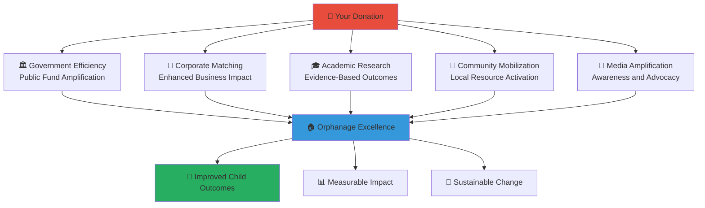

# Donor Onboarding Guide
## Creating Lasting Impact Through Strategic Giving for Indonesian Children

> **Purpose**: Enable donors to maximize their impact on vulnerable children's lives through transparent, accountable, and strategic giving that directly improves orphanage operations and child welfare outcomes while building meaningful connections with the communities they support.

---

## 💝 Donor Impact Philosophy

### Transformational Giving for Child Welfare
Your donations create direct, measurable improvements in children's lives:

```yaml
Impact-Driven Giving:
  Child-Centered Focus: Every donation directly benefits vulnerable children
  Transparent Accountability: Complete visibility into donation impact and usage
  
Sustainable Support Model:
  Long-term Relationships: Building lasting partnerships with orphanages
  Community Integration: Connecting financial support with broader community engagement
```

### Indonesian Cultural Giving Integration
Honoring traditional Indonesian values in modern philanthropy:



---

## 🚀 Donor Quick Start Journey

### Phase 1: Welcome and Registration (15 minutes)

#### Creating Your Donor Profile
```yaml
Account Setup Process:
  Visit: donors.merajutasa.id/register
  Basic Information:
    - Contact details and communication preferences
    - Geographic location and area of interest
    - Giving capacity and frequency preferences
    - Cause areas of particular interest
  
Donor Type Selection:
  Individual Donor: Personal charitable giving and family philanthropy
  Family Foundation: Multi-generational family giving coordination
  Corporate Donor: Business charitable giving and CSR integration
  Community Group: Religious organizations, clubs, and community associations
```

#### Security and Privacy Setup
```yaml
Financial Security:
  Secure Payment Processing: Bank-grade encryption for all financial transactions
  Donation Authentication: Multi-factor authentication for donation processing
  Privacy Controls: Anonymity options and personal information protection
  
Communication Preferences:
  Update Frequency: Choose how often you receive impact updates
  Content Types: Select types of content and communication you want to receive
  Language Preferences: Indonesian, English, or regional language options
```

### Phase 2: Impact Alignment and Giving Strategy (30 minutes)

#### Cause Area Selection and Prioritization
```yaml
Child Welfare Focus Areas:
  Basic Needs Support:
    - Food security and nutrition programs
    - Healthcare access and medical care
    - Safe housing and facility improvements
    - Educational materials and school supplies
  
  Development Programs:
    - Educational tutoring and skill development
    - Vocational training and career preparation
    - Arts, music, and recreational activities
    - Mental health and counseling services
  
  System Strengthening:
    - Staff training and professional development
    - Technology infrastructure and digital literacy
    - Community integration and family reunification
    - Long-term sustainability and capacity building
```

#### Donation Strategy Development
```yaml
Giving Approaches:
  Regular Monthly Giving: Consistent monthly support for operational stability
  Project-Specific Donations: Funding specific programs or capital improvements
  Emergency Response Giving: Crisis support and urgent need response
  Endowment Contributions: Long-term sustainability and capacity building
  
Impact Preferences:
  Direct Child Support: Sponsorship and direct support for individual children
  Orphanage Operations: General operating support for overall facility improvement
  Community Development: Supporting broader community engagement and development
  Innovation Funding: Supporting new technologies and innovative approaches
```

#### Geographic and Demographic Focus
```yaml
Geographic Preference Options:
  National Impact: Supporting orphanages across all of Indonesia
  Regional Focus: Concentrating support in specific provinces or regions
  Local Community: Supporting orphanages in your immediate community
  Rural Priority: Focusing on underserved rural orphanages
  
Demographic Priorities:
  Age Groups: Infants, school-age children, adolescents, or young adults
  Special Needs: Children with disabilities or special healthcare requirements
  Educational Support: Children with specific educational needs or talents
  Family Reunification: Supporting children working toward family reunification
```

### Phase 3: First Donation and Impact Tracking Setup (20 minutes)

#### Making Your First Donation
```yaml
Donation Process:
  Amount Selection: Choose donation amount based on your giving capacity
  Allocation Preferences: Specify how you want your donation used
  Frequency Setup: One-time, monthly, quarterly, or annual giving
  Payment Method: Secure credit card, bank transfer, or corporate giving integration
  
Documentation and Tax Benefits:
  Receipt Generation: Automatic tax-deductible receipt generation
  Impact Documentation: Initial impact projection and expected outcomes
  Stewardship Planning: Schedule for ongoing impact updates and communication
  Transparency Commitment: Access to real-time tracking and reporting
```

#### Impact Tracking Dashboard Setup
```yaml
Personal Impact Dashboard:
  Donation History: Complete record of all donations and their allocation
  Real-Time Impact: Live updates on how your donations are being used
  Child Outcomes: Anonymous progress reports on children benefiting from your support
  Orphanage Improvements: Facility and program improvements funded by your donations
  
Comparative Analytics:
  Peer Comparison: Anonymous comparison with other donors of similar giving levels
  Community Impact: Your contribution to broader community and regional improvements
  National Progress: Your role in national child welfare improvement efforts
  International Recognition: Indonesia's progress compared to global child welfare standards
```

---

## 🎯 Donation Impact and Transparency

### Real-Time Impact Tracking

#### Individual Donation Impact
```yaml
Direct Impact Measurement:
  Child Outcomes:
    - Number of children directly benefiting from your donations
    - Educational progress and academic achievement improvements
    - Health and nutrition improvements
    - Social and emotional development progress
  
  Facility Improvements:
    - Infrastructure upgrades and facility improvements funded
    - Technology enhancements and digital access improvements
    - Safety and security improvements implemented
    - Environmental and sustainability improvements
  
  Program Development:
    - New programs launched with your support
    - Existing program expansion and improvement
    - Staff training and professional development funded
    - Community engagement initiatives supported
```

#### Collective Impact Participation
```yaml
Community Impact Contributions:
  Local Community Development:
    - Combined donor impact in your geographic region
    - Community resource mobilization and local partnership development
    - Economic development and local business support
    - Cultural preservation and celebration support
  
  National Child Welfare Progress:
    - Your contribution to Indonesia's overall child welfare improvement
    - Policy influence and advocacy supported by donor evidence
    - Research and innovation funding contributions
    - International recognition and best practice development
```

### Financial Transparency and Accountability

#### Donation Usage Transparency
```yaml
Fund Allocation Breakdown:
  Direct Child Support (75%):
    - Food, healthcare, education, and basic needs
    - Individual child development programs
    - Family reunification and support services
    - Emergency response and crisis support
  
  Facility Operations (15%):
    - Staff salaries and professional development
    - Facility maintenance and infrastructure
    - Technology and equipment upgrades
    - Safety and security improvements
  
  Program Development (7%):
    - New program development and innovation
    - Community engagement and outreach
    - Research and evaluation activities
    - Best practice development and sharing
  
  Administrative Support (3%):
    - Platform maintenance and technology support
    - Financial management and transparency reporting
    - Compliance and regulatory support
    - Donor stewardship and communication
```

#### Financial Accountability Measures
```yaml
Oversight and Auditing:
  Independent Financial Audits: Annual third-party financial audits and public reporting
  Government Oversight: Compliance with Indonesian charity and child welfare regulations
  Donor Advisory Committee: Donor representation in strategic decision-making
  Impact Verification: Independent verification of impact claims and outcomes
  
Continuous Improvement:
  Efficiency Measurement: Regular assessment of program efficiency and cost-effectiveness
  Best Practice Integration: Continuous improvement based on international best practices
  Innovation Investment: Ongoing investment in new technologies and approaches
  Sustainability Planning: Long-term financial sustainability and growth planning
```

---

## 🤝 Donor Engagement and Community Building

### Donor Community Network

#### Peer Connection and Learning
```yaml
Donor Community Features:
  Regional Donor Networks: Connect with other donors in your area for collaboration
  Interest-Based Groups: Join groups focused on specific cause areas or approaches
  Corporate Giving Networks: Business-focused giving coordination and partnership
  Family Philanthropy Support: Multi-generational giving planning and education
  
Learning and Development:
  Philanthropy Education: Training on effective giving and impact measurement
  Site Visits: Organized visits to orphanages and programs supported by donations
  Impact Seminars: Regular education on child welfare issues and effective interventions
  Cultural Integration: Understanding Indonesian culture and effective cross-cultural giving
```

#### Recognition and Appreciation
```yaml
Donor Recognition Programs:
  Impact Achievements: Recognition for significant impact milestones and contributions
  Community Leadership: Acknowledgment of donors who inspire and lead others
  Innovation Support: Recognition for donors supporting innovative approaches
  Lifetime Giving: Milestone recognition for long-term commitment and support
  
Appreciation Events:
  Annual Donor Celebration: National celebration of donor community and impact
  Regional Gatherings: Local donor appreciation and networking events
  Virtual Recognition: Online celebration and recognition for international donors
  Cultural Events: Indonesian cultural celebration and education for donor community
```

### Volunteer and Engagement Opportunities

#### Beyond Financial Giving
```yaml
Skills-Based Volunteering:
  Professional Expertise: Contributing professional skills to orphanage operations
  Mentorship Programs: Providing career guidance and life skills mentoring
  Board Service: Serving on orphanage boards and advisory committees
  Advocacy Support: Supporting policy advocacy and awareness campaigns
  
Family Engagement:
  Family Volunteering: Opportunities for donors and their families to volunteer together
  Cultural Exchange: Supporting cultural exchange and learning opportunities
  Educational Support: Tutoring and educational support for children
  Recreation Programs: Organizing and supporting recreational activities
```

#### International Donor Support
```yaml
Global Giving Community:
  International Partnerships: Connecting with global donors and international organizations
  Cross-Cultural Learning: Educational opportunities about Indonesian culture and child welfare
  Remote Engagement: Virtual volunteering and support opportunities
  Advocacy Support: International advocacy for Indonesian child welfare
  
Technology-Enabled Engagement:
  Virtual Mentorship: Online mentoring and educational support for children
  Digital Literacy Support: Supporting technology education and digital access
  Remote Professional Services: Providing professional services through technology
  Global Best Practice Sharing: Contributing international expertise and knowledge
```

---

## 📊 Donation Optimization and Impact Maximization

### Strategic Giving Approaches

#### Tax-Efficient Giving Strategies
```yaml
Tax Optimization for Indonesian Donors:
  Corporate Tax Benefits: Maximizing business tax benefits for corporate giving
  Personal Tax Deductions: Optimizing personal charitable deduction strategies
  Asset Giving: Strategies for donating appreciated assets and property
  Estate Planning: Incorporating charitable giving into estate and legacy planning
  
International Tax Considerations:
  Cross-Border Giving: Tax-efficient strategies for international donors
  Corporate International Giving: Multinational corporate giving strategies
  Foundation Establishment: Setting up charitable foundations for strategic giving
  Tax Treaty Benefits: Leveraging international tax treaties for efficient giving
```

#### Impact Amplification Strategies
```yaml
Matching and Challenge Gifts:
  Corporate Matching: Leveraging employer matching programs for increased impact
  Challenge Gifts: Creating challenge grants to inspire additional community giving
  Peer Fundraising: Engaging personal networks to amplify giving impact
  Social Media Campaigns: Using digital platforms to expand giving influence
  
Collaborative Giving:
  Giving Circles: Forming or joining donor collaboratives for increased impact
  Foundation Partnerships: Partnering with established foundations for leverage
  Government Collaboration: Leveraging government matching funds and partnerships
  Business Integration: Integrating giving with business operations for mutual benefit
```

### Advanced Donor Tools and Services

#### Sophisticated Giving Management
```yaml
Portfolio Approach to Giving:
  Diversified Impact: Supporting multiple orphanages and program types
  Risk Management: Balancing established programs with innovative approaches
  Performance Tracking: Monitoring and adjusting giving strategy based on outcomes
  Long-term Planning: Multi-year giving commitments and strategic planning
  
Family Philanthropy Tools:
  Multi-Generational Planning: Involving children and grandchildren in giving decisions
  Family Mission Development: Creating family philanthropic mission and values
  Education and Engagement: Teaching family members about effective giving
  Legacy Planning: Incorporating charitable giving into family legacy and estate planning
```

#### Impact Investment Integration
```yaml
Blended Finance Approaches:
  Social Impact Bonds: Investing in outcome-based funding for child welfare programs
  Microfinance Integration: Supporting economic development in communities around orphanages
  Social Enterprise Investment: Investing in businesses that support child welfare
  Capacity Building Investment: Long-term investment in orphanage capacity and sustainability
  
Innovation Funding:
  Technology Development: Supporting development of new technologies for child welfare
  Research Funding: Supporting academic research on effective child welfare interventions
  Pilot Program Support: Funding innovative pilot programs and approaches
  Scale-Up Investment: Supporting the scaling of proven effective interventions
```

---

## 📞 Donor Support and Services

### Comprehensive Donor Support
**Donor Services Hotline**: +62-XXX-XXX-XXXX  
**Donor Advisor Email**: advisors@merajutasa.id  
**Tax Planning Support**: tax-planning@merajutasa.id  
**Impact Analytics**: impact@merajutasa.id

### Specialized Support Services
```yaml
High-Net-Worth Donor Services:
  Personal Donor Advisor: Dedicated advisor for strategic giving planning
  Custom Impact Reporting: Personalized impact reporting and analysis
  Site Visit Coordination: Organized visits to orphanages and programs
  Legacy Planning: Estate and legacy giving planning support
  
Corporate Giving Support:
  CSR Integration: Integration of donations with corporate social responsibility programs
  Employee Engagement: Employee volunteer and giving coordination
  Brand Partnership: Authentic brand integration with child welfare causes
  Impact Communications: Corporate impact storytelling and communications support
  
International Donor Support:
  Cross-Border Giving: Support for international donors and tax considerations
  Cultural Orientation: Indonesian cultural education and sensitivity training
  Remote Engagement: Virtual volunteering and engagement opportunities
  Global Network: Connection to international donor community and best practices
```

### Donor Education and Development
```yaml
Ongoing Learning Opportunities:
  Monthly Webinars: Regular education on child welfare issues and effective giving
  Annual Conference: National donor education and networking conference
  Best Practice Sharing: Access to research and best practices in charitable giving
  Cultural Immersion: Opportunities to learn about Indonesian culture and communities
  
Professional Development:
  Philanthropy Certification: Professional certification in strategic philanthropy
  Board Development: Training for serving on nonprofit boards and committees
  Impact Measurement: Education on measuring and maximizing charitable impact
  Advocacy Training: Training on effective advocacy for child welfare policy
```

---

## 🎉 Donor Success and Recognition

### Measuring Your Philanthropic Success
```yaml
Personal Impact Metrics:
  Children Served: Total number of children directly benefiting from your donations
  Educational Outcomes: Educational progress and achievement improvements supported
  Health Improvements: Health and nutrition improvements funded by your giving
  Family Reunification: Number of children reunified with families through your support
  
Community Development:
  Orphanage Improvements: Facility improvements and capacity building supported
  Staff Development: Professional development and training funded
  Community Integration: Community engagement and local partnership development
  Innovation Support: New programs and approaches supported by your giving
  
Long-term Legacy:
  Sustainable Change: Long-term sustainable improvements in child welfare
  Policy Influence: Policy changes and advocacy successes supported
  Cultural Impact: Cultural preservation and celebration supported
  International Recognition: Indonesia's child welfare progress and international recognition
```

### Donor Legacy and Recognition
```yaml
Legacy Building Opportunities:
  Named Programs: Opportunities to name programs or facilities in honor of giving
  Scholarship Funds: Establishing educational scholarship funds for children
  Innovation Awards: Recognition for supporting innovative approaches to child welfare
  Mentorship Programs: Long-term mentorship and relationship building with children
  
Community Recognition:
  Donor Hall of Fame: Recognition for exceptional commitment to child welfare
  Community Leadership: Acknowledgment of leadership in inspiring others to give
  Cultural Bridge Building: Recognition for supporting cross-cultural understanding
  International Impact: Recognition for supporting Indonesia's global child welfare leadership
```

---

*Transform lives and create lasting legacy through strategic, transparent, and impactful giving that honors Indonesian values while improving child welfare outcomes.*

**Ready to make a difference?** Start your donor journey at donors.merajutasa.id and join thousands of donors across Indonesia and around the world who are creating lasting positive change for vulnerable children.
