# Family Member Engagement Guide
## Strengthening Connections and Supporting Children in Care

> **Purpose**: Enable family members to maintain meaningful relationships with children in institutional care while supporting their development and well-being through safe, structured engagement that honors family bonds and promotes positive outcomes for children.

---

## 👨‍👩‍👧‍👦 Family Connection Philosophy

### Preserving Family Bonds
Family relationships remain vital for children in care, providing identity, connection, and emotional support:

```yaml
Core Family Values:
  Unconditional Love: Family bonds that transcend physical separation
  Cultural Identity: Preserving family traditions and cultural heritage
  
Connection Principles:
  Child-Centered Approach: All family engagement prioritizes children's best interests
  Safe Relationships: Structured interactions that protect and support children
```

### Indonesian Family Values Integration
Honoring traditional Indonesian family concepts within modern care frameworks:

```mermaid
graph TD
    A[👨‍👩‍👧‍👦 Family Network] --> B[👶 Child in Care]
    C[🏠 Orphanage Support] --> B
    D[🤝 Community Resources] --> B
    E[🏛️ Government Services] --> B
    
    B --> F[💕 Emotional Well-being]
    B --> G[🎓 Educational Success]
    B --> H[🌱 Personal Development]
    B --> I[🌍 Cultural Identity]
    
    F --> J[🎯 Positive Life Outcomes]
    G --> J
    H --> J
    I --> J
    
    style J fill:#27AE60
    style A fill:#E74C3C
    style B fill:#3498DB
```



---

## 🚀 Family Engagement Quick Start

### Phase 1: Registration and Assessment (45 minutes)

#### Creating Your Family Profile
```yaml
Account Setup Process:
  Visit: families.merajutasa.id/register
  Family Information:
    - Relationship to child in care
    - Contact information and communication preferences
    - Family composition and household members
    - Geographic location and availability for visits
  
Relationship Documentation:
  Legal Relationship Verification: Documentation of family relationship to child
  Background Screening: Safety screening to ensure child protection
  Assessment of Stability: Evaluation of family stability and support capacity
  Cultural and Religious Alignment: Understanding of shared cultural values
```

#### Understanding Your Role in Your Child's Care
```yaml
Family Role Clarification:
  Primary vs. Extended Family: Understanding your specific role and relationship
  Legal Status: Understanding legal custody and guardianship arrangements
  Care Team Integration: How you fit into your child's broader care team
  Communication Boundaries: Appropriate communication and interaction guidelines
  
Collaborative Care Planning:
  Goal Alignment: Aligning family goals with professional care objectives
  Support Coordination: Coordinating family support with orphanage services
  Cultural Integration: Incorporating family cultural practices into care planning
  Future Planning: Participating in long-term planning for your child's future
```

### Phase 2: Communication and Connection Setup (30 minutes)

#### Safe Communication Channels
```yaml
Platform Communication Features:
  Secure Messaging: Encrypted messaging system for family-child communication
  Video Calling: Supervised video calls with your child
  Photo and Story Sharing: Safe sharing of family photos and updates
  Cultural Content Sharing: Sharing family traditions and cultural materials
  
Communication Guidelines:
  Scheduled Interactions: Regular, scheduled communication times
  Supervised Communication: Professional oversight to ensure positive interactions
  Age-Appropriate Content: Communication appropriate for your child's developmental level
  Cultural Sensitivity: Respectful communication that honors diverse perspectives
```

#### Establishing Connection Routines
```yaml
Regular Communication Schedule:
  Weekly Check-ins: Regular weekly communication with your child
  Special Occasion Contact: Birthday, holiday, and milestone celebration communication
  Emergency Communication: Protocols for urgent family communication needs
  Cultural Event Participation: Virtual participation in family cultural events
  
Relationship Building Activities:
  Storytelling Sessions: Sharing family stories and cultural narratives
  Cultural Learning: Teaching traditional skills, recipes, or crafts
  Educational Support: Participating in homework help and educational activities
  Creative Projects: Collaborative art, music, or writing projects
```

### Phase 3: Integration into Care Planning (1-2 hours)

#### Collaborative Care Team Participation
```yaml
Care Team Membership:
  Family Representation: Formal representation in care planning meetings
  Goal Setting Participation: Active participation in setting goals for your child
  Progress Monitoring: Regular review of your child's progress and development
  Service Coordination: Coordination with other care team members and services
  
Cultural Integration Planning:
  Cultural Identity Preservation: Ensuring your child maintains connection to family culture
  Religious Practice: Coordination of religious and spiritual practices
  Traditional Learning: Incorporation of family traditions and cultural learning
  Language Maintenance: Supporting your child's native language development
```

#### Family Reunification Planning
```yaml
Reunification Assessment and Planning:
  Reunification Feasibility: Professional assessment of reunification potential
  Family Preparation: Support and services to prepare family for reunification
  Gradual Transition Planning: Step-by-step reunification process planning
  Support Service Coordination: Coordination of support services for successful reunification
  
Alternative Permanency Planning:
  Long-term Care Planning: Planning for long-term care when reunification isn't possible
  Extended Family Options: Exploring placement with extended family members
  Guardianship Arrangements: Legal guardianship planning and support
  Ongoing Relationship Maintenance: Maintaining family relationships regardless of living arrangements
```

---

## 💕 Supporting Your Child's Development

### Educational and Academic Support

#### Participating in Your Child's Education
```yaml
Educational Involvement:
  Academic Progress Monitoring: Regular updates on your child's educational progress
  Homework Support: Helping with homework during scheduled communication times
  Educational Goal Setting: Participating in setting educational goals and milestones
  School Event Participation: Virtual participation in school events and celebrations
  
Cultural and Traditional Education:
  Cultural Knowledge Sharing: Teaching family history, traditions, and cultural practices
  Language Development: Supporting development of native language and cultural literacy
  Traditional Skills: Teaching traditional crafts, cooking, or other family skills
  Values Education: Sharing family values and moral teachings
```

#### Supporting Special Needs and Challenges
```yaml
Special Educational Support:
  Learning Disability Support: Participating in special education planning and support
  Behavioral Support: Coordinating behavioral support strategies across settings
  Therapeutic Support: Participating in therapy and counseling services
  Medical Care Coordination: Participating in healthcare planning and decision-making
  
Family Therapy and Counseling:
  Family Therapy Participation: Engaging in family therapy to strengthen relationships
  Individual Counseling Support: Supporting your child's individual counseling process
  Trauma-Informed Care: Understanding and supporting trauma recovery
  Grief and Loss Support: Helping your child process separation and loss issues
```

### Emotional and Social Development

#### Emotional Support and Connection
```yaml
Emotional Relationship Building:
  Emotional Availability: Being emotionally present and supportive during communications
  Affection Expression: Appropriate ways to express love and affection
  Comfort and Reassurance: Providing comfort during difficult times
  Celebration and Joy: Sharing in your child's achievements and happy moments
  
Identity and Self-Esteem Support:
  Family Identity: Helping your child understand their place in the family
  Cultural Pride: Building pride in family and cultural heritage
  Personal Strengths: Recognizing and celebrating your child's unique strengths
  Future Visioning: Helping your child envision positive future possibilities
```

#### Social Skills and Relationship Development
```yaml
Social Learning Support:
  Relationship Skills: Teaching healthy relationship skills and boundaries
  Communication Skills: Supporting development of effective communication abilities
  Conflict Resolution: Teaching peaceful conflict resolution and problem-solving
  Empathy Development: Fostering empathy and understanding of others
  
Peer Relationship Support:
  Friendship Skills: Supporting development of healthy friendships
  Social Integration: Supporting integration into peer groups and communities
  Cultural Bridge Building: Helping child navigate between family and care cultures
  Leadership Development: Encouraging positive leadership and helping behaviors
```

---

## 🏠 Family Reunification and Permanency Planning

### Reunification Preparation and Support

#### Family Preparation Process
```yaml
Family Readiness Assessment:
  Stability Evaluation: Assessment of family stability and readiness for reunification
  Housing and Environment: Evaluation of home environment and safety
  Financial Preparedness: Assessment of financial capacity to support child
  Support System Evaluation: Review of family support systems and resources
  
Family Strengthening Services:
  Parenting Skills Training: Education and training in effective parenting techniques
  Family Therapy: Professional therapy to address family relationship issues
  Substance Abuse Treatment: Treatment for addiction issues that may affect child safety
  Mental Health Services: Mental health support for family members as needed
```

#### Gradual Reunification Process
```yaml
Transition Planning:
  Graduated Visits: Increasingly longer and more frequent visits with family
  Overnight Stays: Supervised overnight visits as appropriate
  Extended Stays: Week-long or longer stays to test family readiness
  Full Reunification: Complete return to family with ongoing support services
  
Post-Reunification Support:
  Ongoing Case Management: Continued professional support and monitoring
  Family Support Services: Access to supportive services and resources
  Crisis Intervention: Emergency support during difficult transitions
  Long-term Follow-up: Extended monitoring to ensure sustainable reunification
```

### Alternative Permanency Options

#### Extended Family Placement
```yaml
Kinship Care Assessment:
  Extended Family Evaluation: Assessment of extended family members for placement
  Cultural Compatibility: Evaluation of cultural and value alignment
  Stability and Support: Assessment of extended family stability and support capacity
  Child Preference: Consideration of child's preferences and comfort level
  
Kinship Care Support:
  Financial Support: Financial assistance for kinship caregivers
  Training and Education: Training in child care and development
  Ongoing Support Services: Continued professional support and guidance
  Legal Support: Assistance with legal guardianship and custody arrangements
```

#### Long-term Care with Family Connection
```yaml
Ongoing Relationship Maintenance:
  Regular Communication: Continued communication even when reunification isn't possible
  Visit Coordination: Regular in-person visits as appropriate and safe
  Special Event Participation: Participation in family events and celebrations
  Cultural Connection: Continued connection to family culture and traditions
  
Legal and Financial Support:
  Legal Advocacy: Support for legal rights and family representation
  Financial Assistance: Help with costs associated with maintaining family relationships
  Transportation Support: Assistance with transportation for visits and communication
  Professional Mediation: Professional support for complex family relationship issues
```

---

## 🌍 Cultural Preservation and Identity Development

### Maintaining Cultural Connections

#### Cultural Education and Preservation
```yaml
Traditional Knowledge Sharing:
  Family History: Sharing family genealogy and historical narratives
  Cultural Practices: Teaching traditional ceremonies, rituals, and customs
  Traditional Skills: Passing on traditional crafts, cooking, and life skills
  Language Preservation: Maintaining and developing native language abilities
  
Religious and Spiritual Development:
  Religious Education: Teaching family religious beliefs and practices
  Spiritual Guidance: Providing spiritual support and guidance
  Community Connection: Connecting child to religious and spiritual communities
  Values Integration: Integrating religious and spiritual values into daily life
```

#### Cultural Bridge Building
```yaml
Multi-Cultural Navigation:
  Cultural Integration: Helping child navigate between family and care cultures
  Identity Development: Supporting development of multi-cultural identity
  Cultural Mediation: Helping resolve conflicts between different cultural expectations
  Pride and Belonging: Building pride in cultural heritage and sense of belonging
  
Community Integration:
  Cultural Community Connection: Connecting child to broader cultural community
  Cultural Events: Participation in cultural festivals and celebrations
  Peer Cultural Exchange: Facilitating cultural exchange with peers from different backgrounds
  Cultural Advocacy: Teaching child to advocate for cultural understanding and respect
```

---

## 📊 Family Impact and Outcomes Measurement

### Relationship Quality Assessment

#### Connection Strength Measurement
```yaml
Relationship Quality Indicators:
  Communication Frequency: Regular, consistent communication patterns
  Emotional Closeness: Strength of emotional bond and attachment
  Mutual Support: Evidence of mutual care and support between family and child
  Conflict Resolution: Ability to resolve conflicts constructively
  
Child Well-being Outcomes:
  Emotional Stability: Improved emotional regulation and mental health
  Educational Progress: Academic achievement and engagement in learning
  Social Development: Healthy relationship skills and social integration
  Cultural Identity: Strong sense of cultural identity and belonging
```

#### Long-term Impact Assessment
```yaml
Family System Functioning:
  Family Cohesion: Strength and unity of family relationships
  Communication Patterns: Healthy, open communication between family members
  Problem-Solving Capacity: Family's ability to address challenges together
  Support Network: Strength of extended family and community support systems
  
Child Life Trajectory:
  Academic Achievement: Educational success and post-secondary planning
  Career Development: Vocational preparation and career planning
  Relationship Skills: Ability to form healthy relationships
  Community Contribution: Engagement in community service and leadership
```

### Continuous Improvement and Support

#### Family Development Planning
```yaml
Ongoing Skill Development:
  Parenting Skills Enhancement: Continued learning in effective parenting
  Communication Skills: Improving family communication patterns
  Conflict Resolution: Developing better conflict resolution skills
  Cultural Competency: Growing understanding of multicultural dynamics
  
Support Network Expansion:
  Professional Support: Building relationships with helpful professionals
  Peer Support: Connecting with other families in similar situations
  Community Resources: Identifying and accessing community support resources
  Advocacy Skills: Developing skills to advocate for your child and family
```

---

## 📞 Family Support and Resources

### Comprehensive Family Support Services
**Family Support Hotline**: +62-XXX-XXX-XXXX  
**Family Counseling Services**: family-counseling@merajutasa.id  
**Reunification Support**: reunification@merajutasa.id  
**Cultural Preservation Support**: cultural-support@merajutasa.id

### Specialized Support Programs
```yaml
Family Education Programs:
  Parenting Classes: Regular training in effective parenting techniques
  Cultural Competency Training: Understanding multicultural family dynamics
  Communication Skills Workshops: Improving family communication patterns
  Trauma-Informed Care Training: Understanding and supporting children who have experienced trauma
  
Peer Support Networks:
  Family Support Groups: Groups for families with children in care
  Cultural Community Groups: Connection with families from similar cultural backgrounds
  Reunification Support Groups: Support from families who have experienced reunification
  Extended Family Networks: Support for grandparents, aunts, uncles, and other extended family
```

### Professional Support Services
```yaml
Therapeutic Services:
  Family Therapy: Professional therapy for family relationship issues
  Individual Counseling: Personal counseling for family members
  Child Therapy: Specialized therapy for children's emotional and behavioral needs
  Trauma Therapy: Specialized treatment for trauma-related issues
  
Legal and Advocacy Support:
  Legal Representation: Legal support for custody and family law issues
  Rights Advocacy: Advocacy for family rights and child welfare
  System Navigation: Help navigating child welfare and legal systems
  Cultural Mediation: Professional mediation for cultural conflicts and misunderstandings
```

---

## 🎉 Celebrating Family Connections and Success

### Recognition and Milestone Celebration
```yaml
Family Achievement Recognition:
  Reunification Success: Celebration of successful family reunification
  Relationship Milestones: Recognition of strengthened family relationships
  Cultural Preservation: Acknowledgment of successful cultural transmission
  Community Contribution: Recognition of family contributions to community welfare
  
Child Achievement Celebration:
  Educational Milestones: Celebrating your child's educational achievements
  Personal Growth: Recognizing your child's personal development and maturity
  Cultural Pride: Celebrating your child's cultural identity and pride
  Future Planning: Celebrating progress toward future goals and dreams
```

### Building Legacy and Future Vision
```yaml
Family Legacy Development:
  Generational Wisdom: Passing on family wisdom and life lessons
  Cultural Heritage: Preserving and transmitting cultural heritage
  Values Transmission: Sharing family values and moral principles
  Future Visioning: Creating positive vision for family future
  
Community Impact:
  Cultural Contribution: Contributing to broader cultural preservation efforts
  Family Advocacy: Advocating for family-centered approaches to child welfare
  Peer Support: Supporting other families experiencing similar challenges
  System Improvement: Contributing to improvements in child welfare systems
```

---

*Strengthen family bonds and support your child's development through meaningful connection, cultural preservation, and collaborative care that honors your family's unique strengths and traditions.*

**Ready to strengthen your family connections?** Begin your family engagement journey at families.merajutasa.id and access the support and resources you need to maintain meaningful relationships with your child while supporting their growth and development.
