# Volunteer Engagement Guide
## Building Meaningful Connections and Creating Positive Change for Indonesian Children

> **Purpose**: Enable volunteers to make meaningful contributions to child welfare through skills-based volunteering, relationship building, and community engagement that honors Indonesian cultural values while creating sustainable positive impact for vulnerable children.

---

## 🤝 Volunteer Impact Philosophy

### Community-Powered Child Welfare
Your volunteer contribution creates direct, lasting change in children's lives:

```yaml
Volunteer Impact Values:
  Relationship-Centered: Building genuine connections with children and communities
  Skill-Based Contribution: Using your unique talents to address specific needs
  
Cultural Integration:
  Gotong Royong: Embodying Indonesian spirit of mutual assistance
  Respect and Humility: Honoring community wisdom and local knowledge
```

### Volunteer Journey Framework
Structured pathway from orientation to leadership that grows with your commitment:

```mermaid
graph TD
    A[🤝 Welcome and Orientation] --> B[📚 Training and Preparation]
    B --> C[🎯 Skill Assessment and Matching]
    C --> D[👥 Community Integration]
    D --> E[🏆 Active Volunteering]
    E --> F[📈 Growth and Leadership]
    
    F --> G[🌟 Volunteer Outcomes]
    E --> G
    D --> G
    
    G --> H[👶 Improved Child Lives]
    G --> I[🏠 Stronger Orphanages]
    G --> J[🌍 Resilient Communities]
    
    style H fill:#27AE60
    style A fill:#3498DB
    style F fill:#E74C3C
```



---

## 🚀 Volunteer Quick Start Journey

### Phase 1: Welcome and Registration (30 minutes)

#### Creating Your Volunteer Profile
```yaml
Account Setup Process:
  Visit: volunteers.merajutasa.id/register
  Basic Information:
    - Contact details and emergency contacts
    - Geographic location and travel willingness
    - Available time commitment and scheduling preferences
    - Language skills and communication preferences
  
Background and Interests:
  Professional Background: Education, career experience, and specialized skills
  Volunteer Experience: Previous volunteer work and areas of interest
  Cause Passion: Specific areas of child welfare you're most passionate about
  Cultural Interests: Interest in Indonesian culture and community integration
```

#### Initial Safety and Security Screening
```yaml
Background Check Process:
  Identity Verification: Government ID verification and identity confirmation
  Criminal Background Check: Comprehensive background screening for child safety
  Reference Checks: Professional and personal references for character verification
  Health Screening: Basic health screening and vaccination requirements
  
Child Protection Training:
  Safeguarding Basics: Fundamental child protection principles and practices
  Reporting Procedures: How to recognize and report child safety concerns
  Appropriate Boundaries: Professional boundaries in working with vulnerable children
  Cultural Sensitivity: Respectful interaction with children from diverse backgrounds
```

### Phase 2: Skills Assessment and Opportunity Matching (45 minutes)

#### Comprehensive Skills Inventory
```yaml
Professional Skills Assessment:
  Technical Skills:
    - Education and tutoring capabilities
    - Healthcare and medical expertise
    - Technology and digital literacy
    - Business and administrative skills
  
  Creative and Recreational Skills:
    - Arts, crafts, and creative expression
    - Music, dance, and performance arts
    - Sports and physical recreation
    - Cooking and life skills instruction
  
  Interpersonal and Leadership Skills:
    - Mentoring and counseling abilities
    - Group facilitation and leadership
    - Event planning and coordination
    - Communication and language skills
```

#### Interest and Availability Matching
```yaml
Volunteer Opportunity Categories:
  Direct Child Interaction:
    - Educational tutoring and homework assistance
    - Recreational activities and games
    - Mentoring and life skills guidance
    - Arts, crafts, and creative programs
  
  Orphanage Support:
    - Administrative assistance and data entry
    - Facility maintenance and improvement
    - Event planning and coordination
    - Technology support and training
  
  Community Outreach:
    - Fundraising and community engagement
    - Media and communications support
    - Local business partnership development
    - Family reunification support
  
  Specialized Services:
    - Professional consulting (legal, accounting, healthcare)
    - Skills training and vocational guidance
    - Technology development and support
    - Research and evaluation assistance
```

### Phase 3: Training and Preparation (2-4 hours over 1-2 weeks)

#### Mandatory Training Modules
```yaml
Child Protection and Safety (90 minutes):
  Child Safeguarding: Protecting vulnerable children from harm
  Trauma-Informed Care: Understanding and responding to childhood trauma
  Appropriate Interactions: Professional boundaries and ethical guidelines
  Emergency Procedures: Crisis response and emergency protocols
  
Indonesian Cultural Competency (60 minutes):
  Cultural Values: Understanding Pancasila and Indonesian cultural principles
  Communication Styles: Effective cross-cultural communication
  Religious Sensitivity: Respecting diverse religious practices and beliefs
  Traditional Practices: Honoring local customs and traditional wisdom
  
Platform and Procedure Training (45 minutes):
  Technology Platform: Navigating volunteer portal and communication tools
  Scheduling and Coordination: Managing volunteer commitments and schedules
  Reporting and Documentation: Recording volunteer activities and impact
  Support Resources: Accessing help, guidance, and professional development
```

#### Role-Specific Training
```yaml
Educational Volunteers:
  Child Development: Understanding developmental stages and learning needs
  Educational Methods: Effective tutoring and teaching techniques
  Learning Disabilities: Supporting children with special educational needs
  Progress Tracking: Documenting and celebrating educational achievements
  
Recreational Volunteers:
  Activity Planning: Designing age-appropriate and engaging activities
  Safety Management: Ensuring physical and emotional safety during activities
  Inclusive Programming: Adapting activities for children with different abilities
  Cultural Integration: Incorporating Indonesian games, stories, and traditions
  
Professional Service Volunteers:
  Ethical Guidelines: Professional ethics in volunteer service contexts
  Scope of Practice: Understanding appropriate boundaries for professional services
  Documentation Requirements: Professional documentation and record-keeping
  Collaboration Protocols: Working effectively with orphanage staff and other professionals
```

---

## 🎯 Volunteer Opportunities and Roles

### Direct Child Interaction Roles

#### Educational Support and Tutoring
```yaml
Elementary Education Support:
  Reading and Literacy: Helping children develop reading skills and love of books
  Mathematics Support: Basic math tutoring and problem-solving skills
  Science Exploration: Hands-on science experiments and exploration
  Indonesian Language: Supporting Indonesian language development and literacy
  
Secondary Education Support:
  Subject-Specific Tutoring: Advanced tutoring in specific academic subjects
  College Preparation: University entrance exam preparation and guidance
  Career Exploration: Introducing children to different career paths and opportunities
  Life Skills Development: Teaching practical life skills and independence
  
Special Needs Education:
  Individualized Support: One-on-one support for children with learning disabilities
  Adaptive Technology: Using technology to support learning for children with special needs
  Behavioral Support: Positive behavior support and social skills development
  Family Communication: Supporting communication between children and families
```

#### Mentoring and Life Skills Development
```yaml
Personal Mentoring:
  One-on-One Relationships: Building lasting mentoring relationships with individual children
  Goal Setting: Helping children set and achieve personal and academic goals
  Problem Solving: Teaching problem-solving skills and decision-making
  Emotional Support: Providing emotional support and encouragement
  
Group Mentoring:
  Peer Leadership: Teaching leadership skills and peer support
  Team Building: Facilitating group activities and cooperation
  Conflict Resolution: Teaching peaceful conflict resolution and communication
  Cultural Identity: Supporting children in developing positive cultural identity
  
Transition Support:
  Aging Out Support: Supporting older children transitioning to independence
  Job Readiness: Teaching job search skills and interview preparation
  Financial Literacy: Basic financial management and budgeting skills
  Community Integration: Supporting integration into broader community
```

#### Creative and Recreational Programs
```yaml
Arts and Crafts:
  Traditional Indonesian Arts: Teaching traditional crafts and artistic techniques
  Modern Creative Expression: Painting, drawing, and contemporary art forms
  Craft Skills: Practical craft skills that can become income-generating activities
  Art Therapy: Using art for emotional expression and healing
  
Music and Performance:
  Traditional Music: Teaching Indonesian traditional music and instruments
  Modern Music Education: Guitar, keyboard, and contemporary music instruction
  Choir and Group Singing: Community building through musical participation
  Performance Opportunities: Organizing concerts and cultural performances
  
Sports and Recreation:
  Team Sports: Soccer, basketball, volleyball, and other team sports
  Individual Sports: Badminton, table tennis, and individual skill development
  Traditional Games: Indonesian traditional games and cultural sports
  Health and Fitness: Physical fitness, health education, and wellness
```

### Orphanage Operations Support

#### Administrative and Technology Support
```yaml
Administrative Assistance:
  Data Entry and Record Keeping: Supporting orphanage administrative tasks
  Communication Support: Helping with correspondence and stakeholder communication
  Event Coordination: Planning and organizing orphanage events and activities
  Resource Management: Inventory management and supply coordination
  
Technology Support:
  Computer Training: Teaching children and staff basic computer skills
  Digital Literacy: Internet safety and digital citizenship education
  Technical Maintenance: Basic technology maintenance and troubleshooting
  Online Learning: Supporting online education and remote learning programs
  
Financial and Business Support:
  Fundraising Assistance: Supporting fundraising events and campaigns
  Grant Writing: Helping write grant applications and funding proposals
  Budget Management: Supporting financial planning and budget tracking
  Business Development: Helping develop social enterprise and income generation
```

#### Facility Improvement and Maintenance
```yaml
Physical Improvements:
  Maintenance Projects: Basic facility maintenance and repair projects
  Gardening and Landscaping: Creating beautiful and functional outdoor spaces
  Safety Improvements: Installing safety equipment and improving facility security
  Environmental Sustainability: Implementing sustainable practices and technologies
  
Infrastructure Development:
  Construction Projects: Supporting facility expansion and improvement projects
  Technology Infrastructure: Installing and maintaining technology systems
  Accessibility Improvements: Making facilities accessible for children with disabilities
  Emergency Preparedness: Developing emergency plans and safety procedures
```

### Community Engagement and Advocacy

#### Local Community Building
```yaml
Community Outreach:
  Local Partnership Development: Building relationships with local businesses and organizations
  Community Education: Raising awareness about child welfare and orphanage needs
  Volunteer Recruitment: Recruiting and inspiring other community volunteers
  Cultural Bridge Building: Facilitating understanding between orphanages and communities
  
Family and Social Support:
  Family Reunification: Supporting efforts to reunify children with families when appropriate
  Community Integration: Helping children connect with broader community resources
  Social Support Networks: Building social support systems around vulnerable children
  Advocacy and Awareness: Advocating for children's rights and welfare in the community
```

#### Media and Communications
```yaml
Digital Communications:
  Social Media Management: Managing orphanage social media and online presence
  Content Creation: Creating compelling content about orphanage activities and impact
  Photography and Videography: Documenting orphanage life and creating promotional materials
  Website Development: Supporting orphanage website development and maintenance
  
Traditional Media:
  Press Relations: Building relationships with local media and journalists
  Storytelling: Sharing inspiring stories about children and orphanage impact
  Event Promotion: Promoting orphanage events and fundraising activities
  Community Newsletters: Creating newsletters and community communications
```

---

## 📊 Volunteer Impact and Development

### Personal Impact Tracking

#### Individual Contribution Measurement
```yaml
Time and Activity Tracking:
  Hours Contributed: Detailed tracking of volunteer hours and activities
  Consistency Measurement: Regularity and reliability of volunteer participation
  Skill Development: Growth in volunteer skills and capabilities
  Leadership Progression: Advancement to leadership and mentoring roles
  
Child Impact Assessment:
  Educational Progress: Academic improvements in children you've supported
  Social Development: Social skill development and relationship building
  Emotional Support: Emotional growth and well-being improvements
  Goal Achievement: Children's goal achievement and milestone celebration
  
Program Effectiveness:
  Activity Success: Effectiveness of programs and activities you've led
  Innovation Implementation: New ideas and approaches you've contributed
  Problem Solving: Challenges you've helped address and solve
  Collaboration Quality: Effectiveness of collaboration with staff and other volunteers
```

#### Personal and Professional Development
```yaml
Skill Enhancement:
  Cross-Cultural Competency: Growth in cultural understanding and sensitivity
  Communication Skills: Improvement in communication and interpersonal skills
  Leadership Development: Growth in leadership and team coordination abilities
  Professional Skills: Enhancement of professional skills through volunteer service
  
Network Building:
  Professional Networks: Connections with other professionals in child welfare
  Community Relationships: Relationships built within Indonesian communities
  International Connections: Links to global volunteer and child welfare networks
  Peer Learning: Learning from other volunteers and community members
  
Personal Fulfillment:
  Purpose and Meaning: Sense of purpose and meaning from volunteer service
  Cultural Learning: Deep learning about Indonesian culture and communities
  Personal Growth: Personal development and self-awareness growth
  Life Perspective: Broadened perspective on social issues and global challenges
```

### Volunteer Recognition and Advancement

#### Recognition Programs
```yaml
Achievement Recognition:
  Milestone Celebrations: Recognition for hours served and impact created
  Excellence Awards: Awards for outstanding volunteer service and innovation
  Leadership Recognition: Acknowledgment of volunteer leadership and mentoring
  Community Impact: Recognition for significant community impact and change
  
Public Recognition:
  Volunteer Spotlights: Featured stories in newsletters and social media
  Media Recognition: Press coverage of outstanding volunteer contributions
  Community Events: Recognition at community events and celebrations
  Annual Awards: Annual volunteer recognition and appreciation events
```

#### Advancement Opportunities
```yaml
Leadership Development:
  Team Leadership: Opportunities to lead volunteer teams and coordinate activities
  Program Management: Managing specific programs or initiatives
  Training and Mentoring: Training new volunteers and providing mentorship
  Strategic Planning: Participating in orphanage strategic planning and development
  
Professional Development:
  Board Service: Opportunities to serve on orphanage boards and committees
  Consulting Roles: Providing professional consulting services to orphanages
  Career Advancement: Using volunteer experience to advance professional career
  Social Enterprise: Developing social enterprises and income-generating activities
  
Educational Opportunities:
  Conference Attendance: Sponsored attendance at child welfare conferences
  Training Programs: Access to advanced training in child welfare and development
  Academic Partnerships: Connections to university programs and research opportunities
  International Exchange: Opportunities for international volunteer exchange
```

---

## 🔧 Volunteer Support and Resources

### Comprehensive Support Infrastructure

#### Ongoing Training and Development
```yaml
Monthly Training Sessions:
  Skill Development: Regular training sessions on volunteer skills and techniques
  Cultural Competency: Ongoing cultural education and sensitivity training
  Child Development: Advanced training in child development and psychology
  Innovation and Best Practices: Training on new approaches and best practices
  
Peer Learning Networks:
  Volunteer Groups: Regular volunteer group meetings and peer support
  Mentorship Programs: Experienced volunteers mentoring new volunteers
  Best Practice Sharing: Sharing successful approaches and lessons learned
  Problem-Solving Support: Collaborative problem-solving and mutual support
```

#### Mental Health and Well-being Support
```yaml
Emotional Support Services:
  Counseling Services: Access to professional counseling for volunteers dealing with difficult situations
  Peer Support Groups: Support groups for volunteers facing challenging circumstances
  Stress Management: Training and resources for managing stress and preventing burnout
  Self-Care Resources: Resources and guidance on volunteer self-care and well-being
  
Crisis Support:
  Emergency Support: 24/7 crisis support for volunteers facing emergency situations
  Critical Incident Support: Professional support following difficult or traumatic incidents
  Family Support: Support for volunteer families during crises or difficult times
  Professional Counseling: Access to professional counseling and mental health services
```

### Technology and Communication Support

#### Platform Training and Technical Support
```yaml
Technology Skills Development:
  Platform Training: Comprehensive training on volunteer portal and communication tools
  Digital Literacy: Basic computer and internet skills for volunteers new to technology
  Mobile App Support: Training on mobile app usage and features
  Advanced Features: Training on advanced platform features and capabilities
  
Technical Support Services:
  Help Desk Support: Technical support for platform usage and troubleshooting
  Equipment Support: Access to technology equipment for volunteers who need it
  Internet Access: Support for volunteers who lack reliable internet access
  Accessibility Support: Technical accommodations for volunteers with disabilities
```

#### Communication and Coordination
```yaml
Multi-Channel Communication:
  WhatsApp Groups: Instant messaging for quick coordination and support
  Email Updates: Regular email updates and newsletters for volunteers
  Video Conferencing: Virtual meetings and training sessions
  SMS Alerts: Text message alerts for urgent information and reminders
  
Language Support:
  Translation Services: Translation support for volunteers who speak different languages
  Cultural Mediation: Cultural mediation and interpretation services
  Multilingual Resources: Resources available in multiple languages
  Communication Training: Training on effective cross-cultural communication
```

---

## 📞 Volunteer Support and Resources

### 24/7 Support Access
**Volunteer Support Hotline**: +62-XXX-XXX-XXXX  
**Emergency Support**: emergency-volunteers@merajutasa.id  
**Training and Development**: volunteer-training@merajutasa.id  
**Peer Support Network**: peer-support@merajutasa.id

### Regional Volunteer Coordination
```yaml
Regional Coordinators:
  Jakarta and Surrounding Areas: jakarta-volunteers@merajutasa.id
  Surabaya and East Java: surabaya-volunteers@merajutasa.id
  Medan and North Sumatra: medan-volunteers@merajutasa.id
  Bandung and West Java: bandung-volunteers@merajutasa.id
  Denpasar and Bali: bali-volunteers@merajutasa.id
  
Special Support Services:
  International Volunteers: international-volunteers@merajutasa.id
  Corporate Volunteers: corporate-volunteers@merajutasa.id
  Student Volunteers: student-volunteers@merajutasa.id
  Professional Services: professional-volunteers@merajutasa.id
```

### Resource Library and Documentation
```yaml
Volunteer Resources:
  Training Materials: Comprehensive library of training materials and resources
  Best Practice Guides: Proven approaches and successful volunteer strategies
  Cultural Resources: Indonesian culture and language learning resources
  Professional Development: Career development and skill-building resources
  
Child Welfare Resources:
  Child Development: Resources on child development and psychology
  Trauma-Informed Care: Materials on supporting children who have experienced trauma
  Educational Support: Resources for educational volunteering and tutoring
  Recreation and Arts: Ideas and resources for recreational and creative programming
```

---

## 🎉 Volunteer Success and Community Building

### Building Lasting Relationships
```yaml
Relationship Development:
  Child Connections: Building meaningful, appropriate relationships with children
  Staff Collaboration: Developing effective working relationships with orphanage staff
  Peer Networks: Building friendships and professional relationships with other volunteers
  Community Integration: Becoming a valued and respected member of the local community
  
Cultural Integration:
  Language Learning: Opportunities to learn Indonesian and local languages
  Cultural Participation: Participating in Indonesian cultural events and celebrations
  Traditional Learning: Learning traditional Indonesian skills and customs
  Cross-Cultural Bridge: Becoming a bridge between cultures and communities
```

### Long-Term Impact and Legacy
```yaml
Sustainable Impact Creation:
  Program Development: Creating lasting programs that continue beyond your involvement
  Volunteer Recruitment: Inspiring and recruiting other volunteers to continue the work
  Skill Transfer: Teaching skills to local staff and community members
  System Strengthening: Contributing to stronger, more effective orphanage operations
  
Personal Legacy:
  Life-Long Relationships: Maintaining relationships with children and communities long-term
  Professional Impact: Using volunteer experience to advance child welfare professionally
  Community Leadership: Becoming a leader in your home community's charitable efforts
  Global Citizenship: Becoming a more engaged and effective global citizen
```

---

*Create meaningful change and build lasting relationships through volunteer service that honors Indonesian values while improving the lives of vulnerable children.*

**Ready to volunteer?** Begin your volunteer journey at volunteers.merajutasa.id and join thousands of volunteers across Indonesia who are making a real difference in children's lives through the power of community and service.
