# Child Protection Safety Protocols
## Comprehensive Child Safety Framework for Digital Platform Engagement

> **Purpose**: Establish rigorous child protection protocols that ensure the absolute safety and welfare of all children interacting with the MerajutASA platform, implementing international best practices, Indonesian cultural values, and cutting-edge safety technologies to create a secure digital environment where children's rights are protected and their voices are heard safely.

---

## 👶 Child Protection Philosophy

### Child Rights and Safety Foundation
All platform interactions must prioritize child safety and protection:

```yaml
Core Protection Principles:
  Child Welfare Supremacy: Child safety overrides all other considerations
  Rights-Based Approach: Respect for UN Convention on Rights of the Child
  
Safety Standards:
  Zero Tolerance: No compromise on child safety and protection
  Proactive Prevention: Anticipate and prevent potential risks
```

### Indonesian Cultural Child Protection Integration
Combining international standards with Indonesian cultural values:

```mermaid
graph TD
    A[👶 Child at Center] --> B[🛡️ Protection Framework]
    B --> C[🏛️ Legal Compliance]
    B --> D[🌏 Cultural Values]
    B --> E[💻 Digital Safety]
    B --> F[👥 Community Protection]
    
    C --> G[📜 Indonesian Child Protection Law]
    C --> H[🌍 UN Convention Rights of Child]
    C --> I[🇪🇺 GDPR Children's Provisions]
    
    D --> J[🤝 Gotong Royong Protection]
    D --> K[👴 Elder Guidance System]
    D --> L[🕌 Religious Values Integration]
    
    E --> M[🔒 Digital Safety Protocols]
    E --> N[📱 Age-Appropriate Design]
    E --> O[🎯 Content Filtering]
    
    F --> P[👨‍👩‍👧‍👦 Family Involvement]
    F --> Q[🏫 Community Oversight]
    F --> R[🚨 Reporting Systems]
    
    G --> S[👶 Protected Child Environment]
    H --> S
    I --> S
    J --> S
    K --> S
    L --> S
    M --> S
    N --> S
    O --> S
    P --> S
    Q --> S
    R --> S
    
    style S fill:#27AE60
    style A fill:#3498DB
```



---

## 🔒 Digital Safety Protocols

### 1. Age-Appropriate Access Controls

#### Child Age Verification and Classification
```yaml
Age Group Classifications:
  Early Childhood (0-6 years):
    Platform Access: No direct platform access
    Interaction Model: Adult-mediated engagement only
    Content Type: Visual stories and progress updates for caregivers
    Safety Measures: Complete adult supervision and control
  
  School Age (7-12 years):
    Platform Access: Limited supervised access with guardian controls
    Interaction Model: Structured activities with adult oversight
    Content Type: Educational games, skill-building activities
    Safety Measures: Real-time monitoring and content filtering
  
  Adolescent (13-17 years):
    Platform Access: Graduated independence with safety controls
    Interaction Model: Peer interaction with moderation oversight
    Content Type: Life skills, future planning, peer support
    Safety Measures: Advanced AI monitoring and mentor involvement
  
  Young Adult (18+ years):
    Platform Access: Full platform access with transition support
    Interaction Model: Independent with ongoing support availability
    Content Type: Career development, independent living skills
    Safety Measures: Voluntary safety resources and support networks
```

#### Digital Identity Protection
```yaml
Identity Verification Requirements:
  Child Identity Protection:
    No Public Names: Children identified by secure ID numbers only
    Photo Privacy: Faces blurred or not shown in any public content
    Location Privacy: No specific location information shared
    Personal Details: Minimal personal information collection
  
  Anonymous Interaction Design:
    Story Sharing: Anonymous success stories with identifying details removed
    Progress Updates: Statistical progress without individual identification
    Communication: Secure channels with identity protection
    Achievement Recognition: Celebration without public identification
```

### 2. Content Safety and Moderation

#### Multi-Layer Content Filtering System
```yaml
Automated Content Safety:
  AI-Powered Content Analysis:
    Text Analysis: Real-time scanning for inappropriate language and concepts
    Image Recognition: Automatic detection of inappropriate visual content
    Behavioral Pattern Recognition: Unusual interaction pattern identification
    Sentiment Analysis: Emotional distress or concerning mood detection
  
  Cultural Context Integration:
    Indonesian Language Processing: Bahasa Indonesia and regional language understanding
    Cultural Sensitivity: Traditional Indonesian values and religious considerations
    Local Context: Regional cultural norms and community standards
    Slang and Code Detection: Youth communication pattern recognition
```

#### Human Moderation Framework
```yaml
Professional Moderation Team:
  Child Protection Specialists:
    Background: Certified child protection and social work professionals
    Training: Continuous education on digital child safety and cultural competency
    Availability: 24/7 coverage with emergency response capability
    Supervision: Regular supervision and professional development
  
  Community Volunteer Moderators:
    Selection: Rigorous background checks and professional references
    Training: Comprehensive child protection and platform safety training
    Oversight: Professional supervision and ongoing support
    Rotation: Regular rotation to prevent burnout and maintain objectivity
```

### 3. Privacy Protection and Data Security

#### Child Data Minimization
```yaml
Data Collection Principles:
  Minimal Collection: Only essential information for child welfare and safety
  Purpose Limitation: Data used only for explicit child protection purposes
  Storage Limitation: Automatic deletion when no longer needed for protection
  Accuracy Maintenance: Regular verification and correction of child information
  
Specific Data Protection Measures:
  Encryption Standards: AES-256 encryption for all child-related data
  Access Controls: Multi-factor authentication for all child data access
  Audit Logging: Complete audit trail of all child data interactions
  Geographic Restrictions: Child data stored only in secure Indonesian data centers
```

#### Consent and Participation Framework
```yaml
Informed Consent Process:
  Guardian Consent: Legal guardian informed consent required for all participation
  Child Assent: Age-appropriate explanation and agreement from children
  Ongoing Consent: Regular re-confirmation of consent as children grow
  Withdrawal Rights: Easy process for consent withdrawal at any time
  
Participation Rights:
  Voice and Choice: Children's opinions respected in age-appropriate ways
  Gradual Autonomy: Increasing control over their platform experience as they mature
  Cultural Integration: Participation methods respecting Indonesian family structures
  Support Access: Always available adult support and guidance
```

---

## 🚨 Risk Assessment and Prevention

### 1. Digital Risk Identification

#### Online Safety Risk Categories
```yaml
Predatory Behavior Prevention:
  Grooming Detection: AI and human monitoring for predatory communication patterns
  Inappropriate Contact: Immediate blocking and reporting of concerning interactions
  Personal Information Requests: Automatic blocking of personal information solicitation
  Meeting Arrangement: Prevention of offline meeting arrangements through platform
  
Cyberbullying and Harassment Prevention:
  Peer Interaction Monitoring: Real-time monitoring of child-to-child communication
  Escalation Prevention: Early intervention in conflict situations
  Support Provision: Immediate counseling and support for affected children
  Educational Integration: Cyberbullying prevention education and awareness
```

#### Platform-Specific Risk Mitigation
```yaml
Technology-Based Safety Measures:
  Communication Filtering: All communications filtered through safety algorithms
  Anonymous Reporting: Safe, anonymous reporting system for children and adults
  Emergency Response: Immediate response system for safety concerns
  Parental Controls: Comprehensive controls for guardians and orphanage staff
  
Behavioral Monitoring and Support:
  Emotional Distress Detection: AI monitoring for signs of emotional distress or trauma
  Behavioral Change Recognition: System alerts for concerning behavioral changes
  Professional Intervention: Immediate access to professional counseling and support
  Crisis Response: Emergency mental health and safety intervention protocols
```

### 2. Physical Safety Integration

#### Real-World Safety Connection
```yaml
Physical Environment Safety:
  Orphanage Safety Standards: Platform integration with physical safety protocols
  Visitor Management: Digital tracking and verification of orphanage visitors
  Activity Supervision: Digital coordination of adult supervision for all activities
  Emergency Coordination: Integration with local emergency services and first responders
  
Community Safety Network:
  Local Authority Integration: Coordination with local child protection services
  Community Oversight: Community member involvement in child safety monitoring
  Religious Leader Engagement: Integration with local religious and traditional leaders
  Healthcare Connection: Direct connection to pediatric healthcare and mental health services
```

#### Transportation and Activity Safety
```yaml
Activity Safety Protocols:
  Event Participation: Safety verification for all community events and activities
  Transportation Safety: Secure transportation arrangement and tracking
  Adult Supervision: Mandatory adult supervision ratios for all activities
  Emergency Protocols: Clear emergency response procedures for all situations
  
Communication Safety:
  External Communication: Monitored and filtered communication with external parties
  Family Contact: Safe and supervised family contact arrangement when appropriate
  Peer Interaction: Structured and supervised peer interaction opportunities
  Mentor Relationships: Verified and supervised mentorship relationships
```

---

## 🤝 Community Protection Network

### 1. Stakeholder Safety Responsibilities

#### Government Stakeholder Responsibilities
```yaml
Regulatory Compliance and Oversight:
  Legal Framework Enforcement: Ensure compliance with Indonesian child protection laws
  Inter-Agency Coordination: Coordinate with police, social services, and judiciary
  Policy Development: Develop platform-specific child protection policies
  Monitoring and Evaluation: Regular assessment of child protection effectiveness
  
Crisis Response and Intervention:
  Emergency Response: Immediate response to child safety emergencies
  Investigation Support: Professional investigation of child protection concerns
  Legal Protection: Legal advocacy and protection for children in crisis
  System Improvement: Continuous improvement of child protection systems
```

#### Business Stakeholder Responsibilities
```yaml
Corporate Child Protection Standards:
  Employee Training: Mandatory child protection training for all employees involved
  Background Verification: Comprehensive background checks for all child-interacting staff
  Ethical Guidelines: Clear corporate ethics regarding child interaction and protection
  Reporting Obligations: Clear reporting procedures for child protection concerns
  
Resource and Support Provision:
  Safety Technology: Investment in advanced child protection technologies
  Professional Services: Funding for professional child protection services
  Emergency Support: Resources available for child protection emergencies
  Long-term Commitment: Sustained commitment to child protection excellence
```

#### Academic Stakeholder Responsibilities
```yaml
Research Ethics and Child Protection:
  Ethical Research Standards: Rigorous ethics review for all child-related research
  Anonymity Protection: Complete protection of child identity in research
  Benefit Assessment: Research must demonstrate clear benefit to children
  Minimal Risk: Research designed to minimize any risk to child participants
  
Knowledge Contribution:
  Best Practice Development: Research contributing to child protection best practices
  Training Development: Development of child protection training materials
  Innovation Support: Research supporting innovative child protection approaches
  Evidence Base: Building evidence base for effective child protection
```

#### Community Stakeholder Responsibilities
```yaml
Community Vigilance and Support:
  Protective Awareness: Community education on child protection and safety
  Reporting Culture: Culture of reporting concerning behavior or situations
  Supportive Environment: Creating supportive community environment for children
  Cultural Integration: Integrating child protection with cultural and religious values
  
Active Participation:
  Volunteer Training: Comprehensive child protection training for all volunteers
  Supervision Acceptance: Willing acceptance of oversight and supervision
  Professional Development: Ongoing education in child protection best practices
  Community Leadership: Leadership in community child protection efforts
```

#### Media Stakeholder Responsibilities
```yaml
Ethical Reporting Standards:
  Child Privacy Protection: Complete protection of child identity and privacy
  Trauma-Informed Reporting: Reporting approaches that do not re-traumatize children
  Solution-Focused Stories: Emphasis on solutions and positive outcomes
  Cultural Sensitivity: Reporting that respects Indonesian cultural values and traditions
  
Awareness and Education:
  Public Education: Educating public on child protection and platform safety
  Best Practice Sharing: Sharing successful child protection approaches
  Crisis Communication: Responsible communication during child protection crises
  Advocacy Support: Supporting child protection advocacy and policy development
```

### 2. Community Safety Networks

#### Traditional Indonesian Child Protection Systems
```yaml
Cultural Protection Integration:
  Extended Family Networks: Integration with traditional Indonesian extended family systems
  Community Elder Involvement: Engaging community elders in child protection oversight
  Religious Community Support: Integration with mosque, church, and temple communities
  Traditional Conflict Resolution: Using traditional Indonesian mediation for conflicts
  
Modern Technology Integration:
  Digital Community Networks: Technology-enabled community protection networks
  Mobile Alert Systems: Community-wide alert systems for child protection emergencies
  Social Media Integration: Safe use of social media for community protection awareness
  Professional Network Coordination: Technology-enabled coordination of professional services
```

---

## 📞 Emergency Response and Crisis Management

### 1. Crisis Response Protocols

#### Immediate Response Framework
```yaml
Emergency Classification System:
  Level 1 - Immediate Danger:
    Response Time: Immediate (within minutes)
    Actions: Platform lockdown, emergency services contact, child removal if necessary
    Personnel: Child protection specialists, emergency services, platform security
    Documentation: Complete incident documentation and legal reporting
  
  Level 2 - Serious Concern:
    Response Time: Within 1 hour
    Actions: Investigation initiation, child safety assessment, protective measures
    Personnel: Child protection specialists, orphanage leadership, relevant authorities
    Documentation: Detailed investigation report and protective action plan
  
  Level 3 - Concerning Behavior:
    Response Time: Within 24 hours
    Actions: Assessment, monitoring, intervention planning, educational response
    Personnel: Platform moderators, child welfare professionals, educational staff
    Documentation: Incident report and prevention plan
```

#### Crisis Communication and Coordination
```yaml
Internal Crisis Communication:
  Emergency Contact Network: 24/7 emergency contact system for all key personnel
  Crisis Coordination Center: Central coordination point for all crisis response
  Information Management: Secure and confidential information sharing protocols
  Decision Authority: Clear authority and decision-making hierarchy for crisis response
  
External Crisis Coordination:
  Emergency Services: Direct connection to police, medical, and fire emergency services
  Child Protection Services: Immediate coordination with government child protection agencies
  Healthcare Services: Direct access to pediatric and mental health emergency services
  Legal Services: Emergency legal support and advocacy for children in crisis
```

### 2. Recovery and Support Services

#### Post-Crisis Support Framework
```yaml
Child-Centered Recovery:
  Trauma-Informed Care: Professional trauma counseling and support services
  Safety Planning: Comprehensive safety planning to prevent future incidents
  Educational Support: Continued educational support during recovery
  Peer Support: Carefully managed peer support and community integration
  
Family and Community Recovery:
  Family Counseling: Family therapy and support services when appropriate
  Community Healing: Community-wide healing and prevention education
  System Improvement: Analysis and improvement of protection systems
  Prevention Enhancement: Strengthened prevention measures based on lessons learned
```

#### Long-Term Protection and Monitoring
```yaml
Ongoing Safety Monitoring:
  Follow-Up Assessment: Regular assessment of child safety and well-being
  Protection Plan Updates: Regular updates to child protection plans
  Professional Supervision: Ongoing professional oversight and support
  Community Integration: Safe and supervised community reintegration
  
System Learning and Improvement:
  Incident Analysis: Comprehensive analysis of all protection incidents
  System Enhancement: Continuous improvement of protection protocols
  Training Updates: Regular updates to protection training based on lessons learned
  Policy Development: Policy improvements based on real-world experience
```

---

## 📚 Training and Education Framework

### 1. Child Protection Training Programs

#### Staff and Volunteer Training
```yaml
Mandatory Training Components:
  Child Development and Psychology:
    Age-Appropriate Interaction: Understanding developmental stages and appropriate engagement
    Trauma Recognition: Identifying signs of trauma and appropriate response
    Cultural Sensitivity: Indonesian cultural approaches to child care and protection
    Communication Skills: Age-appropriate communication and active listening
  
  Digital Safety and Technology:
    Platform Safety Features: Understanding and using all platform safety tools
    Online Risk Recognition: Identifying online risks and inappropriate behavior
    Emergency Response: Digital emergency response protocols and procedures
    Privacy Protection: Protecting child privacy and confidential information
```

#### Ongoing Professional Development
```yaml
Continuous Learning Requirements:
  Annual Training Updates: Regular updates on child protection best practices
  Cultural Competency Development: Ongoing education in Indonesian cultural values
  Technology Updates: Training on new safety technologies and tools
  Professional Networking: Participation in child protection professional networks
  
Specialized Training Options:
  Trauma-Informed Care: Advanced training in trauma recognition and response
  Crisis Intervention: Professional crisis response and emergency management
  Cultural Mediation: Traditional Indonesian conflict resolution and mediation
  Technology Innovation: Advanced training in safety technology development
```

### 2. Community Education and Awareness

#### Public Awareness Campaigns
```yaml
Community Education Initiatives:
  Child Protection Awareness: Public education on child protection and safety
  Digital Safety Education: Community education on online safety and protection
  Cultural Integration: Education on integrating traditional and modern protection
  Reporting and Response: Education on recognizing and reporting protection concerns
  
School and Educational Programs:
  Age-Appropriate Safety Education: Safety education for children of all ages
  Peer Support Training: Training children to support and protect each other
  Digital Citizenship: Education on responsible and safe technology use
  Cultural Values Integration: Safety education that honors Indonesian cultural values
```

#### Family and Community Support
```yaml
Family Engagement Programs:
  Parent and Guardian Education: Training for parents and guardians on digital safety
  Family Safety Planning: Helping families develop comprehensive safety plans
  Cultural Bridge Building: Connecting traditional and modern child protection approaches
  Community Network Building: Building community networks for child protection
  
Religious and Cultural Integration:
  Religious Leader Training: Training religious leaders in child protection
  Traditional Leader Engagement: Engaging traditional community leaders in protection
  Cultural Celebration Safety: Ensuring safety during cultural and religious celebrations
  Intergenerational Communication: Facilitating communication between generations on safety
```

---

## 📊 Monitoring and Evaluation Framework

### 1. Safety Effectiveness Measurement

#### Child Safety Metrics
```yaml
Primary Safety Indicators:
  Incident Prevention: Number and severity of prevented safety incidents
  Response Effectiveness: Response time and effectiveness of safety interventions
  Child Well-being: Overall child well-being and safety satisfaction
  System Reliability: Reliability and effectiveness of safety systems and protocols
  
Secondary Safety Indicators:
  Community Engagement: Level of community participation in child protection
  Professional Development: Quality and effectiveness of protection training
  Cultural Integration: Effectiveness of cultural integration in protection approaches
  Innovation Adoption: Adoption and effectiveness of new safety technologies
```

#### Continuous Improvement Process
```yaml
Regular Assessment Schedule:
  Daily Monitoring: Real-time monitoring of safety systems and alerts
  Weekly Reviews: Weekly review of safety incidents and system performance
  Monthly Analysis: Monthly analysis of safety trends and system effectiveness
  Quarterly Evaluation: Comprehensive quarterly evaluation of protection effectiveness
  
Annual Comprehensive Review:
  System Effectiveness: Complete evaluation of all protection systems
  Stakeholder Feedback: Comprehensive feedback from all stakeholders
  Best Practice Integration: Integration of new best practices and innovations
  Strategic Planning: Strategic planning for protection system enhancement
```

---

## 📞 Emergency Contacts and Support Resources

### Child Protection Emergency Contacts
**24/7 Child Protection Hotline**: 129 (Indonesia National Child Protection)  
**Platform Emergency Response**: +62-XXX-XXX-XXXX  
**Police Emergency**: 110  
**Medical Emergency**: 118  
**Platform Safety Team**: safety@merajutasa.id

### Professional Support Resources
```yaml
Child Protection Services:
  National Commission for Child Protection: Komisi Perlindungan Anak Indonesia (KPAI)
  Ministry of Social Affairs Child Protection: Kemensos Perlindungan Anak
  Provincial Child Protection Services: Contact information for all provinces
  Local Child Protection Agencies: Directory of local protection services
  
Professional Counseling:
  Child Psychologists: Network of certified child psychology professionals
  Trauma Counselors: Specialists in child trauma and recovery
  Family Therapists: Professionals supporting family healing and integration
  Crisis Intervention: Emergency mental health and crisis intervention services
```

### Training and Education Resources
```yaml
Child Protection Training:
  Professional Training Programs: Certification programs for child protection
  Community Education: Community-based child protection education
  Online Resources: Digital resources for child protection education
  Cultural Integration: Training on culturally appropriate protection approaches
  
Technology and Safety:
  Digital Safety Training: Training on online safety and protection
  Platform Safety Features: Comprehensive guides to platform safety tools
  Emergency Response: Training on emergency response and crisis management
  Professional Development: Ongoing professional development in child protection
```

---

*Every child deserves absolute safety and protection. Our comprehensive child protection framework ensures that every interaction on the MerajutASA platform prioritizes child welfare while honoring Indonesian cultural values and international best practices.*

**Ready to contribute to child protection?** Access safety training and resources at safety.merajutasa.id/child-protection and join our community committed to keeping children safe.
