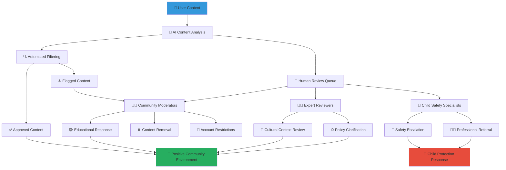

# Community Content Moderation Guidelines
## Comprehensive Content Safety Framework for Child-Centered Community Platform

> **Purpose**: Establish comprehensive content moderation guidelines that ensure safe, respectful, and constructive community interaction while protecting children, honoring Indonesian cultural values, and fostering positive engagement among all stakeholders in the MerajutASA platform ecosystem.

---

## 🛡️ Content Moderation Philosophy

### Child-Safe Community Environment
All community content must prioritize child safety and positive development:

```yaml
Core Moderation Principles:
  Child Safety First: All content evaluated for impact on child welfare
  Cultural Respect: Honor Indonesian values and diverse cultural backgrounds
  
Community Standards:
  Constructive Engagement: Promote positive, solution-focused discussions
  Inclusive Environment: Welcoming space for all appropriate stakeholders
```

### Multi-Layered Moderation Framework
Comprehensive content safety through technology and human oversight:



---

## 📋 Community Content Standards

### 1. Prohibited Content Categories

#### Child Safety Violations
```yaml
Absolutely Prohibited Content:
  Child Exploitation:
    - Any content that exploits or sexualizes children
    - Images or descriptions that could identify vulnerable children
    - Content that promotes harm to children in any form
    - Sharing of children's personal information without authorization
  
  Grooming and Predatory Behavior:
    - Attempts to establish inappropriate relationships with children
    - Requests for personal information from children
    - Attempts to arrange private meetings with children
    - Inappropriate gift-giving or favor-offering to children
  
  Child Endangerment:
    - Content promoting dangerous activities for children
    - Information that could be used to harm children
    - Content undermining child protection measures
    - Sharing of child location or schedule information
```

#### Harmful and Dangerous Content
```yaml
Strictly Prohibited Content:
  Violence and Threats:
    - Threats of violence against any individual or group
    - Graphic descriptions of violence or abuse
    - Content promoting self-harm or suicide
    - Intimidation or harassment of community members
  
  Hate Speech and Discrimination:
    - Content targeting individuals based on race, religion, ethnicity, or other protected characteristics
    - Discriminatory language or slurs
    - Content promoting religious or ethnic hatred
    - Content undermining Indonesian national unity (Bhineka Tunggal Ika)
  
  Illegal Activities:
    - Content promoting illegal drug use or distribution
    - Instructions for illegal activities
    - Content promoting fraud or financial crimes
    - Violation of intellectual property rights
```

#### Inappropriate Sexual Content
```yaml
Sexual Content Restrictions:
  Adult Sexual Content:
    - Explicit sexual content of any kind
    - Sexually suggestive content involving minors
    - Sexual solicitation or propositions
    - Sharing of intimate images without consent
  
  Inappropriate Relationship Content:
    - Romantic or sexual content involving children
    - Age-inappropriate relationship advice
    - Content sexualizing family or caregiving relationships
    - Inappropriate boundary-crossing in professional relationships
```

### 2. Community Interaction Standards

#### Respectful Communication Guidelines
```yaml
Required Communication Standards:
  Professional Courtesy:
    - Respectful language in all interactions
    - Constructive criticism and feedback
    - Recognition of diverse perspectives and experiences
    - Acknowledgment of expertise and contributions
  
  Cultural Sensitivity:
    - Respect for Indonesian cultural values and traditions
    - Consideration for religious diversity and practices
    - Appropriate use of traditional greetings and courtesies
    - Sensitivity to regional and local customs
  
  Child-Appropriate Language:
    - Language suitable for children of all ages
    - Avoidance of profanity, vulgar language, or crude humor
    - Educational and inspiring content when children may be present
    - Positive role modeling in all community interactions
```

#### Constructive Engagement Practices
```yaml
Encouraged Community Behaviors:
  Solution-Focused Discussion:
    - Emphasis on practical solutions and positive outcomes
    - Sharing of successful strategies and best practices
    - Collaborative problem-solving approaches
    - Recognition and celebration of achievements
  
  Knowledge Sharing:
    - Sharing of relevant expertise and professional knowledge
    - Cultural exchange and traditional wisdom sharing
    - Educational content that benefits the community
    - Resource sharing and mutual support
  
  Supportive Community Building:
    - Encouragement and emotional support for community members
    - Welcoming of new members and volunteers
    - Inclusive practices that embrace diversity
    - Community organizing and collective action for child welfare
```

---

## 🤖 Automated Content Moderation

### 1. AI-Powered Content Analysis

#### Real-Time Content Scanning
```yaml
Automated Detection Systems:
  Text Analysis:
    Language Detection: Multi-language support including Bahasa Indonesia and regional languages
    Sentiment Analysis: Detection of negative sentiment, anger, or distress
    Keyword Filtering: Comprehensive filtering of inappropriate keywords and phrases
    Context Analysis: Understanding of context and cultural nuances
  
  Image and Video Analysis:
    Visual Content Scanning: Detection of inappropriate images or symbols
    Facial Recognition: Protection of child identity through automatic face blurring
    Object Recognition: Detection of weapons, drugs, or other inappropriate objects
    Scene Analysis: Analysis of context and setting of visual content
  
  Behavioral Pattern Recognition:
    Suspicious Activity Detection: Identification of grooming patterns or predatory behavior
    Spam and Bot Detection: Automated detection of spam and automated bot accounts
    Harassment Pattern Recognition: Detection of patterns of harassment or bullying
    Account Compromise Detection: Identification of potentially compromised accounts
```

#### Cultural Context Integration
```yaml
Indonesian Cultural AI Training:
  Language Processing:
    Bahasa Indonesia: Advanced natural language processing for formal and informal Indonesian
    Regional Languages: Support for major regional languages including Javanese, Sundanese, and Batak
    Cultural Expressions: Understanding of Indonesian cultural expressions and idioms
    Religious Context: Appropriate handling of religious content and expressions
  
  Cultural Sensitivity:
    Traditional Values: Respect for traditional Indonesian values in content analysis
    Religious Considerations: Appropriate handling of Islamic, Christian, Hindu, and Buddhist content
    Regional Customs: Understanding of regional customs and local practices
    Generational Differences: Consideration for different generational communication styles
```

### 2. Graduated Response System

#### Automated Response Levels
```yaml
Response Escalation Framework:
  Level 1 - Educational Intervention:
    Trigger: Minor policy violations or cultural insensitivity
    Response: Automated educational message with policy clarification
    Action: Content published with educational overlay
    Follow-up: Tracking for pattern recognition
  
  Level 2 - Content Review:
    Trigger: Potential policy violations requiring human review
    Response: Content held for human moderation
    Action: Temporary content hold pending review
    Notification: User notified of review process
  
  Level 3 - Immediate Removal:
    Trigger: Clear violations of child safety or community standards
    Response: Immediate content removal and account flagging
    Action: Content removed, user notified, incident logged
    Escalation: Automatic escalation to human moderators
  
  Level 4 - Emergency Response:
    Trigger: Serious child safety concerns or imminent threats
    Response: Immediate content removal, account suspension, authority notification
    Action: Platform security and child protection protocols activated
    Professional Involvement: Child protection specialists and legal authorities contacted
```

---

## 👥 Human Moderation Framework

### 1. Moderation Team Structure

#### Professional Moderation Staff
```yaml
Child Protection Specialists:
  Qualifications:
    - Advanced degree in social work, psychology, or child development
    - Minimum 5 years experience in child protection or welfare
    - Certification in trauma-informed care and crisis intervention
    - Cultural competency in Indonesian contexts
  
  Responsibilities:
    - Review of all child safety-related content concerns
    - Crisis intervention and emergency response coordination
    - Training and supervision of community moderators
    - Policy development and continuous improvement
  
  Working Conditions:
    - 24/7 coverage with rotating shifts
    - Regular supervision and professional support
    - Ongoing training and professional development
    - Mental health support and trauma prevention resources
```

#### Community Volunteer Moderators
```yaml
Volunteer Moderator Selection:
  Background Requirements:
    - Comprehensive background check and reference verification
    - Demonstrated commitment to child welfare and community service
    - Cultural competency and language skills appropriate for community
    - Professional or volunteer experience in community leadership
  
  Training Requirements:
    - 40-hour initial training in child protection, content moderation, and cultural sensitivity
    - Monthly ongoing training and skill development
    - Annual recertification and performance evaluation
    - Specialized training in crisis recognition and response
  
  Role and Responsibilities:
    - First-level review of flagged content
    - Community engagement and education
    - Cultural context interpretation and guidance
    - Escalation of serious concerns to professional staff
```

### 2. Moderation Decision-Making Process

#### Content Review Procedures
```yaml
Standard Review Process:
  Initial Assessment (Within 2 Hours):
    Content Classification: Classification of content type and potential violations
    Severity Assessment: Assessment of potential harm and urgency
    Cultural Context Review: Consideration of cultural and linguistic context
    Stakeholder Impact Analysis: Assessment of impact on different community members
  
  Detailed Review (Within 24 Hours):
    Policy Application: Application of specific community guidelines and policies
    Expert Consultation: Consultation with relevant experts when needed
    Community Context: Consideration of community impact and precedent
    Educational Opportunity: Assessment of educational and learning opportunities
  
  Decision Implementation:
    User Communication: Clear, respectful communication of decisions and reasoning
    Educational Resources: Provision of educational resources and guidance
    Appeal Process: Clear process for appealing moderation decisions
    Follow-up Monitoring: Ongoing monitoring of user behavior and community impact
```

#### Escalation and Crisis Response
```yaml
Emergency Escalation Procedures:
  Immediate Concerns (Within 15 Minutes):
    Child Safety Threats: Immediate escalation for any child safety concerns
    Violence Threats: Rapid response to threats of violence or self-harm
    Criminal Activity: Immediate law enforcement contact for criminal concerns
    Crisis Intervention: Mental health crisis intervention and support
  
  Professional Response Team:
    Child Protection Specialists: Professional assessment and intervention
    Legal Counsel: Legal review and guidance for complex cases
    Law Enforcement: Coordination with police and child protection services
    Mental Health Professionals: Crisis counseling and support services
```

---

## 🎓 Cultural Sensitivity and Context

### 1. Indonesian Cultural Integration

#### Traditional Values and Modern Platform
```yaml
Cultural Value Integration:
  Pancasila Principles:
    - Belief in One God: Respect for religious diversity and expression
    - Just and Civilized Humanity: Fair and respectful treatment of all community members
    - Unity of Indonesia: Promotion of national unity and social cohesion
    - Democracy: Democratic participation and inclusive decision-making
    - Social Justice: Focus on social justice and equitable treatment
  
  Gotong Royong (Mutual Assistance):
    - Collaborative community problem-solving
    - Shared responsibility for community welfare
    - Collective support for children and families in need
    - Community-based solutions and local resource mobilization
  
  Bhineka Tunggal Ika (Unity in Diversity):
    - Celebration of cultural, religious, and regional diversity
    - Inclusive practices that welcome all Indonesian communities
    - Cross-cultural understanding and respect
    - Bridge-building between different community groups
```

#### Religious Sensitivity and Inclusion
```yaml
Multi-Faith Community Approach:
  Islamic Community Integration:
    - Respect for Islamic values and practices in content moderation
    - Consideration of Islamic calendar and religious observances
    - Appropriate handling of Islamic religious content and discussions
    - Integration with Islamic community organizations and leaders
  
  Christian Community Integration:
    - Respect for Christian values and practices
    - Consideration of Christian calendar and religious observances
    - Appropriate handling of Christian religious content
    - Integration with Christian community organizations
  
  Hindu and Buddhist Integration:
    - Respect for Hindu and Buddhist traditions and practices
    - Consideration of religious calendar and observances
    - Appropriate handling of religious content and philosophy
    - Integration with traditional and religious community leaders
  
  Indigenous and Traditional Beliefs:
    - Respect for indigenous spiritual traditions and practices
    - Integration of traditional wisdom and cultural knowledge
    - Collaboration with traditional community leaders and elders
    - Protection of traditional cultural expressions and knowledge
```

### 2. Regional and Local Context

#### Regional Cultural Adaptation
```yaml
Regional Cultural Considerations:
  Java Cultural Context:
    - Javanese cultural values and traditional hierarchies
    - Appropriate use of Javanese language and expressions
    - Integration with Javanese cultural organizations and traditions
    - Respect for traditional Javanese conflict resolution methods
  
  Sumatra Cultural Context:
    - Batak, Minangkabau, and other Sumatran cultural traditions
    - Regional language considerations and cultural expressions
    - Integration with traditional adat (customary law) systems
    - Respect for matrilineal and patrilineal kinship systems
  
  Eastern Indonesia Integration:
    - Papuan, Maluku, and Eastern Indonesian cultural traditions
    - Integration with traditional community governance systems
    - Respect for traditional ecological knowledge and practices
    - Consideration of unique social and economic contexts
```

#### Urban and Rural Adaptation
```yaml
Context-Sensitive Moderation:
  Urban Community Considerations:
    - Modern urban communication styles and digital literacy levels
    - Integration with urban professional and educational networks
    - Consideration of urban social challenges and opportunities
    - Adaptation to fast-paced urban lifestyle and communication preferences
  
  Rural Community Integration:
    - Traditional rural communication patterns and community structures
    - Integration with traditional village governance and leadership
    - Consideration of limited internet access and digital literacy
    - Respect for agricultural cycles and rural economic patterns
```

---

## 📚 Educational and Restorative Approaches

### 1. Educational Intervention Framework

#### Learning-Focused Responses
```yaml
Educational Response Strategy:
  Policy Education:
    - Clear explanation of community guidelines and expectations
    - Cultural context for policy decisions and community standards
    - Examples of appropriate and inappropriate content
    - Resources for improving communication and engagement skills
  
  Skill Development:
    - Communication skills training for effective community participation
    - Digital literacy education for safe and effective platform use
    - Cultural competency education for cross-cultural communication
    - Conflict resolution skills for constructive community engagement
  
  Mentorship and Support:
    - Pairing with experienced community members for guidance
    - Professional development opportunities for skill building
    - Leadership development for community organizers and activists
    - Peer support networks for ongoing learning and growth
```

#### Community Learning Opportunities
```yaml
Community Education Programs:
  Workshop Series:
    - Monthly workshops on effective community communication
    - Cultural sensitivity and cross-cultural communication training
    - Child protection awareness and community responsibility
    - Digital safety and privacy protection education
  
  Peer Learning Networks:
    - Experienced member mentorship programs
    - Cross-generational learning and knowledge sharing
    - Professional skill sharing and development opportunities
    - Traditional wisdom integration and preservation projects
```

### 2. Restorative Justice Approaches

#### Community Healing and Repair
```yaml
Restorative Response Framework:
  Harm Assessment:
    - Assessment of harm caused to individuals and community
    - Understanding of underlying causes and contributing factors
    - Identification of affected parties and relationships
    - Analysis of community impact and repair needs
  
  Healing Process:
    - Facilitated dialogue between affected parties when appropriate
    - Community circle processes for collective healing
    - Individual counseling and support for affected community members
    - Collective action planning for community improvement
  
  Relationship Repair:
    - Mediation services for interpersonal conflicts
    - Community reconciliation processes following traditional Indonesian methods
    - Ongoing support for relationship rebuilding
    - Prevention planning to avoid future harm
```

#### Traditional Indonesian Conflict Resolution
```yaml
Cultural Mediation Integration:
  Adat (Customary Law) Principles:
    - Integration of traditional Indonesian conflict resolution methods
    - Involvement of traditional community leaders and elders
    - Consensus-building approaches consistent with Indonesian culture
    - Collective responsibility and community healing approaches
  
  Religious and Spiritual Integration:
    - Integration with religious mediation and counseling approaches
    - Spiritual counseling and guidance when requested and appropriate
    - Community prayer and spiritual support when culturally appropriate
    - Collaboration with religious leaders for community healing
```

---

## 🔍 Monitoring and Quality Assurance

### 1. Content Moderation Effectiveness

#### Performance Metrics and Assessment
```yaml
Moderation Quality Metrics:
  Response Time Metrics:
    - Average response time for content review and decision
    - Emergency response time for child safety concerns
    - User satisfaction with response time and communication
    - Community impact of response timeliness
  
  Decision Quality Metrics:
    - Consistency of moderation decisions across similar cases
    - Appeal success rate and decision revision frequency
    - Community satisfaction with fairness and transparency
    - Long-term impact on community culture and safety
  
  Community Health Indicators:
    - Overall community engagement and participation levels
    - Reduction in policy violations and inappropriate content
    - Increase in positive, constructive community interactions
    - Community feedback on safety and inclusivity
```

#### Continuous Improvement Process
```yaml
Quality Improvement Framework:
  Regular Assessment:
    - Monthly review of moderation decisions and outcomes
    - Quarterly community feedback surveys and focus groups
    - Annual comprehensive review of policies and procedures
    - Ongoing training needs assessment and professional development
  
  Policy Evolution:
    - Regular policy updates based on community needs and feedback
    - Integration of new best practices and research findings
    - Adaptation to changing technology and social media landscape
    - Alignment with evolving Indonesian legal and cultural context
```

### 2. Community Feedback and Engagement

#### Stakeholder Input Mechanisms
```yaml
Community Feedback Channels:
  Regular Feedback Collection:
    - Monthly community forums for policy discussion and feedback
    - Anonymous feedback systems for sensitive concerns
    - Focus groups with different stakeholder communities
    - Regular surveys on community safety and satisfaction
  
  Stakeholder Advisory Groups:
    - Child welfare professional advisory group
    - Cultural and religious leader advisory council
    - Youth and young adult advisory group
    - Parent and guardian advisory committee
```

#### Transparency and Accountability
```yaml
Public Reporting and Transparency:
  Community Reporting:
    - Quarterly transparency reports on content moderation activities
    - Annual community safety and culture assessment
    - Regular policy updates and community notification
    - Open community meetings for policy discussion and feedback
  
  Accountability Mechanisms:
    - Independent review of content moderation decisions
    - Community ombudsperson for complaint resolution
    - Regular third-party audits of moderation practices
    - Public accountability for community safety and culture
```

---

## 📞 Content Moderation Support and Resources

### Content Safety Contacts
**Community Safety Team**: safety@merajutasa.id  
**Content Appeals**: appeals@merajutasa.id  
**Emergency Content Response**: +62-XXX-XXX-XXXX  
**Cultural Sensitivity Guidance**: culture@merajutasa.id

### Training and Education Resources
```yaml
Content Moderation Training:
  Community Guidelines Training: Comprehensive understanding of community standards
  Cultural Sensitivity Training: Indonesian cultural context and appropriate communication
  Child Protection Training: Recognition and response to child safety concerns
  Crisis Response Training: Emergency response and escalation procedures
  
Community Engagement Resources:
  Best Practice Guides: Effective community communication and engagement strategies
  Cultural Integration Resources: Indonesian cultural values and traditions in digital spaces
  Conflict Resolution Resources: Traditional and modern approaches to community conflict resolution
  Educational Materials: Resources for ongoing learning and skill development
```

### Appeals and Resolution Process
```yaml
Content Appeals Framework:
  Appeal Submission:
    - Clear, accessible appeals process for all community members
    - Multiple language support for appeals submission
    - Timeline and process transparency for appeal resolution
    - Support and assistance for appeal preparation when needed
  
  Appeal Review Process:
    - Independent review by different moderator for fairness
    - Cultural context consideration in appeal review
    - Community input consideration for policy interpretation
    - Transparent communication of appeal decisions and reasoning
```

---

*Safe, respectful, and culturally sensitive community content creates an environment where children can thrive, families can heal, and communities can work together effectively to improve child welfare across Indonesia.*

**Ready to contribute to community safety?** Access content guidelines and training at safety.merajutasa.id/content and help build a positive, child-safe community environment.
