# Data Privacy Protection Measures
## Comprehensive Privacy Framework for Child Welfare Platform

> **Purpose**: Establish robust data privacy protection measures that safeguard personal information of children, families, and stakeholders while enabling effective child welfare services, implementing privacy-by-design principles, and ensuring compliance with Indonesian and international data protection regulations including GDPR and child-specific privacy requirements.

---

## 🔐 Privacy Protection Philosophy

### Privacy-by-Design for Child Welfare
All data handling prioritizes privacy protection and child safety:

```yaml
Core Privacy Principles:
  Child Privacy Supremacy: Children's privacy rights take absolute priority
  Minimal Data Collection: Collect only essential data for child welfare
  
Privacy Standards:
  Proactive Protection: Privacy built into system design from the beginning
  Transparency: Clear communication about data use and protection
```

### Multi-Layered Privacy Framework
Comprehensive privacy protection across all stakeholder interactions:

```mermaid
graph TD
    A[👶 Child Data Protection] --> B[🛡️ Privacy Framework]
    B --> C[📜 Legal Compliance]
    B --> D[🔒 Technical Protection]
    B --> E[👥 Stakeholder Access Control]
    B --> F[🌍 Cross-Border Protection]
    
    C --> G[🇮🇩 Indonesian Data Protection Law]
    C --> H[🇪🇺 GDPR Children's Provisions]
    C --> I[🌐 COPPA Compliance]
    
    D --> J[🔐 Encryption at Rest and Transit]
    D --> K[🔑 Access Control Systems]
    D --> L[📊 Anonymization Technologies]
    
    E --> M[🏛️ Government Controlled Access]
    E --> N[🏢 Business Limited Access]
    E --> O[🎓 Academic Research Access]
    
    F --> P[🌐 Data Sovereignty]
    F --> Q[⚖️ International Transfer Safeguards]
    F --> R[🛡️ Jurisdictional Protection]
    
    G --> S[👶 Comprehensive Privacy Protection]
    H --> S
    I --> S
    J --> S
    K --> S
    L --> S
    M --> S
    N --> S
    O --> S
    P --> S
    Q --> S
    R --> S
    
    style S fill:#27AE60
    style A fill:#E74C3C
```



---

## 📋 Legal and Regulatory Compliance

### 1. Indonesian Data Protection Compliance

#### Personal Data Protection Law (UU PDP) Compliance
```yaml
Indonesian Legal Requirements:
  Data Controller Obligations:
    Legal Basis: Explicit consent for child data and legitimate interest for welfare services
    Data Minimization: Processing limited to necessary data for child protection purposes
    Purpose Limitation: Data used only for explicit child welfare and protection purposes
    Storage Limitation: Data retained only as long as necessary for child protection
  
  Data Subject Rights:
    Access Rights: Right to access personal data with appropriate safeguards for children
    Rectification: Right to correct inaccurate personal data
    Erasure: Right to deletion when data no longer needed for protection
    Portability: Right to data portability with guardian consent for children
  
  Special Protections for Children:
    Enhanced Consent: Additional protections for children under 18
    Guardian Rights: Legal guardian rights and responsibilities for child data
    Best Interest Standard: All data processing must serve child's best interests
    Educational Integration: Privacy education as part of digital literacy
```

#### Government Data Sharing Compliance
```yaml
Public Sector Integration:
  Inter-Agency Data Sharing:
    Legal Framework: Compliance with government data sharing regulations
    Security Standards: Government-grade security for shared data
    Access Logs: Complete audit trails for all government data access
    Purpose Limitation: Government access limited to child protection purposes
  
  Regulatory Reporting:
    Mandatory Reporting: Compliance with child protection reporting requirements
    Statistical Reporting: Anonymized statistical reporting to government agencies
    Incident Reporting: Mandatory reporting of data breaches and security incidents
    Transparency Reports: Regular transparency reports on government data requests
```

### 2. International Privacy Standards

#### GDPR Compliance for Children
```yaml
European Union GDPR Alignment:
  Enhanced Protections for Children:
    Age of Consent: Enhanced protections for children under 16
    Parental Consent: Verifiable parental consent for children's data processing
    Child-Friendly Communication: Clear, simple language for privacy communications
    Regular Review: Regular review of child data processing necessity
  
  Data Processing Principles:
    Lawfulness: Clear legal basis for all child data processing
    Fairness: Fair processing that considers child welfare impact
    Transparency: Child-appropriate transparency about data processing
    Data Minimization: Minimal data collection for specific child welfare purposes
```

#### COPPA (Children's Online Privacy Protection Act) Alignment
```yaml
US COPPA Best Practices:
  Enhanced Child Protections:
    Verifiable Parental Consent: Strong parental consent mechanisms
    Limited Data Collection: Strict limits on child data collection
    No Behavioral Advertising: Prohibition on behavioral advertising to children
    Safe Harbor Provisions: Safe harbors for child-directed content
  
  Operational Requirements:
    Privacy Policy Clarity: Clear, understandable privacy policies for parents
    Data Deletion: Easy mechanisms for parents to delete child data
    Third-Party Restrictions: Strict controls on third-party access to child data
    Regular Audits: Regular compliance audits and assessments
```

---

## 🔒 Technical Privacy Protection

### 1. Data Encryption and Security

#### End-to-End Encryption Framework
```yaml
Encryption Standards:
  Data at Rest:
    Encryption Algorithm: AES-256 encryption for all stored data
    Key Management: Hardware Security Module (HSM) key management
    Database Encryption: Transparent database encryption (TDE)
    File System Encryption: Full disk encryption for all storage systems
  
  Data in Transit:
    TLS Protocol: TLS 1.3 for all data transmission
    Certificate Management: Extended validation certificates for all endpoints
    API Security: OAuth 2.0 with PKCE for API authentication
    VPN Protection: Site-to-site VPN for inter-system communication
  
  Data in Processing:
    Memory Encryption: In-memory encryption for sensitive data processing
    Secure Enclaves: Hardware-based secure processing environments
    Homomorphic Encryption: Privacy-preserving computation for analytics
    Differential Privacy: Mathematical privacy guarantees for statistical analysis
```

#### Access Control and Authentication
```yaml
Multi-Factor Authentication (MFA):
  User Authentication:
    Primary Factor: Strong password requirements with complexity validation
    Secondary Factor: SMS, authenticator app, or hardware token
    Biometric Factor: Optional fingerprint or facial recognition
    Risk-Based Authentication: Adaptive authentication based on risk assessment
  
  Role-Based Access Control (RBAC):
    Principle of Least Privilege: Minimum necessary access for job functions
    Segregation of Duties: Separation of critical functions across roles
    Regular Access Reviews: Quarterly review and validation of access permissions
    Automated Provisioning: Automated user provisioning and de-provisioning
```

### 2. Data Anonymization and Pseudonymization

#### Child Data Protection Techniques
```yaml
Anonymization Methods:
  Direct Identifier Removal:
    Name Anonymization: Replace names with secure, random identifiers
    Address Obfuscation: Geographic generalization to protect location privacy
    Date Shifting: Consistent date shifting to protect temporal patterns
    Demographic Generalization: Age ranges instead of specific ages
  
  Quasi-Identifier Protection:
    K-Anonymity: Ensure k-anonymity for all published datasets
    L-Diversity: Diversity requirements for sensitive attributes
    T-Closeness: Distribution similarity for sensitive attributes
    Synthetic Data: Generate synthetic datasets for research and testing
```

#### Research Data Protection
```yaml
Academic Research Safeguards:
  Research Data Preparation:
    Institutional Review Board (IRB): Required IRB approval for all research
    Data Use Agreements: Formal agreements specifying permitted uses
    Researcher Training: Mandatory privacy training for all researchers
    Output Review: Review of all research outputs for privacy compliance
  
  Statistical Disclosure Control:
    Cell Suppression: Suppression of small cell counts in statistical tables
    Noise Addition: Statistical noise to protect individual privacy
    Output Checking: Automated checking of statistical outputs for disclosure risk
    Differential Privacy: Mathematical privacy guarantees for statistical releases
```

---

## 👥 Stakeholder Data Access Framework

### 1. Government Stakeholder Access

#### Regulatory and Oversight Access
```yaml
Government Access Controls:
  Legal Authority Verification:
    Court Orders: Valid court orders required for specific child data access
    Statutory Authority: Clear statutory authority for data access
    Purpose Limitation: Access limited to specific child protection purposes
    Judicial Review: Regular judicial review of government access requests
  
  Data Sharing Protocols:
    Secure Channels: Government-grade secure channels for data transmission
    Access Logging: Complete audit logs of all government data access
    Time Limitations: Time-limited access with automatic expiration
    Need-to-Know: Access limited to personnel with specific need to know
```

#### Emergency Access Procedures
```yaml
Crisis Response Data Access:
  Emergency Protocols:
    Immediate Access: Streamlined access for child protection emergencies
    Emergency Contacts: 24/7 emergency contact for urgent data requests
    Post-Emergency Review: Retrospective review of all emergency access
    Legal Documentation: Proper legal documentation for emergency access
  
  Child Safety Priorities:
    Best Interest Standard: Child's best interest guides all access decisions
    Minimal Intrusion: Least intrusive means consistent with child protection
    Professional Oversight: Professional child welfare oversight of data use
    Family Notification: Appropriate notification to families when legally permitted
```

### 2. Business Stakeholder Access

#### Corporate Partnership Data Sharing
```yaml
Business Data Access Limitations:
  Aggregated Data Only:
    Statistical Summaries: Only aggregated, non-identifying statistical data
    Impact Metrics: Anonymized impact metrics for CSR reporting
    Trend Analysis: General trend data without individual identification
    Performance Indicators: High-level performance indicators for partnerships
  
  Strict Use Limitations:
    Purpose Limitation: Data use limited to agreed partnership purposes
    No Secondary Use: Prohibition on secondary use or sharing of data
    Regular Audits: Regular audits of business partner data handling
    Contractual Safeguards: Strong contractual privacy protections
```

#### Employee Access Controls
```yaml
Corporate Volunteer Access:
  Employee Background Checks:
    Criminal Background: Comprehensive criminal background checks
    Reference Verification: Professional and personal reference verification
    Ongoing Monitoring: Continuous monitoring of employee interactions
    Training Requirements: Mandatory privacy and child protection training
  
  Limited Interaction Protocols:
    Supervised Interaction: All employee-child interactions must be supervised
    Group Activities: Emphasis on group rather than individual interactions
    Documentation Requirements: Proper documentation of all interactions
    Professional Oversight: Professional oversight of all volunteer activities
```

### 3. Academic Stakeholder Access

#### Research Data Access Framework
```yaml
Academic Research Protocols:
  Ethical Review Requirements:
    IRB Approval: Institutional Review Board approval required for all research
    Ethics Training: Mandatory research ethics training for all researchers
    Privacy Impact Assessment: Comprehensive privacy impact assessment
    Child Protection Review: Specialized review for child-related research
  
  Data Access Tiers:
    Tier 1 - Public Data: Fully anonymized data available for general research
    Tier 2 - Restricted Access: Pseudonymized data for approved researchers
    Tier 3 - Secure Access: Identified data in secure research environments only
    Tier 4 - No Access: Highly sensitive data not available for research
```

#### Research Output Controls
```yaml
Publication Safeguards:
  Output Review Process:
    Pre-Publication Review: Review of all publications for privacy compliance
    Statistical Disclosure Control: Prevention of individual identification in publications
    Ethical Considerations: Ethical review of research findings and implications
    Community Consultation: Consultation with affected communities when appropriate
  
  Knowledge Sharing Benefits:
    Evidence-Based Practice: Research contributing to improved child welfare practices
    Policy Development: Research informing evidence-based policy development
    Innovation Advancement: Research supporting innovation in child welfare
    International Collaboration: Responsible sharing of knowledge with international partners
```

### 4. Community Stakeholder Access

#### Volunteer Data Protection
```yaml
Community Volunteer Safeguards:
  Background Verification:
    Identity Verification: Comprehensive identity verification for all volunteers
    Character References: Professional and community character references
    Skills Verification: Verification of claimed skills and qualifications
    Ongoing Monitoring: Continuous monitoring of volunteer behavior and interactions
  
  Access Limitations:
    Need-to-Know Basis: Access limited to information necessary for volunteer role
    Supervised Access: Supervised access to child information and interactions
    Time-Limited Access: Access permissions with regular expiration and renewal
    Role-Based Permissions: Specific permissions based on volunteer role and training
```

#### Community Privacy Education
```yaml
Privacy Awareness Programs:
  Volunteer Training:
    Privacy Fundamentals: Basic privacy principles and child protection
    Confidentiality Requirements: Strict confidentiality requirements and procedures
    Appropriate Sharing: Guidelines for appropriate information sharing
    Incident Reporting: Procedures for reporting privacy incidents and concerns
  
  Community Education:
    Digital Literacy: Privacy-focused digital literacy education
    Child Protection: Community education on child privacy protection
    Cultural Integration: Privacy education respecting cultural values and practices
    Intergenerational Learning: Privacy education for all age groups in community
```

---

## 🌍 Cross-Border Data Protection

### 1. Data Sovereignty and Localization

#### Indonesian Data Residency
```yaml
Data Localization Requirements:
  Domestic Data Storage:
    Primary Storage: All child data stored in Indonesian data centers
    Backup Systems: Backup systems also located within Indonesia
    Processing Locations: All data processing performed within Indonesia
    Vendor Requirements: All vendors must comply with Indonesian data residency
  
  Cross-Border Transfer Restrictions:
    Limited Transfers: Cross-border transfers only when absolutely necessary
    Adequacy Decisions: Transfers only to countries with adequate protection
    Safeguards: Additional safeguards for necessary international transfers
    Government Approval: Government approval required for sensitive data transfers
```

#### Sovereignty Protection Mechanisms
```yaml
National Security Considerations:
  Government Access: Indonesian government retains access rights to data
  National Interest: Data handling aligned with Indonesian national interests
  Cultural Protection: Protection of Indonesian cultural and social values
  Economic Benefits: Data processing provides economic benefits to Indonesia
  
Data Independence:
  Technology Independence: Reduced dependence on foreign technology platforms
  Legal Independence: Indonesian law governs all data processing activities
  Economic Independence: Local economic benefits from data processing activities
  Cultural Independence: Respect for Indonesian cultural values and practices
```

### 2. International Transfer Safeguards

#### Adequacy and Safeguards Framework
```yaml
International Transfer Mechanisms:
  Adequacy Decisions:
    Government Assessment: Indonesian government assessment of foreign privacy laws
    Ongoing Monitoring: Continuous monitoring of adequacy decisions
    Regular Review: Regular review and update of adequacy assessments
    Revocation Procedures: Procedures for revoking inadequate protections
  
  Contractual Safeguards:
    Standard Contractual Clauses: Use of approved standard contractual clauses
    Binding Corporate Rules: Multinational corporation binding privacy rules
    Certification Mechanisms: Privacy certification for international transfers
    Codes of Conduct: Industry codes of conduct for international data sharing
```

#### Emergency International Cooperation
```yaml
Crisis Response Coordination:
  International Emergency Response:
    Child Protection Emergencies: International cooperation for child protection crises
    Cross-Border Investigations: Cooperation in international child exploitation cases
    Information Sharing: Rapid information sharing for urgent child protection
    Legal Assistance: Mutual legal assistance for child protection investigations
  
Safeguards for Emergency Cooperation:
  Proportionality: Emergency sharing proportional to threat level
  Time Limits: Strict time limits on emergency data sharing
  Post-Emergency Review: Review of all emergency international sharing
  Legal Documentation: Proper legal documentation for emergency cooperation
```

---

## 📊 Privacy Monitoring and Compliance

### 1. Privacy Impact Assessment

#### Systematic Privacy Evaluation
```yaml
Privacy Impact Assessment Process:
  Initial Assessment:
    Data Flow Mapping: Comprehensive mapping of all data flows
    Risk Identification: Identification of all privacy risks
    Stakeholder Impact: Assessment of impact on all stakeholders
    Mitigation Planning: Development of risk mitigation strategies
  
  Ongoing Assessment:
    Regular Reviews: Quarterly privacy impact assessments
    Change Management: Assessment of all system changes for privacy impact
    Incident Analysis: Privacy impact analysis of all security incidents
    Stakeholder Feedback: Regular stakeholder feedback on privacy practices
```

#### Child-Specific Privacy Assessment
```yaml
Child Privacy Considerations:
  Developmental Appropriateness:
    Age-Appropriate Design: Assessment of age-appropriateness of data practices
    Developmental Impact: Consideration of impact on child development
    Educational Value: Assessment of educational value of data collection
    Long-Term Implications: Consideration of long-term implications for children
  
  Best Interest Assessment:
    Child Welfare Priority: Primary consideration of child welfare in all assessments
    Guardian Involvement: Appropriate guardian involvement in assessment process
    Professional Consultation: Consultation with child development professionals
    Cultural Considerations: Integration of Indonesian cultural values in assessment
```

### 2. Compliance Monitoring and Auditing

#### Continuous Compliance Monitoring
```yaml
Automated Monitoring Systems:
  Real-Time Monitoring:
    Access Monitoring: Real-time monitoring of all data access
    Anomaly Detection: Automated detection of unusual data access patterns
    Compliance Checking: Automated checking of compliance with privacy policies
    Incident Detection: Immediate detection of privacy incidents and breaches
  
  Regular Compliance Audits:
    Internal Audits: Monthly internal privacy compliance audits
    External Audits: Annual external privacy compliance audits
    Penetration Testing: Regular security and privacy penetration testing
    Vulnerability Assessment: Comprehensive vulnerability assessments
```

#### Stakeholder Compliance Verification
```yaml
Third-Party Compliance:
  Vendor Management:
    Due Diligence: Comprehensive privacy due diligence for all vendors
    Contractual Requirements: Strong privacy contractual requirements
    Ongoing Monitoring: Continuous monitoring of vendor privacy practices
    Regular Audits: Regular audits of vendor privacy compliance
  
  Partner Compliance:
    Partnership Agreements: Privacy requirements in all partnership agreements
    Regular Assessment: Regular assessment of partner privacy practices
    Training Requirements: Privacy training requirements for partner staff
    Incident Notification: Requirements for partners to notify of privacy incidents
```

---

## 🚨 Privacy Incident Response

### 1. Breach Detection and Response

#### Incident Classification and Response
```yaml
Privacy Incident Categories:
  Category 1 - Critical (Child Data Breach):
    Response Time: Immediate response within 15 minutes
    Notifications: Immediate notification to authorities and affected families
    Containment: Immediate containment and forensic preservation
    Investigation: Comprehensive investigation with external experts
  
  Category 2 - High (Sensitive Data Exposure):
    Response Time: Response within 1 hour
    Notifications: Notification within 24 hours of discovery
    Containment: Rapid containment and impact assessment
    Investigation: Thorough investigation with internal and external resources
  
  Category 3 - Medium (Limited Data Exposure):
    Response Time: Response within 4 hours
    Notifications: Notification within 72 hours of discovery
    Containment: Systematic containment and vulnerability remediation
    Investigation: Complete investigation with remediation planning
```

#### Breach Notification Framework
```yaml
Notification Requirements:
  Regulatory Notifications:
    Government Authorities: Immediate notification to relevant government agencies
    Data Protection Authority: Formal notification to Indonesian data protection authority
    International Authorities: Notification to relevant international authorities when required
    Legal Authorities: Notification to legal authorities when criminal activity suspected
  
  Stakeholder Notifications:
    Affected Individuals: Direct notification to affected individuals and guardians
    Platform Users: General platform notification for significant incidents
    Partners and Vendors: Notification to relevant partners and vendors
    Public Disclosure: Public disclosure when required by law or in public interest
```

### 2. Recovery and Prevention

#### Post-Incident Recovery
```yaml
Recovery Procedures:
  Immediate Recovery:
    System Restoration: Secure restoration of affected systems
    Data Recovery: Recovery of any lost or compromised data
    Service Restoration: Restoration of platform services with enhanced security
    Monitoring Enhancement: Enhanced monitoring of recovered systems
  
  Long-Term Recovery:
    Trust Rebuilding: Programs to rebuild stakeholder trust
    Compensation: Appropriate compensation for affected individuals
    System Strengthening: Systematic strengthening of privacy protections
    Process Improvement: Improvement of all privacy and security processes
```

#### Prevention Enhancement
```yaml
Lessons Learned Integration:
  Root Cause Analysis:
    Technical Analysis: Comprehensive technical analysis of incident causes
    Process Analysis: Analysis of process failures and improvement opportunities
    Human Factors: Analysis of human factors contributing to incidents
    System Analysis: Analysis of systemic issues and improvement needs
  
  Prevention Improvement:
    Technology Enhancement: Implementation of improved privacy technologies
    Process Improvement: Enhancement of privacy protection processes
    Training Enhancement: Improved privacy training based on lessons learned
    Policy Updates: Updates to privacy policies based on incident experience
```

---

## 📞 Privacy Support and Resources

### Privacy Protection Contacts
**Data Protection Officer**: dpo@merajutasa.id  
**Privacy Emergency Hotline**: +62-XXX-XXX-XXXX  
**Child Privacy Specialist**: child-privacy@merajutasa.id  
**Legal Privacy Counsel**: legal-privacy@merajutasa.id

### Training and Education Resources
```yaml
Privacy Training Programs:
  Basic Privacy Training: Fundamental privacy principles and practices
  Advanced Privacy Training: Specialized training for privacy professionals
  Child Privacy Training: Specialized training for child data protection
  Cultural Privacy Training: Indonesian cultural considerations for privacy
  
Privacy Resources:
  Privacy Policy Library: Comprehensive privacy policy templates and examples
  Best Practice Guides: Privacy best practice guides for different stakeholder groups
  Legal Resources: Legal guidance on Indonesian and international privacy law
  Technology Resources: Technical resources for privacy-preserving technologies
```

### International Privacy Networks
```yaml
Professional Networks:
  International Association of Privacy Professionals (IAPP): Global privacy community
  Asia Pacific Privacy Authorities (APPA): Regional privacy authority network
  Global Privacy Assembly: International privacy regulator network
  Academic Privacy Networks: University and research privacy networks
  
Standards and Frameworks:
  ISO 27001/27002: International security and privacy standards
  NIST Privacy Framework: US National Institute of Standards privacy framework
  FAIR Information Practice Principles: Foundational privacy principles
  Privacy by Design: Fundamental privacy engineering principles
```

---

*Privacy is a fundamental right, especially for children. Our comprehensive privacy protection framework ensures that every piece of data is handled with the utmost care and respect, protecting children while enabling the important work of child welfare improvement.*

**Ready to contribute to privacy protection?** Access privacy training and resources at privacy.merajutasa.id and join our commitment to protecting children's privacy rights.
