# Emergency Response Protocols
## Comprehensive Crisis Management Framework for Child Welfare Platform

> **Purpose**: Establish robust emergency response protocols that ensure rapid, effective, and coordinated response to child protection emergencies, platform security incidents, and community crises while maintaining child safety as the absolute priority and integrating with Indonesian emergency services and cultural response systems.

---

## 🚨 Emergency Response Philosophy

### Child-Centered Crisis Response
All emergency protocols prioritize child safety and protection:

```yaml
Core Emergency Principles:
  Child Life and Safety: Absolute priority on preserving child life and preventing harm
  Rapid Response: Immediate action within minutes for life-threatening situations
  
Crisis Standards:
  Professional Coordination: Seamless coordination with emergency services and professionals
  Community Integration: Integration with Indonesian emergency systems and cultural responses
```

### Multi-Level Emergency Framework
Comprehensive emergency response across platform and community levels:

```mermaid
graph TD
    A[🚨 Emergency Incident] --> B[⚡ Immediate Assessment]
    B --> C{🔍 Threat Level Analysis}
    
    C --> D[🔴 Level 1: Life-Threatening]
    C --> E[🟠 Level 2: Serious Harm]
    C --> F[🟡 Level 3: Potential Risk]
    C --> G[🟢 Level 4: Safety Concern]
    
    D --> H[⚡ Immediate Emergency Response]
    H --> I[🚔 Emergency Services Dispatch]
    H --> J[🏥 Medical Emergency Response]
    H --> K[👶 Child Protection Services]
    
    E --> L[🚀 Urgent Response Team]
    L --> M[👥 Professional Assessment]
    L --> N[🛡️ Protective Measures]
    
    F --> O[📋 Investigation Team]
    O --> P[🔍 Risk Assessment]
    O --> Q[📞 Stakeholder Notification]
    
    G --> R[🤝 Community Response]
    R --> S[📚 Educational Intervention]
    R --> T[🔧 System Improvement]
    
    I --> U[👶 Child Safety Secured]
    J --> U
    K --> U
    M --> U
    N --> U
    P --> U
    Q --> U
    S --> U
    T --> U
    
    style U fill:#27AE60
    style A fill:#E74C3C
    style D fill:#E74C3C
    style E fill:#F39C12
```



---

## ⚡ Emergency Classification and Response Levels

### 1. Level 1: Life-Threatening Emergency (Immediate Response)

#### Critical Emergency Indicators
```yaml
Life-Threatening Situations:
  Immediate Physical Danger:
    - Child in immediate physical danger or under active assault
    - Serious injury or medical emergency requiring immediate attention
    - Suicide attempt or active self-harm by child or in child's presence
    - Active threats with weapons or violence in progress
  
  Severe Child Abuse:
    - Physical or sexual abuse in progress
    - Child reporting active abuse or immediate threat
    - Discovery of severe neglect threatening child's life
    - Child missing or kidnapped from care facility
  
  Platform Security Emergencies:
    - Active cyber attack targeting child data or safety systems
    - Breach of child protection systems
    - Coordinated attack on platform infrastructure
    - Terrorist threat or activity targeting platform or users
```

#### Level 1 Response Protocol (0-15 Minutes)
```yaml
Immediate Response Actions:
  Emergency Services Activation:
    - Automatic dispatch to emergency services (Police: 110, Medical: 118, Fire: 113)
    - Direct communication with emergency dispatcher
    - GPS location transmission for rapid response
    - Emergency medical team dispatch when needed
  
  Platform Emergency Protocols:
    - Immediate platform lockdown for affected areas
    - Emergency notification to all senior management
    - Child protection specialist immediate deployment
    - Legal counsel and crisis communication team activation
  
  Child Protection Measures:
    - Immediate child safety assessment and removal if necessary
    - Emergency alternative care arrangement
    - Medical attention coordination
    - Professional trauma counseling activation
```

### 2. Level 2: Serious Harm Risk (Urgent Response)

#### Serious Risk Indicators
```yaml
Urgent Safety Concerns:
  Child Welfare Risks:
    - Suspected child abuse or neglect requiring investigation
    - Child reporting fear or safety concerns
    - Inappropriate adult-child interaction that could escalate
    - Mental health crisis not immediately life-threatening
  
  Platform Security Concerns:
    - Attempted unauthorized access to child data
    - Security vulnerability discovery affecting child safety
    - Coordinated harassment or threats against children
    - Data breach affecting child information
  
  Community Safety Issues:
    - Violence or threats in community spaces
    - Inappropriate behavior by volunteers or staff
    - Safety violations in orphanage or community settings
    - Emergency affecting multiple children or families
```

#### Level 2 Response Protocol (15 Minutes - 1 Hour)
```yaml
Urgent Response Actions:
  Professional Team Activation:
    - Child protection specialist deployment
    - Licensed social worker assignment
    - Mental health professional engagement
    - Security team activation for platform issues
  
  Investigation and Assessment:
    - Rapid safety assessment and risk evaluation
    - Evidence preservation and collection
    - Stakeholder notification and coordination
    - Protective measures implementation
  
  Coordination and Support:
    - Family and guardian notification when appropriate
    - Community support activation
    - Professional counseling and support services
    - Legal consultation and guidance
```

### 3. Level 3: Potential Risk (Standard Response)

#### Risk Assessment Indicators
```yaml
Concerning Situations:
  Child Welfare Concerns:
    - Policy violations affecting child safety
    - Concerning behavior patterns requiring assessment
    - Minor safety violations or protocol breaches
    - Community concerns about child welfare
  
  Platform Issues:
    - Content violations affecting child safety
    - User behavior concerns requiring investigation
    - System issues affecting safety features
    - Privacy or data concerns not immediately threatening
```

#### Level 3 Response Protocol (1-24 Hours)
```yaml
Standard Response Actions:
  Investigation Team Assignment:
    - Qualified investigator assignment
    - Documentation and evidence collection
    - Stakeholder interviews and assessment
    - Risk evaluation and mitigation planning
  
  Professional Assessment:
    - Child welfare professional evaluation
    - Safety assessment and planning
    - Community impact assessment
    - System improvement recommendations
```

### 4. Level 4: Safety Concern (Educational Response)

#### General Safety Concerns
```yaml
Educational Opportunities:
  Community Standards:
    - Minor policy violations or guideline infractions
    - Educational opportunities for improvement
    - Community relationship or communication issues
    - Process or procedure concerns
```

#### Level 4 Response Protocol (24-72 Hours)
```yaml
Educational Response Actions:
  Community Education:
    - Educational intervention and guidance
    - Policy clarification and training
    - Mediation and conflict resolution
    - Community support and relationship building
```

---

## 🚔 Emergency Services Coordination

### 1. Indonesian Emergency Services Integration

#### National Emergency Services Coordination
```yaml
Emergency Service Partners:
  Police Emergency (110):
    - Direct hotline to local police emergency dispatch
    - Specialized child protection unit coordination
    - Criminal investigation unit for serious crimes
    - Community policing unit for community issues
  
  Medical Emergency (118):
    - Emergency medical services and ambulance dispatch
    - Hospital emergency department coordination
    - Specialized pediatric emergency services
    - Mental health crisis intervention teams
  
  Fire Emergency (113):
    - Fire department emergency response
    - Search and rescue coordination
    - Hazardous material response
    - Emergency evacuation support
```

#### Specialized Child Protection Services
```yaml
Child Protection Coordination:
  Ministry of Social Affairs (Kemensos):
    - National child protection services coordination
    - Emergency child placement and alternative care
    - Professional social worker deployment
    - Policy and legal guidance
  
  Provincial Child Protection:
    - Provincial child protection service coordination
    - Regional resource and facility coordination
    - Local professional network activation
    - Cultural and religious community integration
  
  Local Child Protection:
    - Local child protection service activation
    - Community-based child protection networks
    - Traditional and religious leader coordination
    - Grassroots support and resource mobilization
```

### 2. International Emergency Support

#### International Child Protection Networks
```yaml
Global Emergency Support:
  UNICEF Indonesia:
    - Emergency child protection expertise and resources
    - International best practice guidance
    - Specialized crisis intervention support
    - Research and policy development assistance
  
  International NGO Partners:
    - Save the Children Indonesia emergency response
    - Plan International crisis intervention support
    - World Vision emergency relief coordination
    - Local and international NGO network activation
  
  Embassy and Consular Support:
    - Foreign national child protection assistance
    - International legal coordination and support
    - Diplomatic assistance for complex cases
    - International media and communication support
```

---

## 👥 Emergency Response Team Structure

### 1. Internal Emergency Response Teams

#### Crisis Management Team
```yaml
Executive Crisis Leadership:
  Crisis Commander:
    - CEO or designated senior executive
    - Final decision authority for major crisis decisions
    - Media and stakeholder communication leadership
    - Resource allocation and strategic direction
  
  Operations Commander:
    - Chief Operating Officer or designated operations leader
    - Operational response coordination and management
    - Team deployment and resource coordination
    - Tactical decision making and implementation
  
  Child Protection Commander:
    - Chief Child Protection Officer
    - Child safety and protection priority management
    - Professional child welfare decision making
    - Child-centered response strategy and implementation
```

#### Specialized Response Teams
```yaml
Child Protection Response Team:
  Team Lead: Senior Child Protection Specialist
  Members:
    - Licensed clinical social workers (minimum 2)
    - Child psychologist or psychiatrist
    - Trauma-informed care specialist
    - Cultural competency specialist
  
  Platform Security Response Team:
  Team Lead: Chief Information Security Officer
  Members:
    - Security incident response specialists
    - System administrators and engineers
    - Legal counsel for security issues
    - Communications specialist for security incidents
  
  Community Response Team:
  Team Lead: Community Engagement Director
  Members:
    - Community organizers and liaisons
    - Cultural and religious community representatives
    - Volunteer coordinator and training specialist
    - Local resource and support network coordinators
```

### 2. External Professional Networks

#### Medical and Mental Health Networks
```yaml
Emergency Medical Response:
  Pediatric Emergency Services:
    - Emergency pediatrician on-call network
    - Children's hospital emergency departments
    - Ambulance services with pediatric capability
    - Specialized pediatric trauma services
  
  Mental Health Crisis Response:
    - Child psychiatrist emergency consultation
    - Crisis counseling and intervention specialists
    - Trauma therapy and PTSD treatment specialists
    - Family therapy and support services
```

#### Legal and Advocacy Networks
```yaml
Legal Emergency Support:
  Child Advocacy Legal Services:
    - Child welfare legal advocacy specialists
    - Emergency legal representation and consultation
    - Court advocacy and legal protection services
    - Legal rights education and guidance
  
  Law Enforcement Coordination:
    - Specialized child crimes investigation units
    - Cybercrime investigation specialists
    - Victim advocacy and witness protection services
    - International legal cooperation specialists
```

---

## 📞 Emergency Communication Protocols

### 1. Internal Emergency Communication

#### Crisis Communication Hierarchy
```yaml
Emergency Notification Cascade:
  Immediate Notification (0-5 Minutes):
    - Crisis Commander and Operations Commander
    - Child Protection Commander
    - Chief Information Security Officer
    - Senior Executive Team
  
  Rapid Notification (5-15 Minutes):
    - All emergency response team members
    - Legal counsel and compliance officer
    - Communications and media relations
    - Key stakeholder representatives
  
  Extended Notification (15-60 Minutes):
    - All staff and volunteers as appropriate
    - Board of directors and governance
    - Key community partners and stakeholders
    - International partners and networks
```

#### Secure Communication Channels
```yaml
Emergency Communication Systems:
  Primary Communication:
    - Encrypted emergency communication platform
    - Secure mobile communication system
    - Emergency hotline and dispatch system
    - Backup satellite communication capability
  
  Alternative Communication:
    - Emergency radio communication network
    - Physical emergency communication centers
    - Paper-based emergency communication protocols
    - Community-based emergency communication networks
```

### 2. External Emergency Communication

#### Stakeholder Emergency Notification
```yaml
Stakeholder Communication:
  Government Stakeholders:
    - Immediate notification to relevant government agencies
    - Emergency coordination with child protection services
    - Regular status updates and situation reports
    - Policy and legal guidance consultation
  
  Community Stakeholders:
    - Emergency notification to affected families and communities
    - Community leader and religious leader notification
    - Volunteer and community member safety notification
    - Media communication for public safety information
  
  International Stakeholders:
    - International partner and donor notification
    - Embassy and consular notification for foreign nationals
    - International media and advocacy network notification
    - Global child protection network coordination
```

#### Media and Public Communication
```yaml
Crisis Communication Strategy:
  Public Safety Communication:
    - Immediate public safety information release
    - Emergency instruction and guidance for community
    - Accurate information to counter misinformation
    - Regular public updates on situation status
  
  Media Relations:
    - Designated spokesperson for media communication
    - Prepared statements and key messaging
    - Media briefing and interview coordination
    - Social media and digital communication management
```

---

## 🏥 Medical Emergency Response

### 1. Medical Emergency Protocols

#### Pediatric Medical Emergency Response
```yaml
Child Medical Emergency Procedures:
  Immediate Medical Assessment:
    - Rapid assessment of child's medical condition
    - Emergency first aid and life support measures
    - Emergency medical services activation and dispatch
    - Hospital emergency department notification and coordination
  
  Specialized Pediatric Care:
    - Pediatric emergency physician consultation
    - Children's hospital coordination and transfer
    - Specialized pediatric trauma or intensive care
    - Long-term medical care planning and coordination
```

#### Mental Health Crisis Response
```yaml
Mental Health Emergency Procedures:
  Crisis Assessment and Intervention:
    - Immediate mental health crisis assessment
    - Crisis intervention and de-escalation techniques
    - Emergency psychiatric evaluation and consultation
    - Crisis stabilization and safety planning
  
  Trauma-Informed Response:
    - Trauma-informed care principles and techniques
    - Child-friendly crisis intervention approaches
    - Family and caregiver support and guidance
    - Long-term trauma recovery planning and support
```

### 2. Medical Coordination and Support

#### Healthcare Network Coordination
```yaml
Medical Network Activation:
  Hospital Network:
    - Regional hospital emergency department coordination
    - Specialized children's hospital network
    - Rural and remote area medical service coordination
    - International medical consultation and support
  
  Primary Care Integration:
    - Community health center coordination
    - Family physician and pediatrician network
    - Public health service coordination
    - Traditional and alternative medicine integration when appropriate
```

---

## 🛡️ Security and Safety Protocols

### 1. Platform Security Emergency Response

#### Cybersecurity Incident Response
```yaml
Security Incident Categories:
  Data Breach Emergency:
    - Immediate system isolation and containment
    - Forensic investigation and evidence preservation
    - Legal notification and compliance requirements
    - Affected user notification and support
  
  Cyber Attack Response:
    - Attack detection and analysis
    - System defense and counter-measures
    - Service restoration and continuity
    - Law enforcement coordination and investigation
```

#### Child Data Protection Emergency
```yaml
Child Data Emergency Protocols:
  Data Protection Crisis:
    - Immediate child data protection measures
    - Enhanced monitoring and security protocols
    - Legal and regulatory compliance coordination
    - Child and family notification and support
  
  Privacy Breach Response:
    - Privacy impact assessment and mitigation
    - Regulatory notification and compliance
    - Individual notification and remedy
    - System improvement and prevention measures
```

### 2. Physical Security Emergency Response

#### Facility and Location Security
```yaml
Physical Security Protocols:
  Orphanage Security Emergency:
    - Immediate facility security assessment
    - Child evacuation and safety procedures
    - Law enforcement and security service coordination
    - Alternative accommodation and care arrangement
  
  Community Event Security:
    - Event security assessment and management
    - Crowd control and emergency evacuation
    - Medical emergency response at events
    - Communication and coordination with emergency services
```

---

## 🌍 Cultural and Community Integration

### 1. Indonesian Cultural Emergency Response

#### Traditional Crisis Response Integration
```yaml
Cultural Crisis Response:
  Traditional Community Response:
    - Integration with traditional community crisis response systems
    - Village elder and traditional leader involvement
    - Traditional healing and spiritual support when requested
    - Community solidarity and mutual aid activation
  
  Religious Community Response:
    - Religious leader and community involvement
    - Spiritual counseling and religious support
    - Religious community resource and support mobilization
    - Interfaith cooperation and community healing
```

#### Regional Cultural Adaptation
```yaml
Regional Response Adaptation:
  Local Cultural Integration:
    - Regional language and communication adaptation
    - Local custom and traditional practice integration
    - Regional resource and support network activation
    - Local government and traditional authority coordination
```

### 2. Community Resilience and Recovery

#### Community Support and Healing
```yaml
Community Recovery Framework:
  Immediate Community Support:
    - Community crisis support and resource mobilization
    - Peer support and mutual aid network activation
    - Community communication and information sharing
    - Religious and cultural community gathering and support
  
  Long-Term Community Healing:
    - Community trauma healing and recovery programs
    - Traditional and modern healing practice integration
    - Community resilience building and preparedness
    - Social capital and community network strengthening
```

---

## 📊 Emergency Response Evaluation and Improvement

### 1. Emergency Response Assessment

#### Response Effectiveness Evaluation
```yaml
Performance Assessment:
  Response Time Metrics:
    - Emergency recognition and activation time
    - Response team deployment and arrival time
    - Service coordination and delivery effectiveness
    - Resolution and recovery time measurement
  
  Outcome Assessment:
    - Child safety and protection outcome measurement
    - Community impact and satisfaction assessment
    - System performance and improvement identification
    - Stakeholder feedback and learning integration
```

#### Continuous Improvement Process
```yaml
Learning and Improvement:
  After-Action Review:
    - Comprehensive emergency response analysis
    - Stakeholder feedback and lesson learned identification
    - System improvement and protocol enhancement
    - Training and preparedness improvement planning
  
  Best Practice Development:
    - Emergency response best practice documentation
    - Knowledge sharing and professional development
    - International best practice integration
    - Innovation and technology improvement adoption
```

---

## 📞 Emergency Response Contacts

### Primary Emergency Contacts
**MerajutASA Emergency Hotline**: +62-XXX-XXX-XXXX (24/7)  
**Indonesian Emergency Services**: 112 (Universal Emergency)  
**Police Emergency**: 110  
**Medical Emergency**: 118  
**Fire Emergency**: 113  
**Child Protection Emergency**: 129

### Specialized Emergency Services
```yaml
Child Protection Services:
  National Child Protection: 129
  Ministry of Social Affairs Child Protection: +62-21-XXXXXXX
  Provincial Child Protection Services: Contact via local emergency services
  Local Child Protection Units: Available at emergency.merajutasa.id/contacts
  
Medical Emergency Services:
  Pediatric Emergency: Contact via 118
  Mental Health Crisis: +62-21-XXXXXXX
  Trauma Counseling: Available 24/7 via emergency hotline
  Hospital Emergency Departments: Contact via emergency.merajutasa.id/medical
  
Legal and Security Services:
  Legal Emergency Consultation: legal-emergency@merajutasa.id
  Security Incident Response: security-emergency@merajutasa.id
  Law Enforcement Coordination: Available via local emergency services
  International Legal Support: Available via embassy services
```

### Support and Recovery Services
```yaml
Crisis Support Services:
  Crisis Counseling: Available 24/7 via +62-XXX-XXX-XXXX
  Family Support Services: family-support@merajutasa.id
  Community Support Networks: community-emergency@merajutasa.id
  Religious and Cultural Support: Available via community.merajutasa.id/emergency
  
Recovery and Restoration:
  Trauma Recovery Services: trauma-recovery@merajutasa.id
  Community Healing Programs: healing@merajutasa.id
  System Recovery Support: system-recovery@merajutasa.id
  Long-term Support Planning: support-planning@merajutasa.id
```

---

*In every emergency, child safety comes first. Our comprehensive emergency response protocols ensure rapid, effective, and culturally appropriate response to protect children and support communities in times of crisis.*

**Emergency? Call immediately**: +62-XXX-XXX-XXXX (24/7) or access emergency resources at emergency.merajutasa.id for immediate help and guidance.
