# Safety Concern Reporting Process
## Comprehensive Reporting Framework for Child Protection and Community Safety

> **Purpose**: Establish a comprehensive, accessible, and effective reporting system that enables community members to safely report child protection concerns, safety violations, and inappropriate behavior while ensuring rapid response, appropriate investigation, and protection for both reporters and children.

---

## 🚨 Reporting Framework Philosophy

### Child Protection Priority Reporting
All reporting processes prioritize child safety and protection:

```yaml
Core Reporting Principles:
  Child Safety First: Every report evaluated for child protection implications
  Accessible Reporting: Multiple channels for easy, safe reporting
  
Safety Standards:
  Confidentiality: Reporter identity protection and privacy
  Rapid Response: Immediate action for urgent child safety concerns
```

### Multi-Channel Reporting Ecosystem
Comprehensive reporting system serving diverse community needs:

```mermaid
graph TD
    A[🤔 Community Member Concern] --> B[📞 Reporting Channels]
    B --> C[📱 Mobile App Report]
    B --> D[💻 Web Platform Report]
    B --> E[📞 Phone Hotline]
    B --> F[📧 Email Report]
    B --> G[👤 In-Person Report]
    
    C --> H[🔍 Initial Assessment]
    D --> H
    E --> H
    F --> H
    G --> H
    
    H --> I[⚡ Emergency Response]
    H --> J[🔍 Standard Investigation]
    H --> K[📚 Educational Response]
    
    I --> L[👶 Child Protection Services]
    I --> M[🚔 Law Enforcement]
    I --> N[🏥 Medical Services]
    
    J --> O[👥 Professional Investigation]
    J --> P[📋 Documentation]
    J --> Q[🛡️ Protective Measures]
    
    K --> R[📖 Community Education]
    K --> S[🤝 Mediation Services]
    
    L --> T[👶 Child Safety and Protection]
    M --> T
    N --> T
    O --> T
    P --> T
    Q --> T
    R --> T
    S --> T
    
    style T fill:#27AE60
    style A fill:#3498DB
    style I fill:#E74C3C
```



---

## 📱 Reporting Channels and Methods

### 1. Digital Reporting Platform

#### Mobile Application Reporting
```yaml
MerajutASA Mobile App Features:
  Quick Report Function:
    Emergency Button: One-touch emergency reporting for immediate child safety concerns
    Anonymous Reporting: Option for anonymous reporting with identity protection
    Photo/Video Upload: Secure upload of evidence with automatic encryption
    Location Services: Optional location tagging for incident location
  
  Guided Reporting Process:
    Step-by-Step Interface: User-friendly interface guiding through report submission
    Incident Type Selection: Pre-defined categories for different types of concerns
    Severity Assessment: Self-assessment tools to help classify urgency
    Follow-up Preferences: Options for follow-up communication preferences
  
  Safety Features:
    Secure Transmission: End-to-end encryption for all report data
    Identity Protection: Advanced anonymization options for reporter safety
    Emergency Contacts: Direct connection to emergency services when needed
    Offline Capability: Ability to prepare reports offline and submit when connected
```

#### Web Platform Reporting
```yaml
Online Reporting Portal (safety.merajutasa.id):
  Comprehensive Reporting Forms:
    Detailed Report Forms: Comprehensive forms for thorough incident documentation
    Multi-Language Support: Available in Bahasa Indonesia, English, and regional languages
    Accessibility Features: Screen reader compatible and accessible design
    Progress Saving: Ability to save and continue reports later
  
  Evidence Management:
    Document Upload: Secure upload of documents, photos, and other evidence
    Video Testimony: Secure video recording and upload capability
    Digital Signatures: Digital signature capability for formal complaints
    Chain of Custody: Automatic documentation of evidence handling
```

### 2. Traditional Reporting Methods

#### 24/7 Phone Hotline
```yaml
Dedicated Safety Hotline: +62-XXX-XXX-XXXX
  Immediate Response:
    24/7 Availability: Round-the-clock availability for urgent concerns
    Multi-Language Support: Support in Indonesian, English, and major regional languages
    Crisis Counseling: Trained crisis counselors available for immediate support
    Emergency Dispatch: Direct connection to emergency services when needed
  
  Professional Staff:
    Trained Operators: Child protection specialists and trained crisis counselors
    Cultural Competency: Staff trained in Indonesian cultural sensitivity
    Trauma-Informed Response: Training in trauma-informed communication and support
    Professional Supervision: Regular supervision and ongoing training for staff
```

#### Email and Written Reports
```yaml
Email Reporting System:
  Multiple Email Channels:
    General Safety: safety@merajutasa.id
    Child Protection: child-protection@merajutasa.id
    Anonymous Reports: anonymous@merajutasa.id
    Emergency Reports: emergency@merajutasa.id
  
  Written Report Processing:
    Encryption: Automatic encryption of all email communications
    Response Time: Acknowledgment within 2 hours, response within 24 hours
    Follow-up: Systematic follow-up and case management
    Documentation: Comprehensive documentation and case file management
```

### 3. In-Person Reporting

#### Community Reporting Centers
```yaml
Physical Reporting Locations:
  Orphanage-Based Centers:
    On-Site Safety Officers: Trained safety officers at each participating orphanage
    Private Interview Spaces: Confidential spaces for sensitive discussions
    Child-Friendly Environments: Age-appropriate spaces for children to report concerns
    Family Support: Support for families in crisis or need
  
  Community Partner Locations:
    Religious Centers: Partnerships with mosques, churches, and temples for community reporting
    Community Centers: Village and community centers as reporting locations
    School Partnerships: Collaboration with schools for child protection reporting
    Healthcare Facilities: Partnerships with clinics and hospitals for medical-related reports
```

#### Traditional Community Reporting
```yaml
Cultural Reporting Integration:
  Traditional Leader Involvement:
    Village Elders: Integration with traditional village elder mediation systems
    Religious Leaders: Partnership with religious leaders for community reporting
    Community Organizations: Collaboration with traditional community organizations
    Customary Law Integration: Respect for traditional conflict resolution methods
  
  Community Meeting Integration:
    Village Meetings: Integration with traditional village meeting structures
    Religious Gatherings: Appropriate integration with religious community gatherings
    Cultural Events: Safety awareness and reporting during cultural celebrations
    Community Discussions: Facilitated community discussions about safety concerns
```

---

## 🔍 Report Classification and Triage

### 1. Emergency Response Categories

#### Critical Emergency Response (Immediate Action Required)
```yaml
Category 1 - Immediate Danger to Child:
  Response Time: Within 15 minutes
  Trigger Conditions:
    - Physical or sexual abuse in progress
    - Child in immediate physical danger
    - Medical emergency involving child
    - Threats of serious harm to child
  
  Automatic Actions:
    - Immediate notification to emergency services (Police: 110, Medical: 118)
    - Child protection services emergency response activation
    - Platform emergency protocols activated
    - Senior management and legal counsel notification
  
  Response Team:
    - Emergency services (police, medical, fire as appropriate)
    - Child protection specialists
    - Licensed social workers
    - Platform emergency response coordinator
```

#### Urgent Safety Response (Action Required Within 1 Hour)
```yaml
Category 2 - Serious Safety Concern:
  Response Time: Within 1 hour
  Trigger Conditions:
    - Suspected child abuse or neglect
    - Threats or harassment of children
    - Inappropriate adult-child interactions
    - Safety violations in orphanage settings
  
  Response Actions:
    - Child protection specialist assessment
    - Safety plan development and implementation
    - Appropriate authority notification
    - Protective measures activation
  
  Response Team:
    - Child protection specialists
    - Licensed social workers
    - Orphanage leadership
    - Legal counsel as needed
```

### 2. Standard Investigation Categories

#### Serious Concern Investigation (24-Hour Response)
```yaml
Category 3 - Investigation Required:
  Response Time: Within 24 hours
  Scope:
    - Policy violations requiring investigation
    - Community safety concerns
    - Inappropriate behavior not meeting emergency criteria
    - System or process safety concerns
  
  Investigation Process:
    - Trained investigator assignment
    - Evidence collection and documentation
    - Stakeholder interviews and assessment
    - Investigation report and recommendations
```

#### Community Standards Violation (72-Hour Response)
```yaml
Category 4 - Community Standards:
  Response Time: Within 72 hours
  Scope:
    - Community guideline violations
    - Communication or behavior concerns
    - Educational opportunities for improvement
    - Minor policy infractions
  
  Resolution Process:
    - Community moderator review
    - Educational intervention development
    - Mediation and conflict resolution
    - Prevention and improvement planning
```

---

## 👥 Reporter Protection and Support

### 1. Confidentiality and Anonymity Protection

#### Anonymous Reporting Options
```yaml
Identity Protection Measures:
  Complete Anonymity:
    - No personal information required for reporting
    - Anonymous communication channels for follow-up
    - Advanced technical measures to prevent identity tracking
    - Legal protection against forced disclosure
  
  Confidential Reporting:
    - Identity known to professional staff only
    - Strict confidentiality protocols and legal protections
    - Need-to-know access limitations
    - Professional privilege and legal protection
  
  Protected Identity:
    - Identity protection during investigation process
    - Witness protection measures when needed
    - Legal advocacy and support
    - Safety planning and monitoring
```

#### Whistleblower Protection
```yaml
Legal and Professional Protection:
  Legal Safeguards:
    - Legal protection against retaliation
    - Legal advocacy and representation when needed
    - Professional legal counsel for complex cases
    - Court advocacy and witness protection
  
  Employment and Economic Protection:
    - Protection against employment retaliation
    - Economic support during legal proceedings when needed
    - Professional reference and career protection
    - Community support and solidarity
  
  Personal Safety Protection:
    - Personal safety assessment and planning
    - Security measures when threats identified
    - Relocation assistance in extreme cases
    - Ongoing safety monitoring and support
```

### 2. Reporter Support Services

#### Emotional and Psychological Support
```yaml
Comprehensive Support Services:
  Crisis Counseling:
    - Immediate crisis counseling and emotional support
    - Trauma-informed counseling for difficult reports
    - Cultural counseling respecting Indonesian values
    - Family counseling when appropriate
  
  Ongoing Support:
    - Regular check-ins and ongoing support
    - Professional counseling referrals
    - Peer support and community connection
    - Long-term healing and recovery support
```

#### Practical Support and Assistance
```yaml
Practical Support Services:
  Legal Assistance:
    - Legal information and guidance
    - Legal representation when needed
    - Court advocacy and witness support
    - Legal protection and rights advocacy
  
  Community Support:
    - Community advocacy and solidarity
    - Resource connection and assistance
    - Professional network support
    - Cultural and religious community support
```

---

## 🔬 Investigation and Response Process

### 1. Professional Investigation Framework

#### Investigation Team Structure
```yaml
Investigation Team Composition:
  Lead Investigator:
    - Licensed social worker or child protection specialist
    - Minimum 5 years experience in child protection investigations
    - Training in trauma-informed investigation techniques
    - Cultural competency in Indonesian context
  
  Support Team:
    - Child protection specialist
    - Legal counsel
    - Mental health professional
    - Cultural advisor when needed
  
  External Expertise:
    - Law enforcement liaison when criminal activity suspected
    - Medical professional when health concerns identified
    - Educational specialist for school-related concerns
    - Traditional community leaders when culturally appropriate
```

#### Investigation Methodology
```yaml
Evidence-Based Investigation Process:
  Initial Assessment:
    - Rapid safety assessment and immediate protection needs
    - Initial evidence collection and preservation
    - Stakeholder identification and notification planning
    - Investigation plan development and approval
  
  Comprehensive Investigation:
    - Systematic evidence collection following forensic standards
    - Stakeholder interviews using trauma-informed techniques
    - Expert consultation and professional assessment
    - Cultural context analysis and interpretation
  
  Analysis and Recommendations:
    - Comprehensive analysis of all evidence and testimony
    - Professional assessment and expert opinion
    - Recommendations for action and system improvement
    - Prevention planning and risk mitigation
```

### 2. Response and Resolution Framework

#### Immediate Response Actions
```yaml
Protective Measures:
  Child Protection:
    - Immediate safety measures for children at risk
    - Alternative care arrangement when needed
    - Medical care and treatment coordination
    - Educational continuity and support
  
  System Protection:
    - Platform security measures to prevent further harm
    - Account restrictions or suspensions when appropriate
    - System improvements to prevent similar incidents
    - Staff training and protocol updates
```

#### Long-Term Resolution and Improvement
```yaml
Comprehensive Resolution:
  Individual Resolution:
    - Appropriate consequences for policy violations
    - Rehabilitation and education opportunities
    - Ongoing monitoring and support
    - Restoration and healing process
  
  System Improvement:
    - Policy and procedure updates based on lessons learned
    - Training enhancements and professional development
    - Technology improvements and security enhancements
    - Community education and awareness improvements
```

---

## 📊 Follow-Up and Case Management

### 1. Case Tracking and Management

#### Comprehensive Case Documentation
```yaml
Case Management System:
  Report Documentation:
    - Complete documentation of initial report and all follow-up
    - Evidence management and chain of custody
    - Investigation timeline and all actions taken
    - Stakeholder communication and coordination
  
  Outcome Tracking:
    - Resolution tracking and implementation monitoring
    - Follow-up assessments and safety verification
    - Long-term impact and outcome measurement
    - System improvement implementation and evaluation
```

#### Quality Assurance and Review
```yaml
Case Review and Oversight:
  Regular Case Review:
    - Monthly case review by senior professional staff
    - Quarterly case outcome and quality assessment
    - Annual comprehensive case management evaluation
    - Continuous improvement and best practice development
  
  External Oversight:
    - Independent oversight by child protection professionals
    - Legal review of investigation and resolution processes
    - Community oversight and accountability
    - Academic research and evidence-based improvement
```

### 2. Community Communication and Transparency

#### Appropriate Transparency and Learning
```yaml
Community Reporting and Learning:
  Aggregate Reporting:
    - Quarterly safety report with anonymized trend analysis
    - Annual comprehensive safety and protection assessment
    - Public reporting on system improvements and enhancements
    - Community education based on lessons learned
  
  Policy Development:
    - Policy updates based on case experience and outcomes
    - Community input on policy development and improvement
    - Best practice sharing with other organizations
    - Contribution to field knowledge and professional development
```

---

## 🌐 Cultural Integration and Community Engagement

### 1. Indonesian Cultural Context Integration

#### Traditional Conflict Resolution Integration
```yaml
Cultural Mediation and Resolution:
  Adat (Customary Law) Integration:
    - Integration with traditional Indonesian conflict resolution
    - Village elder and traditional leader involvement when appropriate
    - Consensus-building approaches consistent with Indonesian culture
    - Collective responsibility and community healing
  
  Religious Community Integration:
    - Partnership with religious leaders for appropriate cases
    - Religious counseling and spiritual support when requested
    - Community prayer and spiritual healing when culturally appropriate
    - Integration with religious community support systems
```

#### Community-Based Prevention and Education
```yaml
Community Engagement and Prevention:
  Community Education:
    - Regular community education on child protection and safety
    - Cultural integration of safety concepts and practices
    - Traditional wisdom integration with modern safety practices
    - Intergenerational education and knowledge sharing
  
  Community Organizing:
    - Community organizing for child protection and safety
    - Local resource development and support networks
    - Community leadership development and empowerment
    - Grassroots advocacy and system change
```

### 2. Regional and Local Adaptation

#### Regional Cultural Sensitivity
```yaml
Regional Adaptation:
  Language and Communication:
    - Regional language support for reporting and investigation
    - Cultural communication styles and preferences
    - Traditional communication protocols and respect
    - Generational and educational differences consideration
  
  Local Community Integration:
    - Local community leader involvement and partnership
    - Traditional governance system integration when appropriate
    - Local resource and support network connection
    - Regional cultural celebration and tradition integration
```

---

## 📞 Emergency Contacts and Support Resources

### Immediate Emergency Contacts
**MerajutASA Safety Hotline**: +62-XXX-XXX-XXXX (24/7)  
**Indonesian Child Protection**: 129 (National Hotline)  
**Police Emergency**: 110  
**Medical Emergency**: 118  
**Women and Children Crisis Center**: +62-21-7602120

### Reporting Channels
```yaml
Digital Reporting:
  Mobile App: MerajutASA Safety Report (iOS/Android)
  Web Portal: safety.merajutasa.id/report
  Emergency Email: emergency@merajutasa.id
  Anonymous Email: anonymous@merajutasa.id
  
Traditional Reporting:
  Phone Hotline: +62-XXX-XXX-XXXX
  Text/SMS: +62-XXX-XXX-XXXX
  Physical Locations: Available at community.merajutasa.id/locations
  Community Partners: Religious centers, community centers, schools
```

### Support Services
```yaml
Professional Support:
  Child Protection Services: 24/7 professional child protection specialists
  Crisis Counseling: Immediate crisis counseling and emotional support
  Legal Advocacy: Legal information, advocacy, and representation
  Medical Services: Emergency medical care and ongoing health support
  
Community Support:
  Religious Community Support: Spiritual counseling and community support
  Traditional Community Support: Traditional healing and mediation
  Peer Support Networks: Survivor support and community healing
  Family Support Services: Family counseling and restoration services
```

---

*Every report matters. Every voice deserves to be heard. Together, we create a safe community where children are protected, families are supported, and everyone can contribute to child welfare improvement.*

**Ready to report a concern or learn more?** Access reporting resources at safety.merajutasa.id/report or call our 24/7 hotline for immediate support and guidance.
