# Accessibility Support Guide
## Comprehensive Accessibility Resources for Inclusive Community Participation

> **Purpose**: Ensure the MerajutASA platform and community are fully accessible to all individuals regardless of ability, providing comprehensive support resources, assistive technology integration, and inclusive design practices that enable everyone to contribute effectively to child welfare while maintaining dignity, independence, and full participation.

---

## ♿ Accessibility Philosophy

### Universal Design for Child Welfare
All accessibility features prioritize inclusive community participation and child welfare:

```yaml
Core Accessibility Principles:
  Universal Access: Platform usable by all regardless of ability
  Dignity and Independence: Self-sufficient participation with appropriate support
  
Inclusive Standards:
  WCAG 2.1 AA Compliance: International web accessibility standards
  Cultural Sensitivity: Accessibility approaches respectful of Indonesian values
```

### Multi-Dimensional Accessibility Framework
Comprehensive accessibility support addressing diverse needs:

```mermaid
graph TD
    A[👤 Community Member] --> B[👁️ Visual Accessibility]
    A --> C[👂 Auditory Accessibility]
    A --> D[🤲 Motor Accessibility]
    A --> E[🧠 Cognitive Accessibility]
    A --> F[🌐 Digital Accessibility]
    A --> G[📱 Mobile Accessibility]
    
    B --> H[🛠️ Assistive Technology]
    C --> H
    D --> H
    E --> H
    F --> H
    G --> H
    
    H --> I[💪 Full Community Participation]
    I --> J[👶 Enhanced Child Welfare]
    
    style J fill:#27AE60
    style A fill:#3498DB
    style H fill:#9B59B6
```



---

## 👁️ Visual Accessibility Support

### Screen Reader and Vision Assistance

#### Comprehensive Screen Reader Support
```yaml
Supported Screen Readers:
  Primary Indonesian Support:
    - NVDA (NonVisual Desktop Access) - Free, comprehensive support
    - JAWS (Job Access With Speech) - Professional grade, full features
    - Built-in Windows Narrator - Basic functionality
    - Mobile screen readers (TalkBack for Android, VoiceOver for iOS)
  
  Advanced Features:
    Complete Navigation Support:
      - Structured heading navigation (H1-H6)
      - Landmark region identification and jumping
      - Skip links for efficient navigation
      - Keyboard shortcuts for all platform functions
    
    Content Accessibility:
      - Alternative text for all images and graphics
      - Audio descriptions for video content
      - Table headers and caption support
      - Form labels and instruction association
    
    Interactive Element Support:
      - Button and link purpose identification
      - Form field requirements and validation messages
      - Error message association and guidance
      - Progress indicator and status updates
```

#### Visual Enhancement and Customization
```yaml
High Contrast and Color Support:
  Built-in Color Themes:
    - High contrast dark theme (white text on black background)
    - High contrast light theme (black text on white background)
    - Custom color combinations for specific visual needs
    - Reduced motion options for sensitivity considerations
  
  Color Accessibility Features:
    - Color-blind friendly design (no color-only information)
    - Pattern and texture alternatives to color coding
    - High contrast ratio compliance (4.5:1 minimum)
    - Customizable color schemes for personal preferences
  
  Text and Content Enhancement:
    - Font size adjustment (50% to 200% scaling)
    - Font family selection (dyslexia-friendly options available)
    - Line height and spacing customization
    - Text-to-speech integration for reading assistance
```

#### Magnification and Zoom Support
```yaml
Browser and System Integration:
  Zoom Compatibility:
    - Browser zoom support up to 400% without horizontal scrolling
    - Operating system magnifier tool compatibility
    - Mobile pinch-to-zoom support with maintained functionality
    - Screen magnification software integration (ZoomText, MAGic)
  
  Layout Preservation:
    - Responsive design maintaining functionality at all zoom levels
    - Content reflow preventing horizontal scrolling
    - Navigation and interactive elements remain accessible
    - Text remains readable and properly formatted
  
Third-Party Magnification Tools:
  Desktop Software:
    - ZoomText integration and compatibility testing
    - Windows Magnifier full support
    - SuperNova magnification and speech combination
    - Custom magnification software accommodation
  
  Mobile Magnification:
    - iOS Zoom feature full compatibility
    - Android Magnification service support
    - Voice control integration for hands-free magnification
    - Gesture navigation with magnification enabled
```

---

## 👂 Auditory Accessibility Support

### Hearing and Audio Assistance

#### Comprehensive Captioning and Transcription
```yaml
Video Content Accessibility:
  Professional Captioning:
    - Closed captions for all training videos
    - Open captions available for download
    - Caption timing and placement optimization
    - Speaker identification and sound effect description
  
  Live Event Accessibility:
    - Real-time captioning for live training sessions
    - Professional interpreters for important presentations
    - Audio description tracks for visual content
    - Sign language interpretation via video
  
  Multi-Language Caption Support:
    - Indonesian (Bahasa Indonesia) captions for all content
    - English captions for international participants
    - Regional language captions where available
    - Cultural adaptation of captions for context and meaning
```

#### Sign Language and Visual Communication
```yaml
Indonesian Sign Language (BISINDO) Support:
  Professional Interpretation Services:
    - Certified BISINDO interpreters for live events
    - Video interpretation available by appointment
    - Training material interpretation and recording
    - Emergency interpretation services 24/7
  
  Sign Language Content Creation:
    - Key training modules recorded with sign interpretation
    - Platform navigation guides in BISINDO
    - Emergency procedures demonstration in sign language
    - Cultural content adaptation for deaf community
  
  Deaf Community Integration:
    - Deaf volunteer recruitment and support
    - Deaf community liaison and advocacy
    - Cultural competency training for hearing volunteers
    - Deaf community event planning and coordination
```

#### Audio Enhancement and Assistive Technology
```yaml
Audio Content Optimization:
  Sound Quality Standards:
    - High-quality audio recording and processing
    - Background noise reduction and clarity enhancement
    - Multiple audio format options (MP3, WAV, AAC)
    - Volume normalization and consistent audio levels
  
  Hearing Aid and Cochlear Implant Support:
    - Telecoil compatible audio systems for events
    - FM system integration for group activities
    - Audio frequency optimization for hearing devices
    - Professional audiologist consultation available
  
  Alternative Audio Formats:
    - Transcript downloads for all audio content
    - Text-to-speech alternatives for audio-only information
    - Visual indicators for audio cues and alerts
    - Written instructions accompanying audio guidance
```

---

## 🤲 Motor Accessibility Support

### Physical and Motor Assistance

#### Keyboard and Alternative Input Support
```yaml
Complete Keyboard Navigation:
  Full Platform Access:
    - All features accessible via keyboard shortcuts
    - Logical tab order and focus management
    - Visible focus indicators for keyboard users
    - Custom keyboard shortcut configuration
  
  Keyboard Navigation Features:
    - Skip links for efficient navigation
    - Access keys for common functions
    - Context menus accessible via keyboard
    - Drag-and-drop alternatives using keyboard
  
  Alternative Input Device Support:
    - Switch navigation compatibility
    - Eye-tracking software integration
    - Voice control software support (Dragon NaturallySpeaking)
    - Head mouse and alternative pointer device support
```

#### Touch and Gesture Accessibility
```yaml
Mobile Touch Optimization:
  Accessible Touch Targets:
    - Minimum 44px touch target size
    - Adequate spacing between interactive elements
    - Touch target size customization options
    - Alternative input methods for complex gestures
  
  Gesture Alternatives:
    - Button alternatives for swipe gestures
    - Voice commands for navigation actions
    - Single-tap alternatives for multi-touch gestures
    - Customizable gesture sensitivity and timing
  
  Assistive Touch Integration:
    - iOS AssistiveTouch feature compatibility
    - Android Switch Access integration
    - Custom gesture creation and configuration
    - One-handed operation mode and support
```

#### Adaptive Technology Integration
```yaml
Specialized Hardware Support:
  Switch Access Devices:
    - Single switch, dual switch, and multiple switch support
    - Switch timing and sensitivity customization
    - Professional switch assessment and configuration
    - Loan library for trying different switch options
  
  Alternative Keyboards:
    - On-screen keyboard compatibility
    - Large key keyboard support
    - One-handed keyboard options
    - Programmable key and macro support
  
  Pointing Device Alternatives:
    - Head mouse and eye tracking integration
    - Joystick and trackball support
    - Touch tablet and graphics tablet compatibility
    - Voice-controlled cursor movement
```

---

## 🧠 Cognitive Accessibility Support

### Learning and Cognitive Assistance

#### Content Simplification and Structure
```yaml
Clear Communication Standards:
  Plain Language Principles:
    - Simple sentence structure and vocabulary
    - Consistent terminology throughout platform
    - Clear headings and logical content organization
    - Bullet points and short paragraphs for readability
  
  Content Structure Enhancement:
    - Consistent navigation and layout patterns
    - Progress indicators for multi-step processes
    - Clear error messages with correction guidance
    - Summary and overview sections for complex content
  
  Visual Organization:
    - White space and clean design to reduce confusion
    - Consistent icon and symbol usage
    - Logical grouping of related information
    - Visual hierarchy with clear importance indicators
```

#### Memory and Attention Support
```yaml
Memory Assistance Features:
  Progress Saving and Bookmarking:
    - Automatic saving of form progress
    - Bookmark system for important pages and resources
    - Recently viewed content tracking
    - Personal note-taking system integration
  
  Attention and Focus Support:
    - Distraction-free reading mode
    - Optional animation and movement reduction
    - Focus mode highlighting current content area
    - Customizable notification and alert preferences
  
  Reminder and Scheduling Systems:
    - Calendar integration for volunteer activities
    - Reminder notifications for important deadlines
    - Task breakdown for complex activities
    - Personal dashboard with priority information
```

#### Learning Support and Accommodation
```yaml
Multiple Learning Modalities:
  Multi-Modal Content Delivery:
    - Text, audio, and video versions of all training content
    - Interactive exercises and hands-on practice opportunities
    - Visual diagrams and infographics for complex concepts
    - Real-world examples and practical applications
  
  Self-Paced Learning Options:
    - No time limits on training modules and assessments
    - Repeat and review options for all content
    - Progress tracking with celebration of achievements
    - Flexible scheduling and completion timeline
  
  Learning Support Services:
    - Personal learning coach assignment
    - Peer study groups and collaborative learning
    - Alternative assessment methods (oral, practical, portfolio)
    - Accommodation planning and implementation
```

---

## 🌐 Digital Accessibility Infrastructure

### Technical Accessibility Standards

#### Web Accessibility Compliance
```yaml
WCAG 2.1 AA Implementation:
  Technical Standards:
    - Semantic HTML structure for proper screen reader interpretation
    - ARIA labels and descriptions for complex interface elements
    - Color contrast ratios meeting or exceeding 4.5:1 for normal text
    - Responsive design supporting zoom up to 400% without data loss
  
  Interactive Element Accessibility:
    - All interactive elements keyboard accessible
    - Focus management for dynamic content updates
    - Error identification and suggestion provision
    - Context and help information readily available
  
  Content Accessibility:
    - Alternative text for all informative images
    - Captions and transcripts for multimedia content
    - Heading structure providing content outline
    - Link text clearly describing destination or function
```

#### Assistive Technology Compatibility
```yaml
Screen Reader Optimization:
  Technical Implementation:
    - Proper heading hierarchy (H1-H6) for navigation
    - Landmark roles (navigation, main, complementary, contentinfo)
    - Live regions for dynamic content updates
    - Skip links for efficient navigation
  
  Content Association:
    - Form labels properly associated with input fields
    - Error messages linked to relevant form fields
    - Table headers associated with data cells
    - Grouped form fields with fieldset and legend elements
  
  Navigation Enhancement:
    - Breadcrumb navigation for orientation
    - Site map and search functionality
    - Consistent navigation patterns across all pages
    - Clear indication of current page and location
```

#### Performance and Reliability
```yaml
Accessibility Performance Standards:
  Loading and Response Times:
    - Fast loading times to prevent timeout issues
    - Progressive loading for users with slow connections
    - Offline functionality for essential features
    - Error recovery and retry mechanisms
  
  Reliability Measures:
    - 99.9% uptime commitment for accessibility features
    - Redundant systems for critical accessibility services
    - Regular testing with actual assistive technology users
    - Continuous monitoring of accessibility performance
```

---

## 📱 Mobile Accessibility Excellence

### Mobile-Specific Accessibility Features

#### iOS Accessibility Integration
```yaml
VoiceOver Optimization:
  Complete VoiceOver Support:
    - Custom rotor controls for efficient navigation
    - Meaningful accessibility labels for all interface elements
    - Proper focus management for dynamic content
    - Gesture customization for different user preferences
  
  iOS Accessibility Features:
    - Switch Control compatibility for external switches
    - Voice Control integration for hands-free operation
    - Zoom and magnification feature support
    - Guided Access for focused task completion
  
  iOS Settings Integration:
    - Large text and bold text setting respect
    - Reduce motion preference implementation
    - High contrast and button shape accommodation
    - Assistive touch compatibility and optimization
```

#### Android Accessibility Integration
```yaml
TalkBack and Android Services:
  TalkBack Screen Reader Support:
    - Proper content labeling and description
    - Navigation gesture customization
    - Reading control and speech settings
    - Braille display integration via BrailleBack
  
  Android Accessibility Services:
    - Switch Access for external switch navigation
    - Voice Access for speech-controlled navigation
    - Magnification service integration
    - Sound amplifier compatibility
  
  Android Settings Accommodation:
    - System font size and display scaling
    - Color correction and inversion settings
    - Animation scale and transition preferences
    - Touch and hold delay customization
```

---

## 🛠️ Assistive Technology Support Services

### Professional Support and Training

#### Assistive Technology Assessment
```yaml
Individual Assessment Services:
  Comprehensive Evaluation:
    - Personal technology needs assessment
    - Current assistive technology evaluation
    - Platform-specific accommodation identification
    - Custom solution development and implementation
  
  Professional Consultation:
    - Certified assistive technology professional consultation
    - Device trial and evaluation periods
    - Training on new assistive technology solutions
    - Ongoing support and troubleshooting assistance
  
  Community Assessment:
    - Community accessibility audit and improvement planning
    - Group training and workshop development
    - Peer support network establishment
    - Accessibility advocacy and awareness building
```

#### Training and Support Programs
```yaml
Assistive Technology Training:
  Individual Training Programs:
    - One-on-one training with assistive technology specialists
    - Customized training plans based on individual needs
    - Follow-up support and advanced skill development
    - Troubleshooting and problem-solving assistance
  
  Group Training and Workshops:
    - Community workshops on assistive technology use
    - Peer support groups and mentorship programs
    - Family and caregiver training on supporting accessibility
    - Volunteer training on accessibility awareness and inclusion
  
  Professional Development:
    - Staff training on accessibility best practices
    - Disability awareness and inclusion training
    - Assistive technology familiarization for support staff
    - Accessibility testing and quality assurance training
```

---

## 🤝 Community Inclusion and Support

### Disability Community Integration

#### Inclusive Community Building
```yaml
Disability Advocacy and Leadership:
  Community Leadership Opportunities:
    - Disability advisory committee participation
    - Accessibility champion and advocate roles
    - Peer mentorship and support leadership
    - Policy development and improvement input
  
  Cultural Integration:
    - Indonesian disability culture and community integration
    - Traditional and modern accessibility approach blending
    - Interfaith accessibility and inclusion practices
    - Regional disability community connection and support
  
  Empowerment and Self-Advocacy:
    - Self-advocacy skill development and training
    - Disability rights education and awareness
    - Personal empowerment and confidence building
    - Leadership development and opportunity creation
```

#### Family and Caregiver Support
```yaml
Support Network Development:
  Family Education and Training:
    - Accessibility technology training for family members
    - Disability awareness and sensitivity education
    - Support strategy development and implementation
    - Resource identification and utilization guidance
  
  Caregiver Resources:
    - Professional caregiver training and certification
    - Respite care and support services coordination
    - Stress management and self-care resources
    - Professional development and career advancement
  
  Community Connection:
    - Family support groups and networking
    - Shared experience and wisdom exchange
    - Collaborative problem-solving and innovation
    - Celebration and recognition of achievements
```

---

## 📞 Accessibility Support Contacts

### Dedicated Accessibility Services

#### Primary Accessibility Support
```yaml
Accessibility Support Center:
  Main Contact Information:
    Phone: +62-21-ACCESS-1 (+62-21-2223-771)
    Email: accessibility@merajutasa.id
    TTY/Text Phone: +62-21-TTY-HELP
    Video Relay: Available through major Indonesian providers
  
  Support Hours:
    Monday-Friday: 8 AM - 6 PM WIB
    Saturday: 9 AM - 2 PM WIB
    Emergency Support: 24/7 for critical accessibility issues
  
  Response Time Standards:
    Emergency Accessibility Issues: Within 2 hours
    Standard Support Requests: Within 24 hours
    Training and Assessment Requests: Within 48 hours
    Complex Accommodation Development: 5-10 business days
```

#### Specialized Accessibility Services
```yaml
Assistive Technology Support:
  AT Specialist Team:
    Phone: +62-21-AT-SUPPORT (+62-21-2878-7764)
    Email: assistive-tech@merajutasa.id
    Video Consultation: Available by appointment
    
  Services Provided:
    - Device assessment and recommendation
    - Training and skill development
    - Troubleshooting and technical support
    - Custom solution development
```

```yaml
Sign Language and Deaf Services:
  Deaf Community Liaison:
    Video Phone: Available through Indonesian relay services
    Email: deaf-services@merajutasa.id
    Text/SMS: +62-811-DEAF-SOS
    
  Interpretation Services:
    - BISINDO interpretation booking
    - Emergency interpretation (24/7)
    - Training and event interpretation
    - Video remote interpretation
```

```yaml
Accessibility Training and Development:
  Training Coordination:
    Phone: +62-21-TRAINING-ACCESS
    Email: accessibility-training@merajutasa.id
    
  Services Available:
    - Individual accessibility training
    - Group workshops and seminars
    - Professional development programs
    - Community accessibility awareness
```

---

## 📚 Additional Accessibility Resources

### Resource Libraries and Tools

#### Accessibility Resource Center
```yaml
Digital Resource Library:
  Comprehensive Guides:
    - Complete accessibility feature guide (100 pages)
    - Assistive technology quick reference (25 pages)
    - Screen reader navigation manual (50 pages)
    - Mobile accessibility handbook (40 pages)
  
  Video Resources:
    - Platform accessibility tour with audio description
    - Assistive technology demonstration videos
    - Success stories from community members with disabilities
    - Training videos with captions and sign language interpretation
  
  Download Options:
    - Large print PDF versions
    - HTML versions for screen readers
    - Audio recordings of all written materials
    - Braille formatting available on request
```

#### Community Accessibility Network
```yaml
Peer Support and Mentorship:
  Accessibility Champions Program:
    - Experienced users mentoring newcomers
    - Peer support groups by disability type
    - Success story sharing and inspiration
    - Collaborative problem-solving and innovation
  
  Community Forums:
    - Accessible discussion forums with full screen reader support
    - Topic-specific accessibility discussions
    - Technical support and troubleshooting community
    - Accessibility news and updates sharing
```

---

*Accessibility is not just about compliance—it's about ensuring every person can fully participate in creating positive change for children. Our commitment to accessibility reflects our belief that diverse perspectives and contributions make our community stronger and our impact greater.*

**Need accessibility support?** Contact our Accessibility Support Center at accessibility@merajutasa.id or call +62-21-ACCESS-1. Our dedicated team is here to ensure you have everything needed to participate fully in the MerajutASA community.

**Emergency accessibility support is available 24/7** for situations where accessibility barriers prevent participation in urgent child welfare activities.
