# Contact Information Guide
## Comprehensive Support Contact Directory for MerajutASA Community

> **Purpose**: Provide complete, organized contact information for all MerajutASA support services, ensuring community members can quickly access appropriate assistance for any need while maintaining focus on child welfare priorities and emergency response capabilities.

---

## 📞 Contact Philosophy

### Child-Centered Support Access
All contact services prioritize child welfare and community empowerment:

```yaml
Core Contact Principles:
  Child Safety Priority: Emergency child protection contacts prioritized for rapid response
  Community Accessibility: Multiple contact methods for diverse needs
  
Support Standards:
  Rapid Response: Quick connection to appropriate assistance
  Professional Care: Trained staff for all specialized support needs
```

### Multi-Channel Support Framework
Comprehensive contact options serving diverse community needs:

```mermaid
graph TD
    A[🆘 Support Need Identified] --> B[📞 Emergency Services]
    A --> C[💬 General Support]
    A --> D[🛠️ Technical Assistance]
    A --> E[👥 Community Coordination]
    A --> F[🏛️ Professional Services]
    
    B --> G[⚡ Immediate Response]
    C --> H[📋 Standard Support]
    D --> H
    E --> H
    F --> I[🎯 Specialized Assistance]
    
    G --> J[👶 Child Welfare Protected]
    H --> J
    I --> J
    
    style J fill:#27AE60
    style A fill:#3498DB
    style B fill:#E74C3C
```



---

## 🚨 Emergency Contacts

### Immediate Emergency Response (Priority Response)

#### Child Safety Emergencies
```yaml
MerajutASA Emergency Hotline:
  Phone: +62-811-XXXX-XXXX (priority emergency response)
  WhatsApp: +62-811-XXXX-XXXX (Emergency text/voice)
  Email: emergency@merajutasa.id
  Platform: Emergency report button in mobile app
  
  Response Time: Maximum 15 minutes for life-threatening situations
  Staffing: Trained child protection specialists available for rapid response
  Language Support: Indonesian, English, and major regional languages
  
Emergency Hotline Services:
  - Child abuse or neglect reporting
  - Immediate safety threats to children
  - Medical emergencies involving platform children
  - Platform security breaches affecting child safety
  - Volunteer safety emergencies
  - Crisis intervention and immediate support
```

#### National Emergency Services Integration
```yaml
Indonesian Emergency Services:
  Police Emergency: 110
  Medical Emergency: 118
  Fire Emergency: 113
  Child Protection Hotline: 129
  
Integrated Response Protocol:
  1. Call MerajutASA emergency line first for child-related emergencies
  2. Our staff will coordinate with national emergency services
  3. Provide immediate support while emergency services respond
  4. Follow up with comprehensive support and case management
  
International Emergency Support:
  - Embassy coordination for international volunteers
  - International medical evacuation if needed
  - Cross-border child protection coordination
  - Translation services for emergency situations
```

### Crisis Support and Mental Health (24/7)
```yaml
Mental Health Crisis Support:
  Crisis Counseling Hotline: +62-811-YYYY-YYYY (24/7)
  Text Crisis Support: Text "CRISIS" to +62-811-YYYY-YYYY
  Online Crisis Chat: crisis.merajutasa.id (24/7)
  Video Crisis Counseling: Available by immediate appointment
  
  Specialized Crisis Services:
  - Suicide prevention and intervention
  - Trauma response and support
  - Volunteer burnout and stress management
  - Family crisis intervention
  - Cultural and religious crisis counseling
  
National Mental Health Resources:
  Indonesian Mental Health Crisis: 119 ext. 8
  Suicide Prevention Indonesia: 021-7256526
  Women and Children Crisis: 021-7602120
  Religious Counseling Services: Various faith-based hotlines
```

---

## 💬 General Support Services

### Primary Support Channels

#### Multi-Purpose Support Contact
```yaml
General Support Center:
  Main Phone: +62-21-XXXX-XXXX
  Email: support@merajutasa.id
  Live Chat: Available on website and mobile app
  Office Hours: Monday-Friday, 8 AM - 6 PM WIB
  Weekend Support: Saturday 9 AM - 2 PM WIB
  
  General Support Services:
  - Account assistance and password resets
  - Platform navigation and feature explanations
  - Volunteer opportunity questions
  - Donation and giving information
  - General platform information and guidance
  
  Response Time Standards:
  - Phone calls: Answered within 3 rings during business hours
  - Live chat: Response within 2 minutes
  - Email: Response within 24 hours for standard inquiries
  - Urgent non-emergency: Response within 4 hours
```

#### Community Engagement Support
```yaml
Community Relations Team:
  Phone: +62-21-YYYY-YYYY
  Email: community@merajutasa.id
  WhatsApp Business: +62-811-ZZZZ-ZZZZ
  Office Hours: Monday-Friday, 8 AM - 6 PM WIB
  
  Community Support Services:
  - Volunteer recruitment and onboarding
  - Community event planning and coordination
  - Local partnership development
  - Cultural integration and sensitivity support
  - Interfaith and multicultural program coordination
  
  Regional Community Coordinators:
  Jakarta Region: jakarta@merajutasa.id / +62-21-AAAA-AAAA
  Surabaya Region: surabaya@merajutasa.id / +62-31-BBBB-BBBB
  Medan Region: medan@merajutasa.id / +62-61-CCCC-CCCC
  Yogyakarta Region: yogya@merajutasa.id / +62-274-DDDD-DDDD
  Makassar Region: makassar@merajutasa.id / +62-411-EEEE-EEEE
```

---

## 🛠️ Technical Support Services

### Technology Assistance Center

#### Platform Technical Support
```yaml
Technical Support Team:
  Phone: +62-21-TECH-HELP (+62-21-8324-4357)
  Email: tech-support@merajutasa.id
  Live Chat: tech.merajutasa.id
  Video Support: Available by appointment
  Office Hours: Monday-Friday, 7 AM - 7 PM WIB
  
  Technical Support Services:
  - Mobile app troubleshooting and assistance
  - Website navigation and feature support
  - Account and login technical issues
  - File upload and document management help
  - Browser and device compatibility support
  - Data backup and recovery assistance
  
  Specialized Technical Teams:
  Mobile App Support: mobile-support@merajutasa.id
  Website Technical Issues: web-support@merajutasa.id
  Data and Privacy Questions: data-support@merajutasa.id
  Integration and API Support: api-support@merajutasa.id
```

#### IT Security and Privacy Support
```yaml
Security and Privacy Team:
  Phone: +62-21-SECURE-1 (+62-21-7328-731)
  Email: security@merajutasa.id
  Secure Message Portal: security.merajutasa.id
  Emergency Security: +62-811-SECURE-NOW (24/7)
  
  Security Support Services:
  - Account security assessment and improvement
  - Privacy settings configuration and management
  - Suspicious activity investigation and response
  - Data protection and encryption questions
  - Identity theft and fraud prevention
  - Password and authentication assistance
  
  Privacy Rights Assistance:
  Data Access Requests: data-access@merajutasa.id
  Data Correction: data-correction@merajutasa.id
  Data Deletion: data-deletion@merajutasa.id
  Privacy Complaints: privacy-complaints@merajutasa.id
```

---

## 👥 Volunteer and Community Coordination

### Volunteer Support Services

#### Volunteer Coordination Center
```yaml
Volunteer Support Team:
  Phone: +62-21-VOLUNTEER (+62-21-8658-6833)
  Email: volunteer@merajutasa.id
  WhatsApp Coordinator: +62-811-VOLUNTEER
  Office Hours: Monday-Friday, 8 AM - 6 PM WIB
  Weekend Coordinator: Saturday-Sunday, 9 AM - 3 PM WIB
  
  Volunteer Support Services:
  - New volunteer registration and onboarding
  - Volunteer opportunity matching and placement
  - Training program enrollment and scheduling
  - Volunteer activity coordination and support
  - Recognition and appreciation programs
  - Volunteer feedback and improvement suggestions
  
  Specialized Volunteer Support:
  New Volunteer Onboarding: onboarding@merajutasa.id
  Training and Development: training@merajutasa.id
  Volunteer Recognition: recognition@merajutasa.id
  Volunteer Concerns: volunteer-concerns@merajutasa.id
```

#### Activity and Event Coordination
```yaml
Activity Coordination Team:
  Phone: +62-21-ACTIVITY (+62-21-2284-8489)
  Email: activities@merajutasa.id
  Event Emergency Line: +62-811-EVENT-SOS (During events)
  Office Hours: Monday-Friday, 8 AM - 6 PM WIB
  
  Activity Support Services:
  - Event planning and logistics coordination
  - Activity registration and participant management
  - Transportation and accommodation assistance
  - Emergency support during activities and events
  - Activity evaluation and feedback collection
  - Special needs accommodation and accessibility support
  
Regional Activity Coordinators:
  Greater Jakarta: jakarta-activities@merajutasa.id
  Central Java: centraljava-activities@merajutasa.id
  East Java: eastjava-activities@merajutasa.id
  North Sumatra: northsumatra-activities@merajutasa.id
  South Sulawesi: southsulawesi-activities@merajutasa.id
```

---

## 💝 Donation and Financial Support

### Financial Services and Donation Support

#### Donation Support Center
```yaml
Donation Support Team:
  Phone: +62-21-DONATE-NOW (+62-21-3662-8366)
  Email: donations@merajutasa.id
  Secure Donation Portal: donate.merajutasa.id
  Office Hours: Monday-Friday, 8 AM - 6 PM WIB
  
  Donation Support Services:
  - Online donation processing and assistance
  - Recurring donation setup and management
  - Corporate giving and matching gift coordination
  - Tax receipt and documentation provision
  - Donation impact tracking and reporting
  - Legacy giving and planned donation consultation
  
  Specialized Donation Services:
  Large Gift Consultation: major-gifts@merajutasa.id
  Corporate Partnerships: corporate@merajutasa.id
  International Donations: international-giving@merajutasa.id
  Planned Giving: planned-giving@merajutasa.id
```

#### Financial Transparency and Reporting
```yaml
Financial Transparency Team:
  Phone: +62-21-FINANCE-1 (+62-21-3462-6231)
  Email: finance@merajutasa.id
  Transparency Portal: transparency.merajutasa.id
  Office Hours: Monday-Friday, 9 AM - 5 PM WIB
  
  Financial Information Services:
  - Annual financial report access and explanation
  - Donation impact measurement and reporting
  - Operational cost breakdown and transparency
  - Audit report access and financial oversight
  - Budget planning input and community feedback
  - Financial accountability questions and concerns
```

---

## 🏛️ Professional and Specialized Services

### Government and Regulatory Coordination

#### Government Relations Team
```yaml
Government Affairs Office:
  Phone: +62-21-GOVT-REL (+62-21-4688-735)
  Email: government@merajutasa.id
  Official Correspondence: official@merajutasa.id
  Office Hours: Monday-Friday, 8 AM - 5 PM WIB
  
  Government Relations Services:
  - Regulatory compliance assistance and information
  - Government partnership coordination
  - Policy development input and consultation
  - Official documentation and certification
  - Inter-agency coordination and communication
  - Public sector collaboration and alignment
  
Ministry and Agency Liaisons:
  Ministry of Social Affairs: kemensos-liaison@merajutasa.id
  Ministry of Education: kemendikbud-liaison@merajutasa.id
  Local Government Relations: local-govt@merajutasa.id
  International Relations: international@merajutasa.id
```

### Legal and Compliance Support

#### Legal Services Team
```yaml
Legal Affairs Office:
  Phone: +62-21-LEGAL-01 (+62-21-5342-501)
  Email: legal@merajutasa.id
  Confidential Legal Portal: legal-secure.merajutasa.id
  Office Hours: Monday-Friday, 9 AM - 5 PM WIB
  
  Legal Support Services:
  - Child protection law consultation and compliance
  - Volunteer agreement and contract questions
  - Privacy law and data protection guidance
  - Intellectual property and content rights
  - Dispute resolution and mediation services
  - Regulatory compliance and legal risk management
  
  Specialized Legal Services:
  Child Protection Law: child-protection-legal@merajutasa.id
  Data Privacy Law: privacy-legal@merajutasa.id
  Contract and Agreements: contracts@merajutasa.id
  Intellectual Property: ip-legal@merajutasa.id
```

### Research and Academic Coordination

#### Research and Development Team
```yaml
Research Coordination Office:
  Phone: +62-21-RESEARCH (+62-21-7373-2724)
  Email: research@merajutasa.id
  Academic Portal: research.merajutasa.id
  Office Hours: Monday-Friday, 9 AM - 5 PM WIB
  
  Research Support Services:
  - Academic research collaboration and data access
  - Evidence-based practice development and implementation
  - Publication and dissemination support
  - Ethical review and research protocol approval
  - International research partnership coordination
  - Knowledge translation and practice integration
  
Academic Partnership Contacts:
  University Partnerships: universities@merajutasa.id
  International Research: international-research@merajutasa.id
  Ethics and IRB: ethics@merajutasa.id
  Data Analysis Support: data-analysis@merajutasa.id
```

---

## 🌍 International and Multilingual Support

### International Community Services

#### International Support Center
```yaml
International Relations Team:
  Phone: +62-21-GLOBAL-1 (+62-21-4562-251)
  Email: international@merajutasa.id
  Global Community Portal: global.merajutasa.id
  Office Hours: Monday-Friday, 8 AM - 6 PM WIB (Extended for time zones)
  
  International Support Services:
  - International volunteer coordination and support
  - Cross-cultural communication and integration
  - Embassy and consulate coordination
  - International partnership development
  - Global fundraising and donor relations
  - International media and communications
  
Regional International Coordinators:
  Asia-Pacific Region: asia-pacific@merajutasa.id
  Europe and Middle East: europe-mideast@merajutasa.id
  Americas Region: americas@merajutasa.id
  Africa Region: africa@merajutasa.id
```

### Language and Translation Services

#### Multilingual Support Team
```yaml
Translation and Language Services:
  Phone: +62-21-TRANSLATE (+62-21-8726-7528)
  Email: translation@merajutasa.id
  Language Support Portal: languages.merajutasa.id
  Office Hours: Monday-Friday, 8 AM - 6 PM WIB
  
  Language Support Services:
  - Real-time interpretation for important conversations
  - Document translation and localization
  - Cultural bridge-building and communication
  - Language learning resources and support
  - Multilingual customer service and assistance
  - Cultural competency training and development
  
Available Languages:
  Primary Languages: Indonesian (Bahasa Indonesia), English
  Regional Languages: Javanese, Sundanese, Batak, Minangkabau
  International Languages: Arabic, Mandarin, Japanese, Korean
  Sign Languages: Indonesian Sign Language (BISINDO)
```

---

## 📱 Digital and Alternative Contact Methods

### Modern Communication Channels

#### Social Media and Digital Engagement
```yaml
Social Media Support:
  Facebook: @MerajutASAOfficial
  Instagram: @merajutasa.official
  Twitter: @MerajutASA_ID
  YouTube: MerajutASA Official Channel
  LinkedIn: MerajutASA Foundation
  TikTok: @merajutasa.id
  
  Social Media Response Times:
  Public Messages: Within 4 hours during business hours
  Private Messages: Within 2 hours during business hours
  Comments and Mentions: Within 6 hours during business hours
  Crisis Communications: Within 30 minutes for urgent issues
  
Digital Community Platforms:
  Discord Community: discord.gg/merajutasa
  Telegram Channel: t.me/merajutasa_official
  WhatsApp Status: Regular updates and announcements
  Mobile App Push Notifications: Real-time urgent communications
```

#### Alternative Communication Methods
```yaml
Accessibility Communication Options:
  Text Telephone (TTY): +62-21-TTY-HELP
  Video Relay Services: Available through major providers
  Sign Language Interpretation: Available by appointment
  Large Print and Braille: Documents available on request
  
  Audio and Voice Services:
  Voice-Only Hotline: +62-21-VOICE-01 (For hearing-impaired)
  Audio Description Services: For visual content and instructions
  Voice Message Support: Leave detailed voice messages for callback
  
Alternative Contact for Technology Challenges:
  Postal Mail: 
    MerajutASA Foundation
    Customer Service Department
    Jl. Sudirman No. XXX
    Jakarta Pusat 10220
    Indonesia
  
  In-Person Support Centers:
  Jakarta Main Office: Jl. Sudirman No. XXX, Jakarta Pusat
  Regional Offices: Available in major cities
  Community Partner Locations: Listed at locations.merajutasa.id
  Mobile Support Units: Scheduled visits to underserved areas
```

---

## ⏰ Contact Hours and Response Time Standards

### Operating Hours by Service Type
```yaml
24/7 Emergency Services:
  - Child safety emergencies
  - Mental health crisis support
  - Platform security emergencies
  - Critical volunteer activity support
  
Extended Hours Services (7 AM - 7 PM WIB):
  - Technical support and troubleshooting
  - Volunteer coordination and activities
  - Donation processing and support
  
Standard Business Hours (8 AM - 6 PM WIB):
  - General information and support
  - Community engagement and coordination
  - Training and development programs
  - Administrative and operational support
  
Specialized Services (9 AM - 5 PM WIB):
  - Legal and compliance consultation
  - Research and academic coordination
  - Government relations and policy
  - Financial planning and transparency
```

### Response Time Commitments
```yaml
Emergency Response Times:
  Life-Threatening Situations: Maximum 15 minutes
  Urgent Safety Concerns: Maximum 1 hour
  Platform Security Issues: Maximum 2 hours
  Critical Activity Disruption: Maximum 4 hours
  
Standard Response Times:
  Phone Calls (Business Hours): Answered within 3 rings
  Live Chat: Response within 2 minutes
  Email (General): Response within 24 hours
  Social Media: Response within 4 hours
  
Complex Inquiry Response Times:
  Technical Issues: Resolution within 48 hours
  Account Problems: Resolution within 24 hours
  Research Requests: Initial response within 72 hours
  Legal Consultations: Initial response within 5 business days
```

---

## 🎯 Quick Reference Contact Directory

### Emergency Quick Dial
```yaml
LIFE-THREATENING EMERGENCY: +62-811-XXXX-XXXX (24/7)
CRISIS SUPPORT: +62-811-YYYY-YYYY (24/7)
GENERAL SUPPORT: +62-21-XXXX-XXXX (Business Hours)
TECHNICAL HELP: +62-21-8324-4357 (Extended Hours)
VOLUNTEER COORDINATION: +62-21-8658-6833 (Extended Hours)
```

### Essential Email Contacts
```yaml
All-Purpose Support: support@merajutasa.id
Emergency Situations: emergency@merajutasa.id
Technical Problems: tech-support@merajutasa.id
Volunteer Questions: volunteer@merajutasa.id
Donation Support: donations@merajutasa.id
Community Engagement: community@merajutasa.id
```

### Web and App Resources
```yaml
Main Website: www.merajutasa.id
Support Portal: help.merajutasa.id
Community Forum: community.merajutasa.id
Donation Platform: donate.merajutasa.id
Training Center: training.merajutasa.id
Emergency Resources: emergency.merajutasa.id
```

---

*Your connection to support is our connection to helping children. Whether you need immediate emergency assistance or have general questions about platform use, we're here to ensure your volunteer work can continue effectively and safely.*

**Remember**: For any situation involving immediate risk to a child's safety, call our emergency hotline first at +62-811-XXXX-XXXX (available 24/7). Our trained specialists will coordinate appropriate response and provide immediate guidance.
