# Frequently Asked Questions
## Comprehensive FAQ Guide for MerajutASA Community Platform

> **Purpose**: Provide clear, accessible answers to the most common questions about the MerajutASA platform, helping community members understand how to effectively engage with the platform, contribute to child welfare, and navigate available resources while maintaining focus on child safety and protection.

---

## 🤔 FAQ Philosophy

### Child-Centered Question and Answer Framework
All FAQ content prioritizes child welfare and community empowerment:

```yaml
Core FAQ Principles:
  Child Safety Focus: All answers consider child protection implications
  Community Empowerment: Information that enables effective community action
  
Answer Standards:
  Clear Communication: Simple, understandable language for all users
  Actionable Guidance: Practical steps and specific instructions
```

### Multi-Stakeholder FAQ Organization
Questions organized to serve diverse community member needs:

```mermaid
graph TD
    A[❓ Community Questions] --> B[👶 Child Safety & Protection]
    A --> C[🤝 Volunteer Participation]
    A --> D[💝 Donation & Giving]
    A --> E[🛡️ Platform Safety & Privacy]
    A --> F[🌍 Cultural & Community Integration]
    
    B --> G[✅ Clear, Actionable Answers]
    C --> G
    D --> G
    E --> G
    F --> G
    
    G --> H[💪 Empowered Community Members]
    H --> I[👶 Enhanced Child Welfare]
    
    style I fill:#27AE60
    style A fill:#3498DB
```



---

## 👶 Child Safety and Protection

### Q: How does MerajutASA protect children's privacy and safety?

**A: Child protection is our absolute priority, implemented through multiple layers of security:**

```yaml
Child Protection Measures:
  Data Protection:
    - Child-identifiable data encrypted using AES-256 with HSM key protection
    - Data transmission secured with TLS 1.3 and Perfect Forward Secrecy
    - Field-level encryption with separate keys per data classification level
    - Hardware Security Module (HSM) key management with regular rotation
    - No child names or photos shared publicly without explicit consent
    - Data stored only in secure Indonesian data centers
    - Automatic data minimization and retention limits
  
  Platform Safety:
    - 24/7 content moderation by trained child protection specialists
    - AI-powered content filtering for inappropriate material
    - Real-time monitoring for suspicious behavior or grooming patterns
    - Emergency response protocols for immediate child safety concerns
  
  Access Controls:
    - Rigorous background checks for all volunteers working with children
    - Supervised interactions between volunteers and children
    - Professional oversight of all child-related activities
    - Anonymous reporting system for safety concerns
```

**References:**
- [SECURITY.md](../../../../SECURITY.md) — Security policy and incident reporting procedures
- [Communication Security Policy](../../../../security/policies/communication-security.md) — TLS requirements and secure channels
- [Security Framework ADR](../../../architecture/decisions/013-security-framework.md) — Zero-trust architecture implementation
- [Data Protection Architecture](../../../architecture/security/data-protection.md) — Comprehensive encryption and key management specifications

### Q: What should I do if I suspect child abuse or have safety concerns?

**A: Report immediately through our emergency channels:**

```yaml
Immediate Reporting:
  Emergency Hotline: +62-XXX-XXX-XXXX (priority response)
  Emergency Email: emergency@merajutasa.id
  Platform Emergency Button: Available in mobile app
  
What to Include in Report:
  - Nature of concern (abuse, neglect, safety threat)
  - Location and time of incident
  - Individuals involved (without child identification)
  - Any evidence or witnesses
  
Response Timeline:
  - Life-threatening situations: Immediate (within 15 minutes)
  - Serious concerns: Within 1 hour
  - General safety issues: Within 24 hours
  
Professional Support:
  - Trained child protection specialists respond to all reports
  - Coordination with police and child protective services when needed
  - Ongoing support for reporters and affected children
```

### Q: Can children use the platform directly?

**A: Children's platform access is carefully managed based on age and safety:**

```yaml
Age-Appropriate Access:
  Ages 0-6: No direct platform access
    - All engagement through trained caregivers
    - Visual progress updates for families
    - Complete adult supervision required
  
  Ages 7-12: Limited supervised access
    - Educational games and skill-building activities
    - Real-time monitoring and content filtering
    - Required adult oversight for all activities
  
  Ages 13-17: Graduated independence with safety controls
    - Peer interaction with professional moderation
    - Life skills and future planning content
    - Advanced AI monitoring and mentor involvement
  
  Ages 18+: Full platform access with transition support
    - Independent access with optional support
    - Career development and life skills resources
    - Ongoing safety resources and support networks
```

---

## 🤝 Volunteer Participation

### Q: How do I become a volunteer on MerajutASA?

**A: Follow our comprehensive volunteer onboarding process:**

```yaml
Step 1: Registration and Application
  Online Registration: community.merajutasa.id/volunteer
  Required Information:
    - Personal and contact information
    - Skills and expertise areas
    - Availability and commitment level
    - Volunteer interests and motivations
  
Step 2: Background Verification
  Identity Verification: Government ID and address verification
  Background Check: Criminal background check and reference verification
  Skills Assessment: Verification of claimed skills and qualifications
  Character References: Professional and personal character references
  
Step 3: Training and Orientation
  Child Protection Training: Mandatory 8-hour child protection certification
  Platform Training: Comprehensive platform features and safety protocols
  Cultural Sensitivity: Indonesian cultural values and respectful engagement
  Emergency Procedures: Crisis response and emergency protocols
  
Step 4: Matching and Placement
  Skill-Based Matching: AI-powered matching with appropriate opportunities
  Preference Alignment: Matching based on interests and availability
  Geographic Consideration: Local and regional volunteer opportunities
  Trial Period: 30-day trial period with professional supervision
```

### Q: What types of volunteer opportunities are available?

**A: Diverse opportunities matching various skills and interests:**

```yaml
Direct Child Support:
  Educational Support:
    - Tutoring and homework assistance
    - Reading and literacy programs
    - Language learning support
    - Computer and digital literacy training
  
  Life Skills Development:
    - Career guidance and mentorship
    - Social skills and relationship building
    - Creative arts and expression programs
    - Sports and physical activity coordination
  
Operational Support:
  Administrative Assistance:
    - Data entry and record management
    - Event planning and coordination
    - Transportation and logistics support
    - Facility maintenance and improvement
  
  Professional Services:
    - Healthcare and medical support
    - Legal consultation and advocacy
    - Financial planning and management
    - Technology support and maintenance
  
Community Engagement:
  Fundraising and Resource Development:
    - Community fundraising events
    - Corporate partnership development
    - Grant writing and proposal development
    - Social media and communications support
  
  Advocacy and Awareness:
    - Community education and awareness
    - Policy advocacy and government engagement
    - Media relations and storytelling
    - Cultural event planning and coordination
```

### Q: How much time commitment is required for volunteering?

**A: Flexible commitment options to accommodate different schedules:**

```yaml
Commitment Levels:
  Occasional Volunteer (2-4 hours/month):
    - Special events and seasonal activities
    - One-time skill sharing sessions
    - Emergency response and crisis support
    - Community awareness and education events
  
  Regular Volunteer (4-8 hours/month):
    - Weekly tutoring or mentoring sessions
    - Monthly skill workshops and training
    - Regular administrative support
    - Ongoing community engagement activities
  
  Dedicated Volunteer (8-16 hours/month):
    - Consistent mentoring relationships
    - Leadership roles in programs and activities
    - Training and supervision of other volunteers
    - Long-term project development and implementation
  
  Champion Volunteer (16+ hours/month):
    - Program leadership and development
    - Community organizing and mobilization
    - Advanced training and professional development
    - Strategic planning and policy development
```

### Q: Do I need special qualifications to volunteer?

**A: Qualifications vary by volunteer role and activity type:**

```yaml
General Requirements (All Volunteers):
  Basic Requirements:
    - Minimum age 18 years old
    - Clean background check and character references
    - Commitment to child protection and safety
    - Completion of mandatory training programs
  
  Recommended Qualifications:
    - High school diploma or equivalent
    - Basic computer and digital literacy
    - Cultural sensitivity and community engagement experience
    - Language skills (Indonesian and/or English)
  
Specialized Roles:
  Direct Child Interaction:
    - Advanced background verification
    - Child development or education experience preferred
    - Trauma-informed care training
    - Ongoing professional supervision
  
  Professional Services:
    - Relevant professional qualifications and licensing
    - Professional liability insurance
    - Professional association membership
    - Ongoing professional development and training
  
  Leadership Roles:
    - Demonstrated leadership and management experience
    - Community organizing or nonprofit experience
    - Strategic thinking and planning capabilities
    - Advanced communication and interpersonal skills
```

---

## 💝 Donation and Giving

### Q: How can I donate to support children through MerajutASA?

**A: Multiple secure donation options with transparent impact tracking:**

```yaml
Donation Methods:
  Online Donation Portal: donate.merajutasa.id
    - Credit/debit card payments (Visa, Mastercard, JCB)
    - Bank transfer (all major Indonesian banks)
    - Digital wallets (GoPay, OVO, Dana, ShopeePay)
    - Cryptocurrency options (Bitcoin, Ethereum)
  
  Traditional Methods:
    - Bank transfer to MerajutASA foundation account
    - Check or money order (Indonesian rupiah only)
    - Cash donations at partner locations
    - Payroll deduction for employee giving programs
  
  Alternative Giving:
    - Monthly recurring donations
    - Memorial and honor gifts
    - Corporate matching gift programs
    - Planned giving and estate donations
```

### Q: Where does my donation money go?

**A: Complete transparency with real-time impact tracking:**

```yaml
Donation Allocation:
  Direct Child Support (70%):
    - Food, clothing, and basic necessities
    - Healthcare and medical treatment
    - Education and school supplies
    - Recreational activities and development programs
  
  Orphanage Operations (20%):
    - Staff salaries and training
    - Facility maintenance and improvements
    - Technology and equipment upgrades
    - Emergency fund for unexpected needs
  
  Platform Operations (8%):
    - Technology development and maintenance
    - Security and data protection systems
    - Staff training and professional development
    - Quality assurance and monitoring
  
  Administrative Costs (2%):
    - Financial oversight and auditing
    - Legal compliance and regulations
    - Insurance and risk management
    - Governance and board operations
  
Real-Time Tracking:
  - Donation tracking dashboard with live updates
  - Individual impact reports showing specific outcomes
  - Quarterly financial transparency reports
  - Annual comprehensive impact assessment
```

### Q: Can I donate items instead of money?

**A: Yes, we accept various in-kind donations with specific guidelines:**

```yaml
Needed Items:
  Educational Materials:
    - Books and learning materials (Indonesian language)
    - Computers and tablets (recent models only)
    - Art supplies and creative materials
    - Sports equipment and recreational items
  
  Clothing and Personal Items:
    - New or gently used clothing (all sizes)
    - Shoes and footwear
    - Personal hygiene items
    - Bedding and linens
  
  Professional Services:
    - Medical and healthcare services
    - Legal consultation and advocacy
    - Technology support and maintenance
    - Transportation and logistics
  
Donation Process:
  Assessment: Items evaluated for safety, condition, and need
  Coordination: Pickup or drop-off arranged with local partners
  Distribution: Items distributed based on specific orphanage needs
  Tracking: In-kind donations tracked and reported for transparency
  
Quality Standards:
  - All items must be safe and age-appropriate for children
  - Clothing and personal items must be clean and in good condition
  - Technology items must be functional and include necessary accessories
  - Professional services must be provided by licensed professionals
```

### Q: Is my donation tax deductible?

**A: Tax deductibility varies by location and donor status:**

```yaml
Indonesian Donors:
  Tax Deductibility: Yes, for Indonesian taxpayers
  Requirements:
    - Donation to registered Indonesian foundation
    - Proper receipts and documentation required
    - Annual tax reporting compliance
    - Maximum deductible amount per government regulations
  
International Donors:
  Tax Deductibility: Varies by country
  US Donors: Tax deductible through fiscal sponsor partnership
  EU Donors: Varies by country, consultation recommended
  Other Countries: Check with local tax professional
  
Documentation:
  - Official donation receipts provided for all donations
  - Annual donation summary for tax preparation
  - Professional tax consultation available for large donors
  - Legal compliance assistance for corporate donors
```

---

## 🛡️ Platform Safety and Privacy

### Q: How is my personal information protected on the platform?

**A: Comprehensive privacy protection following international standards:**

```yaml
Data Protection Measures:
  Encryption and Security:
    - End-to-end encryption for all personal data
    - Secure servers located in Indonesian data centers
    - Multi-factor authentication for account access
    - Regular security audits and penetration testing
  
  Privacy Controls:
    - Minimal data collection (only necessary information)
    - User control over personal information sharing
    - Automatic data retention limits
    - Right to data correction and deletion
  
  Legal Compliance:
    - Indonesian Personal Data Protection Law compliance
    - GDPR compliance for international users
    - COPPA compliance for any child-related data
    - Regular legal review and compliance auditing
  
Access Controls:
  - Role-based access to personal information
  - Audit logs for all data access and changes
  - Professional training for all staff handling personal data
  - Incident response procedures for any privacy concerns
```

### Q: Who can see my activity on the platform?

**A: Carefully controlled visibility with privacy protection:**

```yaml
Visibility Levels:
  Public Information:
    - General volunteer statistics (anonymized)
    - Community achievement celebrations (anonymized)
    - Public blog posts and articles
    - General platform usage statistics
  
  Community Visible:
    - First name and general location (city/province)
    - Volunteer interests and skills (general categories)
    - Community group participation
    - Achievement badges and recognition (optional)
  
  Staff/Professional Visible:
    - Full contact information for coordination
    - Detailed volunteer history and performance
    - Training completion and certifications
    - Background check and reference information
  
  Private Information:
    - Personal identification numbers and documents
    - Financial donation information
    - Private messages and communications
    - Health or sensitive personal information
  
User Controls:
  - Privacy settings to control information sharing
  - Opt-out options for public recognition
  - Anonymous participation options for sensitive activities
  - Regular privacy setting reviews and updates
```

### Q: What happens if I forget my password or can't access my account?

**A: Multiple account recovery options with security verification:**

```yaml
Account Recovery Process:
  Password Reset:
    - Self-service password reset via email or SMS
    - Security question verification
    - Multi-factor authentication for sensitive accounts
    - Professional assistance for complex cases
  
  Account Recovery:
    - Identity verification through multiple methods
    - Contact information verification
    - Professional staff assistance for blocked accounts
    - Temporary access for urgent volunteer activities
  
Security Measures:
  - Secure password requirements and guidelines
  - Account lockout protection against unauthorized access
  - Suspicious activity monitoring and alerts
  - Professional security team for complex security issues
  
Support Availability:
  - 24/7 technical support for emergency access needs
  - Business hours support for general account issues
  - Multi-language support in Indonesian and English
  - In-person assistance at community partner locations
```

---

## 🌍 Cultural and Community Integration

### Q: How does MerajutASA respect Indonesian cultural values and traditions?

**A: Deep integration of Indonesian cultural values throughout the platform:**

```yaml
Cultural Integration:
  Pancasila Values:
    - Belief in One God: Respect for religious diversity and practice
    - Just and Civilized Humanity: Fair treatment and human dignity
    - Unity of Indonesia: National unity and social cohesion
    - Democracy: Participatory decision-making and inclusive governance
    - Social Justice: Equitable access and fair distribution of resources
  
  Traditional Values:
    - Gotong Royong: Community mutual assistance and cooperation
    - Bhineka Tunggal Ika: Unity in diversity and cultural respect
    - Respect for Elders: Traditional wisdom and generational knowledge
    - Family Values: Strong family bonds and extended family support
  
  Regional Cultural Respect:
    - Local language support for major regional languages
    - Traditional ceremony recognition and accommodation
    - Regional custom integration in community activities
    - Local religious practice respect and accommodation
  
Implementation:
  - Cultural advisors on platform development team
  - Traditional community leader involvement in governance
  - Cultural sensitivity training for all staff and volunteers
  - Regular cultural competency assessment and improvement
```

### Q: Can people from different religious backgrounds participate?

**A: Absolutely - we welcome all religious and cultural backgrounds:**

```yaml
Religious Inclusion:
  Interfaith Welcome:
    - Open to Muslims, Christians, Hindus, Buddhists, and all faiths
    - Respect for traditional indigenous spiritual practices
    - Accommodation for religious observances and practices
    - Interfaith dialogue and cooperation encouragement
  
  Religious Accommodation:
    - Prayer time and space accommodation
    - Religious holiday recognition and flexibility
    - Dietary restriction respect (halal, vegetarian, etc.)
    - Religious dress and expression respect
  
  Shared Values Focus:
    - Emphasis on shared commitment to child welfare
    - Common humanitarian values across all traditions
    - Collaborative action despite religious differences
    - Mutual respect and learning opportunities
  
Interfaith Activities:
  - Interfaith volunteer projects and community service
  - Cultural exchange and education programs
  - Traditional wisdom sharing across religious traditions
  - Collaborative community problem-solving approaches
```

### Q: I don't speak Indonesian well. Can I still participate?

**A: Yes, we provide multi-language support and welcome international participation:**

```yaml
Language Support:
  Platform Languages:
    - Indonesian (Bahasa Indonesia) - Primary language
    - English - Full translation available
    - Major regional languages - Basic support available
    - Additional languages - Under development based on community needs
  
  Communication Support:
    - Translation services for important communications
    - Volunteer interpreters for community events
    - Multi-language customer support
    - Cultural bridge-building and interpretation
  
  Learning Opportunities:
    - Indonesian language learning resources and classes
    - Cultural orientation and integration programs
    - Peer mentorship with bilingual community members
    - Professional development in cross-cultural communication
  
International Volunteer Integration:
  - Cultural orientation and sensitivity training
  - Indonesian cultural mentor assignment
  - Cross-cultural competency development
  - International perspective integration in community programs
```

---

## 📱 Technical Support and Platform Use

### Q: What devices and browsers work with MerajutASA?

**A: Wide compatibility for maximum accessibility:**

```yaml
Supported Devices:
  Mobile Devices:
    - Android 7.0+ (all major manufacturers)
    - iOS 12+ (iPhone and iPad)
    - Basic smartphones with internet access
    - Tablet devices with 7" screens or larger
  
  Computers:
    - Windows 10+ with modern browsers
    - MacOS 10.14+ with Safari or Chrome
    - Linux distributions with modern browsers
    - Chromebook and Chrome OS devices
  
  Browsers:
    - Chrome 90+ (recommended)
    - Firefox 88+
    - Safari 14+
    - Edge 90+
    - Mobile browsers (Chrome Mobile, Safari Mobile)
  
  Accessibility Features:
    - Screen reader compatibility (NVDA, JAWS, VoiceOver)
    - High contrast and large text options
    - Keyboard navigation support
    - Voice control compatibility
```

### Q: What if I have slow internet or limited data?

**A: Platform optimized for low-bandwidth environments:**

```yaml
Low-Bandwidth Features:
  Data-Lite Mode:
    - Reduced image sizes and compression
    - Text-based interface options
    - Offline content download for reading
    - Priority loading for essential features
  
  Mobile Data Optimization:
    - Data usage monitoring and alerts
    - Wi-Fi only modes for large downloads
    - Compressed video and audio content
    - Text-based alternatives to media content
  
  Offline Capabilities:
    - Essential forms downloadable for offline completion
    - Cached content for frequently accessed information
    - Offline reading mode for training materials
    - Sync capability when connection restored
  
Support for Limited Access:
  - Public Wi-Fi location directory
  - Partner locations with free internet access
  - Mobile data assistance programs
  - Printed materials for offline access
```

### Q: How do I update my profile information or preferences?

**A: Easy profile management with security protection:**

```yaml
Profile Update Process:
  Basic Information:
    - Navigate to Profile Settings in user menu
    - Update contact information, skills, and availability
    - Save changes with automatic verification
    - Confirm updates via email or SMS
  
  Privacy Settings:
    - Control information sharing and visibility
    - Set communication preferences and frequency
    - Manage consent for data use and sharing
    - Update emergency contact information
  
  Volunteer Preferences:
    - Update volunteer interests and skills
    - Change availability and commitment level
    - Modify geographic and transportation preferences
    - Update training and certification status
  
Security Verification:
  - Identity verification for sensitive changes
  - Email or SMS confirmation for contact updates
  - Professional verification for qualification changes
  - Audit trail for all profile modifications
```

---

## 🚨 Emergency and Crisis Support

### Q: What should I do in an emergency involving a child?

**A: Immediate action steps for child emergency situations:**

```yaml
Immediate Emergency Steps:
  Life-Threatening Situation:
    1. Call Indonesian Emergency Services (112) immediately
    2. Call MerajutASA Emergency Hotline (+62-XXX-XXX-XXXX)
    3. Provide first aid if trained and safe to do so
    4. Stay with child until professional help arrives
    5. Document incident for follow-up (if safe to do so)
  
  Serious Safety Concern:
    1. Ensure immediate safety of child and others
    2. Contact MerajutASA Emergency Hotline immediately
    3. Remove child from dangerous situation if possible
    4. Contact local authorities if criminal activity suspected
    5. Provide emotional support and reassurance to child
  
  Platform Emergency:
    1. Use emergency report button in mobile app
    2. Email emergency@merajutasa.id with details
    3. Call emergency hotline for immediate assistance
    4. Document evidence (screenshots, messages, etc.)
    5. Follow up with platform security team
  
Professional Response:
  - Trained emergency response team available for rapid response
  - Coordination with police and medical services
  - Professional crisis counseling and support
  - Follow-up services and long-term support planning
```

### Q: Where can I get help if I'm experiencing personal crisis or trauma?

**A: Comprehensive support resources for community members:**

```yaml
Crisis Support Resources:
  MerajutASA Support Services:
    - 24/7 crisis counseling hotline
    - Professional counseling referrals
    - Peer support groups and networks
    - Trauma-informed care and treatment
  
  National Crisis Resources:
    - Indonesian Mental Health Crisis Line: 119 ext. 8
    - Suicide Prevention Hotline: 021-7256526
    - Women and Children Crisis Center: 021-7602120
    - Religious counseling services (various faiths)
  
  Professional Services:
    - Licensed therapists and counselors
    - Psychiatrists and medical professionals
    - Social workers and case managers
    - Traditional healers and spiritual counselors
  
Support Groups:
  - Volunteer support and self-care groups
  - Trauma survivor support networks
  - Cultural and religious community support
  - Online and in-person support options
```

---

## 📞 Contact Information and Additional Support

### Primary Support Contacts
**General Support**: support@merajutasa.id  
**Community Questions**: community@merajutasa.id  
**Technical Help**: tech-support@merajutasa.id  
**Emergency Assistance**: +62-XXX-XXX-XXXX (priority response)

### Additional Resources
```yaml
Self-Service Resources:
  Knowledge Base: help.merajutasa.id
  Video Tutorials: tutorials.merajutasa.id
  Community Forums: community.merajutasa.id/forums
  Training Materials: training.merajutasa.id
  
Professional Support:
  Live Chat: Available Monday-Friday, 8 AM - 6 PM WIB
  Phone Support: +62-XXX-XXX-XXXX (Business hours)
  In-Person Support: Available at community partner locations
  Video Consultation: Scheduled appointments available
  
Language Support:
  Indonesian Support: Primary language for all services
  English Support: Full translation and bilingual staff
  Regional Languages: Basic support available
  Sign Language: Video interpretation available by appointment
```

### Community Learning and Development
```yaml
Ongoing Education:
  Monthly Webinars: Platform features and child welfare topics
  Quarterly Workshops: Skills development and community building
  Annual Conference: Community-wide learning and networking
  Peer Learning Groups: Regular meetups and skill sharing
  
Professional Development:
  Certification Programs: Child protection and community engagement
  Leadership Training: Community organizing and advocacy skills
  Technical Skills: Digital literacy and platform mastery
  Cultural Competency: Cross-cultural communication and sensitivity
```

---

*Your questions help us improve and serve the community better. If you don't find the answer you need here, please reach out - we're here to help you make a difference in children's lives.*

**Need more help?** Contact our support team at support@merajutasa.id or visit our comprehensive help center at help.merajutasa.id for additional resources and guidance.
