# Child Development Resources
## Comprehensive Guide to Supporting Healthy Child Development in Orphanage Settings

> **Purpose**: Provide evidence-based child development resources, best practices, and implementation guidance for orphanage staff, caregivers, and community stakeholders to ensure optimal physical, emotional, cognitive, and social development for children in alternative care settings while respecting Indonesian cultural values and traditions.

---

## 🌱 Child Development Philosophy

### Child-Centered Development Approach
All development support prioritizes individual child needs and potential:

```yaml
Development Principles:
  Holistic Growth: Supporting physical, emotional, cognitive, and social development
  Individual Recognition: Honoring each child's unique strengths and challenges
  
Cultural Integration:
  Indonesian Values: Incorporating traditional wisdom and modern approaches
  Community Connection: Building relationships within cultural context
```

### Developmental Framework for Alternative Care
Comprehensive approach to supporting children in orphanage settings:

```mermaid
graph TD
    A[🎯 Child Development Mission] --> B[🧠 Cognitive Development]
    B --> C[💝 Emotional Development]
    C --> D[🤝 Social Development]
    D --> E[💪 Physical Development]
    E --> F[🎨 Creative Development]
    F --> G[🌍 Cultural Identity]
    G --> H[🔮 Future Preparation]
    
    style A fill:#3498DB
    style C fill:#E74C3C
    style D fill:#27AE60
    style G fill:#F39C12
```



---

## 👶 Age-Specific Development Guidelines

### Early Childhood Development (0-6 years)

#### Physical Development Milestones
```markdown
## Early Childhood Physical Development

### Infants and Toddlers (0-3 years)
**Key Developmental Areas**:
- Gross motor skills: Rolling, sitting, crawling, walking, running
- Fine motor skills: Grasping, pincer grasp, self-feeding, simple manipulation
- Sensory development: Visual tracking, auditory discrimination, tactile exploration
- Health and nutrition: Growth monitoring, vaccination schedules, nutritional needs

**Orphanage-Specific Considerations**:
- Multiple caregiver consistency and attachment security
- Adequate stimulation and responsive caregiving
- Regular health monitoring and developmental screening
- Safe, stimulating physical environment with age-appropriate equipment

### Preschoolers (3-6 years)
**Developmental Focus Areas**:
- Advanced gross motor: Jumping, climbing, balance, coordination
- Refined fine motor: Drawing, cutting, dressing, complex manipulation
- Self-care skills: Toilet training, hygiene, basic self-help
- Safety awareness: Understanding basic safety rules and boundaries

**Environmental Support Strategies**:
- Structured daily routines with flexibility for individual needs
- Age-appropriate playground equipment and safe exploration spaces
- Nutritious meal planning with cultural food preferences
- Regular pediatric care and developmental assessments
```

#### Cognitive and Language Development
```yaml
Early Cognitive Development:
  Infant Development (0-12 months):
    - Object permanence and cause-effect understanding
    - Language acquisition through responsive interaction
    - Sensory exploration and cognitive mapping
    - Attachment formation and trust development
    
  Toddler Development (1-3 years):
    - Language explosion and vocabulary development
    - Symbolic thinking and pretend play emergence
    - Problem-solving and exploration skills
    - Beginning self-regulation and emotional understanding
    
  Preschool Development (3-6 years):
    - Pre-literacy and numeracy skill development
    - Complex language and storytelling abilities
    - Social cognition and theory of mind development
    - Executive function and planning skill emergence

Educational Support Framework:
  Structured Learning:
    - Age-appropriate educational activities and curriculum
    - Indonesian language development with regional language respect
    - Early literacy through storytelling and cultural narratives
    - Mathematical concepts through play and practical application
    
  Cultural Learning:
    - Traditional Indonesian stories and cultural education
    - Religious and spiritual development appropriate to family background
    - Regional cultural traditions and celebration participation
    - Multilingual development respecting family heritage
```

### School-Age Development (6-12 years)

#### Academic and Cognitive Growth
```markdown
## School-Age Development Support

### Formal Education Integration
**Academic Achievement Support**:
- School enrollment and attendance monitoring
- Homework assistance and tutoring programs
- Learning disability identification and support
- Educational goal setting and progress tracking
- School-orphanage communication and collaboration

**Cognitive Development Enhancement**:
- Critical thinking and problem-solving skill development
- Research and information literacy training
- Creative expression through arts, music, and writing
- STEM education and hands-on learning opportunities
- Cultural education and Indonesian history appreciation

### Social and Emotional Development
**Peer Relationship Building**:
- Friendship formation and social skill development
- Conflict resolution and communication skill training
- Leadership opportunity provision and responsibility taking
- Team collaboration and group project participation
- Community service and empathy development

**Identity Formation Support**:
- Personal strength identification and confidence building
- Cultural identity exploration and pride development
- Family history appreciation and connection maintenance
- Future goal exploration and career interest development
- Value formation and moral reasoning development
```

#### Extracurricular and Skill Development
```yaml
Comprehensive Skill Building:
  Arts and Creativity:
    - Traditional Indonesian arts and crafts instruction
    - Modern creative expression and artistic skill development
    - Music education with traditional and contemporary instruments
    - Drama and performance for confidence and expression
    - Visual arts and design for creative problem-solving
    
  Sports and Physical Activity:
    - Team sports for collaboration and physical fitness
    - Traditional Indonesian games and cultural sports
    - Individual sports for personal achievement and discipline
    - Outdoor adventure and environmental education
    - Health and wellness education for lifelong habits
    
  Life Skills Development:
    - Financial literacy and money management basics
    - Communication and interpersonal skill development
    - Technology literacy and digital citizenship
    - Practical life skills: cooking, cleaning, organization
    - Community engagement and civic responsibility
```

### Adolescent Development (12-18 years)

#### Identity and Independence Preparation
```markdown
## Adolescent Development and Transition Planning

### Identity Formation and Self-Discovery
**Personal Identity Development**:
- Self-awareness and personal strength identification
- Cultural identity integration and pride development
- Career exploration and vocational interest assessment
- Relationship skill development and healthy relationship modeling
- Moral and ethical reasoning development within cultural context

**Independence Skill Building**:
- Advanced life skills: budgeting, cooking, household management
- Educational planning and higher education preparation
- Job readiness and employment skill development
- Health and wellness management and self-advocacy
- Legal awareness and rights understanding

### Transition to Adulthood Planning
**Comprehensive Transition Support**:
- Individual transition planning beginning at age 15
- Educational pathway planning: university, vocational training, employment
- Independent living skill development and practice
- Financial management and economic independence preparation
- Social support network development and maintenance

**Cultural and Spiritual Development**:
- Religious and spiritual exploration within family traditions
- Traditional ceremony participation and cultural milestone recognition
- Community elder mentorship and wisdom sharing
- Regional cultural exploration and connection building
- Traditional skill learning and cultural preservation participation
```

#### Future-Focused Development
```yaml
Transition Preparation Framework:
  Educational Pathways:
    - Higher education preparation and university application support
    - Vocational training identification and enrollment assistance
    - Scholarship research and application support
    - Academic skill strengthening and standardized test preparation
    - Career counseling and professional development planning
    
  Life Skills Mastery:
    - Independent living practice through transitional housing programs
    - Financial management including banking, budgeting, and saving
    - Healthcare management and medical self-advocacy
    - Legal document understanding and civic responsibility
    - Relationship building and social network development
    
  Community Integration:
    - Employment placement and job readiness training
    - Community mentor matching and ongoing support
    - Alumni network connection and peer support
    - Civic engagement and community service opportunities
    - Cultural leadership and tradition preservation participation
```

---

## 🧠 Developmental Assessment and Monitoring

### Comprehensive Assessment Framework

#### Regular Developmental Screening
```markdown
## Systematic Development Monitoring

### Standardized Assessment Tools
**Indonesian-Adapted Screening Instruments**:
- Ages and Stages Questionnaires (ASQ) adapted for Indonesian context
- Denver Developmental Screening Test with cultural modifications
- Strength and Difficulties Questionnaire for emotional and behavioral assessment
- Educational assessment using Indonesian national standards
- Cultural identity and connection assessment tools

**Assessment Schedule and Frequency**:
- Monthly assessment for infants and toddlers (0-3 years)
- Quarterly assessment for preschoolers (3-6 years)
- Bi-annual comprehensive assessment for school-age children (6-12 years)
- Annual transition assessment for adolescents (12-18 years)
- Ongoing observational assessment and documentation

### Individual Development Planning
**Personalized Support Strategies**:
- Individual development plan creation for each child
- Strength-based planning emphasizing child's capabilities
- Goal setting with age-appropriate child participation
- Regular progress review and plan adjustment
- Family connection and cultural integration planning
```

#### Trauma-Informed Assessment Approaches
```yaml
Trauma-Sensitive Evaluation:
  Attachment Assessment:
    - Attachment style identification and security building
    - Caregiver relationship quality and consistency evaluation
    - Trust building and emotional regulation assessment
    - Social connection and friendship development evaluation
    
  Trauma History Consideration:
    - Trauma-informed care principle integration
    - Resilience factor identification and strengthening
    - Coping skill assessment and development support
    - Post-traumatic stress symptom monitoring and intervention
    
  Cultural Trauma Awareness:
    - Cultural displacement and identity confusion assessment
    - Traditional healing and cultural reconnection support
    - Intergenerational trauma awareness and healing approaches
    - Cultural pride rebuilding and positive identity formation
```

### Data-Driven Development Support

#### Progress Tracking and Documentation
```markdown
## Evidence-Based Development Monitoring

### Comprehensive Data Collection
**Quantitative Measurement**:
- Physical growth and health indicator tracking
- Academic achievement and educational progress monitoring
- Social skill development and peer relationship assessment
- Emotional regulation and mental health indicator tracking
- Cultural connection and identity development measurement

**Qualitative Documentation**:
- Child voice and perspective inclusion in assessments
- Caregiver observation and professional insight documentation
- Cultural expert consultation and traditional development milestone recognition
- Community integration and social connection documentation
- Future goal articulation and aspiration tracking

### Technology-Enhanced Monitoring
**Digital Assessment Tools**:
- Secure, privacy-protected digital assessment platforms
- Photo and video documentation with consent and privacy protection
- Progress portfolio development with child participation
- Family communication and connection documentation
- Transition planning and future preparation tracking
```

#### Collaborative Assessment Approach
```yaml
Multi-Stakeholder Assessment:
  Professional Team Input:
    - Pediatric medical assessment and health monitoring
    - Educational assessment and academic support planning
    - Mental health evaluation and therapeutic support
    - Social work assessment and family connection planning
    
  Community Integration:
    - Cultural expert consultation and traditional milestone recognition
    - Community mentor input and relationship development
    - Peer feedback and social integration assessment
    - Family member participation when appropriate and safe
    
  Child Participation:
    - Age-appropriate self-assessment and goal setting
    - Personal interest and aspiration exploration
    - Cultural identity and connection preference expression
    - Future planning participation and decision-making involvement
```

---

## 🎓 Educational Excellence in Alternative Care

### Academic Achievement Support

#### Comprehensive Educational Framework
```markdown
## Educational Excellence Standards

### School Partnership and Integration
**Formal Education Coordination**:
- School enrollment and attendance monitoring systems
- Teacher-orphanage communication and collaboration protocols
- Individual education plan development for children with special needs
- Academic progress tracking and intervention support
- School-to-orphanage transition support and coordination

**Educational Quality Assurance**:
- Homework assistance and tutoring program implementation
- Learning material access and educational resource provision
- Technology integration for modern learning and digital literacy
- Examination preparation and academic goal achievement support
- Higher education preparation and university admission guidance

### Cultural Education Integration
**Indonesian Heritage Education**:
- Traditional Indonesian culture and history education
- Regional cultural variation exploration and appreciation
- Traditional arts, crafts, and cultural skill development
- Indonesian language development with regional language preservation
- Religious education respecting family background and traditions

**Modern Skill Development**:
- English language education for global communication
- Digital literacy and technology skill development
- Critical thinking and analytical skill building
- Creative problem-solving and innovation encouragement
- Global citizenship and international awareness development
```

#### Special Educational Needs Support
```yaml
Inclusive Education Framework:
  Learning Differences Support:
    - Learning disability identification and assessment
    - Individualized education plan development and implementation
    - Assistive technology provision and training
    - Specialized tutoring and educational intervention
    - Inclusive classroom integration and support
    
  Gifted and Talented Development:
    - Advanced learner identification and support
    - Enrichment program development and access
    - Mentorship and specialized skill development
    - Creative and artistic talent nurturing
    - Leadership development and advanced opportunity provision
    
  Multilingual Education:
    - Heritage language preservation and development
    - Indonesian national language proficiency development
    - English language learning for international opportunity
    - Regional language respect and cultural connection
    - Translation and interpretation skill development
```

### Vocational and Career Preparation

#### Skills-Based Learning Framework
```markdown
## Career Readiness and Vocational Development

### Traditional Skill Development
**Cultural Vocation Preservation**:
- Traditional Indonesian craft and artisan skill development
- Cultural performance and artistic skill training
- Traditional agriculture and environmental stewardship
- Cultural storytelling and oral tradition preservation
- Traditional healing and wellness practice appreciation

### Modern Career Preparation
**21st Century Skill Development**:
- Technology and digital skill development for modern employment
- Business and entrepreneurship education and mentorship
- Communication and leadership skill development
- Financial literacy and economic understanding
- Project management and organizational skill building

**Industry-Specific Training**:
- Healthcare and social service career preparation
- Education and teaching skill development
- Technology and engineering pathway exploration
- Creative industries and artistic career development
- Tourism and hospitality industry preparation reflecting Indonesian strength

### Internship and Mentorship Programs
**Real-World Experience Integration**:
- Community business internship and work experience
- Professional mentorship matching and career guidance
- Volunteer leadership and community service opportunities
- Cultural organization participation and leadership development
- Alumni network connection and career pathway exploration
```

#### Higher Education and Scholarship Support
```yaml
University Preparation Framework:
  Academic Preparation:
    - University entrance examination preparation and support
    - Scholarship research and application assistance
    - Academic portfolio development and presentation skill building
    - Research skill development and critical thinking enhancement
    - Cultural academic achievement recognition and celebration
    
  Financial Support:
    - Scholarship identification and application support
    - Financial aid navigation and assistance
    - Work-study program identification and preparation
    - Educational loan understanding and management
    - Alumni scholarship fund development and access
    
  Transition Support:
    - University orientation and adjustment support
    - Independent living skill development for university life
    - Academic and social integration assistance
    - Ongoing mentorship and support during university years
    - Cultural connection maintenance during higher education
```

---

## 💝 Emotional and Social Development Support

### Attachment and Relationship Building

#### Secure Attachment Development
```markdown
## Emotional Development and Relationship Support

### Caregiver Relationship Quality
**Consistent Care Provision**:
- Primary caregiver assignment and relationship consistency
- Attachment-focused caregiving training and support
- Emotional availability and responsive interaction training
- Trauma-informed care practice and healing-focused relationships
- Cultural relationship pattern respect and integration

**Multiple Attachment Figure Development**:
- Extended family and community connection facilitation
- Mentor and role model relationship development
- Peer relationship and friendship formation support
- Community elder and wisdom keeper connection
- Cultural and spiritual leader relationship building

### Emotional Regulation and Mental Health
**Emotional Intelligence Development**:
- Emotion identification and expression skill building
- Coping strategy development and stress management training
- Conflict resolution and communication skill development
- Empathy and social awareness building
- Cultural emotional expression and regulation appreciation

**Mental Health Support**:
- Trauma-informed care and therapeutic intervention access
- Counseling and mental health service provision
- Crisis intervention and suicide prevention protocols
- Peer support group facilitation and participation
- Cultural healing practice integration and respect
```

#### Social Skill Development
```yaml
Comprehensive Social Development:
  Interpersonal Skills:
    - Communication skill development and practice
    - Active listening and empathy building
    - Boundary setting and healthy relationship modeling
    - Conflict resolution and negotiation skill training
    - Cultural communication pattern appreciation and integration
    
  Community Integration:
    - Community event participation and leadership
    - Volunteer service and civic engagement
    - Cultural celebration participation and planning
    - Intergenerational relationship building and respect
    - Traditional community role understanding and preparation
    
  Leadership Development:
    - Peer mentorship and guidance skill development
    - Community project leadership and management
    - Cultural tradition preservation and sharing
    - Advocacy and social justice awareness and action
    - Future community leader preparation and support
```

### Cultural Identity and Spiritual Development

#### Cultural Connection and Pride
```markdown
## Cultural Identity Formation and Spiritual Growth

### Indonesian Cultural Identity Development
**Heritage Connection and Exploration**:
- Family history research and connection when appropriate
- Regional cultural tradition exploration and participation
- Traditional story and legend sharing and preservation
- Cultural art and craft skill development and mastery
- Cultural celebration planning and leadership

**Modern Indonesian Identity Integration**:
- Contemporary Indonesian culture and global connection appreciation
- National pride and civic responsibility development
- Regional diversity appreciation and respect
- Modern and traditional value integration and balance
- Global Indonesian community connection and participation

### Spiritual and Religious Development
**Faith and Spiritual Exploration**:
- Religious education respecting family tradition and choice
- Spiritual practice and community participation support
- Interfaith understanding and respect development
- Traditional spiritual practice and modern faith integration
- Community religious leader connection and guidance

**Values and Ethics Development**:
- Moral reasoning and ethical decision-making skill development
- Cultural value system exploration and integration
- Personal value identification and commitment development
- Social justice awareness and action commitment
- Traditional wisdom and modern ethical framework integration
```

#### Future Vision and Goal Development
```yaml
Future-Focused Identity Development:
  Personal Vision Creation:
    - Individual goal setting and aspiration development
    - Career exploration and professional identity formation
    - Personal relationship and family future visioning
    - Community contribution and service commitment development
    - Cultural preservation and innovation balance planning
    
  Community Connection:
    - Extended family and cultural community relationship building
    - Mentor and role model identification and connection
    - Alumni network and peer support system development
    - Cultural organization and traditional group participation
    - Future community leadership and contribution preparation
    
  Global Citizenship:
    - International awareness and global connection development
    - Cross-cultural understanding and appreciation building
    - Language skill development for global communication
    - Social justice and human rights awareness and commitment
    - Environmental stewardship and sustainability value integration
```

---

## 📊 Best Practices and Implementation

### Evidence-Based Development Practices

#### Research-Informed Approaches
```markdown
## Implementation Guidelines and Best Practices

### International Best Practice Integration
**Global Research Application**:
- Attachment theory and secure relationship development
- Trauma-informed care and resilience building
- Positive youth development and strength-based approaches
- Cultural responsiveness and identity development support
- Evidence-based intervention and outcome measurement

**Indonesian Context Adaptation**:
- Cultural modification of international best practices
- Traditional wisdom integration with modern approaches
- Local expert consultation and community-based adaptation
- Regional variation respect and customization
- Family and community involvement enhancement

### Quality Assurance and Monitoring
**Continuous Improvement Framework**:
- Regular outcome measurement and assessment
- Stakeholder feedback integration and response
- Staff training and professional development
- Community expert consultation and guidance
- International peer learning and knowledge exchange

**Child Participation and Voice**:
- Age-appropriate child participation in planning and evaluation
- Child feedback and preference integration
- Peer support and mutual aid program development
- Child leadership and decision-making opportunity provision
- Cultural voice and perspective inclusion and respect
```

#### Professional Development and Training
```yaml
Staff Development Framework:
  Core Competency Training:
    - Child development theory and practice application
    - Trauma-informed care and healing-focused relationships
    - Cultural competency and Indonesian context understanding
    - Communication and relationship building skill development
    - Professional ethics and child protection protocol compliance
    
  Specialized Training:
    - Age-specific development and specialized care training
    - Mental health and therapeutic intervention skill development
    - Educational support and academic achievement facilitation
    - Cultural education and tradition preservation skill building
    - Family reunification and transition support training
    
  Ongoing Professional Development:
    - Regular supervision and case consultation support
    - Continuing education and conference participation
    - Peer learning and knowledge sharing facilitation
    - Research and evidence-based practice integration
    - Cultural expert consultation and traditional wisdom learning
```

### Community Partnership and Resource Development

#### Stakeholder Engagement Framework
```markdown
## Community Collaboration and Resource Mobilization

### Multi-Sector Partnership Development
**Government Collaboration**:
- Social service integration and coordination
- Educational system partnership and support
- Health service access and coordination
- Legal protection and advocacy support
- Policy development and system improvement participation

**Community Partnership**:
- Religious and cultural organization collaboration
- Business and economic development partnership
- Educational institution and research collaboration
- Healthcare and mental health service coordination
- Cultural expert and traditional leader engagement

### Resource Development and Sustainability
**Financial Resource Development**:
- Diversified funding and sustainable financial planning
- Community fundraising and local resource mobilization
- Corporate partnership and social responsibility engagement
- Government funding and policy support advocacy
- International partnership and global resource access

**Human Resource Development**:
- Volunteer recruitment and training program development
- Professional staff development and retention
- Community mentor and role model engagement
- Cultural expert and traditional knowledge keeper involvement
- Alumni and former resident engagement and support
```

#### Evaluation and Outcome Measurement
```yaml
Comprehensive Evaluation Framework:
  Child Outcome Measurement:
    - Physical health and development tracking
    - Educational achievement and academic progress monitoring
    - Social and emotional development assessment
    - Cultural connection and identity formation evaluation
    - Future preparation and transition readiness assessment
    
  Program Effectiveness Evaluation:
    - Evidence-based practice implementation and outcome measurement
    - Staff performance and professional development assessment
    - Community partnership and resource utilization evaluation
    - Cost-effectiveness and resource efficiency analysis
    - Long-term impact and sustainability assessment
    
  Continuous Improvement:
    - Regular program review and enhancement
    - Stakeholder feedback integration and response
    - Best practice identification and replication
    - Innovation development and implementation
    - Knowledge sharing and peer learning facilitation
```

---

*Comprehensive child development support in alternative care settings requires dedication, expertise, and community collaboration. These resources provide the foundation for ensuring every child in our care has the opportunity to reach their full potential while maintaining connection to their cultural heritage and preparing for a successful future.*

**Need additional development resources or consultation?** Contact our Child Development Team at development@merajutasa.id for specialized guidance, training support, or program development assistance. Together, we can ensure every child receives the comprehensive development support they deserve.
