# Fundraising Strategies for Child Welfare
## Comprehensive Guide to Ethical and Effective Resource Mobilization

> **Purpose**: Provide proven fundraising strategies, donor development approaches, and resource mobilization techniques for child welfare organizations to build sustainable funding, create lasting donor relationships, and ensure ethical practices that honor both children's dignity and supporter trust while respecting Indonesian cultural values and traditions.

---

## 🎯 Fundraising Philosophy and Strategic Framework

### Ethical Fundraising Foundation
Child-centered and culturally sensitive approach to resource mobilization:

```yaml
Fundraising Principles:
  Child Dignity: Maintain children's privacy and dignity in all fundraising communications
  Cultural Respect: Honor Indonesian values and traditional approaches to community support
  
Ethical Standards:
  Transparency: Honest communication about needs, impact, and fund utilization
  Stewardship: Responsible resource management and donor trust building
```

### Comprehensive Fundraising Framework
Integrated approach to sustainable resource development:

```mermaid
graph TD
    A[🎯 Strategic Planning] --> B[👥 Donor Development]
    B --> C[📢 Campaign Development]
    C --> D[🤝 Relationship Building]
    D --> E[💰 Gift Processing]
    E --> F[📊 Impact Measurement]
    F --> G[🙏 Stewardship]
    G --> H[🔄 Donor Retention]
    
    style A fill:#3498DB
    style B fill:#E74C3C
    style D fill:#F39C12
    style F fill:#27AE60
```



---

## 📈 Strategic Fundraising Planning

### Fundraising Strategy Development

#### Comprehensive Planning Framework
```markdown
## Strategic Fundraising Excellence

### Organizational Assessment and Positioning
**Internal Capacity Analysis**:
- Current funding assessment and revenue stream evaluation
- Organizational strength identification and competitive advantage analysis
- Community connection and stakeholder relationship mapping
- Cultural asset and traditional support system identification
- Staff capacity and fundraising skill development needs assessment

**Market Analysis and Opportunity Identification**:
- Donor prospect research and philanthropic landscape analysis
- Funding trend assessment and opportunity identification
- Competitor analysis and differentiation strategy development
- Cultural funding source and traditional support mechanism exploration
- Technology platform and digital fundraising opportunity evaluation

### Goal Setting and Strategic Objective Development
**SMART Fundraising Goals**:
- Specific financial targets with program funding allocation
- Measurable outcome indicators and donor engagement metrics
- Achievable goal setting based on capacity and market analysis
- Relevant alignment with organizational mission and child welfare priorities
- Time-bound implementation with milestone tracking and evaluation

**Strategic Priority Areas**:
- Annual operating support and program funding sustainability
- Capital campaign and facility improvement funding
- Emergency fund and crisis response resource development
- Innovation fund and program expansion support
- Cultural preservation and traditional program funding
```

#### Resource Diversification Strategy
```yaml
Comprehensive Revenue Development:
  Individual Giving Program:
    - Annual giving and donor retention program development
    - Major gift prospecting and cultivation strategy
    - Planned giving and legacy donation program
    - Crowdfunding and online giving platform utilization
    - Cultural community and diaspora engagement strategy
    
  Institutional Funding:
    - Government grant and contract pursuit and management
    - Foundation and corporate partnership development
    - International funding and global partnership exploration
    - Religious organization and faith community engagement
    - Cultural foundation and traditional organization partnership
    
  Earned Income:
    - Social enterprise and business development
    - Fee-for-service and consulting revenue generation
    - Educational workshop and training program income
    - Cultural product and traditional craft sales
    - Community event and celebration fundraising
```

### Campaign Development and Implementation

#### Campaign Planning and Execution
```markdown
## Campaign Excellence and Implementation

### Campaign Strategy and Design
**Comprehensive Campaign Development**:
- Campaign goal setting and target identification
- Donor segment analysis and personalized appeal development
- Message development and cultural sensitivity integration
- Timeline development and milestone planning
- Resource allocation and budget management

**Multi-Channel Campaign Approach**:
- Direct mail and print communication strategy
- Digital marketing and social media engagement
- Event-based fundraising and community gathering
- Personal solicitation and relationship-based asking
- Cultural celebration and traditional community engagement

### Campaign Implementation and Management
**Campaign Execution Excellence**:
- Donor communication and stewardship coordination
- Volunteer recruitment and training for campaign support
- Progress tracking and performance monitoring
- Adjustment and optimization based on results
- Cultural protocol and traditional respect integration

**Campaign Evaluation and Learning**:
- Campaign result analysis and outcome assessment
- Donor feedback collection and satisfaction evaluation
- Process improvement identification and implementation
- Success factor documentation and replication
- Cultural learning and traditional wisdom integration
```

#### Digital Fundraising and Technology Integration
```yaml
Digital Fundraising Framework:
  Online Platform Development:
    - Website optimization and donation page enhancement
    - Social media strategy and engagement campaign
    - Email marketing and donor communication automation
    - Crowdfunding platform and peer-to-peer fundraising
    - Mobile giving and digital payment integration
    
  Content Strategy:
    - Impact storytelling and visual content creation
    - Cultural content and traditional story sharing
    - Educational content and awareness building
    - Donor appreciation and recognition content
    - Child achievement and success celebration (with privacy protection)
    
  Data Management:
    - Donor database and relationship management system
    - Analytics and performance tracking tools
    - Privacy protection and data security measures
    - Cultural sensitivity and appropriate communication
    - Personalization and targeted outreach capability
```

---

## 👥 Donor Development and Relationship Building

### Donor Research and Prospect Identification

#### Strategic Prospect Development
```markdown
## Donor Excellence and Relationship Building

### Prospect Research and Identification
**Comprehensive Prospect Development**:
- Individual donor prospect research and capacity assessment
- Corporate partnership opportunity identification and evaluation
- Foundation grant opportunity research and alignment analysis
- Community leader and influencer engagement strategy
- Cultural community and traditional supporter identification

**Donor Segmentation and Targeting**:
- Giving capacity analysis and potential assessment
- Interest alignment and passion area identification
- Communication preference and engagement style evaluation
- Cultural connection and traditional value alignment
- Geographic and demographic segmentation for targeted outreach

### Donor Cultivation and Engagement
**Relationship Building Strategy**:
- Personal relationship development and trust building
- Organizational mission and impact education
- Cultural education and traditional value sharing
- Facility visit and program experience facilitation
- Community event and celebration invitation and participation

**Stewardship and Communication Excellence**:
- Regular communication and progress update sharing
- Impact reporting and outcome demonstration
- Recognition and appreciation program implementation
- Personal thank you and gratitude expression
- Cultural appreciation and traditional acknowledgment
```

#### Major Gift Development and Management
```yaml
Major Gift Strategy Framework:
  Prospect Pipeline Development:
    - Major gift prospect identification and qualification
    - Capacity assessment and giving potential evaluation
    - Relationship mapping and connection identification
    - Cultivation strategy and timeline development
    - Cultural approach and traditional respect integration
    
  Solicitation Strategy:
    - Personalized proposal development and presentation
    - Relationship-based asking and trust building
    - Multiple touch-point and engagement opportunity creation
    - Cultural protocol and traditional approach respect
    - Follow-up and relationship maintenance planning
    
  Gift Management:
    - Gift processing and acknowledgment system
    - Donor recognition and appreciation program
    - Impact reporting and outcome communication
    - Relationship maintenance and future engagement
    - Cultural celebration and traditional appreciation
```

### Corporate Partnership and Foundation Relations

#### Strategic Partnership Development
```markdown
## Corporate and Foundation Partnership Excellence

### Corporate Partnership Strategy
**Corporate Engagement Framework**:
- Corporate social responsibility alignment and partnership development
- Employee engagement and workplace giving program
- Skill-based volunteering and professional expertise sharing
- Corporate foundation and grant opportunity pursuit
- Cultural business community and traditional enterprise engagement

### Foundation Relationship Management
**Foundation Partnership Excellence**:
- Foundation research and alignment assessment
- Grant proposal development and submission management
- Relationship building and foundation engagement
- Reporting and compliance management
- Cultural foundation and traditional funding source exploration

**Partnership Stewardship and Development**:
- Regular communication and relationship maintenance
- Impact demonstration and outcome reporting
- Recognition and appreciation program implementation
- Partnership expansion and deepening opportunity exploration
- Cultural partnership and traditional collaboration enhancement
```

#### Grant Writing and Proposal Development
```yaml
Grant Excellence Framework:
  Proposal Development:
    - Funder research and requirement analysis
    - Compelling narrative and program description development
    - Budget development and financial justification
    - Evaluation plan and outcome measurement design
    - Cultural sensitivity and local context integration
    
  Grant Management:
    - Award notification and contract negotiation
    - Implementation planning and timeline development
    - Progress reporting and compliance management
    - Relationship maintenance and funder communication
    - Cultural appreciation and traditional acknowledgment
    
  Grant Relationship Building:
    - Funder education and organizational mission sharing
    - Site visit facilitation and program demonstration
    - Peer learning and funder network participation
    - Innovation sharing and best practice documentation
    - Cultural exchange and traditional wisdom sharing
```

---

## 📢 Marketing and Communication Strategy

### Brand Development and Messaging

#### Organizational Brand and Identity
```markdown
## Marketing Excellence and Communication Strategy

### Brand Development and Positioning
**Organizational Brand Strategy**:
- Mission-driven brand identity and value proposition development
- Cultural authenticity and traditional value integration
- Child dignity and privacy protection in brand messaging
- Community connection and local identity emphasis
- International recognition and global impact demonstration

**Message Development and Communication**:
- Core message development and consistent communication
- Audience-specific messaging and targeted outreach
- Cultural sensitivity and appropriate language use
- Impact storytelling and outcome demonstration
- Traditional wisdom and cultural strength highlighting

### Marketing Strategy and Implementation
**Comprehensive Marketing Approach**:
- Target audience identification and segmentation
- Multi-channel marketing and communication strategy
- Content calendar and consistent messaging
- Cultural celebration and traditional event integration
- Community engagement and grassroots marketing

**Digital Marketing and Social Media**:
- Social media strategy and platform optimization
- Content creation and visual storytelling
- Community building and online engagement
- Digital advertising and targeted outreach
- Cultural content and traditional story sharing
```

#### Content Development and Storytelling
```yaml
Content Strategy Framework:
  Impact Storytelling:
    - Child success story and achievement celebration (with privacy protection)
    - Program impact and outcome demonstration
    - Community transformation and positive change documentation
    - Cultural preservation and traditional value sharing
    - Alumni success and lifelong impact illustration
    
  Educational Content:
    - Child welfare awareness and education
    - Cultural education and traditional knowledge sharing
    - Community engagement and volunteer opportunity promotion
    - Donor education and giving impact demonstration
    - Policy advocacy and social change promotion
    
  Community Content:
    - Community event and celebration documentation
    - Volunteer appreciation and recognition
    - Partner highlight and collaboration celebration
    - Cultural festival and traditional ceremony sharing
    - Local business and community supporter recognition
```

### Communication Channels and Outreach

#### Multi-Channel Communication Strategy
```markdown
## Communication Excellence and Outreach

### Traditional Media and Public Relations
**Media Relationship and Outreach**:
- Media relationship building and press contact development
- Press release and news story development
- Media training and spokesperson preparation
- Crisis communication and reputation management
- Cultural media and traditional communication channel engagement

### Digital Communication and Technology
**Digital Platform Optimization**:
- Website development and user experience enhancement
- Email marketing and newsletter communication
- Social media management and community building
- Video production and visual storytelling
- Cultural digital content and traditional story preservation

**Community Outreach and Grassroots Marketing**:
- Community presentation and speaking engagement
- Faith community and religious organization outreach
- Civic organization and service club engagement
- Cultural community and traditional network activation
- Peer organization and collaborative marketing
```

#### Event Marketing and Community Engagement
```yaml
Event Marketing Framework:
  Fundraising Events:
    - Gala and formal fundraising event planning
    - Community festival and cultural celebration
    - Athletic event and recreational fundraising
    - Educational workshop and awareness building
    - Traditional ceremony and cultural appreciation
    
  Community Engagement Events:
    - Volunteer appreciation and recognition
    - Donor stewardship and relationship building
    - Community education and awareness raising
    - Cultural celebration and traditional sharing
    - Partner recognition and collaboration celebration
    
  Virtual Events:
    - Online fundraising and digital engagement
    - Virtual tour and program demonstration
    - Webinar and educational programming
    - Cultural sharing and traditional wisdom exchange
    - Alumni connection and network building
```

---

## 💰 Gift Processing and Financial Management

### Gift Administration and Processing

#### Comprehensive Gift Management
```markdown
## Gift Processing Excellence and Financial Stewardship

### Gift Processing and Administration
**Gift Processing System**:
- Secure gift processing and payment handling
- Donor database and record management
- Tax receipt and acknowledgment generation
- Financial tracking and accounting integration
- Cultural sensitivity and appropriate recognition

**Gift Designation and Allocation**:
- Restricted and unrestricted fund management
- Program-specific designation and allocation
- Emergency fund and crisis response reserve
- Endowment and long-term sustainability funding
- Cultural program and traditional activity support

### Financial Accountability and Transparency
**Financial Stewardship Excellence**:
- Transparent financial reporting and disclosure
- Fund utilization and impact demonstration
- Administrative cost management and efficiency
- Audit preparation and regulatory compliance
- Cultural accountability and traditional stewardship

**Donor Communication and Reporting**:
- Regular financial update and progress reporting
- Impact measurement and outcome communication
- Donor-specific reporting and personalized updates
- Annual report and organizational transparency
- Cultural appreciation and traditional acknowledgment
```

#### Planned Giving and Legacy Development
```yaml
Planned Giving Framework:
  Legacy Giving Program:
    - Planned giving education and awareness building
    - Estate planning and legacy gift facilitation
    - Professional advisor and expert collaboration
    - Cultural legacy and traditional value integration
    - Family consultation and multi-generational engagement
    
  Gift Management:
    - Legacy gift processing and administration
    - Endowment and long-term fund management
    - Donor recognition and memorial program
    - Cultural ceremony and traditional appreciation
    - Family involvement and continuing relationship
    
  Professional Support:
    - Legal and financial advisor collaboration
    - Estate planning and gift structuring expertise
    - Cultural expert consultation and traditional guidance
    - Family mediation and communication facilitation
    - Religious and spiritual counselor involvement
```

### Donor Recognition and Stewardship

#### Comprehensive Stewardship Program
```markdown
## Donor Stewardship Excellence and Recognition

### Recognition Program Development
**Donor Recognition Strategy**:
- Giving level recognition and appreciation program
- Personalized acknowledgment and thank you communication
- Public recognition and honor system (with permission)
- Cultural recognition and traditional appreciation
- Alumni and community leader endorsement

### Stewardship and Relationship Maintenance
**Ongoing Donor Engagement**:
- Regular communication and progress update
- Exclusive donor event and behind-the-scenes access
- Facility visit and program experience opportunity
- Cultural celebration and traditional ceremony invitation
- Personal relationship and connection deepening

**Impact Communication and Reporting**:
- Individual donor impact and contribution demonstration
- Program outcome and child success sharing (with privacy protection)
- Financial transparency and fund utilization reporting
- Cultural impact and traditional value strengthening
- Community transformation and positive change documentation
```

#### Donor Retention and Upgrade Strategy
```yaml
Donor Development Framework:
  Retention Strategy:
    - First-time donor welcome and integration
    - Regular donor appreciation and recognition
    - Lapsed donor re-engagement and renewal
    - Cultural connection and traditional value sharing
    - Personal relationship and trust building
    
  Upgrade Strategy:
    - Donor capacity and potential assessment
    - Giving history and pattern analysis
    - Personal relationship and trust development
    - Cultural affinity and traditional connection
    - Impact demonstration and outcome sharing
    
  Lifetime Value Development:
    - Long-term relationship and engagement planning
    - Multi-generational donor family engagement
    - Cultural legacy and traditional value transmission
    - Estate planning and planned giving integration
    - Alumni and community leader involvement
```

---

## 📊 Performance Measurement and Evaluation

### Fundraising Analytics and Metrics

#### Comprehensive Performance Framework
```markdown
## Fundraising Performance Excellence and Evaluation

### Key Performance Indicator Development
**Fundraising Metrics and Analysis**:
- Revenue growth and trend analysis
- Donor acquisition and retention rate measurement
- Average gift size and giving pattern evaluation
- Campaign effectiveness and ROI assessment
- Cultural community and traditional supporter engagement

**Donor Relationship Metrics**:
- Donor lifetime value and engagement measurement
- Donor satisfaction and feedback evaluation
- Volunteer engagement and community participation
- Cultural connection and traditional value alignment
- Alumni and beneficiary family involvement

### Performance Analysis and Improvement
**Data-Driven Decision Making**:
- Regular performance review and trend analysis
- Benchmark comparison and best practice evaluation
- Donor feedback and satisfaction assessment
- Cultural community input and traditional wisdom integration
- Continuous improvement and strategy optimization

**Strategic Planning and Goal Adjustment**:
- Annual goal setting and performance target development
- Strategy refinement and approach optimization
- Resource allocation and investment prioritization
- Cultural sensitivity and traditional approach enhancement
- Innovation and new opportunity exploration
```

#### Return on Investment and Efficiency Analysis
```yaml
Performance Measurement Framework:
  Financial Metrics:
    - Cost per dollar raised and efficiency measurement
    - Revenue growth and trend analysis
    - Donor retention and acquisition cost evaluation
    - Campaign ROI and effectiveness assessment
    - Cultural community and traditional funding efficiency
    
  Relationship Metrics:
    - Donor satisfaction and engagement measurement
    - Volunteer participation and community involvement
    - Cultural connection and traditional value strength
    - Alumni and beneficiary family engagement
    - Community partnership and collaboration effectiveness
    
  Impact Metrics:
    - Child welfare outcome and program impact
    - Community transformation and positive change
    - Cultural preservation and traditional value strengthening
    - Social innovation and best practice development
    - Long-term sustainability and organizational health
```

### Impact Communication and Reporting

#### Comprehensive Impact Documentation
```markdown
## Impact Measurement and Communication Excellence

### Outcome Measurement and Documentation
**Impact Assessment Framework**:
- Child welfare outcome and development measurement
- Educational achievement and success rate tracking
- Health and wellness improvement documentation
- Cultural connection and identity strengthening assessment
- Community integration and social development evaluation

### Donor Impact Communication
**Impact Storytelling and Reporting**:
- Individual donor contribution and impact demonstration
- Program outcome and success story sharing (with privacy protection)
- Financial transparency and fund utilization reporting
- Cultural impact and traditional value strengthening
- Community transformation and positive change documentation

**Annual Reporting and Transparency**:
- Comprehensive annual report and impact documentation
- Financial transparency and accountability demonstration
- Donor recognition and appreciation
- Cultural celebration and traditional acknowledgment
- Future goal and strategic direction communication
```

#### Continuous Improvement and Innovation
```yaml
Innovation and Development Framework:
  Best Practice Research:
    - Fundraising innovation and new approach exploration
    - Technology integration and digital advancement
    - Cultural fundraising and traditional approach enhancement
    - Peer learning and knowledge sharing
    - International best practice and global learning
    
  Pilot Program Development:
    - New fundraising strategy and approach testing
    - Cultural innovation and traditional practice integration
    - Technology pilot and digital experiment
    - Partnership and collaboration innovation
    - Community engagement and grassroots development
    
  Organizational Learning:
    - Staff development and capacity building
    - Volunteer training and skill enhancement
    - Cultural competency and traditional knowledge integration
    - Professional development and continuing education
    - Network building and peer collaboration
```

---

*Ethical and effective fundraising builds sustainable support while honoring children's dignity and respecting cultural values. These strategies provide the foundation for creating lasting relationships with supporters who share our commitment to child welfare and community development.*

**Need fundraising consultation or development support?** Contact our Resource Development Team at fundraising@merajutasa.id for strategic planning assistance, campaign development, or professional development support. Together, we can build sustainable funding that truly serves children's best interests and honors community values.
