# Orphanage Management Best Practices
## Comprehensive Guide to Excellence in Child Welfare Institution Administration

> **Purpose**: Provide evidence-based management practices, operational excellence frameworks, and leadership guidance for orphanage administrators, staff, and board members to ensure high-quality care, sustainable operations, and positive outcomes for children while maintaining compliance with Indonesian regulations and international best practices.

---

## 🏛️ Management Philosophy and Framework

### Child-Centered Management Approach
All management decisions prioritize child welfare and optimal outcomes:

```yaml
Management Principles:
  Child Welfare First: Every operational decision serves children's best interests
  Quality Excellence: Continuous improvement in care standards and outcomes
  
Operational Values:
  Transparency: Open communication and accountable leadership
  Sustainability: Long-term viability and resource stewardship
```

### Comprehensive Management Framework
Integrated approach to orphanage administration and leadership:

```mermaid
graph TD
    A[🎯 Organizational Mission] --> B[👑 Leadership Excellence]
    B --> C[👥 Human Resources]
    C --> D[💰 Financial Management]
    D --> E[🏠 Facility Operations]
    E --> F[📊 Quality Assurance]
    F --> G[🤝 Stakeholder Relations]
    G --> H[📈 Strategic Planning]
    
    style A fill:#3498DB
    style B fill:#E74C3C
    style D fill:#F39C12
    style F fill:#27AE60
```



---

## 👑 Leadership and Governance Excellence

### Executive Leadership Framework

#### Transformational Leadership in Child Welfare
```markdown
## Leadership Excellence for Child-Centered Organizations

### Vision-Driven Leadership
**Mission-Centered Decision Making**:
- Clear organizational mission and values integration in all decisions
- Strategic vision development with stakeholder input and community alignment
- Child welfare outcome focus in leadership priorities and resource allocation
- Cultural sensitivity and Indonesian value integration in leadership approach
- Innovation and continuous improvement commitment with evidence-based practice

**Inspirational Leadership Qualities**:
- Authentic commitment to child welfare and community service
- Emotional intelligence and relationship-building capacity
- Cultural competency and community connection
- Professional integrity and ethical decision-making
- Adaptive leadership and change management capability

### Board Governance and Oversight
**Effective Board Structure and Function**:
- Diverse board composition reflecting community and stakeholder representation
- Clear governance policies and decision-making processes
- Financial oversight and accountability systems
- Strategic planning and organizational direction setting
- Executive evaluation and organizational performance monitoring

**Board Development and Training**:
- Child welfare governance and legal compliance training
- Financial oversight and nonprofit management education
- Strategic planning and organizational development skills
- Community engagement and stakeholder relationship building
- Cultural competency and Indonesian context understanding
```

#### Collaborative Leadership Approach
```yaml
Team-Based Leadership Model:
  Senior Management Team:
    - Executive Director/Director General leadership and vision setting
    - Program Director child welfare and educational program oversight
    - Operations Director facility management and administrative coordination
    - Financial Director budget management and resource stewardship
    - Community Relations Director stakeholder engagement and partnership development
    
  Participatory Decision Making:
    - Staff input and consultation in policy development
    - Child voice and participation in age-appropriate decisions
    - Community stakeholder involvement in strategic planning
    - Professional advisory committee guidance and expertise
    - Cultural elder and traditional leader consultation and wisdom integration
    
  Leadership Development:
    - Staff leadership capacity building and professional development
    - Succession planning and knowledge transfer systems
    - Mentorship and coaching for emerging leaders
    - Cross-cultural leadership skill development
    - Alumni and former resident leadership engagement and development
```

### Strategic Planning and Organizational Development

#### Comprehensive Strategic Planning Process
```markdown
## Strategic Excellence and Organizational Development

### Mission-Driven Strategic Planning
**Strategic Planning Framework**:
- Community needs assessment and orphanage capacity evaluation
- Stakeholder consultation and input integration
- SWOT analysis and environmental scanning
- Goal setting with measurable outcomes and child welfare focus
- Implementation planning with timeline and resource allocation

**Strategic Priority Areas**:
- Child welfare outcome improvement and quality enhancement
- Staff development and organizational capacity building
- Financial sustainability and resource diversification
- Community partnership and stakeholder engagement
- Facility improvement and infrastructure development

### Organizational Development and Culture
**Positive Organizational Culture Creation**:
- Values-based culture with child welfare and cultural respect integration
- Professional development and staff empowerment
- Open communication and feedback systems
- Recognition and appreciation programs
- Work-life balance and staff wellbeing support

**Change Management and Innovation**:
- Evidence-based practice integration and continuous improvement
- Technology adoption and digital transformation
- Community input and adaptation to changing needs
- Professional learning and knowledge sharing
- Cultural tradition preservation and modern practice integration
```

#### Performance Management and Accountability
```yaml
Comprehensive Performance Framework:
  Organizational Performance Indicators:
    - Child welfare outcomes and development milestone achievement
    - Educational attainment and academic success rates
    - Health and wellness indicators and medical care quality
    - Social and emotional development and relationship quality
    - Community integration and cultural connection strength
    
  Operational Excellence Metrics:
    - Staff retention and professional development achievement
    - Financial management and resource utilization efficiency
    - Facility safety and maintenance quality standards
    - Regulatory compliance and policy adherence
    - Stakeholder satisfaction and community engagement effectiveness
    
  Continuous Improvement Process:
    - Regular performance review and assessment
    - Stakeholder feedback collection and integration
    - Best practice research and implementation
    - Innovation development and pilot program testing
    - Knowledge sharing and peer learning participation
```

---

## 👥 Human Resource Excellence

### Staff Recruitment and Development

#### Strategic Recruitment Framework
```markdown
## Human Resource Management Excellence

### Talent Acquisition and Selection
**Recruitment Strategy**:
- Position-specific competency requirements and child welfare focus
- Diverse candidate pool development and inclusive recruitment practices
- Cultural competency and Indonesian context understanding requirements
- Professional qualification verification and reference checking
- Values alignment and mission commitment assessment

**Selection Process**:
- Multi-stage interview process with diverse panel representation
- Child protection and safety screening procedures
- Professional skill assessment and competency evaluation
- Cultural sensitivity and communication skill evaluation
- Community connection and commitment assessment

### Professional Development and Training
**Comprehensive Training Program**:
- Orientation and onboarding with organizational culture integration
- Child development and trauma-informed care training
- Cultural competency and Indonesian context education
- Professional skill development and career advancement support
- Leadership development and succession planning

**Ongoing Professional Growth**:
- Regular supervision and professional coaching
- Continuing education and conference participation
- Peer learning and knowledge sharing facilitation
- Research and evidence-based practice integration
- Cultural expert consultation and traditional knowledge learning
```

#### Staff Support and Retention
```yaml
Employee Wellbeing Framework:
  Compensation and Benefits:
    - Competitive salary and benefit package provision
    - Health insurance and medical care access
    - Professional development funding and educational support
    - Retirement planning and financial security assistance
    - Cultural celebration and personal time recognition
    
  Work Environment Quality:
    - Safe and supportive workplace culture
    - Work-life balance and flexibility accommodation
    - Team building and social connection opportunities
    - Recognition and appreciation program implementation
    - Conflict resolution and employee assistance services
    
  Career Development:
    - Individual career planning and goal setting
    - Internal promotion and advancement opportunities
    - Cross-training and skill diversification support
    - Leadership development and management training
    - Alumni and professional network connection facilitation
```

### Volunteer Management and Community Engagement

#### Strategic Volunteer Program Development
```markdown
## Volunteer Excellence and Community Partnership

### Volunteer Recruitment and Screening
**Strategic Volunteer Engagement**:
- Community outreach and volunteer recruitment campaigns
- Skills-based volunteer matching and placement
- Comprehensive background screening and safety procedures
- Cultural competency and child protection training
- Orientation and ongoing support provision

### Volunteer Training and Support
**Professional Volunteer Development**:
- Child protection and safety training for all volunteers
- Cultural sensitivity and appropriate interaction education
- Specific skill training for volunteer role requirements
- Ongoing supervision and support provision
- Recognition and appreciation program participation

**Community Partnership Development**:
- Local business and organization partnership building
- Religious and cultural community engagement
- Professional association and service club collaboration
- Educational institution and research partnership
- Government and social service coordination
```

#### Performance Management and Professional Standards
```yaml
Staff Excellence Framework:
  Performance Standards:
    - Child welfare outcome contribution and quality measurement
    - Professional competency demonstration and skill development
    - Team collaboration and communication effectiveness
    - Cultural sensitivity and community engagement quality
    - Innovation and continuous improvement contribution
    
  Evaluation and Feedback:
    - Regular performance review and goal setting
    - 360-degree feedback and multi-source evaluation
    - Professional development planning and support
    - Recognition and career advancement opportunities
    - Corrective action and improvement planning when needed
    
  Professional Ethics:
    - Child protection and safety protocol compliance
    - Confidentiality and privacy protection adherence
    - Professional boundary maintenance and appropriate relationships
    - Cultural respect and sensitivity demonstration
    - Organizational mission and value alignment
```

---

## 💰 Financial Management and Sustainability

### Financial Planning and Resource Management

#### Comprehensive Financial Framework
```markdown
## Financial Excellence and Sustainability

### Budget Development and Management
**Strategic Budget Planning**:
- Annual budget development with stakeholder input and strategic alignment
- Program-based budgeting with child welfare outcome focus
- Revenue diversification and sustainable funding strategy
- Cost-effectiveness analysis and resource optimization
- Financial forecasting and multi-year planning

**Revenue Development Strategy**:
- Government funding and contract management
- Private donation and individual giving programs
- Corporate partnership and sponsorship development
- Grant writing and foundation funding pursuit
- Social enterprise and income-generating activity development

### Financial Controls and Accountability
**Robust Financial Management Systems**:
- Internal controls and financial policy implementation
- Regular financial reporting and transparency maintenance
- Independent audit and external oversight
- Board financial oversight and governance
- Regulatory compliance and legal requirement adherence

**Donor Stewardship and Communication**:
- Transparent financial reporting and impact demonstration
- Donor recognition and appreciation programs
- Regular communication and relationship building
- Planned giving and legacy donation programs
- Cultural sensitivity in fundraising and donor relations
```

#### Resource Optimization and Efficiency
```yaml
Financial Sustainability Framework:
  Cost Management:
    - Program cost analysis and efficiency measurement
    - Administrative cost control and overhead management
    - Procurement and vendor management optimization
    - Energy efficiency and environmental sustainability
    - Technology integration and operational efficiency improvement
    
  Revenue Diversification:
    - Multiple funding source development and maintenance
    - Earned income and social enterprise exploration
    - Partnership and collaboration cost-sharing arrangements
    - Community fundraising and local resource mobilization
    - International partnership and global funding access
    
  Financial Planning:
    - Emergency fund and financial reserve management
    - Capital campaign and major gift development
    - Endowment and long-term financial security building
    - Insurance and risk management planning
    - Financial education and literacy for staff and board
```

### Grant Management and Compliance

#### Grant Development and Implementation
```markdown
## Grant Excellence and Compliance Management

### Grant Strategy and Application
**Strategic Grant Pursuit**:
- Funder research and alignment assessment
- Proposal development and narrative creation
- Budget development and justification
- Partnership and collaboration integration
- Cultural sensitivity and local context emphasis

### Grant Management and Reporting
**Compliance and Accountability**:
- Grant award management and fund allocation
- Regular reporting and outcome documentation
- Financial tracking and expenditure monitoring
- Stakeholder communication and relationship maintenance
- Evaluation and impact measurement

**Grant Relationship Management**:
- Funder communication and relationship building
- Site visit coordination and presentation
- Renewal and continued funding pursuit
- Peer learning and funder network participation
- Cultural appreciation and international partnership development
```

#### Financial Transparency and Community Trust
```yaml
Transparency and Accountability Framework:
  Public Financial Reporting:
    - Annual report and financial statement publication
    - Program impact and outcome documentation
    - Cost-per-child and efficiency metric reporting
    - Donor impact and contribution recognition
    - Community benefit and local economic impact demonstration
    
  Stakeholder Communication:
    - Regular financial update and progress reporting
    - Board meeting and decision-making transparency
    - Community forum and public meeting facilitation
    - Media communication and public relations management
    - Cultural celebration and community appreciation events
    
  Ethical Standards:
    - Conflict of interest policy and management
    - Procurement and vendor selection transparency
    - Executive compensation and board governance disclosure
    - Whistleblower protection and ethical reporting systems
    - Cultural respect and community value alignment demonstration
```

---

## 🏠 Facility Operations and Safety Management

### Facility Management and Maintenance

#### Comprehensive Facility Operations
```markdown
## Facility Excellence and Safety Management

### Infrastructure Management and Maintenance
**Facility Standards and Quality**:
- Safe and child-friendly facility design and maintenance
- Accessibility and universal design implementation
- Environmental sustainability and energy efficiency
- Technology integration and digital infrastructure
- Cultural decoration and community space creation

**Maintenance and Safety Systems**:
- Preventive maintenance and facility care programs
- Safety inspection and emergency preparedness
- Security systems and child protection measures
- Health and sanitation standard maintenance
- Cultural space preservation and traditional element integration

### Food Service and Nutrition Management
**Comprehensive Nutrition Program**:
- Nutritious meal planning and cultural food integration
- Food safety and sanitation protocol implementation
- Special dietary needs accommodation and support
- Cultural celebration and traditional food preparation
- Community garden and food education programs

**Kitchen and Food Service Operations**:
- Professional food service management and staff training
- Budget-conscious meal planning and cost management
- Local sourcing and community business support
- Nutrition education and cooking skill development
- Cultural cooking tradition preservation and teaching
```

#### Health and Safety Protocol Implementation
```yaml
Comprehensive Safety Framework:
  Child Protection and Safety:
    - Child protection policy implementation and monitoring
    - Safety training for all staff and volunteers
    - Emergency response and crisis management protocols
    - Incident reporting and investigation procedures
    - Cultural safety and traditional protection integration
    
  Health and Medical Care:
    - Regular health screening and medical care coordination
    - Medication management and health record maintenance
    - Mental health support and counseling service access
    - Emergency medical response and hospital partnership
    - Traditional healing and cultural health practice respect
    
  Environmental Safety:
    - Facility safety inspection and hazard identification
    - Emergency evacuation and disaster preparedness
    - Fire safety and prevention system maintenance
    - Chemical and equipment safety protocol implementation
    - Cultural ceremony and traditional event safety planning
```

### Technology Integration and Digital Infrastructure

#### Strategic Technology Planning
```markdown
## Technology Excellence and Digital Innovation

### Digital Infrastructure Development
**Technology Integration Strategy**:
- Digital platform integration and data management systems
- Educational technology and learning enhancement tools
- Communication technology and stakeholder connection facilitation
- Security technology and child protection enhancement
- Cultural preservation technology and traditional knowledge documentation

### Information Management and Privacy Protection
**Data Management Excellence**:
- Child information privacy and protection systems
- Staff and volunteer information management
- Financial and administrative data security
- Educational record and achievement documentation
- Cultural information and tradition preservation

**Digital Literacy and Education**:
- Staff technology training and skill development
- Child digital literacy and responsible technology use education
- Community technology access and education programs
- Cultural technology integration and traditional knowledge sharing
- Innovation and creative technology use exploration
```

#### Operational Technology and Efficiency
```yaml
Technology Integration Framework:
  Administrative Technology:
    - Case management and child information systems
    - Financial management and accounting software
    - Human resource and volunteer management platforms
    - Communication and stakeholder engagement tools
    - Cultural event and celebration planning technology
    
  Educational Technology:
    - Learning management and educational support systems
    - Academic progress tracking and assessment tools
    - Creative technology and artistic expression platforms
    - Cultural education and language learning applications
    - Career development and transition planning technology
    
  Communication Technology:
    - Internal communication and team coordination systems
    - External stakeholder and community engagement platforms
    - Family communication and connection facilitation tools
    - Media and public relations management systems
    - Cultural community and traditional network connection tools
```

---

## 📊 Quality Assurance and Continuous Improvement

### Quality Management Systems

#### Comprehensive Quality Framework
```markdown
## Quality Excellence and Continuous Improvement

### Quality Standards and Benchmarking
**Excellence Standards Implementation**:
- International best practice integration and local adaptation
- National regulatory compliance and standards adherence
- Accreditation and certification pursuit and maintenance
- Peer organization benchmarking and comparison
- Cultural quality indicators and traditional excellence measures

### Performance Monitoring and Evaluation
**Systematic Quality Assessment**:
- Child outcome measurement and progress tracking
- Program effectiveness evaluation and impact assessment
- Staff performance and professional development monitoring
- Stakeholder satisfaction and feedback collection
- Community impact and cultural connection evaluation

**Data-Driven Decision Making**:
- Regular data collection and analysis
- Evidence-based practice integration and implementation
- Performance indicator tracking and trend analysis
- Stakeholder input and community feedback integration
- Cultural wisdom and traditional knowledge incorporation
```

#### Continuous Improvement and Innovation
```yaml
Quality Improvement Framework:
  Performance Measurement:
    - Child welfare outcome tracking and improvement
    - Educational achievement and development milestone monitoring
    - Health and wellness indicator assessment and enhancement
    - Social and emotional development evaluation and support
    - Cultural connection and identity formation measurement and strengthening
    
  Process Improvement:
    - Regular process review and enhancement
    - Staff feedback and suggestion integration
    - Child voice and participation in improvement planning
    - Community input and stakeholder recommendation implementation
    - Cultural expert consultation and traditional wisdom integration
    
  Innovation and Development:
    - Best practice research and implementation
    - Pilot program development and testing
    - Technology integration and digital innovation
    - Cultural innovation and traditional practice enhancement
    - Partnership and collaboration innovation and expansion
```

### Regulatory Compliance and Accreditation

#### Comprehensive Compliance Management
```markdown
## Regulatory Excellence and Accreditation

### Legal and Regulatory Compliance
**Compliance Framework Implementation**:
- Indonesian child welfare law and regulation adherence
- International child protection standard compliance
- Financial and operational regulatory requirement fulfillment
- Health and safety regulation compliance and monitoring
- Cultural protection and traditional practice respect and integration

### Accreditation and Certification Pursuit
**Quality Recognition and Validation**:
- National orphanage accreditation and quality certification
- International child welfare standard recognition
- Professional certification and staff qualification maintenance
- Community recognition and cultural appreciation
- Peer organization partnership and quality network participation

**Documentation and Record Keeping**:
- Comprehensive documentation and record maintenance
- Privacy protection and confidentiality compliance
- Audit preparation and regulatory inspection readiness
- Quality assurance documentation and evidence collection
- Cultural documentation and traditional practice preservation
```

#### Risk Management and Crisis Preparedness
```yaml
Comprehensive Risk Management:
  Risk Assessment and Mitigation:
    - Child protection risk identification and mitigation
    - Financial risk assessment and management planning
    - Operational risk evaluation and prevention strategy
    - Reputational risk management and communication planning
    - Cultural risk awareness and traditional protection enhancement
    
  Crisis Preparedness:
    - Emergency response and crisis management planning
    - Communication strategy and stakeholder notification protocols
    - Business continuity and service maintenance planning
    - Recovery and rebuilding strategy development
    - Cultural crisis response and traditional healing integration
    
  Insurance and Protection:
    - Comprehensive insurance coverage and risk protection
    - Legal protection and liability management
    - Financial protection and emergency fund maintenance
    - Staff and volunteer protection and support systems
    - Cultural asset protection and traditional knowledge preservation
```

---

## 🤝 Stakeholder Relations and Community Engagement

### Community Partnership Development

#### Strategic Community Engagement
```markdown
## Community Excellence and Stakeholder Partnership

### Local Community Integration
**Community Partnership Strategy**:
- Local business and economic development partnership
- Religious and cultural organization collaboration
- Educational institution and learning partnership
- Healthcare and social service coordination
- Government and public sector engagement

### Stakeholder Communication and Relations
**Comprehensive Stakeholder Engagement**:
- Regular communication and relationship building
- Community meeting and public forum facilitation
- Stakeholder feedback and input integration
- Conflict resolution and relationship repair
- Cultural celebration and community appreciation

**Family and Extended Network Engagement**:
- Family communication and connection facilitation when appropriate
- Extended family and community network engagement
- Cultural family and traditional relationship respect
- Alumni and former resident network development
- International family and diaspora community connection
```

#### Media Relations and Public Communication
```yaml
External Relations Framework:
  Media and Communication:
    - Media relationship and communication strategy
    - Public relations and reputation management
    - Crisis communication and transparency maintenance
    - Social media and digital communication management
    - Cultural media and traditional communication respect
    
  Community Education:
    - Public education and awareness campaign development
    - Child welfare advocacy and policy influence
    - Cultural education and tradition sharing
    - Volunteer recruitment and community engagement
    - Resource development and fundraising communication
    
  Professional Network:
    - Peer organization partnership and collaboration
    - Professional association and network participation
    - Research and academic partnership development
    - International network and global connection facilitation
    - Cultural network and traditional community engagement
```

### Alumni and Transition Support

#### Comprehensive Alumni Engagement
```markdown
## Alumni Excellence and Lifelong Connection

### Alumni Network Development
**Lifelong Relationship Maintenance**:
- Alumni tracking and connection maintenance
- Alumni association and network development
- Mentorship and peer support facilitation
- Career development and professional networking
- Cultural connection and traditional community participation

### Transition Support and Follow-up
**Comprehensive Transition Planning**:
- Individual transition planning and preparation
- Independent living skill development and practice
- Educational and career pathway support
- Social support network development and maintenance
- Cultural identity and community connection strengthening

**Post-Transition Support Services**:
- Ongoing counseling and mental health support
- Emergency assistance and crisis intervention
- Career counseling and professional development
- Housing assistance and independent living support
- Cultural celebration and community event participation
```

#### Outcome Tracking and Impact Measurement
```yaml
Long-term Impact Assessment:
  Alumni Outcome Tracking:
    - Educational achievement and career success monitoring
    - Social and emotional wellbeing assessment
    - Family formation and relationship quality evaluation
    - Community contribution and civic engagement measurement
    - Cultural connection and identity maintenance assessment
    
  Organizational Learning:
    - Alumni feedback and program improvement recommendation
    - Best practice identification and replication
    - Success factor analysis and enhancement
    - Challenge identification and solution development
    - Cultural strength identification and traditional wisdom integration
    
  Community Impact:
    - Alumni community contribution and leadership development
    - Social change and advocacy participation
    - Cultural preservation and tradition sharing
    - Economic development and business contribution
    - Next generation mentorship and guidance provision
```

---

*Excellence in orphanage management requires dedication, expertise, and community collaboration. These best practices provide the foundation for creating high-quality, sustainable, and culturally appropriate care that prepares children for successful futures while honoring their heritage and maintaining their connection to community.*

**Need management consultation or organizational development support?** Contact our Management Excellence Team at management@merajutasa.id for strategic planning assistance, operational guidance, or professional development support. Together, we can build exceptional organizations that truly serve children's best interests.
