# Volunteer Management Excellence
## Comprehensive Guide to Volunteer Engagement, Development, and Coordination

> **Purpose**: Provide strategic frameworks, best practices, and proven methodologies for recruiting, training, managing, and retaining volunteers in child welfare organizations while ensuring child protection, cultural sensitivity, and meaningful engagement that creates lasting impact for both volunteers and the children they serve.

---

## 🤝 Volunteer Program Philosophy and Framework

### Volunteer-Centered Approach
Child protection and volunteer empowerment through meaningful service:

```yaml
Volunteer Principles:
  Child Safety First: All volunteer activities prioritize child protection and safety
  Meaningful Engagement: Volunteers contribute skills while growing personally and professionally
  
Cultural Integration:
  Cultural Respect: Honor Indonesian values and traditional concepts of community service
  Mutual Learning: Foster exchange between volunteers and local community wisdom
```

### Comprehensive Volunteer Management Framework
Integrated approach to volunteer excellence and community engagement:

```mermaid
graph TD
    A[🎯 Strategic Planning] --> B[📢 Recruitment]
    B --> C[🔍 Screening]
    C --> D[📚 Training]
    D --> E[🎯 Placement]
    E --> F[👥 Support]
    F --> G[🏆 Recognition]
    G --> H[🔄 Retention]
    
    style A fill:#3498DB
    style C fill:#E74C3C
    style D fill:#F39C12
    style G fill:#27AE60
```



---

## 📈 Strategic Volunteer Program Planning

### Program Strategy and Design

#### Comprehensive Program Development
```markdown
## Strategic Volunteer Program Excellence

### Program Assessment and Planning
**Organizational Needs Analysis**:
- Volunteer role identification and position development
- Skill requirement assessment and capacity building needs
- Time commitment analysis and scheduling flexibility
- Cultural competency requirement and community connection needs
- Child protection and safety protocol integration

**Community Asset Mapping**:
- Local volunteer pool identification and talent assessment
- Community organization and partnership opportunity
- Cultural group and traditional community engagement
- Professional association and skill-based volunteer recruitment
- Educational institution and student volunteer program development

### Volunteer Role Development and Design
**Position Design Excellence**:
- Clear role description and responsibility definition
- Skill requirement and qualification specification
- Time commitment and schedule expectation
- Cultural sensitivity and community respect requirement
- Child protection and safety protocol compliance

**Role Categorization and Structure**:
- Direct service and child interaction positions
- Administrative and operational support roles
- Skill-based and professional expertise positions
- Cultural education and traditional knowledge sharing
- Special event and community engagement volunteers
```

#### Volunteer Program Goals and Objectives
```yaml
Strategic Program Framework:
  Organizational Goals:
    - Enhanced program quality and service delivery
    - Increased community engagement and local ownership
    - Cultural preservation and traditional knowledge integration
    - Volunteer skill development and professional growth
    - Sustainable community partnership and long-term relationship
    
  Volunteer Development Goals:
    - Meaningful service experience and personal growth
    - Skill development and professional capacity building
    - Cultural competency and global perspective enhancement
    - Leadership development and community engagement
    - Long-term commitment and advocacy development
    
  Community Impact Goals:
    - Child welfare improvement and development support
    - Community capacity building and local leadership
    - Cultural appreciation and traditional value strengthening
    - Social cohesion and community connection enhancement
    - Innovation and best practice development
```

### Resource Planning and Infrastructure

#### Program Infrastructure Development
```markdown
## Volunteer Program Infrastructure Excellence

### Administrative System and Support
**Program Management Structure**:
- Volunteer coordinator and staff support system
- Database and tracking system implementation
- Communication platform and information sharing
- Training facility and resource center
- Cultural consultation and traditional wisdom integration

### Budget and Resource Allocation
**Financial Planning and Management**:
- Volunteer program budget development and allocation
- Training cost and resource requirement planning
- Recognition and appreciation program funding
- Transportation and logistical support provision
- Cultural celebration and traditional ceremony support

**Resource Development and Partnership**:
- Community partnership and collaboration development
- Corporate volunteer program and employee engagement
- Educational institution and service learning partnership
- Cultural organization and traditional community connection
- Government partnership and civic engagement collaboration
```

#### Technology Integration and Digital Platform
```yaml
Technology Framework:
  Volunteer Management System:
    - Online application and screening platform
    - Training management and certification tracking
    - Scheduling and coordination tools
    - Communication and information sharing system
    - Cultural resource and traditional knowledge repository
    
  Digital Engagement Platform:
    - Virtual training and remote learning capability
    - Online volunteer recognition and appreciation
    - Digital storytelling and impact sharing
    - Cultural exchange and traditional learning
    - Alumni network and continuing engagement
    
  Data Management:
    - Volunteer database and information tracking
    - Performance measurement and impact assessment
    - Safety and protection monitoring system
    - Cultural sensitivity and appropriate engagement
    - Privacy protection and confidentiality maintenance
```

---

## 📢 Volunteer Recruitment and Outreach

### Strategic Recruitment Planning

#### Target Audience Identification and Segmentation
```markdown
## Volunteer Recruitment Excellence

### Volunteer Prospect Research and Development
**Target Audience Analysis**:
- Community volunteer pool assessment and mapping
- Demographic analysis and engagement strategy
- Skill requirement and talent matching
- Cultural affinity and community connection
- Motivation assessment and engagement approach

**Recruitment Channel Development**:
- Community organization and partnership outreach
- Educational institution and student engagement
- Professional association and skill-based recruitment
- Faith community and religious organization connection
- Cultural group and traditional community engagement

### Recruitment Strategy and Implementation
**Multi-Channel Recruitment Approach**:
- Digital marketing and social media outreach
- Community presentation and speaking engagement
- Partnership and referral program development
- Event-based recruitment and community gathering
- Cultural celebration and traditional ceremony engagement

**Message Development and Communication**:
- Mission-driven messaging and impact demonstration
- Volunteer opportunity and role description
- Cultural education and traditional value sharing
- Community benefit and mutual learning emphasis
- Personal growth and skill development opportunity
```

#### Recruitment Campaign Development and Execution
```yaml
Recruitment Campaign Framework:
  Campaign Strategy:
    - Target audience and demographic focus
    - Message development and cultural sensitivity
    - Channel selection and outreach approach
    - Timeline development and milestone tracking
    - Resource allocation and budget management
    
  Campaign Implementation:
    - Content creation and visual storytelling
    - Community outreach and partnership activation
    - Event planning and recruitment gathering
    - Cultural celebration and traditional engagement
    - Follow-up and relationship building
    
  Campaign Evaluation:
    - Recruitment metric and success measurement
    - Quality assessment and volunteer satisfaction
    - Cultural appropriateness and community response
    - Cost-effectiveness and resource utilization
    - Continuous improvement and strategy optimization
```

### Community Partnership and Collaboration

#### Strategic Partnership Development
```markdown
## Community Partnership Excellence

### Educational Institution Collaboration
**Student Volunteer Program Development**:
- University partnership and service learning integration
- High school volunteer and community service program
- Professional training program and internship coordination
- Cultural education and traditional knowledge exchange
- Alumni engagement and continuing relationship

### Corporate and Professional Partnership
**Employee Volunteer Program**:
- Corporate social responsibility and employee engagement
- Skill-based volunteering and professional expertise sharing
- Team building and group volunteer experience
- Executive leadership and board engagement
- Cultural business community and traditional enterprise connection

**Community Organization Collaboration**:
- Faith community and religious organization partnership
- Civic organization and service club engagement
- Cultural group and traditional community connection
- Professional association and skill-sharing network
- Peer organization and collaborative recruitment
```

#### International and Cross-Cultural Volunteer Program
```yaml
International Volunteer Framework:
  Global Volunteer Engagement:
    - International volunteer recruitment and placement
    - Cultural orientation and traditional value education
    - Language learning and communication support
    - Cross-cultural competency and sensitivity training
    - Long-term relationship and alumni network development
    
  Cultural Exchange Program:
    - Traditional knowledge and wisdom sharing
    - Cultural celebration and ceremony participation
    - Community integration and relationship building
    - Language exchange and learning facilitation
    - Global perspective and local context integration
    
  Virtual Volunteer Program:
    - Remote volunteer opportunity and digital engagement
    - Online skill sharing and professional support
    - Cultural education and traditional knowledge exchange
    - Alumni network and continuing relationship
    - Global advocacy and awareness building
```

---

## 🔍 Volunteer Screening and Safety Protocols

### Comprehensive Screening Process

#### Multi-Level Screening Framework
```markdown
## Volunteer Safety and Protection Excellence

### Application and Initial Screening
**Comprehensive Application Process**:
- Detailed application and background information collection
- Reference check and professional verification
- Criminal background screening and safety clearance
- Health screening and medical clearance when appropriate
- Cultural competency and sensitivity assessment

**Interview and Assessment Process**:
- Personal interview and motivation assessment
- Skill evaluation and capacity demonstration
- Cultural sensitivity and child protection understanding
- Communication assessment and relationship building capability
- Commitment evaluation and availability confirmation

### Background Verification and Safety Clearance
**Safety and Protection Protocol**:
- Criminal background check and safety verification
- Child protection training and certification requirement
- Professional reference and character assessment
- Health screening and safety protocol compliance
- Cultural protocol and traditional respect demonstration

**Risk Assessment and Mitigation**:
- Position-specific risk evaluation and safety planning
- Supervision requirement and support structure
- Emergency response and crisis management protocol
- Cultural safety and traditional protection integration
- Ongoing monitoring and assessment system
```

#### Child Protection and Safety Standards
```yaml
Child Protection Framework:
  Safety Protocol Implementation:
    - Child protection policy and procedure training
    - Appropriate interaction and boundary education
    - Supervision requirement and safety monitoring
    - Incident reporting and response protocol
    - Cultural protection and traditional safety integration
    
  Continuous Monitoring:
    - Regular check-in and performance assessment
    - Safety observation and feedback provision
    - Incident documentation and follow-up
    - Cultural sensitivity and appropriate behavior
    - Ongoing training and skill development
    
  Emergency Response:
    - Crisis intervention and immediate response
    - Child safety and protection priority
    - Communication protocol and notification system
    - Cultural crisis response and traditional healing
    - Recovery and relationship repair when appropriate
```

### Training and Orientation Requirements

#### Comprehensive Training Program
```markdown
## Volunteer Training Excellence

### Orientation and Foundation Training
**Comprehensive Orientation Program**:
- Organizational mission and value introduction
- Child protection and safety protocol training
- Cultural competency and traditional value education
- Program overview and position-specific training
- Communication skill and relationship building

### Ongoing Training and Professional Development
**Continuous Learning and Growth**:
- Regular training and skill development workshop
- Cultural education and traditional knowledge sharing
- Professional development and career advancement
- Peer learning and experience sharing
- Innovation and best practice integration

**Specialized Training and Certification**:
- Position-specific skill development and certification
- Child development and trauma-informed care training
- Cultural competency and traditional practice education
- Leadership development and mentorship training
- Emergency response and crisis management preparation
```

#### Training Delivery and Assessment
```yaml
Training Framework:
  Training Delivery Methods:
    - In-person workshop and interactive learning
    - Online training and digital learning platform
    - Mentorship and peer learning facilitation
    - Cultural immersion and traditional experience
    - Practice and simulation training
    
  Training Assessment:
    - Knowledge assessment and competency evaluation
    - Skill demonstration and practical application
    - Cultural sensitivity and appropriate behavior
    - Safety protocol and child protection compliance
    - Ongoing development and improvement planning
    
  Training Support:
    - Training material and resource provision
    - Mentor assignment and support system
    - Cultural guide and traditional wisdom sharing
    - Practice opportunity and skill development
    - Feedback and continuous improvement
```

---

## 🎯 Volunteer Placement and Coordination

### Strategic Placement and Matching

#### Volunteer-Position Matching Excellence
```markdown
## Volunteer Placement and Coordination Excellence

### Skill-Based Matching and Placement
**Strategic Volunteer Placement**:
- Skill assessment and capacity evaluation
- Position requirement and volunteer capability matching
- Interest alignment and passion area integration
- Cultural affinity and traditional connection consideration
- Availability and schedule coordination

**Placement Process and Support**:
- Gradual introduction and relationship building
- Supervision and mentorship provision
- Regular check-in and adjustment opportunity
- Cultural integration and traditional respect
- Performance feedback and development support

### Coordination and Schedule Management
**Volunteer Coordination Excellence**:
- Schedule development and availability coordination
- Communication system and information sharing
- Resource provision and logistical support
- Cultural event and traditional ceremony integration
- Flexibility and accommodation for volunteer needs

**Team Coordination and Collaboration**:
- Volunteer team building and relationship development
- Group project and collaborative initiative
- Peer support and mutual learning facilitation
- Cultural celebration and traditional sharing
- Conflict resolution and relationship repair
```

#### Supervision and Support Systems
```yaml
Support Framework:
  Supervision Structure:
    - Regular supervision and feedback provision
    - Mentor assignment and guidance support
    - Performance monitoring and development planning
    - Cultural integration and traditional learning
    - Personal support and wellbeing consideration
    
  Volunteer Support Services:
    - Transportation and logistical assistance
    - Training resource and skill development
    - Cultural education and traditional knowledge sharing
    - Personal development and growth opportunity
    - Problem solving and conflict resolution
    
  Community Integration:
    - Cultural introduction and traditional welcome
    - Community relationship and connection building
    - Local mentor and cultural guide assignment
    - Traditional ceremony and celebration participation
    - Long-term relationship and alumni network
```

### Performance Management and Development

#### Volunteer Performance Excellence
```markdown
## Volunteer Performance and Development Excellence

### Performance Standards and Expectations
**Clear Performance Framework**:
- Position-specific performance standard and expectation
- Child protection and safety protocol compliance
- Cultural sensitivity and traditional respect demonstration
- Communication effectiveness and relationship quality
- Professional growth and skill development commitment

### Performance Monitoring and Feedback
**Continuous Performance Support**:
- Regular performance review and feedback provision
- Goal setting and development planning
- Recognition and appreciation for excellence
- Improvement support and skill development
- Cultural learning and traditional wisdom integration

**Development Planning and Career Growth**:
- Individual development planning and goal setting
- Skill enhancement and capacity building opportunity
- Leadership development and advancement pathway
- Cultural competency and traditional knowledge deepening
- Long-term engagement and career support
```

#### Challenge Resolution and Improvement
```yaml
Performance Management Framework:
  Performance Assessment:
    - Regular evaluation and feedback provision
    - Goal achievement and milestone tracking
    - Quality assessment and excellence recognition
    - Cultural appropriateness and traditional respect
    - Community integration and relationship quality
    
  Challenge Resolution:
    - Performance issue identification and support
    - Skill development and improvement planning
    - Cultural misunderstanding and education
    - Relationship conflict and resolution
    - Safety concern and immediate response
    
  Continuous Improvement:
    - Best practice identification and sharing
    - Innovation and creative solution development
    - Peer learning and knowledge exchange
    - Cultural wisdom and traditional practice integration
    - Program enhancement and volunteer experience improvement
```

---

## 🏆 Volunteer Recognition and Retention

### Comprehensive Recognition Program

#### Recognition Strategy and Implementation
```markdown
## Volunteer Recognition and Appreciation Excellence

### Recognition Program Development
**Multi-Level Recognition System**:
- Regular appreciation and thank you expression
- Milestone recognition and achievement celebration
- Public recognition and community appreciation
- Award program and excellence acknowledgment
- Cultural recognition and traditional honor

**Personalized Recognition Approach**:
- Individual preference and recognition style
- Cultural appropriate and traditional meaningful recognition
- Public versus private recognition preference
- Achievement level and contribution acknowledgment
- Long-term service and loyalty appreciation

### Recognition Event and Celebration
**Comprehensive Recognition Strategy**:
- Annual volunteer appreciation and recognition event
- Cultural celebration and traditional ceremony inclusion
- Achievement award and excellence acknowledgment
- Community recognition and public appreciation
- Family involvement and relationship celebration

**Ongoing Appreciation and Support**:
- Regular thank you and gratitude expression
- Birthday and personal milestone recognition
- Cultural holiday and traditional celebration inclusion
- Professional development and advancement support
- Alumni network and continuing relationship
```

#### Recognition Innovation and Creativity
```yaml
Recognition Framework:
  Recognition Methods:
    - Written appreciation and thank you note
    - Public recognition and community acknowledgment
    - Award presentation and ceremony celebration
    - Cultural honor and traditional appreciation
    - Professional reference and recommendation
    
  Creative Recognition:
    - Personalized recognition and individual appreciation
    - Cultural art and traditional craft creation
    - Community story and impact documentation
    - Professional development and skill certification
    - Alumni network and leadership opportunity
    
  Long-term Recognition:
    - Lifetime achievement and legacy recognition
    - Alumni network and continuing relationship
    - Cultural tradition and community connection
    - Mentorship opportunity and leadership development
    - Community impact and transformation celebration
```

### Volunteer Retention and Engagement

#### Retention Strategy and Relationship Building
```markdown
## Volunteer Retention and Long-term Engagement Excellence

### Retention Strategy Development
**Comprehensive Retention Approach**:
- Volunteer satisfaction and engagement assessment
- Personal growth and development opportunity provision
- Cultural connection and traditional learning facilitation
- Community relationship and friendship building
- Career advancement and professional development support

### Long-term Engagement and Alumni Network
**Sustainable Volunteer Relationship**:
- Alumni network and continuing engagement
- Leadership development and advancement pathway
- Cultural preservation and traditional knowledge sharing
- Community advocacy and social change participation
- Mentorship and next generation volunteer development

**Innovation and Continuous Improvement**:
- Volunteer feedback and program enhancement
- Best practice documentation and sharing
- Cultural innovation and traditional practice integration
- Technology adoption and digital engagement
- Partnership development and collaborative opportunity
```

#### Volunteer Exit and Transition Management
```yaml
Retention and Transition Framework:
  Retention Strategies:
    - Regular satisfaction and engagement assessment
    - Personal development and growth opportunity
    - Cultural connection and traditional learning
    - Community relationship and friendship building
    - Recognition and appreciation demonstration
    
  Transition Management:
    - Planned transition and farewell celebration
    - Knowledge transfer and documentation
    - Alumni network and continuing relationship
    - Cultural ceremony and traditional farewell
    - Future engagement and involvement opportunity
    
  Alumni Engagement:
    - Alumni network and community building
    - Continuing education and professional development
    - Cultural preservation and traditional sharing
    - Advocacy and social change participation
    - Mentorship and leadership development
```

---

## 📊 Program Evaluation and Continuous Improvement

### Performance Measurement and Assessment

#### Comprehensive Evaluation Framework
```markdown
## Volunteer Program Evaluation Excellence

### Program Performance Metrics
**Quantitative and Qualitative Assessment**:
- Volunteer recruitment and retention rate measurement
- Program quality and impact assessment
- Volunteer satisfaction and engagement evaluation
- Cultural integration and traditional respect demonstration
- Community benefit and transformation documentation

**Impact Measurement and Documentation**:
- Child welfare outcome and volunteer contribution
- Community development and social change impact
- Cultural preservation and traditional knowledge sharing
- Volunteer personal growth and development
- Organizational capacity and sustainability enhancement

### Evaluation Method and Data Collection
**Comprehensive Assessment Approach**:
- Volunteer survey and feedback collection
- Staff assessment and program evaluation
- Community input and stakeholder feedback
- Cultural expert and traditional leader consultation
- Child and family input and satisfaction assessment

**Data Analysis and Improvement Planning**:
- Performance trend and pattern analysis
- Best practice identification and documentation
- Challenge assessment and solution development
- Cultural wisdom and traditional practice integration
- Innovation and continuous improvement planning
```

#### Quality Assurance and Best Practice Development
```yaml
Evaluation Framework:
  Performance Indicators:
    - Volunteer retention and satisfaction rate
    - Program quality and effectiveness measurement
    - Cultural integration and traditional respect
    - Community impact and transformation assessment
    - Innovation and best practice development
    
  Data Collection Methods:
    - Volunteer survey and feedback system
    - Staff evaluation and program assessment
    - Community input and stakeholder consultation
    - Cultural expert and traditional wisdom sharing
    - Outcome measurement and impact documentation
    
  Continuous Improvement:
    - Regular program review and enhancement
    - Best practice documentation and sharing
    - Innovation development and implementation
    - Cultural tradition and modern practice integration
    - Partnership and collaboration expansion
```

### Innovation and Program Development

#### Future Planning and Strategic Development
```markdown
## Innovation and Strategic Development Excellence

### Program Innovation and Enhancement
**Innovation Strategy and Development**:
- Best practice research and implementation
- Technology integration and digital advancement
- Cultural innovation and traditional practice enhancement
- Partnership development and collaborative opportunity
- Volunteer experience and engagement improvement

### Strategic Planning and Future Development
**Long-term Vision and Planning**:
- Strategic goal setting and vision development
- Community need assessment and program adaptation
- Cultural evolution and traditional practice preservation
- Technology advancement and digital transformation
- Global partnership and international collaboration

**Sustainability and Growth Planning**:
- Financial sustainability and resource development
- Volunteer pipeline and recruitment strategy
- Community partnership and stakeholder engagement
- Cultural preservation and knowledge transfer
- Innovation and continuous improvement commitment
```

#### Knowledge Sharing and Peer Learning
```yaml
Innovation and Development Framework:
  Best Practice Development:
    - Innovation identification and documentation
    - Peer learning and knowledge sharing
    - Research and evidence-based practice integration
    - Cultural wisdom and traditional knowledge preservation
    - International collaboration and global learning
    
  Knowledge Sharing:
    - Best practice documentation and publication
    - Conference presentation and peer education
    - Partnership and collaborative learning
    - Cultural exchange and traditional wisdom sharing
    - Online platform and digital resource development
    
  Future Planning:
    - Strategic vision and long-term planning
    - Technology integration and digital advancement
    - Cultural preservation and innovation balance
    - Global partnership and international collaboration
    - Sustainability and growth strategy development
```

---

*Excellence in volunteer management creates meaningful opportunities for community members to contribute their skills while ensuring child protection and cultural respect. These frameworks provide the foundation for building sustainable volunteer programs that truly serve children's best interests and strengthen community connections.*

**Need volunteer program consultation or development support?** Contact our Volunteer Excellence Team at volunteers@merajutasa.id for strategic planning assistance, training development, or program enhancement support. Together, we can build exceptional volunteer programs that honor both service and cultural values.
