# Legal Compliance Checklists and Guidelines
## Comprehensive Legal Compliance Framework for Child Welfare Operations

> **Purpose**: Provide comprehensive legal compliance checklists, monitoring systems, and implementation guidelines to ensure all stakeholders, programs, and activities meet Indonesian legal requirements, international standards, and child protection protocols while maintaining operational excellence and continuous improvement in legal compliance.

---

## ⚖️ Legal Compliance Philosophy and Framework

### Child Protection and Legal Excellence
All compliance activities prioritize child protection and legal best practices:

```yaml
Compliance Principles:
  Child Safety Priority: All legal compliance ensures child protection and welfare
  Regulatory Excellence: Exceed minimum requirements for maximum protection
  
Legal Framework Standards:
  Transparency: Open compliance monitoring and reporting
  Accountability: Clear responsibility and follow-through systems
```

### Comprehensive Compliance Management Framework
Integrated approach to legal compliance across all organizational activities:

```mermaid
graph TD
    A[⚖️ Legal Requirements] --> B[📋 Compliance Assessment]
    B --> C[📊 Gap Analysis]
    C --> D[📝 Action Planning]
    D --> E[🔧 Implementation]
    E --> F[🔍 Monitoring]
    F --> G[📈 Evaluation]
    G --> H[🔄 Continuous Improvement]
    
    style A fill:#3498DB
    style C fill:#E74C3C
    style E fill:#F39C12
    style G fill:#27AE60
```



---

## 📋 Core Legal Compliance Areas

### Child Protection and Safeguarding Compliance

#### Child Protection Legal Requirements Checklist
```markdown
## Child Protection Compliance Excellence

### MANDATORY CHILD PROTECTION COMPLIANCE CHECKLIST

#### Legal Framework Compliance ✓
**Indonesian Child Protection Laws**:
- [ ] Law No. 35 of 2014 on Child Protection compliance verified
- [ ] Ministry of Women Empowerment and Child Protection guidelines implemented
- [ ] Provincial and local child protection regulations adherence confirmed
- [ ] Indonesian Criminal Code child protection provisions compliance verified
- [ ] Family law and child custody regulation compliance documented

**International Child Protection Standards**:
- [ ] UN Convention on the Rights of the Child implementation verified
- [ ] Keeping Children Safe international standards compliance documented
- [ ] World Health Organization child protection guidelines adherence confirmed
- [ ] UNICEF child safeguarding policy alignment verified
- [ ] InterAction Agency Standards compliance assessment completed

#### Policy and Procedure Implementation ✓
**Child Protection Policy Framework**:
- [ ] Comprehensive child protection policy developed and approved
- [ ] Child safeguarding procedures documented and implemented
- [ ] Incident reporting and response protocols established
- [ ] Child participation and voice procedures implemented
- [ ] Cultural sensitivity and traditional value integration verified

**Staff and Volunteer Requirements**:
- [ ] Background screening and police clearance procedures implemented
- [ ] Child protection training completed for all staff and volunteers
- [ ] Professional boundary and ethical conduct training documented
- [ ] Regular supervision and monitoring systems established
- [ ] Performance evaluation and compliance assessment procedures implemented

#### Monitoring and Evaluation Systems ✓
**Child Protection Monitoring**:
- [ ] Regular child protection audit and assessment procedures established
- [ ] Child safety and well-being monitoring systems implemented
- [ ] Incident tracking and trend analysis procedures documented
- [ ] Child feedback and complaint mechanisms established
- [ ] External evaluation and independent assessment procedures implemented

**Quality Assurance and Improvement**:
- [ ] Continuous improvement and best practice integration procedures
- [ ] Staff development and capacity building programs implemented
- [ ] Community engagement and cultural consultation procedures established
- [ ] Research and evidence-based practice integration verified
- [ ] Innovation and technology advancement compliance assessed
```

#### Child Data Privacy and Protection Compliance
```yaml
Child Data Protection Framework:
  Data Collection and Use Compliance:
    - Minimum data collection principle implementation
    - Explicit consent and age-appropriate assent procedures
    - Data purpose limitation and retention period compliance
    - Access control and security measure implementation
    - Regular data audit and protection assessment
    
  International Data Protection Standards:
    - GDPR Article 8 child-specific protection compliance
    - Indonesian Personal Data Protection law adherence
    - International data transfer and sharing protocol compliance
    - Cross-border data protection and privacy verification
    - Technology platform and digital security compliance
    
  Family and Guardian Rights:
    - Parental consent and guardian approval procedures
    - Family privacy and confidentiality protection
    - Data sharing and disclosure limitation compliance
    - Family notification and communication procedures
    - Dispute resolution and grievance mechanism implementation
```

### Organizational Legal Compliance

#### Non-Profit Organization Legal Requirements
```markdown
## Organizational Legal Compliance Checklist

### FOUNDATION AND NON-PROFIT COMPLIANCE ✓

#### Legal Registration and Status ✓
**Foundation (Yayasan) Registration**:
- [ ] Notarial deed of establishment and legal registration verified
- [ ] Ministry of Law and Human Rights approval and registration confirmed
- [ ] Tax identification number (NPWP) registration and maintenance verified
- [ ] Bank account establishment and financial system compliance documented
- [ ] Annual legal status renewal and maintenance procedures implemented

**Tax Exemption and Charitable Status**:
- [ ] Tax exemption application and approval from Directorate General of Taxes
- [ ] Charitable purpose and activity documentation verified
- [ ] Annual tax filing and compliance reporting completed
- [ ] Tax receipt issuance authority and procedure compliance documented
- [ ] Regular tax audit and compliance assessment procedures implemented

#### Governance and Management Compliance ✓
**Board Governance and Oversight**:
- [ ] Board composition and qualification requirements compliance verified
- [ ] Board meeting and decision-making procedure documentation
- [ ] Conflict of interest policy and disclosure procedures implemented
- [ ] Financial oversight and audit committee establishment verified
- [ ] Strategic planning and performance monitoring procedures documented

**Financial Management and Accountability**:
- [ ] Annual budget development and approval procedures implemented
- [ ] Financial control and internal audit systems established
- [ ] External audit and independent financial review procedures verified
- [ ] Donor stewardship and transparency reporting procedures implemented
- [ ] Fund accounting and restricted donation management compliance documented

#### Employment and Labor Law Compliance ✓
**Staff Employment and Rights**:
- [ ] Employment contract and labor law compliance verified
- [ ] Minimum wage and benefit requirement compliance documented
- [ ] Health and safety regulation adherence confirmed
- [ ] Anti-discrimination and equal opportunity policy implementation verified
- [ ] Professional development and training requirement compliance documented

**Volunteer Management and Protection**:
- [ ] Volunteer agreement and legal protection framework implemented
- [ ] Volunteer insurance and liability coverage verified
- [ ] Volunteer rights and protection procedure documentation
- [ ] Training and supervision requirement compliance confirmed
- [ ] Recognition and appreciation program legal compliance verified
```

#### Fundraising and Financial Compliance
```yaml
Fundraising Legal Compliance:
  Donation and Fundraising Regulations:
    - Charitable solicitation law and permit compliance
    - Donation receipt and tax documentation procedures
    - Truth in advertising and fundraising communication compliance
    - Donor privacy and information protection procedures
    - Anti-money laundering and financial crime prevention
    
  Grant and Contract Compliance:
    - Government grant and contract management compliance
    - Foundation and corporate grant requirement adherence
    - International funding and foreign exchange compliance
    - Financial reporting and audit requirement fulfillment
    - Performance measurement and outcome reporting compliance
    
  Financial Transparency and Accountability:
    - Annual financial report and public disclosure procedures
    - Charity transparency and rating compliance
    - Stakeholder communication and engagement procedures
    - Media relation and public information sharing compliance
    - Regulatory reporting and government notification procedures
```

### Operational and Service Delivery Compliance

#### Program and Service Delivery Legal Requirements
```markdown
## Service Delivery Legal Compliance Checklist

### PROGRAM OPERATIONS COMPLIANCE ✓

#### Service Quality and Standards ✓
**Child Welfare Service Standards**:
- [ ] Ministry of Social Affairs service standard compliance verified
- [ ] Provincial and local service regulation adherence confirmed
- [ ] Professional practice and ethical standard compliance documented
- [ ] Quality assurance and performance measurement procedures implemented
- [ ] Continuous improvement and best practice integration verified

**Healthcare and Medical Service Compliance**:
- [ ] Healthcare provider licensing and qualification verification
- [ ] Medical record and patient privacy protection compliance
- [ ] Emergency medical response and care procedure implementation
- [ ] Mental health and psychological service regulation compliance
- [ ] Traditional healing and cultural practice integration verification

#### Facility and Safety Compliance ✓
**Facility Safety and Building Standards**:
- [ ] Building code and safety regulation compliance verified
- [ ] Fire safety and emergency evacuation procedure implementation
- [ ] Health and sanitation standard compliance documented
- [ ] Accessibility and universal design standard adherence confirmed
- [ ] Environmental safety and protection compliance verified

**Child-Friendly Environment Standards**:
- [ ] Child-appropriate facility design and safety verification
- [ ] Age-appropriate activity space and equipment compliance
- [ ] Privacy and personal space protection implementation
- [ ] Cultural and traditional space integration verification
- [ ] Technology and digital safety standard compliance
```

#### Technology and Digital Platform Compliance
```yaml
Technology Compliance Framework:
  Digital Platform and System Compliance:
    - Data protection and cybersecurity regulation compliance
    - Accessibility standard and universal design implementation
    - Digital content and communication regulation adherence
    - Social media and online communication policy compliance
    - Technology vendor and service provider due diligence
    
  Information Security and Privacy:
    - Information security standard and certification compliance
    - Privacy protection and confidentiality procedure implementation
    - Cyber incident response and reporting procedure compliance
    - Technology audit and security assessment procedures
    - Staff training and digital literacy requirement compliance
    
  Innovation and Technology Development:
    - Intellectual property and technology transfer compliance
    - Research and development ethics and safety compliance
    - Innovation pilot and experimental program regulation adherence
    - Technology partnership and collaboration agreement compliance
    - International technology standard and certification pursuit
```

---

## 🔍 Compliance Monitoring and Assessment Systems

### Regular Compliance Assessment Framework

#### Monthly Compliance Monitoring Checklist
```markdown
## Monthly Compliance Assessment and Monitoring

### MONTHLY COMPLIANCE REVIEW ✓

#### Child Protection and Safety Assessment ✓
**Daily Child Protection Monitoring**:
- [ ] Child safety incident log review and trend analysis
- [ ] Staff and volunteer compliance observation and feedback
- [ ] Child participation and voice mechanism effectiveness assessment
- [ ] Family and community engagement compliance review
- [ ] Cultural sensitivity and traditional practice integration assessment

**Weekly Policy and Procedure Review**:
- [ ] Policy implementation and procedure adherence verification
- [ ] Training and professional development compliance assessment
- [ ] Supervision and monitoring system effectiveness review
- [ ] Quality assurance and improvement procedure evaluation
- [ ] Innovation and best practice integration assessment

#### Financial and Administrative Compliance ✓
**Financial Management Review**:
- [ ] Budget adherence and financial control effectiveness
- [ ] Donation and grant compliance documentation review
- [ ] Expense authorization and approval procedure verification
- [ ] Financial reporting and transparency requirement compliance
- [ ] Audit preparation and documentation maintenance assessment

**Administrative and Operational Review**:
- [ ] Legal document and contract compliance verification
- [ ] Staff and volunteer management procedure adherence
- [ ] Facility and safety standard compliance assessment
- [ ] Technology and digital platform compliance review
- [ ] Stakeholder communication and engagement compliance evaluation

#### Regulatory and External Compliance ✓
**Government and Regulatory Compliance**:
- [ ] Government reporting and notification requirement fulfillment
- [ ] Regulatory inspection and assessment preparation
- [ ] Legal update and requirement change implementation
- [ ] Professional certification and license maintenance
- [ ] International standard and best practice alignment assessment

**Stakeholder and Community Compliance**:
- [ ] Community engagement and consultation procedure adherence
- [ ] Donor stewardship and communication requirement compliance
- [ ] Media relation and public communication compliance review
- [ ] Partnership and collaboration agreement compliance assessment
- [ ] Cultural community and traditional leader engagement verification
```

#### Quarterly Comprehensive Compliance Audit
```yaml
Quarterly Audit Framework:
  Comprehensive Legal Review:
    - Complete legal requirement and regulation compliance assessment
    - Policy and procedure effectiveness and currency evaluation
    - Staff and volunteer training and certification verification
    - Documentation and record keeping quality and completeness review
    - External legal consultation and professional guidance integration
    
  Risk Assessment and Mitigation:
    - Legal risk identification and assessment procedures
    - Compliance gap analysis and improvement planning
    - Risk mitigation strategy and implementation verification
    - Crisis response and emergency procedure compliance review
    - Insurance and liability protection adequacy assessment
    
  Performance and Improvement Planning:
    - Compliance performance measurement and trend analysis
    - Best practice research and benchmarking assessment
    - Stakeholder feedback and input integration
    - Innovation and improvement opportunity identification
    - Annual compliance planning and goal setting procedures
```

### Compliance Training and Capacity Building

#### Staff and Volunteer Compliance Training
```markdown
## Compliance Training and Professional Development

### MANDATORY COMPLIANCE TRAINING PROGRAM ✓

#### New Staff and Volunteer Orientation ✓
**Comprehensive Legal Compliance Orientation**:
- [ ] Child protection law and policy comprehensive training completed
- [ ] Organizational compliance policy and procedure training documented
- [ ] Professional ethics and conduct standard training verified
- [ ] Cultural sensitivity and traditional value respect training completed
- [ ] Emergency response and crisis management training documented

**Role-Specific Compliance Training**:
- [ ] Position-specific legal requirement and responsibility training
- [ ] Supervision and monitoring procedure training completed
- [ ] Documentation and record keeping requirement training verified
- [ ] Technology and digital platform compliance training documented
- [ ] Stakeholder communication and engagement protocol training completed

#### Annual Compliance Education and Updates ✓
**Legal Update and Continuing Education**:
- [ ] Annual legal update and requirement change training
- [ ] Best practice and innovation integration training completed
- [ ] Professional development and certification maintenance
- [ ] Peer learning and knowledge sharing participation
- [ ] External conference and training opportunity participation

**Specialized Compliance Training**:
- [ ] Child protection advanced training and certification
- [ ] Financial management and accountability training completed
- [ ] Technology and digital security training verified
- [ ] Crisis response and emergency management training documented
- [ ] Cultural competency and traditional knowledge training completed
```

#### Leadership and Management Compliance Development
```yaml
Leadership Compliance Training:
  Board and Executive Training:
    - Fiduciary responsibility and legal obligation training
    - Strategic planning and legal compliance integration
    - Risk management and crisis leadership training
    - Stakeholder engagement and legal communication training
    - Succession planning and knowledge transfer preparation
    
  Middle Management Development:
    - Supervision and compliance monitoring training
    - Policy implementation and procedure management
    - Team leadership and professional development
    - Quality assurance and continuous improvement
    - Innovation and change management within legal framework
    
  Emerging Leader Preparation:
    - Legal literacy and compliance foundation training
    - Professional ethics and integrity development
    - Cultural competency and traditional value integration
    - Community engagement and relationship building
    - Innovation and creative problem-solving within legal boundaries
```

---

## 📊 Compliance Documentation and Record Keeping

### Comprehensive Documentation Management

#### Legal Document Organization and Maintenance
```markdown
## Legal Documentation Excellence and Management

### LEGAL DOCUMENT MANAGEMENT SYSTEM ✓

#### Foundational Legal Documents ✓
**Organizational Charter and Registration**:
- [ ] Foundation charter and notarial deed current and accessible
- [ ] Government registration and approval documentation maintained
- [ ] Tax registration and exemption documentation current
- [ ] Board resolution and governance documentation organized
- [ ] Amendment and update documentation properly filed

**Policy and Procedure Documentation**:
- [ ] Child protection policy and procedure current and accessible
- [ ] Staff and volunteer management policy documentation maintained
- [ ] Financial management and accountability policy current
- [ ] Risk management and emergency response procedure documented
- [ ] Stakeholder engagement and communication policy maintained

#### Compliance Monitoring Documentation ✓
**Regular Assessment and Audit Records**:
- [ ] Monthly compliance assessment documentation maintained
- [ ] Quarterly audit and review documentation organized
- [ ] Annual compliance evaluation and planning documentation current
- [ ] External audit and assessment documentation accessible
- [ ] Legal consultation and advisory documentation properly filed

**Training and Development Records**:
- [ ] Staff and volunteer training certification documentation maintained
- [ ] Professional development and continuing education records current
- [ ] Compliance training and update documentation organized
- [ ] External training and conference participation documented
- [ ] Performance evaluation and improvement planning records maintained

#### Stakeholder and Partnership Documentation ✓
**Partnership and Collaboration Agreements**:
- [ ] Government partnership and collaboration agreement current
- [ ] Corporate and business partnership documentation maintained
- [ ] Academic and research collaboration agreement organized
- [ ] Community and volunteer partnership documentation current
- [ ] International partnership and collaboration agreement accessible
```

#### Digital Documentation and Archive Management
```yaml
Digital Archive Framework:
  Electronic Document Management:
    - Comprehensive digital filing and organization system
    - Version control and document history maintenance
    - Access control and authorization management
    - Regular backup and disaster recovery procedures
    - Integration with workflow and approval processes
    
  Document Security and Privacy:
    - Encryption and secure storage for sensitive documents
    - Access logging and audit trail maintenance
    - Privacy protection for child and family information
    - Confidential document handling and sharing protocols
    - Regular security assessment and protection updates
    
  Knowledge Management and Sharing:
    - Best practice documentation and knowledge base
    - Template and resource library maintenance
    - Training material and resource development
    - Peer sharing and collaborative documentation
    - Innovation and improvement documentation and sharing
```

### Compliance Reporting and Communication

#### Internal Compliance Reporting
```markdown
## Compliance Reporting and Stakeholder Communication

### INTERNAL COMPLIANCE REPORTING FRAMEWORK ✓

#### Board and Executive Reporting ✓
**Monthly Executive Compliance Summary**:
- [ ] Child protection compliance status and trend analysis
- [ ] Financial and administrative compliance assessment summary
- [ ] Risk identification and mitigation progress reporting
- [ ] Stakeholder engagement and communication compliance update
- [ ] Innovation and improvement initiative compliance integration

**Quarterly Board Compliance Report**:
- [ ] Comprehensive legal compliance assessment and evaluation
- [ ] Performance measurement and outcome achievement reporting
- [ ] Risk management and crisis response effectiveness assessment
- [ ] Strategic planning and goal achievement compliance evaluation
- [ ] Long-term sustainability and legal framework development

#### Staff and Volunteer Communication ✓
**Regular Compliance Communication**:
- [ ] Weekly compliance update and reminder communication
- [ ] Monthly compliance training and education opportunity sharing
- [ ] Quarterly compliance achievement recognition and appreciation
- [ ] Annual compliance goal setting and professional development planning
- [ ] Crisis communication and emergency compliance procedure review

**Performance Feedback and Development**:
- [ ] Individual compliance performance feedback and coaching
- [ ] Team compliance achievement recognition and celebration
- [ ] Professional development and improvement opportunity identification
- [ ] Innovation and creative solution encouragement and support
- [ ] Peer learning and knowledge sharing facilitation
```

#### External Compliance Communication
```yaml
External Reporting Framework:
  Government and Regulatory Reporting:
    - Required government reporting and notification compliance
    - Regulatory inspection and assessment cooperation
    - Legal update and requirement change acknowledgment
    - Professional certification and license maintenance reporting
    - Crisis notification and emergency response reporting
    
  Stakeholder and Community Communication:
    - Donor and supporter compliance transparency reporting
    - Community engagement and consultation compliance communication
    - Media relation and public information sharing
    - Partnership and collaboration compliance update sharing
    - Cultural community and traditional leader engagement reporting
    
  Professional and Peer Communication:
    - Best practice documentation and knowledge sharing
    - Professional association and network compliance participation
    - Peer organization collaboration and learning sharing
    - Academic and research partnership compliance reporting
    - International network and global learning participation
```

---

*Comprehensive legal compliance creates the foundation for safe, effective, and sustainable child welfare operations. These checklists and guidelines ensure that all activities meet the highest legal and ethical standards while serving children's best interests and protecting all stakeholders.*

**Need legal compliance consultation or implementation support?** Contact our Legal Compliance Team at compliance@merajutasa.id for assessment assistance, training development, or compliance system implementation. Together, we can ensure excellence in legal compliance that truly protects and serves children, families, and communities.
