# Donation Receipt and Tax Information Guide
## Comprehensive Guide to Donation Documentation and Tax Benefits

> **Purpose**: Provide comprehensive guidance for donors, organizations, and volunteers regarding donation receipts, tax deductible benefits, and legal documentation requirements under Indonesian law and international standards, ensuring transparency, compliance, and maximum benefit for both donors and child welfare organizations.

---

## 📄 Donation Receipt Philosophy and Framework

### Legal Compliance and Transparency
All donation documentation prioritizes legal compliance and donor transparency:

```yaml
Receipt Principles:
  Legal Compliance: Full adherence to Indonesian tax and charity laws
  Donor Protection: Clear documentation protecting donor rights and benefits
  
Documentation Standards:
  Transparency: Complete and accurate financial documentation
  Accessibility: Easy-to-understand formats for all donor types
```

### Comprehensive Receipt Management Framework
Integrated approach to donation documentation and tax benefit optimization:

```mermaid
graph TD
    A[💰 Donation Received] --> B[📄 Receipt Generation]
    B --> C[🔍 Verification Process]
    C --> D[📊 Tax Documentation]
    D --> E[📁 Record Keeping]
    E --> F[🎯 Impact Reporting]
    F --> G[🔄 Annual Summaries]
    G --> H[📈 Donor Benefits]
    
    style A fill:#3498DB
    style D fill:#E74C3C
    style F fill:#F39C12
    style H fill:#27AE60
```



---

## 📋 Indonesian Tax Law and Charity Regulations

### Legal Framework for Charitable Donations

#### Indonesian Tax Deduction Laws
```markdown
## Indonesian Donation Tax Benefits

### Individual Donor Benefits (Personal Income Tax)
**Tax Deduction Eligibility**:
- Maximum deduction: 5% of net income for charitable donations
- Eligible organizations: Registered non-profit organizations (Yayasan)
- Required documentation: Official receipt from registered charity
- Annual limit: Combined charitable deductions cannot exceed Rp 50 million
- Submission requirement: Must be included in annual tax return (SPT)

**Eligible Donation Types**:
- Cash donations to registered charitable organizations
- In-kind donations with certified value assessment
- Volunteer time (with proper documentation and valuation)
- Professional services donated (with market value assessment)
- Real property donations (with certified appraisal)

### Corporate Donor Benefits (Corporate Income Tax)
**Corporate Social Responsibility (CSR) Deductions**:
- Eligible deduction: Up to 2.5% of net income before tax
- Required registration: Company must be registered taxpayer
- Documentation requirement: Comprehensive CSR program documentation
- Beneficiary requirement: Must benefit Indonesian communities
- Reporting obligation: Annual CSR report to tax authorities

**CSR Program Categories**:
- Social welfare and community development programs
- Educational support and scholarship programs
- Healthcare and nutrition programs for vulnerable populations
- Environmental conservation and sustainability programs
- Disaster relief and emergency response programs
```

#### Charity Organization Registration Requirements
```yaml
Legal Registration Framework:
  Yayasan (Foundation) Registration:
    - Notarial deed of establishment required
    - Ministry of Law and Human Rights approval
    - Tax identification number (NPWP) registration
    - Bank account establishment with foundation name
    - Annual financial reporting to government authorities
    
  Tax Exemption Status:
    - Application to Directorate General of Taxes
    - Proof of charitable purpose and activities
    - Annual financial audit and reporting
    - Compliance with charitable activity requirements
    - Regular renewal and status maintenance
    
  Donation Receipt Authority:
    - Official receipt template approval from tax office
    - Receipt numbering system registration
    - Annual receipt usage reporting
    - Staff training on proper receipt issuance
    - Digital receipt system compliance (if applicable)
```

### International Donor Considerations

#### Foreign Donor Tax Implications
```markdown
## International Donation Guidelines

### Foreign Individual Donors
**Tax Treatment in Home Country**:
- Tax deductibility depends on home country tax laws
- Most countries require domestic charity registration for deductions
- Some countries allow deductions for foreign charities through specific programs
- Double taxation treaty considerations may apply
- Professional tax advice recommended for significant donations

**Documentation Requirements**:
- Enhanced documentation for cross-border donations
- Currency conversion documentation at time of donation
- Bank transfer records and foreign exchange documentation
- Charity registration verification in both countries
- Annual summary statements for multi-year donors

### Foreign Corporate Donors
**Corporate Tax Considerations**:
- CSR program classification in home country tax system
- Transfer pricing considerations for related-party donations
- Withholding tax implications for cross-border transfers
- Local subsidiary versus direct donation tax implications
- Regulatory compliance in both jurisdictions

**Required Documentation**:
- Board resolution approving international charitable donation
- Due diligence documentation on recipient organization
- Anti-money laundering compliance documentation
- Corporate social responsibility policy alignment verification
- Annual impact reporting for stakeholder transparency
```

#### International Compliance Standards
```yaml
Global Compliance Framework:
  Anti-Money Laundering (AML):
    - Know Your Customer (KYC) verification for large donors
    - Source of funds documentation for significant donations
    - Politically Exposed Person (PEP) screening
    - Suspicious transaction reporting protocols
    - Regular compliance training for receipt processing staff
    
  Financial Action Task Force (FATF) Guidelines:
    - Risk-based approach to donor verification
    - Enhanced due diligence for high-risk jurisdictions
    - Record keeping requirements (minimum 5 years)
    - Staff training on international compliance
    - Regular external compliance audits
    
  OECD Guidelines for Multinational Enterprises:
    - Corporate donor due diligence requirements
    - Supply chain responsibility considerations
    - Human rights impact assessment for large donations
    - Stakeholder engagement and transparency
    - Grievance mechanism for donation-related concerns
```

---

## 📄 Receipt Generation and Documentation Standards

### Donation Receipt Requirements

#### Mandatory Receipt Information
```markdown
## Official Donation Receipt Standards

### Required Information on All Receipts
**Donor Information**:
- Full legal name (individual) or registered business name (corporate)
- Complete address including postal code
- Tax identification number (NPWP) for Indonesian taxpayers
- Foreign tax identification for international donors
- Contact information (phone, email) for verification

**Organization Information**:
- Full legal name of charitable organization
- Organization registration number and tax status
- Complete address and contact information
- Tax identification number (NPWP) of organization
- Authorized signatory name and position

**Donation Details**:
- Date of donation receipt (not pledge date)
- Donation amount in Indonesian Rupiah
- Foreign currency amount and exchange rate (if applicable)
- Method of payment (cash, bank transfer, check, online)
- Bank transaction reference number (for electronic payments)

**Legal Information**:
- Receipt number (sequential numbering system)
- Tax deductibility statement and limitations
- Organization's tax-exempt status confirmation
- Goods or services provided statement (if any)
- Receipt issuance date and authorized signature
```

#### Special Donation Types Documentation
```yaml
Special Documentation Requirements:
  In-Kind Donations:
    - Detailed description of donated items or services
    - Professional appraisal or certified value assessment
    - Fair market value documentation and methodology
    - Condition assessment and quality verification
    - Donor acknowledgment of valuation accuracy
    
  Real Property Donations:
    - Independent professional appraisal (required)
    - Property deed and ownership verification
    - Environmental assessment (if applicable)
    - Title insurance and legal clearance
    - Government valuation and tax assessment documentation
    
  Stock and Securities Donations:
    - Date of transfer and fair market value on transfer date
    - Stock certificate numbers and transfer documentation
    - Brokerage statement and transaction records
    - Cost basis information (if available)
    - Professional valuation for restricted or private securities
    
  Volunteer Time and Professional Services:
    - Detailed description of services provided
    - Professional hourly rate documentation and market comparison
    - Time logs and activity verification
    - Qualification and expertise verification
    - Supervision and quality assurance documentation
```

### Digital Receipt Management System

#### Electronic Receipt Standards
```markdown
## Digital Receipt Management Excellence

### Electronic Receipt Technology
**Digital Receipt Platform Features**:
- Automated receipt generation upon donation confirmation
- Digital signature and authentication for legal validity
- PDF generation with secure document formatting
- Email delivery with backup cloud storage
- Mobile-friendly receipt viewing and download

**Security and Authentication**:
- Blockchain or digital signature technology for authenticity
- Tamper-evident digital receipts with verification capability
- Secure cloud storage with redundant backup systems
- Encryption for all donor personal and financial information
- Audit trail for all receipt generation and modification activities

### Integration with Donation Processing
**Seamless Receipt Generation**:
- Real-time receipt creation upon payment confirmation
- Integration with online donation platforms and payment processors
- Automatic currency conversion and tax calculation
- Multi-language receipt generation capability
- Customizable receipt templates for different donor types

**Donor Self-Service Features**:
- Online donor portal for receipt access and download
- Annual summary generation and delivery
- Tax document compilation and organization
- Donation history tracking and reporting
- Personal tax optimization recommendations and guidance
```

#### Compliance and Audit Systems
```yaml
Receipt Management Compliance:
  Legal Compliance Monitoring:
    - Automated compliance checking against current tax laws
    - Regular updates for changing tax regulations
    - Legal review and approval of receipt templates
    - Staff training on current legal requirements
    - Annual compliance audit and certification
    
  Quality Assurance Process:
    - Double-verification for large donation receipts
    - Supervisor review for unusual or complex donations
    - Regular accuracy audits and error rate monitoring
    - Donor feedback collection and issue resolution
    - Continuous improvement based on best practices
    
  Record Keeping and Storage:
    - Digital archive with minimum 7-year retention
    - Physical backup for critical documentation
    - Searchable database for efficient retrieval
    - Access control and authorization management
    - Regular backup verification and disaster recovery testing
```

---

## 💰 Tax Optimization and Donor Benefits

### Individual Donor Tax Strategy

#### Personal Tax Optimization Strategies
```markdown
## Individual Donor Tax Optimization

### Annual Giving Strategy
**Tax Year Planning**:
- Strategic timing of donations for maximum tax benefit
- Bunching donations in high-income years for greater deduction value
- Multi-year pledge structuring for consistent tax benefits
- Year-end giving strategies to optimize current year deductions
- Coordination with other charitable giving for maximum impact

**Income Level Optimization**:
- Higher income donors: Focus on maximum 5% deduction utilization
- Moderate income donors: Strategic timing to coincide with bonus income
- Retirement donors: Coordination with pension and investment income
- Business owners: Integration with business income fluctuations
- Young professionals: Building long-term giving habits with tax education

### Advanced Giving Strategies
**Planned Giving Tax Benefits**:
- Charitable remainder trusts for lifetime income and tax deductions
- Charitable lead trusts for wealth transfer and estate tax benefits
- Donor advised funds for flexible giving and immediate tax deductions
- Life insurance charitable giving for significant future donations
- Real estate donations for capital gains tax avoidance

**Asset-Based Giving**:
- Appreciated stock donations to avoid capital gains tax
- Real property donations for maximum tax deduction
- Business interest donations for succession planning
- Art and collectible donations with professional appraisal
- Retirement account charitable distributions for tax-free giving
```

#### Multi-Year Giving Programs
```yaml
Long-Term Donor Benefits:
  Pledge Programs:
    - Multi-year commitment with annual tax deductions
    - Flexible payment scheduling for tax optimization
    - Inflation adjustment options for sustained impact
    - Legacy recognition and naming opportunities
    - Family giving programs for generational engagement
    
  Endowment Contributions:
    - Perpetual impact with annual income generation
    - Memorial and tribute giving opportunities
    - Family foundation creation and management
    - Professional investment management and oversight
    - Annual impact reporting and stewardship
    
  Planned Giving Benefits:
    - Estate tax reduction through charitable bequests
    - Income tax deductions for planned gift commitments
    - Lifetime income through charitable gift annuities
    - Tax-free income through charitable remainder trusts
    - Professional estate planning and legal guidance
```

### Corporate Donor Tax Strategy

#### Corporate CSR Tax Optimization
```markdown
## Corporate Tax Optimization and CSR Strategy

### Corporate Social Responsibility Program Design
**Tax-Efficient CSR Structure**:
- Integration with business strategy for operational synergies
- Employee engagement programs that qualify for CSR deductions
- Multi-year commitment structures for sustainable partnerships
- Measurement and reporting systems for tax compliance
- Professional tax advisory consultation for optimization

**Employee Giving Program Integration**:
- Payroll deduction programs with corporate matching
- Employee volunteer time valuation and documentation
- Company-sponsored fundraising events and campaigns
- Skills-based volunteering programs with professional service valuation
- Corporate foundation establishment for enhanced giving flexibility

### Strategic Partnership Benefits
**Long-Term Partnership Advantages**:
- Brand association with successful child welfare outcomes
- Employee engagement and retention through meaningful CSR
- Market differentiation through authentic social impact
- Supply chain integration with social enterprise development
- Stakeholder engagement and reputation enhancement

**Regulatory and Compliance Benefits**:
- Enhanced regulatory relationship through community investment
- Risk mitigation through social license to operate
- ESG reporting enhancement for investor and stakeholder confidence
- International expansion support through local community partnership
- Crisis resilience through established community relationships
```

#### International Corporate Considerations
```yaml
Global Corporate Giving:
  Multinational Corporation Benefits:
    - Local market entry and community relationship building
    - Cultural competency development for international operations
    - Global corporate citizenship and reputation management
    - Cross-border employee engagement and cultural exchange
    - International supply chain community development
    
  Transfer Pricing Considerations:
    - Arm's length pricing for related-party donations
    - Documentation requirements for cross-border charitable transfers
    - Local country benefit requirements and compliance
    - Integration with global transfer pricing policies
    - Professional tax advisory for complex structures
    
  ESG and Sustainability Reporting:
    - UN Global Compact compliance and reporting
    - Sustainable Development Goal alignment and measurement
    - Social impact measurement and stakeholder reporting
    - Third-party verification and audit requirements
    - Integration with corporate sustainability strategy
```

---

## 📊 Record Keeping and Annual Reporting

### Comprehensive Record Management

#### Donor Record Keeping Requirements
```markdown
## Comprehensive Record Keeping Excellence

### Individual Donor Records
**Required Documentation**:
- Complete donation history with dates, amounts, and methods
- Receipt copies and acknowledgment documentation
- Tax identification and contact information updates
- Communication preferences and engagement history
- Special instructions and recognition preferences

**Privacy and Data Protection**:
- GDPR compliance for international donors
- Indonesian data protection law adherence
- Secure storage and access control systems
- Data retention and disposal policies
- Donor consent and communication preferences

### Organizational Financial Records
**Annual Financial Documentation**:
- Audited financial statements with charitable activity breakdown
- Donation income classification and tax compliance verification
- Program expense allocation and impact measurement
- Administrative cost analysis and efficiency reporting
- Cash flow management and reserve fund documentation

**Tax Compliance Documentation**:
- Annual tax return preparation and filing
- Receipt issuance logs and sequential numbering verification
- Tax-exempt status maintenance and renewal documentation
- Government reporting compliance and submission records
- Professional accounting and legal advisory documentation
```

#### Digital Record Management System
```yaml
Digital Archive Framework:
  Database Management:
    - Comprehensive donor database with relationship tracking
    - Integration with financial management and accounting systems
    - Automated backup and disaster recovery systems
    - Role-based access control and authorization management
    - Regular data quality audits and cleanup procedures
    
  Document Management:
    - Electronic document storage with version control
    - Searchable archive with metadata and indexing
    - Integration with email and communication systems
    - Mobile access for field staff and remote workers
    - Integration with legal and compliance monitoring systems
    
  Security and Compliance:
    - Encryption for all sensitive donor and financial information
    - Regular security audits and penetration testing
    - Staff training on data protection and privacy requirements
    - Incident response procedures for data breaches
    - Regular compliance monitoring and legal review
```

### Annual Donor Communication and Reporting

#### Annual Impact and Tax Summary
```markdown
## Annual Donor Stewardship and Tax Documentation

### Annual Tax Summary Preparation
**Comprehensive Annual Statement**:
- Complete donation summary with chronological listing
- Total tax-deductible amount calculation and verification
- Category breakdown for different types of donations
- Currency conversion summary for international donors
- Professional tax preparation guidance and resources

**Impact Reporting Integration**:
- Personal donation impact measurement and success stories
- Program outcomes directly supported by donor contributions
- Financial transparency and fund utilization reporting
- Future goals and continued engagement opportunities
- Recognition and appreciation for annual support

### Year-End Tax Planning Communication
**Proactive Donor Support**:
- Tax optimization strategies and year-end giving opportunities
- Deadline reminders and processing time information
- Documentation requirements and receipt delivery confirmation
- Professional tax advisor coordination and resource provision
- Multi-year giving strategy discussion and planning

**Donor Education and Resources**:
- Tax law updates and changes affecting charitable giving
- Best practices for donation timing and tax optimization
- Professional advisor network and referral services
- Estate planning and planned giving educational resources
- International donor specific guidance and support
```

#### Alumni and Long-Term Donor Recognition
```yaml
Long-Term Relationship Management:
  Donor Lifecycle Management:
    - New donor welcome and onboarding program
    - Regular engagement and relationship building activities
    - Major gift cultivation and stewardship programs
    - Legacy giving education and planned gift discussions
    - Alumni and former beneficiary engagement programs
    
  Recognition and Appreciation:
    - Annual donor recognition events and ceremonies
    - Naming opportunities and memorial giving programs
    - Volunteer appreciation and service recognition
    - Media recognition and public acknowledgment (with permission)
    - Peer recognition and donor community building
    
  Continued Engagement:
    - Regular impact updates and progress reporting
    - Invitation to special events and behind-the-scenes experiences
    - Advisory roles and strategic input opportunities
    - Peer-to-peer fundraising and ambassador programs
    - International and cultural exchange opportunities
```

---

*Proper donation documentation and tax optimization create sustainable giving relationships while ensuring legal compliance and maximum benefit for both donors and children. These guidelines provide the foundation for transparent, efficient, and beneficial charitable giving that truly serves child welfare goals.*

**Need donation receipt or tax consultation support?** Contact our Legal and Financial Team at legal@merajutasa.id for documentation assistance, tax optimization guidance, or compliance support. Together, we can ensure your generosity creates the maximum positive impact for children while providing you with appropriate recognition and benefits.
