# Partnership Agreement Legal Templates
## Comprehensive Legal Framework for Multi-Stakeholder Partnerships

> **Purpose**: Provide comprehensive legal templates, frameworks, and guidance for creating, negotiating, and managing partnerships across the penta-helix collaboration model, ensuring legal protection, clear expectations, mutual benefit, and sustainable relationships while prioritizing child welfare outcomes and cultural sensitivity.

---

## 🤝 Partnership Legal Framework Philosophy

### Child-Centered Partnership Principles
All partnership agreements prioritize child welfare and protection:

```yaml
Partnership Legal Principles:
  Child Welfare Priority: Every partnership serves children's best interests first
  Mutual Benefit: Sustainable value creation for all partners
  
Legal Framework Standards:
  Transparency: Clear terms, expectations, and accountability
  Cultural Sensitivity: Respect for Indonesian values and traditions
```

### Comprehensive Partnership Legal Framework
Integrated approach to multi-stakeholder partnership governance:

```mermaid
graph TD
    A[🎯 Partnership Vision] --> B[📋 Legal Framework]
    B --> C[📄 Agreement Drafting]
    C --> D[⚖️ Negotiation Process]
    D --> E[📝 Execution & Implementation]
    E --> F[📊 Performance Monitoring]
    F --> G[🔄 Review & Renewal]
    G --> H[🌟 Partnership Evolution]
    
    style A fill:#3498DB
    style C fill:#E74C3C
    style E fill:#F39C12
    style G fill:#27AE60
```



---

## ⚖️ Indonesian Partnership Law and Regulations

### Legal Foundation for Multi-Stakeholder Partnerships

#### Indonesian Corporate and Partnership Law Framework
```markdown
## Indonesian Partnership Legal Requirements

### National Partnership Legislation
**Law No. 40 of 2007 on Limited Liability Companies (Company Law)**:
- Corporate partnership and joint venture legal framework
- Corporate social responsibility (CSR) partnership requirements
- Board approval and governance requirements for partnerships
- Financial reporting and transparency obligations
- Shareholder protection and minority rights in partnerships

**Law No. 8 of 1997 on Company Documents**:
- Partnership agreement documentation requirements
- Legal registration and filing obligations
- Amendment and modification procedures
- Record keeping and archive requirements
- Public disclosure and transparency standards

**Government Regulation No. 47 of 2012 on Corporate Social Responsibility**:
- CSR partnership legal framework and requirements
- Community benefit and social impact obligations
- Partnership monitoring and evaluation requirements
- Government coordination and reporting obligations
- Tax implications and benefit framework for CSR partnerships

### International Partnership Compliance
**Foreign Investment Law No. 25 of 2007**:
- International partnership and foreign investor requirements
- Local ownership and partnership requirements
- Technology transfer and knowledge sharing obligations
- Employment and local capacity building requirements
- Environmental and social impact assessment obligations
```

#### Non-Profit and Social Sector Partnership Regulations
```yaml
Social Sector Partnership Framework:
  Law No. 17 of 2013 on Social Organizations:
    - Non-profit partnership and collaboration framework
    - Registration and legal status requirements
    - Financial management and transparency obligations
    - Government oversight and monitoring requirements
    - International partnership and funding regulations
    
  Ministry of Social Affairs Partnership Guidelines:
    - Social welfare partnership standards and requirements
    - Child protection partnership specific regulations
    - Community engagement and participation requirements
    - Cultural sensitivity and traditional value integration
    - Impact measurement and reporting obligations
    
  Regional Government Partnership Regulations:
    - Local government partnership approval and oversight
    - Community benefit and local economic development requirements
    - Cultural preservation and traditional practice protection
    - Environmental sustainability and protection obligations
    - Stakeholder engagement and consultation requirements
```

### Child Protection and Safeguarding in Partnerships

#### Child Protection Legal Requirements for Partners
```markdown
## Child Protection Partnership Compliance

### Mandatory Child Protection Standards
**Law No. 35 of 2014 on Child Protection Amendment**:
- All partners must implement child protection policies and procedures
- Background screening requirements for partner staff interacting with children
- Child protection training and certification requirements
- Incident reporting and investigation obligations
- Regular monitoring and compliance assessment requirements

**Ministry of Women Empowerment and Child Protection Standards**:
- Child safeguarding policy development and implementation
- Trauma-informed care and culturally appropriate service delivery
- Family and community engagement and participation
- Professional development and capacity building requirements
- Quality assurance and continuous improvement obligations

### International Child Protection Compliance
**UN Convention on the Rights of the Child Integration**:
- Child participation and voice in partnership activities
- Best interests of the child principle in all decisions
- Non-discrimination and inclusive service delivery
- Cultural identity and heritage preservation
- Privacy and confidentiality protection for children

**Keeping Children Safe International Standards**:
- Organizational child protection policy and procedure alignment
- Safe recruitment and management of partner personnel
- Communication and information sharing protocols
- Training and professional development requirements
- Monitoring and evaluation of child protection effectiveness
```

#### Partnership Due Diligence and Risk Assessment
```yaml
Partner Due Diligence Framework:
  Legal Compliance Assessment:
    - Legal registration and good standing verification
    - Financial audit and stability assessment
    - Child protection policy and implementation review
    - Insurance coverage and liability protection verification
    - Regulatory compliance and ethical conduct evaluation
    
  Organizational Capacity Evaluation:
    - Management and governance structure assessment
    - Staff qualifications and professional development
    - Financial management and accountability systems
    - Quality assurance and performance measurement
    - Cultural competency and community engagement
    
  Risk Assessment and Mitigation:
    - Reputational risk and mitigation strategy
    - Financial risk and protection mechanisms
    - Operational risk and contingency planning
    - Child protection risk and safety protocols
    - Political and regulatory risk assessment
```

---

## 📄 Partnership Agreement Templates by Stakeholder Type

### Government Partnership Agreements

#### Government Sector Partnership Template
```markdown
## Government Partnership Agreement Template

### MEMORANDUM OF UNDERSTANDING
**Between: MerajutASA Foundation (Non-Profit Partner)**
**And: [Government Agency Name] (Government Partner)**
**Partnership Purpose: Child Welfare Service Enhancement and Coordination**
**Effective Period: [Start Date] - [End Date] with renewal options**

### SECTION 1: PARTNERSHIP PURPOSE AND OBJECTIVES
**Shared Mission**:
- Improve child welfare outcomes through coordinated service delivery
- Enhance government social service effectiveness and efficiency
- Strengthen community-based child protection systems
- Promote evidence-based policy development and implementation
- Foster transparency and accountability in child welfare services

**Specific Objectives**:
- [Quantifiable child welfare outcome targets]
- [Service delivery improvement goals]
- [Policy development and implementation milestones]
- [Community engagement and participation targets]
- [Capacity building and professional development goals]

### SECTION 2: ROLES AND RESPONSIBILITIES
**Government Partner Responsibilities**:
- Policy framework development and regulatory compliance oversight
- Government funding and resource allocation coordination
- Legal and regulatory guidance and compliance monitoring
- Inter-agency coordination and stakeholder engagement
- Public accountability and transparency reporting

**MerajutASA Foundation Responsibilities**:
- Direct service delivery and program implementation
- Technology platform development and maintenance
- Community engagement and volunteer coordination
- Impact measurement and evaluation
- Innovation development and best practice documentation

### SECTION 3: RESOURCE SHARING AND FINANCIAL ARRANGEMENTS
**Government Contributions**:
- Financial support: [Specific amounts and payment schedule]
- In-kind resources: [Staff time, facilities, equipment]
- Regulatory support: [Policy advocacy, compliance assistance]
- Data sharing: [Information systems integration, reporting]
- Platform access: [Government portal integration, authentication]

**Foundation Contributions**:
- Technology platform: [System access, training, support]
- Professional services: [Consulting, training, capacity building]
- Community networks: [Volunteer coordination, grassroots engagement]
- Impact measurement: [Evaluation, reporting, continuous improvement]
- Innovation development: [Research, pilot programs, scaling]

### SECTION 4: GOVERNANCE AND OVERSIGHT
**Joint Steering Committee**:
- Composition: [Government and foundation representatives]
- Meeting schedule: [Frequency and format]
- Decision-making process: [Consensus, voting, escalation]
- Reporting obligations: [Regular updates, annual reports]
- Performance monitoring: [KPIs, evaluation criteria]

**Compliance and Quality Assurance**:
- Legal compliance monitoring and reporting
- Child protection and safety protocol adherence
- Financial management and audit requirements
- Performance measurement and evaluation
- Continuous improvement and innovation integration

### SECTION 5: DATA SHARING AND PRIVACY PROTECTION
**Information Sharing Protocols**:
- Child and family information confidentiality and privacy protection
- Government data security and access control requirements
- Technology platform integration and data exchange standards
- Regulatory compliance and legal requirement adherence
- International standard and best practice alignment

**Privacy and Security Standards**:
- GDPR and Indonesian data protection law compliance
- Child-specific privacy protection and consent requirements
- Government information security and classification standards
- Technology security and cybersecurity protocol implementation
- Regular security audit and compliance assessment
```

#### Government Partnership Specialized Clauses
```yaml
Government-Specific Legal Provisions:
  Regulatory Compliance:
    - Government procurement and contracting law adherence
    - Public sector accountability and transparency requirements
    - Inter-agency coordination and approval procedures
    - Budget and financial management compliance
    - Public reporting and disclosure obligations
    
  Performance and Accountability:
    - Public sector performance measurement and reporting
    - Taxpayer value and return on investment demonstration
    - Democratic oversight and stakeholder engagement
    - Media transparency and public communication
    - Legislative and regulatory reporting requirements
    
  Termination and Transition:
    - Government policy change and priority adjustment accommodation
    - Political transition and continuity planning
    - Service delivery continuity and stakeholder protection
    - Asset transfer and intellectual property management
    - Legacy system and knowledge transfer obligations
```

### Business Partnership Agreements

#### Corporate Partnership Agreement Template
```markdown
## Corporate Partnership Agreement Template

### STRATEGIC PARTNERSHIP AGREEMENT
**Between: MerajutASA Foundation (Social Impact Partner)**
**And: [Corporation Name] (Corporate Partner)**
**Partnership Focus: Corporate Social Responsibility and Shared Value Creation**
**Agreement Term: [Duration] with performance-based renewal options**

### SECTION 1: PARTNERSHIP VISION AND VALUE PROPOSITION
**Shared Value Creation**:
- Sustainable business growth through authentic social impact investment
- Enhanced corporate reputation and stakeholder engagement
- Employee engagement and professional development through meaningful service
- Market differentiation through demonstrated social commitment
- Long-term sustainability and community relationship building

**Social Impact Objectives**:
- [Specific child welfare outcome targets and measurements]
- [Community development and empowerment goals]
- [Innovation development and scaling objectives]
- [Capacity building and professional development targets]
- [Systemic change and policy influence goals]

### SECTION 2: CORPORATE CONTRIBUTION AND INVESTMENT
**Financial Investment**:
- Annual contribution: [Amount and payment schedule]
- Multi-year commitment: [Total investment over agreement term]
- Emergency fund contribution: [Crisis response and unexpected need support]
- Innovation fund: [Research, development, and pilot program support]
- Endowment contribution: [Long-term sustainability and legacy building]

**Non-Financial Contributions**:
- Employee volunteer time: [Hours, skills, coordination]
- Professional expertise: [Consulting, training, mentorship]
- Technology and equipment: [Donated goods, services, platforms]
- Marketing and communication: [Brand partnership, awareness campaigns]
- Network access: [Business connections, partnership facilitation]

### SECTION 3: SOCIAL RETURN ON INVESTMENT (SROI)
**Quantified Social Impact Measurement**:
- Child welfare outcome improvement: [Specific metrics and targets]
- Community economic development: [Local business, employment]
- Innovation and knowledge creation: [Research, best practices]
- System strengthening and capacity building: [Institutional improvement]
- Long-term sustainability and scaling: [Replication, expansion]

**Business Value and Return**:
- Brand reputation and market positioning enhancement
- Employee engagement and retention improvement
- Customer loyalty and market share growth
- Risk mitigation and social license to operate
- Innovation and competitive advantage development

### SECTION 4: EMPLOYEE ENGAGEMENT AND DEVELOPMENT
**Corporate Volunteer Program**:
- Employee volunteer opportunity and coordination
- Skills-based volunteering and professional development
- Team building and leadership development activities
- Cultural competency and global citizenship education
- Recognition and career advancement integration

**Professional Development and Learning**:
- Cross-sector collaboration and partnership skill development
- Social impact measurement and evaluation training
- Cultural competency and international perspective building
- Leadership development and change management experience
- Innovation and creative problem-solving opportunity

### SECTION 5: BRAND PARTNERSHIP AND COMMUNICATION
**Co-Branding and Marketing Collaboration**:
- Brand partnership guidelines and approval processes
- Joint marketing and communication campaign development
- Social media collaboration and content sharing
- Event partnership and corporate hospitality opportunities
- Customer and stakeholder engagement and education

**Public Relations and Stakeholder Communication**:
- Impact story development and sharing
- Media relation and press release coordination
- Annual report and sustainability reporting integration
- Conference and speaking opportunity collaboration
- Award and recognition program participation
```

#### Corporate Partnership Risk Management
```yaml
Corporate Partnership Risk Framework:
  Reputational Risk Management:
    - Brand alignment and value consistency verification
    - Crisis communication and damage control protocols
    - Stakeholder perception monitoring and management
    - Media relation and public communication coordination
    - Competitive analysis and market positioning protection
    
  Financial Risk Protection:
    - Investment protection and return guarantee mechanisms
    - Performance-based payment and milestone achievement
    - Audit and financial transparency requirements
    - Insurance coverage and liability protection
    - Intellectual property and asset protection
    
  Operational Risk Mitigation:
    - Service delivery continuity and quality assurance
    - Partnership performance monitoring and evaluation
    - Conflict resolution and dispute management
    - Change management and adaptation capability
    - Innovation protection and competitive advantage maintenance
```

### Academic Partnership Agreements

#### University and Research Partnership Template
```markdown
## Academic Partnership Agreement Template

### RESEARCH AND EDUCATION COLLABORATION AGREEMENT
**Between: MerajutASA Foundation (Practice Partner)**
**And: [University/Research Institution Name] (Academic Partner)**
**Collaboration Focus: Evidence-Based Practice and Knowledge Translation**
**Agreement Duration: [Term] with research cycle renewal options**

### SECTION 1: ACADEMIC COLLABORATION PURPOSE
**Research and Knowledge Objectives**:
- Evidence-based practice development and validation
- Social innovation and intervention effectiveness research
- Policy analysis and recommendation development
- Best practice documentation and knowledge sharing
- International collaboration and global learning facilitation

**Educational and Capacity Building Goals**:
- Student experiential learning and professional development
- Faculty research opportunity and career advancement
- Community engagement and service learning integration
- Cultural competency and global citizenship education
- Innovation and entrepreneurship development

### SECTION 2: RESEARCH COLLABORATION FRAMEWORK
**Research Areas and Priorities**:
- Child welfare outcome measurement and evaluation
- Community-based intervention effectiveness and scaling
- Technology integration and digital innovation research
- Cultural adaptation and traditional knowledge integration
- Policy analysis and system strengthening research

**Research Ethics and Child Protection**:
- Institutional Review Board (IRB) approval and oversight
- Child protection and privacy protection protocols
- Informed consent and community engagement requirements
- Cultural sensitivity and traditional value respect
- Data protection and confidentiality maintenance

### SECTION 3: STUDENT ENGAGEMENT AND LEARNING
**Service Learning and Internship Programs**:
- Student placement and supervision framework
- Learning objective and competency development
- Cultural orientation and preparation programs
- Mentorship and professional development support
- Career exploration and networking opportunities

**Academic Credit and Recognition**:
- Course credit and academic requirement fulfillment
- Thesis and capstone project opportunity
- Research assistantship and scholarship opportunities
- Conference presentation and publication support
- Professional recommendation and reference provision

### SECTION 4: INTELLECTUAL PROPERTY AND PUBLICATION
**Research Output and Ownership**:
- Joint research publication and authorship agreements
- Intellectual property creation and ownership determination
- Technology transfer and commercialization rights
- Open access and knowledge sharing commitment
- Patent and licensing consideration and management

**Knowledge Translation and Dissemination**:
- Academic publication and peer review process
- Practitioner-focused report and resource development
- Conference presentation and professional development
- Policy brief and recommendation development
- Media communication and public engagement
```

#### Academic Partnership Research Ethics
```yaml
Research Ethics Framework:
  Human Subjects Protection:
    - Institutional Review Board approval and oversight
    - Informed consent and community engagement
    - Risk minimization and benefit maximization
    - Cultural sensitivity and traditional knowledge respect
    - Child protection and family privacy protection
    
  Data Management and Sharing:
    - Data collection and storage protocols
    - Anonymization and de-identification procedures
    - Secure data sharing and access control
    - Long-term data preservation and archive
    - International data transfer and compliance
    
  Community Engagement and Participation:
    - Community-based participatory research methods
    - Cultural protocol and traditional leader consultation
    - Local knowledge and wisdom integration
    - Community benefit and capacity building
    - Feedback and result sharing with participants
```

---

## 🤝 Community and Media Partnership Templates

### Community Organization Partnership Agreement

#### Community Partnership Framework
```markdown
## Community Partnership Agreement Template

### COMMUNITY COLLABORATION AGREEMENT
**Between: MerajutASA Foundation (Platform Partner)**
**And: [Community Organization Name] (Community Partner)**
**Partnership Objective: Grassroots Engagement and Local Capacity Building**
**Collaboration Period: [Duration] with community-driven renewal**

### SECTION 1: COMMUNITY PARTNERSHIP MISSION
**Grassroots Collaboration Purpose**:
- Local community engagement and empowerment
- Cultural tradition preservation and integration
- Volunteer mobilization and coordination
- Local resource development and sustainability
- Community-based child protection and support

**Community Benefit and Development**:
- Local capacity building and skill development
- Economic opportunity and social enterprise development
- Cultural celebration and tradition sharing
- Social capital and community connection strengthening
- Leadership development and civic engagement

### SECTION 2: COMMUNITY ORGANIZATION CONTRIBUTIONS
**Local Knowledge and Networks**:
- Community relationship and trust building
- Cultural wisdom and traditional knowledge sharing
- Local volunteer recruitment and coordination
- Community event and celebration organization
- Conflict resolution and relationship mediation

**Resource Mobilization and Support**:
- Local fundraising and resource development
- In-kind donation coordination and logistics
- Community space and facility access
- Transportation and logistical support
- Emergency response and crisis assistance

### SECTION 3: FOUNDATION SUPPORT AND CAPACITY BUILDING
**Training and Professional Development**:
- Leadership development and management training
- Financial management and accountability training
- Technology and digital literacy development
- Grant writing and fundraising skill building
- Program evaluation and impact measurement

**Resource and Technical Support**:
- Technology platform access and training
- Communication and marketing support
- Legal and compliance guidance
- Insurance and risk management support
- Network connection and partnership facilitation
```

### Media Partnership Agreement Template

#### Media Collaboration Framework
```markdown
## Media Partnership Agreement Template

### MEDIA COLLABORATION AND COMMUNICATION AGREEMENT
**Between: MerajutASA Foundation (Content Partner)**
**And: [Media Organization Name] (Media Partner)**
**Partnership Focus: Ethical Storytelling and Awareness Building**
**Agreement Term: [Duration] with content-based renewal options**

### SECTION 1: MEDIA PARTNERSHIP OBJECTIVES
**Ethical Storytelling and Communication**:
- Child dignity and privacy protection in all content
- Culturally appropriate and sensitive story development
- Evidence-based reporting and fact verification
- Solution-focused journalism and positive change emphasis
- Community voice and perspective amplification

**Awareness and Advocacy Goals**:
- Child welfare awareness and education
- Policy advocacy and social change promotion
- Community engagement and volunteer recruitment
- Donor education and giving inspiration
- International recognition and partnership development

### SECTION 2: CONTENT DEVELOPMENT AND STANDARDS
**Story Development and Production**:
- Child protection and privacy protocols for all content
- Cultural consultation and traditional leader engagement
- Community consent and participation in story development
- Fact verification and accuracy assurance
- Quality production and professional presentation

**Editorial Guidelines and Ethics**:
- Balanced and objective reporting standards
- Source protection and confidentiality maintenance
- Conflict of interest disclosure and management
- Cultural sensitivity and bias awareness
- Correction and retraction procedures when necessary

### SECTION 3: CONTENT DISTRIBUTION AND PROMOTION
**Multi-Platform Distribution**:
- Traditional media publication and broadcast
- Digital platform and social media sharing
- Community screening and discussion facilitation
- Educational material and resource development
- International distribution and translation

**Impact Measurement and Evaluation**:
- Audience reach and engagement measurement
- Behavioral change and action tracking
- Community feedback and response assessment
- Policy influence and awareness impact
- Long-term relationship and trust building
```

---

## 📊 Partnership Performance and Legal Compliance

### Partnership Monitoring and Evaluation Framework

#### Performance Measurement and Accountability
```markdown
## Partnership Performance Excellence and Legal Compliance

### Comprehensive Performance Framework
**Quantitative Performance Indicators**:
- Child welfare outcome improvement and measurement
- Service delivery quality and efficiency enhancement
- Financial performance and resource optimization
- Stakeholder satisfaction and engagement levels
- Innovation development and knowledge creation

**Qualitative Assessment Criteria**:
- Relationship quality and trust building
- Cultural sensitivity and traditional value integration
- Community engagement and local ownership
- Professional development and capacity building
- Sustainability and long-term impact creation

### Legal Compliance Monitoring
**Regulatory Compliance Assessment**:
- Indonesian law and regulation adherence
- International standard and best practice alignment
- Child protection and safety protocol compliance
- Financial management and transparency requirements
- Data protection and privacy regulation compliance

**Contract Performance and Obligation Fulfillment**:
- Agreement term and condition compliance
- Deliverable and milestone achievement
- Quality standard and expectation fulfillment
- Communication and reporting requirement adherence
- Renewal and continuation criteria achievement
```

#### Dispute Resolution and Conflict Management
```yaml
Dispute Resolution Framework:
  Internal Resolution Process:
    - Direct communication and issue identification
    - Mediation and facilitated discussion
    - Escalation to senior management and leadership
    - Cultural and traditional conflict resolution integration
    - Restorative justice and relationship repair emphasis
    
  External Resolution Mechanisms:
    - Professional mediation and arbitration services
    - Legal consultation and advisory support
    - Cultural leader and community elder involvement
    - Religious and spiritual guidance integration
    - International mediation and conflict resolution
    
  Partnership Termination and Transition:
    - Mutual agreement and graceful conclusion
    - Asset transfer and intellectual property management
    - Service delivery continuity and stakeholder protection
    - Relationship preservation and future collaboration
    - Legacy documentation and knowledge preservation
```

### Legal Update and Agreement Evolution

#### Continuous Legal Improvement
```markdown
## Partnership Legal Evolution and Best Practice Integration

### Legal Framework Updates and Adaptation
**Regulatory Change Management**:
- Regular legal review and compliance assessment
- Government regulation and policy update integration
- International standard evolution and adoption
- Best practice research and implementation
- Stakeholder feedback and input integration

**Agreement Enhancement and Optimization**:
- Annual agreement review and improvement
- Performance data and outcome integration
- Stakeholder satisfaction and feedback incorporation
- Legal risk assessment and mitigation improvement
- Innovation and technology advancement integration

### Best Practice Documentation and Sharing
**Knowledge Management and Transfer**:
- Partnership model documentation and replication
- Lesson learned compilation and sharing
- Best practice identification and scaling
- Peer organization collaboration and learning
- International network and knowledge exchange

**Continuous Improvement and Innovation**:
- Partnership innovation and creative solution development
- Technology integration and digital advancement
- Cultural adaptation and traditional practice integration
- Global partnership and international collaboration
- Sustainability and long-term impact optimization
```

---

*Comprehensive partnership agreements create the legal foundation for sustainable multi-stakeholder collaboration that truly serves children's best interests while protecting all partners and maximizing collective impact. These templates provide the framework for transparent, equitable, and effective partnerships across all sectors.*

**Need partnership legal consultation or agreement development support?** Contact our Legal and Partnership Team at legal@merajutasa.id for agreement drafting, negotiation support, or partnership legal guidance. Together, we can create strong legal foundations that enable transformative collaboration for child welfare.
