# Volunteer Agreement and Legal Framework Guide
## Comprehensive Legal Framework for Volunteer Engagement and Protection

> **Purpose**: Provide comprehensive legal frameworks, agreements, and protection mechanisms for volunteers, organizations, and stakeholders involved in child welfare volunteer programs, ensuring child safety, volunteer rights, organizational protection, and legal compliance while fostering meaningful volunteer engagement and sustainable community partnerships.

---

## 📋 Volunteer Legal Framework Philosophy

### Child Protection and Volunteer Safety
All volunteer legal frameworks prioritize child protection and volunteer well-being:

```yaml
Legal Framework Principles:
  Child Safety Priority: All volunteer activities ensure child protection and safety
  Volunteer Protection: Comprehensive legal protection for volunteer rights and safety
  
Legal Standards:
  Compliance Excellence: Full adherence to Indonesian labor and volunteer laws
  International Standards: Alignment with global volunteer protection best practices
```

### Comprehensive Volunteer Legal Framework
Integrated approach to volunteer legal protection and engagement:

```mermaid
graph TD
    A[🤝 Volunteer Interest] --> B[📋 Legal Screening]
    B --> C[📄 Agreement Execution]
    C --> D[🛡️ Insurance Coverage]
    D --> E[📚 Legal Training]
    E --> F[🔍 Ongoing Monitoring]
    F --> G[⚖️ Dispute Resolution]
    G --> H[📊 Legal Compliance]
    
    style A fill:#3498DB
    style C fill:#E74C3C
    style D fill:#F39C12
    style G fill:#27AE60
```



---

## ⚖️ Indonesian Volunteer Law and Regulations

### Legal Foundation for Volunteer Programs

#### Indonesian Legal Framework for Volunteers
```markdown
## Indonesian Volunteer Legal Requirements

### National Volunteer Legislation
**Law No. 40 of 2004 on National Social Security System (SJSN)**:
- Volunteer protection under national social security framework
- Healthcare coverage requirements for volunteers in social programs
- Accident and injury compensation provisions
- Death benefit coverage for volunteer families
- Integration with national health insurance (BPJS Kesehatan)

**Government Regulation No. 39 of 2012 on Social Welfare Organization**:
- Legal framework for volunteer engagement in social welfare
- Registration requirements for volunteer programs
- Supervision and oversight obligations for organizations
- Volunteer rights and protection standards
- Professional development and training requirements

**Ministry of Social Affairs Regulation on Volunteer Management**:
- Volunteer screening and background check requirements
- Training and certification standards for child welfare volunteers
- Supervision and monitoring obligations
- Incident reporting and response protocols
- Annual reporting and compliance documentation

### Provincial and Local Regulations
**Regional Volunteer Protection Laws**:
- Local government additional protection and benefits
- Cultural and traditional volunteer recognition systems
- Integration with local disaster response and emergency services
- Community service and civic engagement requirements
- Local business and organization volunteer partnership regulations
```

#### Child Protection Legal Requirements
```yaml
Child Protection Compliance:
  Law No. 35 of 2014 on Child Protection:
    - Mandatory background checks for all child-interacting volunteers
    - Child protection training certification requirements
    - Supervision and monitoring protocols for volunteer activities
    - Incident reporting and investigation procedures
    - Regular assessment and renewal of volunteer authorization
    
  Ministry of Women Empowerment and Child Protection Guidelines:
    - Child-friendly volunteer interaction protocols
    - Trauma-informed care training requirements
    - Cultural sensitivity and traditional value respect
    - Family and community engagement standards
    - Professional development and ongoing education
    
  International Child Protection Standards:
    - UN Convention on the Rights of the Child compliance
    - Keeping Children Safe international standards
    - World Health Organization child protection guidelines
    - UNICEF child safeguarding policy alignment
    - InterAction Agency Standards for child protection
```

### Volunteer Rights and Protections

#### Fundamental Volunteer Rights
```markdown
## Volunteer Rights and Legal Protections

### Basic Volunteer Rights Under Indonesian Law
**Right to Safe Working Conditions**:
- Safe and healthy volunteer work environment
- Adequate training and preparation for volunteer activities
- Appropriate supervision and support during activities
- Access to safety equipment and protective measures
- Emergency response and medical care access

**Right to Non-Discrimination**:
- Equal treatment regardless of background, religion, or ethnicity
- Protection from harassment and discriminatory treatment
- Reasonable accommodation for volunteers with disabilities
- Cultural and religious practice respect and accommodation
- Gender equality and protection from gender-based discrimination

**Right to Information and Transparency**:
- Clear information about volunteer role expectations and responsibilities
- Transparent communication about organizational policies and procedures
- Access to relevant training materials and resources
- Regular feedback and performance discussion opportunities
- Information about legal rights and protection mechanisms

### Economic Rights and Protections
**Reimbursement and Expense Coverage**:
- Transportation cost reimbursement for volunteer activities
- Meal and accommodation provision for extended volunteer service
- Training and certification cost coverage
- Insurance premium coverage for volunteer protection
- Equipment and material provision for volunteer activities

**Protection from Exploitation**:
- Clear distinction between volunteer and paid employment
- Protection from unpaid labor that should be compensated
- Reasonable limits on volunteer time and commitment expectations
- Right to decline additional responsibilities beyond agreed scope
- Protection from coercion or pressure for extended unpaid service
```

#### Volunteer Insurance and Liability Protection
```yaml
Comprehensive Insurance Framework:
  Volunteer Accident Insurance:
    - Medical expense coverage for volunteer-related injuries
    - Disability compensation for permanent injury during service
    - Death benefit coverage for volunteer families
    - Rehabilitation and recovery support services
    - Coverage for pre-existing condition aggravation during service
    
  Professional Liability Insurance:
    - Protection from claims arising from volunteer professional services
    - Legal defense coverage for volunteer actions within scope
    - Coverage for errors and omissions in volunteer professional work
    - Protection for board members and volunteer leadership
    - Coverage for international volunteers and cross-border activities
    
  Personal Property Protection:
    - Coverage for personal property damaged during volunteer service
    - Equipment and tool replacement for volunteers providing services
    - Technology and device protection for digital volunteers
    - Vehicle coverage for volunteers using personal transportation
    - Theft and loss protection for volunteer personal items
```

---

## 📄 Volunteer Agreement Templates and Standards

### Comprehensive Volunteer Agreement Framework

#### Standard Volunteer Agreement Template
```markdown
## MerajutASA Volunteer Agreement Template

### VOLUNTEER SERVICE AGREEMENT
**Between: MerajutASA Foundation (Organization)**
**And: [Volunteer Name] (Volunteer)**
**Effective Date: [Date]**
**Agreement Term: [Duration/Ongoing]**

### SECTION 1: VOLUNTEER ROLE AND RESPONSIBILITIES
**Position Title**: [Specific volunteer role]
**Primary Responsibilities**:
- [Detailed list of volunteer activities and expectations]
- [Time commitment and schedule requirements]
- [Location and travel requirements]
- [Special skills or qualifications utilized]
- [Supervision and reporting relationships]

**Performance Standards**:
- Professional conduct and ethical behavior expectations
- Child protection and safety protocol compliance
- Cultural sensitivity and respect for traditional values
- Confidentiality and privacy protection requirements
- Quality standards and performance expectations

### SECTION 2: ORGANIZATIONAL OBLIGATIONS
**Training and Support Provided**:
- Comprehensive orientation and child protection training
- Ongoing professional development and skill building opportunities
- Regular supervision and mentorship support
- Access to resources, materials, and equipment needed
- Cultural competency and traditional knowledge sharing

**Protection and Benefits Provided**:
- Volunteer accident and liability insurance coverage
- Safe working environment and appropriate safety equipment
- Transportation reimbursement and meal provision when appropriate
- Recognition and appreciation for volunteer contributions
- Reference and recommendation support for professional development

### SECTION 3: CHILD PROTECTION AND SAFETY
**Child Protection Compliance**:
- Background check completion and annual renewal
- Child protection training certification and ongoing education
- Appropriate supervision and monitoring during child interactions
- Incident reporting and response protocol adherence
- Professional boundary maintenance and ethical conduct

**Safety and Risk Management**:
- Health and safety training completion and compliance
- Emergency response and crisis management protocol knowledge
- Personal safety and security awareness and protection
- Risk assessment and mitigation procedure adherence
- Regular safety evaluation and improvement participation

### SECTION 4: CONFIDENTIALITY AND PRIVACY
**Information Protection Requirements**:
- Child and family information confidentiality and privacy protection
- Organizational information and strategic plan confidentiality
- Donor and supporter information privacy and protection
- Media and communication protocol compliance
- Social media and digital communication guidelines adherence

**Data Protection Compliance**:
- Personal data collection and use limitation
- Information sharing and disclosure restriction
- Records and documentation security requirements
- Technology and digital platform appropriate use
- Privacy breach reporting and response obligations
```

#### Specialized Volunteer Agreement Variations
```yaml
Specialized Agreement Types:
  Board Member and Leadership Volunteers:
    - Fiduciary responsibility and legal obligation
    - Strategic decision-making authority and accountability
    - Conflict of interest disclosure and management
    - Financial oversight and audit participation
    - Legal liability and insurance coverage enhancement
    
  Professional and Skill-Based Volunteers:
    - Professional standard and ethical code compliance
    - Professional liability and malpractice insurance consideration
    - Intellectual property and work product ownership
    - Professional development and continuing education support
    - Peer review and quality assurance participation
    
  International and Remote Volunteers:
    - Jurisdiction and applicable law determination
    - Cross-border insurance and liability coverage
    - Cultural orientation and adaptation support
    - Time zone and communication accommodation
    - Immigration and visa status compliance (if applicable)
    
  Minor and Student Volunteers:
    - Parental consent and guardian approval requirements
    - Age-appropriate activity and responsibility limitation
    - Enhanced supervision and protection protocols
    - Educational credit and service learning integration
    - Development and growth opportunity emphasis
```

### Volunteer Code of Conduct and Ethics

#### Comprehensive Code of Conduct
```markdown
## Volunteer Code of Conduct and Professional Ethics

### Professional Conduct Standards
**Ethical Behavior Requirements**:
- Honest and transparent communication in all interactions
- Respect for dignity and rights of all children, families, and colleagues
- Cultural sensitivity and traditional value respect
- Professional boundary maintenance and appropriate relationships
- Conflict of interest disclosure and ethical decision-making

**Child Protection and Safety Standards**:
- Zero tolerance for any form of child abuse, neglect, or exploitation
- Appropriate physical contact and interaction with children
- Confidentiality and privacy protection for all child information
- Mandatory reporting of suspected abuse or safety concerns
- Professional supervision and consultation seeking when appropriate

### Communication and Representation Standards
**Organizational Representation**:
- Accurate and appropriate representation of organizational mission and values
- Professional communication and positive organizational image maintenance
- Social media and digital communication guideline compliance
- Media interaction and public communication protocol adherence
- Community engagement and relationship building excellence

**Cultural Sensitivity and Respect**:
- Indonesian cultural value and traditional practice respect
- Religious and spiritual diversity appreciation and accommodation
- Language and communication style appropriateness
- Community custom and tradition integration and support
- Global perspective and local context balance
```

#### Disciplinary Process and Conflict Resolution
```yaml
Disciplinary Framework:
  Progressive Discipline Process:
    - Informal coaching and guidance for minor issues
    - Formal counseling and improvement plan development
    - Temporary suspension and additional training requirement
    - Formal disciplinary action and service restriction
    - Termination of volunteer service and relationship
    
  Conflict Resolution Process:
    - Direct communication and issue resolution facilitation
    - Mediation and neutral third-party assistance
    - Formal grievance process and investigation
    - Appeal process and independent review
    - Legal resolution and professional arbitration (if needed)
    
  Appeal and Review Rights:
    - Right to formal appeal and independent review
    - Legal representation and advocacy support
    - Cultural and traditional mediation process integration
    - Community leader and elder consultation and guidance
    - Restorative justice and relationship repair emphasis
```

---

## 🛡️ Liability Protection and Risk Management

### Comprehensive Liability Protection Framework

#### Organizational Liability Protection
```markdown
## Liability Protection and Risk Management Excellence

### Volunteer Liability Coverage
**Professional Liability Protection**:
- Coverage for volunteer professional services and advice
- Protection from claims arising from volunteer board service
- Legal defense cost coverage for volunteer-related lawsuits
- Settlement and judgment coverage within policy limits
- Coverage for errors and omissions in volunteer professional work

**General Liability Protection**:
- Coverage for volunteer activities and organizational events
- Property damage and bodily injury protection
- Product liability coverage for volunteer-created materials
- Personal and advertising injury protection
- International coverage for cross-border volunteer activities

### Risk Assessment and Mitigation
**Comprehensive Risk Management**:
- Regular risk assessment and hazard identification
- Safety training and protective equipment provision
- Emergency response and crisis management planning
- Incident reporting and investigation protocols
- Continuous improvement and safety culture development

**Volunteer Safety Protocols**:
- Health and safety orientation for all volunteers
- Job-specific safety training and certification
- Regular safety monitoring and compliance checking
- Emergency contact and medical information maintenance
- Safety equipment and protective gear provision
```

#### Insurance Coverage and Claims Process
```yaml
Insurance Management Framework:
  Coverage Types and Limits:
    - General liability: Minimum Rp 1 billion coverage
    - Professional liability: Minimum Rp 500 million coverage
    - Volunteer accident: Comprehensive medical and disability coverage
    - Property insurance: Equipment and facility protection
    - Cyber liability: Data breach and technology risk coverage
    
  Claims Process and Support:
    - 24/7 emergency contact and immediate response
    - Dedicated claims specialist and case management
    - Legal representation and defense coordination
    - Medical care and treatment facilitation
    - Recovery and rehabilitation support services
    
  Premium Management:
    - Annual policy review and coverage optimization
    - Claims history analysis and premium negotiation
    - Risk management training and premium reduction
    - Group coverage and cost-sharing arrangements
    - Insurance broker and professional advisory services
```

### Emergency Response and Crisis Management

#### Emergency Preparedness Framework
```markdown
## Emergency Response and Crisis Management

### Emergency Response Protocols
**Immediate Response Procedures**:
- Emergency contact and notification system activation
- Medical emergency response and healthcare coordination
- Safety evacuation and secure location protocols
- Family and emergency contact notification procedures
- Media and public communication crisis management

**Incident Documentation and Investigation**:
- Immediate incident reporting and documentation
- Witness statement collection and evidence preservation
- Professional investigation and root cause analysis
- Corrective action and prevention measure implementation
- Legal and regulatory notification and compliance

### Crisis Communication and Support
**Stakeholder Communication**:
- Transparent and timely crisis communication
- Family and volunteer support and assistance
- Media management and public relations coordination
- Government and regulatory agency notification
- Community and cultural leader engagement

**Recovery and Healing Support**:
- Trauma-informed care and psychological support
- Cultural and traditional healing practice integration
- Community support and relationship restoration
- Legal assistance and advocacy support
- Long-term monitoring and follow-up care
```

#### Business Continuity and Service Maintenance
```yaml
Continuity Planning Framework:
  Service Continuity:
    - Essential service identification and protection
    - Alternative service delivery method development
    - Volunteer replacement and succession planning
    - Technology and communication system backup
    - Community partnership and mutual aid activation
    
  Recovery Planning:
    - Rapid response and service restoration protocols
    - Volunteer support and return-to-service assessment
    - Facility and equipment repair and replacement
    - Financial recovery and insurance claim processing
    - Community relationship and trust rebuilding
    
  Lessons Learned Integration:
    - Post-incident review and analysis
    - Policy and procedure improvement and update
    - Training and preparation enhancement
    - Community engagement and feedback integration
    - Best practice documentation and sharing
```

---

## 📊 Compliance Monitoring and Legal Updates

### Legal Compliance Management Framework

#### Ongoing Legal Compliance Monitoring
```markdown
## Legal Compliance Excellence and Monitoring

### Regulatory Compliance Tracking
**Legal Update Monitoring**:
- Regular review of changing volunteer and child protection laws
- Government regulation and policy update tracking
- International standard and best practice evolution monitoring
- Legal advisory consultation and professional guidance
- Compliance training and staff education program updates

**Documentation and Record Keeping**:
- Comprehensive volunteer agreement and documentation maintenance
- Background check and certification record keeping
- Training and professional development documentation
- Incident report and investigation record maintenance
- Legal consultation and advisory documentation

### Audit and Assessment Processes
**Internal Compliance Audit**:
- Annual volunteer program legal compliance review
- Policy and procedure effectiveness assessment
- Documentation and record keeping audit
- Training and certification compliance verification
- Risk management and insurance coverage review

**External Professional Review**:
- Legal expert review and compliance verification
- Insurance carrier assessment and recommendation
- Independent auditor evaluation and certification
- Peer organization best practice comparison
- International standard compliance verification
```

#### Continuous Improvement and Best Practice Integration
```yaml
Improvement Framework:
  Best Practice Research:
    - International volunteer management best practice research
    - Peer organization policy and procedure benchmarking
    - Academic research and evidence-based practice integration
    - Professional association standard and guideline adoption
    - Innovation and technology advancement integration
    
  Stakeholder Feedback Integration:
    - Volunteer satisfaction and experience assessment
    - Child and family feedback and input collection
    - Staff and supervisor evaluation and recommendation
    - Community leader and cultural expert consultation
    - Legal and insurance professional guidance incorporation
    
  Policy and Procedure Updates:
    - Regular policy review and revision process
    - Stakeholder input and consultation integration
    - Legal and compliance requirement adaptation
    - Training and education program enhancement
    - Communication and implementation strategy development
```

---

*Comprehensive volunteer legal frameworks protect both volunteers and children while enabling meaningful community engagement and sustainable social impact. These guidelines ensure legal compliance, risk mitigation, and positive volunteer experiences that truly serve child welfare goals.*

**Need volunteer legal consultation or agreement support?** Contact our Legal and Volunteer Services Team at legal@merajutasa.id for agreement development, compliance guidance, or volunteer protection support. Together, we can create safe, effective, and legally sound volunteer programs that honor both service and protection.
