# MerajutASA Brand Guidelines
## Visual Identity and Brand Standards for Community Media

> **Purpose**: Provide comprehensive brand guidelines for community stakeholders, media partners, and content creators to ensure consistent, respectful, and impactful representation of the MerajutASA platform while maintaining child protection standards and Indonesian cultural sensitivity.

---

## 🎨 Brand Philosophy and Values

### Child-Centered Brand Identity
All brand representation must prioritize child welfare and dignity:

```yaml
Brand Core Values:
  Child Protection: Every visual and message protects child privacy and dignity
  Cultural Respect: Honoring Indonesian heritage and traditional values
  
Brand Personality:
  Trustworthy: Reliable and transparent in all communications
  Hopeful: Inspiring optimism for children's futures
  Inclusive: Welcoming all community members and stakeholders
  Professional: Maintaining high standards while remaining approachable
```

### Visual Brand Foundation
Comprehensive identity system reflecting Indonesian cultural heritage:

```mermaid
graph TD
    A[🎯 MerajutASA Brand Identity] --> B[🏛️ Indonesian Heritage Integration]
    B --> C[🎨 Visual Elements]
    C --> D[📝 Typography System]
    D --> E[🌈 Color Palette]
    E --> F[📸 Photography Style]
    F --> G[🎭 Illustration Approach]
    G --> H[👶 Child-Friendly Design]
    
    style A fill:#3498DB
    style C fill:#27AE60
    style E fill:#F39C12
    style H fill:#E74C3C
```



---

## 🏷️ Logo Usage and Brand Mark

### Primary Logo System

#### Main Logo Specifications
```markdown
## MerajutASA Primary Logo

### Logo Concept and Symbolism
**Design Elements**:
- **Weaving Pattern**: Reflects "merajut" (weaving) concept with interlaced threads
- **Indonesian Batik Influence**: Subtle traditional pattern integration
- **Child Protection Symbol**: Protective embrace within the weaving design
- **Growth Motif**: Upward movement suggesting hope and development

**Color Significance**:
- **Primary Blue (#2E86AB)**: Trust, stability, protection (ocean and sky)
- **Warm Orange (#F24236)**: Energy, warmth, Indonesian sunset
- **Supporting Green (#A23B72)**: Growth, nature, harmony
- **Gold Accent (#F18F01)**: Indonesian heritage, prosperity, optimism
```

#### Logo Variations and Applications
```yaml
Logo Formats Available:
  Primary Full Logo:
    - Horizontal layout with text and symbol
    - Minimum width: 120px digital, 1 inch print
    - Clear space: 2x logo height on all sides
    
  Symbol/Icon Only:
    - Square format for social media profiles
    - Minimum size: 32px digital, 0.5 inch print
    - Use when brand recognition is established
    
  Text-Only Logo:
    - Clean typography for space-constrained applications
    - Minimum size: 16px digital, 0.25 inch print
    - Maintain font spacing and proportions

Color Variations:
  Full Color: Primary usage on white or light backgrounds
  White/Reverse: Usage on dark or colored backgrounds
  Single Color: Black for printing constraints
  Monochrome: Grayscale for specific applications
```

#### Logo Usage Guidelines
```markdown
## Correct Logo Usage

### ✅ Appropriate Applications
- Official documents and letterheads
- Website headers and footers
- Social media profiles and covers
- Promotional materials and merchandise
- Presentation templates
- Email signatures
- Business cards and stationery

### ❌ Prohibited Usage
- **Never stretch or distort** logo proportions
- **Never rotate** logo beyond 15 degrees
- **Never alter colors** outside approved palette
- **Never place on busy backgrounds** that reduce legibility
- **Never separate elements** of the combined logo
- **Never add effects** like shadows, gradients, or outlines
- **Never use low-resolution versions** that appear pixelated

### Co-Branding Guidelines
**Partnership Logo Placement**:
- Partner logos should be similar size to MerajutASA logo
- Maintain equal visual weight and prominence
- Separate with appropriate spacing (minimum 1x logo width)
- Align baselines when placing horizontally

**Government Partnership Logos**:
- Indonesian government logos take precedence in official documents
- Follow government branding guidelines for co-branded materials
- Maintain protocol respect in logo hierarchy
```

### Logo Files and Technical Specifications
```yaml
File Formats Provided:
  Vector Files:
    - .AI (Adobe Illustrator) - Primary working file
    - .EPS - Universal vector format
    - .SVG - Web-optimized vector
    - .PDF - Print-ready vector
    
  Raster Files:
    - .PNG - Transparent background (web use)
    - .JPG - Solid background versions
    - .TIFF - High-resolution print
    
  Specialized Formats:
    - Favicon.ico - Website favicon
    - Apple Touch Icon - iOS app icon
    - Android Adaptive Icon - Android app icon

Resolution Specifications:
  Digital Use: 72 DPI minimum, 150 DPI preferred
  Print Use: 300 DPI minimum, 600 DPI preferred
  Large Format: Vector preferred, 150 DPI minimum
```

---

## 🎨 Color Palette and Usage

### Primary Color System

#### Core Brand Colors
```css
/* Primary Brand Colors */
:root {
  --merajut-blue: #2E86AB;      /* Primary brand color */
  --merajut-orange: #F24236;    /* Energy and warmth */
  --merajut-green: #A23B72;     /* Growth and harmony */
  --merajut-gold: #F18F01;      /* Heritage and optimism */
}

/* Supporting Neutrals */
:root {
  --merajut-white: #FFFFFF;     /* Pure white */
  --merajut-light-gray: #F8F9FA; /* Background tint */
  --merajut-medium-gray: #6C757D; /* Text secondary */
  --merajut-dark-gray: #343A40;  /* Text primary */
  --merajut-black: #000000;     /* High contrast */
}
```

#### Color Usage Guidelines
```markdown
## Color Application Standards

### Primary Blue (#2E86AB)
**Usage Applications**:
- Main call-to-action buttons and links
- Header backgrounds and navigation
- Primary text highlights and emphasis
- Trust indicators and security elements

**Accessibility Notes**:
- Contrast ratio 4.5:1 with white text
- WCAG AA compliant for normal text
- Use white or light text overlay

### Warm Orange (#F24236)
**Usage Applications**:
- Secondary call-to-action buttons
- Alert and notification elements
- Energy and activity indicators
- Cultural celebration highlighting

**Accessibility Notes**:
- Contrast ratio 3.8:1 with white text
- Use for accents, avoid large text blocks
- Pair with darker text for readability

### Supporting Green (#A23B72)
**Usage Applications**:
- Success states and positive feedback
- Growth and progress indicators
- Nature and sustainability themes
- Calm and reassuring elements

**Cultural Context**:
- Represents harmony in Indonesian philosophy
- Associated with growth and prosperity
- Traditional color in Indonesian culture

### Gold Accent (#F18F01)
**Usage Applications**:
- Special occasions and celebrations
- Heritage and tradition highlighting
- Premium or featured content
- Indonesian cultural references

**Cultural Significance**:
- Royal and ceremonial color in Indonesian tradition
- Symbol of prosperity and success
- Connected to traditional Indonesian art
```

#### Color Accessibility and Compliance
```yaml
Accessibility Standards:
  WCAG 2.1 AA Compliance: All color combinations tested
  Color Blind Friendly: Deuteranopia and Protanopia tested
  High Contrast Mode: Alternative color schemes provided
  
Color Contrast Ratios:
  Primary Blue on White: 4.8:1 (AA compliant)
  Orange on White: 3.9:1 (AA large text)
  Green on White: 5.2:1 (AA compliant)
  Gold on White: 2.8:1 (Use with caution)
  
Alternative High Contrast:
  Dark Mode: High contrast versions available
  Print Mode: Black and white alternatives
  Accessibility Mode: Enhanced contrast options
```

---

## 📝 Typography System

### Primary Typography Hierarchy

#### Heading Typography
```css
/* Primary Headings - Poppins Font Family */
h1, .heading-1 {
  font-family: 'Poppins', -apple-system, BlinkMacSystemFont, sans-serif;
  font-weight: 700; /* Bold */
  font-size: 2.5rem; /* 40px */
  line-height: 1.2;
  letter-spacing: -0.02em;
  color: var(--merajut-dark-gray);
}

h2, .heading-2 {
  font-family: 'Poppins', -apple-system, BlinkMacSystemFont, sans-serif;
  font-weight: 600; /* Semi-bold */
  font-size: 2rem; /* 32px */
  line-height: 1.3;
  color: var(--merajut-blue);
}

h3, .heading-3 {
  font-family: 'Poppins', -apple-system, BlinkMacSystemFont, sans-serif;
  font-weight: 600; /* Semi-bold */
  font-size: 1.5rem; /* 24px */
  line-height: 1.4;
  color: var(--merajut-dark-gray);
}
```

#### Body Typography
```css
/* Body Text - Open Sans Font Family */
body, .body-text {
  font-family: 'Open Sans', -apple-system, BlinkMacSystemFont, sans-serif;
  font-weight: 400; /* Regular */
  font-size: 1rem; /* 16px */
  line-height: 1.6;
  color: var(--merajut-dark-gray);
}

.body-large {
  font-size: 1.125rem; /* 18px */
  line-height: 1.6;
  font-weight: 400;
}

.body-small {
  font-size: 0.875rem; /* 14px */
  line-height: 1.5;
  font-weight: 400;
  color: var(--merajut-medium-gray);
}
```

#### Cultural Typography Considerations
```markdown
## Indonesian Language Typography

### Bahasa Indonesia Specifications
**Character Support**:
- Complete Latin character set
- Indonesian diacritics and special characters
- Proper spacing for Indonesian word structures

**Reading Patterns**:
- Left-to-right reading flow
- Standard paragraph spacing (1.6 line height)
- Comfortable reading width (45-75 characters per line)

### Traditional Script Integration
**Special Occasions and Cultural Content**:
- Javanese script elements for cultural celebrations
- Balinese script accents for traditional ceremonies
- Arabic calligraphy for Islamic cultural contexts
- Always include Latin transliteration for accessibility
```

#### Typography Usage Guidelines
```yaml
Hierarchy Guidelines:
  H1: Page titles and primary headings only
  H2: Main section headings and important divisions
  H3: Subsection headings and content organization
  H4-H6: Use sparingly for deep content structure
  
Body Text Applications:
  Regular Body: Primary content and articles
  Large Body: Introduction paragraphs and emphasis
  Small Body: Captions, metadata, and secondary info
  
Emphasis and Highlighting:
  Bold (600 weight): Important terms and strong emphasis
  Italic: Foreign words, publication titles, gentle emphasis
  Underline: Links only (maintain web conventions)
  Color Emphasis: Use brand colors sparingly for highlights
```

---

## 📸 Photography Guidelines and Style

### Child-Centered Photography Standards

#### Ethical Photography Principles
```markdown
## Child Protection in Photography

### Mandatory Requirements
**Consent and Permission**:
- Written parental/guardian consent for all child photography
- Child assent for children over 12 years old
- Clear explanation of photo usage and distribution
- Right to withdraw consent at any time

**Privacy Protection**:
- Never show identifying information (name tags, personal items)
- Avoid recognizable locations that could compromise safety
- Prefer group shots over individual portraits
- Consider face blurring or artistic techniques when appropriate

**Dignity and Respect**:
- Children always fully clothed in appropriate attire
- Natural, happy expressions rather than posed sadness
- Age-appropriate activities and environments
- Cultural sensitivity in clothing and activities shown
```

#### Visual Style Guidelines
```yaml
Photography Style Characteristics:
  Lighting:
    Natural Light: Preferred for warmth and authenticity
    Soft Diffused: Avoid harsh shadows or dramatic lighting
    Golden Hour: Warm, hopeful feeling for outdoor shots
    
  Composition:
    Rule of Thirds: Balanced composition with visual interest
    Environmental Context: Show children in positive settings
    Cultural Elements: Include Indonesian cultural context
    
  Color Treatment:
    Natural Saturation: Realistic colors that match brand palette
    Warm Tones: Emphasize hope and positivity
    Avoid Heavy Filters: Maintain authenticity and trust
    
  Emotional Tone:
    Hope and Joy: Focus on positive emotions and activities
    Dignity: Respectful representation without exploitation
    Authentic Moments: Genuine interactions over staged poses
```

#### Photography Subject Guidelines
```markdown
## Appropriate Photography Subjects

### ✅ Encouraged Content
**Children in Positive Environments**:
- Educational activities and learning
- Creative expression and arts
- Sports and recreational activities
- Cultural celebrations and traditions
- Community interactions and friendship
- Achievement and milestone celebrations

**Community and Stakeholder Content**:
- Volunteer activities and community service
- Cultural events and traditional ceremonies
- Infrastructure improvements and facility enhancements
- Staff training and professional development
- Community leaders and traditional authorities

### ❌ Content to Avoid
**Inappropriate Child Representation**:
- Children in vulnerable or compromising situations
- Emphasis on poverty, sadness, or desperation
- Individual children with identifying information visible
- Private moments (sleeping, bathing, medical care)
- Children with sad or distressed expressions staged for impact

**Exploitative Approaches**:
- "Poverty tourism" style photography
- Before/after comparisons that shame children
- Close-ups of tears or distress for emotional manipulation
- Unsafe or inappropriate activities
- Cultural misrepresentation or stereotypes
```

### Technical Photography Standards
```yaml
Technical Requirements:
  Resolution:
    Web Use: Minimum 1200px width, 72 DPI
    Print Use: Minimum 300 DPI, appropriate dimensions
    Social Media: Platform-specific sizes (1080x1080, 1200x628, etc.)
    
  File Formats:
    RAW Files: Retain for archival and future editing
    JPEG: High quality for web distribution
    PNG: For graphics with transparency needs
    
  Post-Processing:
    Color Correction: Match brand color palette
    Exposure Adjustment: Natural-looking exposure levels
    Crop and Composition: Follow brand composition guidelines
    Privacy Protection: Blur or obscure identifying elements when needed
```

---

## 🎭 Illustration and Graphic Style

### Visual Illustration Guidelines

#### Illustration Style Characteristics
```markdown
## Brand Illustration Approach

### Style Elements
**Design Aesthetic**:
- Clean, modern vector illustrations
- Indonesian cultural pattern integration
- Child-friendly rounded shapes and soft edges
- Optimistic color palette following brand guidelines
- Balance between professionalism and approachability

**Cultural Integration**:
- Traditional Indonesian motifs and patterns (batik, songket)
- Architectural elements from Indonesian heritage
- Natural elements reflecting Indonesia's biodiversity
- Traditional symbols adapted for modern digital use
- Respect for regional cultural variations

### Subject Matter
**Appropriate Illustration Topics**:
- Community collaboration and teamwork
- Educational and learning concepts
- Technology integration in social services
- Indonesian cultural celebrations and traditions
- Child development and growth themes
- Environmental and sustainability concepts
- Family and community relationships
```

#### Icon and Symbol System
```yaml
Icon Design Standards:
  Style: Minimalist line art with selective filled elements
  Weight: 2px stroke weight for consistency
  Corners: 4px radius for rounded, friendly appearance
  Grid: 24px grid system for alignment and consistency
  
Icon Categories:
  Navigation: Simple, recognizable interface elements
  Features: Platform functionality representation
  Social: Community and relationship indicators
  Cultural: Indonesian heritage and tradition symbols
  Child Welfare: Age-appropriate child-related icons
  
Accessibility Requirements:
  Color Independence: Icons work without color
  Size Scalability: Clear at 16px minimum size
  Cultural Sensitivity: Appropriate cross-cultural recognition
  Alternative Text: Descriptive alt text for all icons
```

#### Graphic Element Library
```markdown
## Supporting Graphic Elements

### Pattern and Texture Library
**Indonesian Cultural Patterns**:
- Simplified batik motifs for backgrounds
- Traditional weaving patterns reflecting "merajut" concept
- Geometric patterns from Indonesian architecture
- Natural patterns inspired by Indonesian flora

**Brand Pattern Applications**:
- Website background elements
- Presentation template designs
- Social media story templates
- Print material backgrounds
- Email newsletter headers

### Decorative Elements
**Supportive Graphics**:
- Ornamental borders for certificates and awards
- Decorative frames for impact statistics
- Cultural celebration graphics
- Seasonal and holiday themed elements
- Achievement and milestone celebration graphics
```

---

## 📱 Digital Media Guidelines

### Social Media Brand Standards

#### Platform-Specific Guidelines
```yaml
Facebook:
  Profile Image: 170x170px (displays at 168x168px)
  Cover Photo: 820x312px
  Post Images: 1200x630px for optimal sharing
  Story Format: 1080x1920px (9:16 aspect ratio)
  
Instagram:
  Profile Image: 110x110px (displays as circle)
  Story Format: 1080x1920px (9:16 aspect ratio)
  Feed Posts: 1080x1080px (1:1 aspect ratio)
  IGTV Cover: 420x654px (16:9 aspect ratio)
  Reels Cover: 1080x1920px (9:16 aspect ratio)
  
LinkedIn:
  Company Logo: 300x300px (displays at 60x60px)
  Cover Photo: 1128x191px
  Shared Image: 1200x627px
  Article Header: 1200x627px
  
YouTube:
  Channel Art: 2560x1440px (safe area: 1546x423px)
  Video Thumbnail: 1280x720px (16:9 aspect ratio)
  Profile Image: 800x800px (displays as circle)
  
Twitter:
  Profile Image: 400x400px (displays as 128x128px circle)
  Header Photo: 1500x500px
  Tweet Images: 1200x675px (16:9) or 1200x1200px (1:1)
  
TikTok:
  Profile Image: 200x200px
  Video Format: 1080x1920px (9:16 aspect ratio)
  Cover Image: 1080x1920px
```

#### Content Template System
```markdown
## Social Media Content Templates

### Story Templates
**Daily Impact Stories**:
- Header: MerajutASA logo and "Impact Story" text
- Content Area: Child-friendly illustration or appropriate photo
- Footer: Website link and call-to-action
- Color Scheme: Brand colors with white space for readability

**Event Promotion Templates**:
- Header: Event title and date
- Visual: Event-related illustration or cultural graphic
- Details: Time, location, and participation information
- Footer: Registration link and contact information

**Educational Content Templates**:
- Header: "Did You Know?" or educational theme
- Content: Fact or tip with supporting illustration
- Callout: Key statistic or important information
- Footer: Link to detailed information or resources

### Post Format Standards
**Impact Measurement Posts**:
- Clean data visualization following brand colors
- Child-friendly icons and illustrations
- Clear, large typography for mobile viewing
- Consistent format for series recognition

**Community Highlight Posts**:
- Community member or volunteer spotlight (with permission)
- Cultural celebration documentation
- Achievement and milestone celebrations
- Behind-the-scenes content with privacy protections
```

### Website and Digital Application Standards
```yaml
Web Design Standards:
  Layout:
    Mobile-First: Responsive design starting with mobile
    Grid System: 12-column grid with consistent spacing
    White Space: Generous spacing for readability and focus
    
  Navigation:
    Primary Menu: Maximum 7 main navigation items
    Breadcrumbs: Clear navigation path for deep content
    Search: Prominent search functionality
    
  Content Presentation:
    Typography: Follow typography hierarchy consistently
    Images: Responsive images with appropriate alt text
    Forms: Clear, accessible form design
    CTAs: Prominent, action-oriented button design
    
Accessibility Requirements:
  WCAG 2.1 AA: Full compliance with accessibility standards
  Keyboard Navigation: Complete keyboard accessibility
  Screen Reader: Proper heading structure and alt text
  Color Contrast: Minimum 4.5:1 ratio for normal text
```

---

## 📄 Print Media Standards

### Print Design Guidelines

#### Document Design Standards
```markdown
## Official Document Design

### Letterhead and Stationery
**Layout Specifications**:
- Logo placement: Top left corner with proper clear space
- Contact information: Right-aligned header or footer
- Brand colors: Subtle use in headers or accent elements
- Typography: Professional hierarchy following brand guidelines

**Paper and Printing Specifications**:
- Paper Size: A4 (210 x 297 mm) for Indonesian standard
- Paper Quality: Minimum 80gsm for letterhead, 120gsm for business cards
- Printing: Professional offset or high-quality digital printing
- Color Profile: CMYK color space for print accuracy

### Marketing Materials
**Brochure and Flyer Design**:
- Consistent brand color application
- High-quality imagery following photography guidelines
- Clear information hierarchy with brand typography
- Cultural sensitivity in design elements and messaging
- Child protection compliance in all content

**Poster and Banner Design**:
- Large format specifications for readability at distance
- Brand color prominence for recognition
- Minimal text with maximum visual impact
- Cultural celebration appropriate design elements
```

#### Print Production Specifications
```yaml
Color Management:
  Color Space: CMYK for print production
  Color Matching: Pantone references for brand colors
  Proofing: Digital proof approval before production
  
Print Quality:
  Resolution: 300 DPI minimum for all images
  Bleed: 3mm bleed on all sides for trim
  Safety Area: 5mm from trim for important elements
  
File Delivery:
  Format: PDF/X-1a:2001 for print production
  Fonts: Outlined or embedded fonts
  Images: High resolution, linked or embedded
  
Sustainability:
  Paper: Recycled or sustainable paper options when possible
  Inks: Eco-friendly inks preferred
  Production: Local printing to reduce environmental impact
```

---

## 🎥 Video and Motion Graphics Standards

### Video Brand Guidelines

#### Visual Style for Video Content
```markdown
## Video Production Standards

### Brand Integration in Video
**Opening and Closing Branding**:
- Logo animation: 3-5 second clean logo reveal
- Brand colors: Consistent color grading following brand palette
- Typography: On-screen text using brand fonts
- Audio branding: Consistent music style and sound design

**Content Guidelines**:
- Child protection: All video content follows photography guidelines
- Cultural sensitivity: Appropriate representation of Indonesian culture
- Language: Indonesian primary with English subtitles available
- Quality: Professional production values reflecting brand standards

### Motion Graphics Style
**Animation Principles**:
- Smooth, organic motion reflecting natural movement
- Brand color integration throughout animations
- Clean, minimalist design aesthetic
- Child-friendly pacing and transitions
- Cultural motif integration in decorative elements
```

#### Technical Video Specifications
```yaml
Video Production Standards:
  Resolution: 1920x1080 (Full HD) minimum, 4K preferred
  Frame Rate: 25fps for Indonesian broadcast, 30fps for digital
  Aspect Ratios: 16:9 for standard, 9:16 for social media vertical
  
Audio Requirements:
  Sample Rate: 48kHz, 16-bit minimum
  Audio Levels: -12dB to -6dB peak levels
  Background Music: Licensed or original compositions
  Narration: Clear, professional Indonesian and English voiceover
  
File Formats:
  Master Files: ProRes 422 or equivalent high-quality codec
  Distribution: H.264 MP4 for web, broadcast specs for TV
  Subtitles: SRT format with accurate translation
  
Accessibility:
  Closed Captions: Complete transcription in Indonesian and English
  Audio Description: For complex visual content
  Sign Language: Indonesian Sign Language (BISINDO) when requested
```

---

## 📞 Brand Implementation Support

### Brand Asset Management

#### Digital Asset Library
```markdown
## Accessing Brand Assets

### Download Portal
**Asset Categories Available**:
- Logo files in all formats and variations
- Brand color swatches and palette files
- Typography files and web font licenses
- Photography and illustration libraries
- Template files for presentations and documents
- Social media templates and graphic elements

**Usage Tracking**:
- Download logging for usage monitoring
- Approval workflow for sensitive assets
- Version control for updated brand elements
- Usage reporting for brand compliance

### Asset Request Process
**Custom Asset Creation**:
1. Submit request through brand portal
2. Provide detailed specifications and usage context
3. Review and approval process (2-3 business days)
4. Asset creation and quality review
5. Delivery and usage guidelines provided

**Approval Requirements**:
- Government partnerships: Additional approval required
- Child-related content: Child protection review mandatory
- Cultural content: Cultural sensitivity review required
- Media distribution: Media guidelines compliance check
```

#### Brand Compliance and Support
```yaml
Brand Monitoring:
  Regular Audits: Quarterly brand usage review
  Compliance Tracking: Monthly stakeholder brand compliance
  Training Updates: Bi-annual brand guideline training
  
Support Resources:
  Brand Helpdesk: brand@merajutasa.id
  Training Materials: Online brand training modules
  Quick Reference: Brand guideline summary cards
  Emergency Support: 24-hour brand crisis support
  
Quality Assurance:
  Pre-Publication Review: Brand review for major publications
  Stakeholder Training: Regular brand workshops
  Feedback Collection: Continuous improvement process
  Best Practice Sharing: Quarterly brand excellence examples
```

### Implementation Timeline and Checklist
```markdown
## Brand Implementation Roadmap

### Immediate Implementation (Week 1-2)
- [ ] Download current logo files and establish file organization
- [ ] Update all digital profiles with correct brand assets
- [ ] Review existing materials for brand compliance
- [ ] Establish brand asset approval workflow

### Short-term Implementation (Month 1)
- [ ] Create branded templates for common documents
- [ ] Update website and digital platforms with brand guidelines
- [ ] Train staff and key volunteers on brand standards
- [ ] Implement brand compliance monitoring system

### Long-term Integration (Months 2-6)
- [ ] Develop comprehensive branded material library
- [ ] Establish stakeholder brand training program
- [ ] Create brand compliance measurement system
- [ ] Build brand recognition and awareness metrics

### Ongoing Maintenance
- [ ] Monthly brand compliance review
- [ ] Quarterly brand asset updates
- [ ] Annual brand guideline revision
- [ ] Continuous stakeholder feedback integration
```

---

*This brand guidelines document serves as the foundation for all MerajutASA visual communication. Consistent application of these standards ensures strong brand recognition while maintaining our commitment to child protection, cultural sensitivity, and professional excellence.*

**Questions about brand usage?** Contact our Brand Support Team at brand@merajutasa.id for guidance, asset requests, and compliance support. Together, we maintain a strong, unified brand that effectively represents our mission to transform children's lives.
