# MerajutASA Infographic Templates
## Visual Impact Communication and Data Storytelling Resources

> **Purpose**: Provide comprehensive infographic templates and visual communication tools that enable community stakeholders, media partners, and content creators to effectively communicate impact data, program information, and child welfare stories through compelling, accessible, and culturally appropriate visual design.

---

## 📊 Infographic Philosophy and Standards

### Child-Centered Data Visualization
All infographics prioritize child welfare communication and protection:

```yaml
Visualization Principles:
  Child Protection: All data visualization protects individual privacy
  Impact Focus: Clear communication of positive outcomes and progress
  
Design Standards:
  Accessibility: WCAG 2.1 AA compliant visual design
  Cultural Sensitivity: Indonesian cultural context and appropriateness
```

### Visual Communication Framework
Comprehensive approach to impact storytelling through design:

```mermaid
graph TD
    A[📊 Data Visualization] --> B[📈 Impact Metrics]
    B --> C[🎯 Program Outcomes]
    C --> D[👥 Community Engagement]
    D --> E[🌍 Stakeholder Impact]
    E --> F[📱 Multi-Platform Design]
    F --> G[🎨 Brand Integration]
    G --> H[♿ Accessibility Features]
    
    style A fill:#3498DB
    style C fill:#27AE60
    style E fill:#F39C12
    style H fill:#9B59B6
```



---

## 📋 Infographic Template Categories

### 1. Impact and Outcome Visualization

#### Child Welfare Impact Templates
```markdown
## Child-Centered Impact Infographics

### Educational Achievement Templates
**Learning Progress Visualization**:
- Academic improvement metrics and milestone tracking
- Literacy and numeracy development visualization
- Educational resource access and utilization
- School readiness and transition success rates
- Higher education preparation and achievement

**Template Features**:
- Clean, child-friendly design elements and color schemes
- Age-appropriate iconography and visual metaphors
- Progress tracking with positive milestone highlighting
- Cultural context integration with Indonesian educational values
- Privacy-protected data representation without individual identification

### Health and Wellness Impact Templates
**Physical and Mental Health Visualization**:
- Nutrition improvement and health outcome tracking
- Medical care access and health service utilization
- Mental health and emotional wellbeing indicators
- Physical development and growth milestone documentation
- Healthcare education and prevention program effectiveness

**Design Characteristics**:
- Hopeful and positive visual tone emphasizing improvement
- Medical and health iconography appropriate for general audiences
- Cultural sensitivity in health representation and messaging
- Accessibility features for diverse literacy levels
- Clear before/after or progress visualization without exploitation
```

#### Program Effectiveness Templates
```yaml
Program Impact Categories:
  Direct Service Outcomes:
    - Children served and demographics (aggregated data only)
    - Service delivery improvements and quality enhancements
    - Case management effectiveness and family reunification
    - Educational support impact and academic achievement
    - Health and wellness program participation and outcomes
    
  Template Design Elements:
    - Icon-driven data representation for universal understanding
    - Color-coded category organization following brand guidelines
    - Progress indicators showing positive change over time
    - Comparative data visualization showing improvement trends
    - Call-to-action elements encouraging further engagement
    
  Cultural Integration:
    - Indonesian values integration (Pancasila, Gotong Royong)
    - Traditional symbols and motifs in decorative elements
    - Culturally appropriate color psychology and symbolism
    - Regional representation and diversity acknowledgment
    - Traditional and modern balance in visual representation
```

### 2. Community Engagement and Participation

#### Volunteer and Community Impact Templates
```markdown
## Community Participation Visualization

### Volunteer Engagement Templates
**Volunteer Impact Metrics**:
- Volunteer participation numbers and demographic diversity
- Hours contributed and service value calculation
- Skills-based volunteering impact and professional development
- Community volunteer training and capacity building
- Volunteer retention and long-term engagement tracking

**Community Building Visualization**:
- Local resource mobilization and community contribution tracking
- Community event participation and attendance metrics
- Local business partnership and support documentation
- Religious and cultural community engagement measurement
- Inter-generational participation and family involvement

### Stakeholder Collaboration Templates
**Penta-Helix Partnership Visualization**:
- Government partnership impact and policy influence measurement
- Business sector engagement and CSR investment tracking
- Academic collaboration and research outcome documentation
- Community sector mobilization and grassroots engagement
- Media sector awareness and advocacy impact measurement
```

#### Community Resource Development
```yaml
Resource Mobilization Templates:
  Financial Contributions:
    - Donation tracking and source diversification
    - Local fundraising success and community investment
    - Corporate partnership value and sustainability
    - Government funding and resource allocation
    - International support and global partnership development
    
  In-Kind and Service Contributions:
    - Volunteer time value calculation and impact measurement
    - Professional service donations and skills-based contribution
    - Material donations and resource contribution tracking
    - Facility improvements and infrastructure development
    - Educational resource and equipment contribution
    
  Visualization Features:
    - Multiple data source integration and comparison
    - Trend analysis and sustainability projection
    - Geographic distribution and regional impact representation
    - Demographic breakdown and inclusive representation
    - Return on investment and efficiency measurement
```

### 3. Educational and Awareness Content

#### Child Welfare Education Templates
```markdown
## Educational Infographic Templates

### Child Protection Awareness Templates
**Safety and Protection Education**:
- Child rights education and awareness building
- Safety protocol information and emergency procedures
- Abuse prevention education and reporting procedures
- Digital safety and online protection guidance
- Community responsibility and child protection engagement

**Cultural Sensitivity Education**:
- Indonesian child welfare traditions and modern approaches
- Cultural values integration in child protection systems
- Traditional community support systems and modern service integration
- Regional cultural variation in child welfare approaches
- International best practice adaptation for Indonesian context

### Program Information Templates
**Service Information Visualization**:
- Available services and program descriptions
- Eligibility criteria and application processes
- Geographic service coverage and accessibility
- Partnership opportunities and collaboration pathways
- Success story impact and transformation examples
```

#### Community Education and Awareness
```yaml
Educational Content Categories:
  Social Issue Awareness:
    - Child welfare challenges and solution awareness
    - Poverty impact on children and intervention effectiveness
    - Education access and opportunity gap documentation
    - Health and nutrition challenge awareness and solutions
    - Family preservation and reunification support needs
    
  Solution and Action-Oriented Content:
    - Individual action opportunities and volunteer pathways
    - Community mobilization strategies and collective action
    - Policy advocacy and system change opportunities
    - Cultural tradition preservation and child welfare integration
    - Innovation and technology solution potential
    
  Template Design Standards:
    - Action-oriented design encouraging engagement and participation
    - Solution-focused messaging emphasizing hope and possibility
    - Cultural context integration respecting Indonesian values
    - Accessibility features ensuring universal understanding
    - Call-to-action elements providing clear next steps
```

### 4. Financial Transparency and Accountability

#### Financial Impact and Transparency Templates
```markdown
## Financial Accountability Visualization

### Budget and Expense Transparency Templates
**Financial Stewardship Visualization**:
- Program expense allocation and efficiency measurement
- Administrative cost transparency and overhead documentation
- Direct service investment and child impact correlation
- Financial audit results and accountability demonstration
- Donor contribution impact and outcome achievement

**Return on Investment Templates**:
- Social return on investment calculation and visualization
- Cost-effectiveness analysis and efficiency measurement
- Long-term impact value and sustainability projection
- Comparative analysis with alternative intervention approaches
- Economic impact on community and broader society

### Funding Source and Sustainability Templates
**Resource Diversification Visualization**:
- Funding source diversity and financial sustainability
- Government partnership and public resource leveraging
- Private sector engagement and corporate social responsibility
- Individual donor engagement and community support
- International partnership and global resource mobilization
```

#### Impact Investment and Social Return
```yaml
Financial Impact Categories:
  Direct Child Investment:
    - Per-child investment calculation and outcome correlation
    - Service delivery cost and effectiveness measurement
    - Educational investment return and long-term benefit
    - Health investment impact and preventive care value
    - Family preservation investment and reunification success
    
  System Strengthening Investment:
    - Orphanage capacity building and institutional development
    - Staff training and professional development investment
    - Infrastructure improvement and facility enhancement
    - Technology integration and modernization investment
    - Community partnership development and network building
    
  Visualization Standards:
    - Clear, honest financial representation without manipulation
    - Comparative context and benchmark establishment
    - Long-term impact projection and sustainability planning
    - Stakeholder return on investment and value demonstration
    - Cultural sensitivity in financial communication and representation
```

---

## 🎨 Design Templates and Visual Standards

### Template Design Specifications

#### Brand-Consistent Design Framework
```css
/* Infographic Design Standards */
.infographic-template {
  /* Color Palette */
  --primary-blue: #2E86AB;
  --warm-orange: #F24236;
  --supporting-green: #A23B72;
  --gold-accent: #F18F01;
  --neutral-gray: #6C757D;
  --background-light: #F8F9FA;
  
  /* Typography */
  --heading-font: 'Poppins', sans-serif;
  --body-font: 'Open Sans', sans-serif;
  --data-font: 'Roboto Mono', monospace;
  
  /* Spacing and Layout */
  --grid-unit: 8px;
  --section-spacing: 32px;
  --element-spacing: 16px;
  --micro-spacing: 8px;
}
```

#### Template Layout Systems
```markdown
## Standard Infographic Layouts

### Single-Page Impact Summary (8.5" x 11")
**Layout Components**:
- Header: Organization branding and infographic title
- Key Metrics: 3-5 primary impact statistics with visual emphasis
- Supporting Data: Secondary metrics with contextual information
- Visual Elements: Charts, graphs, and illustrative content
- Call-to-Action: Clear next steps and engagement opportunities
- Footer: Attribution, data sources, and contact information

### Social Media Series Templates
**Instagram Stories (1080 x 1920px)**:
- Vertical layout optimized for mobile viewing
- Large, readable text and simplified data presentation
- Brand color integration and consistent visual identity
- Swipe-through series for complex data storytelling
- Interactive elements and engagement features

**Facebook and LinkedIn Posts (1200 x 630px)**:
- Horizontal layout with balanced text and visual elements
- Professional presentation appropriate for business stakeholders
- Clear data visualization with contextual information
- Brand integration without overwhelming content
- Mobile and desktop optimization
```

#### Accessibility and Universal Design
```yaml
Accessibility Standards:
  Color and Contrast:
    - WCAG 2.1 AA color contrast compliance (4.5:1 minimum)
    - Color-blind friendly palette with pattern and texture alternatives
    - High contrast mode compatibility and alternative versions
    
  Typography and Readability:
    - Minimum 12pt font size for body text
    - Clear font hierarchy with appropriate size differentiation
    - Sans-serif fonts for improved digital readability
    - Appropriate line spacing and character spacing
    
  Visual Design:
    - Alternative text descriptions for all visual elements
    - Icon and symbol consistency with universal recognition
    - Cultural symbol integration with contextual explanation
    - Multiple format availability (PDF, web, print)
    
  Language and Communication:
    - Plain language principles for universal understanding
    - Multi-language template availability (Indonesian, English)
    - Cultural context integration with appropriate explanation
    - Technical term definition and accessibility support
```

### Data Visualization Best Practices

#### Chart and Graph Standards
```markdown
## Effective Data Visualization

### Chart Type Selection Guidelines
**Comparison Data**:
- Bar charts for categorical comparison and ranking
- Column charts for time-based comparison and trends
- Horizontal bar charts for long category names or limited space
- Grouped charts for multi-category comparison

**Trend Analysis**:
- Line charts for continuous data over time
- Area charts for cumulative data and part-to-whole relationships
- Combination charts for multiple data types and relationships
- Sparklines for compact trend representation

**Composition Analysis**:
- Pie charts for simple part-to-whole relationships (maximum 5 categories)
- Donut charts for central information and category breakdown
- Stacked bar charts for category composition over time
- Treemap charts for hierarchical data and proportional representation

### Cultural and Contextual Considerations
**Indonesian Cultural Context**:
- Traditional color significance and cultural meaning integration
- Regional representation and diversity acknowledgment
- Cultural symbol integration with respect and appropriateness
- Traditional pattern and motif incorporation in decorative elements
```

#### Interactive and Digital Features
```yaml
Digital Enhancement Features:
  Interactive Elements:
    - Hover states with additional detail and context
    - Click-through navigation for detailed information
    - Progressive disclosure for complex data sets
    - Mobile-responsive interaction design
    
  Animation and Motion:
    - Subtle animation for data reveal and emphasis
    - Transition effects for multi-part storytelling
    - Loading animations for data-heavy content
    - Cultural animation elements reflecting Indonesian heritage
    
  Engagement Features:
    - Social sharing optimized for platform requirements
    - Download options for various formats and uses
    - Print-friendly versions with appropriate optimization
    - Embedding code for website and blog integration
```

---

## 📥 Template Access and Customization

### Template Library Access

#### Available Template Formats
```markdown
## Template File Formats

### Professional Design Files
**Adobe Creative Suite Templates**:
- Adobe Illustrator (.AI) - Vector-based templates for scalability
- Adobe InDesign (.INDD) - Layout templates for complex publications
- Adobe Photoshop (.PSD) - Raster-based templates for photo integration
- Figma (.FIG) - Collaborative design templates for team editing

**Universal Format Templates**:
- PDF Templates with editable text fields and data entry
- PowerPoint (.PPTX) templates for presentation integration
- Canva templates for user-friendly editing and customization
- Google Slides templates for collaborative editing and sharing

### Data Integration Templates
**Spreadsheet-Connected Templates**:
- Excel-integrated templates with automatic data visualization
- Google Sheets integration for real-time data updates
- CSV data import templates for database integration
- API-connected templates for live data visualization
```

#### Template Customization Guidelines
```yaml
Customization Standards:
  Brand Compliance:
    - Maintain MerajutASA brand colors and typography
    - Preserve logo placement and sizing requirements
    - Follow spacing and layout guidelines
    - Ensure accessibility standards compliance
    
  Content Adaptation:
    - Use verified data from [docs/METRICS.md](../../../../../../../docs/METRICS.md) for organizational statistics
    - Source monitoring data from [docs/operations/monitoring/](../../../../../../../docs/operations/monitoring/) for real-time metrics
    - Maintain data accuracy and verification standards per quality assurance process
    - Update source attribution with specific file references and last_reviewed dates
    - Ensure cultural sensitivity and appropriateness following Indonesian context guidelines
    
  Technical Requirements:
    - Maintain file resolution and quality standards
    - Preserve template structure and accessibility features
    - Test output across multiple devices and platforms
    - Verify print quality and color accuracy
```

### Custom Infographic Services

#### Professional Design Support
```markdown
## Custom Infographic Development

### Professional Design Services
**Custom Infographic Creation**:
- Dedicated graphic designer assignment for complex projects
- Data analysis and visualization strategy development
- Cultural context integration and sensitivity review
- Multiple revision cycles and stakeholder feedback integration
- Final delivery in multiple formats and resolutions

**Timeline and Process**:
1. **Discovery Phase** (3-5 days): Data gathering, audience analysis, design strategy
2. **Concept Development** (5-7 days): Initial design concepts and data visualization approach
3. **Design Creation** (7-10 days): Full infographic design and content integration
4. **Revision and Refinement** (3-5 days): Stakeholder feedback integration and finalization
5. **Final Delivery** (2-3 days): Multi-format delivery and usage guidelines

### Data Analysis and Strategy Support
**Research and Analysis Services**:
- Data collection and verification support
- Statistical analysis and interpretation guidance
- Cultural context research and integration
- Audience analysis and communication strategy development
- Impact measurement and outcome evaluation support
```

#### Community Design Support
```yaml
Community Design Resources:
  Training and Education:
    - Infographic design workshop and training sessions
    - Template usage tutorial and best practice sharing
    - Data visualization principle education
    - Cultural sensitivity and child protection training
    
  Peer Support Network:
    - Community designer network and collaboration platform
    - Peer review and feedback system for design projects
    - Best practice sharing and template contribution
    - Technical support and troubleshooting assistance
    
  Resource Sharing:
    - Stock photography and illustration library access
    - Icon and symbol library for consistent design
    - Cultural pattern and motif library for decoration
    - Data visualization tool recommendations and training
```

---

## 📊 Specialized Infographic Applications

### Stakeholder-Specific Templates

#### Government and Policy Templates
```markdown
## Government-Focused Infographic Templates

### Policy Impact Visualization
**Regulatory Compliance Templates**:
- Government standard compliance tracking and reporting
- Policy implementation impact and outcome measurement
- Inter-agency collaboration effectiveness and coordination
- Public service delivery improvement and citizen satisfaction
- Budget allocation and public resource utilization efficiency

**Public Reporting Templates**:
- Annual report summary and key achievement highlighting
- Transparency and accountability demonstration
- Public impact communication and citizen engagement
- Performance indicator tracking and benchmark comparison
- Future planning and strategic priority communication

### Academic and Research Templates
**Research Findings Visualization**:
- Academic study results and methodology explanation
- Evidence-based practice demonstration and outcome tracking
- Research impact on policy and practice development
- International comparison and best practice identification
- Academic collaboration and knowledge sharing impact
```

#### Business and Corporate Templates
```yaml
Corporate Partnership Templates:
  CSR Impact Visualization:
    - Corporate social responsibility investment and return
    - Employee engagement and volunteer impact measurement
    - Brand value enhancement and reputation improvement
    - Community impact and stakeholder relationship building
    - Sustainability and environmental impact measurement
    
  Partnership Value Templates:
    - Business partnership return on investment calculation
    - Supply chain integration and local economic impact
    - Innovation collaboration and technology development
    - Market expansion and customer relationship enhancement
    - Risk mitigation and reputation management value
    
  ESG Reporting Integration:
    - Environmental, social, and governance impact measurement
    - Stakeholder value creation and sustainable development
    - International standard compliance and certification
    - Investor communication and shareholder value demonstration
    - Future planning and sustainability strategy communication
```

### Event and Campaign Templates

#### Special Event Infographics
```markdown
## Event and Campaign Visualization

### Fundraising Campaign Templates
**Campaign Impact Visualization**:
- Fundraising goal progress and milestone achievement
- Donor participation and community engagement measurement
- Campaign reach and awareness impact tracking
- Fund allocation and direct service investment demonstration
- Success story and transformation impact highlighting

### Cultural Event Templates
**Cultural Celebration Documentation**:
- Traditional celebration participation and community engagement
- Cultural preservation and education impact measurement
- Inter-generational participation and knowledge transfer
- Regional representation and diversity celebration
- Cultural exchange and international collaboration impact
```

#### Crisis and Emergency Response Templates
```yaml
Emergency Response Visualization:
  Crisis Impact Assessment:
    - Emergency situation impact and immediate need identification
    - Response coordination and resource mobilization
    - Community resilience and support system activation
    - Recovery progress and reconstruction milestone tracking
    - Lesson learning and system improvement documentation
    
  Recovery and Rebuilding:
    - Infrastructure restoration and service delivery recovery
    - Community healing and trauma recovery support
    - Economic recovery and livelihood restoration
    - System strengthening and future preparedness
    - International support and solidarity demonstration
```

---

## 📊 Data Sources

### Canonical Data Sources for Infographics

#### Primary Internal Data Sources
```yaml
MerajutASA Platform Data:
  Organizational Metrics:
    Source: docs/METRICS.md
    Content: Core KPIs, compliance metrics, documentation quality
    Update Frequency: Monthly freshness audits, weekly CI summary
    Usage: Statistical overlays, performance indicators, quality metrics
    
  Monitoring and Operations:
    Source: docs/operations/monitoring/
    Content: Real-time platform health, service delivery metrics
    Components: dashboard-setup.md for configuration examples
    Usage: Live data visualization, system status indicators
    
  Service Delivery Data:
    Collection: Internal service delivery records (aggregated only)
    Privacy: Individual data never included - aggregated anonymized statistics only
    Compliance: Child protection and privacy compliance per security/ policies
    Usage: Impact metrics, outcome visualization, program effectiveness
```

#### Data Integration Guidelines
```markdown
## Using Internal Data Sources

### From docs/METRICS.md
**Available Metrics**:
- Documentation quality indicators (lint compliance, link integrity)
- Review performance (median PR review time ≤ 5 business days)
- Content freshness (≥ 80% pages with last_reviewed ≤ 180 days)
- Structure health indicators (missing files, empty directories)

**Implementation Example**:
- Infographic title: "Documentation Excellence: 99.8% Quality Compliance"
- Data source attribution: "Source: docs/METRICS.md (last_reviewed: 2025-08-08)"
- Visual treatment: Progress bars, percentage displays, trend indicators

### From docs/operations/monitoring/
**Available Data**:
- Dashboard configurations and setup procedures
- Service monitoring protocols and health checks
- System performance baselines and targets
- Incident response procedures and metrics

**Implementation Example**:
- Service uptime visualizations using dashboard-setup.md configurations
- Performance metric displays following monitoring protocols
- Real-time status indicators based on established monitoring standards
```

#### Data Verification Process
```yaml
Quality Assurance:
  Source Validation:
    - Verify data exists in specified internal files
    - Check last_reviewed dates for freshness
    - Confirm compliance with privacy and child safety policies
    - Validate against docs/STYLE_GUIDE.md requirements
    
  Data Protection:
    - Never include individual child information
    - Use only aggregated, anonymized statistics
    - Follow security/ policies for data handling
    - Ensure cultural sensitivity in data representation
    
  Attribution Standards:
    - Include specific file path references
    - Note last_reviewed or update dates
    - Link to source files using relative paths
    - Follow MerajutASA attribution standards
```

---

## ♿ Accessibility Guidelines

### WCAG 2.1 AA Compliance for Infographics

#### Visual Accessibility Standards
```yaml
Color and Contrast:
  Requirements: 
    - Normal text: 4.5:1 contrast ratio minimum (per docs/architecture/compliance/accessibility-compliance.md)
    - Large text: 3:1 contrast ratio minimum
    - Non-text elements: 3:1 contrast ratio minimum
    - Never rely on color alone to convey information
    
  Implementation:
    - Use established MerajutASA color palette with verified contrast ratios
    - Include patterns, textures, or icons alongside color coding
    - Provide high contrast alternatives for complex visualizations
    - Test with color blindness simulation tools
```

#### Alternative Text Standards
```markdown
## Infographic Alt Text Requirements

### Descriptive Content
**Chart and Graph Descriptions**:
- Describe chart type, data trends, and key findings
- Include specific data points for critical information
- Explain relationships and patterns shown
- Use clear, concise language appropriate for all audiences

**Example Alt Text**:
"Bar chart showing MerajutASA service delivery metrics: 847 children served this month (up 12% from last month), 98.5% satisfaction rate, and 100% safety compliance. Data source: docs/METRICS.md."

### Content Structure
**Information Hierarchy**:
- Lead with chart/infographic type and main finding
- Include essential data points and comparisons  
- Reference internal data sources for verification
- End with context or implications when relevant
```

#### Child-Friendly Accessibility
```yaml
Age-Appropriate Design:
  Visual Elements:
    - Large, clear fonts (minimum 12pt as per docs/architecture/compliance/accessibility-compliance.md)
    - Simple, recognizable icons and symbols
    - Consistent layout patterns for familiarity
    - Reduced cognitive load through progressive disclosure
    
  Interactive Features:
    - Large touch targets (minimum 44px, 60px for early childhood)
    - Clear focus indicators for keyboard navigation
    - Simple, predictable interaction patterns
    - Audio descriptions available for complex visuals
    
  Multi-Modal Support:
    - Text-to-speech compatibility
    - Screen reader optimization
    - Keyboard navigation support
    - Voice command integration where applicable
```

#### Accessibility Validation Process
```yaml
Testing Requirements:
  Automated Testing:
    - WAVE accessibility evaluation for web-based infographics
    - Color contrast validation using WebAIM tools
    - Screen reader compatibility testing
    - Keyboard navigation verification
    
  Manual Review:
    - Child user testing for age-appropriate design
    - Multi-language accessibility (Indonesian/English)
    - Cultural sensitivity review for Indonesian context
    - Assistive technology compatibility verification
    
  Documentation:
    - Include accessibility features in infographic documentation
    - Provide alternative format availability information
    - Document assistive technology tested and supported
    - Reference docs/architecture/compliance/accessibility-compliance.md compliance
```

---

## 🎯 Quality Assurance and Best Practices

### Content Accuracy and Verification

#### Data Quality Standards
```markdown
## Data Integrity and Accuracy

### Source Verification Requirements
**Primary Data Sources**:
- Direct service delivery data from verified organizational records (aggregated, anonymized only)
- Internal metrics from [docs/METRICS.md](../../../../../../../docs/METRICS.md) (documentation quality, review performance, content freshness)
- Monitoring data from [docs/operations/monitoring/](../../../../../../../docs/operations/monitoring/) (system health, service delivery)
- Security compliance data from [security/](../../../../../../../security/) policies and procedures
- Architectural compliance from [docs/architecture/compliance/](../../../../../../architecture/compliance/) standards

**Data Protection and Privacy**:
- Individual privacy protection and anonymization procedures
- Aggregate data presentation without personal identification
- Consent verification for story and case study inclusion
- Cultural sensitivity review for all data representation
- Child protection compliance in all data visualization

### Quality Assurance Process
**Multi-Stage Review**:
1. **Data Accuracy Review**: Statistical verification and source validation
2. **Cultural Sensitivity Review**: Indonesian cultural context and appropriateness
3. **Child Protection Review**: Privacy, safety, and dignity protection
4. **Accessibility Review**: Universal design and WCAG compliance
5. **Brand Compliance Review**: Visual identity and guideline adherence
6. **Final Approval**: Stakeholder sign-off and publication authorization
```

#### Ethical Visualization Standards
```yaml
Ethical Data Representation:
  Honest Visualization:
    - Accurate scale and proportion in all charts and graphs
    - Appropriate baseline and context for comparative data
    - Clear distinction between correlation and causation
    - Uncertainty and limitation acknowledgment when appropriate
    
  Cultural Responsibility:
    - Respectful representation of Indonesian culture and traditions
    - Inclusive representation of regional and demographic diversity
    - Appropriate context and explanation for cultural elements
    - Community voice integration and authentic representation
    
  Child-Centered Ethics:
    - Dignity preservation in all child-related content
    - Strength-based representation emphasizing resilience and potential
    - Privacy protection and consent compliance
    - Empowerment-focused messaging and solution orientation
```

### Distribution and Usage Monitoring

#### Template Usage Tracking
```markdown
## Usage Monitoring and Improvement

### Download and Usage Analytics
**Usage Tracking Metrics**:
- Template download frequency and popularity analysis
- User demographic and stakeholder group analysis
- Geographic distribution and regional usage patterns
- Platform and device usage analytics for optimization
- Feedback collection and satisfaction measurement

**Continuous Improvement Process**:
- Monthly usage report and template performance analysis
- Quarterly stakeholder feedback collection and integration
- Annual template review and update cycle
- Emerging need identification and new template development
- Best practice documentation and knowledge sharing
```

#### Community Feedback Integration
```yaml
Feedback and Improvement Cycle:
  User Experience Research:
    - Template usability testing and interface optimization
    - Accessibility testing with diverse user groups
    - Cultural appropriateness review with community representatives
    - Technical functionality testing across platforms and devices
    
  Content Development:
    - Emerging topic identification and template development
    - Stakeholder request fulfillment and custom solution creation
    - Best practice integration and standard improvement
    - Innovation integration and technology advancement adoption
    
  Quality Enhancement:
    - Regular design standard updates and modernization
    - Accessibility standard advancement and compliance improvement
    - Cultural sensitivity training and awareness enhancement
    - Technology integration and platform optimization
```

---

*Our infographic templates provide powerful tools for visual storytelling while maintaining strict standards for accuracy, cultural sensitivity, and child protection. These resources enable effective communication of our impact and mission through compelling, accessible visual design.*

**Need custom infographics or design support?** Contact our Design Team at design@merajutasa.id for template assistance, custom visualization services, or design training support. We're committed to providing high-quality visual communication tools that effectively represent our mission and values.
