# MerajutASA Photo Library
## Ethical Photography Assets for Community Communication

> **Purpose**: Provide a comprehensive collection of ethically-sourced, child-protection-compliant photography assets that support community storytelling, media coverage, and awareness campaigns while maintaining the highest standards of dignity, privacy, and cultural sensitivity.

---

## 📸 Photography Library Overview

### Child-Centered Photography Ethics
All photos in our library prioritize child welfare and protection:

```yaml
Photography Ethics Standards:
  Child Protection: All photos comply with child safeguarding policies
  Dignity Preservation: Respectful representation without exploitation
  
Content Standards:
  Cultural Sensitivity: Appropriate representation of Indonesian culture
  Authentic Storytelling: Genuine moments over staged scenarios
```

### Photo Collection Categories
Comprehensive visual content supporting our mission:

```mermaid
graph TD
    A[📸 Photo Library] --> B[👶 Child-Focused Content]
    B --> C[🏠 Facility and Environment]
    C --> D[🤝 Community and Volunteers]
    D --> E[🎉 Events and Celebrations]
    E --> F[🇮🇩 Cultural Context]
    F --> G[📊 Impact and Activities]
    G --> H[🌍 Stakeholder Engagement]
    
    style A fill:#3498DB
    style B fill:#E74C3C
    style D fill:#27AE60
    style F fill:#F39C12
```



---

## 📁 Photo Collection Structure

### 1. Child-Focused Photography

#### Educational and Learning Activities
```markdown
## Educational Content Photography

### Classroom and Learning Environments
**Available Photos**:
- Children engaged in age-appropriate educational activities
- Group learning sessions with privacy-protected participants
- Educational technology integration and digital literacy
- Arts, crafts, and creative expression activities
- Reading and literacy programs with culturally relevant materials

**Photography Specifications**:
- Resolution: 300 DPI for print, optimized web versions available
- Format: High-quality JPEG with RAW masters retained
- Composition: Natural lighting, authentic interactions
- Privacy: No identifying information visible, appropriate consent obtained

### Creative and Artistic Expression
**Art and Creativity Photos**:
- Traditional Indonesian arts and crafts activities
- Music and performance with cultural instruments
- Visual arts, painting, and creative expression
- Cultural dance and movement activities
- Creative writing and storytelling sessions

**Cultural Integration Elements**:
- Traditional Indonesian art forms and techniques
- Cultural celebrations and artistic traditions
- Inter-generational art sharing and learning
- Community art projects and collaborative creation
```

#### Recreational and Social Activities
```yaml
Sports and Physical Activities:
  Content Available:
    - Group sports and team building activities
    - Traditional Indonesian games and recreation
    - Outdoor activities and nature exploration
    - Physical education and wellness programs
    - Community sports events and competitions
    
  Photo Characteristics:
    - Action shots showing engagement and joy
    - Group activities emphasizing teamwork
    - Cultural sports and traditional games
    - Safe, supervised recreational environments
    
Social Interaction Photos:
  Friendship and Community:
    - Children interacting in positive, supportive environments
    - Peer mentorship and collaborative activities
    - Community meal sharing and social bonding
    - Celebration of achievements and milestones
    - Cross-age interaction and learning
```

### 2. Facility and Environment Photography

#### Infrastructure and Living Spaces
```markdown
## Facility Documentation

### Living and Care Environments
**Interior Spaces**:
- Safe, well-maintained living areas with privacy protection
- Educational spaces and learning environments
- Common areas designed for community gathering
- Kitchen and dining facilities emphasizing nutrition and community
- Recreation areas and creative spaces

**Exterior and Grounds**:
- Safe outdoor play areas and recreational facilities
- Gardens and agricultural learning spaces
- Building exteriors showing improvement and maintenance
- Security features and safety infrastructure
- Community gathering spaces and outdoor learning areas

### Infrastructure Improvements
**Before and After Documentation**:
- Facility improvements and infrastructure development
- Safety upgrades and accessibility improvements
- Technology integration and modernization
- Environmental improvements and sustainability features
- Community-contributed improvements and donations
```

#### Safety and Care Environment
```yaml
Safety Features Documentation:
  Child Protection Elements:
    - Secure, child-friendly facility design
    - Safety equipment and emergency preparedness
    - Accessibility features and inclusive design
    - Healthcare and wellness facilities
    - Privacy protection and secure spaces
    
  Quality Care Environment:
    - Clean, well-maintained facilities
    - Age-appropriate furniture and equipment
    - Educational resources and learning materials
    - Recreation equipment and safe play areas
    - Cultural and religious accommodation spaces
```

### 3. Community and Volunteer Engagement

#### Volunteer Activities and Community Support
```markdown
## Community Engagement Photography

### Volunteer Programs
**Skills-Based Volunteering**:
- Professional volunteers sharing expertise and knowledge
- Educational volunteers in tutoring and mentoring roles
- Creative volunteers leading arts and cultural programs
- Technical volunteers supporting infrastructure and technology
- Healthcare volunteers providing wellness and medical support

**Community Volunteers**:
- Local community members engaged in regular support activities
- Inter-generational volunteering with elders and families
- Religious and cultural community involvement
- Traditional leaders and respected community figures
- Family and extended community network engagement

### Stakeholder Collaboration
**Multi-Sector Partnership**:
- Government officials and social service representatives
- Business leaders and corporate partnership activities
- Academic researchers and educational institution partnerships
- Media representatives and communication professionals
- International partners and cultural exchange programs
```

#### Community Events and Outreach
```yaml
Community Event Photography:
  Local Engagement:
    - Community fundraising events and local celebrations
    - Cultural festivals and traditional ceremony participation
    - Educational workshops and training sessions
    - Health and wellness community programs
    - Environmental and sustainability community projects
    
  Outreach Activities:
    - Community awareness campaigns and education
    - Resource mobilization and support drives
    - Advocacy events and policy engagement
    - Inter-organizational collaboration and networking
    - International partnership and cultural exchange
```

### 4. Cultural and Traditional Context

#### Indonesian Cultural Heritage
```markdown
## Cultural Context Photography

### Traditional Celebrations and Ceremonies
**Religious and Cultural Observances**:
- Respectful documentation of religious celebrations
- Traditional Indonesian cultural ceremonies and festivals
- Regional cultural variations and local traditions
- Inter-faith dialogue and cultural understanding
- Traditional clothing and cultural expression

**Cultural Learning and Preservation**:
- Traditional arts and crafts instruction and learning
- Cultural storytelling and oral tradition sharing
- Traditional music and dance instruction
- Cultural food preparation and nutrition education
- Language preservation and multilingual education

### Modern Indonesian Context
**Contemporary Culture Integration**:
- Modern Indonesian youth culture and expression
- Technology integration within cultural context
- Urban and rural cultural differences and adaptation
- Economic and social development within traditional framework
- Environmental and sustainability consciousness in cultural context
```

#### Regional and Local Context
```yaml
Geographic and Regional Representation:
  Urban Settings:
    - City-based orphanages and urban community integration
    - Modern Indonesian urban culture and lifestyle
    - Technology and infrastructure in urban environments
    - Urban community support networks and resources
    
  Rural and Traditional Settings:
    - Rural orphanages and traditional community integration
    - Agricultural and environmental learning opportunities
    - Traditional community structures and support systems
    - Natural environment and sustainability education
    
  Regional Diversity:
    - Java, Sumatra, Kalimantan, Sulawesi, and Papua representation
    - Regional cultural variations and local traditions
    - Language diversity and multilingual environments
    - Traditional architecture and regional design elements
```

---

## 📋 Photo Usage Guidelines and Specifications

### Technical Specifications

#### File Formats and Quality
```yaml
High-Resolution Photography:
  Print Quality:
    Format: RAW + TIFF (300 DPI)
    Size: Suitable for large format printing
    Color: Adobe RGB color space
    Usage: Professional printing and publication
    
  Web Optimization:
    Format: JPEG (sRGB color space)
    Sizes: 2000px, 1200px, 800px, 400px widths
    Compression: Optimized for web delivery
    Usage: Websites, social media, digital distribution
    
  Social Media Ready:
    Formats: Square (1080x1080), Landscape (1200x630), Portrait (1080x1920)
    Optimization: Platform-specific sizing and compression
    Features: Text overlay ready, brand color harmony
    Usage: Instagram, Facebook, LinkedIn, Twitter

Mobile-Optimized Versions:
  Responsive Images: Multiple sizes for responsive web design
  Progressive Loading: Optimized for mobile data consumption
  Retina Ready: High-DPI displays supported
  Fast Loading: Compressed without quality loss
```

#### Metadata and Cataloging
```markdown
## Photo Organization and Access

### Metadata Standards
**Essential Information**:
- Photo description and context
- Location (general region, not specific address)
- Date and photographer credit
- Consent and permission status
- Cultural context and significance
- Intended usage and restrictions

**Privacy Protection Data**:
- Consent verification status
- Privacy level and restrictions
- Child protection compliance confirmation
- Cultural sensitivity review completion
- Usage approval level and requirements

### Search and Discovery
**Keyword Categories**:
- Activity type (education, recreation, cultural, community)
- Age group (early childhood, school age, adolescent, adult)
- Setting (indoor, outdoor, facility, community, cultural)
- Emotion and tone (joy, learning, celebration, collaboration)
- Cultural elements (traditional, modern, regional, religious)
- Stakeholder involvement (volunteer, government, business, academic, media)
```

### Usage Rights and Permissions

#### Permission Levels and Access
```yaml
Open Access Photos:
  Usage Rights: Free use for MerajutASA-related content
  Restrictions: Must credit MerajutASA, follow brand guidelines
  Users: Community stakeholders, media, educational use
  Applications: Presentations, articles, social media, educational materials
  
Restricted Access Photos:
  Usage Rights: Approval required for usage
  Process: Submit usage request with context and distribution plan
  Timeline: 48-72 hours for approval response
  Applications: Commercial use, large distribution, sensitive content
  
Partner Access Photos:
  Usage Rights: Extended access for official partners
  Requirements: Partnership agreement and brand compliance
  Benefits: Priority access to new content and custom photography
  Applications: Co-branded materials, joint campaigns, partner communications
```

#### Attribution and Credit Requirements
```markdown
## Proper Photo Attribution

### Standard Attribution Format
**Required Attribution**:
"Photo courtesy of MerajutASA Platform (merajutasa.id)"

**Enhanced Attribution** (When Space Allows):
"Photo: MerajutASA Platform | Supporting vulnerable children across Indonesia | merajutasa.id"

### Credit Placement Guidelines
**Digital Media**:
- Photo caption or image description
- Footer or credits section
- Social media post description
- Website image alt text or caption

**Print Media**:
- Photo caption or credit line
- Publication credits section
- Footer or acknowledgments page
- Image border or overlay credit
```

### Child Protection and Privacy Compliance

#### Consent and Permission Verification
```markdown
## Child Protection Standards

### Consent Documentation
**Required Permissions**:
- Guardian/parent written consent for all child photography
- Child assent for children over 12 years old
- Institutional consent from orphanage administration
- Government approval for official documentation when required

**Consent Scope**:
- Specific usage permissions (educational, promotional, media)
- Distribution limitations and geographic restrictions
- Time limitations and consent renewal requirements
- Right to withdraw consent and image removal

### Privacy Protection Measures
**Face and Identity Protection**:
- Strategic photography angles protecting individual identification
- Group shots emphasizing activity over individual faces
- Artistic techniques (silhouettes, back views, hands-only shots)
- Environmental focus with children as part of larger context

**Information Security**:
- No names, personal information, or identifying details visible
- Location information kept general (regional, not specific addresses)
- No documentation of personal belongings or private spaces
- Careful attention to background elements and inadvertent information
```

#### Cultural Sensitivity Standards
```yaml
Cultural Respect Guidelines:
  Religious Sensitivity:
    - Appropriate representation of religious practices
    - Respectful documentation of religious celebrations
    - Inclusive representation of diverse faith backgrounds
    - Consultation with religious leaders when appropriate
    
  Traditional Culture:
    - Authentic representation without stereotyping
    - Respectful documentation of traditional practices
    - Consultation with cultural experts and community elders
    - Appropriate context and explanation for cultural elements
    
  Modern Indonesian Context:
    - Balanced representation of traditional and modern elements
    - Urban and rural context representation
    - Economic and social diversity acknowledgment
    - Respectful representation of various socioeconomic backgrounds
```

---

## 📥 Photo Access and Download

### Photo Library Access

#### Online Photo Portal
```markdown
## Accessing the Photo Library

### Web-Based Access
**Photo Portal Features**:
- Searchable database with keyword and category filters
- Preview thumbnails with detailed photo information
- Multiple resolution downloads for different usage needs
- Batch download capabilities for approved users
- Usage tracking and compliance monitoring

**Search and Filter Options**:
- Category browsing (education, community, cultural, facilities)
- Activity type filtering (learning, recreation, celebration, collaboration)
- Age group and demographic filtering
- Cultural and regional context filtering
- Photo quality and resolution filtering
- Usage permission level filtering

### Download Process
**Step-by-Step Download**:
1. Browse or search the photo library for relevant content
2. Select photos and review usage permissions and requirements
3. Choose appropriate resolution and format for intended use
4. Agree to usage terms and attribution requirements
5. Download individual photos or batch zip files
6. Receive usage guidelines and attribution information
```

#### Custom Photography Requests
```yaml
Custom Photo Needs:
  Event Documentation:
    Process: Submit request 2 weeks before event
    Scope: Professional photography for special events
    Deliverables: High-resolution photos with full usage rights
    Timeline: Photos delivered within 1 week of event
    
  Specific Content Needs:
    Process: Detailed request with specifications and usage plan
    Timeline: 2-4 weeks depending on complexity
    Requirements: Consent coordination and logistics planning
    Approval: Child protection and cultural sensitivity review
    
  Partner Photography:
    Services: Dedicated photography for partnership events
    Quality: Professional photographer and equipment
    Usage: Extended usage rights for partner organizations
    Coordination: Joint planning and approval process
```

### Photo Contribution and Community Submissions

#### Community Photo Contributions
```markdown
## Contributing Photos to the Library

### Submission Guidelines
**Eligible Contributors**:
- Official MerajutASA volunteers and staff
- Partner organization representatives
- Professional photographers working with approved projects
- Community members with proper consent and permissions

**Submission Requirements**:
- High-quality photos meeting technical specifications
- Complete consent documentation for all people pictured
- Detailed metadata and context information
- Cultural sensitivity and child protection compliance
- Agreement to MerajutASA usage terms and brand guidelines

### Quality and Approval Process
**Review Process**:
1. Technical quality assessment (resolution, composition, lighting)
2. Child protection and privacy compliance review
3. Cultural sensitivity and appropriateness assessment
4. Content accuracy and context verification
5. Usage rights and permissions verification
6. Final approval and library integration

**Approval Timeline**:
- Initial review: 48-72 hours
- Detailed assessment: 1-2 weeks
- Final approval: Additional 3-5 days
- Library integration: 1 week after approval
```

#### Professional Photography Partnerships
```yaml
Photographer Partnerships:
  Professional Services:
    Partnership: Ongoing collaboration with professional photographers
    Standards: Child protection training and cultural sensitivity education
    Equipment: Professional-grade photography equipment and techniques
    Scheduling: Regular photography sessions and event coverage
    
  Training and Development:
    Child Protection: Mandatory training for all photographers
    Cultural Sensitivity: Indonesian culture and context education
    Technical Standards: Brand guideline and quality standard training
    Legal Compliance: Usage rights, consent, and privacy protection training
```

---

## 🎯 Specialized Photo Collections

### Impact and Success Documentation

#### Program Effectiveness Photography
```markdown
## Impact Documentation

### Before and After Photography
**Infrastructure Development**:
- Facility improvements and renovation documentation
- Safety upgrades and accessibility improvements
- Technology integration and modernization
- Environmental improvements and sustainability features
- Community-contributed improvements and donations

**Program Outcomes**:
- Educational achievement and learning progress documentation
- Health and wellness improvement documentation
- Social and emotional development photography
- Life skills development and independence preparation
- Community integration and relationship building

### Success Story Photography
**Achievement Documentation**:
- Educational milestones and academic achievements
- Personal growth and development milestones
- Community leadership and responsibility taking
- Cultural and artistic achievements and recognition
- Transition to independence and adult life preparation
```

#### Stakeholder Engagement Documentation
```yaml
Partnership Photography:
  Government Collaboration:
    - Official meetings and policy development sessions
    - Government facility visits and inspection documentation
    - Inter-agency collaboration and coordination
    - Policy implementation and compliance documentation
    
  Business Partnership:
    - Corporate volunteer activities and team building
    - CSR program implementation and impact documentation
    - Business leader engagement and facility visits
    - Corporate event participation and sponsorship
    
  Academic Collaboration:
    - Research activities and data collection
    - Student volunteer and internship programs
    - Academic conference and presentation participation
    - International academic partnership and exchange
    
  Media Engagement:
    - Press events and media interviews
    - Documentary and feature story production
    - Awareness campaign development and implementation
    - Public speaking and advocacy event documentation
```

### Seasonal and Event Collections

#### Cultural and Religious Celebrations
```markdown
## Special Event Photography

### Indonesian Cultural Celebrations
**National and Religious Holidays**:
- Independence Day (17 August) celebrations and patriotic activities
- Eid celebrations and Islamic cultural traditions
- Christmas and Christian cultural celebrations
- Chinese New Year and Chinese-Indonesian cultural integration
- Traditional regional celebrations and cultural festivals

**Cultural Learning Events**:
- Traditional arts and crafts workshops and exhibitions
- Cultural performance and dance presentations
- Traditional cooking and nutrition education
- Cultural storytelling and oral tradition sharing
- Inter-cultural dialogue and understanding events

### Seasonal Activities and Programs
**Educational Year Documentation**:
- Beginning of school year preparation and excitement
- Academic achievement celebrations and graduations
- End-of-year celebrations and recognition events
- Summer programs and recreational activities
- Holiday programs and family reconnection activities
```

#### Special Program Photography
```yaml
Specialized Program Documentation:
  Health and Wellness:
    - Medical check-ups and health screening programs
    - Nutrition education and healthy cooking activities
    - Mental health and counseling program participation
    - Physical fitness and sports development programs
    
  Life Skills Development:
    - Vocational training and skill development programs
    - Financial literacy and life preparation education
    - Technology training and digital literacy development
    - Communication and leadership skill building
    
  Community Integration:
    - Community service and volunteer activities
    - Local business and economic development participation
    - Environmental and sustainability project involvement
    - Cultural preservation and community tradition participation
```

---

*Our photo library serves as a powerful tool for authentic storytelling while maintaining the highest standards of child protection, cultural sensitivity, and visual quality. These images help communicate our impact and mission while preserving the dignity and privacy of the children and communities we serve.*

**Need specific photos or custom photography?** Contact our Media Team at media@merajutasa.id for photo requests, usage guidance, or custom photography services. We're committed to providing high-quality visual content that authentically represents our mission and values.
