# Community Event Template
## Comprehensive Planning Guide for Impactful Child Welfare Events

> **Purpose**: Provide a complete template for organizing successful community events that advance child welfare, strengthen stakeholder relationships, and build sustainable support networks while maintaining safety, cultural sensitivity, and professional standards throughout the planning and execution process.

---

## 🎯 Event Template Philosophy

### Child-Centered Event Planning
All community events prioritize child welfare and safety:

```yaml
Core Event Principles:
  Child Safety First: Every event element protects and benefits children
  Community Empowerment: Events build local capacity and relationships
  
Event Standards:
  Cultural Sensitivity: Respectful of Indonesian values and traditions
  Inclusive Design: Accessible to all community members
```

### Collaborative Event Framework
Multi-stakeholder approach to maximize impact and engagement:

```mermaid
graph TD
    A[💡 Event Concept] --> B[👥 Stakeholder Planning Team]
    B --> C[📋 Detailed Event Planning]
    C --> D[🛡️ Safety and Risk Assessment]
    D --> E[📢 Community Outreach]
    E --> F[🎉 Event Execution]
    F --> G[📊 Impact Assessment]
    G --> H[🔄 Learning and Improvement]
    
    style A fill:#3498DB
    style D fill:#E74C3C
    style F fill:#27AE60
    style G fill:#F39C12
```



---

## 📋 Event Planning Template

### 1. Event Overview and Objectives

#### Essential Event Information
```markdown
# [Event Name: Clear and Inspiring]
**Event Type**: [Community Gathering/Fundraiser/Educational Workshop/Volunteer Appreciation/Awareness Campaign]
**Date & Time**: [Specific date and time with backup date]
**Location**: [Venue with accessibility information]
**Expected Attendance**: [Realistic estimate with range]
**Duration**: [Start and end times with buffer]

**Event Mission Statement**: [One sentence describing the event's primary purpose and expected impact on child welfare]

## Event Objectives

### Primary Goals
1. **Child Welfare Impact**: [Specific benefit to children - funds raised, awareness increased, services improved]
2. **Community Building**: [Relationship strengthening, network expansion, collaboration enhancement]
3. **Stakeholder Engagement**: [Government, business, academic, community, media involvement goals]

### Success Metrics
- **Quantitative Measures**: [Attendance numbers, funds raised, resources collected, media coverage]
- **Qualitative Outcomes**: [Relationship building, awareness improvement, community strengthening]
- **Follow-up Actions**: [Commitments secured, partnerships formed, volunteer recruitment]
```

#### Target Audience and Stakeholder Analysis
```markdown
## Target Audience Profile

### Primary Attendees
**Community Members**:
- Local families interested in child welfare
- Current and potential volunteers
- Religious and community organization leaders
- Local business owners and professionals

**Stakeholder Representatives**:
- Government officials and social service providers
- Corporate partners and potential business collaborators
- Academic researchers and students
- Media representatives and content creators

### Special Considerations
**Accessibility Needs**:
- Physical accessibility for mobility-impaired attendees
- Language interpretation (Indonesian, English, regional languages)
- Childcare services for attending parents
- Transportation assistance for underserved communities

**Cultural Sensitivity**:
- Religious dietary restrictions and prayer time accommodation
- Traditional Indonesian hospitality and respect protocols
- Multi-generational participation and elder honor
- Regional cultural variation acknowledgment and integration
```

### 2. Event Logistics and Operations

#### Comprehensive Venue and Setup Planning
```markdown
## Venue Selection and Setup

### Venue Requirements
**Physical Specifications**:
- Capacity: [Number] attendees with comfortable spacing
- Accessibility: Wheelchair accessible entrances, restrooms, and seating areas
- Technology: Audio/visual equipment, internet connectivity, power outlets
- Safety: Emergency exits, first aid accessibility, secure areas for children

**Cultural and Community Features**:
- Space for traditional Indonesian greeting and hospitality
- Areas for different age groups and family participation
- Quiet spaces for prayer and reflection
- Display areas for impact stories and community achievements

### Event Layout and Flow
**Registration and Welcome Area**:
- Warm, welcoming entry with traditional Indonesian hospitality
- Clear signage in multiple languages (Indonesian, English, regional)
- Information tables with child welfare resources and platform materials
- Photography consent and privacy protection stations

**Main Event Space**:
- Accessible seating with clear sightlines to presentation area
- Audio amplification for hearing accessibility
- Designated areas for families with young children
- Cultural decorations reflecting Indonesian heritage and child welfare mission

**Activity and Engagement Zones**:
- Interactive displays about child welfare impact and success stories
- Volunteer sign-up and skill-matching stations
- Donation collection areas with transparency about fund usage
- Networking spaces for stakeholder collaboration and relationship building
```

#### Detailed Timeline and Schedule
```markdown
## Event Schedule and Timeline

### Pre-Event Setup (2 hours before start)
**Setup Team Coordination** (8:00 AM - 10:00 AM for 10:00 AM event):
- Venue decoration and signage installation
- Technology setup and testing (microphones, projectors, lighting)
- Registration table preparation with materials and consent forms
- Safety check and emergency procedure review with all staff

### Event Execution Timeline
**Welcome and Registration** (10:00 AM - 10:30 AM):
- Traditional Indonesian welcome with community leader blessing
- Attendee registration with privacy-conscious information collection
- Distribution of event materials and child welfare impact information
- Networking and relationship building among early arrivals

**Opening Ceremony** (10:30 AM - 11:00 AM):
- Welcome by community elder or respected local leader
- Acknowledgment of traditional land and cultural heritage
- Overview of MerajutASA mission and child welfare impact
- Recognition of attending stakeholders and community partners

**Main Program Content** (11:00 AM - 12:30 PM):
- [Specific content based on event type - see specialized sections below]
- Interactive engagement activities with audience participation
- Success story sharing with appropriate privacy protections
- Stakeholder collaboration showcase and partnership announcements

**Community Engagement Activities** (12:30 PM - 1:30 PM):
- Traditional Indonesian meal or refreshments with cultural significance
- Informal networking and relationship building opportunities
- Children's activities with professional supervision and engagement
- Volunteer recruitment and skill-matching conversations

**Closing and Commitment** (1:30 PM - 2:00 PM):
- Summary of key messages and takeaways from event
- Specific commitments and follow-up actions from stakeholders
- Community blessing or traditional closing ceremony
- Distribution of follow-up resources and contact information

### Post-Event Activities (Immediate and Follow-up)
**Immediate Post-Event** (2:00 PM - 4:00 PM):
- Venue cleanup with volunteer coordination and appreciation
- Equipment breakdown and return with inventory checking
- Initial feedback collection from attendees and stakeholders
- Social media content creation and immediate impact sharing

**Follow-up Actions** (Within 48 hours):
- Thank you messages to all attendees with personalized touches
- Summary report creation with impact metrics and success stories
- Media content distribution with appropriate privacy protections
- Follow-up scheduling with new volunteers and potential partners
```

### 3. Content Programming by Event Type

#### Educational Workshop Programming
```markdown
## Educational Workshop Content Framework

### Child Welfare Education Focus
**Session 1: Understanding Child Welfare in Indonesia** (45 minutes):
- Overview of current child welfare landscape and challenges
- Indonesian cultural approaches to child protection and community support
- MerajutASA platform role in coordinating community response
- Interactive discussion about local community strengths and resources

**Session 2: Community Action and Engagement** (45 minutes):
- Practical ways individuals and families can support child welfare
- Volunteer opportunities with matching to individual skills and interests
- Partnership opportunities for businesses, organizations, and professionals
- Cultural traditions and modern approaches to child protection integration

**Session 3: Building Sustainable Support Networks** (30 minutes):
- Creating lasting community connections beyond the event
- Online platform navigation and ongoing engagement strategies
- Resource sharing and collaborative problem-solving approaches
- Commitment to ongoing action and community involvement
```

#### Fundraising Event Programming
```markdown
## Fundraising Event Content Structure

### Impact-Focused Fundraising Approach
**Opening Impact Presentation** (20 minutes):
- Visual storytelling about child welfare successes with privacy protection
- Specific impact metrics showing donation effectiveness and transparency
- Community success stories demonstrating collaborative achievement
- Clear explanation of current funding needs and opportunity impact

**Stakeholder Success Showcase** (30 minutes):
- Government partnership achievements and policy improvement results
- Business collaboration examples with corporate social responsibility integration
- Academic research findings and evidence-based practice improvements
- Community volunteer impact stories and recognition

**Interactive Giving Opportunities** (Throughout event):
- Multiple giving levels with specific impact descriptions
- Corporate matching gift coordination and employee engagement
- In-kind donation coordination for immediate community needs
- Volunteer commitment opportunities with skill-based matching
```

#### Volunteer Appreciation Programming
```markdown
## Volunteer Recognition Event Structure

### Community Hero Celebration
**Individual Recognition Ceremony** (45 minutes):
- Personal appreciation for outstanding volunteer contributions
- Impact story sharing highlighting volunteer achievements
- Traditional Indonesian recognition ceremonies and cultural honors
- Peer recognition and community appreciation expressions

**Community Impact Presentation** (30 minutes):
- Collective volunteer impact metrics and success measurements
- System improvements resulting from volunteer feedback and innovation
- Future volunteer opportunities and community growth plans
- Stakeholder appreciation for volunteer contributions and dedication

**Networking and Relationship Building** (45 minutes):
- Experienced volunteer mentorship opportunities for newcomers
- Skill sharing and professional development among community members
- Cross-sector collaboration planning and partnership development
- Informal relationship building and community strengthening
```

### 4. Safety and Risk Management

#### Comprehensive Safety Planning
```markdown
## Safety Protocols and Risk Management

### Child Protection and Safety
**Child Safety Standards**:
- Background-checked volunteer supervision for all children's activities
- Clear protocols for appropriate adult-child interaction and boundaries
- Emergency contact information collection and secure storage
- Safe space designation for children who may become overwhelmed

**Event Security Measures**:
- Trained security personnel with child protection awareness
- Clear protocols for handling disruptive behavior or safety concerns
- Emergency evacuation procedures with special consideration for families
- Incident reporting and follow-up procedures for any safety issues

### Health and Accessibility
**Health and Wellness Protocols**:
- First aid station with trained medical personnel
- Allergy and dietary restriction accommodation
- Clean water and sanitation facilities with regular maintenance
- Emergency medical response plan with local hospital coordination

**Accessibility Accommodations**:
- Sign language interpretation available by advance request
- Large print materials and audio descriptions for visual content
- Wheelchair accessible seating and restroom facilities
- Transportation assistance coordination for community members with mobility challenges
```

#### Emergency Response Procedures
```markdown
## Emergency Preparedness and Response

### Emergency Response Team
**Designated Response Roles**:
- Event Coordinator: Overall emergency response coordination and decision-making
- Safety Officer: Implementation of safety protocols and emergency procedure management
- Child Protection Specialist: Special focus on children's safety and trauma-informed response
- Medical Response: First aid and emergency medical coordination with local services

### Emergency Contact Information
**Local Emergency Services**:
- Police: 110 (Indonesian National Police Emergency)
- Medical Emergency: 118 (Indonesian Emergency Medical Services)
- Fire Department: 113 (Indonesian Fire Department Emergency)
- MerajutASA Emergency Line: +62-XXX-XXX-XXXX (24/7 child protection hotline)

**Escalation Procedures**:
1. Immediate safety assessment and response by designated safety officer
2. Emergency service contact if medical or security response needed
3. MerajutASA leadership notification for child protection or platform-related issues
4. Community leader and stakeholder notification as appropriate for situation
5. Follow-up documentation and learning integration for future event improvement
```

### 5. Community Outreach and Promotion

#### Culturally Appropriate Marketing Strategy
```markdown
## Community Engagement and Outreach Plan

### Traditional and Digital Outreach
**Community Leader Engagement**:
- Personal invitations to respected community elders and religious leaders
- Traditional community meeting announcements and endorsements
- Word-of-mouth promotion through established community networks
- Cultural and religious organization partnership and co-promotion

**Digital and Social Media Promotion**:
- Facebook event creation with community group sharing
- Instagram story campaigns with visual impact content
- WhatsApp group promotion through existing volunteer networks
- Website and email newsletter announcements with multiple language options

### Stakeholder-Specific Invitations
**Government Representative Outreach**:
- Formal invitations to relevant government officials and social service providers
- Policy briefing materials highlighting event relevance to government priorities
- Coordination with government communication protocols and procedures
- Recognition planning for government partnership contributions and support

**Business and Professional Engagement**:
- Corporate partnership invitation with clear value proposition and networking opportunities
- Professional association outreach through industry networks and communications
- Corporate social responsibility alignment messaging and impact measurement
- Executive networking opportunities and partnership development potential
```

#### Inclusive Participation Strategy
```markdown
## Ensuring Broad Community Participation

### Accessibility and Inclusion
**Economic Accessibility**:
- Free attendance for all community events with no financial barriers
- Childcare provision to enable parent and caregiver participation
- Transportation assistance coordination for underserved community members
- Meal provision acknowledging that food security affects event participation

**Cultural and Linguistic Inclusion**:
- Multi-language materials and interpretation services
- Cultural dietary accommodation and traditional food inclusion
- Religious practice accommodation and respectful scheduling
- Inter-generational programming with appropriate content for all ages

### Special Outreach Efforts
**Underrepresented Community Engagement**:
- Direct outreach to marginalized communities often excluded from mainstream events
- Partnership with existing community organizations serving diverse populations
- Targeted invitation strategies for ethnic and religious minority communities
- Accommodation planning for individuals with disabilities and special needs
```

### 6. Impact Measurement and Follow-up

#### Comprehensive Event Assessment
```markdown
## Event Success Measurement and Evaluation

### Quantitative Impact Metrics
**Attendance and Engagement**:
- Total attendance numbers with demographic breakdown
- Stakeholder participation rates across government, business, academic, community, and media sectors
- Volunteer sign-up numbers with skill areas and availability
- Donation totals with transparency about fund allocation

**Media and Reach Metrics**:
- Social media engagement and content sharing statistics
- Traditional media coverage with messaging accuracy assessment
- Website traffic and platform registration increases following event
- Community network expansion and new partnership formations

### Qualitative Outcome Assessment
**Community Feedback and Response**:
- Post-event surveys with culturally appropriate questions and response options
- Focus group discussions with diverse attendee representatives
- Stakeholder feedback on collaboration effectiveness and future opportunities
- Community leader assessment of event cultural appropriateness and impact

**Relationship and Network Development**:
- New partnership formations resulting from event networking and collaboration
- Volunteer retention and ongoing engagement rates following event participation
- Community capacity building and local leadership development outcomes
- Long-term community resilience and child welfare support network strengthening
```

#### Sustainable Follow-up Strategy
```markdown
## Post-Event Engagement and Relationship Building

### Immediate Follow-up (Within 48 hours)
**Appreciation and Recognition**:
- Personalized thank you messages to all attendees with specific appreciation
- Social media recognition of volunteers, speakers, and community contributors
- Photo and story sharing with appropriate privacy protections and consent
- Impact summary distribution showing immediate event outcomes and success

### Ongoing Engagement (2 weeks - 3 months)
**Relationship Development**:
- Individual meetings with new potential partners and committed volunteers
- Follow-up training and orientation sessions for new community members
- Quarterly check-ins with event participants about ongoing engagement
- Anniversary celebration planning and continued community building

### Long-term Community Building (3+ months)
**Sustainable Impact Integration**:
- Annual event planning incorporating lessons learned and community feedback
- Leadership development opportunities for community members who showed interest
- Policy advocacy coordination with government partners engaged at event
- International best practice sharing and community model replication
```

---

## 📋 Event Planning Checklists

### 8 Weeks Before Event
```yaml
Planning and Preparation:
  ☐ Event concept and objectives clearly defined
  ☐ Date, time, and venue confirmed with backup options
  ☐ Budget created with realistic revenue and expense projections
  ☐ Planning team assembled with clear roles and responsibilities
  ☐ Initial stakeholder outreach and save-the-date communications
  ☐ Permits and legal requirements researched and applications submitted
```

### 4 Weeks Before Event
```yaml
Content and Logistics:
  ☐ Event programming finalized with confirmed speakers and activities
  ☐ Marketing materials created in multiple languages
  ☐ Registration system set up with privacy protections
  ☐ Catering arranged with dietary restrictions accommodation
  ☐ Technology needs confirmed and equipment reserved
  ☐ Volunteer recruitment and training planned
```

### 1 Week Before Event
```yaml
Final Preparations:
  ☐ Final attendance numbers confirmed with venue capacity check
  ☐ Emergency procedures reviewed with all staff and volunteers
  ☐ Materials printed and event supplies organized
  ☐ Media and photography arrangements finalized
  ☐ Weather contingency plans activated if needed
  ☐ Final stakeholder coordination and role confirmation
```

### Day of Event
```yaml
Event Execution:
  ☐ Setup completed 2 hours before attendee arrival
  ☐ Registration and welcome areas staffed and operational
  ☐ Safety and emergency procedures reviewed with all team members
  ☐ Technology tested and backup plans ready
  ☐ Photography and content creation consent processes active
  ☐ Real-time problem-solving and adaptation protocols implemented
```

### Post-Event (Within 1 Week)
```yaml
Follow-up and Assessment:
  ☐ Thank you communications sent to all attendees and contributors
  ☐ Event evaluation surveys distributed and collected
  ☐ Financial reconciliation completed with transparent reporting
  ☐ Impact assessment conducted with quantitative and qualitative measures
  ☐ Lessons learned documented for future event improvement
  ☐ Follow-up meetings scheduled with new partners and volunteers
```

---

## 🎯 Specialized Event Templates

### Cultural Celebration Event Focus
```markdown
## Indonesian Cultural Heritage and Child Welfare Integration

### Traditional Cultural Elements
**Opening Ceremony with Cultural Significance**:
- Traditional Indonesian blessing or prayer by respected community elder
- Cultural performance by local artists with child welfare message integration
- Recognition of traditional approaches to child protection and community support
- Integration of Pancasila values with modern child welfare approaches

**Cultural Activity Integration**:
- Traditional Indonesian games and activities suitable for all ages
- Cultural arts and crafts workshops with child development benefits
- Traditional storytelling with moral education and child welfare themes
- Cultural food sharing with community building and relationship strengthening
```

### Corporate Partnership Event Focus
```markdown
## Business Stakeholder Engagement and Partnership Development

### Professional Networking and Collaboration
**Corporate Social Responsibility Showcase**:
- Existing business partner impact presentations with measurable outcomes
- Corporate volunteer program success stories and employee engagement
- Business case development for child welfare investment and community engagement
- Partnership opportunity presentation with clear value propositions

**Professional Development Integration**:
- Leadership development opportunities through child welfare engagement
- Skills-based volunteering matching with professional expertise utilization
- Corporate partnership models with sustainable mutual benefit
- Innovation collaboration opportunities for technology and business solution development
```

---

*Community events are powerful catalysts for building lasting support networks for children. Use this template to create meaningful gatherings that honor Indonesian cultural values, engage diverse stakeholders, and create sustainable positive change for vulnerable children.*

**Ready to plan your event?** Contact our Community Event Support Team at events@merajutasa.id for personalized guidance, resource coordination, and logistical assistance. We're here to help make your vision for child welfare community building a successful reality.
