# Fundraising Campaign Template
## Strategic Guide for Impactful Child Welfare Fundraising

> **Purpose**: Provide a comprehensive template for designing and executing successful fundraising campaigns that sustainably support child welfare initiatives while maintaining transparency, cultural sensitivity, and community engagement throughout the process.

---

## 💰 Fundraising Template Philosophy

### Child-Centered Fundraising Principles
All fundraising activities prioritize child welfare and dignity:

```yaml
Core Fundraising Values:
  Child Impact Focus: Every campaign directly benefits children's lives
  Transparency: Complete openness about fund usage and impact
  
Fundraising Standards:
  Dignity-Preserving: Respectful representation of children and families
  Community Empowerment: Building local capacity and ownership
```

### Sustainable Fundraising Framework
Comprehensive approach to building lasting financial support:

```mermaid
graph TD
    A[🎯 Fundraising Goal] --> B[📊 Needs Assessment]
    B --> C[👥 Donor Research]
    C --> D[📝 Campaign Strategy]
    D --> E[💬 Message Development]
    E --> F[📢 Outreach Execution]
    F --> G[💝 Donor Stewardship]
    G --> H[📈 Impact Reporting]
    H --> I[🔄 Relationship Building]
    
    style A fill:#3498DB
    style F fill:#27AE60
    style H fill:#F39C12
    style I fill:#9B59B6
```



---

## 📋 Campaign Planning Template

### 1. Campaign Foundation and Objectives

#### Essential Campaign Information
```markdown
# [Campaign Name: Inspiring and Action-Oriented]
**Campaign Type**: [Major Gift Campaign/Community Crowdfunding/Corporate Partnership/Special Event/Emergency Response]
**Duration**: [Start date - End date with milestone checkpoints]
**Financial Goal**: [Specific amount in IDR with US$ equivalent]
**Beneficiary Focus**: [Specific children, orphanages, or programs supported]

**Campaign Mission Statement**: [One compelling sentence describing the campaign's purpose and expected child welfare impact]

## Campaign Objectives

### Primary Financial Goals
**Fundraising Targets**:
- **Total Goal**: Rp [amount] ([breakdown by funding source])
- **Individual Donations**: Rp [amount] ([percentage] of total)
- **Corporate Partnerships**: Rp [amount] ([percentage] of total)
- **Grant Funding**: Rp [amount] ([percentage] of total)
- **Community Events**: Rp [amount] ([percentage] of total)

### Impact Objectives
**Direct Child Benefits**:
- [Specific number] children receiving [specific service/support]
- [Specific outcomes] achieved within [timeframe]
- [Measurable improvements] in child welfare indicators

**System Strengthening**:
- [Number] orphanages receiving enhanced support
- [Number] staff trained in improved child care practices
- [Specific capacity building] outcomes for communities
```

#### Needs Assessment and Case for Support
```markdown
## The Need: Why This Campaign Matters

### Current Situation Analysis
**Child Welfare Challenges Addressed**:
- [Specific challenge 1 with data and evidence]
- [Specific challenge 2 with cultural context]
- [Specific challenge 3 with community impact]

**Opportunity for Impact**:
- [Evidence-based solutions] with proven effectiveness
- [Community readiness] and stakeholder commitment
- [Matching resources] and partnership potential

### The Solution: How Funds Will Create Change
**Immediate Impact (0-6 months)**:
- [Specific intervention 1]: Rp [amount] - [direct benefit description]
- [Specific intervention 2]: Rp [amount] - [capacity building description]
- [Specific intervention 3]: Rp [amount] - [system improvement description]

**Long-term Sustainability (6-24 months)**:
- [Program continuation] with reduced external funding needed
- [Local capacity] developed for ongoing support
- [Community ownership] and sustainable resource mobilization
```

### 2. Donor Research and Segmentation

#### Comprehensive Donor Analysis
```markdown
## Target Donor Identification and Engagement Strategy

### Primary Donor Segments

#### Individual Donors - Community Members
**Profile Characteristics**:
- Indonesian professionals and families committed to child welfare
- Age range: 25-65 with disposable income for charitable giving
- Values: Community responsibility, traditional Indonesian values, children's future
- Giving capacity: Rp 100,000 - Rp 5,000,000 per year

**Engagement Approach**:
- Personal story sharing with cultural relevance and emotional connection
- Community event participation and family-friendly engagement opportunities
- Monthly giving programs with transparent impact reporting
- Volunteer integration and hands-on involvement with supported programs

#### Corporate Partners - Business Community
**Target Business Types**:
- Indonesian corporations with established CSR programs
- International companies operating in Indonesia with local community focus
- Small and medium enterprises (SMEs) with community connection
- Professional service firms with skills-based volunteering potential

**Partnership Value Proposition**:
- Employee engagement and team building through meaningful volunteer opportunities
- Brand association with respected child welfare organization and community impact
- ESG reporting enhancement and social impact measurement
- Local market relationship building and community goodwill development

#### International Supporters - Global Community
**Supporter Characteristics**:
- Diaspora Indonesian community with homeland connection
- International child welfare advocates with Indonesia interest
- Religious and cultural organizations with Indonesia programs
- Academic and research institutions with Indonesia focus

**Engagement Strategy**:
- Cultural bridge-building and homeland connection messaging
- International volunteering and cultural exchange opportunities
- Research collaboration and evidence-based impact sharing
- Global child welfare network participation and leadership
```

#### Donor Capacity and Giving Analysis
```markdown
## Fundraising Capacity Assessment

### Giving Level Structure
**Major Gifts** (Rp 10,000,000+ per year):
- Target: [Number] donors contributing [percentage] of total goal
- Approach: Personal cultivation, site visits, naming opportunities
- Stewardship: Quarterly impact reports, annual appreciation events

**Significant Gifts** (Rp 1,000,000 - 10,000,000 per year):
- Target: [Number] donors contributing [percentage] of total goal
- Approach: Small group events, peer-to-peer fundraising, corporate partnerships
- Stewardship: Bi-annual updates, volunteer appreciation, program participation

**Community Gifts** (Rp 100,000 - 1,000,000 per year):
- Target: [Number] donors contributing [percentage] of total goal
- Approach: Community events, online campaigns, social media engagement
- Stewardship: Monthly newsletters, community recognition, social media features

**Grassroots Support** (Up to Rp 100,000 per year):
- Target: [Number] donors contributing [percentage] of total goal
- Approach: Crowdfunding, social media campaigns, community outreach
- Stewardship: Regular updates, public recognition, volunteer opportunities
```

### 3. Campaign Messaging and Communication Strategy

#### Compelling Case for Support Development
```markdown
## Powerful Messaging Framework

### Core Campaign Messages

#### Primary Message - The Urgent Need
**Headline**: "[Compelling statement about children's immediate needs]"
**Supporting Points**:
- [Statistic] children in [region] lack access to [basic need]
- [Cultural context] explaining why this issue is critical to Indonesian community values
- [Opportunity] to create lasting change through coordinated community action

#### Secondary Message - Proven Solution
**Headline**: "[Evidence-based approach to solving the problem]"
**Supporting Points**:
- [Success story] demonstrating effectiveness of proposed intervention
- [Research evidence] supporting chosen approach and expected outcomes
- [Community readiness] and stakeholder commitment to implementation

#### Tertiary Message - Community Impact
**Headline**: "[How support strengthens entire community]"
**Supporting Points**:
- [Economic benefits] to local community through improved child welfare
- [Social cohesion] strengthened through collaborative action
- [Cultural values] reinforced through traditional approach integration

### Culturally Resonant Messaging
**Indonesian Values Integration**:
- **Gotong Royong**: Community working together for children's welfare
- **Pancasila**: National ideology supporting social justice for all children
- **Bhineka Tunggal Ika**: Unity in diversity serving children from all backgrounds
- **Family Values**: Extended community family caring for vulnerable children
```

#### Multi-Channel Communication Plan
```markdown
## Comprehensive Outreach Strategy

### Digital Communication Channels
**Website Campaign Hub**:
- Dedicated campaign page with compelling storytelling and clear donation options
- Real-time fundraising progress tracking with transparent goal achievement
- Impact calculator showing specific outcomes from different donation levels
- Success story gallery with privacy-protected child and family narratives

**Social Media Engagement**:
- Facebook campaign with community group sharing and peer-to-peer fundraising
- Instagram visual storytelling with behind-the-scenes content and impact photos
- YouTube video content featuring respectful child and program documentation
- LinkedIn professional network engagement for corporate partnership development

**Email Marketing**:
- Segmented email campaigns tailored to different donor types and interests
- Weekly campaign updates with progress reports and new story content
- Automated donor stewardship sequences with personalized acknowledgment
- Post-campaign impact reporting with specific outcome measurements

### Traditional Outreach Methods
**Community Engagement**:
- Religious and community organization presentations with elder endorsement
- Local media interviews and feature story development
- Community bulletin board and newsletter placement
- Word-of-mouth promotion through existing volunteer networks

**Professional Networks**:
- Business association presentations and partnership development
- Professional conference exhibition and speaking opportunities
- Industry publication article placement and thought leadership
- Academic conference presentation and research collaboration
```

### 4. Fundraising Tactics and Implementation

#### Diverse Fundraising Approaches
```markdown
## Multi-Strategy Fundraising Implementation

### Individual Donor Cultivation
**Personal Relationship Building**:
- One-on-one meetings with potential major donors and community leaders
- Home visits and informal coffee meetings for personal connection building
- Family participation in volunteer activities and program visits
- Cultural event attendance and community celebration participation

**Donor Education and Engagement**:
- Educational workshops about child welfare needs and effective interventions
- Behind-the-scenes program visits with appropriate privacy protections
- Volunteer opportunities that demonstrate impact and build personal investment
- Peer ambassador program with current donors sharing experience with prospects

### Corporate Partnership Development
**Business Engagement Strategies**:
- Corporate social responsibility alignment and mutual benefit development
- Employee volunteer program creation with team building and skill development
- Corporate foundation grant proposal development and partnership cultivation
- Business networking event participation and relationship building

**Partnership Value Creation**:
- Brand association benefits with respected child welfare organization
- Employee engagement and retention improvement through meaningful volunteer opportunities
- Community goodwill development and local market relationship strengthening
- ESG reporting enhancement and social impact measurement support

### Community Fundraising Events
**Traditional Indonesian Fundraising Approaches**:
- Community dinner events with cultural entertainment and traditional food
- Religious community fundraising with appropriate interfaith respect
- Traditional market sales with handmade goods and local product promotion
- Cultural festival participation with child welfare awareness integration

**Modern Fundraising Events**:
- Fun run/walk events with family participation and community health promotion
- Online auction events featuring donated services and unique experiences
- Talent show fundraisers with community member participation
- Educational seminar fundraisers with expert speakers and professional development
```

#### Online and Digital Fundraising
```markdown
## Digital Campaign Execution

### Crowdfunding Platform Strategy
**Platform Selection and Setup**:
- Indonesian crowdfunding platform utilization for local donor accessibility
- International platform integration for diaspora and global supporter engagement
- Social media integration for easy sharing and peer-to-peer fundraising
- Mobile-optimized donation processing for smartphone user convenience

**Campaign Content Creation**:
- Compelling video content with respectful child and program documentation
- Photo storytelling with privacy-conscious visual narrative development
- Written content in multiple languages (Indonesian, English, regional languages)
- Regular content updates showing progress and maintaining engagement momentum

### Peer-to-Peer Fundraising
**Community Ambassador Program**:
- Volunteer fundraiser training and resource provision
- Personal fundraising page creation with customizable content and goals
- Social network leverage and relationship-based giving encouragement
- Recognition and appreciation program for successful peer fundraisers

**Social Media Amplification**:
- Hashtag campaign development and community engagement encouragement
- Share-able content creation for easy social media distribution
- Influencer engagement and community leader participation
- User-generated content encouragement with appropriate privacy guidelines
```

### 5. Donor Stewardship and Relationship Management

#### Comprehensive Donor Care Strategy
```markdown
## Building Lasting Donor Relationships

### Immediate Acknowledgment and Recognition
**Donation Confirmation Process** (Within 24 hours):
- Personalized thank you message with specific appreciation
- Official tax-deductible receipt with clear financial information
- Welcome package with organizational information and impact stories
- Social media recognition (with donor permission) and public appreciation

### Ongoing Donor Engagement
**Regular Communication Schedule**:
- **Monthly**: Newsletter with program updates, success stories, and volunteer opportunities
- **Quarterly**: Comprehensive impact report with financial transparency and outcome measurement
- **Bi-annually**: Personal outreach from staff or volunteers with relationship building focus
- **Annually**: Appreciation event with program presentation and community celebration

**Exclusive Donor Benefits**:
- Behind-the-scenes program visits with privacy-appropriate access
- First access to new volunteer opportunities and special events
- Annual donor appreciation dinner with traditional Indonesian hospitality
- Special recognition in annual report and community publications

### Donor Feedback and Involvement
**Participatory Engagement Opportunities**:
- Donor advisory committee participation with program input and guidance
- Volunteer opportunity matching with donor skills and interests
- Policy advocacy coordination with government engagement and influence
- International best practice sharing and learning exchange participation
```

#### Retention and Upgrade Strategy
```markdown
## Sustainable Donor Development

### Donor Retention Approaches
**Relationship Deepening**:
- Personal story sharing with privacy-conscious impact documentation
- Multi-generational family engagement with children and grandparents
- Cultural tradition integration with Indonesian heritage celebration
- Community leadership development and increased responsibility offering

### Giving Level Advancement
**Natural Upgrade Pathways**:
- Volunteer engagement leading to increased financial commitment
- Family giving coordination with spouse and children participation
- Corporate partnership development through individual donor professional networks
- Legacy giving conversation and planned donation development

**Recognition and Naming Opportunities**:
- Program sponsorship with appropriate recognition and impact measurement
- Scholarship fund establishment with student relationship building
- Facility naming opportunities with community ceremony and ongoing connection
- Annual campaign leadership recognition with peer appreciation and influence
```

### 6. Financial Management and Transparency

#### Campaign Budget and Financial Planning
```markdown
## Comprehensive Financial Management

### Campaign Budget Breakdown
**Revenue Projections**:
- Individual donations: Rp [amount] ([percentage] of total)
- Corporate partnerships: Rp [amount] ([percentage] of total)
- Grant funding: Rp [amount] ([percentage] of total)
- Special events: Rp [amount] ([percentage] of total)
- In-kind donations: Rp [amount equivalent] ([percentage] of total)

**Expense Categories**:
- **Direct Program Costs** ([percentage] of total): Specific child welfare interventions
- **Fundraising Costs** ([percentage] of total): Campaign marketing, events, materials
- **Administrative Costs** ([percentage] of total): Staff time, overhead, legal compliance
- **Evaluation and Reporting** ([percentage] of total): Impact measurement, donor reporting

### Financial Transparency and Accountability
**Public Financial Reporting**:
- Real-time fundraising progress updates on website and social media
- Quarterly financial reports with detailed expense breakdown and impact measurement
- Annual comprehensive audit with independent accounting firm verification
- Donor inquiry response system with detailed financial question answering

**Fund Allocation Transparency**:
- Specific program outcome tracking with measurable child welfare improvements
- Geographic distribution reporting showing community-wide impact
- Partnership fund sharing with collaborative organization financial coordination
- Emergency fund management with crisis response preparation and availability
```

#### Impact Measurement and Reporting
```markdown
## Demonstrating Campaign Effectiveness

### Quantitative Impact Metrics
**Child Welfare Outcomes**:
- [Number] children receiving improved services with specific service description
- [Percentage] improvement in child development indicators with measurement methodology
- [Number] families reunified or strengthened with relationship outcome tracking
- [Number] community members trained in child protection with skill development measurement

**System Strengthening Results**:
- [Number] orphanages with enhanced capacity and service improvement
- [Percentage] increase in community resource mobilization and local ownership
- [Number] new partnerships formed with sustainability and ongoing collaboration
- [Measurable policy changes] with government partnership and advocacy success

### Qualitative Impact Assessment
**Story-Based Impact Documentation**:
- Individual success stories with privacy protection and consent management
- Community transformation narratives with cultural context and value integration
- Stakeholder testimonials with diverse perspective representation
- Long-term follow-up stories with sustained impact and relationship maintenance

**Community Feedback Integration**:
- Beneficiary feedback collection with culturally appropriate methods
- Community leader assessment with traditional authority recognition
- Donor satisfaction evaluation with relationship building and improvement focus
- Staff and volunteer reflection with professional development and learning integration
```

---

## 📋 Campaign Implementation Checklists

### Campaign Launch Preparation (8-12 weeks before)
```yaml
Strategic Foundation:
  ☐ Campaign objectives and financial goals clearly defined
  ☐ Target donor research and segmentation completed
  ☐ Case for support developed with compelling storytelling
  ☐ Budget and financial projections finalized
  ☐ Legal and regulatory compliance verified
  ☐ Campaign team assembled with clear roles and responsibilities
```

### Content and Materials Development (6-8 weeks before)
```yaml
Marketing and Communication:
  ☐ Campaign messaging tested with diverse community focus groups
  ☐ Website campaign hub designed and launched
  ☐ Social media content calendar created with visual assets
  ☐ Print materials designed in multiple languages
  ☐ Video content produced with privacy protections
  ☐ Email marketing sequences developed and tested
```

### Outreach Preparation (4-6 weeks before)
```yaml
Relationship Building:
  ☐ Major donor prospect meetings scheduled
  ☐ Corporate partnership presentations scheduled
  ☐ Community leader endorsements secured
  ☐ Media relations plan activated
  ☐ Volunteer fundraiser training completed
  ☐ Event planning finalized if applicable
```

### Campaign Launch (Launch week)
```yaml
Execution Readiness:
  ☐ All digital platforms tested and operational
  ☐ Donation processing systems verified
  ☐ Staff and volunteer training completed
  ☐ Media launch coordination executed
  ☐ Community announcement events conducted
  ☐ Initial donor outreach implemented
```

### Ongoing Campaign Management (Weekly throughout campaign)
```yaml
Momentum Maintenance:
  ☐ Fundraising progress tracking and goal assessment
  ☐ Donor stewardship and relationship management
  ☐ Content creation and social media engagement
  ☐ Volunteer coordination and support
  ☐ Problem-solving and strategy adjustment
  ☐ Financial management and transparency reporting
```

### Campaign Conclusion and Follow-up (2-4 weeks after)
```yaml
Completion and Evaluation:
  ☐ Final fundraising results calculation and reporting
  ☐ Donor appreciation and recognition completed
  ☐ Campaign evaluation and lesson learning documented
  ☐ Impact measurement and reporting initiated
  ☐ Ongoing donor stewardship plan implemented
  ☐ Next campaign planning and relationship building continued
```

---

## 🎯 Campaign Type Specializations

### Emergency Response Campaign
```markdown
## Crisis Response Fundraising

### Rapid Response Framework
**Immediate Needs Assessment** (Within 24 hours):
- Crisis impact evaluation with child welfare priority focus
- Emergency resource requirement calculation with specific cost breakdown
- Community capacity assessment with existing resource identification
- Stakeholder coordination with government and service provider communication

**Accelerated Campaign Launch** (Within 48-72 hours):
- Emergency messaging development with urgency and hope balance
- Rapid donor outreach through existing networks and emergency contact lists
- Social media crisis communication with appropriate privacy and dignity
- Media coordination with responsible crisis reporting and awareness building
```

### Capacity Building Campaign
```markdown
## Long-term System Strengthening

### Sustainable Development Focus
**Community Ownership Development**:
- Local leadership training and development with cultural authority recognition
- Infrastructure improvement with community participation and skill building
- Professional development programming with career advancement and retention
- Policy advocacy and system change with government partnership and influence

**Partnership Leverage Strategy**:
- Matching gift coordination with corporate and foundation partner engagement
- Government funding alignment with public sector resource coordination
- Academic partnership development with research and evidence building
- International best practice integration with global network participation
```

---

*Successful fundraising is about building relationships, creating trust, and demonstrating real impact for children. Use this template to develop campaigns that honor Indonesian cultural values, engage diverse stakeholders sustainably, and create lasting positive change for vulnerable children.*

**Ready to launch your campaign?** Contact our Fundraising Support Team at fundraising@merajutasa.id for strategic planning assistance, donor research support, and campaign implementation guidance. Together, we can mobilize the resources needed to transform children's lives.
