# Success Story Template
## Creating Impactful Narratives for Child Welfare Advocacy

> **Purpose**: Provide a comprehensive template for crafting compelling, respectful, and impactful success stories that celebrate child welfare achievements while maintaining privacy, dignity, and cultural sensitivity throughout the storytelling process.

---

## 📖 Story Template Philosophy

### Child-Centered Storytelling Principles
All success stories prioritize child welfare and dignity:

```yaml
Core Storytelling Values:
  Child Protection First: Never compromise child privacy or safety
  Dignity and Respect: Honor every person's humanity and worth
  
Narrative Standards:
  Authentic Impact: Real stories with verifiable outcomes
  Cultural Sensitivity: Respectful representation of Indonesian values
```

### Responsible Storytelling Framework
Ethical narrative approach that empowers rather than exploits:

```mermaid
graph TD
    A[💡 Story Concept] --> B[🔒 Privacy Assessment]
    B --> C[✅ Consent Verification]
    C --> D[📝 Respectful Drafting]
    D --> E[👥 Community Review]
    E --> F[🎯 Impact-Focused Revision]
    F --> G[📢 Ethical Publication]
    
    style A fill:#3498DB
    style B fill:#E74C3C
    style C fill:#F39C12
    style G fill:#27AE60
```



---

## 📋 Story Template Structure

### 1. Story Header and Context

#### Essential Story Information
```markdown
# [Story Title: Inspiring and Respectful]
**Story Type**: [Success Story/Impact Story/Community Achievement]
**Date**: [Publication Date]
**Location**: [General Region - City/Province Level Only]
**Impact Area**: [Education/Health/Family Reunification/Community Building]

**Privacy Notice**: This story has been shared with appropriate consent and privacy protections. Personal identifying information has been changed or omitted to protect privacy while preserving the authentic impact of this success.
```

#### Story Summary Box
```markdown
> **At a Glance**:
> - **Challenge**: [Brief description of initial situation]
> - **Solution**: [Key intervention or support provided]
> - **Outcome**: [Specific positive result achieved]
> - **Impact**: [Broader significance for child welfare]
```

### 2. Opening - Setting the Scene

#### Respectful Introduction Template
```markdown
## A New Chapter Begins

[Child's pseudonym or initials] story represents the transformative power of community collaboration and dedicated care. Like many children in Indonesia's child welfare system, [brief, respectful context about the initial situation - focusing on resilience rather than tragedy].

Through the support of the MerajutASA platform and our incredible network of [stakeholders involved], [child's situation] transformed from [respectful description of challenge] to [hopeful description of current situation].

**Cultural Context**: [Relevant Indonesian cultural values that supported this success - Gotong Royong, family values, community support, etc.]
```

#### Alternative Opening for Community Stories
```markdown
## Community Strength in Action

The [community/organization name] community exemplifies the Indonesian spirit of Gotong Royong - working together for the common good. When [situation description], the response was swift, coordinated, and deeply rooted in our shared values of protecting and nurturing children.

This story showcases how the MerajutASA platform enabled [specific collaboration type] to create lasting positive change for [number] children and their families.
```

### 3. The Journey - Challenge and Response

#### Respectful Challenge Description
```markdown
## Understanding the Need

### The Situation
[Describe the initial challenge with dignity and respect. Focus on systems and circumstances rather than personal deficits. Emphasize resilience and strength even in difficult circumstances.]

**Key Challenges Identified**:
- [Challenge 1: Described with focus on external circumstances]
- [Challenge 2: Systemic or environmental factors]
- [Challenge 3: Resource or support needs]

### Community Response
The MerajutASA platform facilitated connection between [describe stakeholders involved] who recognized [child's/community's] potential and committed to providing comprehensive support.

**Collaborative Support Network**:
- **Government Partners**: [Role in providing support]
- **Business Contributors**: [Resources or expertise provided]
- **Academic Support**: [Research, mentoring, or educational assistance]
- **Community Volunteers**: [Direct support and engagement]
- **Media Advocacy**: [Awareness building and resource mobilization]
```

### 4. The Transformation - Actions and Progress

#### Action-Focused Progress Description
```markdown
## Creating Positive Change

### Coordinated Support Plan
Working together through the MerajutASA platform, our collaborative team developed a comprehensive approach:

**Immediate Support (0-3 months)**:
- [Specific action 1 with timeframe and responsible party]
- [Specific action 2 with measurable goal]
- [Specific action 3 with cultural consideration]

**Medium-term Development (3-12 months)**:
- [Skill building or educational support]
- [Health and wellness improvements]
- [Social connection and relationship building]

**Long-term Sustainability (12+ months)**:
- [Independence and self-sufficiency goals]
- [Community integration and support networks]
- [Future planning and aspiration support]

### Progress Milestones
[Document key achievements with specific, verifiable outcomes while maintaining privacy]

**Month 3**: [Specific achievement with cultural context]
**Month 6**: [Educational or developmental milestone]
**Month 12**: [Independence or integration success]
**Present**: [Current status and ongoing support]
```

### 5. The Impact - Outcomes and Significance

#### Quantifiable and Qualitative Impact
```markdown
## Celebrating Success

### Individual Impact
[Child's pseudonym] journey demonstrates the power of coordinated community support:

**Educational Achievements**:
- [Specific educational progress with grade level or skill development]
- [Learning goals achieved or exceeded]
- [Future educational opportunities secured]

**Health and Development**:
- [Physical health improvements if relevant]
- [Emotional and social development progress]
- [Life skills and independence development]

**Community Integration**:
- [Relationship building and social connection]
- [Cultural identity strengthening]
- [Future aspiration development and support]

### Broader Community Impact
This success story created ripple effects throughout our community:

**System Improvements**:
- [Process improvements discovered through this case]
- [New partnership models developed]
- [Resource mobilization successes]

**Community Strengthening**:
- [Volunteer engagement increases]
- [Community awareness improvements]
- [Cultural value reinforcement and celebration]

**Platform Development**:
- [Feature improvements based on this experience]
- [Stakeholder collaboration enhancements]
- [Best practice documentation and sharing]
```

### 6. Looking Forward - Sustainability and Hope

#### Future-Focused Conclusion
```markdown
## Building on Success

### Continued Support and Growth
[Child's pseudonym] success story continues to unfold with ongoing support from our community network. Current goals include:

**Short-term (Next 6 months)**:
- [Specific upcoming goals or milestones]
- [Continued support services and relationships]
- [Skill development and growth opportunities]

**Long-term Vision**:
- [Career and education aspirations]
- [Community contribution goals]
- [Independent living and family building hopes]

### Community Learning and Replication
This success provides valuable insights for supporting other children:

**Key Success Factors**:
- [Transferable approach 1]
- [Transferable approach 2]
- [Cultural consideration that enhanced success]

**Scaling Opportunities**:
- [How this model can support other children]
- [Community capacity building results]
- [Platform feature enhancement opportunities]
```

### 7. Call to Action and Community Engagement

#### Inspiring Community Action
```markdown
## How You Can Help Create More Success Stories

### Direct Support Opportunities
Join our community in creating more transformative outcomes:

**Volunteer Opportunities**:
- [Specific volunteer roles that contributed to this success]
- [Skills needed for similar support]
- [Time commitments and expectations]

**Donation Impact**:
- [Specific costs covered by donations in this story]
- [Financial support needs for similar cases]
- [Transparency about resource utilization]

**Professional Contributions**:
- [Expertise areas that made a difference]
- [Professional development opportunities for volunteers]
- [Long-term career engagement possibilities]

### Community Building
**Share This Story**: Help raise awareness by sharing this success with your networks while respecting privacy guidelines.

**Join Conversations**: Participate in community discussions about child welfare and protection.

**Advocate for Change**: Support policy and system improvements that enable more success stories.
```

---

## 🔒 Privacy and Consent Guidelines

### Essential Privacy Protections

#### Consent Requirements
```yaml
Before Writing Any Story:
  Child Consent: Age-appropriate consent process for children 12+
  Guardian Consent: Legal guardian written consent required
  Community Consent: Broader community impact consideration
  Professional Review: Child welfare professional approval

Ongoing Consent Management:
  Right to Withdraw: Consent can be withdrawn at any time
  Regular Check-ins: Annual consent renewal for ongoing stories
  Update Notifications: Inform consent-givers of story use and distribution
  Impact Sharing: Share positive community responses with story participants
```

#### Information Protection Standards
```yaml
Personal Information Protection:
  Real Names: Never use real names - use initials or pseudonyms
  Identifying Details: Change specific identifying information
  Location Privacy: Use general geographic regions only
  Photo Guidelines: Only use photos with explicit written consent

Sensitive Information Guidelines:
  Medical Information: Never share specific medical details
  Family History: Avoid detailed family background information
  Legal Status: Don't include specific legal case information
  Financial Details: Avoid specific family financial information
```

### Cultural Sensitivity Requirements

#### Indonesian Cultural Considerations
```yaml
Cultural Respect Guidelines:
  Religious Sensitivity: Respect diverse religious backgrounds and practices
  Family Honor: Maintain family dignity and respect in all narratives
  Community Values: Align storytelling with Indonesian cultural values
  Traditional Wisdom: Incorporate traditional approaches to child welfare

Language and Terminology:
  Strength-Based Language: Focus on resilience and capability
  Person-First Language: Put the person before the circumstance
  Cultural Terminology: Use appropriate Indonesian terms and concepts
  Respectful Descriptions: Avoid language that stigmatizes or demeans
```

---

## 📝 Writing Guidelines and Best Practices

### Effective Storytelling Techniques

#### Narrative Structure Best Practices
```yaml
Compelling Opening:
  Hook: Start with hope or positive transformation
  Context: Provide necessary background respectfully
  Purpose: Clear statement of story significance

Strong Middle:
  Action: Focus on specific interventions and support
  Collaboration: Highlight stakeholder cooperation
  Progress: Document measurable positive changes

Inspiring Conclusion:
  Celebration: Acknowledge achievements and growth
  Future: Paint hopeful picture of continued success
  Community: Connect individual success to broader impact
```

#### Language and Tone Guidelines
```yaml
Voice Characteristics:
  Hopeful: Emphasize positive outcomes and future potential
  Respectful: Maintain dignity of all people mentioned
  Authentic: Use genuine details while protecting privacy
  Inspiring: Motivate others to contribute and engage

Avoid These Approaches:
  Savior Narratives: Don't portray outsiders as "saving" children
  Pity Appeals: Don't use manipulative emotional language
  Stereotypes: Avoid cultural or socioeconomic generalizations
  Exploitation: Never sensationalize difficult circumstances
```

### Quality Assurance Checklist

#### Pre-Publication Review
```yaml
Content Review:
  ☐ All consent documentation complete and current
  ☐ No identifying personal information included
  ☐ Cultural sensitivity review completed
  ☐ Child welfare professional approval obtained
  ☐ Factual accuracy verified with multiple sources

Writing Quality:
  ☐ Story follows template structure completely
  ☐ Language is respectful and strength-based
  ☐ Indonesian cultural values appropriately integrated
  ☐ Grammar and spelling thoroughly checked
  ☐ Call to action clear and specific

Platform Compliance:
  ☐ Story aligns with MerajutASA mission and values
  ☐ Privacy guidelines strictly followed
  ☐ Community standards maintained
  ☐ Legal requirements met for publication
  ☐ Distribution plan respects consent parameters
```

---

## 📊 Impact Measurement and Follow-up

### Story Impact Tracking

#### Community Engagement Metrics
```yaml
Quantitative Measures:
  Story Views: Track engagement across all platforms
  Social Sharing: Monitor respectful story distribution
  Volunteer Inquiries: Applications generated by story
  Donation Response: Financial support inspired by narrative

Qualitative Assessment:
  Community Feedback: Respectful responses and engagement
  Stakeholder Response: Professional and organizational reactions
  Cultural Reception: Community leader and elder feedback
  Long-term Awareness: Sustained interest in child welfare
```

#### Continuous Improvement
```yaml
Regular Story Review:
  Quarterly Assessment: Evaluate story impact and reach
  Annual Update: Check continued consent and accuracy
  Community Feedback Integration: Improve future storytelling
  Best Practice Documentation: Share effective approaches

Learning and Development:
  Writer Training: Ongoing skill development for storytellers
  Cultural Competency: Enhanced understanding of Indonesian values
  Privacy Protection: Advanced training on consent and protection
  Impact Measurement: Better tracking of story outcomes
```

---

## 🎯 Template Usage Examples

### Example Story Opening (Respectful)
```markdown
# Finding Her Voice: Sari's Journey to Educational Success

**Story Type**: Educational Achievement Success Story
**Date**: March 15, 2025
**Location**: Central Java Province
**Impact Area**: Education and Community Integration

> **At a Glance**:
> - **Challenge**: Limited access to quality education in rural area
> - **Solution**: Community-supported scholarship and mentorship program
> - **Outcome**: High school graduation with honors and university acceptance
> - **Impact**: First in her orphanage to achieve university-level education

## A New Chapter Begins

Sari's story (name changed for privacy) illuminates the transformative power of community belief and coordinated support. Like many children in rural Indonesian orphanages, Sari possessed tremendous potential that needed the right environment and encouragement to flourish.

Through the MerajutASA platform's educational support network, Sari's journey from struggling with basic literacy to becoming a university-bound scholar demonstrates what becomes possible when communities unite behind a child's dreams.

**Cultural Context**: Sari's success reflects the Indonesian value of "Mencerdaskan Bangsa" - educating the nation - showing how individual achievement strengthens the entire community.
```

### Example Community Impact Section
```markdown
## Celebrating Success

### Individual Impact
Sari's educational journey showcases remarkable achievement:

**Educational Achievements**:
- Improved from 3rd-grade reading level to high school graduation with honors
- Received full scholarship to University of Gadjah Mada for Social Work program
- Completed additional certification in child development and trauma-informed care

**Personal Development**:
- Developed strong public speaking skills through community presentations
- Built lasting mentorship relationships with university students and professionals
- Gained confidence in traditional Javanese cultural arts and modern academic skills

**Community Leadership**:
- Volunteers as tutor for younger children in her orphanage
- Advocates for educational equity in rural areas
- Plans to return to her community as a professional social worker

### Broader Community Impact
Sari's success created positive changes throughout her community:

**Educational System Improvements**:
- Orphanage implemented new literacy support program based on Sari's experience
- Local school district adopted mentorship model for at-risk students
- University partnership established for ongoing educational support

**Community Mobilization**:
- Local business owners increased scholarship fund contributions by 150%
- Volunteer tutor program expanded from 5 to 25 community members
- Traditional and modern educational approaches successfully integrated
```

---

*Your stories have the power to inspire action, build community, and create lasting change for children. Use this template to craft narratives that honor dignity, celebrate success, and motivate continued support for child welfare throughout Indonesia.*

**Ready to share a story?** Contact our Community Storytelling Team at stories@merajutasa.id for guidance, review, and publication support. Remember: every story shared respectfully creates hope and possibility for other children in need.
