# Volunteer Project Template
## Comprehensive Guide for Community-Driven Child Welfare Initiatives

> **Purpose**: Provide a detailed framework for designing, implementing, and managing volunteer projects that create meaningful impact for children while building community capacity, ensuring safety, and fostering sustainable engagement across diverse stakeholder groups.

---

## 🤝 Volunteer Project Philosophy

### Child-Centered Volunteer Principles
All volunteer activities prioritize child safety, dignity, and empowerment:

```yaml
Core Volunteer Values:
  Child Protection: Absolute safety and wellbeing priority
  Community Empowerment: Building local capacity and ownership
  
Volunteer Standards:
  Cultural Sensitivity: Respectful of Indonesian values and traditions
  Professional Excellence: High-quality service delivery and impact
```

### Collaborative Volunteer Framework
Comprehensive approach to engaging diverse volunteers effectively:

```mermaid
graph TD
    A[🎯 Project Vision] --> B[📋 Needs Assessment]
    B --> C[👥 Volunteer Recruitment]
    C --> D[🎓 Training & Orientation]
    D --> E[🏗️ Project Implementation]
    E --> F[📊 Progress Monitoring]
    F --> G[🎉 Recognition & Celebration]
    G --> H[📈 Impact Evaluation]
    H --> I[🔄 Continuous Improvement]
    
    style A fill:#3498DB
    style E fill:#27AE60
    style F fill:#F39C12
    style I fill:#9B59B6
```



---

## 📋 Project Development Template

### 1. Project Foundation and Planning

#### Essential Project Information
```markdown
# [Project Name: Clear and Inspiring Title]
**Project Type**: [Direct Service/Capacity Building/Advocacy/Infrastructure/Educational]
**Duration**: [Start date - End date with phase milestones]
**Location**: [Specific orphanage/community/region served]
**Target Beneficiaries**: [Number and demographic of children/families served]

**Project Mission Statement**: [One powerful sentence describing the project's purpose and expected child welfare impact]

## Project Objectives and Scope

### Primary Impact Goals
**Direct Child Benefits**:
- [Specific number] children receiving [specific service/intervention]
- [Measurable improvement] in child welfare indicators within [timeframe]
- [Capacity enhancement] for sustainable ongoing support
- [Community strengthening] through volunteer engagement and empowerment

**Volunteer Development Outcomes**:
- [Number] volunteers trained in child welfare best practices
- [Skill development] achieved through hands-on experience
- [Leadership growth] through project responsibility and coordination
- [Cultural understanding] deepened through Indonesian community engagement

### System Strengthening Objectives
**Organizational Capacity Building**:
- [Specific improvements] to orphanage/community infrastructure or services
- [Staff training] provided to enhance ongoing child care quality
- [Resource mobilization] skills developed for sustainable funding
- [Partnership development] with local stakeholders and government entities

**Community Engagement**:
- [Number] community members actively participating in project activities
- [Local ownership] developed through collaborative planning and implementation
- [Traditional leadership] engaged and supportive of project goals
- [Cultural integration] achieved through Indonesian value alignment
```

#### Comprehensive Needs Assessment
```markdown
## Understanding the Challenge: Why This Project Matters

### Current Situation Analysis
**Child Welfare Needs Identified**:
- [Specific need 1] with evidence from community assessment and stakeholder input
- [Specific need 2] with cultural context and traditional approach consideration
- [Specific need 3] with resource gap analysis and potential solution identification

**Community Readiness Assessment**:
- [Leadership commitment] from orphanage directors, community elders, and government officials
- [Volunteer availability] and skill match with project requirements
- [Resource availability] including funding, materials, and ongoing support capacity
- [Cultural alignment] with Indonesian values and traditional community practices

### The Solution: How Volunteers Will Create Change
**Immediate Impact Strategy** (0-6 months):
- [Specific intervention 1]: [Number] volunteers providing [service description]
- [Specific intervention 2]: [Capacity building] with measurable outcome targets
- [Specific intervention 3]: [Infrastructure improvement] with sustainability planning

**Long-term Sustainability Plan** (6-18 months):
- [Local capacity development] reducing need for external volunteer support
- [Community ownership] with ongoing project leadership and resource mobilization
- [Government partnership] ensuring policy support and continued funding
- [Best practice documentation] for replication in other communities
```

### 2. Volunteer Recruitment and Engagement Strategy

#### Comprehensive Volunteer Profile Development
```markdown
## Target Volunteer Identification and Engagement

### Primary Volunteer Segments

#### Local Community Volunteers
**Profile Characteristics**:
- Indonesian community members with personal connection to child welfare
- Age range: 18-65 with diverse life experiences and skill sets
- Motivation: Cultural values of gotong royong and community responsibility
- Availability: Regular weekly commitment with flexible scheduling accommodation

**Engagement Approach**:
- Community leader endorsement and traditional authority validation
- Religious and cultural organization partnership for recruitment and support
- Family participation encouragement with multi-generational engagement
- Local language communication and culturally appropriate outreach

#### Professional Skill-Based Volunteers
**Target Professional Areas**:
- Education professionals: Teachers, counselors, educational administrators
- Healthcare providers: Doctors, nurses, therapists, mental health professionals
- Business professionals: Accountants, marketers, project managers, entrepreneurs
- Technical specialists: IT professionals, engineers, trade specialists

**Value Proposition**:
- Meaningful skill application for child welfare and community development
- Professional development through cross-cultural experience and leadership opportunities
- Network expansion with diverse community and international connections
- Social impact achievement through measurable child outcome improvement

#### Student and Youth Volunteers
**Engagement Characteristics**:
- University students and recent graduates seeking meaningful service experience
- High school students (with appropriate supervision) learning community responsibility
- Young professionals beginning career development with social impact focus
- International students and diaspora youth connecting with Indonesian heritage

**Project Integration**:
- Academic credit coordination with university service learning programs
- Leadership development through project coordination and responsibility
- Peer mentorship with experienced volunteers and community leaders
- Career exploration through exposure to child welfare and nonprofit sector
```

#### Volunteer Recruitment Strategy
```markdown
## Comprehensive Volunteer Outreach

### Traditional Recruitment Channels
**Community-Based Outreach**:
- Religious organization partnerships with mosque, church, and temple announcements
- Community center presentations with elder endorsement and cultural validation
- Local government collaboration with village and district leader support
- Traditional media outreach through local radio, newspapers, and community bulletins

**Professional Network Engagement**:
- Corporate social responsibility partnership with employee volunteer program development
- Professional association presentations with industry leader endorsement
- Alumni network activation through university and professional school connections
- Business chamber collaboration with member company volunteer coordination

### Digital Recruitment Platforms
**Online Volunteer Engagement**:
- Social media campaigns with compelling visual storytelling and clear action steps
- Volunteer matching website utilization with detailed project descriptions
- University student portal integration with service learning requirement fulfillment
- Professional network platform (LinkedIn) engagement with industry-specific targeting

**Website and Email Marketing**:
- Dedicated volunteer opportunity page with detailed project information and application process
- Email newsletter volunteer spotlight features with personal story sharing
- Alumni and donor network outreach with volunteering opportunity presentation
- Referral program incentives with existing volunteer network activation
```

### 3. Volunteer Training and Preparation

#### Comprehensive Orientation Program
```markdown
## Essential Volunteer Training Framework

### Child Protection and Safety Training
**Mandatory Training Components** (Before any child interaction):
- Child protection policy understanding with zero-tolerance abuse prevention
- Appropriate interaction guidelines with cultural sensitivity and professional boundaries
- Emergency response procedures with local emergency service coordination
- Privacy and confidentiality requirements with photo/story sharing protocols

**Cultural Competency Development**:
- Indonesian cultural values integration with respectful engagement approaches
- Local customs and traditions understanding with appropriate participation guidance
- Language basics for effective communication with children and community members
- Conflict resolution and cross-cultural communication skills development

### Project-Specific Skill Development
**Technical Training Areas**:
- [Specific skill 1] training with hands-on practice and competency verification
- [Specific skill 2] development with mentor support and gradual responsibility increase
- [Specific skill 3] certification with ongoing professional development opportunity
- Quality standards understanding with performance expectations and evaluation criteria

**Leadership and Coordination Training**:
- Project management basics with timeline, budget, and outcome tracking
- Team coordination skills with diverse volunteer group management
- Community engagement approaches with stakeholder relationship building
- Problem-solving and adaptation strategies with crisis response preparation
```

#### Ongoing Support and Development
```markdown
## Continuous Volunteer Growth and Support

### Mentorship and Supervision System
**Experienced Volunteer Mentorship**:
- New volunteer pairing with experienced community member or returning volunteer
- Regular check-in meetings with progress discussion and challenge problem-solving
- Skill development coaching with career advancement and learning goal support
- Cultural integration support with Indonesian tradition participation and understanding

**Professional Staff Supervision**:
- Weekly supervision meetings with project progress review and volunteer support
- Monthly team meetings with group learning and collaboration enhancement
- Quarterly performance review with goal setting and development planning
- Annual volunteer appreciation and recognition with community celebration

### Volunteer Resource Development
**Educational Resources**:
- Training manual in Indonesian and English with cultural context and practical guidance
- Video training modules with local expert demonstration and best practice sharing
- Online resource library with ongoing learning and skill development materials
- Peer learning groups with experience sharing and mutual support

**Support Services**:
- Transportation assistance for volunteers with limited mobility or resources
- Childcare coordination for volunteers with family responsibilities
- Meal provision during long volunteer sessions and community events
- Emergency support fund for volunteers facing unexpected financial hardship
```

### 4. Project Implementation and Management

#### Detailed Implementation Planning
```markdown
## Systematic Project Execution

### Phase-Based Implementation Strategy
**Phase 1: Foundation Building** (Months 1-2):
- Volunteer recruitment completion with target numbers and skill mix achievement
- Training program execution with competency verification and confidence building
- Community relationship establishment with stakeholder engagement and trust development
- Resource procurement and setup with quality standards and safety compliance

**Phase 2: Active Implementation** (Months 3-8):
- Direct service delivery with regular quality monitoring and volunteer support
- Community engagement activities with cultural sensitivity and inclusive participation
- Progress monitoring and adjustment with data collection and strategy refinement
- Volunteer retention and motivation with recognition and growth opportunities

**Phase 3: Sustainability Transition** (Months 9-12):
- Local capacity transfer with community leadership development and ownership
- Documentation and evaluation with lesson learning and best practice identification
- Volunteer celebration and recognition with community appreciation and impact sharing
- Next phase planning with continued engagement and relationship maintenance

### Quality Assurance and Monitoring
**Performance Standards**:
- Child safety protocols maintained with zero incident tolerance and immediate response
- Service quality benchmarks achieved with measurable outcome improvement
- Volunteer satisfaction targets met with retention and engagement indicators
- Community feedback integration with responsive improvement and cultural alignment

**Monitoring and Evaluation Framework**:
- Weekly progress reports with quantitative output tracking and qualitative assessment
- Monthly stakeholder feedback collection with community, volunteer, and beneficiary input
- Quarterly impact evaluation with child welfare outcome measurement and analysis
- Annual comprehensive evaluation with external assessment and improvement recommendations
```

#### Risk Management and Safety Protocols
```markdown
## Comprehensive Safety and Risk Prevention

### Child Protection Risk Management
**Prevention Strategies**:
- Background check verification for all volunteers with appropriate screening and reference validation
- Two-adult supervision policy with no one-on-one child interaction without oversight
- Open door policy with transparent interaction and appropriate supervision
- Photography and social media guidelines with privacy protection and consent requirements

**Response Procedures**:
- Incident reporting system with immediate supervisor notification and documentation
- Emergency contact procedures with local authority coordination and family notification
- Crisis intervention protocols with professional mental health and social service support
- Legal compliance coordination with government child protection agencies and law enforcement

### Volunteer Safety and Wellbeing
**Health and Safety Measures**:
- Medical clearance requirements with vaccination and health screening verification
- Emergency medical care access with local healthcare provider coordination and insurance coverage
- Personal safety protocols with transportation, accommodation, and communication guidelines
- Mental health support with counseling access and stress management resources

**Environmental Safety**:
- Facility safety inspection with building condition and equipment maintenance verification
- Emergency evacuation procedures with regular drill practice and accessibility accommodation
- Communication systems with reliable contact methods and emergency notification protocols
- Weather and natural disaster preparedness with local hazard assessment and response planning
```

### 5. Community Integration and Partnership Development

#### Stakeholder Engagement Strategy
```markdown
## Building Strong Community Partnerships

### Local Government Collaboration
**Official Partnership Development**:
- Village and district government engagement with formal partnership agreements
- Policy alignment with government child welfare priorities and regulations
- Resource coordination with public service integration and mutual support
- Advocacy collaboration with policy improvement and system strengthening

### Traditional Leadership Integration
**Cultural Authority Engagement**:
- Elder council consultation with traditional wisdom integration and community validation
- Religious leader partnership with spiritual guidance and community endorsement
- Traditional ceremony integration with cultural celebration and value reinforcement
- Customary law consideration with local practice respect and appropriate accommodation

### Organizational Partnerships
**Collaborative Network Development**:
- Orphanage leadership partnership with service integration and capacity building
- Local NGO collaboration with expertise sharing and resource coordination
- Business community engagement with corporate social responsibility and resource mobilization
- Academic institution partnership with research collaboration and student engagement
```

#### Cultural Sensitivity and Integration
```markdown
## Respectful Cultural Engagement

### Indonesian Value Integration
**Cultural Principle Application**:
- **Gotong Royong**: Collaborative work with community participation and mutual support
- **Pancasila**: National ideology respect with social justice and unity promotion
- **Bhineka Tunggal Ika**: Diversity celebration with inclusive participation and understanding
- **Family Values**: Extended community family concept with elder respect and child protection

### Traditional Practice Respect
**Cultural Accommodation**:
- Religious practice accommodation with prayer time respect and dietary requirement consideration
- Traditional celebration integration with festival participation and cultural learning
- Language preservation with local dialect respect and Indonesian language promotion
- Art and music integration with traditional expression and cultural education
```

### 6. Impact Measurement and Evaluation

#### Comprehensive Impact Assessment
```markdown
## Measuring Project Success and Child Welfare Improvement

### Quantitative Impact Metrics
**Child Welfare Outcomes**:
- [Number] children receiving improved services with specific service quality enhancement
- [Percentage] improvement in child development indicators with standardized measurement tools
- [Number] children achieving educational milestones with academic progress tracking
- [Measurable health improvements] with medical assessment and nutrition monitoring

**Volunteer Engagement Success**:
- [Number] volunteers completing full project commitment with retention rate analysis
- [Hours] of volunteer service provided with efficiency and quality measurement
- [Skill development] achievements with competency assessment and certification
- [Leadership roles] assumed by volunteers with responsibility and growth tracking

### Qualitative Impact Evaluation
**Story-Based Assessment**:
- Individual child success stories with privacy protection and consent management
- Volunteer reflection and learning documentation with personal growth and insight sharing
- Community transformation narratives with stakeholder perspective and cultural context
- Stakeholder testimonials with diverse voice representation and authentic experience sharing

**Participatory Evaluation**:
- Community-led assessment with local ownership and culturally appropriate evaluation methods
- Child and youth voice integration with age-appropriate participation and feedback collection
- Family feedback collection with cultural sensitivity and relationship building
- Traditional leader evaluation with elder wisdom and community validation
```

#### Sustainability and Continuous Improvement
```markdown
## Building Long-term Impact and Learning

### Project Sustainability Planning
**Local Capacity Development**:
- Community leadership training with ongoing responsibility and decision-making authority
- Resource mobilization skill building with fundraising and partnership development capacity
- Technical skill transfer with knowledge retention and quality maintenance
- Policy advocacy capacity with government engagement and influence development

### Knowledge Management and Sharing
**Best Practice Documentation**:
- Comprehensive project documentation with methodology, challenges, and solutions recording
- Training material development with replication toolkit and guidance creation
- Academic research collaboration with evidence building and policy recommendation development
- Network sharing with other organizations and community learning and improvement

**Continuous Improvement Framework**:
- Regular evaluation and adjustment with data-driven decision making and strategy refinement
- Volunteer feedback integration with program enhancement and volunteer experience improvement
- Community input incorporation with responsive programming and cultural alignment
- Innovation encouragement with creative problem solving and best practice development
```

---

## 📋 Project Implementation Checklists

### Project Planning Phase (8-12 weeks before start)
```yaml
Strategic Foundation:
  ☐ Project objectives and scope clearly defined with stakeholder input
  ☐ Community needs assessment completed with cultural sensitivity
  ☐ Volunteer recruitment strategy developed with diverse outreach approach
  ☐ Training curriculum designed with child protection and cultural competency
  ☐ Budget and resource planning finalized with sustainability consideration
  ☐ Partnership agreements established with government and community leaders
```

### Volunteer Preparation Phase (6-8 weeks before start)
```yaml
Volunteer Development:
  ☐ Volunteer recruitment completed with target numbers and skill diversity
  ☐ Background checks and screening processes completed with safety verification
  ☐ Training program executed with competency assessment and confidence building
  ☐ Orientation completed with cultural understanding and project commitment
  ☐ Mentor assignments and support systems established
  ☐ Resource materials distributed with ongoing reference and guidance
```

### Implementation Readiness (4-6 weeks before start)
```yaml
Operational Preparation:
  ☐ Community relationships established with trust and mutual understanding
  ☐ Facility preparation and safety compliance verified
  ☐ Equipment and materials procured with quality standards and accessibility
  ☐ Communication systems tested with reliable contact and emergency protocols
  ☐ Monitoring and evaluation systems prepared with data collection and analysis
  ☐ Risk management procedures finalized with emergency response and safety
```

### Project Launch (Launch week)
```yaml
Implementation Initiation:
  ☐ Volunteer deployment with appropriate supervision and support
  ☐ Community welcome activities conducted with cultural ceremony and celebration
  ☐ Initial service delivery with quality monitoring and feedback collection
  ☐ Communication systems activated with regular reporting and coordination
  ☐ Safety protocols implemented with ongoing monitoring and compliance
  ☐ Progress tracking initiated with baseline measurement and target setting
```

### Ongoing Project Management (Weekly throughout project)
```yaml
Continuous Operations:
  ☐ Service delivery quality maintained with regular assessment and improvement
  ☐ Volunteer support and supervision provided with professional development and motivation
  ☐ Community engagement sustained with cultural sensitivity and relationship building
  ☐ Progress monitoring conducted with data collection and analysis
  ☐ Problem-solving and adaptation implemented with responsive adjustment and learning
  ☐ Communication and reporting maintained with transparency and accountability
```

### Project Completion and Evaluation (2-4 weeks after end)
```yaml
Closure and Assessment:
  ☐ Final service delivery and transition completed with quality and continuity
  ☐ Volunteer recognition and appreciation conducted with community celebration
  ☐ Comprehensive evaluation completed with impact measurement and lesson learning
  ☐ Documentation and knowledge sharing finalized with best practice capture
  ☐ Sustainability transition implemented with local ownership and capacity
  ☐ Future engagement planning with relationship maintenance and continued support
```

---

## 🎯 Project Type Specializations

### Educational Support Project
```markdown
## Academic and Learning Enhancement

### Educational Program Framework
**Tutoring and Academic Support**:
- Individual and small group tutoring with personalized learning plans
- Homework assistance and study skill development with academic success strategies
- Educational technology integration with digital literacy and modern learning tools
- Career counseling and higher education preparation with future planning and guidance

**Creative and Cultural Education**:
- Traditional Indonesian arts and culture education with heritage preservation
- Modern creative arts programming with artistic expression and skill development
- Environmental education with sustainability awareness and action
- Leadership development with youth empowerment and community responsibility
```

### Infrastructure Development Project
```markdown
## Facility Improvement and Enhancement

### Physical Infrastructure Enhancement
**Building and Facility Improvement**:
- Safety and accessibility upgrades with universal design and emergency preparedness
- Educational space enhancement with learning environment optimization
- Recreation and play area development with child-friendly design and equipment
- Technology infrastructure installation with digital access and modern communication

**Community Space Development**:
- Community garden creation with nutrition education and sustainability
- Meeting and gathering space enhancement with community programming capacity
- Resource library establishment with educational material access and community learning
- Skills training workshop space with vocational development and economic empowerment
```

### Health and Wellness Project
```markdown
## Comprehensive Health and Wellbeing Support

### Health Programming Framework
**Medical and Dental Care**:
- Regular health screening and preventive care with professional medical service
- Dental hygiene education and care with oral health improvement
- Mental health support and counseling with trauma-informed care and resilience building
- Nutrition education and healthy eating with food security and wellness

**Physical Activity and Recreation**:
- Sports and physical activity programming with team building and fitness
- Dance and movement therapy with cultural expression and emotional wellbeing
- Outdoor adventure and environmental education with nature connection and conservation
- Life skills training with practical preparation and independence development
```

---

*Successful volunteer projects create lasting positive change for children while building community capacity and fostering cross-cultural understanding. Use this template to develop projects that honor Indonesian cultural values, engage diverse volunteers meaningfully, and create sustainable impact for vulnerable children.*

**Ready to launch your volunteer project?** Contact our Volunteer Coordination Team at volunteers@merajutasa.id for project planning assistance, volunteer recruitment support, and implementation guidance. Together, we can mobilize community energy and expertise to transform children's lives.
