# Training Materials
## Comprehensive Learning Resources for MerajutASA Community Members

> **Purpose**: Provide comprehensive, accessible, and culturally appropriate training materials that enable effective community participation, volunteer development, and child welfare impact while maintaining focus on safety, cultural sensitivity, and professional development standards.

---

## 📚 Training Philosophy

### Child-Centered Learning Framework
All training materials prioritize child welfare and protection principles:

```yaml
Core Training Principles:
  Child Safety First: All training emphasizes child protection and safety
  Community Empowerment: Building skills for effective community action
  
Learning Standards:
  Cultural Sensitivity: Respect for Indonesian values and traditions
  Professional Development: Building capacity for sustainable impact
```

### Multi-Modal Learning Ecosystem
Comprehensive training delivery supporting diverse learning preferences:

```mermaid
graph TD
    A[📚 Learning Need Identified] --> B[🎯 Self-Paced Online Modules]
    A --> C[👥 Interactive Workshops]
    A --> D[📱 Mobile Learning Apps]
    A --> E[🎭 Experiential Activities]
    A --> F[📖 Resource Libraries]
    
    B --> G[📊 Skill Assessment]
    C --> G
    D --> G
    E --> G
    F --> G
    
    G --> H[🏆 Certification & Recognition]
    H --> I[💪 Enhanced Community Impact]
    I --> J[👶 Improved Child Welfare]
    
    style J fill:#27AE60
    style A fill:#3498DB
    style H fill:#F39C12
```



---

## 🎯 Core Training Programs

### 1. Essential Foundation Training (Required for All Community Members)

#### Child Protection and Safety Fundamentals
```yaml
Training Overview:
  Duration: 8 hours (can be completed over multiple sessions)
  Format: Online modules + interactive exercises + assessment
  Availability: 24/7 online access with offline download options
  Languages: Indonesian, English, and major regional languages
  
Module 1: Understanding Child Welfare (2 hours)
  Learning Objectives:
    - Understand basic child development and needs
    - Recognize signs of healthy vs. concerning child development
    - Learn about trauma-informed care principles
    - Understand cultural considerations in child welfare
  
  Content Areas:
    Physical Development: Age-appropriate physical milestones and health needs
    Emotional Development: Understanding children's emotional needs and expression
    Social Development: Healthy relationship building and social skills
    Cultural Context: Indonesian cultural values in child-rearing and protection
    
  Interactive Elements:
    - Case study analysis with cultural considerations
    - Video examples of positive child interaction
    - Self-reflection exercises on personal biases and assumptions
    - Cultural wisdom sharing from traditional child-rearing practices
```

```yaml
Module 2: Recognizing and Responding to Child Safety Concerns (2 hours)
  Learning Objectives:
    - Identify signs of abuse, neglect, and trauma in children
    - Understand appropriate boundaries and interactions with children
    - Learn emergency response protocols for child safety situations
    - Practice professional documentation and reporting procedures
  
  Content Areas:
    Warning Signs Recognition: Physical, emotional, behavioral indicators of concern
    Boundary Setting: Professional and appropriate interactions with children
    Emergency Response: Step-by-step protocols for different emergency situations
    Documentation Skills: Proper recording of observations and incidents
    
  Practical Exercises:
    - Scenario-based decision making with immediate feedback
    - Role-playing appropriate responses to concerning situations
    - Practice completing incident reports and documentation
    - Emergency contact and escalation practice
```

```yaml
Module 3: Cultural Sensitivity and Community Integration (2 hours)
  Learning Objectives:
    - Understand Indonesian cultural values and their application to child welfare
    - Learn respectful communication across different cultural backgrounds
    - Develop skills for inclusive community engagement
    - Practice conflict resolution and cultural bridge-building
  
  Content Areas:
    Pancasila Values: Application of Indonesian national principles to child welfare
    Religious Diversity: Respectful engagement across different faith communities
    Regional Variations: Understanding local customs and traditions
    Language Sensitivity: Appropriate communication in multilingual environments
    
  Cultural Integration Activities:
    - Traditional Indonesian storytelling for child engagement
    - Religious and cultural holiday understanding and participation
    - Local language basic phrases and respectful communication
    - Community elder wisdom integration and respect practices
```

```yaml
Module 4: Platform Safety and Digital Literacy (2 hours)
  Learning Objectives:
    - Master secure platform use and privacy protection
    - Understand digital safety principles for children and adults
    - Learn effective digital communication and collaboration
    - Practice emergency digital reporting and escalation
  
  Content Areas:
    Account Security: Strong passwords, two-factor authentication, privacy settings
    Digital Child Protection: Safe sharing, privacy controls, appropriate content
    Platform Features: Effective use of communication and coordination tools
    Emergency Procedures: Digital reporting, crisis communication, technical support
    
  Technical Skills Practice:
    - Platform navigation and feature utilization
    - Privacy settings configuration and management
    - Emergency reporting system practice and familiarization
    - Digital communication best practices and etiquette
```

#### Foundation Training Assessment and Certification
```yaml
Certification Requirements:
  Knowledge Assessment: 80% minimum score on comprehensive exam
  Practical Demonstration: Successful completion of scenario-based exercises
  Reflection Portfolio: Written reflection on learning and application plans
  Commitment Statement: Signed agreement to follow child protection protocols
  
Certification Benefits:
  Platform Access: Full access to volunteer opportunities and community features
  Recognition Badge: Digital badge for profile and professional development
  Continuing Education: Access to advanced training and specialized programs
  Community Standing: Recognition as trained and committed community member
  
Recertification Requirements:
  Annual Refresher: 4-hour annual update training on new policies and practices
  Continuing Education: 8 hours annually of specialized or advanced training
  Performance Review: Annual review of volunteer activities and feedback
  Professional Development: Participation in professional growth activities
```

### 2. Specialized Volunteer Training Programs

#### Direct Child Interaction Specialist Training
```yaml
Training Overview:
  Duration: 16 hours (spread over 4 weeks)
  Prerequisites: Completed Foundation Training + enhanced background check
  Format: Blended learning (online + in-person practice sessions)
  Capacity: Maximum 20 participants per cohort for personalized attention
  
Advanced Child Development Module (4 hours):
  Content Focus:
    - Trauma-informed care principles and application
    - Child psychology and developmental stages
    - Therapeutic communication techniques with children
    - Crisis intervention and de-escalation strategies
  
  Practical Applications:
    - Supervised practice sessions with experienced mentors
    - Video analysis of effective child interaction techniques
    - Development of personal child interaction style and approach
    - Cultural adaptation of international best practices
```

```yaml
Professional Boundaries and Ethics (4 hours):
  Content Focus:
    - Professional vs. personal relationships with children
    - Maintaining appropriate physical and emotional boundaries
    - Confidentiality and privacy protection in child interactions
    - Mandatory reporting responsibilities and procedures
  
  Case Study Analysis:
    - Real-world scenarios requiring professional judgment
    - Ethical dilemma resolution and decision-making frameworks
    - Cultural considerations in boundary setting and maintenance
    - Professional consultation and support system utilization
```

```yaml
Activity Planning and Implementation (4 hours):
  Content Focus:
    - Age-appropriate activity design and implementation
    - Educational content delivery and engagement strategies
    - Safety planning and risk management for activities
    - Cultural integration and traditional activity incorporation
  
  Hands-on Practice:
    - Activity planning workshop with peer feedback
    - Implementation practice in safe, supervised environment
    - Cultural activity integration and adaptation
    - Safety protocol rehearsal and emergency preparedness
```

```yaml
Documentation and Professional Communication (4 hours):
  Content Focus:
    - Professional documentation standards and requirements
    - Progress tracking and outcome measurement
    - Communication with families, staff, and professional networks
    - Continuous improvement and professional development planning
  
  Practical Skills Development:
    - Professional writing and documentation practice
    - Communication skill development and feedback
    - Technology tools for documentation and tracking
    - Professional development planning and goal setting
```

#### Community Organizing and Leadership Training
```yaml
Training Overview:
  Duration: 20 hours (5-week program)
  Prerequisites: Foundation Training + 6 months volunteer experience
  Format: Cohort-based learning with ongoing mentorship
  Outcomes: Qualified to lead community initiatives and volunteer teams
  
Community Assessment and Needs Analysis (4 hours):
  Skills Development:
    - Community asset mapping and resource identification
    - Needs assessment methodology and implementation
    - Stakeholder analysis and engagement strategy
    - Cultural competency in community assessment
  
  Practical Application:
    - Real community assessment project with mentor guidance
    - Data collection and analysis skill development
    - Presentation and communication of findings
    - Action planning based on assessment results
```

```yaml
Coalition Building and Partnership Development (4 hours):
  Skills Development:
    - Stakeholder engagement and relationship building
    - Coalition formation and management
    - Partnership negotiation and maintenance
    - Conflict resolution and consensus building
  
  Experiential Learning:
    - Practice partnership negotiations with role-playing
    - Coalition building simulation with real-world complexity
    - Conflict resolution practice with cultural sensitivity
    - Network mapping and relationship management strategies
```

```yaml
Project Management and Implementation (4 hours):
  Skills Development:
    - Project planning and timeline development
    - Resource mobilization and budget management
    - Team coordination and volunteer management
    - Quality assurance and outcome measurement
  
  Capstone Project:
    - Design and plan a real community initiative
    - Implement pilot project with mentor support
    - Evaluate outcomes and document lessons learned
    - Present results to community and platform leadership
```

```yaml
Advocacy and Policy Engagement (4 hours):
  Skills Development:
    - Policy analysis and advocacy strategy development
    - Government engagement and relationship building
    - Media relations and public communication
    - Campaign planning and implementation
  
  Practical Application:
    - Policy brief development on child welfare issue
    - Practice presentations to government representatives
    - Media interview simulation and messaging development
    - Campaign strategy development and peer review
```

```yaml
Leadership Development and Succession Planning (4 hours):
  Skills Development:
    - Leadership style assessment and development
    - Mentor and coaching skill development
    - Succession planning and knowledge transfer
    - Continuous learning and professional growth
  
  Leadership Portfolio:
    - Personal leadership development plan
    - Mentorship commitment and relationship building
    - Professional network development and maintenance
    - Long-term career and impact goals setting
```

### 3. Technical Skills Development Programs

#### Digital Literacy and Platform Mastery
```yaml
Basic Digital Skills Bootcamp (8 hours):
  Target Audience: Community members with limited digital experience
  Format: Small group workshops with individual coaching
  Outcome: Confident use of platform and basic digital communication
  
  Fundamental Digital Skills:
    Computer and Mobile Device Navigation:
      - Basic computer operation and file management
      - Internet browsing and safety practices
      - Email creation, management, and professional communication
      - Mobile app installation, navigation, and basic troubleshooting
    
    Platform-Specific Training:
      - Account creation and profile management
      - Privacy settings and security configuration
      - Communication tools and collaboration features
      - Activity registration and participation procedures
  
  Digital Safety and Security:
    - Password creation and management best practices
    - Phishing recognition and avoidance strategies
    - Personal information protection and privacy controls
    - Safe social media use and digital footprint management
  
  Ongoing Support Resources:
    - Peer mentorship program with tech-savvy volunteers
    - Monthly digital skills practice sessions
    - Technical support helpdesk with patient, culturally sensitive assistance
    - Printed quick reference guides for offline learning
```

#### Advanced Platform Features and Administration
```yaml
Power User Training Program (12 hours):
  Target Audience: Experienced volunteers ready for leadership roles
  Prerequisites: 6 months platform experience + Leadership Training
  Outcome: Qualified to assist other users and support platform administration
  
  Advanced Platform Administration:
    User Support and Troubleshooting:
      - Common problem diagnosis and resolution
      - User assistance and customer service skills
      - Escalation procedures and professional support coordination
      - Documentation and knowledge base management
    
    Content Creation and Management:
      - Blog post and article writing for platform content
      - Photo and video editing for social media and communications
      - Event planning and digital marketing
      - Resource development and educational material creation
  
  Community Management and Engagement:
    - Online community moderation and engagement
    - Social media management and content scheduling
    - Online event planning and facilitation
    - Digital storytelling and impact communication
  
  Data Analysis and Reporting:
    - Platform analytics interpretation and reporting
    - Community engagement metrics and improvement strategies
    - Impact measurement and outcome tracking
    - Professional presentation development and delivery
```

---

## 📖 Self-Directed Learning Resources

### Online Learning Library

#### Video-Based Learning Modules
```yaml
MerajutASA Learning Channel (YouTube/Platform):
  Child Welfare Fundamentals:
    - Understanding child development stages (45 minutes)
    - Recognizing trauma and building resilience (60 minutes)
    - Cultural approaches to child care in Indonesia (50 minutes)
    - Building positive relationships with children (40 minutes)
  
  Volunteer Skills Development:
    - Effective communication with children and families (35 minutes)
    - Activity planning and implementation strategies (55 minutes)
    - Professional boundaries and ethical considerations (45 minutes)
    - Crisis recognition and appropriate response (50 minutes)
  
  Platform and Technology:
    - Complete platform tutorial and navigation guide (30 minutes)
    - Advanced features and administrative tools (40 minutes)
    - Digital safety and security best practices (25 minutes)
    - Troubleshooting common technical issues (35 minutes)
  
Accessibility Features:
  - Closed captions in Indonesian and English
  - Audio descriptions for visual content
  - Variable playback speed for different learning needs
  - Downloadable content for offline viewing
```

#### Interactive Online Courses
```yaml
Comprehensive Learning Paths:
  New Volunteer Journey (20 hours total):
    Module 1: Foundation Knowledge (8 hours) - Required
    Module 2: Skill Building (6 hours) - Choose 2 of 4 options
    Module 3: Specialization (4 hours) - Choose area of interest
    Module 4: Application (2 hours) - Practical project completion
  
  Ongoing Development Tracks:
    Leadership Development Path (15 hours over 3 months)
    Technical Skills Enhancement (10 hours, self-paced)
    Cultural Competency Advancement (12 hours over 2 months)
    Child Advocacy and Protection (18 hours over 4 months)
  
Interactive Features:
  - Progress tracking and achievement badges
  - Peer discussion forums and study groups
  - Live Q&A sessions with experts and experienced volunteers
  - Mobile-friendly design for learning on-the-go
```

### Written Learning Materials

#### Comprehensive Resource Library
```yaml
Digital Library Collections:
  Essential Handbooks:
    - MerajutASA Community Member Handbook (150 pages)
    - Child Protection Quick Reference Guide (25 pages)
    - Cultural Sensitivity and Indonesian Values Guide (75 pages)
    - Emergency Procedures and Crisis Response Manual (50 pages)
  
  Specialized Guides:
    - Volunteer Activity Planning Workbook (100 pages)
    - Digital Safety and Privacy Protection Guide (40 pages)
    - Community Organizing and Leadership Manual (125 pages)
    - Trauma-Informed Care Practice Guide (85 pages)
  
  Reference Materials:
    - Indonesian Child Welfare Law Summary (30 pages)
    - Cultural Holidays and Traditions Calendar (20 pages)
    - Professional Development Planning Toolkit (60 pages)
    - Technology Troubleshooting Quick Reference (15 pages)
  
Format Options:
  - PDF download for printing and offline access
  - Web-based reading with search and bookmark features
  - Audio versions for accessibility and multitasking
  - Mobile app integration for on-the-go reference
```

#### Community-Generated Content
```yaml
Peer Learning Resources:
  Experience Sharing Library:
    - Volunteer story collections and lessons learned
    - Cultural adaptation case studies and examples
    - Challenge resolution strategies and success stories
    - Innovation and creativity showcase
  
  Collaborative Knowledge Base:
    - Community FAQ developed by experienced volunteers
    - Tips and tricks collection from power users
    - Regional and cultural variation guides
    - Professional development pathway examples
  
Quality Assurance:
  - Peer review process for contributed content
  - Professional verification of child safety information
  - Cultural sensitivity review by community advisors
  - Regular updates and accuracy verification
```

---

## 🎓 Formal Certification and Professional Development

### Certification Programs

#### Professional Child Welfare Certificate
```yaml
Certificate Program Overview:
  Duration: 40 hours over 6 months
  Recognition: Accredited by Indonesian Child Welfare Association
  Cost: Scholarship available for community volunteers
  Renewal: Every 3 years with continuing education requirements
  
Core Curriculum Components:
  Child Development and Psychology (10 hours):
    - Developmental stages and milestones
    - Understanding trauma and resilience
    - Cultural considerations in child development
    - Assessment and intervention strategies
  
  Child Protection and Safety (10 hours):
    - Legal framework and mandatory reporting
    - Risk assessment and safety planning
    - Crisis intervention and emergency response
    - Professional ethics and boundary management
  
  Family and Community Engagement (10 hours):
    - Family systems and dynamics
    - Cultural competency and sensitivity
    - Community mobilization and support
    - Coalition building and partnership development
  
  Program Evaluation and Continuous Improvement (10 hours):
    - Outcome measurement and data collection
    - Quality improvement methodology
    - Research and evidence-based practice
    - Professional development and career planning
  
Certification Requirements:
  - Attendance at 90% of training sessions
  - Successful completion of knowledge assessments
  - Practical demonstration of skills through supervised practice
  - Portfolio submission demonstrating application of learning
  - Commitment to ongoing professional development and ethical practice
```

#### Community Leadership Certification
```yaml
Leadership Certificate Program:
  Duration: 30 hours over 4 months
  Prerequisites: 1 year volunteer experience + Foundation Training
  Recognition: Indonesian Community Leadership Institute accreditation
  Outcomes: Qualified to lead community initiatives and volunteer programs
  
Leadership Competency Areas:
  Vision and Strategic Thinking (8 hours):
    - Community visioning and goal setting
    - Strategic planning and implementation
    - Innovation and creative problem-solving
    - Change management and adaptation
  
  People and Relationship Management (8 hours):
    - Team building and volunteer coordination
    - Conflict resolution and mediation
    - Communication and interpersonal skills
    - Cultural competency and inclusive leadership
  
  Resource Development and Sustainability (8 hours):
    - Fundraising and resource mobilization
    - Partnership development and maintenance
    - Financial management and accountability
    - Sustainability planning and legacy building
  
  Community Engagement and Advocacy (6 hours):
    - Public speaking and presentation skills
    - Media relations and communications
    - Policy advocacy and government engagement
    - Community organizing and mobilization
  
Capstone Project:
  - Design and implement real community initiative
  - Demonstrate leadership competencies in practice
  - Measure outcomes and impact
  - Present results to community and professional panel
```

### Continuing Education and Professional Growth

#### Annual Professional Development Requirements
```yaml
Ongoing Learning Expectations:
  Foundation Level Volunteers:
    - 8 hours annually of continuing education
    - Annual Foundation Training refresher (4 hours)
    - One specialized workshop or conference
    - Peer learning and knowledge sharing participation
  
  Certified Professionals:
    - 16 hours annually of continuing education
    - Professional conference or symposium attendance
    - Contribution to community knowledge base
    - Mentorship or training delivery to new volunteers
  
  Community Leaders:
    - 24 hours annually of continuing education
    - Leadership development and advanced training
    - Professional network participation and contribution
    - Innovation and program development initiatives
  
Professional Development Opportunities:
  Monthly Webinar Series:
    - Child welfare research and best practices
    - Technology and innovation in social services
    - Cultural competency and community engagement
    - Leadership development and professional growth
  
  Quarterly Workshops:
    - Hands-on skill building and practice
    - Collaborative problem-solving and case consultation
    - Professional networking and relationship building
    - Innovation showcases and knowledge sharing
  
  Annual Conference:
    - Multi-day professional development intensive
    - International speakers and best practice sharing
    - Community recognition and celebration
    - Strategic planning and vision development
```

---

## 📱 Mobile Learning and Microlearning

### Mobile-First Learning Design

#### MerajutASA Learning App
```yaml
Mobile App Features:
  Bite-Sized Learning Modules:
    - 5-10 minute daily learning sessions
    - Progressive skill building over time
    - Gamification and achievement tracking
    - Offline download for low-connectivity environments
  
  Just-in-Time Learning Resources:
    - Quick reference guides and checklists
    - Emergency procedure quick access
    - Cultural sensitivity tips and reminders
    - Professional development opportunity alerts
  
  Social Learning Features:
    - Peer study groups and discussion forums
    - Mentor matching and relationship building
    - Achievement sharing and celebration
    - Collaborative problem-solving and support
  
  Personalized Learning Paths:
    - Adaptive content based on interests and experience
    - Progress tracking and goal setting
    - Customized recommendations and suggestions
    - Professional development planning and support
```

#### Microlearning Campaign Series
```yaml
Weekly Learning Themes:
  Child Safety Week:
    - Daily tips for recognizing signs of concern
    - Emergency response quick guides
    - Professional boundary reminders
    - Success story sharing and inspiration
  
  Cultural Competency Month:
    - Indonesian tradition exploration and appreciation
    - Interfaith dialogue and understanding
    - Regional custom recognition and respect
    - Language learning tips and practice
  
  Technology Skills Quarter:
    - Weekly platform feature deep-dives
    - Digital safety and security tips
    - Troubleshooting and problem-solving guides
    - Innovation and creative technology use
  
Delivery Methods:
  - Push notifications with opt-in preferences
  - Email digest with weekly summary
  - Social media content and engagement
  - SMS reminders and encouragement (where appropriate)
```

---

## 🌍 Multilingual and Culturally Adapted Training

### Language and Cultural Adaptation

#### Primary Language Training Materials
```yaml
Indonesian (Bahasa Indonesia) Materials:
  Complete Training Library:
    - All core training programs fully translated
    - Cultural examples and case studies integrated
    - Indonesian cultural values and traditions emphasized
    - Local context and legal framework included
  
  Cultural Integration Features:
    - Traditional Indonesian storytelling methods incorporated
    - Religious and cultural diversity respectfully represented
    - Regional variations and customs acknowledged
    - Community elder wisdom and guidance integrated
```

#### English and International Adaptation
```yaml
English Language Materials:
  International Volunteer Preparation:
    - Indonesian cultural orientation and sensitivity training
    - Language basics and communication guidelines
    - Cultural etiquette and professional behavior
    - Cross-cultural collaboration and relationship building
  
  Advanced Professional Development:
    - International best practice integration
    - Global child welfare standards and frameworks
    - Cross-cultural competency development
    - International career and education pathways
```

#### Regional Language Support
```yaml
Major Regional Languages:
  Javanese (Bahasa Jawa):
    - Essential training modules translated
    - Cultural specific examples and applications
    - Traditional Javanese values integration
    - Community leader involvement and guidance
  
  Sundanese, Batak, Minangkabau Support:
    - Key training materials translated
    - Regional cultural consultant involvement
    - Traditional wisdom and practice integration
    - Community-based delivery and support
  
Sign Language and Accessibility:
  Indonesian Sign Language (BISINDO):
    - Video training materials with sign interpretation
    - Deaf community cultural competency training
    - Accessible training delivery methods
    - Deaf volunteer inclusion and support
```

---

## 📊 Training Effectiveness and Quality Assurance

### Learning Outcome Measurement

#### Training Evaluation Framework
```yaml
Level 1: Participant Satisfaction
  Measurement Methods:
    - Post-training satisfaction surveys
    - Real-time feedback during training sessions
    - Focus groups with recent participants
    - Anonymous suggestion and improvement systems
  
  Quality Indicators:
    - Average satisfaction score > 4.5/5.0
    - 95%+ completion rate for required training
    - Positive feedback on cultural sensitivity and relevance
    - High recommendation rate to other community members
```

```yaml
Level 2: Knowledge and Skill Acquisition
  Assessment Methods:
    - Pre- and post-training knowledge assessments
    - Practical skill demonstrations and evaluations
    - Peer review and feedback systems
    - Self-assessment and reflection portfolios
  
  Success Metrics:
    - 80%+ improvement in knowledge scores
    - Successful demonstration of required skills
    - Positive peer feedback on competency development
    - Increased confidence and self-efficacy measures
```

```yaml
Level 3: Behavior Change and Application
  Evaluation Approaches:
    - Supervisor and peer observation and feedback
    - Self-reported behavior change and application
    - Activity participation and quality indicators
    - Professional development goal achievement
  
  Impact Indicators:
    - Increased volunteer activity participation
    - Improved quality ratings from supervisors and peers
    - Professional development goal achievement
    - Leadership role assumption and success
```

```yaml
Level 4: Organizational and Community Impact
  Long-term Assessment:
    - Community outcome measurement and evaluation
    - Organizational capacity and effectiveness indicators
    - Stakeholder satisfaction and engagement measures
    - Child welfare outcome improvements
  
  Impact Measurement:
    - Improved child welfare outcomes in served communities
    - Increased community engagement and participation
    - Enhanced organizational capacity and effectiveness
    - Positive stakeholder feedback and continued partnership
```

### Continuous Improvement and Innovation

#### Training Program Enhancement
```yaml
Regular Review and Update Cycle:
  Quarterly Content Review:
    - Emerging best practice integration
    - Participant feedback incorporation
    - Cultural sensitivity and relevance assessment
    - Technology and delivery method improvement
  
  Annual Comprehensive Evaluation:
    - Complete program effectiveness assessment
    - Stakeholder input and strategic alignment review
    - International best practice benchmarking
    - Innovation and creative delivery exploration
  
Community-Driven Improvement:
  Participant Advisory Committee:
    - Regular feedback and improvement suggestions
    - Cultural competency and sensitivity review
    - Innovation and creative delivery recommendations
    - Quality assurance and standards maintenance
  
  Continuous Innovation:
    - Emerging technology integration and testing
    - Creative delivery method experimentation
    - Partnership and collaboration expansion
    - Global best practice research and adaptation
```

---

*Your learning and development as a community member directly impacts the lives of vulnerable children. Whether you're just beginning your journey or advancing your professional skills, these training resources are designed to support your growth and maximize your positive impact.*

**Ready to start learning?** Visit training.merajutasa.id to access all training materials, register for upcoming programs, and connect with your learning community. For questions about training programs, contact training@merajutasa.id or call our Training Support Line at +62-21-TRAINING.
