# Troubleshooting Guide
## Common Issue Resolution for MerajutASA Community Platform

> **Purpose**: Provide comprehensive troubleshooting guidance for common technical and platform issues, enabling community members to quickly resolve problems and maintain effective engagement with child welfare activities while ensuring platform reliability and user satisfaction.

---

## 🔧 Troubleshooting Philosophy

### Community-Centered Problem Resolution
All troubleshooting prioritizes quick resolution to minimize interruption to child welfare work:

```yaml
Core Troubleshooting Principles:
  Mission Continuity: Minimize disruption to child welfare activities
  User Empowerment: Enable self-service problem resolution
  
Resolution Standards:
  Quick Solutions: Immediate fixes for common problems
  Comprehensive Support: Professional assistance for complex issues
```

### Multi-Level Problem Resolution Framework
Structured approach to resolving platform and community issues:

```mermaid
graph TD
    A[🚨 Issue Identified] --> B[🔍 Quick Fix Attempt]
    B --> C{Problem Resolved?}
    C -->|Yes| D[✅ Resolution Complete]
    C -->|No| E[📚 Self-Service Resources]
    E --> F{Problem Resolved?}
    F -->|Yes| D
    F -->|No| G[🎧 Professional Support]
    G --> H[🔧 Technical Resolution]
    H --> I[📋 Follow-up & Prevention]
    
    style D fill:#27AE60
    style A fill:#E74C3C
    style G fill:#3498DB
```



---

## 🔐 Account and Login Issues

### Issue: Cannot Log Into Account

#### Quick Diagnosis Steps
```yaml
Step 1: Verify Basic Information
  Check Username/Email:
    - Confirm correct email address or username
    - Check for typos in email address
    - Try alternative email addresses you may have used
    - Verify account registration completion
  
  Check Password:
    - Confirm caps lock status
    - Try typing password in text editor first
    - Check for special character requirements
    - Verify number and symbol requirements
```

#### Resolution Methods
```yaml
Password Reset Process:
  Method 1: Email Reset
    1. Go to login page and click "Forgot Password"
    2. Enter registered email address
    3. Check email (including spam folder) for reset link
    4. Click reset link and create new password
    5. Use new password to log in
  
  Method 2: SMS Reset (if available)
    1. Select "Reset via SMS" option
    2. Enter registered phone number
    3. Enter verification code from SMS
    4. Create new password and log in
  
  Method 3: Security Questions
    1. Select "Answer Security Questions" option
    2. Answer all required security questions correctly
    3. Create new password and log in
```

#### Advanced Resolution
```yaml
Account Recovery Assistance:
  Professional Support Required:
    - Email change requests
    - Multiple failed login attempts (account locked)
    - Suspicious account activity detection
    - Lost access to recovery email and phone
  
  Contact Information:
    - Email: account-recovery@merajutasa.id
    - Phone: +62-XXX-XXX-XXXX
    - Live Chat: Available during business hours
    - Emergency Access: For urgent volunteer activities
  
  Required Information for Recovery:
    - Full name and date of birth
    - Original registration email address
    - Recent volunteer activity details
    - Alternative contact methods
    - Government ID verification (if requested)
```

### Issue: Account Temporarily Locked

#### Immediate Steps
```yaml
Automatic Lockout Resolution:
  Wait Period: Most lockouts automatically resolve after 30 minutes
  Verification: Check email for security notifications
  Alternative Access: Use mobile app if web version locked
  
Manual Unlock Process:
  Step 1: Verify identity through security questions
  Step 2: Complete two-factor authentication if enabled
  Step 3: Change password if security concern detected
  Step 4: Review recent account activity for suspicious behavior
```

#### Prevention Measures
```yaml
Security Best Practices:
  Strong Password Requirements:
    - Minimum 12 characters with mix of letters, numbers, symbols
    - Avoid personal information (names, birthdates, phone numbers)
    - Use different password from other accounts
    - Change password every 90 days
  
  Two-Factor Authentication:
    - Enable SMS or authenticator app verification
    - Keep backup recovery codes in secure location
    - Update phone number when changed
    - Test authentication method regularly
  
  Safe Login Practices:
    - Always log out from shared computers
    - Don't save passwords on public computers
    - Verify secure connection (https://) before entering credentials
    - Report suspicious emails or messages claiming to be from MerajutASA
```

---

## 📱 Mobile App Issues

### Issue: App Won't Load or Crashes

#### Immediate Troubleshooting
```yaml
Basic App Restart:
  Step 1: Force close the app completely
  Step 2: Wait 30 seconds
  Step 3: Restart the app
  Step 4: Check if issue persists
  
Device Restart:
  Step 1: Completely power off device
  Step 2: Wait 1 minute
  Step 3: Power on device
  Step 4: Open app and test functionality
```

#### Advanced App Resolution
```yaml
App Update and Reinstallation:
  Check for Updates:
    - Open app store (Google Play Store or Apple App Store)
    - Search for "MerajutASA"
    - Install any available updates
    - Restart app after update completion
  
  Complete Reinstallation:
    1. Delete MerajutASA app from device
    2. Restart device
    3. Download fresh copy from official app store
    4. Install and set up account again
    5. Restore settings and preferences
  
  Data and Cache Management:
    Android Users:
      - Go to Settings > Apps > MerajutASA
      - Clear Cache (keeps data)
      - Clear Data (removes all app data - use with caution)
    
    iOS Users:
      - Delete and reinstall app to clear all data
      - Use Settings > General > iPhone Storage > MerajutASA for storage management
```

#### Performance Optimization
```yaml
Device Performance:
  Memory Management:
    - Close other running apps before using MerajutASA
    - Ensure at least 1GB free storage space
    - Restart device daily for optimal performance
    - Clear device cache weekly
  
  Network Optimization:
    - Connect to stable Wi-Fi when possible
    - Use mobile data only for essential activities
    - Enable "Data Saver" mode if available
    - Download content for offline use when on Wi-Fi
  
  Battery and Resources:
    - Keep device charged above 20% for optimal performance
    - Close unnecessary background apps
    - Disable location services if not needed
    - Use low power mode only when necessary
```

### Issue: Unable to Upload Photos or Documents

#### File Upload Troubleshooting
```yaml
File Format Verification:
  Supported Photo Formats:
    - JPEG (.jpg, .jpeg) - Recommended
    - PNG (.png) - For graphics with transparency
    - HEIC (.heic) - iPhone photos (converted automatically)
    - Maximum file size: 10MB per photo
  
  Supported Document Formats:
    - PDF (.pdf) - Recommended for documents
    - Word Documents (.doc, .docx)
    - Text Files (.txt)
    - Images of documents (JPEG, PNG)
    - Maximum file size: 25MB per document
  
  File Size Reduction:
    - Use phone's built-in image compression
    - Reduce image quality in camera settings
    - Use PDF compression tools for large documents
    - Split large documents into smaller sections
```

#### Upload Process Resolution
```yaml
Network and Connection Issues:
  Wi-Fi Upload (Recommended):
    - Connect to stable Wi-Fi network
    - Verify internet speed (minimum 1 Mbps upload)
    - Avoid public Wi-Fi for sensitive documents
    - Try upload during off-peak hours
  
  Mobile Data Upload:
    - Ensure sufficient data allowance
    - Check data connection strength (3G/4G/5G)
    - Move to area with better signal if needed
    - Consider waiting for Wi-Fi access for large files
  
  Alternative Upload Methods:
    - Email documents to document-upload@merajutasa.id
    - Use web version on computer for large files
    - Scan documents in multiple smaller sections
    - Visit community partner location with better internet
```

---

## 🌐 Website and Browser Issues

### Issue: Website Loading Slowly or Not at All

#### Browser Troubleshooting
```yaml
Browser Cache and Data:
  Clear Browser Cache:
    Chrome: Settings > Privacy > Clear browsing data
    Firefox: Settings > Privacy > Clear Data
    Safari: Safari > Clear History
    Edge: Settings > Privacy > Clear browsing data
  
  Disable Browser Extensions:
    - Temporarily disable all browser extensions
    - Test website functionality
    - Re-enable extensions one by one to identify conflicts
    - Remove or update problematic extensions
  
  Update Browser:
    - Check for and install browser updates
    - Restart browser after updates
    - Test website with updated browser
    - Consider switching browsers if issues persist
```

#### Network and Connection Resolution
```yaml
Internet Connection Diagnosis:
  Speed Test:
    - Test internet speed using speedtest.net
    - Minimum recommended: 5 Mbps download, 1 Mbps upload
    - Contact internet provider if speeds are significantly lower
    - Try different times of day for better speeds
  
  Connection Troubleshooting:
    - Restart modem and router (unplug for 30 seconds)
    - Connect directly to modem with ethernet cable
    - Try different Wi-Fi network if available
    - Use mobile hotspot as temporary alternative
  
  DNS and Connectivity:
    - Try accessing other websites to confirm general connectivity
    - Clear DNS cache (ipconfig /flushdns on Windows)
    - Try using different DNS servers (8.8.8.8, 1.1.1.1)
    - Contact technical support if only MerajutASA website affected
```

### Issue: Features Not Working Properly

#### Browser Compatibility Resolution
```yaml
Supported Browser Versions:
  Recommended Browsers:
    - Chrome 90+ (best performance)
    - Firefox 88+
    - Safari 14+ (Mac/iOS)
    - Edge 90+
    - Mobile browsers on recent devices
  
  JavaScript and Security Settings:
    - Ensure JavaScript is enabled
    - Allow pop-ups for merajutasa.id domain
    - Disable strict privacy/security modes temporarily
    - Add merajutasa.id to trusted sites list
  
  Cookie and Storage Settings:
    - Enable cookies for merajutasa.id
    - Allow local storage for website functionality
    - Clear site-specific data if problems persist
    - Check privacy settings aren't blocking essential features
```

#### Feature-Specific Troubleshooting
```yaml
Form Submission Issues:
  Common Solutions:
    - Fill all required fields (marked with *)
    - Check for error messages or validation warnings
    - Ensure file uploads meet size and format requirements
    - Save progress frequently for long forms
  
  Advanced Resolution:
    - Disable browser auto-fill temporarily
    - Try submitting from different browser or device
    - Clear form and start fresh if errors persist
    - Contact support with screenshot of error messages
  
Video and Media Issues:
  Playback Problems:
    - Update browser to latest version
    - Enable hardware acceleration in browser settings
    - Close other tabs to free memory
    - Try different video quality settings
  
  Loading Issues:
    - Check internet connection speed
    - Allow website to access media permissions
    - Disable ad blockers temporarily
    - Try incognito/private browsing mode
```

---

## 💬 Communication and Messaging Issues

### Issue: Not Receiving Email Notifications

#### Email Delivery Troubleshooting
```yaml
Email Account Verification:
  Check Spam/Junk Folders:
    - Look for emails from @merajutasa.id domain
    - Mark legitimate emails as "Not Spam"
    - Add merajutasa.id to safe sender list
    - Create email filter to direct messages to inbox
  
  Email Provider Settings:
    - Verify email address spelling in profile
    - Check email storage space (delete old emails if full)
    - Confirm email account is active and accessible
    - Update email address if account changed
  
  Notification Preferences:
    - Log into account and check notification settings
    - Ensure email notifications are enabled
    - Select appropriate frequency (immediate, daily, weekly)
    - Save settings and test with profile update
```

#### Advanced Email Resolution
```yaml
Technical Email Issues:
  Server and Delivery Problems:
    - Contact your email provider about blocked emails
    - Request whitelisting of merajutasa.id domain
    - Check if corporate/school firewall blocks external emails
    - Try alternative email address temporarily
  
  Email Client Configuration:
    - Update email client (Outlook, Gmail app, etc.)
    - Check email sync settings
    - Verify internet connection on email device
    - Try web-based email access instead of client
  
Professional Support:
  Contact email-support@merajutasa.id with:
    - Your registered email address
    - Description of missing notifications
    - Email provider name (Gmail, Yahoo, Outlook, etc.)
    - When you last received notifications successfully
```

### Issue: Messages Not Sending or Receiving

#### Platform Messaging Troubleshooting
```yaml
Message Delivery Verification:
  Check Message Status:
    - Look for delivery confirmation (checkmarks or status indicators)
    - Verify recipient username/address spelling
    - Confirm recipient account is active
    - Check if message is in "Drafts" or "Outbox"
  
  Platform Connection:
    - Refresh browser or restart app
    - Check internet connection stability
    - Try sending shorter message first
    - Verify account has messaging permissions
  
  Content and Format Issues:
    - Remove special characters or formatting
    - Reduce message length if very long
    - Avoid sending links or attachments temporarily
    - Check if content violates community guidelines
```

---

## 📊 Data and Profile Issues

### Issue: Profile Information Not Saving

#### Profile Update Troubleshooting
```yaml
Save Process Verification:
  Step-by-Step Saving:
    1. Make one change at a time
    2. Click "Save" button after each change
    3. Wait for confirmation message
    4. Refresh page to verify changes saved
    5. Log out and log back in to confirm persistence
  
  Form Validation Issues:
    - Check for error messages in red text
    - Ensure all required fields (*) are completed
    - Verify data format (dates, phone numbers, etc.)
    - Remove special characters if causing issues
  
  Browser and Connection:
    - Ensure stable internet connection during saves
    - Disable browser auto-fill temporarily
    - Clear browser cache and try again
    - Try different browser or device
```

#### Data Persistence Resolution
```yaml
Technical Data Issues:
  Session and Authentication:
    - Log out completely and log back in
    - Clear browser cookies for merajutasa.id
    - Check if session timed out during editing
    - Verify account permissions for profile editing
  
  Database and Server Issues:
    - Try again during off-peak hours
    - Save progress frequently in small steps
    - Take screenshots of current settings before changes
    - Contact support if widespread saving issues
  
Professional Assistance:
  Contact profile-support@merajutasa.id with:
    - Specific fields that won't save
    - Browser and device information
    - Screenshots of error messages
    - Step-by-step description of save attempt
```

### Issue: Volunteer Hours or Activities Not Recording

#### Activity Tracking Verification
```yaml
Proper Recording Process:
  Before Activity:
    - Check in on platform before starting volunteer work
    - Verify activity is approved and scheduled
    - Confirm location and contact information
    - Take photo of activity start (if appropriate)
  
  During Activity:
    - Keep platform app open or accessible
    - Record any changes to planned activity
    - Document additional participants or outcomes
    - Note any challenges or successes
  
  After Activity:
    - Check out on platform immediately after completion
    - Upload required photos or documentation
    - Complete activity reflection form
    - Verify hours recorded correctly before leaving
```

#### Recording Issues Resolution
```yaml
Technical Recording Problems:
  App and Platform Issues:
    - Ensure app has location permissions (if required)
    - Check internet connection during check-in/out
    - Save draft entries if connection unstable
    - Sync data when connection restored
  
  Manual Entry Options:
    - Use manual hour entry for missed check-ins
    - Provide documentation (photos, supervisor confirmation)
    - Submit correction request through support
    - Include detailed activity description
  
  Verification and Approval:
    - Some activities require supervisor approval
    - Large hour entries may need administrative review
    - Hours typically appear within 24-48 hours
    - Contact coordinator if approval delays exceed one week
```

---

## 🛡️ Security and Privacy Issues

### Issue: Suspicious Account Activity

#### Immediate Security Steps
```yaml
Account Security Assessment:
  Review Recent Activity:
    - Check login history in account settings
    - Review recent profile changes
    - Verify all volunteer activities are legitimate
    - Look for unfamiliar messages or communications
  
  Immediate Protection:
    1. Change password immediately
    2. Enable two-factor authentication
    3. Log out of all devices
    4. Review and update security questions
    5. Check email for security notifications
```

#### Advanced Security Resolution
```yaml
Comprehensive Security Audit:
  Account Review Process:
    - Review all personal information for unauthorized changes
    - Check privacy settings and sharing permissions
    - Verify contact methods (email, phone) are correct
    - Review connected devices and authorized applications
  
  Professional Security Support:
    - Report suspicious activity to security@merajutasa.id
    - Provide detailed description of concerns
    - Include screenshots of unusual activity
    - Follow recommendations for account protection
  
  Prevention Measures:
    - Use unique, strong password for MerajutASA account
    - Never share login credentials with others
    - Be cautious of phishing emails or fake websites
    - Keep personal information private and secure
```

### Issue: Privacy Concerns or Data Questions

#### Privacy Settings Review
```yaml
Personal Information Control:
  Visibility Settings:
    - Review who can see your profile information
    - Adjust volunteer activity visibility preferences
    - Control communication and contact permissions
    - Update consent preferences for data use
  
  Data Sharing Preferences:
    - Review what information is shared with partners
    - Control research data participation
    - Manage communication preferences and frequency
    - Update emergency contact and notification settings
  
Privacy Rights and Requests:
  Data Access: Request copy of all personal data held
  Data Correction: Update incorrect or outdated information
  Data Deletion: Request account and data removal
  Consent Withdrawal: Change consent for specific data uses
```

---

## 🚨 Emergency Technical Support

### Critical Issues Requiring Immediate Support

#### Child Safety Technology Issues
```yaml
Emergency Situations:
  Safety Reporting System Failures:
    - Emergency Hotline: +62-XXX-XXX-XXXX (24/7)
    - Backup Email: emergency@merajutasa.id
    - Alternative Reporting: Text message to emergency number
    - In-Person Reporting: Visit nearest partner location
  
  Platform Security Breaches:
    - Immediately change all passwords
    - Report to security@merajutasa.id
    - Document evidence (screenshots, messages)
    - Follow professional security guidance
```

#### Volunteer Activity Disruption
```yaml
Critical Volunteer Support:
  Cannot Access Scheduled Activities:
    - Contact activity coordinator directly
    - Use emergency contact numbers provided
    - Inform children and staff of technical difficulties
    - Arrange alternative communication method
  
  Payment or Reimbursement Issues:
    - Contact finance@merajutasa.id
    - Provide receipts and documentation
    - Use emergency fund if available
    - Follow up within 24 hours
```

---

## 📞 Professional Support Escalation

### When to Contact Professional Support
```yaml
Self-Service Exhausted:
  - Tried all troubleshooting steps without success
  - Issue affects ability to help children
  - Security or privacy concerns
  - Technical error messages that don't match guide
  
Emergency Situations:
  - Child safety reporting system failure
  - Account security breach or unauthorized access
  - Critical volunteer activity disruption
  - Payment or financial issues
```

### Support Contact Methods
```yaml
Primary Support Channels:
  Technical Support:
    - Email: tech-support@merajutasa.id
    - Phone: +62-XXX-XXX-XXXX (Business hours)
    - Live Chat: Available on website during business hours
    - Response Time: 24 hours for standard issues, 4 hours for urgent
  
  Emergency Support:
    - Emergency Hotline: +62-XXX-XXX-XXXX (24/7)
    - Emergency Email: emergency@merajutasa.id
    - Response Time: 1 hour maximum for emergency issues
  
  Specialized Support:
    - Account Issues: account-support@merajutasa.id
    - Privacy Questions: privacy@merajutasa.id
    - Security Concerns: security@merajutasa.id
    - Volunteer Coordination: volunteer-support@merajutasa.id
```

### Information to Provide When Contacting Support
```yaml
Technical Information:
  Account Details:
    - Username or registered email address
    - Approximate date of account creation
    - Last successful login date and time
  
  Technical Environment:
    - Device type (phone, computer, tablet)
    - Operating system and version
    - Browser name and version
    - Internet connection type (Wi-Fi, mobile data)
  
  Problem Description:
    - Step-by-step description of issue
    - Error messages (exact text or screenshots)
    - When problem first occurred
    - What you were trying to accomplish
    - Troubleshooting steps already attempted
```

---

## 🔄 Preventive Maintenance and Best Practices

### Regular Maintenance Schedule
```yaml
Daily Best Practices:
  - Log out securely when finished
  - Clear browser cache if using public computers
  - Check for important notifications
  - Update activity status and availability
  
Weekly Maintenance:
  - Review and update profile information
  - Check privacy and security settings
  - Clear browser cache and cookies
  - Update password if security concerns
  
Monthly Review:
  - Complete security audit of account
  - Review volunteer activity history
  - Update emergency contact information
  - Test all platform features regularly
```

### Platform Performance Tips
```yaml
Optimal Platform Experience:
  Browser Optimization:
    - Keep browser updated to latest version
    - Use Chrome or Firefox for best performance
    - Enable hardware acceleration if available
    - Manage browser extensions and add-ons
  
  Network Optimization:
    - Use Wi-Fi when possible for better performance
    - Keep backup internet option available
    - Test internet speed regularly
    - Plan large uploads for optimal times
  
  Device Maintenance:
    - Keep devices updated with latest software
    - Maintain adequate storage space
    - Restart devices regularly
    - Use security software and keep updated
```

---

*If this troubleshooting guide doesn't resolve your issue, our professional support team is here to help. Contact tech-support@merajutasa.id or call our support hotline for personalized assistance.*

**Remember**: Your ability to access and use the platform effectively helps ensure continuous support for vulnerable children. Don't hesitate to seek help when technical issues interfere with your important volunteer work.
