# Stakeholder Governance Model
## Democratic Multi-Sector Governance Framework for Child Welfare Excellence

> **Purpose**: Establish a comprehensive stakeholder governance model that ensures democratic participation, transparent decision-making, and accountable leadership across the penta-helix collaboration, creating a sustainable governance structure that prioritizes child welfare while balancing diverse stakeholder interests and expertise.

---

## 🏛️ Governance Philosophy

### Child-Centered Democratic Governance
All governance decisions prioritize child welfare and protection:

```yaml
Core Governance Principles:
  Child Welfare Supremacy: Child interests override all other considerations
  Democratic Participation: Meaningful voice for all stakeholder groups
  Transparent Decision-Making: Open processes with clear rationale
  Accountable Leadership: Responsibility and responsiveness to stakeholders
  
Governance Values:
  Inclusivity: Equal representation across all stakeholder sectors
  Integrity: Ethical decision-making and conflict of interest management
  Excellence: Pursuit of highest standards in governance and operations
  Innovation: Adaptive governance enabling creative solutions
```

### Multi-Stakeholder Governance Architecture
Balanced governance structure reflecting penta-helix collaboration:

```mermaid
graph TD
    A[👶 Child Welfare Mission] --> B[🏛️ Board of Directors<br/>Strategic Oversight]
    
    B --> C[🤝 Stakeholder Assembly<br/>Democratic Representation]
    
    C --> D[🏛️ Government<br/>Delegation]
    C --> E[🏢 Business<br/>Delegation]
    C --> F[🎓 Academia<br/>Delegation]
    C --> G[👥 Community<br/>Delegation]
    C --> H[📺 Media<br/>Delegation]
    
    B --> I[⚖️ Ethics & Compliance<br/>Committee]
    B --> J[🔍 Audit & Risk<br/>Committee]
    B --> K[💡 Innovation & Strategy<br/>Committee]
    B --> L[👶 Child Welfare<br/>Committee]
    
    I --> M[🔄 Executive Leadership<br/>Operational Management]
    J --> M
    K --> M
    L --> M
    
    M --> N[📊 Operational Teams<br/>Daily Implementation]
    
    N --> O[👑 Enhanced Child Welfare Outcomes]
    
    style A fill:#E74C3C
    style B fill:#3498DB
    style M fill:#F39C12
    style O fill:#27AE60
```



---

## 🏢 Governance Structure

### 1. Board of Directors

#### Board Composition and Selection
```yaml
Board Structure:
  Total Board Members: 11 directors
  Composition:
    - Independent Chair (Child welfare expert with governance experience)
    - Government Representative (Senior social services leader)
    - Business Representative (Corporate sustainability/CSR leader)
    - Academic Representative (Child welfare research expert)
    - Community Representative (NGO or community organization leader)
    - Media Representative (Social impact journalism expert)
    - Child Advocate (Former orphanage resident, age 18+)
    - Financial Expert (Nonprofit finance and audit expertise)
    - Legal Expert (Child protection and nonprofit law)
    - Technology Expert (Social impact technology leader)
    - International Expert (Global child welfare experience)

Selection Process:
  Nomination Process:
    - Stakeholder groups nominate candidates within their sectors
    - Nomination Committee reviews qualifications and conducts interviews
    - Background checks and reference verification completed
    - Stakeholder Assembly votes on nominations with majority approval required
    
  Term Limits:
    - Standard term: 3 years renewable once (maximum 6 years)
    - Staggered terms: 1/3 of board rotates annually
    - Chair term: 2 years renewable once within board tenure
    - Emergency provisions: Interim appointments for unexpected vacancies
    
  Qualification Requirements:
    - Demonstrated commitment to child welfare
    - Relevant professional expertise and experience
    - Leadership experience in stakeholder sector
    - Absence of conflicts of interest
    - Indonesian citizenship or permanent residency
```

#### Board Responsibilities and Authority
```yaml
Strategic Governance:
  Mission and Vision: Stewardship of organizational mission and strategic direction
  Strategic Planning: Annual strategic plan approval and multi-year visioning
  Policy Oversight: Major policy approval and governance framework management
  Performance Accountability: Organizational performance monitoring and evaluation
  
Fiduciary Responsibilities:
  Financial Oversight: Budget approval, financial performance monitoring, audit oversight
  Risk Management: Risk assessment and mitigation strategy approval
  Legal Compliance: Regulatory compliance oversight and legal risk management
  Asset Stewardship: Organizational asset protection and responsible management
  
Leadership and Accountability:
  Executive Oversight: CEO/Executive Director hiring, evaluation, and compensation
  Stakeholder Accountability: Transparent reporting to stakeholder community
  Public Accountability: Annual report and public disclosure of governance decisions
  Ethical Standards: Ethics policy enforcement and conflict of interest management
```

#### Board Meeting Structure and Processes
```yaml
Meeting Schedule:
  Regular Meetings: Quarterly board meetings (4 per year)
  Annual Meeting: Annual strategic planning and stakeholder engagement session
  Committee Meetings: Monthly committee meetings as needed
  Emergency Meetings: Called as needed for urgent decisions
  
Meeting Protocols:
  Preparation: Board packet distributed 1 week prior to meetings
  Attendance: Minimum 75% attendance requirement for directors
  Quorum: Majority of directors required for official decisions
  Decision-Making: Consensus building preferred, majority vote for decisions
  Documentation: Complete meeting minutes and decision rationale recorded
  
Virtual Participation:
  Hybrid Meetings: In-person and virtual participation options
  Technology Platform: Microsoft Teams with recording capabilities
  Equal Participation: Virtual participants have equal voice and voting rights
  Accessibility: Translation and accessibility accommodations provided
```

### 2. Stakeholder Assembly

#### Assembly Composition and Representation
```yaml
Assembly Structure:
  Government Delegation (20 representatives):
    - National government agencies (8 representatives)
    - Provincial government (6 representatives)
    - Local government (4 representatives)
    - Regulatory bodies (2 representatives)
    
  Business Delegation (20 representatives):
    - Large corporations (8 representatives)
    - Medium enterprises (6 representatives)
    - Small businesses (4 representatives)
    - Business associations (2 representatives)
    
  Academic Delegation (20 representatives):
    - Universities and research institutions (12 representatives)
    - Professional associations (4 representatives)
    - International academic partners (2 representatives)
    - Student representatives (2 representatives)
    
  Community Delegation (20 representatives):
    - NGOs and community organizations (10 representatives)
    - Religious organizations (4 representatives)
    - Volunteer representatives (4 representatives)
    - Community leaders (2 representatives)
    
  Media Delegation (20 representatives):
    - Traditional media (8 representatives)
    - Digital media (6 representatives)
    - Independent journalists (4 representatives)
    - Communication professionals (2 representatives)

Selection and Participation:
  Representative Selection:
    - Sector-specific democratic selection processes
    - 2-year terms with rotation to ensure broad participation
    - Skills and experience-based selection criteria
    - Geographic and demographic diversity considerations
    
  Participation Requirements:
    - Attendance at bi-annual assembly meetings
    - Active participation in sector-specific coordination
    - Commitment to child welfare mission and values
    - Disclosure of conflicts of interest
```

#### Assembly Powers and Responsibilities
```yaml
Democratic Functions:
  Board Elections: Election of stakeholder representatives to Board of Directors
  Policy Input: Input and feedback on major policy decisions
  Strategic Consultation: Consultation on strategic direction and priorities
  Performance Review: Annual review of organizational performance and governance
  
Sector Coordination:
  Sector Leadership: Selection of sector coordinators and working group leaders
  Resource Coordination: Coordination of sector-specific resource mobilization
  Best Practice Sharing: Knowledge sharing and collaboration facilitation
  Innovation Development: Cross-sector innovation project development
  
Accountability Mechanisms:
  Annual Performance Review: Assessment of board and executive performance
  Grievance Process: Formal process for stakeholder concerns and complaints
  Transparency Requirements: Access to appropriate organizational information
  Amendment Process: Proposal and approval of governance structure changes
```

### 3. Board Committees

#### Ethics and Compliance Committee
```yaml
Committee Composition:
  Chair: Independent ethics expert (non-stakeholder)
  Members:
    - Legal expert board member
    - Child protection specialist
    - Stakeholder representative (rotating annually)
    - External ethics advisor
    
Responsibilities:
  Ethics Oversight:
    - Ethics policy development and maintenance
    - Conflict of interest review and management
    - Ethics training and awareness programs
    - Ethics violation investigation and resolution
    
  Compliance Management:
    - Regulatory compliance monitoring and reporting
    - Legal risk assessment and mitigation
    - Policy compliance audit and verification
    - External audit coordination and oversight
    
  Child Protection Governance:
    - Child protection policy oversight
    - Safeguarding protocol implementation
    - Child welfare impact assessment
    - Child rights advocacy and protection

Meeting Schedule: Monthly meetings with quarterly reports to full board
```

#### Audit and Risk Committee
```yaml
Committee Composition:
  Chair: Financial expert board member
  Members:
    - Independent financial expert
    - Technology expert board member
    - Government representative
    - External audit advisor
    
Responsibilities:
  Financial Oversight:
    - Annual budget review and recommendation
    - Financial performance monitoring and analysis
    - External audit oversight and management
    - Financial policy development and compliance
    
  Risk Management:
    - Organizational risk assessment and monitoring
    - Risk mitigation strategy development
    - Insurance and liability management
    - Crisis preparedness and response planning
    
  Technology and Security:
    - Information security oversight
    - Technology risk assessment
    - Data protection and privacy compliance
    - Cybersecurity incident response

Meeting Schedule: Quarterly meetings with monthly financial reviews
```

#### Innovation and Strategy Committee
```yaml
Committee Composition:
  Chair: Academic or technology expert board member
  Members:
    - Business representative
    - Community representative
    - International expert
    - Innovation advisor
    
Responsibilities:
  Strategic Planning:
    - Annual strategic plan development
    - Long-term vision and goal setting
    - Strategic initiative prioritization
    - Performance target establishment
    
  Innovation Development:
    - Innovation strategy and roadmap development
    - Technology advancement and adoption
    - Pilot program oversight and evaluation
    - International best practice integration
    
  Partnership Strategy:
    - Stakeholder partnership development
    - Strategic alliance and collaboration facilitation
    - Market expansion and growth planning
    - International partnership development

Meeting Schedule: Monthly meetings with quarterly strategic reviews
```

#### Child Welfare Committee
```yaml
Committee Composition:
  Chair: Child advocate board member
  Members:
    - Child welfare expert
    - Community representative
    - Government representative
    - Youth advisor (age 18-25)
    
Responsibilities:
  Child Welfare Advocacy:
    - Child welfare policy development and advocacy
    - Child rights protection and promotion
    - Child voice integration in governance decisions
    - Child welfare outcome monitoring and evaluation
    
  Program Oversight:
    - Child welfare program effectiveness assessment
    - Service quality monitoring and improvement
    - Child protection protocol implementation
    - Family preservation and reunification oversight
    
  Community Engagement:
    - Community child protection network development
    - Family and community engagement strategy
    - Cultural competency and sensitivity oversight
    - Local child welfare capacity building

Meeting Schedule: Monthly meetings with quarterly outcome assessments
```

---

## 🗳️ Democratic Decision-Making Processes

### 1. Decision-Making Framework

#### Decision Classification and Authority
```yaml
Strategic Decisions (Board Authority):
  Mission and Vision Changes: Requires 2/3 board majority plus stakeholder consultation
  Strategic Plan Approval: Simple board majority after stakeholder input
  Major Policy Changes: Simple board majority with committee recommendation
  Executive Leadership Changes: 2/3 board majority with search committee process
  
Operational Decisions (Executive Authority):
  Daily Operations: Executive team discretion within approved policies
  Budget Implementation: CFO authority within board-approved budget parameters
  Staff Management: HR policies and procedures within approved framework
  Program Implementation: Program team authority within approved strategic plan
  
Committee Decisions (Delegated Authority):
  Policy Recommendations: Committee majority recommendation to board
  Risk Assessment: Committee authority for risk management within parameters
  Innovation Projects: Committee approval for pilot programs under $X threshold
  Compliance Matters: Committee authority for routine compliance decisions
  
Stakeholder Consultation Required:
  Governance Structure Changes: Stakeholder Assembly input required
  Major Strategic Shifts: Stakeholder sector consultation mandatory
  Resource Allocation Changes: Affected stakeholder input required
  Partnership Agreements: Relevant stakeholder sector approval needed
```

#### Consensus Building and Conflict Resolution
```yaml
Consensus Building Process:
  Information Gathering: Comprehensive stakeholder input collection
  Dialogue Facilitation: Structured discussion and perspective sharing
  Option Development: Collaborative development of multiple solution options
  Impact Assessment: Evaluation of options against child welfare outcomes
  Iterative Refinement: Continuous improvement of options based on feedback
  
Conflict Resolution Procedures:
  Early Intervention: Prompt identification and address of emerging conflicts
  Mediation Process: Neutral third-party mediation for complex conflicts
  Escalation Procedures: Clear escalation path from operational to board level
  Appeal Process: Formal appeal process for stakeholder grievances
  External Resolution: Independent arbitration for unresolved conflicts
  
Decision Appeal Process:
  Appeal Submission: Written appeal with rationale within 30 days
  Review Committee: Independent committee review of appeal merits
  Stakeholder Input: Opportunity for affected stakeholders to provide input
  Decision Review: Formal review of original decision and process
  Final Resolution: Binding decision with implementation timeline
```

### 2. Stakeholder Participation Mechanisms

#### Regular Participation Opportunities
```yaml
Bi-Annual Stakeholder Assembly:
  Assembly Meeting: Two-day comprehensive stakeholder gathering
  Sector Meetings: Sector-specific meetings and coordination sessions
  Cross-Sector Workshops: Collaborative problem-solving and innovation sessions
  Democratic Processes: Elections, policy votes, and strategic input
  
Monthly Sector Coordination:
  Sector Leadership Meetings: Monthly sector coordinator meetings
  Working Group Sessions: Topic-specific working group meetings
  Resource Coordination: Sector resource mobilization and allocation
  Best Practice Sharing: Knowledge exchange and collaboration
  
Quarterly Board-Stakeholder Interface:
  Board-Assembly Dialogue: Quarterly joint board and assembly sessions
  Committee Reports: Board committee reports to stakeholder assembly
  Strategic Updates: Progress reports and strategic direction updates
  Feedback Integration: Formal stakeholder feedback integration process
```

#### Digital Participation Platform
```yaml
Online Governance Platform (gov.merajutasa.id):
  Democratic Participation Tools:
    - Online voting and polling for stakeholder input
    - Discussion forums for policy and strategic discussions
    - Document sharing and collaborative editing capabilities
    - Meeting scheduling and coordination tools
    
  Transparency Features:
    - Real-time access to governance documents and decisions
    - Meeting recordings and transcripts for accessibility
    - Decision tracking and implementation monitoring
    - Stakeholder feedback and suggestion collection
    
  Engagement Analytics:
    - Participation tracking and engagement measurement
    - Stakeholder satisfaction monitoring
    - Communication effectiveness assessment
    - Democratic process improvement recommendations
```

### 3. Accountability and Transparency

#### Public Accountability Mechanisms
```yaml
Annual Public Reporting:
  Governance Report: Comprehensive annual governance and accountability report
  Financial Transparency: Detailed financial reporting and audit results
  Impact Assessment: Annual impact evaluation and outcome reporting
  Stakeholder Feedback: Public stakeholder satisfaction and engagement summary
  
Quarterly Public Updates:
  Performance Dashboard: Public access to key performance indicators
  Decision Register: Public record of major governance decisions
  Stakeholder Minutes: Public summaries of stakeholder assembly proceedings
  Financial Updates: Quarterly financial performance and budget updates
  
Continuous Transparency:
  Open Data Portal: Public access to appropriate organizational data
  Decision Rationale: Public explanation of major decisions and rationale
  Conflict of Interest Disclosure: Public disclosure of board conflicts
  Ethics and Compliance: Public reporting on ethics and compliance matters
```

#### Internal Accountability Systems
```yaml
Board Performance Evaluation:
  Annual Board Assessment: Comprehensive board performance evaluation
  Individual Director Assessment: Personal performance and contribution evaluation
  Committee Effectiveness: Committee performance and improvement assessment
  Governance Process Review: Annual governance process effectiveness review
  
Executive Performance Management:
  Annual Executive Review: Comprehensive executive performance evaluation
  360-Degree Feedback: Multi-stakeholder executive feedback collection
  Performance Target Setting: Annual performance goals and metrics establishment
  Professional Development: Executive leadership development and support
  
Stakeholder Satisfaction Monitoring:
  Quarterly Satisfaction Surveys: Regular stakeholder satisfaction assessment
  Annual Engagement Assessment: Comprehensive stakeholder engagement evaluation
  Feedback Integration: Formal process for stakeholder feedback integration
  Relationship Development: Continuous stakeholder relationship improvement
```

---

## 🔄 Governance Operations

### 1. Meeting Management and Coordination

#### Board Meeting Operations
```yaml
Meeting Preparation:
  Agenda Development: Collaborative agenda development with committee input
  Documentation: Board packet preparation and distribution 1 week prior
  Pre-Meeting Briefings: Optional pre-meeting briefings for complex topics
  Stakeholder Input: Relevant stakeholder input collection and summary
  
Meeting Facilitation:
  Professional Facilitation: Trained facilitator for effective meeting management
  Technology Integration: Hybrid meeting technology for virtual participation
  Time Management: Structured agenda with time allocation for each topic
  Decision Documentation: Real-time decision documentation and rationale capture
  
Post-Meeting Follow-up:
  Action Item Tracking: Comprehensive action item assignment and tracking
  Decision Communication: Timely communication of decisions to stakeholders
  Implementation Monitoring: Regular monitoring of decision implementation
  Feedback Collection: Post-meeting feedback for continuous improvement
```

#### Stakeholder Assembly Operations
```yaml
Assembly Planning:
  Six-Month Planning: Comprehensive planning process for bi-annual assembly
  Stakeholder Input: Advance stakeholder input on agenda and priorities
  Logistics Coordination: Multi-site coordination for broad stakeholder participation
  Accessibility Planning: Accommodation for stakeholders with diverse needs
  
Assembly Facilitation:
  Professional Event Management: Expert facilitation for large group processes
  Technology Platform: Advanced technology for hybrid participation
  Translation Services: Multi-language support for inclusive participation
  Cultural Sensitivity: Culturally appropriate facilitation and protocols
  
Assembly Outcomes:
  Decision Documentation: Comprehensive documentation of assembly decisions
  Action Plan Development: Detailed action plans with timeline and responsibility
  Feedback Summary: Summary of stakeholder feedback and input
  Follow-up Communication: Regular communication on implementation progress
```

### 2. Information Management and Communication

#### Governance Information Systems
```yaml
Document Management:
  Central Repository: Secure, searchable document management system
  Version Control: Proper version control for governance documents
  Access Control: Role-based access to governance information
  Archive Management: Long-term archive and retrieval system
  
Communication Platform:
  Governance Portal: Dedicated governance communication platform
  Meeting Technology: Advanced video conferencing and collaboration tools
  Mobile Access: Mobile-friendly access for governance participation
  Security Features: Secure communication with appropriate encryption
  
Data Analytics:
  Governance Analytics: Analysis of governance process effectiveness
  Participation Tracking: Monitoring of stakeholder participation and engagement
  Decision Impact: Analysis of decision implementation and effectiveness
  Continuous Improvement: Data-driven governance process improvement
```

#### Stakeholder Communication Strategy
```yaml
Regular Communication:
  Monthly Governance Newsletter: Regular update on governance activities and decisions
  Quarterly Stakeholder Briefing: Comprehensive briefing on governance and strategy
  Annual Governance Report: Detailed annual report on governance effectiveness
  Continuous Updates: Real-time updates on urgent governance matters
  
Targeted Communication:
  Sector-Specific Updates: Tailored communication for each stakeholder sector
  Committee Reports: Regular committee activity and decision reports
  Board Communications: Regular board activity and decision communications
  Public Communications: Appropriate public communication on governance matters
  
Crisis Communication:
  Emergency Protocols: Clear protocols for emergency governance communication
  Stakeholder Notification: Rapid notification system for urgent matters
  Public Response: Coordinated public response for governance crises
  Recovery Communication: Communication strategy for post-crisis recovery
```

---

## 📊 Governance Performance Measurement

### 1. Governance Effectiveness Metrics

#### Quantitative Governance Indicators
```yaml
Democratic Participation:
  Board Meeting Attendance: >90% average attendance (Target: >85%)
  Committee Participation: >85% committee meeting attendance
  Stakeholder Assembly Participation: >80% assembly meeting attendance
  Online Platform Engagement: >70% active stakeholder participation
  
Decision-Making Efficiency:
  Decision Timeline: Average 30 days for major decisions (Target: <45 days)
  Consensus Achievement: >80% decisions reached by consensus
  Appeal Rate: <5% decisions appealed (Target: <10%)
  Implementation Rate: >90% decisions implemented on time
  
Stakeholder Satisfaction:
  Governance Satisfaction: >4.5/5.0 average stakeholder satisfaction
  Board Performance Rating: >4.5/5.0 stakeholder rating of board performance
  Transparency Rating: >4.5/5.0 stakeholder rating of transparency
  Responsiveness Rating: >4.5/5.0 stakeholder rating of responsiveness
```

#### Qualitative Governance Assessment
```yaml
Democratic Quality:
  Inclusive Participation: Assessment of meaningful stakeholder participation
  Voice and Influence: Evaluation of stakeholder voice in decision-making
  Representation Quality: Assessment of representative democracy effectiveness
  Conflict Resolution: Evaluation of conflict resolution effectiveness
  
Leadership Quality:
  Board Leadership: Assessment of board leadership effectiveness
  Executive Leadership: Evaluation of executive leadership quality
  Sector Leadership: Assessment of stakeholder sector leadership
  Collaborative Leadership: Evaluation of collaborative leadership development
  
Governance Innovation:
  Adaptive Governance: Assessment of governance adaptation and innovation
  Best Practice Integration: Evaluation of governance best practice adoption
  Technology Utilization: Assessment of technology use in governance
  Continuous Improvement: Evaluation of governance improvement processes
```

### 2. Governance Improvement Framework

#### Regular Governance Review
```yaml
Monthly Governance Assessment:
  Process Effectiveness: Assessment of governance process effectiveness
  Participation Quality: Review of stakeholder participation quality
  Decision Implementation: Monitoring of decision implementation progress
  Issue Identification: Early identification of governance challenges
  
Quarterly Governance Audit:
  Comprehensive Process Review: Detailed review of governance processes
  Stakeholder Satisfaction: Comprehensive stakeholder satisfaction assessment
  Performance Against Standards: Evaluation against governance best practices
  Improvement Planning: Development of governance improvement plans
  
Annual Governance Evaluation:
  External Governance Review: Independent evaluation of governance effectiveness
  Stakeholder 360 Assessment: Comprehensive multi-stakeholder evaluation
  Best Practice Benchmarking: Comparison against governance best practices
  Strategic Governance Planning: Long-term governance development planning
```

#### Governance Innovation and Development
```yaml
Innovation Integration:
  Technology Enhancement: Continuous improvement of governance technology
  Process Innovation: Development of innovative governance processes
  Participation Enhancement: New approaches to stakeholder participation
  Decision-Making Improvement: Enhanced decision-making methodologies
  
Capacity Building:
  Board Development: Continuous board member skill and knowledge development
  Stakeholder Training: Governance capacity building for stakeholders
  Leadership Development: Leadership skill development across all levels
  Governance Education: Education and awareness on governance best practices
  
External Learning:
  Peer Learning: Learning from other nonprofit and social impact governance
  Best Practice Research: Continuous research on governance innovation
  International Standards: Alignment with international governance standards
  Academic Collaboration: Partnership with governance research institutions
```

---

## 📚 Governance Resources and Support

### 1. Governance Training and Development

#### Board Development Program
```yaml
New Director Orientation:
  Governance Fundamentals: Comprehensive orientation to governance roles and responsibilities
  Platform Overview: Detailed understanding of platform mission, strategy, and operations
  Stakeholder Landscape: Introduction to stakeholder ecosystem and relationships
  Legal and Ethical Requirements: Training on legal responsibilities and ethical standards
  
Ongoing Board Education:
  Monthly Learning Sessions: Regular skill development and knowledge building
  Annual Board Retreat: Intensive strategic planning and team building
  External Conference: Participation in governance and nonprofit leadership conferences
  Peer Learning: Learning exchanges with other social impact organization boards
  
Leadership Development:
  Committee Leadership: Training for committee chair and leadership roles
  Stakeholder Engagement: Skills for effective stakeholder relationship building
  Strategic Thinking: Development of strategic thinking and planning capabilities
  Crisis Leadership: Preparation for leadership during crisis situations
```

#### Stakeholder Governance Training
```yaml
Sector Coordinator Training:
  Democratic Leadership: Training on democratic leadership and facilitation
  Stakeholder Engagement: Skills for effective stakeholder coordination and engagement
  Conflict Resolution: Training on conflict resolution and mediation
  Strategic Planning: Participation in strategic planning and implementation
  
Assembly Participation Training:
  Democratic Participation: Training on effective participation in democratic processes
  Policy Analysis: Skills for policy analysis and input development
  Collaborative Decision-Making: Training on consensus building and collaboration
  Advocacy and Communication: Skills for effective advocacy and communication
  
Technology Platform Training:
  Digital Participation: Training on online governance platform use
  Virtual Meeting Skills: Effective participation in virtual meetings
  Digital Security: Training on secure communication and information protection
  Accessibility Tools: Training on accessibility features and accommodations
```

### 2. Governance Support Infrastructure

#### Professional Support Services
```yaml
Legal Support:
  Governance Legal Counsel: Specialized legal support for governance matters
  Compliance Monitoring: Regular legal compliance monitoring and reporting
  Risk Assessment: Legal risk assessment and mitigation recommendations
  Policy Development: Legal review and input on policy development
  
Financial and Audit Support:
  External Auditor: Independent annual financial and compliance audit
  Financial Advisory: Professional financial management and oversight advisory
  Risk Management: Comprehensive risk assessment and management support
  Insurance Advisory: Risk management and insurance coverage optimization
  
Governance Consulting:
  Governance Expert: External governance consultant for best practice guidance
  Process Facilitation: Professional facilitation for complex governance processes
  Conflict Resolution: Mediation and conflict resolution services
  Performance Evaluation: Independent governance performance evaluation
```

#### Technology and Infrastructure Support
```yaml
Governance Technology Platform:
  Meeting Technology: Advanced video conferencing and collaboration platform
  Document Management: Secure document management and collaboration system
  Communication Platform: Integrated communication and coordination tools
  Analytics Dashboard: Governance performance monitoring and analytics
  
Administrative Support:
  Governance Coordinator: Dedicated staff for governance coordination and support
  Meeting Support: Professional meeting planning and logistics coordination
  Documentation Support: Meeting documentation and record keeping
  Communication Support: Stakeholder communication and coordination assistance
```

---

## 📋 Governance Policies and Procedures

### 1. Core Governance Policies

#### Conflict of Interest Policy
```yaml
Conflict Identification:
  Financial Conflicts: Financial interest in platform vendors, partners, or competitors
  Professional Conflicts: Professional relationships that may compromise objectivity
  Personal Conflicts: Personal relationships that may influence decision-making
  Political Conflicts: Political activities that may compromise platform neutrality
  
Disclosure Requirements:
  Annual Disclosure: Annual conflict of interest disclosure by all board members
  Transaction Disclosure: Disclosure of conflicts for specific decisions or transactions
  Ongoing Disclosure: Continuous disclosure of new or changed conflicts
  Public Disclosure: Public disclosure of material conflicts as appropriate
  
Management Procedures:
  Conflict Assessment: Formal assessment of disclosed conflicts
  Recusal Procedures: Recusal from discussion and voting when conflicts exist
  Independent Review: Independent review of decisions involving conflicts
  Monitoring and Compliance: Ongoing monitoring of conflict management compliance
```

#### Code of Ethics and Conduct
```yaml
Ethical Standards:
  Child Welfare Priority: Commitment to prioritizing child welfare in all decisions
  Integrity and Honesty: Commitment to honest and transparent communication
  Respect and Dignity: Respect for all stakeholders and beneficiaries
  Professional Excellence: Commitment to highest standards of professional conduct
  
Conduct Expectations:
  Professional Behavior: Professional and appropriate behavior in all platform interactions
  Confidentiality: Appropriate handling of confidential and sensitive information
  Non-Discrimination: Commitment to non-discrimination and inclusive practices
  Cultural Sensitivity: Respect for cultural diversity and appropriate cultural competency
  
Violation Response:
  Reporting Procedures: Clear procedures for reporting ethical violations
  Investigation Process: Fair and thorough investigation of reported violations
  Corrective Action: Appropriate corrective action for substantiated violations
  Appeals Process: Fair appeals process for ethics and conduct decisions
```

### 2. Operational Governance Procedures

#### Meeting Procedures and Protocols
```yaml
Meeting Planning and Preparation:
  Agenda Development: Collaborative agenda development with stakeholder input
  Material Preparation: Timely preparation and distribution of meeting materials
  Logistics Coordination: Professional meeting logistics and accessibility planning
  Technology Setup: Reliable technology setup for hybrid participation
  
Meeting Conduct:
  Professional Facilitation: Skilled facilitation for effective and inclusive meetings
  Time Management: Effective time management and agenda adherence
  Participation Management: Balanced participation and voice for all attendees
  Decision Documentation: Accurate documentation of decisions and rationale
  
Post-Meeting Follow-up:
  Action Item Management: Clear action item assignment and tracking
  Decision Communication: Timely and accurate communication of decisions
  Implementation Monitoring: Regular monitoring of decision implementation
  Feedback Collection: Systematic collection of meeting feedback for improvement
```

#### Decision-Making Procedures
```yaml
Decision Development Process:
  Issue Identification: Clear identification and framing of decisions needed
  Information Gathering: Comprehensive information collection and analysis
  Stakeholder Consultation: Appropriate stakeholder input and consultation
  Option Development: Development of multiple decision options with analysis
  
Decision Authorization:
  Authority Clarification: Clear identification of decision-making authority
  Process Selection: Selection of appropriate decision-making process
  Timeline Management: Reasonable timeline for decision development and approval
  Quality Assurance: Review of decision quality and process integrity
  
Decision Implementation:
  Implementation Planning: Detailed planning for decision implementation
  Resource Allocation: Appropriate resource allocation for implementation
  Progress Monitoring: Regular monitoring of implementation progress
  Adjustment Process: Process for implementation adjustment as needed
```

---

**Platform**: MerajutASA - Indonesian Child Welfare Platform  
**Domain**: merajutasa.id  
**Governance Model**: Democratic multi-stakeholder governance framework  
**Focus**: Accountable and transparent governance for enhanced child welfare outcomes
