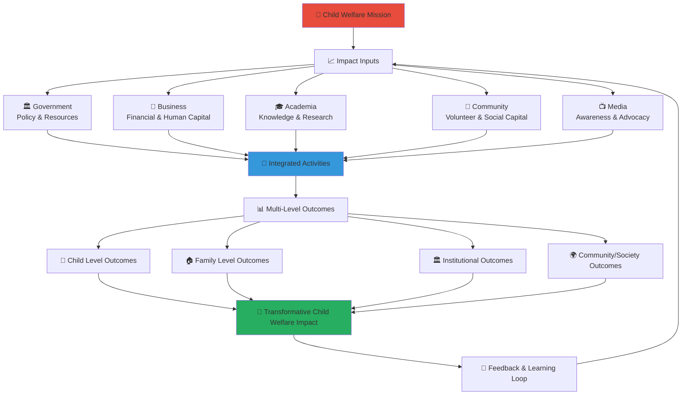

# Shared Impact Measurement Framework
## Comprehensive Multi-Stakeholder Impact Assessment for Child Welfare Excellence

> **Purpose**: Establish a unified impact measurement framework that captures the collective contributions and outcomes of all stakeholders in the penta-helix collaboration model, enabling evidence-based decision making, accountability, and continuous improvement while demonstrating the transformative impact on child welfare across Indonesia.

---

## 📊 Impact Measurement Philosophy

### Child-Centered Impact Framework
All impact measurement prioritizes child welfare outcomes and protection:

```yaml
Core Impact Principles:
  Child Outcomes First: Primary focus on child welfare improvements
  Holistic Measurement: Comprehensive assessment across multiple dimensions
  Evidence-Based: Data-driven measurement with rigorous methodology
  Stakeholder Value: Demonstrating value for all stakeholder investments
  
Measurement Values:
  Transparency: Open access to appropriate impact data
  Accountability: Clear attribution of outcomes to stakeholder contributions
  Learning: Continuous improvement based on measurement insights
  Sustainability: Long-term impact tracking and relationship building
```

### Integrated Impact Ecosystem
Multi-dimensional impact framework connecting stakeholder contributions to outcomes:



---

## 📋 Impact Measurement Framework Structure

### 1. Theory of Change Foundation

#### Platform Theory of Change
```yaml
Long-Term Vision (10 Years):
  Ultimate Goal: Transform child welfare system in Indonesia
  Impact Statement: Every vulnerable child in Indonesia has access to quality care, protection, and opportunities for development
  
  Success Indicators:
    National Coverage: MerajutASA model adopted in all 34 provinces
    Policy Integration: Platform principles integrated into national child welfare policy
    System Transformation: Measurable improvement in national child welfare outcomes
    International Recognition: Model replicated in other countries

Medium-Term Outcomes (3-5 Years):
  System Strengthening: Enhanced child welfare ecosystem capacity
  Service Quality: Improved quality of care in supported orphanages
  Stakeholder Integration: Effective multi-sector collaboration model
  Evidence Base: Robust research foundation for policy and practice
  
  Success Indicators:
    Service Quality Score: >4.5/5.0 across all supported institutions
    Stakeholder Satisfaction: >90% satisfaction across all stakeholder groups
    Research Publications: >50 peer-reviewed articles annually
    Policy Influence: Platform recommendations adopted in government policy

Short-Term Outcomes (1 Year):
  Platform Establishment: Operational platform serving target population
  Stakeholder Engagement: Active participation from all five stakeholder groups
  Service Delivery: Direct services to children and families
  Knowledge Generation: Research and evaluation activities
  
  Success Indicators:
    Children Served: >15,000 children annually
    Active Partnerships: >100 active stakeholder organizations
    Service Availability: 99.5% platform uptime
    Data Quality: >95% complete and accurate data
```

#### Stakeholder-Specific Theories of Change
```yaml
Government Stakeholder Theory:
  Input: Policy support, funding, regulatory framework
  Activities: Service delivery, compliance monitoring, inter-agency coordination
  Outputs: Enhanced service delivery, improved compliance, streamlined coordination
  Outcomes: Better child protection, more efficient government services
  Impact: Improved public trust and child welfare system effectiveness
  
Business Stakeholder Theory:
  Input: Financial resources, employee volunteers, expertise
  Activities: CSR programs, employee engagement, innovation development
  Outputs: Financial support, volunteer hours, technology solutions
  Outcomes: Enhanced brand reputation, employee satisfaction, market differentiation
  Impact: Sustainable business-social value integration
  
Academic Stakeholder Theory:
  Input: Research expertise, student engagement, knowledge creation
  Activities: Research studies, evaluation, curriculum development, student projects
  Outputs: Research findings, evidence base, trained professionals
  Outcomes: Evidence-based practice, enhanced professional capacity
  Impact: Improved child welfare through evidence-based interventions
  
Community Stakeholder Theory:
  Input: Volunteer time, local knowledge, grassroots networks
  Activities: Direct service, community mobilization, local fundraising
  Outputs: Volunteer services, community resources, local support networks
  Outcomes: Stronger communities, enhanced social cohesion
  Impact: Sustainable community-based child protection systems
  
Media Stakeholder Theory:
  Input: Communication expertise, platform access, storytelling capability
  Activities: Awareness campaigns, story amplification, advocacy
  Outputs: Media coverage, public awareness, narrative change
  Outcomes: Increased public support, policy attention, resource mobilization
  Impact: Social norm change and sustained commitment to child welfare
```

### 2. Multi-Level Impact Framework

#### Level 1: Child-Level Outcomes (Primary Impact)
```yaml
Child Development Outcomes:
  Physical Health:
    Indicators:
      - Regular health checkups completion rate
      - Immunization compliance rate
      - Nutritional status improvement
      - Chronic health condition management
    Targets:
      - >95% annual health checkup completion
      - Full age-appropriate immunization (targeting complete coverage)
      - >80% nutritional status improvement
      - >90% effective chronic condition management
    
  Educational Achievement:
    Indicators:
      - Grade-level academic performance
      - School enrollment and retention rates
      - Extracurricular participation
      - Post-secondary education preparation
    Targets:
      - >85% meeting grade-level standards
      - >98% school enrollment rate
      - >70% extracurricular participation
      - >60% post-secondary preparation
    
  Emotional and Social Wellbeing:
    Indicators:
      - Psychological assessment scores
      - Social relationship quality
      - Self-confidence and self-esteem measures
      - Behavioral development indicators
    Targets:
      - >85% positive psychological assessments
      - >80% healthy social relationships
      - >85% improved self-confidence scores
      - >90% positive behavioral development

Child Protection and Safety:
  Safety Indicators:
    - Child abuse and neglect incident rates
    - Safety protocol compliance
    - Child feedback on feeling safe
    - Emergency response effectiveness
  Targets:
    - Zero tolerance for abuse/neglect (0 incidents)
    - Full safety protocol compliance (targeting complete adherence)
    - >95% children report feeling safe
    - <30 minutes emergency response time
    
  Rights and Participation:
    - Child participation in decision-making
    - Access to age-appropriate information
    - Expression of preferences and opinions
    - Advocacy and self-representation skills
  Targets:
    - >70% meaningful participation in decisions
    - 100% access to age-appropriate information
    - >80% comfortable expressing opinions
    - >60% developing advocacy skills
```

#### Level 2: Family and Relationship Outcomes
```yaml
Family Preservation and Reunification:
  Family Connection:
    Indicators:
      - Family contact frequency and quality
      - Family reunification success rates
      - Extended family engagement
      - Community family support networks
    Targets:
      - >80% regular positive family contact
      - >25% successful family reunification
      - >60% extended family engagement
      - >70% community support network development
    
  Family Capacity Building:
    Indicators:
      - Parental skill development
      - Economic stability improvement
      - Housing stability achievement
      - Support service utilization
    Targets:
      - >70% parental skill improvement
      - >50% economic stability achievement
      - >60% housing stability attainment
      - >80% appropriate service utilization

Alternative Care Quality:
  Care Environment:
    Indicators:
      - Care quality assessment scores
      - Child-caregiver relationship quality
      - Placement stability rates
      - Transition planning effectiveness
    Targets:
      - >4.5/5.0 care quality score
      - >85% positive child-caregiver relationships
      - >90% placement stability
      - >80% effective transition planning
```

#### Level 3: Institutional and System Outcomes
```yaml
Orphanage and Institution Improvement:
  Operational Excellence:
    Indicators:
      - Service quality assessment scores
      - Staff competency and satisfaction
      - Financial sustainability measures
      - Technology adoption and utilization
    Targets:
      - >4.5/5.0 service quality score
      - >85% staff competency standards met
      - >80% financial sustainability achievement
      - >90% effective technology utilization
    
  Compliance and Standards:
    Indicators:
      - Regulatory compliance rates
      - International standard adherence
      - Child protection policy implementation
      - Continuous improvement implementation
    Targets:
      - 100% regulatory compliance
      - >95% international standard adherence
      - 100% child protection policy implementation
      - >80% continuous improvement plan execution

Child Welfare System Strengthening:
  System Coordination:
    Indicators:
      - Inter-agency collaboration effectiveness
      - Service integration and continuity
      - Information sharing and coordination
      - Resource optimization achievement
    Targets:
      - >85% effective inter-agency collaboration
      - >80% service integration achievement
      - >90% effective information sharing
      - >75% resource optimization success
    
  Policy and Practice Improvement:
    Indicators:
      - Evidence-based policy adoption
      - Best practice implementation rates
      - Innovation adoption and scaling
      - Professional development enhancement
    Targets:
      - >70% evidence-based policy adoption
      - >80% best practice implementation
      - >60% innovation adoption success
      - >85% professional development completion
```

#### Level 4: Community and Societal Outcomes
```yaml
Community Engagement and Social Capital:
  Community Mobilization:
    Indicators:
      - Volunteer participation rates
      - Community resource mobilization
      - Local partnership development
      - Social cohesion measures
    Targets:
      - >5,000 active volunteers annually
      - >Rp 500 million community fundraising
      - >200 local partnerships
      - >80% improved social cohesion scores
    
  Cultural and Social Change:
    Indicators:
      - Public attitude toward orphan care
      - Community child protection awareness
      - Social norm change indicators
      - Advocacy and policy influence
    Targets:
      - >75% positive attitude change
      - >80% child protection awareness
      - >70% positive social norm change
      - >60% policy influence success

National and International Impact:
  Policy and System Influence:
    Indicators:
      - National policy integration
      - International recognition and replication
      - Research and evidence contribution
      - Global best practice development
    Targets:
      - >50% platform principles in national policy
      - >3 international replication sites
      - >50 peer-reviewed publications annually
      - >10 global best practices developed
```

---

## 📈 Stakeholder-Specific Impact Measurement

### 1. Government Stakeholder Impact

#### Government Investment and Return
```yaml
Government Input Measurement:
  Financial Investment:
    - Direct funding allocation and utilization
    - In-kind resource contribution valuation
    - Staff time and expertise investment
    - Infrastructure and technology support
    Measurement Method: Financial tracking and time allocation analysis
    Reporting Frequency: Monthly financial reports, quarterly investment analysis
    
  Policy and Regulatory Support:
    - Policy development and implementation effort
    - Regulatory framework enhancement
    - Inter-agency coordination facilitation
    - Legal and compliance support provision
    Measurement Method: Policy analysis and regulatory impact assessment
    Reporting Frequency: Quarterly policy review, annual regulatory assessment

Government Outcome Achievement:
  Service Delivery Improvement:
    Indicators:
      - Service efficiency enhancement (40% faster case processing)
      - Service quality improvement (>4.5/5.0 satisfaction)
      - Service accessibility expansion (>90% geographic coverage)
      - Service integration success (>80% coordinated services)
    
  Public Accountability Enhancement:
    Indicators:
      - Transparency improvement (real-time dashboard access)
      - Public trust increase (>80% confidence in government services)
      - Citizen satisfaction improvement (>85% service satisfaction)
      - Democratic participation enhancement (>70% citizen engagement)
    
  Policy and System Effectiveness:
    Indicators:
      - Evidence-based policy adoption (>70% research-informed decisions)
      - Inter-agency coordination improvement (>85% effective collaboration)
      - Resource optimization achievement (>20% efficiency gain)
      - Compliance and oversight enhancement (100% regulatory compliance)
```

#### Government ROI Calculation
```yaml
Government Return on Investment:
  Quantitative ROI:
    Investment Calculation:
      - Direct financial investment: Rp X billion annually
      - Staff time investment: X,XXX hours annually valued at Rp X billion
      - Infrastructure investment: Rp X billion over 3 years
      - Total Investment: Rp X billion annually
    
    Return Calculation:
      - Service delivery efficiency savings: Rp X billion annually
      - Reduced administrative overhead: Rp X billion annually
      - Improved outcome value: Rp X billion in social value created
      - Total Return: Rp X billion annually
    
    ROI Ratio: X:1 (Every Rupiah invested returns X Rupiah in value)
    
  Qualitative ROI:
    - Enhanced government reputation and public trust
    - Improved inter-agency coordination and collaboration
    - Strengthened evidence base for policy development
    - Enhanced capacity for innovation and continuous improvement
```

### 2. Business Stakeholder Impact

#### Corporate Investment and Return
```yaml
Business Input Measurement:
  Financial Contribution:
    - Direct monetary donations and grants
    - In-kind product and service donations
    - Employee volunteer time valuation
    - Technology and expertise contribution
    Measurement Method: Financial tracking and market value assessment
    Reporting Frequency: Monthly contribution tracking, quarterly ROI analysis
    
  Human Capital Investment:
    - Employee volunteer hours and participation
    - Skills-based volunteering and expertise sharing
    - Board and advisory participation
    - Training and capacity building support
    Measurement Method: Time tracking and expertise valuation
    Reporting Frequency: Monthly volunteer reports, quarterly capacity analysis

Business Outcome Achievement:
  Brand and Reputation Enhancement:
    Indicators:
      - Brand awareness and recognition improvement
      - Corporate reputation score increase
      - Media sentiment improvement (>90% positive coverage)
      - Stakeholder perception enhancement (>85% positive view)
    
  Employee Engagement and Satisfaction:
    Indicators:
      - Employee volunteer participation (>60% participation rate)
      - Employee satisfaction with CSR programs (>85% satisfaction)
      - Employee retention improvement (>90% retention rate)
      - Employee skill development and career satisfaction
    
  Business Performance Impact:
    Indicators:
      - Customer loyalty and preference improvement
      - Talent attraction and recruitment enhancement
      - Operational efficiency and innovation development
      - Risk mitigation and compliance improvement
```

#### Business Social Return on Investment (SROI)
```yaml
Business SROI Calculation:
  Investment Valuation:
    - Financial investment: Rp X billion annually
    - Employee time investment: X,XXX hours valued at Rp X billion
    - In-kind contribution: Rp X billion in products/services
    - Total Investment: Rp X billion annually
    
  Social Value Created:
    - Direct child welfare improvement: Rp X billion in social value
    - Community development impact: Rp X billion in economic value
    - System strengthening contribution: Rp X billion in efficiency value
    - Total Social Value: Rp X billion annually
    
  Business Value Received:
    - Brand value enhancement: Rp X billion
    - Employee engagement value: Rp X billion
    - Customer loyalty value: Rp X billion
    - Innovation and efficiency value: Rp X billion
    - Total Business Value: Rp X billion annually
    
  SROI Ratio: X:1 (Every Rupiah invested creates X Rupiah in combined social and business value)
```

### 3. Academic Stakeholder Impact

#### Academic Contribution and Knowledge Value
```yaml
Academic Input Measurement:
  Research Investment:
    - Faculty time and expertise contribution
    - Student researcher participation
    - Research infrastructure and technology
    - Publication and dissemination effort
    Measurement Method: Time tracking and research output analysis
    Reporting Frequency: Quarterly research progress, annual knowledge assessment
    
  Knowledge Creation and Transfer:
    - Research study design and implementation
    - Data analysis and interpretation
    - Publication development and peer review
    - Knowledge translation and practice integration
    Measurement Method: Publication metrics and knowledge utilization tracking
    Reporting Frequency: Monthly research updates, quarterly knowledge transfer assessment

Academic Outcome Achievement:
  Research Excellence and Impact:
    Indicators:
      - Peer-reviewed publication output (>50 articles annually)
      - Research citation and impact factor
      - Grant funding acquisition success (>Rp X billion annually)
      - Research methodology innovation and development
    
  Knowledge Translation and Practice Impact:
    Indicators:
      - Evidence-based practice adoption (>80% research utilization)
      - Policy influence and recommendation adoption (>70% uptake)
      - Professional development and training impact
      - International collaboration and recognition
    
  Student Development and Career Impact:
    Indicators:
      - Student research participation (>500 students annually)
      - Graduate employment in child welfare field (>70% placement)
      - Student skill development and competency
      - Alumni career advancement and leadership
```

#### Academic Knowledge Return on Investment
```yaml
Academic Knowledge ROI:
  Investment in Knowledge Creation:
    - Faculty time investment: X,XXX hours valued at Rp X billion
    - Student researcher time: X,XXX hours valued at Rp X billion
    - Research infrastructure: Rp X billion annually
    - Total Knowledge Investment: Rp X billion annually
    
  Knowledge Value Generated:
    - Research findings and evidence: Rp X billion in knowledge value
    - Policy and practice improvement: Rp X billion in application value
    - Professional capacity building: Rp X billion in human capital value
    - International recognition: Rp X billion in reputation value
    - Total Knowledge Value: Rp X billion annually
    
  Knowledge ROI: X:1 (Every Rupiah invested in research generates X Rupiah in knowledge value)
```

### 4. Community Stakeholder Impact

#### Community Contribution and Social Capital
```yaml
Community Input Measurement:
  Volunteer Contribution:
    - Volunteer time and service hours
    - Skills-based volunteering and expertise
    - Community resource mobilization
    - Local fundraising and donation coordination
    Measurement Method: Volunteer tracking and community resource assessment
    Reporting Frequency: Monthly volunteer reports, quarterly community impact analysis
    
  Social Capital Development:
    - Community network building and strengthening
    - Local leadership development and training
    - Cultural knowledge and wisdom sharing
    - Peer support and mutual aid coordination
    Measurement Method: Social network analysis and community capacity assessment
    Reporting Frequency: Quarterly social capital review, annual community development assessment

Community Outcome Achievement:
  Community Strengthening and Cohesion:
    Indicators:
      - Community volunteer participation (>5,000 active volunteers)
      - Local resource mobilization (>Rp 500 million annually)
      - Community leadership development (>100 leaders trained)
      - Social cohesion and trust improvement (>80% cohesion score)
    
  Local Child Protection Enhancement:
    Indicators:
      - Community child protection awareness (>85% awareness rate)
      - Local safety network development (>200 community networks)
      - Neighborhood support system strength
      - Community advocacy and policy influence
    
  Economic and Social Development:
    Indicators:
      - Local business development and employment
      - Community asset and resource development
      - Social entrepreneurship and innovation
      - Cultural preservation and celebration
```

#### Community Social Return on Investment
```yaml
Community SROI Calculation:
  Community Investment:
    - Volunteer time contribution: X,XXX hours valued at Rp X billion
    - Community resource mobilization: Rp X billion annually
    - Local fundraising contribution: Rp X billion annually
    - Total Community Investment: Rp X billion annually
    
  Community Value Created:
    - Direct child support value: Rp X billion in services
    - Community development value: Rp X billion in local improvement
    - Social capital value: Rp X billion in network strength
    - Cultural preservation value: Rp X billion in heritage maintenance
    - Total Community Value: Rp X billion annually
    
  Community SROI: X:1 (Every Rupiah of community investment creates X Rupiah in local value)
```

### 5. Media Stakeholder Impact

#### Media Contribution and Awareness Value
```yaml
Media Input Measurement:
  Communication Investment:
    - Media coverage time and space allocation
    - Journalist time and expertise contribution
    - Content creation and production resources
    - Distribution and amplification effort
    Measurement Method: Media monitoring and content analysis
    Reporting Frequency: Monthly media analysis, quarterly communication impact assessment
    
  Advocacy and Awareness Building:
    - Story development and investigative reporting
    - Public awareness campaign participation
    - Advocacy messaging and narrative development
    - Community engagement facilitation
    Measurement Method: Audience analysis and engagement tracking
    Reporting Frequency: Monthly audience reports, quarterly advocacy impact analysis

Media Outcome Achievement:
  Public Awareness and Education:
    Indicators:
      - Media coverage volume (>1,000 stories annually)
      - Audience reach and engagement (>10 million people monthly)
      - Message recall and comprehension (>70% message retention)
      - Attitude and behavior change (>60% positive attitude shift)
    
  Advocacy and Policy Influence:
    Indicators:
      - Policy attention and discussion generation
      - Public opinion formation and influence
      - Resource mobilization and support generation
      - Social norm change and cultural shift
    
  Narrative Change and Social Impact:
    Indicators:
      - Positive framing of child welfare issues (>85% positive coverage)
      - Stigma reduction and understanding improvement
      - Community engagement and participation increase
      - Long-term social change contribution
```

#### Media Social Impact Return
```yaml
Media Impact ROI:
  Media Investment Value:
    - Media coverage value: Rp X billion in equivalent advertising
    - Journalist time investment: X,XXX hours valued at Rp X billion
    - Content production resources: Rp X billion annually
    - Total Media Investment: Rp X billion annually
    
  Social Impact Generated:
    - Public awareness value: Rp X billion in education impact
    - Policy influence value: Rp X billion in decision-making impact
    - Resource mobilization value: Rp X billion in funding generated
    - Social change value: Rp X billion in long-term transformation
    - Total Social Impact: Rp X billion annually
    
  Media Social ROI: X:1 (Every Rupiah of media investment generates X Rupiah in social impact)
```

---

## 🔄 Integrated Impact Dashboard

### 1. Real-Time Impact Monitoring

#### Live Impact Dashboard (merajutasa.id/impact)
```yaml
Primary Impact Indicators:
  Children Served Counter: 12,847 children (Live update)
  Active Partnerships: 167 stakeholder organizations
  Volunteer Hours This Month: 8,234 hours
  Donations This Month: Rp 234 million
  
Child Welfare Outcomes:
  Children Safe and Protected: 100% (0 safety incidents)
  Educational Progress: 89% meeting grade-level standards
  Health Status: 96% up-to-date health care
  Emotional Wellbeing: 87% positive psychological assessments
  
Stakeholder Engagement:
  Government Satisfaction: 4.8/5.0
  Business Partner Satisfaction: 4.6/5.0
  Academic Collaboration Score: 4.7/5.0
  Community Engagement: 4.9/5.0
  Media Relations: 4.5/5.0
  
System Performance:
  Platform Uptime: 99.97%
  Service Quality Score: 4.6/5.0
  Response Time: <500ms average
  User Satisfaction: 4.8/5.0
```

#### Early Warning and Alert System
```yaml
Performance Alerts:
  Child Safety Alerts: Immediate notification for any safety concerns
  Service Quality Alerts: Notification when quality scores drop below 4.0
  Stakeholder Satisfaction Alerts: Warning when satisfaction drops below 4.0
  System Performance Alerts: Notification for technical issues affecting service
  
Predictive Analytics:
  Risk Assessment: AI-powered prediction of potential issues
  Trend Analysis: Pattern recognition for proactive intervention
  Resource Forecasting: Predictive modeling for resource allocation
  Outcome Prediction: Machine learning for outcome forecasting
```

### 2. Periodic Impact Assessment

#### Monthly Impact Review
```yaml
Quantitative Assessment:
  Child Outcomes:
    New children served: XXX children
    Educational milestones achieved: XXX achievements
    Health improvements: XXX improvements
    Safety incidents: 0 (Target: 0)
    
  Stakeholder Performance:
    Government collaboration score: X.X/5.0
    Business partnership effectiveness: X.X/5.0
    Academic research progress: XXX% completion
    Community engagement level: X.X/5.0
    Media coverage and reach: XXX stories, XXX million reach
    
  System Effectiveness:
    Service delivery efficiency: XXX% target achievement
    Resource utilization: XXX% optimization
    Technology performance: XXX% uptime
    User satisfaction: X.X/5.0

Qualitative Assessment:
  Success Stories: Notable achievements and breakthrough moments
  Challenge Analysis: Key challenges and lessons learned
  Innovation Highlights: New approaches and creative solutions
  Relationship Development: Stakeholder relationship strengthening
```

#### Quarterly Comprehensive Review
```yaml
Strategic Impact Assessment:
  Mission Alignment: Assessment of progress toward long-term vision
  Strategic Goal Achievement: Progress toward quarterly and annual targets
  Stakeholder Value Creation: Value delivered to each stakeholder group
  Innovation and Learning: New knowledge and capability development
  
Comparative Analysis:
  Trend Analysis: Quarter-over-quarter performance comparison
  Benchmark Comparison: Performance against national and international standards
  Peer Comparison: Performance relative to similar organizations
  Best Practice Identification: Successful approaches for replication
  
Future Planning:
  Strategic Adjustment: Refinements to strategy based on evidence
  Resource Allocation: Optimal resource distribution for next quarter
  Partnership Development: New partnership opportunities and expansions
  Innovation Pipeline: Upcoming innovations and pilot programs
```

### 3. Annual Impact Evaluation

#### Comprehensive Annual Assessment
```yaml
Outcome Evaluation:
  Child Welfare Impact:
    Long-term child development outcomes
    Family preservation and reunification success
    Child protection and safety achievements
    Educational and life preparation progress
    
  System Change Impact:
    Child welfare system strengthening
    Policy and practice improvement
    Professional capacity enhancement
    Innovation adoption and scaling
    
  Social Impact:
    Community engagement and empowerment
    Public awareness and attitude change
    Cultural and social norm transformation
    National and international influence

Stakeholder Value Assessment:
  Government Value:
    Policy implementation effectiveness
    Service delivery improvement
    Public accountability enhancement
    Inter-agency coordination success
    
  Business Value:
    Social return on investment achievement
    Brand and reputation enhancement
    Employee engagement and satisfaction
    Innovation and efficiency development
    
  Academic Value:
    Research excellence and impact
    Knowledge creation and translation
    Student development and career preparation
    International collaboration and recognition
    
  Community Value:
    Community strengthening and empowerment
    Local resource development
    Social capital and cohesion building
    Cultural preservation and celebration
    
  Media Value:
    Public awareness and education impact
    Advocacy and policy influence
    Narrative change and social transformation
    Professional development and recognition
```

#### Annual Strategic Planning
```yaml
Strategic Review and Planning:
  Vision and Mission Assessment: Relevance and achievement of organizational purpose
  Strategic Goal Review: Progress toward long-term objectives and necessary adjustments
  Stakeholder Relationship Analysis: Partnership effectiveness and development opportunities
  Innovation and Growth Planning: Future development and expansion strategies
  
Resource and Investment Planning:
  Financial Planning: Budget allocation and investment priorities
  Human Resource Development: Staff and volunteer capacity building
  Technology Investment: Platform development and infrastructure enhancement
  Partnership Investment: Stakeholder relationship building and new partnership development
  
Risk Assessment and Mitigation:
  Risk Identification: Potential threats to mission achievement
  Risk Assessment: Probability and impact analysis of identified risks
  Mitigation Strategy: Preventive measures and response planning
  Contingency Planning: Backup plans and emergency procedures
```

---

## 📊 Impact Reporting and Communication

### 1. Stakeholder-Specific Reporting

#### Government Impact Reports
```yaml
Monthly Government Reports:
  Compliance Status: Regulatory compliance and legal requirement adherence
  Service Delivery Performance: Quantitative performance against government targets
  Inter-Agency Coordination: Collaboration effectiveness and coordination outcomes
  Policy Recommendations: Evidence-based recommendations for policy development
  
Quarterly Government Briefings:
  Strategic Alignment: Platform alignment with government priorities and policies
  Impact on Government Goals: Contribution to government social service objectives
  Resource Utilization: Efficient use of government funding and resources
  Innovation and Best Practices: New approaches for government consideration
  
Annual Government Assessment:
  Comprehensive Impact Report: Full assessment of government partnership value
  Policy Impact Analysis: Platform influence on policy development and implementation
  System Strengthening Contribution: Platform role in child welfare system improvement
  Future Partnership Planning: Strategic planning for government partnership enhancement
```

#### Business Impact Reports
```yaml
Monthly Business Updates:
  Partnership Performance: Quantitative metrics on business partnership effectiveness
  Employee Engagement: Volunteer participation and satisfaction measures
  Brand Impact: Media coverage and reputation enhancement tracking
  Innovation Collaboration: Technology and innovation partnership outcomes
  
Quarterly Business Reviews:
  Social Return on Investment: Comprehensive SROI analysis and reporting
  Partnership Value: Value delivered to business partners and value received
  Market Differentiation: Competitive advantage through social impact partnership
  Strategic Alignment: Alignment with business sustainability and ESG goals
  
Annual Business Partnership Report:
  Comprehensive Partnership Assessment: Full evaluation of business partnership value
  Long-term Value Creation: Sustainable value creation for business and society
  Innovation and Growth: Partnership contribution to business innovation and growth
  Future Partnership Strategy: Strategic planning for business partnership expansion
```

#### Academic Impact Reports
```yaml
Monthly Research Updates:
  Research Progress: Status of ongoing research projects and studies
  Publication Pipeline: Academic publication development and submission status
  Student Engagement: Student researcher participation and development
  Knowledge Translation: Research-to-practice application and adoption
  
Quarterly Academic Reviews:
  Research Impact Assessment: Academic impact and citation analysis
  Knowledge Creation Value: New knowledge and evidence contribution
  Professional Development: Faculty and student capacity building outcomes
  International Collaboration: Global academic partnership development
  
Annual Academic Impact Report:
  Research Excellence Assessment: Comprehensive evaluation of research quality and impact
  Knowledge Translation Impact: Evidence-based practice adoption and policy influence
  Academic Partnership Value: Value creation for academic institutions and researchers
  Future Research Strategy: Strategic planning for academic collaboration expansion
```

#### Community Impact Reports
```yaml
Monthly Community Updates:
  Volunteer Engagement: Volunteer participation and satisfaction measures
  Community Resource Mobilization: Local fundraising and resource development
  Local Partnership Development: Community organization collaboration
  Community Capacity Building: Leadership development and skill building outcomes
  
Quarterly Community Reviews:
  Community Strengthening Impact: Social capital and cohesion development
  Local Child Protection Enhancement: Community-based child protection improvements
  Economic and Social Development: Community development and empowerment outcomes
  Cultural Preservation: Traditional knowledge and cultural practice integration
  
Annual Community Impact Report:
  Community Empowerment Assessment: Comprehensive evaluation of community partnership value
  Social Capital Development: Long-term community capacity and relationship building
  Local Impact: Community-level transformation and improvement outcomes
  Future Community Strategy: Strategic planning for community partnership enhancement
```

#### Media Impact Reports
```yaml
Monthly Media Analytics:
  Coverage Analysis: Media coverage volume, reach, and sentiment analysis
  Audience Engagement: Public engagement and interaction with media content
  Message Effectiveness: Communication message recall and comprehension
  Narrative Impact: Story framing and narrative change measurement
  
Quarterly Media Reviews:
  Public Awareness Impact: Awareness building and education outcome assessment
  Advocacy Effectiveness: Policy influence and social change contribution
  Media Partnership Value: Value creation for media partners and platform
  Communication Strategy Assessment: Communication effectiveness and optimization
  
Annual Media Impact Report:
  Communication Impact Assessment: Comprehensive evaluation of media partnership value
  Public Opinion and Behavior Change: Long-term attitude and behavior transformation
  Social Movement Contribution: Platform role in social change and advocacy
  Future Media Strategy: Strategic planning for media partnership enhancement
```

### 2. Public Impact Communication

#### Public Impact Dashboard
```yaml
Accessible Public Reporting:
  Simple Impact Metrics: Easy-to-understand key performance indicators
  Visual Impact Stories: Infographics and data visualization for public understanding
  Success Story Highlights: Compelling narratives of transformation and achievement
  Transparency Measures: Open access to appropriate platform data and information
  
Interactive Public Engagement:
  Community Feedback: Public input and feedback collection mechanisms
  Stakeholder Recognition: Public appreciation and recognition of stakeholder contributions
  Educational Resources: Public education about child welfare and platform impact
  Advocacy Opportunities: Ways for public to support and advocate for child welfare
```

#### Annual Public Impact Report
```yaml
Comprehensive Public Report:
  Executive Summary: High-level overview of platform impact and achievements
  Child Welfare Transformation: Detailed assessment of child welfare improvement
  Stakeholder Contributions: Recognition and appreciation of stakeholder partnership
  Financial Transparency: Clear reporting on resource utilization and financial stewardship
  Future Vision: Strategic direction and long-term goals for continued impact
  
Public Engagement Strategy:
  Report Launch: Public event for annual report release and discussion
  Media Engagement: Proactive media outreach and story development
  Stakeholder Recognition: Public celebration and appreciation of stakeholder contributions
  Community Discussion: Public forums for feedback and input on platform direction
```

---

## 📚 Impact Measurement Tools and Resources

### 1. Data Collection and Analysis Tools

#### Quantitative Data Collection
```yaml
Survey Platforms:
  SurveyMonkey Enterprise: Stakeholder satisfaction and feedback surveys
  Qualtrics: Comprehensive research surveys and advanced analytics
  Google Forms: Simple feedback collection and quick surveys
  Microsoft Forms: Integrated feedback collection within Microsoft ecosystem
  
Data Analytics Platforms:
  Microsoft Power BI: Real-time dashboard and business intelligence
  Tableau: Advanced data visualization and interactive reporting
  Google Analytics: Website and platform usage analytics
  Custom Analytics: Platform-specific data analysis and reporting tools
```

#### Qualitative Data Collection
```yaml
Interview and Focus Group Tools:
  Microsoft Teams: Virtual interviews and focus group facilitation
  Zoom: Video conferencing with recording and transcription capabilities
  NVivo: Qualitative data analysis and coding software
  Atlas.ti: Qualitative research and mixed methods analysis
  
Observation and Documentation:
  Field Visit Protocols: Standardized observation and documentation procedures
  Photo and Video Documentation: Visual evidence collection with privacy protection
  Case Study Development: Comprehensive individual and organizational case studies
  Story Collection: Narrative collection and development for impact communication
```

### 2. Impact Evaluation Methodologies

#### Experimental and Quasi-Experimental Design
```yaml
Randomized Controlled Trials:
  Child Outcome Studies: Controlled studies of intervention effectiveness
  Program Evaluation: Experimental evaluation of specific program components
  Innovation Testing: Rigorous testing of new approaches and interventions
  Comparative Effectiveness: Comparison of different intervention approaches
  
Quasi-Experimental Design:
  Pre-Post Comparison: Before and after intervention comparison
  Matched Comparison: Comparison with similar non-participating groups
  Time Series Analysis: Long-term trend analysis and pattern identification
  Difference-in-Differences: Advanced comparison methodology for causal inference
```

#### Mixed Methods Evaluation
```yaml
Integrated Evaluation Approach:
  Quantitative Analysis: Statistical analysis of outcome and performance data
  Qualitative Analysis: In-depth exploration of experiences and processes
  Participatory Evaluation: Stakeholder involvement in evaluation design and implementation
  Developmental Evaluation: Real-time evaluation for continuous improvement
  
Evaluation Capacity Building:
  Staff Training: Evaluation skills development for platform staff
  Stakeholder Training: Evaluation literacy development for stakeholder partners
  External Evaluation: Independent evaluation by external researchers and evaluators
  Peer Review: Evaluation quality assurance through expert review
```

---

**Platform**: MerajutASA - Indonesian Child Welfare Platform  
**Domain**: merajutasa.id  
**Impact Framework**: Comprehensive multi-stakeholder impact measurement system  
**Focus**: Evidence-based demonstration of collective impact on child welfare outcomes
