# Stakeholder Onboarding Documentation
## Comprehensive Onboarding Framework for Penta-Helix Collaboration

> **Mission**: Provide structured, accessible, and comprehensive onboarding processes that enable all stakeholders to quickly understand their role, access relevant resources, and begin contributing effectively to child welfare outcomes through the MerajutASA platform.

---

## 🎯 Onboarding Philosophy

### Child-Centered Orientation
All stakeholder onboarding prioritizes understanding child welfare impact:

```yaml
Onboarding Principles:
  Child Welfare First: Understanding how each role supports children
  Mission Alignment: Clear connection between stakeholder work and platform mission
  
Orientation Values:
  Empowerment: Providing tools and knowledge for effective participation
  Inclusion: Welcoming all stakeholders regardless of technical background
  Continuous Learning: Ongoing support and skill development
  Cultural Respect: Honoring Indonesian values and diverse stakeholder perspectives
```

### Penta-Helix Onboarding Model
Structured onboarding framework serving five stakeholder sectors:

```mermaid
graph TD
    A[🌟 Welcome to MerajutASA] --> B[🔍 Stakeholder Assessment]
    
    B --> C[🏛️ Government<br/>Onboarding Track]
    B --> D[🏢 Business<br/>Onboarding Track]
    B --> E[🎓 Academia<br/>Onboarding Track]
    B --> F[👥 Community<br/>Onboarding Track]
    B --> G[📺 Media<br/>Onboarding Track]
    
    C --> H[📚 Role-Specific Training]
    D --> H
    E --> H
    F --> H
    G --> H
    
    H --> I[🤝 Cross-Sector Integration]
    I --> J[🎯 Platform Activation]
    J --> K[📈 Ongoing Development]
    
    K --> L[👶 Enhanced Child Welfare Outcomes]
    
    style A fill:#E74C3C
    style B fill:#F39C12
    style L fill:#27AE60
```



---

## 🚀 Universal Onboarding Journey

### Phase 1: Welcome and Assessment (Day 1)

#### Platform Mission Introduction
```yaml
Welcome Session (60 minutes):
  MerajutASA Overview:
    - Platform mission and vision for child welfare
    - Penta-helix collaboration model explanation
    - Success stories and impact demonstration
    - Indonesian child welfare context and challenges
    
  Stakeholder Role Context:
    - How your sector contributes to child welfare
    - Unique value proposition and opportunities
    - Collaboration potential with other sectors
    - Expected outcomes and success metrics
    
  Cultural and Ethical Foundation:
    - Indonesian cultural values integration
    - Child protection principles and safeguarding
    - Ethical considerations for working with vulnerable children
    - Confidentiality and privacy requirements
```

#### Stakeholder Assessment and Track Selection
```yaml
Assessment Process (30 minutes):
  Background Evaluation:
    - Professional experience and expertise
    - Current role and organizational context
    - Previous social impact or child welfare experience
    - Technical comfort level and training needs
    
  Objective Setting:
    - Personal goals for platform engagement
    - Organizational objectives and priorities
    - Available time commitment and resources
    - Preferred communication and collaboration styles
    
  Track Assignment:
    - Primary stakeholder sector identification
    - Secondary sector interests and cross-sector opportunities
    - Customized onboarding pathway recommendation
    - Timeline and milestone planning
```

### Phase 2: Foundational Training (Days 2-5)

#### Core Platform Knowledge
```yaml
Platform Fundamentals (4 hours, spread over 3 days):
  Technical Overview:
    - Platform architecture and key features
    - User interface navigation and basic functions
    - Security protocols and data protection measures
    - Mobile app and web portal functionality
    
  Child Welfare Framework:
    - Indonesian orphanage system overview
    - Child protection standards and best practices
    - Trauma-informed care principles
    - Family preservation and reunification approaches
    
  Collaboration Tools:
    - Communication platforms and protocols
    - Project management and coordination tools
    - Document sharing and collaboration systems
    - Meeting and event coordination methods
```

#### Cross-Sector Understanding
```yaml
Penta-Helix Collaboration Training (3 hours):
  Sector Introductions:
    - Government sector role and contribution
    - Business sector partnership opportunities
    - Academic sector research and knowledge support
    - Community sector grassroots engagement
    - Media sector communication and awareness
    
  Integration Principles:
    - Cross-sector communication best practices
    - Conflict resolution and consensus building
    - Shared decision-making processes
    - Resource coordination and optimization
    
  Practical Collaboration:
    - Joint project planning and execution
    - Stakeholder meeting participation
    - Information sharing protocols
    - Innovation and problem-solving approaches
```

### Phase 3: Sector-Specific Deep Dive (Days 6-10)

#### Specialized Training Programs
```yaml
Sector-Specific Onboarding:
  Government Track: 5-day comprehensive government stakeholder program
  Business Track: 5-day corporate partnership and CSR integration program
  Academia Track: 5-day research collaboration and knowledge translation program
  Community Track: 5-day volunteer coordination and grassroots engagement program
  Media Track: 5-day communication strategy and content creation program
  
Training Components:
  Role-Specific Skills: Technical and professional skills for sector contribution
  Resource Access: Platform tools and resources specific to sector needs
  Network Integration: Introduction to sector-specific communities and contacts
  Project Assignment: Initial project or responsibility assignment
```

### Phase 4: Integration and Activation (Days 11-15)

#### Cross-Sector Integration
```yaml
Integration Activities (Week 3):
  Multi-Sector Project Participation:
    - Assignment to active cross-sector initiative
    - Mentorship pairing with experienced stakeholder
    - Participation in stakeholder coordination meetings
    - Contribution to ongoing platform development
    
  Network Building:
    - Introduction to key stakeholders across all sectors
    - Participation in informal networking events
    - Access to stakeholder communication channels
    - Integration into relevant working groups
    
  Skill Application:
    - Application of newly acquired skills to real projects
    - Feedback and coaching from sector coordinators
    - Adjustment of role and responsibilities based on performance
    - Planning for continued professional development
```

#### Platform Activation
```yaml
Full Platform Access (Days 13-15):
  Account Activation:
    - Full platform access with appropriate permissions
    - Personalized dashboard and resource configuration
    - Integration with organizational systems as appropriate
    - Mobile app installation and configuration
    
  First Contribution:
    - Completion of first significant platform contribution
    - Documentation of contribution and lessons learned
    - Feedback collection and integration
    - Recognition and celebration of achievement
    
  Ongoing Support Setup:
    - Assignment of mentor or buddy for continued support
    - Scheduling of regular check-ins and feedback sessions
    - Access to ongoing training and development resources
    - Integration into continuous improvement processes
```

### Phase 5: Ongoing Development (30-90 days)

#### Continuous Learning and Growth
```yaml
Professional Development (Ongoing):
  Advanced Training Opportunities:
    - Specialized skill development programs
    - Leadership and coordination training
    - Innovation and problem-solving workshops
    - International best practice learning
    
  Performance Support:
    - Regular performance review and feedback
    - Goal setting and achievement tracking
    - Recognition and advancement opportunities
    - Peer learning and knowledge sharing
    
  Platform Evolution:
    - Participation in platform improvement initiatives
    - Feedback provision for feature development
    - Innovation and creative solution development
    - Leadership in sector-specific improvements
```

---

## 📋 Onboarding Success Metrics

### Individual Stakeholder Success
```yaml
Knowledge Acquisition:
  Platform Knowledge: >90% score on platform functionality assessment
  Child Welfare Understanding: >85% score on child protection principles
  Collaboration Skills: >80% rating on cross-sector communication
  Cultural Competency: >85% rating on Indonesian cultural awareness
  
Engagement Quality:
  Participation Rate: >80% attendance at required training sessions
  Contribution Level: Completion of assigned onboarding projects
  Network Integration: Active participation in stakeholder communications
  Satisfaction Score: >4.5/5.0 overall onboarding experience rating
```

### Organizational Onboarding Effectiveness
```yaml
Onboarding Efficiency:
  Time to Productivity: Average 15 days from start to full contribution
  Retention Rate: >90% stakeholder retention after 90 days
  Engagement Maintenance: >85% continued active participation after 6 months
  Skill Development: Documented skill improvement across all competencies
  
Platform Impact:
  Contribution Quality: High-quality contributions from newly onboarded stakeholders
  Innovation Generation: New ideas and improvements from fresh perspectives
  Network Growth: Expansion of stakeholder network through onboarding alumni
  Cultural Integration: Successful integration of diverse stakeholder perspectives
```

---

## 🎓 Sector-Specific Onboarding Tracks

### 🏛️ Government Stakeholder Onboarding
**Timeline**: 5 days intensive program  
**Focus**: Policy implementation, regulatory compliance, and public service delivery

#### Key Learning Outcomes
```yaml
Government Expertise Development:
  Regulatory Framework: Understanding of relevant Indonesian laws and regulations
  Digital Government: Knowledge of digital transformation in public services
  Child Protection Policy: Expertise in child welfare policy implementation
  Data Governance: Skills in secure data handling and privacy protection
  
Collaboration Skills:
  Inter-Agency Coordination: Skills for working across government departments
  Public-Private Partnership: Understanding of effective PPP models
  Stakeholder Engagement: Skills for engaging with non-government sectors
  Performance Measurement: Ability to track and report on government outcomes
```

**📚 [Government Onboarding Guide →](government-onboarding.md)**

### 🏢 Business Stakeholder Onboarding
**Timeline**: 5 days comprehensive program  
**Focus**: Corporate social responsibility, partnership development, and shared value creation

#### Key Learning Outcomes
```yaml
Business Integration Expertise:
  CSR Strategy: Alignment of corporate giving with business objectives
  Impact Measurement: ROI calculation for social impact investments
  Employee Engagement: Volunteer program development and management
  Brand Integration: Authentic brand storytelling around social impact
  
Partnership Skills:
  Social Impact Partnerships: Development of sustainable social partnerships
  Cross-Sector Collaboration: Effective collaboration with non-profit and government
  Innovation Development: Co-creation of solutions for social challenges
  Performance Tracking: Business metrics for social impact measurement
```

**📚 [Business Onboarding Guide →](business-onboarding.md)**

### 🎓 Academic Stakeholder Onboarding
**Timeline**: 5 days research-focused program  
**Focus**: Research collaboration, evidence-based practice, and knowledge translation

#### Key Learning Outcomes
```yaml
Research Collaboration Expertise:
  Research Ethics: Ethical research practices with vulnerable populations
  Data Access: Protocols for accessing anonymized research data
  Knowledge Translation: Skills for translating research into practice
  Student Engagement: Integration of student learning with social impact
  
Academic Integration Skills:
  Community-Based Research: Participatory research methods with communities
  Policy Influence: Translating research findings into policy recommendations
  International Collaboration: Global research partnerships and knowledge exchange
  Publication Strategy: Effective dissemination of research findings
```

**📚 [Academic Onboarding Guide →](academia-onboarding.md)**

### 👥 Community Stakeholder Onboarding
**Timeline**: 5 days community-centered program  
**Focus**: Volunteer coordination, grassroots engagement, and local resource mobilization

#### Key Learning Outcomes
```yaml
Community Engagement Expertise:
  Volunteer Management: Skills for recruiting, training, and retaining volunteers
  Community Organizing: Grassroots mobilization and engagement strategies
  Cultural Competency: Understanding of local Indonesian cultural contexts
  Resource Mobilization: Local fundraising and resource development
  
Collaboration Skills:
  Community Partnership: Building and maintaining community partnerships
  Cross-Cultural Communication: Effective communication across diverse communities
  Program Development: Community-based program design and implementation
  Impact Demonstration: Documenting and sharing community-level outcomes
```

**📚 [Community Onboarding Guide →](community-onboarding.md)**

### 📺 Media Stakeholder Onboarding
**Timeline**: 5 days communication-focused program  
**Focus**: Strategic communication, content creation, and awareness building

#### Key Learning Outcomes
```yaml
Media and Communication Expertise:
  Ethical Journalism: Responsible reporting on child welfare issues
  Digital Storytelling: Compelling content creation for social impact
  Brand Alignment: Authentic communication of platform mission and values
  Crisis Communication: Effective communication during challenging situations
  
Professional Skills:
  Multi-Platform Content: Content adaptation across different media channels
  Stakeholder Interview: Skills for interviewing diverse stakeholders effectively
  Impact Communication: Translating complex social outcomes into engaging stories
  Audience Engagement: Building and maintaining engaged audiences for social causes
```

**📚 [Media Onboarding Guide →](media-onboarding.md)**

---

## 🛠️ Onboarding Support Infrastructure

### Training and Development Resources
```yaml
Learning Management System:
  Platform: Custom LMS integrated with merajutasa.id platform
  Features: Video content, interactive modules, assessment tools, progress tracking
  Accessibility: WCAG 2.1 AA compliant with multi-language support
  Mobile Access: Mobile-responsive design for flexible learning
  
Content Library:
  Video Training: Professional video content with Indonesian and English subtitles
  Interactive Modules: Gamified learning experiences with immediate feedback
  Resource Downloads: PDF guides, templates, and reference materials
  Case Studies: Real-world examples and success stories from platform
```

### Mentorship and Support Network
```yaml
Mentorship Program:
  Mentor Assignment: Experienced stakeholder paired with each new participant
  Mentorship Training: Training program for mentors on effective coaching
  Regular Check-ins: Structured mentorship meetings and progress reviews
  Peer Support: Peer learning groups and networking opportunities
  
Support Infrastructure:
  Help Desk: 24/7 support for technical and process questions
  Documentation: Comprehensive self-service documentation portal
  Community Forums: Peer-to-peer support and knowledge sharing
  Office Hours: Regular open sessions with platform experts
```

### Technology and Platform Support
```yaml
Platform Training Environment:
  Sandbox Environment: Safe practice environment for new users
  Demo Data: Realistic but anonymous data for training purposes
  Guided Tours: Interactive platform tours with step-by-step guidance
  Progressive Access: Gradual increase in platform permissions based on competency
  
Technical Support:
  Device Setup: Assistance with device configuration and app installation
  Security Setup: Two-factor authentication and security protocol training
  Integration Support: Help with organizational system integration
  Troubleshooting: Comprehensive troubleshooting guides and support
```

---

## 📞 Onboarding Support and Contact

### Getting Started Support
```yaml
Onboarding Coordination Team:
  Primary Contact: onboarding@merajutasa.id
  Phone: +62-21-XXXX-XXXX (Business hours: 8 AM - 6 PM WIB)
  WhatsApp: +62-8XX-XXXX-XXXX (Emergency support)
  
Response Commitments:
  Email Inquiries: 24-hour response during business days
  Urgent Issues: 4-hour response for onboarding blockers
  Technical Support: Same-day resolution for platform access issues
  Feedback Integration: Weekly feedback review and process improvement
```

### Continuous Improvement
```yaml
Feedback and Enhancement:
  Exit Interviews: Comprehensive feedback collection from all participants
  Process Improvement: Monthly onboarding process review and enhancement
  Content Updates: Quarterly content review and update cycle
  Technology Enhancement: Regular platform and tool improvement based on user feedback
  
Quality Assurance:
  Onboarding Effectiveness Measurement: Regular assessment of onboarding outcomes
  Stakeholder Satisfaction Tracking: Ongoing satisfaction monitoring and improvement
  Best Practice Development: Documentation and sharing of effective onboarding practices
  International Benchmarking: Comparison with global best practices for continuous improvement
```

---

**Platform**: MerajutASA - Indonesian Child Welfare Platform  
**Domain**: merajutasa.id  
**Onboarding Mission**: Empowering stakeholders for transformative child welfare impact  
**Support**: Comprehensive guidance for successful platform engagement
